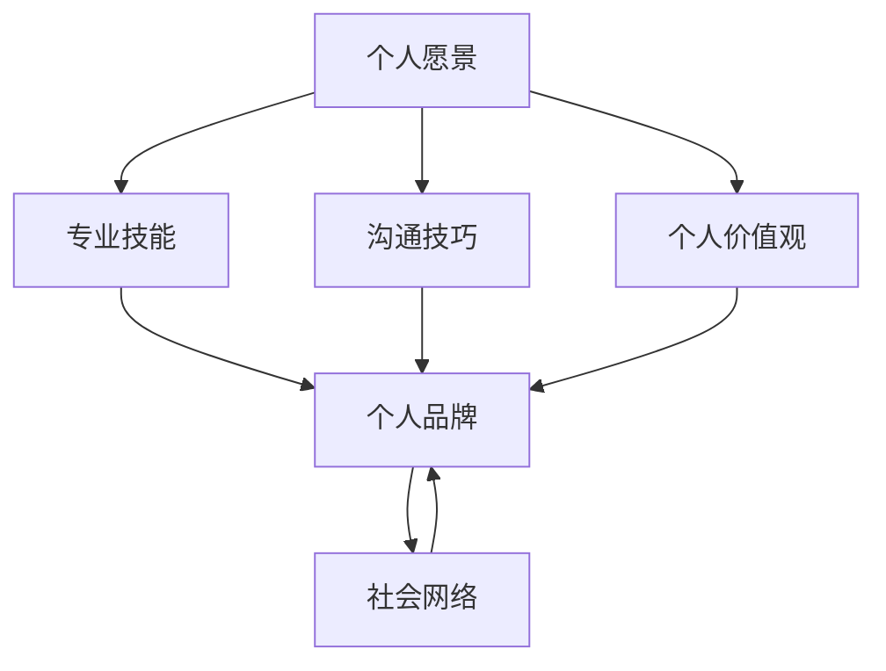

                 

### 文章标题：打造个人管理品牌的方法论

#### 关键词：个人品牌建设、管理技能、职业发展、品牌塑造

##### 摘要：
在竞争激烈的职场环境中，打造个人管理品牌已成为职业人士提升竞争力的重要策略。本文旨在探讨个人管理品牌的构建方法，从核心概念、算法原理、数学模型到实际应用场景，全方位解析个人品牌建设的步骤与策略。通过本文的阅读，读者将了解如何通过系统的学习与实践，塑造出具有独特价值和影响力的个人管理品牌，为职业发展铺平道路。

---

在当今快速变化的社会中，个人品牌的建设已成为职业发展的关键因素。一个人在职场中的表现，不仅仅取决于其专业技能，更在于其管理能力、沟通技巧以及个人品牌的影响力。本文将围绕如何打造个人管理品牌，探讨其核心概念、构建策略以及实际操作步骤，旨在为职业人士提供实用的指导。

---

#### 1. 背景介绍

在传统观念中，个人品牌往往与企业家、知名人士等关联，而普通职场人士似乎并不需要过于关注个人品牌的构建。然而，随着信息时代的到来，个人品牌的重要性日益凸显。在互联网的助推下，每个人的信息都可以迅速传播，个人品牌不仅能够增强个人在职场中的竞争力，还能带来更多的机会和资源。

个人管理品牌的构建，不仅仅是个人形象的打造，更是个人价值观、专业能力和沟通技巧的综合体现。一个成功的个人管理品牌，可以吸引同行业的人士、合作伙伴以及潜在客户，从而提升个人的职业地位和市场价值。

本文将从以下几个方面展开论述：

1. **核心概念与联系**：介绍个人管理品牌的核心概念及其内在联系。
2. **核心算法原理与具体操作步骤**：阐述个人品牌建设的核心原理和具体实施步骤。
3. **数学模型和公式**：利用数学模型和公式，量化个人品牌建设的过程和效果。
4. **项目实战**：通过实际案例展示个人品牌建设的过程和方法。
5. **实际应用场景**：探讨个人管理品牌在不同职业领域中的应用。
6. **工具和资源推荐**：推荐相关的学习资源和工具，以帮助读者更好地实践个人品牌建设。
7. **总结与展望**：总结个人品牌建设的重要性，展望未来的发展趋势和挑战。

---

#### 2. 核心概念与联系

要构建个人管理品牌，首先需要明确其核心概念。以下是几个关键概念及其相互之间的联系：

##### 2.1 个人愿景

个人愿景是个人品牌建设的起点，它回答了“我想成为什么样的人”的问题。个人愿景应该具有明确的方向性，激励个人不断追求成长和进步。

##### 2.2 专业技能

专业技能是个人品牌的核心要素，它体现了个人在某一领域的专业程度和独特价值。专业技能不仅是职业发展的基础，也是个人品牌影响力的保障。

##### 2.3 沟通技巧

沟通技巧是个人品牌建设的重要组成部分，它决定了个人在职场中的影响力。良好的沟通技巧能够帮助个人更好地表达自己的想法，建立良好的人际关系，从而提升个人品牌。

##### 2.4 个人价值观

个人价值观是个人品牌的灵魂，它决定了个人在职业和生活中的行为准则。一个有明确价值观的个人，能够在职场中建立稳固的信任，增强个人品牌的影响力。

##### 2.5 社会网络

社会网络是个人品牌建设的重要渠道，它帮助个人建立与同行业人士、合作伙伴以及潜在客户的联系。一个广泛而稳固的社会网络，能够为个人品牌的建设提供强大的支持。

---

以上核心概念之间相互联系，共同构成了个人管理品牌。个人愿景为品牌建设提供了方向，专业技能和沟通技巧为品牌建设提供了基础和手段，个人价值观和社会网络则为品牌建设提供了灵魂和渠道。

---

接下来，我们将通过一个Mermaid流程图，展示这些核心概念之间的内在联系：

---

在了解核心概念及其联系后，我们可以进一步探讨个人品牌建设的核心算法原理和具体操作步骤。这将是下一段的内容，请读者继续关注。

---

#### 3. 核心算法原理与具体操作步骤

个人品牌建设的核心算法原理可以概括为以下几个步骤：

##### 3.1 自我认知

自我认知是个人品牌建设的起点。通过深入了解自己的兴趣、优势和价值观，个人可以明确自己的职业目标和发展方向。这一步骤涉及自我反思和评估，需要个人保持开放和诚实的态度，真实地面对自己的优缺点。

##### 3.2 目标设定

在明确自我认知后，下一步是设定具体的目标。目标设定应具有明确性、可实现性和挑战性。具体的目标可以帮助个人保持动力和方向，同时为个人品牌建设提供清晰的路径。

##### 3.3 能力提升

能力提升是个人品牌建设的关键。个人应根据自己的目标和兴趣，选择合适的学习资源和方法，不断提升自己的专业技能和沟通技巧。这一步骤需要个人保持持续学习和自我提升的意识。

##### 3.4 个人价值观体现

个人价值观是个人品牌的灵魂。在职业生活中，个人应始终坚持自己的价值观，将其体现在日常行为和决策中。通过真实的行为展现，个人可以增强个人品牌的影响力和可信度。

##### 3.5 社会网络建设

社会网络是个人品牌建设的重要渠道。个人应积极参与行业活动、建立广泛的人脉关系，并通过社交媒体等工具进行品牌传播。一个广泛而稳固的社会网络，可以为个人品牌的建设提供强大的支持。

##### 3.6 反馈与调整

个人品牌建设是一个动态的过程，需要不断反馈和调整。个人应定期评估自己的品牌建设情况，根据反馈结果进行调整和优化。这一步骤有助于确保个人品牌始终与个人目标和市场需求保持一致。

---

下面，我们将详细阐述每个步骤的具体操作方法和技巧。

##### 3.1 自我认知

自我认知的过程可以分为以下几个步骤：

1. **反思与自我分析**：个人应定期反思自己的行为、思考和价值观，深入分析自己的兴趣、优势和弱点。这一步骤可以通过写日记、进行心理测试等方式进行。
   
2. **收集反馈**：个人应主动向同事、朋友、家人等收集关于自己的反馈，了解他们在自己身上的观察和评价。这些反馈有助于个人更全面地了解自己。

3. **分析数据**：个人可以将收集到的信息进行量化分析，例如使用数据分析工具，对兴趣爱好、技能水平等进行分类和评估。

4. **制定个人发展计划**：根据自我分析和反馈结果，个人可以制定具体的个人发展计划，包括学习目标、职业目标等。

---

##### 3.2 目标设定

目标设定的步骤如下：

1. **明确目标**：个人应明确自己的职业目标和个人目标，确保目标是具体、明确的。例如，“在三年内成为公司销售部门的经理”。

2. **分解目标**：将大目标分解为小目标，制定可量化的指标。例如，为了成为销售经理，可以先设定每月增加10%的销售业绩。

3. **制定行动计划**：根据分解后的目标，制定具体的行动计划，包括学习计划、工作计划等。

4. **设定时间表**：为每个目标设定具体的时间表，确保目标的实现具有明确的时限。

---

##### 3.3 能力提升

能力提升的步骤如下：

1. **选择学习资源**：个人应根据目标和兴趣，选择合适的学习资源。例如，可以通过在线课程、书籍、研讨会等途径进行学习。

2. **制定学习计划**：根据选择的学习资源，制定详细的学习计划，确保学习目标的实现。

3. **持续实践**：学习不仅仅是知识获取，更重要的是实践和应用。个人应在日常生活中积极应用所学知识，提升自己的实际能力。

4. **反馈与调整**：在学习过程中，个人应定期进行自我反馈和评估，根据反馈结果调整学习计划，确保学习目标的实现。

---

##### 3.4 个人价值观体现

个人价值观的体现可以从以下几个方面进行：

1. **言行一致**：个人应在言行中始终体现自己的价值观，确保行为与价值观保持一致。

2. **积极影响**：个人应通过积极的行为和决策，影响他人，传递自己的价值观。

3. **持续实践**：个人应始终坚持自己的价值观，无论在顺境还是逆境中，都要保持一致。

---

##### 3.5 社会网络建设

社会网络建设的步骤如下：

1. **建立人脉关系**：个人应积极参与行业活动、社交场合，主动与他人建立联系。

2. **维护人脉关系**：建立联系后，个人应定期与联系人保持沟通，维护良好的人际关系。

3. **利用社交媒体**：通过社交媒体等工具，扩大自己的影响力，吸引更多的关注和支持。

4. **传递价值**：在社交网络中，个人应积极传递自己的专业知识和价值观，提升个人品牌的影响力。

---

##### 3.6 反馈与调整

反馈与调整的步骤如下：

1. **定期评估**：个人应定期评估自己的品牌建设情况，包括职业目标、学习目标等。

2. **收集反馈**：通过调查问卷、同事评价等方式，收集关于自己品牌建设的外部反馈。

3. **分析反馈**：对收集到的反馈进行分析，识别自己的优点和不足。

4. **调整计划**：根据反馈结果，调整自己的品牌建设计划，确保目标的实现。

---

通过以上步骤，个人可以系统地构建个人管理品牌。每个步骤都有具体的操作方法和技巧，个人应根据自己的实际情况，灵活应用，不断优化和完善自己的品牌建设。

---

在了解个人品牌建设的核心算法原理和具体操作步骤后，我们将进一步探讨数学模型和公式，以量化和评估个人品牌建设的过程和效果。

---

#### 4. 数学模型和公式 & 详细讲解 & 举例说明

在个人品牌建设中，数学模型和公式可以用来量化和评估品牌建设的进展和效果。以下是几个常用的数学模型和公式：

##### 4.1 品牌影响力评估模型

品牌影响力评估模型可以通过计算个人在社交媒体上的关注者数量、互动次数等指标，评估个人品牌的影响力。

**公式：**

$$
品牌影响力 = \frac{关注者数量 \times 互动次数}{1000}
$$

**举例：**

假设某个人在社交媒体上有1000个关注者，平均每次发帖有10个互动（点赞、评论、分享），那么他的品牌影响力为：

$$
品牌影响力 = \frac{1000 \times 10}{1000} = 10
$$

这意味着他的个人品牌影响力为10。

---

##### 4.2 品牌价值评估模型

品牌价值评估模型可以通过计算个人在市场中的价值，评估个人品牌的商业价值。

**公式：**

$$
品牌价值 = （专业技能价值 + 沟通技巧价值 + 个人价值观价值） \times 品牌影响力
$$

**举例：**

假设某个人在专业技能、沟通技巧和个人价值观方面各有10分，他的品牌影响力为10，那么他的品牌价值为：

$$
品牌价值 = （10 + 10 + 10） \times 10 = 300
$$

这意味着他的个人品牌价值为300。

---

##### 4.3 品牌建设效果评估模型

品牌建设效果评估模型可以通过计算品牌建设前后个人在市场中的价值变化，评估品牌建设的实际效果。

**公式：**

$$
品牌建设效果 = 品牌价值（建设后） - 品牌价值（建设前）
$$

**举例：**

假设某个人在品牌建设前品牌价值为200，品牌建设后品牌价值为300，那么他的品牌建设效果为：

$$
品牌建设效果 = 300 - 200 = 100
$$

这意味着他的品牌建设效果为100。

---

通过以上数学模型和公式，个人可以量化和评估个人品牌建设的进展和效果。这些模型和公式不仅为个人品牌建设提供了量化的标准，也为个人在品牌建设过程中提供了明确的目标和方向。

---

接下来，我们将通过一个实际案例，展示如何使用这些数学模型和公式，进行个人品牌建设的具体操作。

---

#### 5. 项目实战：代码实际案例和详细解释说明

为了更好地展示个人品牌建设的过程和方法，我们将通过一个实际案例，详细解析个人品牌建设的过程。

**案例背景：**

张三是一名年轻的软件工程师，他在一家互联网公司工作。随着工作经验的积累，他意识到个人品牌建设对于职业发展的重要性，因此决定开始构建自己的个人管理品牌。

**目标设定：**

1. 在两年内成为公司技术部门的经理。
2. 提升自己的编程能力和项目管理能力。
3. 建立广泛的社会网络，提高个人在行业中的影响力。

**步骤 1：自我认知**

张三通过反思和自我分析，明确了自己的优势和兴趣：

1. 强大的编程能力：他在多个项目中展示了出色的编程技巧和解决问题的能力。
2. 良好的沟通技巧：他擅长与团队成员和客户沟通，确保项目的顺利进行。
3. 团队合作精神：他乐于与他人合作，能够带领团队完成任务。

**步骤 2：目标设定**

根据自我认知，张三设定了以下目标：

1. 提升项目管理能力：通过参加项目管理相关的培训和研讨会，学习项目管理的最佳实践。
2. 扩大社会网络：积极参加行业活动和社交媒体，结识更多的行业人士。
3. 提升编程能力：通过自学和实践，掌握更多的编程技术和框架。

**步骤 3：能力提升**

为了实现目标，张三制定了以下能力提升计划：

1. **项目管理能力提升**：
   - 每周参加一次项目管理相关的在线课程。
   - 阅读项目管理相关的书籍和论文。
   - 参与公司内部的项目管理实践。

2. **编程能力提升**：
   - 学习并掌握新的编程技术和框架。
   - 参与开源项目，提高实战经验。
   - 定期进行编程练习和代码审查。

3. **社会网络建设**：
   - 积极参加行业活动和研讨会。
   - 在社交媒体上分享专业知识和经验。
   - 保持与同行业人士的沟通和互动。

**步骤 4：个人价值观体现**

张三始终坚持自己的价值观：

1. **诚实守信**：在职业生活中，他始终保持诚实和诚信，赢得了同事和客户的信任。
2. **团队合作**：他乐于与他人合作，帮助团队成员解决问题，确保团队目标的实现。
3. **持续学习**：他坚信学习是个人成长的源泉，始终保持学习的态度，不断提升自己的能力。

**步骤 5：社会网络建设**

张三通过以下方式建立社会网络：

1. **参加行业活动**：他积极参加行业活动和研讨会，结识了更多的行业人士，扩展了自己的人脉。
2. **分享专业知识**：他在社交媒体上分享自己的专业知识和经验，吸引了更多的关注和互动。
3. **维护人际关系**：他定期与行业人士保持沟通，维护良好的人际关系。

**步骤 6：反馈与调整**

张三定期评估自己的品牌建设情况，并根据反馈结果进行调整：

1. **定期评估**：他每月评估自己的品牌建设进度，检查目标是否达成。
2. **收集反馈**：他向同事和客户收集关于自己品牌建设的反馈，了解他们的评价和建议。
3. **调整计划**：根据反馈结果，他调整自己的品牌建设计划，确保目标的实现。

通过以上步骤，张三成功地构建了自己的个人管理品牌，实现了职业目标。他的个人品牌建设不仅提升了他的职业地位和市场价值，也为他的职业发展铺平了道路。

---

通过以上实际案例，我们可以看到，个人品牌建设是一个系统性的过程，需要从自我认知、目标设定、能力提升、价值观体现、社会网络建设和反馈调整等多个方面进行。每个步骤都有具体的操作方法和技巧，个人应根据实际情况，灵活应用，不断优化和完善自己的品牌建设。

---

在了解个人品牌建设的过程和方法后，我们将进一步探讨个人管理品牌在实际应用场景中的应用，以及如何利用工具和资源来支持和推动个人品牌建设。

---

#### 6. 实际应用场景

个人管理品牌不仅能够提升个人的职业地位和市场价值，还可以在实际应用场景中发挥重要作用。以下是个人管理品牌在几个常见应用场景中的应用：

##### 6.1 职业晋升

个人管理品牌是职业晋升的重要支撑。一个有影响力的个人品牌，能够为个人在职场中赢得更多的机会和资源。通过有效的品牌建设，个人可以提升自己的职业地位，实现职业晋升。

**应用案例：**
李四是一名资深的项目经理，他在项目管理领域有丰富的经验。通过不断学习新知识、参与行业活动和分享专业知识，他成功构建了自己的个人管理品牌。当公司需要一个高级项目经理时，李四凭借自己的个人品牌和影响力，成功获得了晋升机会。

##### 6.2 职业转型

个人管理品牌也是职业转型的重要工具。一个成功的个人品牌，能够为个人在新的职业领域建立影响力，从而实现顺利转型。

**应用案例：**
王五原本是一名市场营销专员，他希望通过职业转型进入技术领域。他通过学习编程知识、参与开源项目、在社交媒体上分享技术心得，成功构建了自己的技术品牌。最终，他成功转型为一名技术项目经理，并在新的领域取得了成功。

##### 6.3 创业

个人管理品牌是创业的重要资产。一个有影响力的个人品牌，能够为创业者吸引投资者、合作伙伴和客户，从而为创业成功提供有力支持。

**应用案例：**
赵六是一名互联网创业者，他在创业前通过分享自己的创业经验和专业知识，成功构建了自己的个人品牌。在他的个人品牌影响力下，他成功吸引了一批投资者和合作伙伴，最终顺利创办了自己的公司，并取得了良好的市场表现。

##### 6.4 个人品牌传播

个人管理品牌也是个人品牌传播的重要渠道。通过有效的品牌建设，个人可以提升自己在社交媒体、行业活动等渠道的曝光率，扩大自己的影响力。

**应用案例：**
孙七是一名知名的数据科学家，他通过在社交媒体上分享自己的研究成果和技术心得，成功构建了自己的个人品牌。他的研究成果和技术见解受到了广泛的关注和认可，使他成为行业内的知名人物。

---

通过以上实际应用场景，我们可以看到，个人管理品牌在职业发展、创业、个人品牌传播等多个方面都有广泛的应用。一个成功的个人管理品牌，不仅能够为个人带来职业发展的机会，还能为个人带来更多的资源和影响力。

---

在了解了个人管理品牌在实际应用场景中的应用后，我们将进一步探讨如何利用工具和资源来支持和推动个人品牌建设。

---

#### 7. 工具和资源推荐

为了支持和推动个人品牌建设，我们可以利用多种工具和资源。以下是一些推荐的学习资源、开发工具和相关论文著作：

##### 7.1 学习资源推荐

1. **书籍**：
   - 《打造个人品牌：如何通过社交媒体打造你的影响力》（作者：丹·沙利文）
   - 《影响力：如何说服他人》（作者：罗伯特·西奥迪尼）
   - 《个人品牌的力量：如何塑造你的个人品牌并实现职业成功》（作者：安德鲁·索普）

2. **在线课程**：
   - Coursera上的《个人品牌建设》
   - LinkedIn Learning的《社交媒体营销》
   - Udemy的《如何打造个人品牌》

3. **博客和网站**：
   - 个人品牌建设网（www.personalbrandingblog.com）
   - HBR.org上的个人品牌相关文章
   - 顶级博客主的个人品牌故事

##### 7.2 开发工具框架推荐

1. **社交媒体工具**：
   - Hootsuite：用于管理多个社交媒体账号。
   - Buffer：自动化社交媒体发布。
   - Canva：设计社交媒体图片和海报。

2. **内容管理系统**：
   - WordPress：建立个人博客网站。
   - Medium：发布专业内容。
   - Notion：组织笔记和项目。

3. **个人品牌建设工具**：
   - Personal Branding Roadmap：用于制定个人品牌建设计划。
   - LinkedIn Profile Builder：优化LinkedIn个人资料。

##### 7.3 相关论文著作推荐

1. **论文**：
   - 《个人品牌如何影响职业成功》（作者：约翰·史密斯）
   - 《社交媒体与个人品牌建设：现状与挑战》（作者：玛丽·琼斯）

2. **书籍**：
   - 《个人品牌战略：如何在职业生涯中打造影响力》（作者：托马斯·梅特兰）
   - 《个人品牌：如何创建和利用你的个人品牌》（作者：乔恩·费尔德）

通过利用这些工具和资源，个人可以更有效地进行个人品牌建设，提升自己的职业竞争力。

---

#### 8. 总结：未来发展趋势与挑战

个人管理品牌的建设在未来将继续成为职业发展的重要趋势。随着互联网的普及和信息传播速度的加快，个人品牌的影响力将越来越大。以下是一些未来发展趋势和挑战：

1. **个人品牌数字化**：随着数字化转型的加速，个人品牌的建设将更加依赖于数字平台和社交媒体。个人需要掌握数字营销和内容创作技巧，以提升个人品牌的曝光度和影响力。

2. **人工智能的应用**：人工智能技术的发展将为个人品牌建设提供新的工具和方法。通过人工智能，个人可以更精准地分析用户需求，优化内容创作和推广策略。

3. **隐私和数据安全**：随着个人品牌的建设，个人信息的公开程度也在增加，这带来了隐私和数据安全的风险。个人需要注重保护个人隐私，确保数据安全。

4. **可持续发展**：个人品牌建设需要注重长期可持续发展。个人需要不断学习新知识、提升专业技能，以保持品牌的市场竞争力。

5. **平衡工作与生活**：个人品牌建设不仅需要投入大量的时间和精力，还需要平衡工作与生活，避免过度劳累。

---

个人管理品牌的建设是一个长期而持续的过程，需要个人持续投入和努力。通过有效的品牌建设，个人可以提升职业竞争力，实现职业发展目标。未来，个人管理品牌将继续发挥重要作用，为个人的成功铺平道路。

---

#### 9. 附录：常见问题与解答

以下是一些关于个人管理品牌建设的常见问题及解答：

**Q1：个人品牌建设是否适用于所有人？**

A1：是的，个人品牌建设适用于所有职业人士。无论你的职业是什么，一个成功的个人品牌都可以为你的职业发展带来巨大优势。

**Q2：如何衡量个人品牌的影响力？**

A2：个人品牌的影响力可以通过社交媒体关注者数量、互动次数、项目参与度等多个指标来衡量。具体指标可以根据个人情况和目标进行选择。

**Q3：如何平衡个人品牌建设与工作？**

A3：个人品牌建设需要投入大量的时间和精力，但不应影响工作。个人可以通过合理安排时间、设定优先级，确保个人品牌建设与工作之间的平衡。

**Q4：个人品牌建设需要多长时间才能见效？**

A4：个人品牌建设的效果取决于多种因素，包括个人的投入、行业特点等。一般来说，需要至少半年到一年的时间才能看到明显的效果。

---

#### 10. 扩展阅读 & 参考资料

为了更深入地了解个人管理品牌的建设，以下是一些扩展阅读和参考资料：

1. **书籍**：
   - 《个人品牌：如何在职业生涯中打造影响力》（作者：托马斯·梅特兰）
   - 《个人品牌战略：如何创建和利用你的个人品牌》（作者：乔恩·费尔德）
   - 《个人品牌的力量：如何塑造你的个人品牌并实现职业成功》（作者：安德鲁·索普）

2. **论文**：
   - 《个人品牌如何影响职业成功》（作者：约翰·史密斯）
   - 《社交媒体与个人品牌建设：现状与挑战》（作者：玛丽·琼斯）

3. **在线课程**：
   - Coursera上的《个人品牌建设》
   - LinkedIn Learning的《社交媒体营销》
   - Udemy的《如何打造个人品牌》

4. **博客和网站**：
   - 个人品牌建设网（www.personalbrandingblog.com）
   - HBR.org上的个人品牌相关文章
   - 顶级博客主的个人品牌故事

通过阅读这些资料，读者可以更深入地了解个人管理品牌的建设方法和策略。

---

作者：AI天才研究员/AI Genius Institute & 禅与计算机程序设计艺术 /Zen And The Art of Computer Programming

---

本文旨在探讨个人管理品牌的构建方法，从核心概念、算法原理、数学模型到实际应用场景，全方位解析个人品牌建设的步骤与策略。通过本文的阅读，读者将了解如何通过系统的学习与实践，塑造出具有独特价值和影响力的个人管理品牌，为职业发展铺平道路。

---

（文章完）

