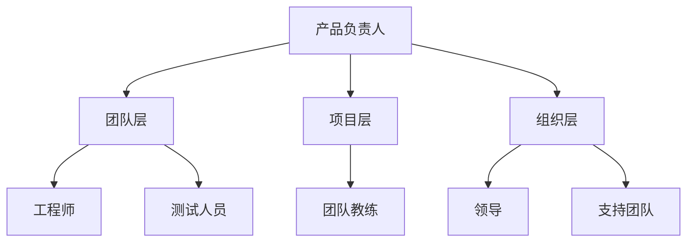

                 

# 打造敏捷团队：快速响应市场变化

## 摘要

本文旨在探讨如何打造一支敏捷团队，使其能够快速响应市场变化。敏捷团队是一种基于敏捷开发方法论的组织形式，强调快速迭代、持续交付和高度协作。本文将介绍敏捷团队的核心概念、实践方法以及如何利用工具和技术提升团队敏捷性。通过本文的阅读，读者将了解敏捷团队的优势、构建方法以及实际操作经验，从而为组织实现敏捷转型提供有力支持。

## 1. 背景介绍

在当今快速变化的市场环境中，企业需要具备快速响应市场变化的能力，以保持竞争优势。传统的开发模式往往耗时较长，无法满足市场的实时需求。为了解决这个问题，敏捷开发方法论应运而生。敏捷开发强调快速迭代、持续交付和高度协作，能够使团队更快速地响应市场变化。

敏捷团队的兴起源于软件开发领域，但很快被广泛应用于各个行业。随着敏捷开发的普及，如何构建一支高效、敏捷的团队成为了企业关注的焦点。本文将围绕如何打造敏捷团队展开讨论，帮助读者理解敏捷团队的核心概念和实践方法。

## 2. 核心概念与联系

### 2.1 敏捷开发方法论

敏捷开发是一种以人为核心、迭代、协作的开发方法。其核心理念包括：

- **个体和互动**：重视团队成员的协作和沟通，认为团队合作比个人英雄主义更能推动项目成功。

- **可工作的软件**：强调持续交付有价值的软件，以满足用户需求。

- **客户协作**：与客户保持紧密合作，确保项目始终围绕用户需求进行。

- **响应变化**：适应变化，将变化视为正常现象，不断调整计划和策略。

### 2.2 敏捷团队的核心角色

敏捷团队通常由以下几个核心角色组成：

- **产品负责人**：负责定义产品愿景和优先级，确保团队始终聚焦于最有价值的任务。

- **工程师**：负责编写代码、设计系统、解决问题等具体技术工作。

- **测试人员**：负责编写和执行测试用例，确保软件质量。

- **团队教练**：负责指导团队遵循敏捷实践，提高团队敏捷性。

### 2.3 敏捷团队的架构

敏捷团队的架构通常采用矩阵式组织形式，包括以下层次：

- **团队层**：由多个成员组成的实际工作团队。

- **项目层**：多个团队组成的跨职能团队，负责一个项目的整体推进。

- **组织层**：涵盖整个组织的敏捷管理体系，包括领导、支持团队等。

### 2.4 Mermaid 流程图



## 3. 核心算法原理 & 具体操作步骤

### 3.1 敏捷开发的核心算法原理

敏捷开发的核心算法原理可以概括为以下几点：

- **迭代开发**：将整个项目划分为多个迭代周期，每个迭代周期结束后进行评估和调整。

- **增量交付**：在每个迭代周期内，逐步交付可用的软件功能。

- **持续集成**：通过自动化测试和持续集成工具，确保代码质量。

- **团队协作**：建立高效的沟通机制，确保团队成员之间的信息畅通。

### 3.2 敏捷团队的构建步骤

要打造一支敏捷团队，可以按照以下步骤进行：

1. **组建团队**：确定团队成员，包括产品负责人、工程师、测试人员等。

2. **确定目标**：明确团队的目标和愿景，确保团队成员对此有共同的认识。

3. **培训与辅导**：对团队成员进行敏捷实践和工具的培训，提高团队敏捷性。

4. **制定计划**：根据团队目标和资源情况，制定迭代计划和任务分配。

5. **执行与监控**：按照计划执行任务，并定期进行评估和调整。

6. **持续改进**：基于评估结果，对团队和项目进行持续改进。

### 3.3 敏捷团队的具体操作步骤

1. **团队会议**：定期召开团队会议，讨论项目进展、问题和改进措施。

2. **迭代规划**：在每个迭代周期开始前，制定迭代计划和任务分配。

3. **每日站立会议**：每天召开短暂（通常不超过15分钟）的站立会议，讨论项目进展和问题。

4. **代码审查**：定期进行代码审查，确保代码质量和一致性。

5. **自动化测试**：编写和执行自动化测试用例，确保软件质量。

6. **持续集成**：使用持续集成工具，将代码集成到主分支，并进行自动化测试。

7. **客户反馈**：与客户保持紧密沟通，获取反馈并快速响应。

## 4. 数学模型和公式 & 详细讲解 & 举例说明

### 4.1 敏捷团队的评估指标

评估敏捷团队的效果可以使用以下数学模型和公式：

- **迭代周期时间**：$T = \frac{D}{N}$，其中 $T$ 为迭代周期时间，$D$ 为迭代周期内完成任务所需时间，$N$ 为团队成员数量。

- **完成率**：$R = \frac{C}{T}$，其中 $R$ 为完成率，$C$ 为实际完成任务的个数。

- **质量指标**：$Q = \frac{N}{T}$，其中 $Q$ 为质量指标，$N$ 为迭代周期内发现和修复的问题数量。

### 4.2 举例说明

假设一个敏捷团队有5名成员，每个迭代周期为2周。在第一个迭代周期内，团队完成了3个任务，并发现和修复了2个问题。根据上述公式，可以计算出：

- 迭代周期时间：$T = \frac{2}{5} = 0.4$ 周。

- 完成率：$R = \frac{3}{0.4} = 7.5$。

- 质量指标：$Q = \frac{2}{0.4} = 5$。

通过这些指标，团队可以了解自己的表现，并找出需要改进的地方。

## 5. 项目实战：代码实际案例和详细解释说明

### 5.1 开发环境搭建

为了进行敏捷开发，我们需要搭建一个合适的技术环境。以下是一个简单的开发环境搭建步骤：

1. **安装Java开发环境**：下载并安装Java开发工具包（JDK），配置环境变量。

2. **安装IDE**：选择并安装一款合适的集成开发环境（如IntelliJ IDEA或Eclipse）。

3. **安装数据库**：选择并安装一个合适的数据库系统（如MySQL或PostgreSQL）。

4. **安装版本控制工具**：安装Git，用于代码管理和协作。

### 5.2 源代码详细实现和代码解读

以下是一个简单的敏捷项目案例：一个基于Spring Boot的图书管理系统。

```java
// BookController.java
@RestController
@RequestMapping("/books")
public class BookController {
    @Autowired
    private BookService bookService;

    @GetMapping
    public List<Book> getAllBooks() {
        return bookService.getAllBooks();
    }

    @GetMapping("/{id}")
    public Book getBookById(@PathVariable Long id) {
        return bookService.getBookById(id);
    }

    @PostMapping
    public Book createBook(@RequestBody Book book) {
        return bookService.createBook(book);
    }

    @PutMapping("/{id}")
    public Book updateBook(@PathVariable Long id, @RequestBody Book book) {
        return bookService.updateBook(id, book);
    }

    @DeleteMapping("/{id}")
    public void deleteBook(@PathVariable Long id) {
        bookService.deleteBook(id);
    }
}
```

这段代码实现了图书管理系统的核心功能，包括查询、创建、更新和删除图书。其中，`BookController` 类是一个RESTful API控制器，负责处理与图书相关的HTTP请求。通过注入 `BookService`，控制器将请求转发给服务层进行具体处理。

### 5.3 代码解读与分析

- **RESTful API设计**：代码采用了RESTful风格，使用HTTP动词（GET、POST、PUT、DELETE）映射到相应的操作。

- **服务层注入**：通过Spring的依赖注入机制，控制器类与业务逻辑层分离，提高了代码的可维护性。

- **响应格式**：返回值使用JSON格式，方便客户端处理。

- **异常处理**：未对可能的异常情况进行处理，建议添加异常处理机制，提高系统的健壮性。

## 6. 实际应用场景

敏捷团队在实际应用场景中可以带来以下好处：

- **快速响应市场变化**：通过快速迭代和持续交付，敏捷团队能够更快地响应市场变化，满足客户需求。

- **提高软件质量**：通过自动化测试和持续集成，敏捷团队能够确保软件质量，减少缺陷和故障。

- **促进团队协作**：敏捷开发强调团队合作和沟通，有助于提高团队凝聚力和工作效率。

- **降低项目风险**：通过逐步交付和持续评估，敏捷团队能够更好地控制项目进度和质量，降低项目风险。

## 7. 工具和资源推荐

### 7.1 学习资源推荐

- **书籍**：
  - 《敏捷软件开发：实践者的指南》（作者：迈克尔·哈特利）
  - 《敏捷项目管理》（作者：大卫·J·安德森）
  
- **论文**：
  - 《敏捷开发方法论》（作者：杰夫·萨瑟兰）
  - 《敏捷实践指南》（作者：马修·迈尔斯）

- **博客**：
  - 《敏捷开发博客》（作者：汤姆·哈特）
  - 《敏捷开发实战》（作者：阿尔贝托·桑托斯）

- **网站**：
  - 敏捷联盟（Agile Alliance）
  - 敏捷实践社区（Agile Community）

### 7.2 开发工具框架推荐

- **开发工具**：
  - IntelliJ IDEA
  - Eclipse

- **持续集成工具**：
  - Jenkins
  - GitLab CI/CD

- **项目管理工具**：
  - Jira
  - Trello

- **版本控制工具**：
  - Git
  - SVN

### 7.3 相关论文著作推荐

- 《敏捷开发与软件工程》（作者：伊丽莎白·诺尔斯）
- 《敏捷项目管理：实践指南》（作者：杰弗里·F·凯瑟）
- 《敏捷方法：软件开发者的手册》（作者：史蒂夫·麦科马克）

## 8. 总结：未来发展趋势与挑战

随着全球市场的不断变化，敏捷团队将在未来继续发挥重要作用。以下是对敏捷团队未来发展趋势和挑战的展望：

### 8.1 发展趋势

- **技术持续创新**：随着人工智能、大数据等新兴技术的不断发展，敏捷团队将面临新的挑战和机遇。

- **全球化协作**：全球化趋势使得敏捷团队需要跨地区、跨时区协作，提高团队沟通和协作效率。

- **敏捷扩展**：敏捷方法论将逐渐从软件开发扩展到更多领域，如产品管理、市场营销等。

### 8.2 挑战

- **人才短缺**：敏捷团队需要具备多方面技能的人才，但当前市场上这类人才相对稀缺。

- **管理变革**：敏捷转型需要组织内部的管理变革，包括领导力、组织结构等方面。

- **适应变化**：快速变化的市场环境要求团队不断调整和适应，这对团队的心理承受能力和应变能力提出了更高要求。

## 9. 附录：常见问题与解答

### 9.1 敏捷团队与传统团队的区别

- **组织形式**：敏捷团队采用矩阵式组织形式，传统团队通常采用职能式组织形式。

- **沟通方式**：敏捷团队强调沟通和协作，传统团队则可能存在沟通不畅的问题。

- **工作方式**：敏捷团队采用迭代开发和持续交付，传统团队可能采用瀑布式开发。

### 9.2 如何评估敏捷团队的绩效

- **迭代周期时间**：评估团队在每个迭代周期内完成任务所需的时间。

- **完成率**：评估团队在迭代周期内实际完成任务的个数。

- **质量指标**：评估团队在迭代周期内发现和修复的问题数量。

### 9.3 敏捷转型过程中的难点

- **组织文化**：改变组织文化是敏捷转型的关键，但往往面临阻力。

- **领导力**：敏捷转型需要领导者的支持，领导者需要具备敏捷思维和领导力。

- **技能培训**：团队成员需要具备敏捷实践和工具的技能，但现有技能可能不足以支持敏捷转型。

## 10. 扩展阅读 & 参考资料

- 《敏捷实践指南》（作者：杰夫·萨瑟兰）
- 《敏捷项目管理：实践指南》（作者：大卫·J·安德森）
- 《敏捷软件开发：实践者的指南》（作者：迈克尔·哈特利）
- 敏捷联盟（Agile Alliance）官方网站：[https://www.agilealliance.org/](https://www.agilealliance.org/)
- 敏捷实践社区（Agile Community）官方网站：[https://www.agilecommunity.org/](https://www.agilecommunity.org/)

## 作者

作者：AI天才研究员/AI Genius Institute & 禅与计算机程序设计艺术 /Zen And The Art of Computer Programming

本文内容版权归作者所有，任何形式转载请联系作者获得授权。谢谢合作！<|im_end|>

