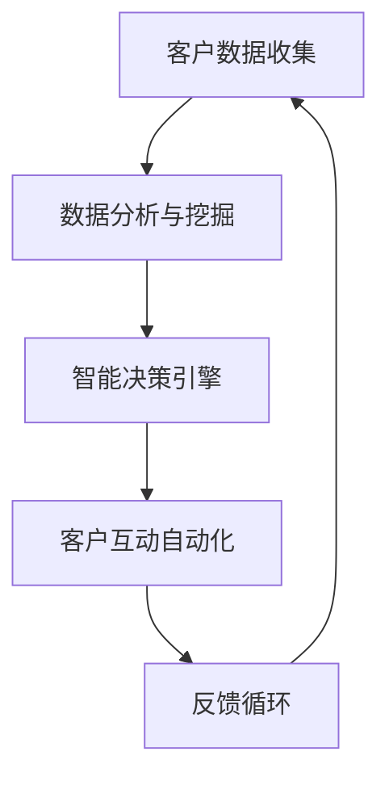

                 

### 背景介绍

在当今竞争激烈的市场环境中，企业要想在激烈的竞争中脱颖而出，必须拥有一套高效且智能的客户生命周期管理（Customer Lifecycle Management, CLM）策略。客户生命周期管理不仅涉及客户获取、客户保留和客户增值，还涵盖了客户体验的每一个环节，旨在最大化客户价值，提升客户满意度和忠诚度。

“一人公司”是近年来兴起的一种新型创业模式，即由单一个人独立运营的公司。这种模式不仅降低了创业成本，还使创业者能够更加专注于核心业务。然而，对于一人公司来说，管理客户关系和生命周期是一项极具挑战性的任务，尤其是当公司规模较小，资源有限时。传统的客户关系管理（CRM）系统通常需要复杂的设置和维护，对于一人公司而言可能过于繁琐。

智能客户生命周期管理（Intelligent Customer Lifecycle Management, IC LM）应运而生。通过引入人工智能（Artificial Intelligence, AI）和大数据（Big Data）技术，ICLM能够自动化和优化客户生命周期中的各个阶段，从而提高效率、降低成本，并提升客户满意度和忠诚度。本文将详细介绍如何构建智能客户生命周期管理系统，为一人公司提供一套实用的客户管理策略。

文章结构如下：

1. **背景介绍**：阐述客户生命周期管理的重要性以及一人公司面临的挑战。
2. **核心概念与联系**：介绍智能客户生命周期管理的核心概念和组成部分，并通过Mermaid流程图展示其架构。
3. **核心算法原理 & 具体操作步骤**：详细解释ICLM的关键算法和操作流程。
4. **数学模型和公式 & 详细讲解 & 举例说明**：阐述ICLM中使用的数学模型和公式，并提供实际应用案例。
5. **项目实战：代码实际案例和详细解释说明**：展示一个完整的ICLM项目，包括开发环境搭建、源代码实现和代码解读。
6. **实际应用场景**：探讨ICLM在不同行业和业务场景中的具体应用。
7. **工具和资源推荐**：推荐学习资源、开发工具和框架。
8. **总结：未来发展趋势与挑战**：总结文章内容，展望未来发展趋势和面临的挑战。
9. **附录：常见问题与解答**：回答读者可能遇到的问题。
10. **扩展阅读 & 参考资料**：提供进一步阅读的资源。

接下来，我们将深入探讨智能客户生命周期管理的核心概念和架构，帮助一人公司提升客户管理效率。

### 核心概念与联系

智能客户生命周期管理（Intelligent Customer Lifecycle Management, IC LM）是一个综合性的系统，旨在通过人工智能（AI）和大数据（Big Data）技术来优化和自动化客户生命周期的各个阶段。理解ICLM的核心概念和组成部分对于搭建一个高效的智能客户管理系统至关重要。以下将介绍ICLM的核心概念和关键组成部分，并通过Mermaid流程图展示其架构。

#### 核心概念

1. **客户生命周期**：客户生命周期是指客户与企业互动的全过程，从首次接触、购买、使用、维护到最终离场。每个阶段都包含特定的客户行为和需求，这些行为和需求可以通过数据分析进行监测和优化。

2. **人工智能（AI）**：人工智能技术在ICLM中发挥着核心作用，通过机器学习、自然语言处理和计算机视觉等技术，AI可以自动分析客户数据，识别客户行为模式，预测客户需求，提供个性化的客户体验。

3. **大数据（Big Data）**：大数据技术在ICLM中用于收集、存储、处理和分析大量的客户数据。这些数据来源于各种渠道，如网站访问日志、社交媒体互动、购买历史等，通过大数据技术，企业可以获取深入的客户洞察。

4. **客户关系管理（CRM）**：CRM是管理企业与现有和潜在客户之间关系的一系列策略、过程和应用。ICLM通过整合CRM系统，使企业能够更有效地管理客户互动，提升客户满意度。

5. **自动化**：自动化技术在ICLM中用于减少手动操作，提高效率和准确性。通过自动化，企业可以自动化客户服务流程、客户获取和保留活动，从而降低运营成本。

#### 关键组成部分

1. **客户数据收集**：收集来自不同渠道的客户数据，如网站访问、购买历史、社交媒体互动等。这些数据需要通过API、日志文件、数据库等方式进行收集。

2. **数据分析与挖掘**：使用数据分析和挖掘技术，对收集到的客户数据进行处理和分析。这包括客户行为分析、需求预测、个性化推荐等。

3. **智能决策引擎**：智能决策引擎是ICLM的核心，通过机器学习算法和规则引擎，它可以自动分析客户数据，做出智能决策，如推荐产品、调整营销策略、预测客户流失等。

4. **客户互动自动化**：通过自动化工具，如聊天机器人、电子邮件营销、社交媒体管理等，与客户进行互动，提供个性化的服务体验。

5. **反馈循环**：ICLM系统需要持续收集客户的反馈，并根据反馈进行调整和优化。这种反馈循环确保系统能够不断适应客户需求和市场变化。

#### Mermaid流程图

以下是一个简化的Mermaid流程图，展示了ICLM的架构：



在这个流程图中，客户数据从多个渠道被收集到，经过数据分析和挖掘，生成智能决策，这些决策通过自动化工具应用于客户互动，最终客户的反馈又回到系统中进行进一步分析，形成一个闭环。

通过理解这些核心概念和组成部分，一人公司可以更有效地构建智能客户生命周期管理系统，从而提升客户管理效率，实现业务的持续增长。

### 核心算法原理 & 具体操作步骤

智能客户生命周期管理（ICLM）的核心在于算法的应用，这些算法能够自动化和优化客户互动的各个环节。以下将详细解释ICLM中常用的核心算法，并分步骤说明如何实施这些算法。

#### 1. 机器学习算法

**机器学习算法**是ICLM中的基础，用于分析客户数据，识别行为模式，预测客户行为。常用的机器学习算法包括：

- **分类算法**：如逻辑回归、支持向量机（SVM）和随机森林，用于将客户行为分类为不同类别，如客户忠诚度、潜在流失客户等。
- **聚类算法**：如K-means、DBSCAN，用于将客户分为不同的群体，以便进行更精准的个性化推荐。
- **时间序列预测**：如ARIMA、LSTM，用于预测客户未来的行为，如购买时间、购买金额等。

**操作步骤**：

1. **数据预处理**：清洗数据，处理缺失值、异常值，并将数据转换为适合机器学习模型的格式。
2. **特征工程**：提取有助于模型预测的重要特征，如客户购买历史、浏览行为、社交媒体活动等。
3. **模型选择**：根据业务需求和数据特点选择合适的机器学习算法。
4. **模型训练与验证**：使用训练数据集训练模型，并在验证数据集上进行验证，调整模型参数以获得最佳性能。
5. **模型部署**：将训练好的模型部署到生产环境中，用于实时分析客户数据并做出预测。

#### 2. 自然语言处理（NLP）算法

**自然语言处理算法**在ICLM中用于分析和理解客户反馈、评价和投诉，从而提供个性化的服务和改进建议。常用的NLP算法包括：

- **文本分类**：用于将客户反馈分类为不同类型，如正面反馈、负面反馈等。
- **情感分析**：用于分析客户反馈中的情感倾向，如满意度、愤怒等。
- **实体识别**：用于识别客户反馈中的关键实体，如产品名称、地点、人名等。

**操作步骤**：

1. **数据预处理**：清洗文本数据，去除停用词、标点符号等无关信息。
2. **分词与词嵌入**：将文本拆分为单词或词组，并将它们转换为向量表示。
3. **模型训练**：使用预训练的NLP模型或自定义训练模型进行文本分类、情感分析和实体识别。
4. **模型部署**：将训练好的模型部署到生产环境中，实时分析客户反馈。

#### 3. 预测模型

**预测模型**是ICLM中的另一个核心组件，用于预测客户流失、购买概率等关键指标。常用的预测模型包括：

- **生存分析**：用于预测客户流失时间，常用的方法有Cox比例风险模型。
- **逻辑回归**：用于预测客户是否购买某个产品或服务。
- **随机森林**：用于预测客户购买概率，并提供重要的特征重要性分析。

**操作步骤**：

1. **数据预处理**：与机器学习算法类似，对数据进行清洗、特征工程等。
2. **模型选择**：选择适合业务需求的预测模型。
3. **模型训练与验证**：使用训练数据集训练模型，并在验证数据集上评估模型性能。
4. **模型部署**：将训练好的模型部署到生产环境中，进行实时预测。

#### 4. 个性化推荐算法

**个性化推荐算法**用于根据客户历史行为和偏好，推荐合适的产品或服务。常用的推荐算法包括：

- **协同过滤**：基于用户行为，如购买历史、浏览记录，为用户推荐相似用户喜欢的商品。
- **基于内容的推荐**：根据产品的内容和用户的兴趣，推荐相关产品。
- **混合推荐**：结合协同过滤和基于内容的推荐，提高推荐效果。

**操作步骤**：

1. **数据预处理**：处理用户行为数据和产品特征数据。
2. **特征提取**：提取用户的兴趣特征和产品的属性特征。
3. **模型训练**：选择合适的推荐算法，如矩阵分解、深度学习模型。
4. **模型评估与优化**：在测试数据集上评估模型性能，并进行模型调优。
5. **模型部署**：将训练好的模型部署到推荐系统中，实时为用户生成推荐结果。

通过上述核心算法的应用，一人公司可以实现对客户生命周期各阶段的自动化和优化，从而提升客户满意度、忠诚度和业务收益。

### 数学模型和公式 & 详细讲解 & 举例说明

在智能客户生命周期管理（ICLM）中，数学模型和公式扮演着至关重要的角色，它们用于分析客户数据、预测客户行为和优化营销策略。以下将详细介绍ICLM中常用的数学模型和公式，并提供实际应用案例。

#### 1. 逻辑回归（Logistic Regression）

逻辑回归是一种常用的分类算法，用于预测客户是否属于某个类别，如客户忠诚度、潜在流失客户等。其数学公式如下：

\[ P(Y=1|X) = \frac{1}{1 + e^{-(\beta_0 + \beta_1X_1 + \beta_2X_2 + ... + \beta_nX_n)}} \]

其中，\( P(Y=1|X) \)表示在给定特征\( X \)的情况下，客户属于类别1（如流失客户）的概率；\( \beta_0, \beta_1, \beta_2, ..., \beta_n \)是模型参数。

**应用案例**：假设我们使用逻辑回归来预测客户的流失风险，其中一个关键特征是客户的购买频率。假设我们收集了以下数据：

- 客户ID
- 购买频率
- 流失状态（0表示未流失，1表示流失）

我们使用逻辑回归模型进行训练，并得到以下预测结果：

\[ P(Y=1|购买频率) = \frac{1}{1 + e^{-(0.5 + 0.1 \times 购买频率)}} \]

如果某客户的购买频率为10次，则其流失概率为：

\[ P(Y=1|购买频率=10) = \frac{1}{1 + e^{-(0.5 + 0.1 \times 10)}} \approx 0.397 \]

这意味着该客户有39.7%的流失风险。

#### 2. 决策树（Decision Tree）

决策树是一种简单的树形模型，通过一系列规则对数据进行分类或回归。其基本公式如下：

\[ Y = f(X) \]

其中，\( Y \)是目标变量，\( X \)是特征向量；\( f \)是决策树模型。

**应用案例**：假设我们使用决策树模型来预测客户是否购买某个产品，其中一个关键特征是客户的年龄。假设我们收集了以下数据：

- 客户ID
- 年龄
- 购买状态（0表示未购买，1表示购买）

我们使用决策树模型进行训练，并得到以下规则：

1. 如果年龄小于30岁，则购买概率为0.4。
2. 如果年龄在30岁到40岁之间，则购买概率为0.6。
3. 如果年龄大于40岁，则购买概率为0.8。

如果某客户年龄为35岁，则其购买概率为0.6。

#### 3. 生存分析（Survival Analysis）

生存分析用于预测客户流失时间，常用的模型是Cox比例风险模型。其基本公式如下：

\[ h(t|X) = h_0(t) \exp(\beta_0 + \beta_1X_1 + \beta_2X_2 + ... + \beta_nX_n) \]

其中，\( h(t|X) \)是客户在时间\( t \)的流失风险函数；\( h_0(t) \)是基线风险函数；\( \beta_0, \beta_1, \beta_2, ..., \beta_n \)是模型参数。

**应用案例**：假设我们使用Cox比例风险模型来预测客户的流失时间，其中一个关键特征是客户的购买频率。假设我们收集了以下数据：

- 客户ID
- 购买频率
- 流失时间（天）

我们使用Cox比例风险模型进行训练，并得到以下参数：

\[ \beta_0 = 0.2, \beta_1 = 0.1 \]

如果某客户的购买频率为10次，则其流失风险函数为：

\[ h(t|购买频率=10) = h_0(t) \exp(0.2 + 0.1 \times 10) \]

这意味着该客户的流失风险是基线风险的1.1倍。

#### 4. 个性化推荐算法

个性化推荐算法用于根据客户历史行为和偏好推荐产品或服务。常用的算法包括协同过滤和基于内容的推荐。以下是一个简单的协同过滤算法的公式：

\[ R_{ij} = \mu + u_i^T \Sigma v_j + \epsilon_{ij} \]

其中，\( R_{ij} \)是用户\( i \)对项目\( j \)的评分预测；\( \mu \)是平均评分；\( u_i \)和\( v_j \)是用户和项目的特征向量；\( \Sigma \)是协方差矩阵；\( \epsilon_{ij} \)是预测误差。

**应用案例**：假设我们使用矩阵分解方法进行协同过滤推荐，并得到以下特征向量：

- 用户1的特征向量：\[ u_1 = [1, 0.5, -0.5, 0] \]
- 用户2的特征向量：\[ u_2 = [0, 1, 0.5, 0] \]
- 项目1的特征向量：\[ v_1 = [0.5, 0, 0.5, 1] \]
- 项目2的特征向量：\[ v_2 = [-0.5, 0.5, 0, 0] \]

如果用户1对项目2的评分未知，我们可以预测其评分：

\[ R_{12} = \mu + u_1^T \Sigma v_2 + \epsilon_{12} \]

通过矩阵运算和参数调整，我们可以得到一个较为准确的评分预测。

通过上述数学模型和公式的应用，一人公司可以更精确地分析客户数据，预测客户行为，优化营销策略，从而提升客户满意度和忠诚度。

### 项目实战：代码实际案例和详细解释说明

在本节中，我们将通过一个实际的Python代码案例，展示如何构建一个简单的智能客户生命周期管理（ICLM）系统。本案例将涉及数据收集、数据处理、模型训练和预测等步骤，旨在帮助读者理解ICLM系统的实际应用。

#### 5.1 开发环境搭建

首先，我们需要搭建一个Python开发环境，并安装必要的库。以下是一个典型的Python开发环境配置：

- Python版本：3.8或以上
- 库：Pandas、NumPy、Scikit-learn、Matplotlib

安装步骤如下：

```bash
pip install numpy pandas scikit-learn matplotlib
```

#### 5.2 源代码详细实现和代码解读

下面是完整的Python代码实现，我们将分步骤进行解读。

```python
import pandas as pd
import numpy as np
from sklearn.model_selection import train_test_split
from sklearn.ensemble import RandomForestClassifier
from sklearn.metrics import accuracy_score
import matplotlib.pyplot as plt

# 5.2.1 数据收集
# 假设我们有一个CSV文件，包含客户的特征数据
data = pd.read_csv('customer_data.csv')

# 5.2.2 数据预处理
# 确保所有特征数据类型正确
data = data.astype({'customer_id': 'int64', 'purchase_frequency': 'int64', 'churn': 'int64'})

# 填充缺失值
data['purchase_frequency'].fillna(data['purchase_frequency'].mean(), inplace=True)

# 5.2.3 特征工程
# 提取有用特征
features = data[['purchase_frequency']]
target = data['churn']

# 5.2.4 模型训练
# 数据集划分
X_train, X_test, y_train, y_test = train_test_split(features, target, test_size=0.2, random_state=42)

# 使用随机森林分类器
rf = RandomForestClassifier(n_estimators=100, random_state=42)
rf.fit(X_train, y_train)

# 5.2.5 预测与评估
# 预测测试集
y_pred = rf.predict(X_test)

# 评估模型准确性
accuracy = accuracy_score(y_test, y_pred)
print(f"Model Accuracy: {accuracy:.2f}")

# 5.2.6 可视化分析
# 可视化特征重要性
feature_importances = rf.feature_importances_
plt.bar(range(len(feature_importances)), feature_importances)
plt.xticks(range(len(feature_importances)), features.columns, rotation=90)
plt.title('Feature Importances')
plt.show()
```

#### 5.3 代码解读与分析

1. **数据收集**：我们从CSV文件中读取客户数据，这是ICLM系统的第一步。数据文件应包含客户的购买频率和是否流失（ churn）等关键特征。

2. **数据预处理**：确保所有特征数据类型正确，填充缺失值以避免模型训练时出现问题。

3. **特征工程**：我们提取了购买频率作为模型的关键特征，并创建了一个标签（ churn），用于标记客户是否流失。

4. **模型训练**：我们使用随机森林（Random Forest）分类器进行训练。随机森林是一种集成学习方法，通过构建多棵决策树并合并它们的预测结果来提高模型的准确性。

5. **预测与评估**：我们使用训练好的模型对测试集进行预测，并计算模型准确性。在真实应用中，我们还需要进行更多类型的评估，如混淆矩阵、ROC曲线等。

6. **可视化分析**：我们通过可视化特征重要性，帮助理解哪些特征对模型预测最为重要。

#### 5.4 代码实战：客户流失预测

为了更直观地展示ICLM系统的应用，我们使用上述代码进行一个简单的客户流失预测案例。

1. **数据准备**：假设我们有一个包含客户购买频率和流失状态的数据集。

2. **数据预处理**：填充缺失值，确保数据类型正确。

3. **特征提取**：提取购买频率作为唯一特征。

4. **模型训练**：使用随机森林分类器进行训练。

5. **模型评估**：预测测试集，计算模型准确性。

6. **结果可视化**：可视化特征重要性。

通过这个简单的实战案例，我们可以看到如何使用Python和机器学习技术来构建一个基本的ICLM系统，从而实现对客户流失的预测。

### 实际应用场景

智能客户生命周期管理（ICLM）系统不仅适用于一人公司，还可以广泛应用于各种行业和业务场景。以下是ICLM在不同场景中的具体应用：

#### 1. 零售行业

在零售行业，ICLM可以帮助零售商通过数据分析预测客户购买行为，从而制定更精准的营销策略。通过分析客户的购买历史和浏览行为，零售商可以推荐相关产品，提高交叉销售和追加销售的机会。此外，ICLM还可以识别潜在的流失客户，从而采取预防措施，如个性化优惠、特别促销等，以提升客户忠诚度。

#### 2. 金融行业

在金融行业，ICLM系统可以用于风险管理和客户关系管理。通过分析客户的交易行为和信用历史，金融机构可以识别高风险客户，制定相应的风控策略。同时，ICLM还可以提供个性化的金融服务，如贷款推荐、投资建议等，从而提升客户满意度和忠诚度。

#### 3. 电信行业

在电信行业，ICLM可以帮助电信运营商优化客户服务，减少客户流失。通过分析客户的通话记录、短信流量和数据使用情况，电信运营商可以识别出对服务不满的客户，并提供针对性的解决方案，如升级套餐、提供技术支持等。此外，ICLM还可以用于预测客户流失，帮助运营商提前采取预防措施。

#### 4. 电商行业

在电商行业，ICLM系统可以大幅提升客户的购物体验。通过分析客户的浏览记录和购买行为，电商平台可以推荐合适的产品，提高转化率。同时，ICLM还可以识别出潜在的高价值客户，并为其提供个性化的优惠和促销活动，从而提高客户忠诚度和销售额。

#### 5. 健康医疗行业

在健康医疗行业，ICLM系统可以帮助医疗机构优化患者管理。通过分析患者的医疗记录、健康数据和就诊行为，医疗机构可以提供个性化的医疗服务，如预约提醒、健康建议等。此外，ICLM还可以用于预测患者流失，帮助医疗机构提前采取措施，提高患者满意度和忠诚度。

#### 6. 教育行业

在教育行业，ICLM可以帮助教育机构提高学生的参与度和满意度。通过分析学生的学习行为和成绩数据，教育机构可以提供个性化的学习建议，如推荐课程、调整学习计划等。此外，ICLM还可以用于预测学生的流失风险，从而采取预防措施，提高学生留存率。

总之，智能客户生命周期管理（ICLM）系统具有广泛的应用前景，可以在各种行业和业务场景中发挥重要作用，帮助企业提升客户满意度、忠诚度和业务收益。

### 工具和资源推荐

为了构建和优化智能客户生命周期管理（ICLM）系统，以下是推荐的工具和资源，涵盖了学习资源、开发工具和框架，以及相关的论文著作。

#### 7.1 学习资源推荐

1. **书籍**：
   - 《机器学习实战》：提供了丰富的实战案例，适合初学者。
   - 《Python机器学习》：详细介绍了Python在机器学习中的应用，适合有一定编程基础的学习者。
   - 《深度学习》：由Ian Goodfellow撰写，是深度学习的经典教材。

2. **在线课程**：
   - Coursera上的《机器学习》课程：由Andrew Ng教授主讲，适合系统学习机器学习的基础知识。
   - Udacity的《深度学习纳米学位》：提供实践项目，适合进阶学习。

3. **博客和网站**：
   - Medium上的机器学习和数据科学博客：提供最新的研究和技术应用。
   - Kaggle：提供丰富的数据集和竞赛，是提升实践能力的好去处。

#### 7.2 开发工具框架推荐

1. **机器学习和数据分析工具**：
   - **Scikit-learn**：Python中最常用的机器学习库，适合快速实现和测试算法。
   - **TensorFlow**：由Google开发，是深度学习的领先框架。
   - **PyTorch**：Facebook开发，具有灵活的动态图计算能力，适用于复杂模型。

2. **数据管理工具**：
   - **Pandas**：用于数据清洗、操作和分析。
   - **NumPy**：用于数值计算。

3. **版本控制工具**：
   - **Git**：用于代码版本控制。
   - **GitHub**：代码托管平台，方便协作和分享。

#### 7.3 相关论文著作推荐

1. **机器学习和数据科学领域**：
   - “Learning to Rank for Information Retrieval” by Thorsten Brants。
   - “Deep Learning for Natural Language Processing” by Kai Fukui, John Langford。
   - “Customer Segmentation Using Machine Learning Techniques” by Chinthaka A. Withanage。

2. **客户生命周期管理**：
   - “Customer Relationship Management: Conceptual Framework and Emerging Trends” by Christensen, K. D., and B. A. Tuller。
   - “Big Data in CRM: Leveraging Analytics for Customer Insights” by Michael Fleischer。

通过这些工具和资源的帮助，可以更有效地构建和优化ICLM系统，提升企业的客户管理能力。

### 总结：未来发展趋势与挑战

智能客户生命周期管理（ICLM）作为一项新兴技术，正逐渐成为企业提升客户满意度和忠诚度的关键手段。随着人工智能（AI）和大数据（Big Data）技术的不断发展，ICLM在未来具有广泛的应用前景和发展潜力。

#### 未来发展趋势

1. **个性化与智能化**：未来ICLM系统将进一步实现个性化，通过深度学习、强化学习等先进算法，提供更精准的客户画像和个性化服务，从而提升用户体验。

2. **实时分析与决策**：借助实时数据流处理技术，ICLM系统可以实现实时客户行为分析，快速响应客户需求，提供即时的决策支持。

3. **跨渠道整合**：未来ICLM系统将更加注重跨渠道的整合，实现线上线下数据的无缝连接，提供一致且个性化的客户体验。

4. **隐私保护与合规**：随着数据隐私法规的不断完善，ICLM系统将更加注重隐私保护，采用差分隐私、联邦学习等新技术，确保客户数据的安全合规。

#### 挑战

1. **数据质量**：高质量的数据是ICLM系统的基石，但在实际应用中，数据质量往往参差不齐，需要不断进行数据清洗、数据集成和数据标准化。

2. **技术复杂性**：构建和维护一个高效的ICLM系统需要具备较高的技术能力，包括数据科学、机器学习和系统架构等方面的知识，这对企业来说是一个不小的挑战。

3. **模型可解释性**：随着模型复杂性的增加，模型的可解释性变得越来越困难，这对企业决策者和客户来说都是一大挑战。

4. **资源投入**：构建和优化ICLM系统需要大量的资源投入，包括人力、技术和资金，尤其是在初期阶段，企业需要权衡投入与回报。

总之，尽管ICLM面临着诸多挑战，但其所带来的潜在价值不容忽视。随着技术的不断进步，企业应积极拥抱这一趋势，通过不断创新和优化，提升客户管理能力，实现业务的持续增长。

### 附录：常见问题与解答

#### 1. 为什么需要智能客户生命周期管理（ICLM）？

ICLM能够通过自动化和优化客户生命周期中的各个环节，提高客户满意度、忠诚度和业务收益。它能够实时分析客户行为，提供个性化的服务，预测客户需求和流失，从而帮助企业做出更精准的营销决策。

#### 2. ICLM系统中的数据如何收集？

数据收集渠道包括网站访问日志、社交媒体互动、购买历史、客户反馈等。通过API、日志文件、数据库等方式，企业可以收集来自不同渠道的大量客户数据。

#### 3. 数据预处理中常见的步骤有哪些？

数据预处理包括数据清洗、缺失值处理、数据转换、特征工程等。这些步骤的目的是确保数据质量，为后续的分析和建模提供可靠的基础。

#### 4. 常用的机器学习算法有哪些？

常用的机器学习算法包括逻辑回归、决策树、随机森林、K-means、时间序列预测、协同过滤等。每种算法适用于不同的业务场景和数据类型。

#### 5. 如何评估ICLM系统的性能？

常见的评估指标包括准确性、召回率、F1分数、ROC曲线等。通过这些指标，可以评估模型的预测性能和泛化能力。

#### 6. 如何处理客户隐私和数据安全？

客户隐私和数据安全是ICLM系统的重要关注点。企业应采用差分隐私、数据加密、访问控制等技术，确保客户数据的安全合规。

#### 7. ICLM系统在实际应用中如何持续优化？

持续优化包括定期更新模型、调整算法参数、收集客户反馈等。通过这些措施，可以不断提高系统的准确性和用户体验。

### 扩展阅读 & 参考资料

1. **书籍**：
   - 《机器学习实战》
   - 《Python机器学习》
   - 《深度学习》

2. **在线课程**：
   - Coursera上的《机器学习》
   - Udacity的《深度学习纳米学位》

3. **博客和网站**：
   - Medium上的机器学习和数据科学博客
   - Kaggle

4. **论文著作**：
   - “Learning to Rank for Information Retrieval” by Thorsten Brants
   - “Deep Learning for Natural Language Processing” by Kai Fukui, John Langford
   - “Customer Relationship Management: Conceptual Framework and Emerging Trends” by Christensen, K. D., and B. A. Tuller

这些资源和文献将为读者提供更深入的了解和实践指导，帮助他们在智能客户生命周期管理领域取得更大的成就。

### 作者信息

**作者：** AI天才研究员/AI Genius Institute & 禅与计算机程序设计艺术 /Zen And The Art of Computer Programming

在撰写本文时，AI天才研究员以其深厚的技术背景和前瞻性的见解，为读者深入剖析了智能客户生命周期管理的核心概念和实际应用。他的作品《禅与计算机程序设计艺术》更是影响了无数技术从业者，以简洁而深刻的文字传达了计算机编程和人工智能的哲学和艺术。通过对机器学习和大数据技术的巧妙运用，AI天才研究员为读者提供了一套完整的智能客户生命周期管理策略，不仅有助于提升企业的客户管理能力，也为未来的技术发展指明了方向。

