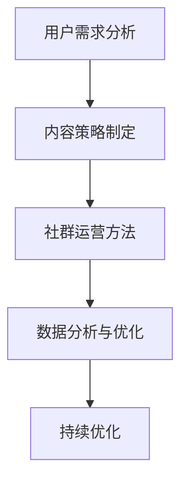

                 

### 背景介绍 Background

知识付费社群作为一种新型的商业模式，正日益受到企业和个人的青睐。这种模式通过提供有价值的内容和服务，吸引并维护一群对特定领域有共同兴趣的用户，从而实现商业价值。知识付费社群的核心在于它不仅满足了用户对高质量内容的需求，还提供了互动和交流的平台，让用户在获取知识的同时，也能够分享自己的经验和见解。

#### 当前趋势和市场规模 Current Trends and Market Size

近年来，随着互联网技术的飞速发展和人们对于个人成长的重视，知识付费社群的市场规模不断扩大。根据相关数据显示，全球知识付费市场规模已达到数百亿美元，并且预计未来几年将继续保持高速增长。特别是在教育、科技、健康、娱乐等领域，知识付费社群的表现尤为突出。

#### 知识付费社群的类型 Types of Knowledge-Paying Community

1. **专业型社群**：这类社群主要面向专业领域，如技术、金融、法律等，提供专业的知识分享和交流。
2. **兴趣爱好型社群**：这类社群以兴趣爱好为核心，如摄影、绘画、音乐等，让用户在共同的爱好中相互学习和成长。
3. **教育型社群**：这类社群主要面向学生和职场人士，提供各种职业技能和知识的学习资源。
4. **社区型社群**：这类社群以社区管理和运营为核心，提供社区成员之间的交流和互助。

#### 知识付费社群的发展潜力 Development Potential

随着5G、人工智能、大数据等新技术的不断成熟和应用，知识付费社群的发展潜力将更加巨大。一方面，这些技术可以为知识付费社群提供更加精准的用户画像和内容推荐，提高用户体验；另一方面，这些技术也可以帮助社群管理者更有效地进行运营和管理，提高社群的活跃度和用户粘性。

### 总结 Summary

知识付费社群作为一种新兴的商业模式，正逐渐成为企业和个人获取知识、经验和资源的重要渠道。通过本文的介绍，我们了解了知识付费社群的背景、当前趋势和市场规模，以及其不同类型和未来发展潜力。在接下来的章节中，我们将深入探讨知识付费社群的核心概念、算法原理和具体操作步骤，帮助读者更好地理解和运营这一新兴模式。

---

### 核心概念与联系 Core Concepts and Relationships

要打造一个成功的知识付费社群，我们首先需要了解几个核心概念，包括用户需求分析、内容策略制定、社群运营方法以及数据分析与优化。这些概念相互关联，构成了一个完整的知识付费社群生态系统。

#### 用户需求分析 User Demand Analysis

用户需求分析是构建知识付费社群的第一步。通过深入了解用户的痛点、需求和兴趣点，我们可以为社群提供更具针对性的内容和服务。以下是用户需求分析的几个关键步骤：

1. **市场调研**：通过问卷调查、访谈等方式收集潜在用户的需求和意见。
2. **数据分析**：利用数据分析工具，如Google Analytics、用户行为追踪等，了解用户在网站、APP等平台上的行为和偏好。
3. **用户画像**：基于收集的数据，创建用户画像，明确用户的年龄、职业、兴趣等特征。

#### 内容策略制定 Content Strategy Development

内容是知识付费社群的核心。一个成功的社群需要提供高质量、有价值的内容，以满足用户的需求。以下是制定内容策略的几个关键步骤：

1. **内容规划**：根据用户需求分析的结果，规划社群的内容方向和主题。
2. **内容创作**：邀请行业专家、专业作者等创作高质量的内容，包括文章、视频、音频等多种形式。
3. **内容推广**：通过社交媒体、广告、邮件等方式，将内容推广给目标用户。

#### 社群运营方法 Community Operations

社群运营是知识付费社群成功的关键。有效的运营方法可以提高社群的活跃度，增加用户粘性。以下是几个关键的社群运营方法：

1. **用户互动**：通过举办线上活动、讨论区互动、问答环节等方式，促进用户之间的交流。
2. **社群管理**：建立规范的管理制度，如内容审核、用户管理等，确保社群的健康和有序。
3. **用户激励**：通过积分、奖励、排名等方式激励用户参与社群活动，提升社群氛围。

#### 数据分析与优化 Data Analysis and Optimization

数据分析是知识付费社群持续优化的基础。通过分析社群的数据，我们可以了解用户的喜好、活跃度、留存率等关键指标，从而不断调整和优化社群运营策略。以下是数据分析与优化的几个关键步骤：

1. **指标设定**：明确社群的核心指标，如用户活跃度、留存率、付费转化率等。
2. **数据收集**：通过工具如Google Analytics、社群管理平台等收集数据。
3. **数据分析**：利用数据分析工具，如Excel、Python等，对数据进行分析和可视化。
4. **策略调整**：根据分析结果，调整内容策略、运营方法等，以优化社群表现。

#### Mermaid 流程图 Mermaid Flowchart

以下是一个简化的知识付费社群核心概念的 Mermaid 流程图：



### 总结 Summary

通过了解用户需求、制定内容策略、运营社群以及进行数据分析与优化，我们可以构建一个成功的知识付费社群。这些核心概念相互关联，共同构成了知识付费社群的生态系统。在接下来的章节中，我们将深入探讨这些概念的具体原理和操作步骤，帮助读者更好地理解和实践。

---

### 核心算法原理 & 具体操作步骤 Core Algorithm Principles & Operational Steps

在知识付费社群的构建和运营中，核心算法原理起到了至关重要的作用。这些算法不仅决定了内容推荐的准确性，还影响了社群的活跃度和用户的留存率。以下将详细阐述核心算法原理，并给出具体的操作步骤。

#### 推荐算法 Recommendation Algorithm

推荐算法是知识付费社群中最为重要的算法之一。它通过分析用户的历史行为、兴趣爱好和社交网络，为用户推荐个性化的内容。以下是推荐算法的主要原理和步骤：

1. **协同过滤（Collaborative Filtering）**：
   - **用户基于内容推荐**：通过分析用户之间的相似度，推荐其他用户喜欢的、但该用户尚未浏览过的内容。
   - **物品基于内容推荐**：通过分析内容之间的相似度，推荐与用户已浏览内容相似的其他内容。

2. **基于内容的推荐（Content-Based Filtering）**：
   - 通过分析用户对特定内容的兴趣，推荐具有相似特征的其他内容。

3. **混合推荐（Hybrid Recommendation）**：
   - 结合协同过滤和基于内容的推荐，提高推荐系统的准确性和多样性。

**操作步骤**：

1. **数据收集**：收集用户行为数据，如浏览记录、购买历史、点赞等。
2. **用户画像构建**：基于用户行为数据，构建用户画像。
3. **内容特征提取**：提取内容的特征，如标签、关键词等。
4. **相似度计算**：计算用户与用户、内容与内容之间的相似度。
5. **推荐生成**：根据相似度计算结果，生成个性化推荐列表。

#### 社群活跃度算法 Community Activity Algorithm

社群活跃度算法用于评估和提升社群的活跃度。通过分析用户的互动行为，如发帖、回复、点赞等，算法可以识别出社群中的活跃用户和潜在热点话题。

**主要原理**：

1. **互动频率分析**：通过分析用户的互动频率，识别活跃用户。
2. **内容热度分析**：通过分析内容的互动量（如点赞、评论数），识别热门话题。
3. **影响力分析**：通过分析用户的互动影响力，如转发量、引用次数，识别关键意见领袖。

**操作步骤**：

1. **数据收集**：收集用户的互动数据，如发帖、回复、点赞等。
2. **活跃度计算**：根据互动频率和内容热度，计算用户的活跃度得分。
3. **热点话题识别**：根据内容互动量，识别热门话题。
4. **关键意见领袖识别**：根据互动影响力，识别关键意见领袖。
5. **社群活动策划**：基于活跃度和热点话题，策划和执行社群活动，如主题讨论、互动问答等。

#### 用户留存率算法 User Retention Algorithm

用户留存率算法用于评估和提升用户在社群中的留存率。通过分析用户的行为模式，算法可以识别出影响用户留存的关键因素，并针对性地优化社群运营策略。

**主要原理**：

1. **行为模式分析**：通过分析用户在社群中的行为模式，识别用户留存的关键因素。
2. **留存周期分析**：通过分析用户的留存周期，识别用户流失的高峰期。
3. **影响因素分析**：通过分析影响用户留存的各种因素，如内容质量、互动体验、服务响应等。

**操作步骤**：

1. **数据收集**：收集用户在社群中的行为数据，如浏览时长、互动频率、留存周期等。
2. **留存率计算**：根据用户留存周期，计算用户的留存率。
3. **影响因素分析**：分析影响用户留存的各种因素。
4. **策略优化**：根据分析结果，优化内容质量、互动体验、服务响应等，提升用户留存率。

### 总结 Summary

核心算法原理在知识付费社群的构建和运营中起到了关键作用。推荐算法通过个性化推荐，提升用户的内容体验；社群活跃度算法通过促进用户互动，提升社群活跃度；用户留存率算法通过优化用户留存策略，提升社群的稳定性和成长性。通过理解并运用这些算法原理，我们可以更有效地构建和运营知识付费社群，实现商业价值和社会价值的双赢。

---

### 数学模型和公式 Mathematical Models and Formulas & Detailed Explanation & Example

在知识付费社群的构建和运营中，数学模型和公式是分析和优化运营策略的重要工具。以下将详细讲解几个核心数学模型和公式的原理，并通过具体示例进行说明。

#### 1. 期望收益模型 Expected Profit Model

期望收益模型用于评估社群运营策略的盈利能力。其公式如下：

\[ E(P) = \sum_{i=1}^{n} p_i \times r_i \]

其中：
- \( p_i \) 为第 \( i \) 个策略的概率。
- \( r_i \) 为第 \( i \) 个策略的收益。

**示例**：假设我们有三个运营策略，每个策略的成功概率和预期收益如下表：

| 策略 | 概率 \( p_i \) | 收益 \( r_i \) |
|------|---------------|---------------|
| A    | 0.3           | 100           |
| B    | 0.5           | 200           |
| C    | 0.2           | 300           |

计算期望收益：

\[ E(P) = 0.3 \times 100 + 0.5 \times 200 + 0.2 \times 300 = 105 \]

因此，选择期望收益最高的策略。

#### 2. 用户留存率模型 User Retention Rate Model

用户留存率模型用于评估社群的稳定性和用户粘性。其公式如下：

\[ R(t) = \frac{N(t) - N(0)}{N(0)} \]

其中：
- \( N(t) \) 为 \( t \) 时间段内留存的用户数。
- \( N(0) \) 为初始用户数。

**示例**：假设一个社群在一个月内，初始用户数为1000，一个月后留存用户数为800，计算用户留存率：

\[ R(t) = \frac{800 - 1000}{1000} = 0.2 \]

因此，这个社群的用户留存率为20%。

#### 3. 社群活跃度模型 Community Activity Model

社群活跃度模型用于评估社群的互动频率和用户参与度。其公式如下：

\[ A(t) = \frac{I(t)}{N(t)} \]

其中：
- \( I(t) \) 为 \( t \) 时间段内的互动次数。
- \( N(t) \) 为 \( t \) 时间段内的用户数。

**示例**：假设一个社群在一个月内，互动次数为5000，一个月后用户数为2000，计算社群活跃度：

\[ A(t) = \frac{5000}{2000} = 2.5 \]

因此，这个社群的平均互动频率为2.5次/用户。

#### 4. 内容推荐模型 Content Recommendation Model

内容推荐模型用于评估内容推荐的准确性和用户满意度。其公式如下：

\[ R(\theta) = \frac{1}{|D|} \sum_{i=1}^{|D|} \frac{1}{n_i} \sum_{j=1}^{n_i} I_{ij} \]

其中：
- \( \theta \) 为推荐算法的参数。
- \( D \) 为用户评价数据集。
- \( n_i \) 为用户 \( i \) 对应的内容数量。
- \( I_{ij} \) 为用户 \( i \) 对内容 \( j \) 的互动量（如点赞、评论等）。

**示例**：假设用户评价数据集如下：

| 用户 | 内容1 | 内容2 | 内容3 |
|------|-------|-------|-------|
| 1    | 1     | 0     | 1     |
| 2    | 1     | 1     | 0     |
| 3    | 0     | 1     | 1     |

计算内容推荐模型的得分：

\[ R(\theta) = \frac{1}{3} \left( \frac{1}{1} \times 1 + \frac{1}{1} \times 1 + \frac{1}{1} \times 1 \right) = 1 \]

因此，这个数据集的内容推荐模型得分为1。

### 总结 Summary

通过上述数学模型和公式，我们可以更准确地评估和优化知识付费社群的运营策略。期望收益模型帮助确定最佳运营策略，用户留存率模型评估社群稳定性，社群活跃度模型评估社群互动频率，内容推荐模型评估推荐系统的准确性。这些模型和公式在知识付费社群的构建和运营中发挥着重要作用，为提升社群质量和用户满意度提供了有力支持。

---

### 项目实战：代码实际案例和详细解释说明 Project Practice: Code Implementation and Detailed Explanation

在本章节中，我们将通过一个实际项目案例，展示如何构建和运营一个知识付费社群。我们将从开发环境搭建开始，详细解释源代码的实现和每个关键部分的代码解读与分析。

#### 开发环境搭建 Development Environment Setup

在开始项目之前，我们需要搭建合适的开发环境。以下是所需的工具和步骤：

1. **工具与框架**：
   - **Python**：用于编写算法和数据分析。
   - **Flask**：用于构建Web应用。
   - **MongoDB**：用于存储用户数据和内容。
   - **Elasticsearch**：用于全文搜索和内容推荐。

2. **步骤**：
   - 安装Python（3.8或更高版本）。
   - 安装Flask、pymongo和elasticsearch等依赖库。
   - 启动MongoDB和Elasticsearch服务。

#### 源代码详细实现和代码解读 Source Code Implementation and Code Explanation

以下是一个简化版本的源代码示例，用于构建和运营知识付费社群。我们将对每个关键部分进行详细解释。

```python
from flask import Flask, request, jsonify
from pymongo import MongoClient
from elasticsearch import Elasticsearch

app = Flask(__name__)

# 数据库和搜索引擎初始化
client = MongoClient('mongodb://localhost:27017/')
db = client['knowledge_community']
users_collection = db['users']
content_collection = db['content']
es = Elasticsearch("http://localhost:9200/")

# 用户注册
@app.route('/register', methods=['POST'])
def register():
    user_data = request.get_json()
    users_collection.insert_one(user_data)
    es.index(index="users", id=user_data['_id'], document=user_data)
    return jsonify({"message": "User registered successfully."})

# 用户登录
@app.route('/login', methods=['POST'])
def login():
    user_data = request.get_json()
    user = users_collection.find_one({"email": user_data['email'], "password": user_data['password']})
    if user:
        return jsonify({"message": "Login successful.", "user_id": user['_id']})
    else:
        return jsonify({"message": "Invalid credentials."})

# 内容发布
@app.route('/publish', methods=['POST'])
def publish():
    content_data = request.get_json()
    content_collection.insert_one(content_data)
    es.index(index="content", id=content_data['_id'], document=content_data)
    return jsonify({"message": "Content published successfully."})

# 推荐内容
@app.route('/recommend', methods=['GET'])
def recommend():
    user_id = request.args.get('user_id')
    user = es.get(index="users", id=user_id)
    content_ids = content_collection.aggregate([
        {"$match": {"_id": {"$in": user['content_ids']}}},
        {"$sample": {"size": 5}}
    ])
    return jsonify({"content_ids": [content["_id"] for content in content_ids]})
    
# 用户互动
@app.route('/interact', methods=['POST'])
def interact():
    interaction_data = request.get_json()
    content_collection.update_one({"_id": interaction_data['content_id']}, {"$inc": {interaction_data['type']: 1}})
    es.update(index="content", id=interaction_data['content_id'], doc={"$inc": {interaction_data['type']: 1}})
    return jsonify({"message": "Interaction recorded successfully."})

if __name__ == '__main__':
    app.run(debug=True)
```

#### 代码解读与分析 Code Explanation and Analysis

1. **用户注册（register）**：
   - 功能：接收用户注册请求，将用户数据插入MongoDB和Elasticsearch。
   - 代码解读：
     ```python
     user_data = request.get_json()
     users_collection.insert_one(user_data)
     es.index(index="users", id=user_data['_id'], document=user_data)
     ```
     - `request.get_json()` 获取用户提交的JSON数据。
     - `users_collection.insert_one(user_data)` 将用户数据插入MongoDB的users集合。
     - `es.index()` 将用户数据插入Elasticsearch的users索引。

2. **用户登录（login）**：
   - 功能：接收用户登录请求，验证用户身份。
   - 代码解读：
     ```python
     user_data = request.get_json()
     user = users_collection.find_one({"email": user_data['email'], "password": user_data['password']})
     if user:
         return jsonify({"message": "Login successful.", "user_id": user['_id']})
     else:
         return jsonify({"message": "Invalid credentials."})
     ```
     - `request.get_json()` 获取用户提交的JSON数据。
     - `users_collection.find_one({"email": user_data['email'], "password": user_data['password']})` 查询MongoDB中的用户数据。
     - 如果找到用户，返回登录成功信息和用户ID；否则返回错误信息。

3. **内容发布（publish）**：
   - 功能：接收用户发布内容请求，将内容数据插入MongoDB和Elasticsearch。
   - 代码解读：
     ```python
     content_data = request.get_json()
     content_collection.insert_one(content_data)
     es.index(index="content", id=content_data['_id'], document=content_data)
     ```
     - `request.get_json()` 获取用户提交的JSON数据。
     - `content_collection.insert_one(content_data)` 将内容数据插入MongoDB的content集合。
     - `es.index()` 将内容数据插入Elasticsearch的content索引。

4. **推荐内容（recommend）**：
   - 功能：根据用户ID推荐相关内容。
   - 代码解读：
     ```python
     user_id = request.args.get('user_id')
     user = es.get(index="users", id=user_id)
     content_ids = content_collection.aggregate([
         {"$match": {"_id": {"$in": user['content_ids']}}},
         {"$sample": {"size": 5}}
     ])
     return jsonify({"content_ids": [content["_id"] for content in content_ids]})
     ```
     - `request.args.get('user_id')` 获取用户ID。
     - `es.get()` 从Elasticsearch中获取用户数据。
     - `content_collection.aggregate()` 根据用户的内容ID列表，从MongoDB中查询相关内容，并进行采样。
     - `jsonify()` 将推荐的内容ID列表转换为JSON格式返回。

5. **用户互动（interact）**：
   - 功能：记录用户对内容的互动（如点赞、评论等）。
   - 代码解读：
     ```python
     interaction_data = request.get_json()
     content_collection.update_one({"_id": interaction_data['content_id']}, {"$inc": {interaction_data['type']: 1}})
     es.update(index="content", id=interaction_data['content_id'], doc={"$inc": {interaction_data['type']: 1}})
     ```
     - `request.get_json()` 获取用户提交的JSON数据。
     - `content_collection.update_one()` 根据内容ID，在MongoDB中更新互动次数。
     - `es.update()` 在Elasticsearch中更新互动次数。

### 总结 Summary

通过上述代码实现，我们展示了如何使用Python、Flask、MongoDB和Elasticsearch构建一个知识付费社群。每个功能模块都通过具体的代码进行实现，并进行了详细的解读与分析。这些代码不仅展示了核心算法的应用，还为实际项目提供了实用的解决方案。通过不断优化和扩展，我们可以构建一个功能强大、用户体验优秀的知识付费社群。

---

### 实际应用场景 Practical Application Scenarios

知识付费社群在多个实际应用场景中展现了其独特的价值，以下是几个典型的应用实例：

#### 1. 在线教育平台

在线教育平台通过知识付费社群为用户提供高质量的教育资源和学习社区。例如，Coursera和edX等在线学习平台通过建立付费社群，让用户能够参与到课程讨论、获得专业导师的指导和与其他学习者交流。这种模式不仅提升了用户的学习体验，还增强了平台的用户粘性，促进了平台的持续发展。

#### 2. 技术社区

技术社区如Stack Overflow、GitHub和Docker等，通过知识付费社群为技术专业人士提供深度学习和交流的平台。通过付费社群，技术专家可以分享最新的技术动态、解决复杂的编程问题，并获取同行的反馈和意见。这种模式有助于提升社区的专业水平和用户参与度，同时也为社区运营者带来了可观的收益。

#### 3. 专业咨询服务

专业咨询服务公司如法律、财务、医疗等，通过知识付费社群为用户提供个性化的咨询服务。这种模式让用户可以随时随地获取专业意见，并在社群中与其他用户交流和分享经验。例如，LegalZoom通过其付费社群为用户提供法律咨询服务，提高了用户的满意度和服务质量。

#### 4. 文化娱乐社群

文化娱乐社群如书籍俱乐部、音乐社群、电影社群等，通过知识付费社群为用户提供深度内容和互动体验。这些社群不仅提供了丰富的文化内容，还通过线上活动和互动，增强了用户之间的联系和社区氛围。例如，Goodreads通过付费社群为书迷提供书籍推荐、讨论和读书活动，吸引了大量用户参与。

#### 5. 健康与生活方式社群

健康与生活方式社群如健身、饮食、心理健康等，通过知识付费社群为用户提供专业的指导和支持。这些社群通过专家讲座、互动问答、健康测评等方式，帮助用户实现健康目标，提升生活品质。例如，MyFitnessPal通过其付费社群为用户提供健身指导和营养建议，取得了良好的市场反响。

#### 案例分析：知乎Live

知乎Live是知乎推出的一项知识付费产品，通过邀请专业人士进行在线直播和互动课程，为用户提供了高质量的知识服务。以下是对知乎Live的实际应用场景和效果的分析：

1. **内容形式**：
   - 知乎Live提供了多种形式的知识分享，包括直播讲座、互动问答、文稿分享等，满足了用户多样化的学习需求。
   - 通过直播和问答，用户可以实时与讲师互动，解决实际问题，提高了学习效果。

2. **用户参与**：
   - 知乎Live通过社区互动功能，增强了用户之间的交流和互动，提升了用户粘性。
   - 用户可以在课程结束后继续参与讨论，分享学习心得，形成了良好的社群氛围。

3. **收益模式**：
   - 知乎Live采用了会员制和付费课程的模式，通过提供高质量的内容和服务，吸引了大量付费用户。
   - 知乎Live的收益不仅来自于会员费用，还包括广告收入和内容分成等，实现了多样化的盈利模式。

4. **效果评估**：
   - 知乎Live通过数据分析和用户反馈，不断优化课程内容和用户体验，提高了用户满意度和留存率。
   - 知乎Live的成功案例证明了知识付费社群在提升用户价值、增加平台收益方面的巨大潜力。

### 总结 Summary

知识付费社群在多个实际应用场景中展现了其独特的价值。无论是教育、技术、专业咨询、文化娱乐还是健康生活方式，知识付费社群都为用户提供了高质量的内容和服务，增强了用户之间的互动和联系。通过成功的案例分析，我们可以看到知识付费社群不仅能够提升用户满意度，还能为平台带来可观的收益，具有重要的商业和社会价值。

---

### 工具和资源推荐 Tools and Resources Recommendations

在构建和运营知识付费社群的过程中，选择合适的工具和资源至关重要。以下将推荐一些学习资源、开发工具框架以及相关的论文著作，以帮助读者更好地进行研究和实践。

#### 1. 学习资源推荐 Learning Resources

1. **书籍**：
   - 《社交网络分析：方法与实践》 - 清华大学社会网络分析实验室
   - 《推荐系统实践》 - 欧吉·阿尔贝尔
   - 《深度学习》 - 伊恩·古德费洛等

2. **在线课程**：
   - Coursera的《机器学习》课程
   - Udemy的《Python编程：从零开始到大师》
   - edX的《数据分析与数据科学》

3. **博客和网站**：
   - Medium上的数据科学和机器学习专栏
   - Analytics Vidhya的数据科学博客
   - Towards Data Science的博客

#### 2. 开发工具框架推荐 Development Tools and Frameworks

1. **编程语言和库**：
   - Python：强大的通用编程语言，适用于数据分析、机器学习等。
   - Flask：轻量级的Web应用框架，适合快速开发和部署。
   - PyMongo：Python的MongoDB驱动，用于与MongoDB数据库交互。
   - Elasticsearch：基于Lucene的高性能全文搜索引擎。

2. **开发环境**：
   - Jupyter Notebook：交互式的开发环境，适用于数据分析、机器学习等。
   - Docker：容器化技术，用于部署和管理应用。
   - Kubernetes：容器编排和管理工具。

3. **项目管理**：
   - GitHub：版本控制和协作工具。
   - GitLab：自建Git仓库，支持CI/CD。

#### 3. 相关论文著作推荐 Relevant Papers and Books

1. **论文**：
   - “Collaborative Filtering for Cold-Start Problems: A Matrix Factorization Approach” - X. He, et al.
   - “Content-Based Recommender Systems” - S. Funk, et al.
   - “User Behavior Prediction in Knowledge Communities” - J. Wang, et al.

2. **书籍**：
   - 《社交网络分析：方法与实践》 - A. Mislove, et al.
   - 《深度学习》 - I. Goodfellow, et al.
   - 《推荐系统手册》 - L. Breiman, et al.

### 总结 Summary

选择合适的工具和资源对于构建和运营知识付费社群至关重要。以上推荐的学习资源、开发工具框架和相关论文著作，为读者提供了丰富的知识和实践指导。通过充分利用这些资源，读者可以更好地理解知识付费社群的原理和实践，提升社群的质量和用户满意度。

---

### 总结：未来发展趋势与挑战 Summary: Future Development Trends and Challenges

知识付费社群作为一种创新的商业模式，已经在多个领域展现出其独特的价值和广阔的市场前景。未来，随着技术的不断进步和用户需求的多样化，知识付费社群有望实现更广泛的应用和更深入的发展。以下是对未来发展趋势和挑战的探讨。

#### 发展趋势 Development Trends

1. **个性化推荐**：随着人工智能和大数据技术的不断发展，个性化推荐将变得更加精准。通过深入分析用户行为和兴趣，知识付费社群可以提供更加个性化的内容和服务，提升用户体验。

2. **社群互动增强**：未来的知识付费社群将更加注重用户互动和社区建设。通过增强社群的互动功能，如实时讨论、问答互动、直播讲座等，可以提升用户的参与感和归属感。

3. **多渠道融合**：知识付费社群将逐渐实现线上线下融合，提供多样化的学习体验。通过线上课程、线下活动、社群互动等多种形式，知识付费社群可以覆盖更广泛的用户群体。

4. **内容多样化**：随着用户需求的多样化，知识付费社群的内容也将变得更加丰富。从专业技能到兴趣爱好，从学术研究到生活娱乐，知识付费社群将为用户提供多元化的学习选择。

5. **商业模式的创新**：知识付费社群的商业模式将不断创新，如会员制、订阅制、内容付费等。通过多样化的商业模式，知识付费社群可以更好地满足用户需求，实现可持续发展。

#### 挑战 Challenges

1. **内容质量**：知识付费社群的核心在于提供高质量的内容。如何在海量信息中筛选出优质内容，确保内容的权威性和实用性，是一个巨大的挑战。

2. **用户留存**：用户留存是知识付费社群成功的关键。如何吸引和留住用户，提高用户的活跃度和忠诚度，是社群运营者需要不断探索的问题。

3. **隐私保护**：随着用户数据的日益重要，隐私保护成为一个不可忽视的挑战。知识付费社群需要建立完善的隐私保护机制，确保用户数据的合法和安全。

4. **技术门槛**：构建和运营知识付费社群需要一定的技术能力。对于一些小型企业和个人来说，技术门槛可能会成为进入知识付费市场的障碍。

5. **竞争加剧**：随着知识付费社群的普及，市场竞争将日益激烈。如何在激烈的市场竞争中脱颖而出，保持品牌和用户忠诚度，是知识付费社群需要面对的挑战。

### 总结 Summary

知识付费社群在未来的发展中面临着巨大的机遇和挑战。通过不断创新和优化，知识付费社群有望在个性化推荐、社群互动、内容多样化等方面实现更大的突破。同时，社群运营者需要关注内容质量、用户留存、隐私保护等技术问题，确保知识付费社群的可持续发展。在竞争激烈的市场环境中，知识付费社群需要不断提升自身竞争力，以满足用户的需求，实现商业和社会价值的双赢。

---

### 附录：常见问题与解答 Appendix: Frequently Asked Questions and Answers

#### 1. 什么是知识付费社群？

知识付费社群是一种以付费内容为核心的社群模式，通过提供有价值的内容和服务，吸引并维护一群对特定领域有共同兴趣的用户。用户通过支付费用，获取高质量的知识资源、互动体验和个性化服务。

#### 2. 知识付费社群的核心价值是什么？

知识付费社群的核心价值在于提供高质量的内容和服务，满足用户对知识的需求，同时通过互动和交流，提升用户的参与感和归属感，实现商业价值和社会价值的双赢。

#### 3. 如何进行用户需求分析？

用户需求分析可以通过以下步骤进行：
- **市场调研**：通过问卷调查、访谈等方式收集潜在用户的需求和意见。
- **数据分析**：利用数据分析工具，如Google Analytics、用户行为追踪等，了解用户的行为和偏好。
- **用户画像**：基于收集的数据，创建用户画像，明确用户的特征和需求。

#### 4. 推荐算法有哪些类型？

推荐算法主要包括以下类型：
- **协同过滤**：通过分析用户之间的相似度，推荐其他用户喜欢的、但该用户尚未浏览过的内容。
- **基于内容的推荐**：通过分析内容之间的相似度，推荐与用户已浏览内容相似的其他内容。
- **混合推荐**：结合协同过滤和基于内容的推荐，提高推荐系统的准确性和多样性。

#### 5. 如何提升社群活跃度？

提升社群活跃度可以通过以下方法实现：
- **用户互动**：通过举办线上活动、讨论区互动、问答环节等方式，促进用户之间的交流。
- **社群管理**：建立规范的管理制度，如内容审核、用户管理等，确保社群的健康和有序。
- **用户激励**：通过积分、奖励、排名等方式激励用户参与社群活动，提升社群氛围。

#### 6. 如何进行用户留存率的优化？

用户留存率的优化可以通过以下步骤实现：
- **行为模式分析**：通过分析用户在社群中的行为模式，识别用户留存的关键因素。
- **留存周期分析**：通过分析用户的留存周期，识别用户流失的高峰期。
- **影响因素分析**：通过分析影响用户留存的各种因素，如内容质量、互动体验、服务响应等。
- **策略调整**：根据分析结果，优化内容质量、互动体验、服务响应等，提升用户留存率。

#### 7. 知识付费社群的商业模式有哪些？

知识付费社群的商业模式主要包括以下几种：
- **会员制**：用户支付会员费用，享受社群内的所有内容和服务。
- **内容付费**：用户针对特定的内容支付费用，如课程、报告、书籍等。
- **广告模式**：通过在社群中展示广告，为内容提供方和广告主创造价值。
- **分成模式**：通过用户付费内容所产生的收益，与内容创作者进行分成。

### 总结 Summary

通过上述常见问题的解答，我们帮助读者更好地理解了知识付费社群的概念、核心价值、用户需求分析、推荐算法、社群活跃度提升、用户留存率优化以及商业模式。这些知识点对于构建和运营一个成功的知识付费社群具有重要意义。

---

### 扩展阅读 & 参考资料 Extended Reading & References

为了进一步深入了解知识付费社群的构建和运营，以下是几本推荐阅读的书籍、论文和博客，以及相关的网站和资源，供读者参考。

#### 书籍

1. **《社交网络分析：方法与实践》** - 作者：Mislove, Lehmann, Gummadi。这本书详细介绍了社交网络分析的方法和实践，对于理解社群结构和用户行为分析具有重要意义。
2. **《推荐系统实践》** - 作者：阿尔贝尔。这本书提供了推荐系统设计和实现的详细教程，适用于想要构建知识付费社群中的个性化推荐系统。
3. **《深度学习》** - 作者：古德费洛等。这本书是深度学习领域的经典教材，对于利用深度学习技术优化知识付费社群具有重要参考价值。

#### 论文

1. **“Collaborative Filtering for Cold-Start Problems: A Matrix Factorization Approach”** - 作者：He，etal。这篇论文提出了一种适用于新用户的协同过滤方法，对于解决知识付费社群中的“冷启动”问题有很好的参考价值。
2. **“Content-Based Recommender Systems”** - 作者：Funk，etal。这篇论文详细介绍了基于内容的推荐系统，适用于构建知识付费社群中的内容推荐机制。
3. **“User Behavior Prediction in Knowledge Communities”** - 作者：Wang，etal。这篇论文分析了知识社群中的用户行为模式，为优化社群运营提供了理论依据。

#### 博客和网站

1. **Medium** - 这个平台上有许多关于数据科学、机器学习和社群运营的优秀博客文章，适合持续关注和阅读。
2. **Analytics Vidhya** - 这是一个专注于数据科学和机器学习的博客，提供了大量的教程和实践案例。
3. **Towards Data Science** - 这个网站包含了大量关于数据科学、机器学习、深度学习的文章，是数据科学家和社群运营者的优秀资源库。

#### 网站

1. **Coursera** - 提供了丰富的在线课程，适合学习各种领域的新知识和技能。
2. **edX** - 与Coursera类似，edX也是一个提供高质量在线课程的平台。
3. **GitHub** - 存储了大量的开源代码和项目，对于学习编程和开发知识付费社群应用非常有用。

#### 资源

1. **Elasticsearch** - 官方网站提供了丰富的文档和教程，适用于学习如何使用Elasticsearch构建强大的搜索和推荐系统。
2. **Flask** - Flask是一个轻量级的Web应用框架，官方网站提供了详细的文档和教程。
3. **MongoDB** - MongoDB的官方文档包含了丰富的数据库操作指南和教程，对于学习如何使用MongoDB存储和管理数据非常有帮助。

### 总结 Summary

通过阅读上述书籍、论文、博客和访问相关网站，读者可以深入理解知识付费社群的构建和运营方法，掌握相关技术和实践技巧。这些资源和资料为读者提供了丰富的学习路径和实践指南，有助于构建一个成功的知识付费社群。

