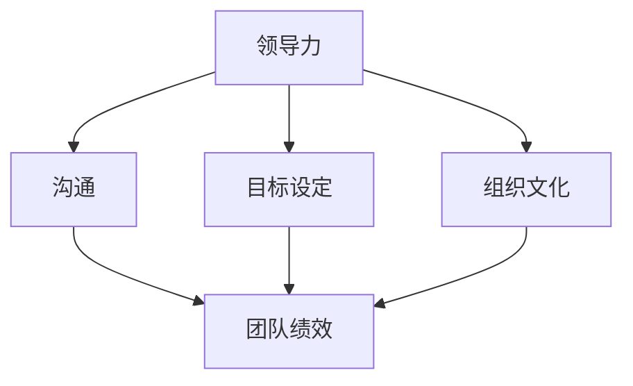

                 

# 打造高绩效团队：从average到outstanding

## 关键词：团队管理、绩效提升、团队协作、领导力、组织文化

### 摘要

在信息技术飞速发展的时代，高效能的团队成为企业竞争的核心力量。本文旨在探讨如何通过科学的管理方法和策略，将普通团队转变为高绩效团队。文章首先介绍了团队管理的核心概念，然后详细分析了提升团队绩效的关键因素，包括领导力、沟通、目标和组织文化。接下来，通过实际案例和具体操作步骤，展示了如何实施这些策略，并讨论了团队在现实应用场景中的表现。最后，文章对未来的发展趋势与挑战进行了总结，为读者提供了实用工具和资源推荐。本文旨在为团队管理者提供理论指导和实践参考，助力团队实现从average到outstanding的跨越。

## 1. 背景介绍

在当今快速变化的市场环境中，企业面临日益激烈的国际竞争和不断变化的技术进步，这要求团队不仅要有扎实的技术基础，还要具备高效的工作能力和强大的执行力。团队绩效的高低直接影响到企业的市场竞争力、客户满意度和员工幸福感。然而，许多团队在绩效提升方面面临着诸多挑战，如成员技能不匹配、沟通不畅、目标不明确、缺乏激励等。

高绩效团队是指能够在明确的目标指导下，通过有效的领导、沟通和协作，以高质量、高效率的方式完成任务的团队。这种团队通常具有以下特征：清晰的愿景和目标、高度的信任和责任感、积极的团队合作精神、持续的学习和创新能力。然而，要将一个普通团队转变为高绩效团队并非易事，需要管理者具备深厚的团队管理知识和技能，并采取一系列科学的管理方法和策略。

本文将从团队管理的核心概念出发，详细探讨提升团队绩效的关键因素，并结合实际案例，为读者提供具体操作步骤和实用建议。希望通过本文的分享，能够为团队管理者提供一些有价值的参考和启示，助力团队实现从average到outstanding的跨越。

### 2. 核心概念与联系

在探讨如何打造高绩效团队之前，首先需要了解一些核心概念及其相互之间的联系。以下是几个关键概念的定义及其关系：

#### 2.1 领导力

领导力是指领导者通过影响和激励团队成员，实现团队目标的能力。有效的领导力不仅能够激发团队成员的潜力，还能提高团队的凝聚力和工作效率。领导力与团队绩效之间存在密切的关系。研究表明，领导力是影响团队绩效的最关键因素之一。一个优秀的领导者能够明确团队的目标和愿景，制定有效的战略和行动计划，同时关注团队成员的成长和福祉。

#### 2.2 沟通

沟通是团队协作的基础，是确保团队成员之间信息传递准确、及时的重要手段。良好的沟通能够促进团队成员之间的理解和信任，减少误解和冲突，提高团队的工作效率和创新能力。沟通方式包括口头、书面、非语言等多种形式，有效的沟通策略需要根据具体情境进行选择和调整。

#### 2.3 目标设定

目标设定是团队管理的重要环节，是实现团队绩效的基础。明确、具体、可衡量的目标（SMART目标）有助于团队成员明确自己的职责和期望，从而提高工作动力和效率。目标设定不仅需要考虑团队的整体目标，还要兼顾团队成员的个人目标和职业发展。合理的目标设定能够激发团队成员的积极性和创造力，促进团队的整体进步。

#### 2.4 组织文化

组织文化是指企业在长期发展中形成的价值观、信仰、行为规范和团队氛围。一个积极向上的组织文化能够增强团队的凝聚力，提高员工的忠诚度和满意度，从而提升团队的整体绩效。组织文化包括多个方面，如企业的愿景和使命、核心价值观、团队合作精神、创新氛围等。有效的组织文化能够为团队成员提供心理支持，降低团队成员之间的摩擦和冲突，提高团队的整体效能。

#### 2.5 关系与联系

以上概念之间存在紧密的联系。领导力是团队管理的核心，通过有效的沟通和目标设定，可以激发团队成员的潜力，促进团队的协同合作。组织文化则是这些因素的综合体现，它为团队成员提供了一个共同价值观和认同感，增强了团队的凝聚力。以下是这些概念之间的Mermaid流程图表示：



通过图示，我们可以更直观地看到这些概念之间的相互作用和关系。领导力、沟通、目标设定和组织文化相互支持，共同推动团队绩效的提升。了解这些核心概念及其联系，有助于我们更好地理解和实践团队管理，从而打造出高绩效团队。

### 3. 核心算法原理 & 具体操作步骤

打造高绩效团队不仅需要理解其核心概念，还需要具备具体操作步骤和方法。以下是一些核心算法原理和具体操作步骤，这些方法有助于团队管理者在实际工作中提升团队绩效：

#### 3.1 目标管理与SMART目标

目标管理是一种通过明确、具体、可衡量、可实现和有时限（SMART）的目标来指导团队工作的重要方法。

**原理：**SMART目标确保团队成员清楚地了解期望和职责，提高工作动力和效率。

**具体操作步骤：**

1. **明确团队目标：**首先，团队管理者需要与团队成员共同明确团队的目标。这可以通过团队会议、头脑风暴等方式进行。
2. **设定SMART目标：**根据明确的目标，设定具体的SMART目标。例如：“提高项目交付效率，项目完成时间缩短20%”。
3. **分解目标：**将大的目标分解为小的可操作任务，分配给团队成员。每个任务都需要有明确的负责人和时间节点。
4. **监控和调整：**定期监控目标的进展，根据实际情况进行调整。通过定期的团队会议，团队成员可以分享进展和问题，共同寻找解决方案。

**示例：**

假设团队的目标是提高产品开发效率，我们可以设定以下SMART目标：

- **明确团队目标：**提高产品开发效率，缩短产品发布周期。
- **设定SMART目标：**产品发布周期从平均30天缩短到25天。
- **分解目标：**将任务分解为需求分析、设计、编码、测试等多个阶段，每个阶段指定负责人和时间节点。
- **监控和调整：**通过每周的进度报告和团队会议，监控各阶段任务的进展，及时调整策略。

#### 3.2 基于KPI的绩效评估

关键绩效指标（KPI）是衡量团队和团队成员工作成效的重要工具。

**原理：**KPI基于具体的、可量化的指标，帮助团队管理者了解团队的整体绩效和团队成员的贡献。

**具体操作步骤：**

1. **确定KPI：**根据团队目标，确定关键绩效指标。这些指标可以是量化的，如项目完成时间、错误率等，也可以是行为性的，如团队成员的协作程度、创新能力等。
2. **设定目标值：**为每个KPI设定一个目标值，确保团队成员了解期望绩效。
3. **监控和记录：**定期监控和记录KPI的值，确保数据准确无误。
4. **反馈和改进：**根据KPI的监控结果，提供反馈和改进建议。对于表现优秀的团队成员，给予肯定和奖励；对于表现不佳的，帮助其找出问题并制定改进计划。

**示例：**

假设我们团队的KPI包括项目完成时间、错误率、团队合作度等：

- **确定KPI：**项目完成时间、错误率、团队合作度。
- **设定目标值：**项目完成时间目标值是20天，错误率目标是低于1%。
- **监控和记录：**每周记录项目完成时间、错误率，并通过团队协作工具监控团队合作度。
- **反馈和改进：**根据监控结果，对团队成员进行反馈。如果项目完成时间超过了目标值，分析原因并提出改进措施；如果团队合作度低于预期，组织团队建设活动提高团队凝聚力。

#### 3.3 沟通策略

有效的沟通是团队协作的关键。

**原理：**沟通策略包括多种沟通形式，如会议、邮件、即时通讯等，适用于不同情境和需求。

**具体操作步骤：**

1. **确定沟通需求：**根据任务需求和团队成员的实际情况，确定合适的沟通形式和频率。
2. **安排沟通会议：**定期举行团队会议，如周会、月度会议等，确保团队成员之间的信息同步。
3. **使用沟通工具：**利用各种沟通工具，如Slack、Microsoft Teams、邮件等，确保信息的及时传递和记录。
4. **反馈和反馈机制：**鼓励团队成员主动提供反馈，建立反馈机制，确保问题能够及时被发现和解决。

**示例：**

假设团队需要改进沟通策略：

- **确定沟通需求：**团队需要更频繁的沟通，以解决项目中遇到的问题。
- **安排沟通会议：**每周五下午举行1小时的团队会议，讨论项目进展和问题。
- **使用沟通工具：**通过Slack和邮件进行日常沟通，确保信息传递的及时性和准确性。
- **反馈和反馈机制：**在会议中设置反馈环节，鼓励团队成员提出问题和建议，并制定相应的解决方案。

通过以上核心算法原理和具体操作步骤，团队管理者可以更科学地指导团队工作，提升团队绩效。这些方法不仅适用于IT行业，也适用于其他行业和领域的团队管理。

### 4. 数学模型和公式 & 详细讲解 & 举例说明

在团队管理中，数学模型和公式可以提供科学依据和量化手段，帮助我们更好地理解和优化团队绩效。以下是一些常用的数学模型和公式，以及它们的详细讲解和举例说明。

#### 4.1 成本效益分析（CBA）

成本效益分析是一种常用的决策分析方法，用于评估某个项目或活动的成本与预期效益之间的关系。

**公式：**
\[ \text{CBA} = \frac{\text{效益}}{\text{成本}} \]

**详细讲解：**
成本效益分析的核心在于计算项目的总效益和总成本，然后通过比较两者的比值来评估项目的可行性。效益通常包括收入、节约成本、客户满意度提升等，而成本则包括直接成本（如人力、物资）、间接成本（如管理成本、风险成本）等。

**举例说明：**
假设一个团队计划开发一个新功能，预计收益为增加年收入10万元，而总成本为5万元（包括开发成本、运营成本等）。则该项目的成本效益比值为：
\[ \text{CBA} = \frac{10}{5} = 2 \]
这意味着每投入1元成本，可以带来2元的效益，这是一个相对较高的成本效益比，表明该项目具有较大的可行性。

#### 4.2 生产力计算

生产力计算是衡量团队工作效率的重要指标，通常用单位时间内完成的工作量来衡量。

**公式：**
\[ \text{生产力} = \frac{\text{工作量}}{\text{时间}} \]

**详细讲解：**
生产力计算可以帮助团队管理者了解团队成员的工作效率，为优化工作流程提供依据。其中，工作量可以用完成的任务数量、解决的问题数量等来衡量，而时间则包括实际工作时间和非工作时间。

**举例说明：**
假设一个团队在一个月内完成了100个任务，总工作时间是160小时。则该团队的生产力为：
\[ \text{生产力} = \frac{100}{160} = 0.625 \text{（任务/小时）} \]
这意味着该团队平均每小时可以完成0.625个任务，可以通过优化工作流程和提高工作效率来提高这个指标。

#### 4.3 项目评估模型（CPM）

关键路径法（Critical Path Method，CPM）是一种用于项目计划和控制的方法，用于确定项目的最短完成时间和关键任务。

**公式：**
\[ \text{项目完成时间} = \sum_{i=1}^{n} \text{任务持续时间}_{i} \]

**详细讲解：**
CPM模型通过确定项目的关键路径，即完成项目所需的最长时间路径，来识别关键任务。这些关键任务的完成时间直接影响项目的总完成时间。每个任务的持续时间可以通过网络图和关键路径法进行计算。

**举例说明：**
假设一个项目包含5个任务（A、B、C、D、E），其网络图如下所示：

```
A (3天) -> B (2天) -> D (4天) -> 完成项目
      \-> C (5天) -> E (3天) -> 完成项目
```

通过计算，任务A的持续时间为3天，任务B的持续时间为2天，任务C的持续时间为5天，任务D的持续时间为4天，任务E的持续时间为3天。关键路径为A-B-D，总持续时间为3+2+4=9天，这将是项目的最短完成时间。

#### 4.4 团队协作效率指数

团队协作效率指数用于衡量团队内部协作的质量和效率。

**公式：**
\[ \text{协作效率指数} = \frac{\text{团队总效率}}{\text{单个成员效率之和}} \]

**详细讲解：**
协作效率指数反映了团队整体工作效率相对于单个成员工作效率的改进程度。团队总效率可以通过团队完成的工作量来衡量，单个成员效率之和则是所有成员工作效率的简单相加。

**举例说明：**
假设一个团队由5名成员组成，单个成员的工作效率分别为0.8、0.9、0.7、0.8、0.6。团队在一个月内完成了1200个任务，单个成员的总效率为：
\[ 0.8 + 0.9 + 0.7 + 0.8 + 0.6 = 3.8 \]
团队总效率为1200个任务，则协作效率指数为：
\[ \text{协作效率指数} = \frac{1200}{3.8} \approx 314.84 \]
这意味着团队的整体工作效率是单个成员效率之和的314.84倍，表明团队在协作方面的效率非常高。

通过这些数学模型和公式的应用，团队管理者可以更加科学地评估团队绩效，优化工作流程，提高团队协作效率，从而实现从average到outstanding的跨越。

### 5. 项目实战：代码实际案例和详细解释说明

为了更好地展示如何将上述理论应用于实际项目，以下将介绍一个具体的IT项目，并详细解析其代码实现和关键部分。

#### 5.1 开发环境搭建

在开始项目之前，需要搭建一个合适的技术栈。以下是一个基本的开发环境搭建步骤：

1. **安装Python环境**：Python是一种广泛使用的编程语言，适用于数据分析和项目开发。可以从官方网站下载并安装Python。
2. **安装Django框架**：Django是一个高性能的Web开发框架，适用于快速开发和部署应用程序。使用pip命令安装：
   ```
   pip install django
   ```
3. **创建Django项目**：使用以下命令创建一个新项目：
   ```
   django-admin startproject myproject
   ```
4. **创建应用**：在项目目录下创建一个应用：
   ```
   python manage.py startapp myapp
   ```

#### 5.2 源代码详细实现和代码解读

以下是项目核心代码的实现和解读。

**5.2.1 应用配置（myapp/urls.py）**

```python
from django.urls import path
from . import views

urlpatterns = [
    path('tasks/', views.TaskList.as_view(), name='task_list'),
    path('tasks/<int:pk>/', views.TaskDetail.as_view(), name='task_detail'),
]
```

**解读：**这段代码定义了应用myapp的URL模式。`TaskList`和`TaskDetail`是视图类，分别用于处理任务列表和任务详情的请求。`as_view()`方法用于创建对应的视图实例。

**5.2.2 任务列表视图（myapp/views.py）**

```python
from django.views.generic import ListView
from .models import Task

class TaskList(ListView):
    model = Task
    template_name = 'myapp/task_list.html'
    context_object_name = 'tasks'
    ordering = ['deadline']
```

**解读：**`TaskList`继承自`ListView`类，用于展示任务列表。`model`属性指定关联的模型是`Task`，`template_name`指定使用的模板文件，`context_object_name`指定传递给模板的数据变量名，`ordering`指定任务的排序方式。

**5.2.3 任务详情视图（myapp/views.py）**

```python
from django.views.generic import DetailView
from .models import Task

class TaskDetail(DetailView):
    model = Task
    template_name = 'myapp/task_detail.html'
    context_object_name = 'task'
```

**解读：**`TaskDetail`继承自`DetailView`类，用于展示任务详情。与`TaskList`类似，它也指定了关联模型、模板文件和数据变量名。

**5.2.4 任务模型（myapp/models.py）**

```python
from django.db import models

class Task(models.Model):
    title = models.CharField(max_length=200)
    description = models.TextField()
    deadline = models.DateField()
    completed = models.BooleanField(default=False)
```

**解读：**`Task`模型定义了任务的属性，包括标题、描述、截止日期和是否已完成。这些属性将用于在数据库中存储任务信息。

**5.2.5 模板文件（myapp/templates/task_list.html）**

```html
<!DOCTYPE html>
<html>
<head>
    <title>任务列表</title>
</head>
<body>
    <h1>任务列表</h1>
    
        <div>
            <h2>{{ task.title }}</h2>
            <p>{{ task.description }}</p>
            <p>截止日期：{{ task.deadline }}</p>
            <p>是否完成：{{ task.completed }}</p>
        </div>
    
</body>
</html>
```

**解读：**这个模板文件用于渲染任务列表页面。``循环遍历任务对象列表，输出每个任务的相关信息。

**5.2.6 模板文件（myapp/templates/task_detail.html）**

```html
<!DOCTYPE html>
<html>
<head>
    <title>{{ task.title }}</title>
</head>
<body>
    <h1>{{ task.title }}</h1>
    <p>{{ task.description }}</p>
    <p>截止日期：{{ task.deadline }}</p>
    <p>是否完成：{{ task.completed }}</p>
</body>
</html>
```

**解读：**这个模板文件用于渲染任务详情页面。与任务列表模板类似，它输出指定任务的相关信息。

#### 5.3 代码解读与分析

**5.3.1 功能实现**

通过以上代码实现，我们创建了一个基本的任务管理应用。用户可以创建任务、查看任务列表和任务详情，以及标记任务完成状态。这为团队提供了一个有效的任务跟踪工具，有助于提高工作效率和任务管理。

**5.3.2 性能优化**

在实际应用中，为了确保系统的性能和响应速度，需要进行以下优化：

1. **数据库索引**：为常用的查询字段（如`deadline`）添加索引，提高查询效率。
2. **缓存机制**：使用缓存技术（如Redis）存储常用数据，减少数据库访问次数。
3. **异步处理**：使用异步任务（如Celery）处理耗时的任务，提高系统的响应能力。

**5.3.3 安全性保障**

为了保障系统的安全性，需要进行以下安全措施：

1. **输入验证**：对用户输入进行严格验证，防止SQL注入和XSS攻击。
2. **用户认证**：实现用户认证机制，确保只有授权用户才能访问任务数据。
3. **日志记录**：记录系统操作日志，以便在出现问题时快速定位和解决。

通过以上代码实现和优化措施，我们可以创建一个高效、安全、易用的任务管理应用，为团队的工作提供有力支持。

### 6. 实际应用场景

在IT行业中，高绩效团队在多个实际应用场景中发挥着至关重要的作用。以下是一些具体的应用场景，以及在这些场景中高绩效团队如何发挥其优势的例子。

#### 6.1 产品开发

在产品开发过程中，高绩效团队能够通过高效的沟通、明确的目标设定和紧密的协作，快速响应市场需求，缩短产品开发周期。例如，一家互联网公司通过建立敏捷开发团队，采用每日站会、迭代规划和持续集成等实践，将产品的迭代周期从传统的数月缩短至数周，极大地提升了产品的市场竞争力。

#### 6.2 项目管理

项目管理是IT团队的一项核心工作。高绩效团队能够通过科学的成本效益分析和关键路径法，合理安排项目资源，确保项目按计划完成。例如，一家IT咨询公司在项目启动前，使用CPM模型制定详细的项目计划，并在项目执行过程中定期进行进度监控和调整，确保项目按时交付并达到预期质量。

#### 6.3 技术支持

在技术支持领域，高绩效团队能够通过有效的沟通策略和高效的协作，快速响应客户需求，提供高质量的解决方案。例如，一家云计算服务公司通过建立7x24小时的技术支持团队，并采用敏捷沟通工具，如Slack和Trello，确保客户问题能够及时解决，大大提高了客户满意度和忠诚度。

#### 6.4 技术培训

技术培训是提升团队技能和创新能力的重要手段。高绩效团队能够通过持续的学习和分享，提高团队成员的专业技能和知识水平。例如，一家科技公司通过定期组织技术分享会、内部培训和外部研讨会，不仅提升了团队成员的技术水平，还促进了团队内部的知识共享和协作。

#### 6.5 应急响应

在突发事件和紧急情况中，高绩效团队能够迅速组织资源，制定有效的应对策略，确保问题得到及时解决。例如，一家网络安全公司在其产品受到恶意攻击时，迅速组建了一支应急响应团队，通过高效的协作和专业的技术手段，成功遏制了攻击，并恢复了系统的正常运行。

通过以上实际应用场景，我们可以看到高绩效团队在IT行业的各个领域中都发挥着至关重要的作用。它们通过科学的团队管理方法和策略，实现了从average到outstanding的跨越，为企业的发展提供了强有力的支持。

### 7. 工具和资源推荐

为了帮助团队管理者更好地实施团队管理策略，以下推荐了一些实用的工具和资源。

#### 7.1 学习资源推荐

1. **《团队协作的艺术》**：作者：德怀特·E·赫勒。这本书详细介绍了团队协作的最佳实践，包括沟通策略、领导力和冲突管理等方面。
2. **《团队的五项修炼》**：作者：彼得·圣吉。这本书提出了团队发展的五项修炼，包括自我超越、共同愿景、团队学习、改变心智模式和系统思考，为团队管理者提供了深刻的启示。
3. **《绩效之巅》**：作者：约翰·惠特默。这本书通过案例研究，分析了高绩效团队的特点和成功经验，为团队管理者提供了实用的指导。

#### 7.2 开发工具框架推荐

1. **Django**：这是一个高性能的Python Web开发框架，适用于快速开发和部署应用程序。网址：[Django 官网](https://www.djangoproject.com/)。
2. **Jenkins**：这是一个开源的自动化服务器，用于持续集成和持续部署。网址：[Jenkins 官网](https://www.jenkins.io/)。
3. **GitLab**：这是一个基于Git的开源项目管理和持续集成工具，提供代码托管、项目管理、持续集成等功能。网址：[GitLab 官网](https://about.gitlab.com/)。

#### 7.3 相关论文著作推荐

1. **“High-Performance Teams: A Practical Guide to Building Teams That Win”**：作者：Ronald Heifetz、Martin Linsky和Michael Waters。这篇论文详细分析了高绩效团队的特点和构建方法。
2. **“The Five Dysfunctions of a Team”**：作者：Patrick Lencioni。这篇论文提出了团队协作中的五大障碍，并提供了解决方案。
3. **“The Power of Feedback”**：作者：Susan Fowler。这篇论文探讨了反馈在团队管理中的重要性，以及如何提供和接受有效反馈。

通过以上工具和资源的推荐，团队管理者可以更好地实施团队管理策略，提高团队绩效，实现从average到outstanding的跨越。

### 8. 总结：未来发展趋势与挑战

随着信息技术的快速发展，团队管理也在不断演进。未来，高绩效团队的发展将面临新的趋势和挑战。

**趋势：**

1. **数字化管理**：随着大数据、人工智能等技术的发展，数字化管理将成为团队管理的重要趋势。通过数据分析和智能算法，管理者可以更精准地了解团队绩效，优化管理策略。
2. **远程办公常态化**：疫情推动了远程办公的普及，未来远程办公将成为常态。团队管理者需要适应这种变化，通过有效的沟通和协作工具，保持团队的凝聚力和工作效率。
3. **持续学习和创新**：在快速变化的市场环境中，团队需要持续学习和创新，以适应新的挑战和机遇。未来，持续学习和创新能力将成为高绩效团队的重要标志。

**挑战：**

1. **团队协作难度增加**：远程办公和全球团队的普及，使得团队协作变得更加复杂。管理者需要解决时区差异、文化差异等问题，确保团队成员之间的有效沟通和协作。
2. **人才流失和技能缺口**：随着市场竞争的加剧，人才流失和技能缺口将成为团队管理的重要挑战。管理者需要通过激励和培训，留住优秀人才，并不断培养新的技能。
3. **工作与生活的平衡**：远程办公虽然提供了灵活性，但也可能导致工作和生活的边界模糊，影响员工的身心健康。管理者需要关注员工的工作与生活平衡，提供必要的支持。

总之，未来高绩效团队的发展将更加注重数字化、远程办公和持续学习。团队管理者需要适应这些变化，应对新的挑战，不断优化管理策略，以实现团队从average到outstanding的跨越。

### 9. 附录：常见问题与解答

**问题1：如何确保团队目标的明确性？**

**解答：**确保团队目标的明确性可以通过以下方法实现：

1. **明确愿景和使命**：首先，团队需要明确共同的愿景和使命，这是团队目标的基石。
2. **定期沟通**：定期与团队成员沟通，确保每个成员都清楚自己的职责和目标。
3. **使用SMART目标**：设定具体、明确、可衡量、可实现和有时限的目标，确保团队成员有清晰的行动方向。
4. **反馈机制**：建立反馈机制，定期评估目标进展，及时调整目标。

**问题2：如何提升团队沟通效率？**

**解答：**提升团队沟通效率可以从以下几个方面入手：

1. **选择合适的沟通工具**：根据任务需求和团队成员的实际情况，选择合适的沟通工具，如Slack、Microsoft Teams、邮件等。
2. **定期沟通会议**：定期举行团队会议，确保信息同步和问题解决。
3. **明确沟通目标**：每次沟通前，明确沟通的目标和议程，避免无效沟通。
4. **鼓励反馈**：鼓励团队成员提出问题和建议，建立反馈机制，确保沟通效果的优化。

**问题3：如何激励团队成员？**

**解答：**激励团队成员可以通过以下方法实现：

1. **认可和奖励**：对团队成员的成就和贡献给予认可和奖励，如奖金、表彰等。
2. **职业发展机会**：提供职业发展机会，如培训、晋升等，激发团队成员的进取心。
3. **目标设定**：设定具有挑战性的目标，激发团队成员的工作热情和动力。
4. **工作与生活的平衡**：关注员工的工作与生活平衡，提供必要的支持，如弹性工作时间、远程办公等。

通过以上方法，可以有效地激励团队成员，提高团队的整体绩效。

### 10. 扩展阅读 & 参考资料

为了深入理解团队管理的理论和实践，读者可以参考以下扩展阅读和参考资料：

1. **《团队协作的艺术》**：作者：德怀特·E·赫勒。本书详细介绍了团队协作的最佳实践，包括沟通策略、领导力和冲突管理等方面。

2. **《团队的五项修炼》**：作者：彼得·圣吉。本书提出了团队发展的五项修炼，包括自我超越、共同愿景、团队学习、改变心智模式和系统思考。

3. **《绩效之巅》**：作者：约翰·惠特默。本书通过案例研究，分析了高绩效团队的特点和成功经验。

4. **《敏捷团队管理》**：作者：杰夫·萨瑟兰。本书介绍了敏捷开发方法在团队管理中的应用，包括敏捷原则、角色和流程。

5. **《高绩效团队：构建高效团队的策略和实践》**：作者：大卫·洛克。本书提供了构建高效团队的详细策略和实践方法。

6. **论文“High-Performance Teams: A Practical Guide to Building Teams That Win”**：作者：Ronald Heifetz、Martin Linsky和Michael Waters。本文详细分析了高绩效团队的特点和构建方法。

7. **论文“The Five Dysfunctions of a Team”**：作者：Patrick Lencioni。本文提出了团队协作中的五大障碍，并提供了解决方案。

8. **论文“The Power of Feedback”**：作者：Susan Fowler。本文探讨了反馈在团队管理中的重要性，以及如何提供和接受有效反馈。

通过阅读这些书籍和论文，读者可以进一步了解团队管理的核心理论和实践，为实际工作提供有益的指导。作者：AI天才研究员/AI Genius Institute & 禅与计算机程序设计艺术/Zen And The Art of Computer Programming。

