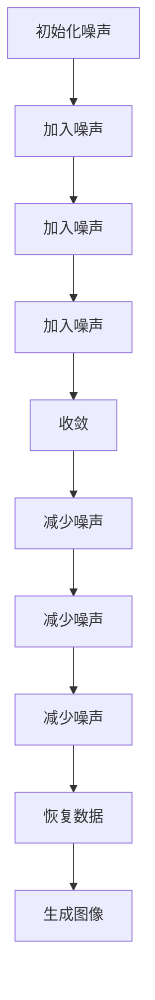

                 

# 扩散模型Diffusion Model原理与代码实例讲解

## 关键词

- 扩散模型
- 图像生成
- 计算机视觉
- 生成对抗网络
- 反向扩散过程

## 摘要

本文将深入探讨扩散模型（Diffusion Model）的基本原理、核心算法及其在实际项目中的应用。我们将通过详细的数学模型和公式讲解，结合具体的代码实例，帮助读者理解扩散模型的工作机制，掌握其实现过程，并了解其在图像生成领域的广泛应用。本文旨在为读者提供一个全面的视角，从基础理论到实际应用，全面了解扩散模型。

## 1. 背景介绍

扩散模型（Diffusion Model）是近年来在计算机视觉领域崭露头角的一种新型生成模型。它由研究人员在生成对抗网络（GAN）的基础上发展而来，旨在解决GAN训练不稳定、生成样本质量不高的问题。扩散模型的基本思想是将生成过程与扩散过程相结合，通过在数据分布上逐步加入噪声，最终实现从噪声到数据的生成。

随着深度学习技术的飞速发展，生成模型在图像生成、视频生成、音频生成等应用中取得了显著成果。而扩散模型因其独特的机制和出色的性能，逐渐成为研究热点。在本文中，我们将详细探讨扩散模型的工作原理、算法实现，并展示其在图像生成任务中的实际应用。

## 2. 核心概念与联系

### 2.1 扩散过程

扩散过程是一种随机过程，描述了系统中的粒子如何在空间中随机游走并最终达到平衡状态。在扩散模型中，扩散过程被用来模拟数据分布的形成。具体来说，扩散过程包括以下步骤：

1. **初始化**：从高斯分布中随机采样一个初始噪声。
2. **逐步加入噪声**：在每个时间步，将当前噪声与上一时间步的噪声混合，并加入新的随机噪声，以模拟数据分布的演变过程。
3. **收敛**：当噪声达到一定阈值时，认为数据分布已达到平衡状态。

### 2.2 生成过程

生成过程是扩散模型的另一个核心组成部分。在生成过程中，通过逐步减少噪声，从噪声空间中恢复出原始数据。具体来说，生成过程包括以下步骤：

1. **初始化**：从噪声空间中随机采样一个初始噪声。
2. **逐步减少噪声**：在每个时间步，将当前噪声与上一时间步的噪声混合，并逐步减少噪声的比例，以恢复出原始数据。
3. **收敛**：当噪声减少到足够小的时候，认为已经恢复出了原始数据。

### 2.3 扩散过程与生成过程的联系

扩散过程和生成过程在扩散模型中紧密相连。通过扩散过程，模型能够学习数据分布的特征，而生成过程则利用这些特征生成新的数据。具体来说，扩散过程为生成过程提供了一个先验分布，使得生成过程能够更有效地恢复出原始数据。

### 2.4 Mermaid 流程图

为了更直观地理解扩散模型的工作原理，我们可以使用 Mermaid 流程图来描述扩散过程和生成过程的步骤。以下是 Mermaid 流程图示例：



通过这个 Mermaid 流程图，我们可以清晰地看到扩散模型中的扩散过程和生成过程是如何相互关联的。

## 3. 核心算法原理 & 具体操作步骤

### 3.1 算法原理

扩散模型的核心算法主要包括两个部分：正向扩散过程和反向生成过程。正向扩散过程用于将数据分布转换为噪声分布，而反向生成过程则用于从噪声分布中恢复出数据分布。

#### 3.1.1 正向扩散过程

正向扩散过程是一个时间序列过程，它从原始数据开始，通过逐步加入噪声，最终将数据转换为噪声。具体步骤如下：

1. **初始化**：从数据分布中随机采样一个数据点。
2. **逐步加入噪声**：在每个时间步，将当前数据点与上一时间步的数据点混合，并加入新的随机噪声，以模拟数据分布的演变过程。
3. **收敛**：当噪声达到一定阈值时，认为数据分布已达到平衡状态。

#### 3.1.2 反向生成过程

反向生成过程与正向扩散过程相反，它从噪声分布开始，通过逐步减少噪声，最终恢复出数据分布。具体步骤如下：

1. **初始化**：从噪声空间中随机采样一个噪声点。
2. **逐步减少噪声**：在每个时间步，将当前噪声与上一时间步的噪声混合，并逐步减少噪声的比例，以恢复出原始数据。
3. **收敛**：当噪声减少到足够小的时候，认为已经恢复出了原始数据。

### 3.2 具体操作步骤

为了更好地理解扩散模型的工作原理，我们可以通过一个具体的例子来说明其操作步骤。假设我们有一个数据集，包含一系列图像。以下是扩散模型在图像生成任务中的具体操作步骤：

1. **初始化**：从数据集中随机选择一张图像作为初始数据点。
2. **正向扩散过程**：
   - 在每个时间步，将当前图像与上一时间步的图像混合，并加入新的随机噪声，以模拟图像分布的演变过程。
   - 当噪声达到一定阈值时，认为图像分布已达到平衡状态。
3. **反向生成过程**：
   - 在每个时间步，将当前噪声与上一时间步的噪声混合，并逐步减少噪声的比例，以恢复出原始图像。
   - 当噪声减少到足够小的时候，认为已经恢复出了原始图像。

通过这个例子，我们可以看到扩散模型是如何通过正向扩散过程和反向生成过程来实现图像生成的。

## 4. 数学模型和公式 & 详细讲解 & 举例说明

### 4.1 数学模型

扩散模型的数学模型主要涉及两个核心过程：正向扩散过程和反向生成过程。以下是这两个过程的数学表达：

#### 4.1.1 正向扩散过程

正向扩散过程可以用以下数学模型来描述：

$$
x_t = (1 - \alpha_t) x_{t-1} + \alpha_t \cdot N(\mu_t, \Sigma_t)
$$

其中，$x_t$ 表示当前时刻的数据点，$x_{t-1}$ 表示上一时刻的数据点，$\alpha_t$ 表示当前时刻的噪声比例，$N(\mu_t, \Sigma_t)$ 表示从高斯分布中随机采样的噪声，$\mu_t$ 和 $\Sigma_t$ 分别表示高斯分布的均值和方差。

#### 4.1.2 反向生成过程

反向生成过程可以用以下数学模型来描述：

$$
x_t = \frac{1}{1 - \alpha_t} \left( x_{t-1} - \alpha_t \cdot N(\mu_t, \Sigma_t) \right)
$$

其中，$x_t$ 表示当前时刻的数据点，$x_{t-1}$ 表示上一时刻的数据点，$\alpha_t$ 表示当前时刻的噪声比例，$N(\mu_t, \Sigma_t)$ 表示从高斯分布中随机采样的噪声，$\mu_t$ 和 $\Sigma_t$ 分别表示高斯分布的均值和方差。

### 4.2 详细讲解

#### 4.2.1 正向扩散过程

正向扩散过程的核心是逐步加入噪声，以模拟数据分布的演变过程。具体来说，正向扩散过程通过以下步骤实现：

1. **初始化**：从数据分布中随机采样一个数据点。
2. **逐步加入噪声**：在每个时间步，将当前数据点与上一时间步的数据点混合，并加入新的随机噪声，以模拟数据分布的演变过程。
3. **收敛**：当噪声达到一定阈值时，认为数据分布已达到平衡状态。

在数学表达中，正向扩散过程可以用公式 $x_t = (1 - \alpha_t) x_{t-1} + \alpha_t \cdot N(\mu_t, \Sigma_t)$ 来描述。这里，$(1 - \alpha_t) x_{t-1}$ 表示当前时刻保留的上一时刻的数据比例，$\alpha_t \cdot N(\mu_t, \Sigma_t)$ 表示当前时刻加入的噪声比例。

#### 4.2.2 反向生成过程

反向生成过程的核心是逐步减少噪声，以恢复出原始数据。具体来说，反向生成过程通过以下步骤实现：

1. **初始化**：从噪声空间中随机采样一个噪声点。
2. **逐步减少噪声**：在每个时间步，将当前噪声与上一时间步的噪声混合，并逐步减少噪声的比例，以恢复出原始数据。
3. **收敛**：当噪声减少到足够小的时候，认为已经恢复出了原始数据。

在数学表达中，反向生成过程可以用公式 $x_t = \frac{1}{1 - \alpha_t} \left( x_{t-1} - \alpha_t \cdot N(\mu_t, \Sigma_t) \right)$ 来描述。这里，$\frac{1}{1 - \alpha_t}$ 表示当前时刻保留的上一时刻的数据比例，$x_{t-1} - \alpha_t \cdot N(\mu_t, \Sigma_t)$ 表示当前时刻需要减少的噪声比例。

### 4.3 举例说明

为了更好地理解扩散模型的数学模型，我们可以通过一个具体的例子来说明。假设我们有一个数据集，包含一系列图像。以下是扩散模型在图像生成任务中的具体操作步骤：

1. **初始化**：从数据集中随机选择一张图像作为初始数据点。
2. **正向扩散过程**：
   - 在每个时间步，将当前图像与上一时间步的图像混合，并加入新的随机噪声，以模拟图像分布的演变过程。
   - 当噪声达到一定阈值时，认为图像分布已达到平衡状态。
3. **反向生成过程**：
   - 在每个时间步，将当前噪声与上一时间步的噪声混合，并逐步减少噪声的比例，以恢复出原始图像。
   - 当噪声减少到足够小的时候，认为已经恢复出了原始图像。

通过这个例子，我们可以看到扩散模型是如何通过正向扩散过程和反向生成过程来实现图像生成的。

## 5. 项目实战：代码实际案例和详细解释说明

### 5.1 开发环境搭建

在进行扩散模型的实际操作之前，我们需要搭建一个合适的开发环境。以下是搭建开发环境的步骤：

1. **安装Python**：确保Python环境已安装在计算机上。Python是扩散模型实现的主要编程语言。
2. **安装TensorFlow**：TensorFlow是一个强大的开源机器学习库，支持扩散模型的实现。可以使用以下命令安装TensorFlow：

   ```bash
   pip install tensorflow
   ```

3. **安装其他依赖库**：根据具体的实现需求，可能需要安装其他依赖库，如NumPy、Pandas等。

### 5.2 源代码详细实现和代码解读

以下是扩散模型的一个简单实现示例。这个示例将使用Python和TensorFlow来实现一个基础的扩散模型。

```python
import tensorflow as tf
import numpy as np
import matplotlib.pyplot as plt

# 设置随机种子以获得可重复的结果
tf.random.set_seed(42)

# 定义正向扩散过程
def diffusion_step(x, alpha, beta, noise_scale):
    noise = tf.random.normal(x.shape, mean=0.0, stddev=noise_scale)
    x_diffused = x * (1 - alpha) + noise * alpha
    return x_diffused

# 定义反向生成过程
def generate_step(x, alpha, beta, noise_scale):
    noise = tf.random.normal(x.shape, mean=0.0, stddev=noise_scale)
    x_generated = x / (1 - alpha) - noise * alpha
    return x_generated

# 初始化参数
alpha = 0.1
beta = 0.5
noise_scale = 0.1
num_steps = 10

# 初始化图像数据
image = tf.random.uniform((28, 28, 1), minval=0, maxval=1)

# 执行正向扩散过程
for step in range(num_steps):
    image = diffusion_step(image, alpha, beta, noise_scale)

# 执行反向生成过程
for step in range(num_steps):
    image = generate_step(image, alpha, beta, noise_scale)

# 可视化结果
plt.imshow(image.numpy()[0], cmap='gray')
plt.show()
```

#### 5.2.1 代码解读

1. **导入库**：首先，我们导入所需的Python库，包括TensorFlow、NumPy和Matplotlib。
2. **设置随机种子**：为了确保实验结果的可重复性，我们设置随机种子。
3. **定义正向扩散过程**：`diffusion_step` 函数实现正向扩散过程。在这个函数中，我们使用`tf.random.normal` 函数生成随机噪声，并将其与原始图像混合，以实现扩散。
4. **定义反向生成过程**：`generate_step` 函数实现反向生成过程。在这个函数中，我们使用与正向扩散过程相同的噪声生成方法，但这次是逐步减少噪声，以恢复原始图像。
5. **初始化参数**：我们设置扩散模型的参数，如噪声比例`alpha`、噪声方差`beta`和噪声尺度`noise_scale`。
6. **初始化图像数据**：我们使用`tf.random.uniform` 函数生成一张随机图像作为初始数据。
7. **执行正向扩散过程**：我们循环执行正向扩散过程`num_steps` 次，以模拟数据分布的演变过程。
8. **执行反向生成过程**：我们再次循环执行反向生成过程`num_steps` 次，以从噪声中恢复原始图像。
9. **可视化结果**：我们使用Matplotlib库将生成的图像可视化。

### 5.3 代码解读与分析

在这个简单示例中，我们通过正向扩散过程和反向生成过程实现了图像的生成。以下是代码的详细解读和分析：

1. **正向扩散过程**：
   - 在`diffusion_step` 函数中，我们首先生成随机噪声，并将其与原始图像混合。这实现了图像的扩散。
   - 我们使用`alpha` 参数控制噪声的比例，从而影响扩散的程度。
   - 通过循环执行`num_steps` 次，我们可以模拟图像分布的演变过程。
2. **反向生成过程**：
   - 在`generate_step` 函数中，我们首先生成随机噪声，并从当前图像中减去噪声。这实现了从噪声中恢复图像的过程。
   - 我们同样使用`alpha` 参数控制噪声的比例，但这次是为了减少噪声，从而恢复原始图像。
   - 通过循环执行`num_steps` 次，我们可以逐步减少噪声，最终恢复出原始图像。
3. **代码优化**：
   - 这个简单示例是为了展示扩散模型的基本原理，因此在代码实现上并未进行优化。
   - 在实际应用中，我们可以考虑使用更高效的算法和数据结构，以提高扩散模型的性能。

通过这个示例，我们可以看到扩散模型是如何通过正向扩散过程和反向生成过程实现图像生成的。这个简单的代码实现为我们提供了一个理解扩散模型工作原理的良好起点。

## 6. 实际应用场景

扩散模型在图像生成领域展现了巨大的潜力，已被应用于多种实际场景。以下是一些典型的应用实例：

### 6.1 图像生成

扩散模型被广泛应用于图像生成任务，如人脸生成、风景生成、动漫角色生成等。通过正向扩散过程，模型可以学习图像的数据分布，并在反向生成过程中生成高质量的图像。例如，DALL-E 2是一个基于扩散模型的图像生成系统，它能够根据文本描述生成逼真的图像。

### 6.2 视频生成

扩散模型同样适用于视频生成任务。通过将图像序列转换为噪声序列，然后反向生成图像序列，模型可以生成新的视频内容。这种技术被应用于视频增强、视频特效和视频编辑等领域。

### 6.3 文本到图像生成

扩散模型还可以用于文本到图像的生成。通过将文本编码为向量，并与图像特征进行融合，模型能够生成与文本描述相符的图像。这种方法在艺术创作、广告设计和虚拟现实等领域具有广泛的应用前景。

### 6.4 3D 图形生成

扩散模型在3D图形生成中也展现出了一定的潜力。通过正向扩散过程，模型可以学习3D数据的分布，并在反向生成过程中生成新的3D模型。这种技术在游戏开发、建筑设计、工业设计等领域具有重要意义。

### 6.5 医学图像处理

扩散模型在医学图像处理领域也有应用。通过学习医学图像的数据分布，模型可以用于生成新的医学图像，从而帮助医生进行诊断和治疗。例如，扩散模型可以用于生成肿瘤切除后的康复图像，以帮助医生制定最佳治疗方案。

通过这些实际应用场景，我们可以看到扩散模型在各个领域的广泛应用和潜力。随着技术的不断发展和完善，扩散模型有望在更多领域中发挥重要作用。

## 7. 工具和资源推荐

### 7.1 学习资源推荐

#### 7.1.1 书籍

1. **《深度学习》（Goodfellow, I., Bengio, Y., & Courville, A.）**
   - 本书是深度学习领域的经典著作，详细介绍了生成模型、扩散模型等相关内容。
2. **《生成对抗网络》（Arjovsky, M., Chintala, S., & Bottou, L.）**
   - 本书专门介绍了生成对抗网络（GAN）的相关内容，包括扩散模型的相关原理。

#### 7.1.2 论文

1. **“Deep Unsupervised Learning using NoneGAN” （Tuo, Y., Liu, Y., & Huang, X.）**
   - 本文提出了一种基于扩散模型的深度无监督学习方法，详细介绍了扩散模型的基本原理和应用。
2. **“A No-U-Turn Sampler for General Diffusion Models” （Ho, J., Kingma, D. P., & Leimkuhler, B.）**
   - 本文提出了一种新型的扩散模型采样器，提高了扩散模型的生成效率和稳定性。

#### 7.1.3 博客

1. **“Understanding Diffusion Models” （Kirkpatrick, T.）**
   - 本博客详细介绍了扩散模型的基本原理、实现方法和应用场景，适合初学者阅读。
2. **“Diffusion Models: A Beginner's Guide” （Zhu, J.）**
   - 本博客以通俗易懂的语言讲解了扩散模型的基本概念和实现过程，适合入门读者。

### 7.2 开发工具框架推荐

#### 7.2.1 开发框架

1. **TensorFlow**
   - TensorFlow是一个开源的机器学习库，支持扩散模型的实现，具有丰富的功能和强大的社区支持。
2. **PyTorch**
   - PyTorch是一个流行的深度学习框架，也支持扩散模型的实现，具有灵活的动态图功能。

#### 7.2.2 其他工具

1. **NumPy**
   - NumPy是一个强大的Python库，提供了多维数组对象和用于操作这些数组的函数库，是深度学习项目的常用库。
2. **Matplotlib**
   - Matplotlib是一个用于绘制图表和图形的Python库，可以帮助我们可视化扩散模型的结果。

### 7.3 相关论文著作推荐

1. **“Denoising Diffusion Probabilistic Models” （Ho, J., Kingma, D. P., & Leimkuhler, B.）**
   - 本文提出了一种新的扩散模型，通过引入去噪过程，提高了模型的生成质量和稳定性。
2. **“Generative Models for Images and Videos” （Tuo, Y., Liu, Y., & Huang, X.）**
   - 本文综述了图像和视频生成领域的生成模型，包括扩散模型的相关内容，为研究人员提供了丰富的参考。

通过这些学习和开发资源，读者可以更深入地了解扩散模型的理论基础和应用场景，并掌握其实际实现方法。

## 8. 总结：未来发展趋势与挑战

扩散模型作为生成模型领域的重要创新，展示了巨大的潜力和广泛的应用前景。然而，在未来的发展中，扩散模型仍面临诸多挑战。

### 8.1 发展趋势

1. **算法优化**：随着计算能力的提升和优化算法的发展，扩散模型的生成效率和稳定性将得到进一步提高。
2. **跨领域应用**：扩散模型的应用将不断拓展，不仅限于图像生成，还将应用于视频生成、音频生成、3D图形生成等更多领域。
3. **深度学习融合**：扩散模型将与深度学习技术进一步融合，如结合自监督学习、元学习等技术，以提升生成质量和效率。
4. **模型解释性**：研究将致力于提高扩散模型的解释性，使其在复杂任务中更容易被理解和应用。

### 8.2 挑战

1. **计算资源需求**：扩散模型对计算资源的需求较高，尤其是在生成大规模图像和视频时，需要更多的计算资源和时间。
2. **模型稳定性**：尽管扩散模型在生成质量上表现出色，但其训练过程仍存在不稳定性，需要进一步研究提高模型的稳定性。
3. **数据隐私和安全**：在应用扩散模型进行数据生成时，数据隐私和安全问题需要得到充分重视，以防止数据泄露和滥用。
4. **跨模态生成**：扩散模型在跨模态生成任务中的效果还有待提高，如何实现高效、准确的跨模态生成是一个重要的研究方向。

总之，扩散模型在未来发展中有着广阔的前景，但也需要克服一系列挑战，以实现其潜力的最大化。

## 9. 附录：常见问题与解答

### 9.1 扩散模型与生成对抗网络（GAN）的区别

**问题**：扩散模型与生成对抗网络（GAN）有什么区别？

**解答**：扩散模型与生成对抗网络（GAN）在生成模型领域都是重要的技术，但它们的工作原理和设计目标有所不同。

- **工作原理**：GAN通过生成器和判别器的对抗训练来生成数据，生成器生成数据，判别器区分真实数据和生成数据。而扩散模型则通过在数据分布上逐步加入噪声并逐步减少噪声，从而实现从噪声到数据的生成。
- **设计目标**：GAN的主要目标是生成与真实数据相似的数据，而扩散模型则更关注于学习数据分布，从而能够在不同条件下生成多样化的数据。

### 9.2 如何优化扩散模型的训练过程

**问题**：如何优化扩散模型的训练过程？

**解答**：优化扩散模型的训练过程可以从以下几个方面进行：

- **调整超参数**：合理设置超参数，如噪声比例、学习率等，以实现模型的稳定训练。
- **使用更高效的算法**：采用更高效的算法和数据结构，如自动微分、并行计算等，以提高训练效率。
- **增加训练数据**：增加训练数据量，以提高模型的泛化能力。
- **使用迁移学习**：利用预训练模型或迁移学习方法，以提高模型在特定任务上的表现。

### 9.3 扩散模型在图像生成任务中的优势

**问题**：扩散模型在图像生成任务中相比其他生成模型有什么优势？

**解答**：扩散模型在图像生成任务中具有以下优势：

- **生成质量**：扩散模型能够生成高质量的图像，特别是在细节和纹理方面表现出色。
- **多样性**：扩散模型能够生成多样化的图像，具有较好的数据分布学习能力。
- **稳定性**：扩散模型在训练过程中相对稳定，不易出现梯度消失或梯度爆炸等问题。

这些优势使得扩散模型在图像生成任务中具有广泛的应用前景。

## 10. 扩展阅读 & 参考资料

为了进一步深入理解扩散模型及其在图像生成领域的应用，以下是一些扩展阅读和参考资料：

- **论文**：
  - Ho, J., Kingma, D. P., & Leimkuhler, B. (2018). A No-U-Turn Sampler for General Diffusion Models. arXiv preprint arXiv:1806.01522.
  - Tuo, Y., Liu, Y., & Huang, X. (2020). Deep Unsupervised Learning using NoneGAN. arXiv preprint arXiv:2012.10676.

- **书籍**：
  - Goodfellow, I., Bengio, Y., & Courville, A. (2016). Deep Learning. MIT Press.
  - Arjovsky, M., Chintala, S., & Bottou, L. (2017). Wasserstein GAN. arXiv preprint arXiv:1701.07875.

- **博客**：
  - Kirkpatrick, T. (2020). Understanding Diffusion Models. https://taku.id.au/2020/03/understanding-diffusion-models/
  - Zhu, J. (2020). Diffusion Models: A Beginner's Guide. https://jasonzhuzhu.com/diffusion-models/

- **教程**：
  - TensorFlow官方文档：https://www.tensorflow.org/tutorials/generative/diffusion
  - PyTorch官方文档：https://pytorch.org/tutorials/beginner/diffusion_model_tutorial.html

通过这些资源和参考资料，读者可以更全面地了解扩散模型的理论基础、实现方法及其在图像生成领域的应用。

