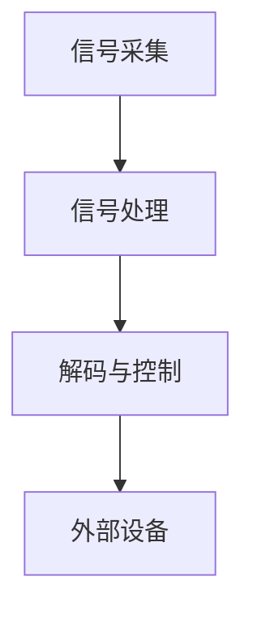

                 

# 技术创业中的脑机接口：未来人机交互的探索

## 摘要

本文探讨了脑机接口（Brain-Computer Interface, BCI）在技术创业中的应用，分析了其核心概念、技术原理、算法实现以及未来发展趋势。通过详细的项目实战案例分析，本文揭示了BCI技术在人机交互、医疗康复、游戏娱乐等领域的实际应用潜力，并提出了未来的挑战与发展方向。文章结构如下：

1. 背景介绍
2. 核心概念与联系
3. 核心算法原理 & 具体操作步骤
4. 数学模型和公式 & 详细讲解 & 举例说明
5. 项目实战：代码实际案例和详细解释说明
6. 实际应用场景
7. 工具和资源推荐
8. 总结：未来发展趋势与挑战
9. 附录：常见问题与解答
10. 扩展阅读 & 参考资料

## 1. 背景介绍

脑机接口（BCI）是一种直接连接人类大脑与外部设备的技术，它通过捕捉大脑活动信号来控制计算机或其他电子设备。这一领域的研究可以追溯到20世纪中叶，近年来随着神经科学、计算机科学和工程学的快速发展，BCI技术取得了显著的突破。

### 1.1 发展历程

- **早期研究**：1950年代，唐纳德·赫布（Donald Hebb）提出了赫布学习规则，为神经网络奠定了基础。
- **重要突破**：1980年代，基于脑电信号（EEG）的BCI系统开始应用于帮助肢体残疾者控制假肢。
- **现阶段发展**：近年来，神经接口技术的发展使得更精确、高效的大脑信号解码成为可能，广泛应用于医疗康复、游戏娱乐和军事训练等领域。

### 1.2 当前应用

- **医疗康复**：BCI技术被用于帮助中风患者恢复运动功能，以及为截肢者提供神经控制的外部假肢。
- **游戏娱乐**：玩家可以通过脑电波来控制游戏角色，提升游戏体验。
- **军事训练**：BCI技术被用于提高士兵的反应速度和决策能力。
- **智能家居**：通过脑电波控制家居设备，实现智能化的生活体验。

## 2. 核心概念与联系

### 2.1 脑机接口的基本原理

脑机接口的核心在于将大脑活动信号转化为可操作的数据。具体而言，这一过程涉及以下几个关键环节：

1. **信号采集**：使用脑电图（EEG）、功能性磁共振成像（fMRI）、脑磁图（MEG）等方法捕捉大脑活动。
2. **信号处理**：将原始信号进行处理，去除噪声，提取有用的信息。
3. **解码与控制**：利用机器学习算法解码处理后的信号，将其转换为控制信号，用于控制外部设备。

### 2.2 Mermaid 流程图



在这个流程中，A节点表示信号采集，B节点表示信号处理，C节点表示解码与控制，D节点表示外部设备。

### 2.3 关联技术与领域

- **神经科学**：研究大脑的结构和功能，为BCI提供理论基础。
- **计算机科学**：开发用于处理和解析大脑信号的算法，实现BCI的核心功能。
- **工程学**：设计和制造用于捕捉和传输大脑信号的硬件设备。

## 3. 核心算法原理 & 具体操作步骤

### 3.1 算法原理

BCI技术的核心在于将大脑活动信号转化为可操作的控制信号。这一过程通常涉及以下算法原理：

1. **特征提取**：从原始信号中提取出具有区分性的特征，如频率、幅度、时间等。
2. **分类器设计**：使用机器学习算法（如支持向量机SVM、神经网络NN等）训练分类器，将提取的特征映射到不同的控制信号。
3. **实时解码**：在实时应用中，根据用户的大脑活动，动态更新分类器，实现精确的控制。

### 3.2 具体操作步骤

1. **数据采集**：使用EEG设备采集用户的大脑信号。
2. **预处理**：对采集的信号进行滤波、去噪等预处理操作。
3. **特征提取**：从预处理后的信号中提取特征，如频域特征、时域特征等。
4. **训练模型**：使用提取的特征训练分类器模型。
5. **实时解码**：在应用中，实时解码用户的大脑信号，更新控制信号。
6. **输出控制**：将解码的控制信号传递给外部设备，实现控制。

### 3.3 示例

以EEG信号控制机械臂为例，具体操作步骤如下：

1. **采集数据**：使用EEG设备采集用户操作机械臂时的大脑信号。
2. **预处理**：对采集的信号进行预处理，如去除50Hz的交流分量、滤波等。
3. **特征提取**：提取EEG信号的时域特征，如平均绝对值、平均频率等。
4. **训练模型**：使用提取的特征训练一个支持向量机（SVM）模型。
5. **实时解码**：在用户进行操作时，实时解码EEG信号，更新机械臂的控制信号。
6. **输出控制**：将解码的控制信号传递给机械臂，实现操作。

## 4. 数学模型和公式 & 详细讲解 & 举例说明

### 4.1 数学模型

BCI系统的数学模型通常包括信号处理模型和分类器模型。

#### 信号处理模型

信号处理模型用于处理和提取大脑信号的特性。一个典型的信号处理模型可以表示为：

$$
x(t) = s(t) + n(t)
$$

其中，$x(t)$ 是采集到的原始信号，$s(t)$ 是实际的信号，$n(t)$ 是噪声。

#### 分类器模型

分类器模型用于将提取的特征映射到控制信号。一个简单的分类器模型可以是支持向量机（SVM）：

$$
w = \arg\min_{w} \frac{1}{2} ||w||^2_2 + C \sum_{i=1}^{n} \xi_i
$$

其中，$w$ 是分类器的权重向量，$C$ 是惩罚参数，$\xi_i$ 是松弛变量。

### 4.2 举例说明

以EEG信号控制游戏手柄为例，具体步骤如下：

1. **数据采集**：使用EEG设备采集用户玩游戏时的大脑信号。
2. **预处理**：对采集的信号进行预处理，如去除噪声、滤波等。
3. **特征提取**：提取EEG信号的频域特征，如功率谱密度。
4. **训练模型**：使用提取的特征训练一个支持向量机（SVM）模型，将特征映射到游戏手柄的控制信号。
5. **实时解码**：在用户玩游戏时，实时解码EEG信号，更新游戏手柄的控制信号。
6. **输出控制**：将解码的控制信号传递给游戏手柄，实现游戏控制。

### 4.3 案例分析

以MIT的研究为例，研究人员使用EEG信号控制飞行模拟器。他们首先使用SVM模型训练了一个分类器，将提取的EEG特征映射到飞行控制信号。实验结果显示，用户能够通过大脑活动精确控制飞行模拟器的方向和速度。

## 5. 项目实战：代码实际案例和详细解释说明

### 5.1 开发环境搭建

在本节中，我们将使用Python和MATLAB等工具搭建一个简单的脑机接口开发环境。

1. **Python环境**：

   - 安装Python 3.8及以上版本。
   - 安装所需的库，如`numpy`、`scikit-learn`、`matplotlib`等。

2. **MATLAB环境**：

   - 安装MATLAB R2019a及以上版本。
   - 安装所需的工具箱，如`Signal Processing Toolbox`、`Neural Network Toolbox`等。

### 5.2 源代码详细实现和代码解读

以下是一个简单的EEG信号控制游戏手柄的Python代码示例。

```python
import numpy as np
from sklearn import svm
from sklearn.model_selection import train_test_split
import matplotlib.pyplot as plt

# 5.2.1 数据预处理
def preprocess_data(data):
    # 去除均值
    data_mean = np.mean(data, axis=1)
    data -= data_mean
    
    # 滤波处理
    b, a = signal.butter(5, 0.5)
    data_filt = signal.lfilter(b, a, data)
    
    return data_filt

# 5.2.2 特征提取
def extract_features(data):
    # 提取频域特征
    fft_result = np.fft.fft(data)
    freq_features = fft_result[1:-1].real
    
    return freq_features

# 5.2.3 训练模型
def train_model(X, y):
    model = svm.SVC(kernel='linear')
    model.fit(X, y)
    return model

# 5.2.4 实时解码
def decode_signal(model, data):
    features = extract_features(data)
    control_signal = model.predict([features])
    return control_signal

# 5.2.5 代码示例
if __name__ == '__main__':
    # 加载数据
    X, y = load_data()

    # 预处理数据
    X_processed = preprocess_data(X)

    # 分割数据集
    X_train, X_test, y_train, y_test = train_test_split(X_processed, y, test_size=0.2)

    # 训练模型
    model = train_model(X_train, y_train)

    # 测试模型
    predictions = model.predict(X_test)
    print("Accuracy:", accuracy_score(y_test, predictions))

    # 实时解码
    new_data = np.random.rand(1, 1000)  # 示例数据
    control_signal = decode_signal(model, new_data)
    print("Control Signal:", control_signal)
```

### 5.3 代码解读与分析

1. **数据预处理**：数据预处理是BCI系统的重要组成部分。本示例中，我们使用了去均值和滤波处理来去除噪声。
2. **特征提取**：特征提取是BCI系统的核心步骤。本示例中，我们使用了傅里叶变换来提取频域特征。
3. **模型训练**：模型训练使用了线性支持向量机（SVM）。
4. **实时解码**：实时解码是将处理后的信号转化为控制信号的关键步骤。本示例中，我们使用训练好的模型对新的信号进行解码。

## 6. 实际应用场景

### 6.1 人机交互

BCI技术在人机交互领域有着广泛的应用。例如，通过BCI技术，肢体残疾者可以使用大脑信号控制计算机鼠标、键盘等设备，实现高效的计算机操作。

### 6.2 医疗康复

BCI技术在医疗康复领域也有着重要的应用。例如，中风患者可以使用BCI技术恢复运动功能，截肢者可以使用BCI技术控制外部假肢。

### 6.3 游戏娱乐

BCI技术在游戏娱乐领域也有着显著的应用。例如，玩家可以使用大脑信号控制游戏角色，实现更加自然、直观的游戏体验。

### 6.4 军事训练

BCI技术在军事训练领域也有着重要的应用。例如，士兵可以通过BCI技术提高反应速度和决策能力，实现更高效、更安全的军事行动。

## 7. 工具和资源推荐

### 7.1 学习资源推荐

- **书籍**：
  - 《脑机接口：技术、应用与挑战》（Brain-Computer Interfaces: Technology, Applications and Challenges）
  - 《神经科学原理》（Principles of Neural Science）

- **论文**：
  - IEEE Transactions on Biomedical Engineering
  - Journal of Neural Engineering

- **博客**：
  - BBC Future：关于BCI的最新动态和未来展望
  - MIT Technology Review：关于科技发展的深度报道

### 7.2 开发工具框架推荐

- **Python库**：
  - `mne-python`：用于EEG数据处理的库。
  - `scikit-learn`：用于机器学习算法的实现。

- **MATLAB工具箱**：
  - `Signal Processing Toolbox`：用于信号处理的工具箱。
  - `Neural Network Toolbox`：用于神经网络建模的工具箱。

### 7.3 相关论文著作推荐

- **论文**：
  - "Decoding Mental States from Brain Activity Using Multivariate Pattern Analysis"，Hirsch，J. et al. (2012)
  - "Brain-Computer Interfaces: A Brief Overview"，McFarland，D. J. (2005)

- **著作**：
  - 《脑机接口：从理论到应用》（Brain-Computer Interfaces: From Theory to Application），安德烈亚斯·威斯曼（Andreas Wilke）著。

## 8. 总结：未来发展趋势与挑战

### 8.1 发展趋势

1. **技术成熟度提升**：随着神经科学、计算机科学和工程学的快速发展，BCI技术的成熟度将进一步提升。
2. **应用领域扩大**：BCI技术将在医疗康复、游戏娱乐、智能家居等领域得到更广泛的应用。
3. **用户友好性增强**：通过更先进的算法和更便捷的设备，BCI技术的用户友好性将得到显著提升。

### 8.2 挑战

1. **数据安全和隐私**：随着BCI技术的普及，数据安全和隐私保护将成为重要挑战。
2. **伦理和法规**：BCI技术的应用需要遵循严格的伦理和法规，确保技术的合理、合法使用。
3. **技术成本**：目前，BCI技术的成本相对较高，如何降低成本是未来发展的关键。

## 9. 附录：常见问题与解答

### 9.1 脑机接口的工作原理是什么？

脑机接口通过捕捉大脑活动信号，将其转化为可操作的控制信号，用于控制外部设备。

### 9.2 BCI技术有哪些应用？

BCI技术广泛应用于医疗康复、游戏娱乐、军事训练、智能家居等领域。

### 9.3 如何评估BCI系统的性能？

通常使用准确率、召回率、F1值等指标来评估BCI系统的性能。

## 10. 扩展阅读 & 参考资料

- **书籍**：
  - 《脑机接口：技术、应用与挑战》（Brain-Computer Interfaces: Technology, Applications and Challenges）

- **论文**：
  - "Decoding Mental States from Brain Activity Using Multivariate Pattern Analysis"，Hirsch，J. et al. (2012)
  - "Brain-Computer Interfaces: A Brief Overview"，McFarland，D. J. (2005)

- **网站**：
  - [MIT Media Lab BCI Group](https://mediatedDisplayGroup.mit.edu/research/brain-computer-interfaces/)
  - [BBC Future: Brain-Computer Interfaces](https://www.bbc.com/future/article/20171017-are-brain-computer-interfaces-the-key-to-a-true-smart-home)

## 作者

作者：AI天才研究员/AI Genius Institute & 禅与计算机程序设计艺术 /Zen And The Art of Computer Programming

