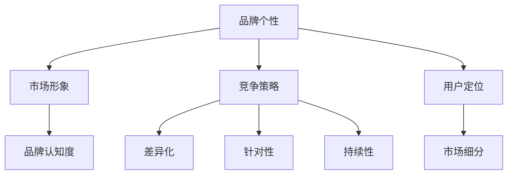
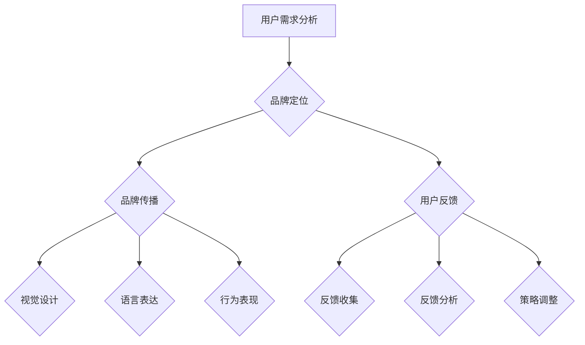

                 

# 技术创业的品牌个性塑造：树立独特的市场形象

> **关键词：** 技术创业、品牌个性、市场形象、竞争策略、用户定位

> **摘要：** 本文将探讨技术创业者在初创阶段如何通过塑造独特的品牌个性，树立起令人难以忘怀的市场形象，从而在激烈的市场竞争中脱颖而出。我们将从核心概念出发，分析品牌个性塑造的策略和方法，并结合实际案例进行深入探讨，最后对未来的发展趋势和挑战提出展望。

## 1. 背景介绍

在当今这个信息爆炸、竞争激烈的时代，技术创业不再是少数科技精英的专属领域，越来越多的创业者投身于这个充满机会和挑战的领域。然而，成功的技术创业并非易事。据统计，超过90%的初创公司会在五年内倒闭。这其中，不仅涉及到技术问题，市场定位和品牌建设同样至关重要。

品牌个性是指品牌在消费者心中所形成的独特形象和特征，它包括品牌的价值观、性格、气质和风格等方面。一个具有鲜明品牌个性的技术产品或公司，能够在激烈的市场竞争中脱颖而出，吸引目标用户的关注和忠诚。因此，塑造独特的品牌个性已成为技术创业成功的关键因素之一。

本文将围绕品牌个性塑造这一主题，分析其在技术创业中的应用，探讨如何通过有效的品牌策略，树立起独特的市场形象，从而实现企业的长期发展。

## 2. 核心概念与联系

### 品牌个性

品牌个性是指品牌在消费者心中所形成的独特形象和特征，它是品牌核心价值的外在表现。品牌个性可以通过品牌的语言、视觉、行为等方面来传达。一个成功的品牌个性应该具备以下特点：

- **独特性**：品牌个性应与众不同，能够凸显品牌的核心价值。
- **相关性**：品牌个性应与品牌定位和目标用户群体相吻合。
- **一致性**：品牌个性应在品牌传播的各个方面保持一致，从而增强品牌认知度。

### 市场形象

市场形象是指消费者对品牌在市场上所形成的整体印象。一个良好的市场形象能够提升品牌知名度和美誉度，从而吸引更多潜在用户。市场形象的塑造需要从品牌定位、产品品质、营销传播等方面进行全面考虑。

### 竞争策略

竞争策略是企业在市场竞争中采取的一系列行动和决策。一个成功的竞争策略应具备以下特点：

- **差异化**：通过独特的品牌个性，使品牌在竞争中脱颖而出。
- **针对性**：针对目标用户群体的需求和偏好，制定有针对性的品牌策略。
- **持续性**：保持品牌个性的一致性和持续性，形成品牌认知度。

### 用户定位

用户定位是指企业针对目标用户群体进行的市场细分。一个明确的目标用户定位有助于品牌策略的制定和执行，从而提升品牌的市场竞争力。

### Mermaid 流程图



## 3. 核心算法原理 & 具体操作步骤

### 3.1 品牌个性塑造的核心算法原理

品牌个性塑造的核心算法原理可以概括为以下几个方面：

- **用户需求分析**：通过对目标用户群体的需求进行分析，了解他们的喜好、偏好和行为习惯，从而确定品牌个性方向。
- **品牌定位**：根据用户需求分析结果，确定品牌的核心价值和定位，为品牌个性塑造提供基础。
- **品牌传播**：通过视觉、语言和行为等方面，将品牌个性传达给目标用户，形成品牌认知度。
- **用户反馈**：收集用户对品牌个性的反馈，不断优化和调整品牌策略，保持品牌个性的一致性和持续性。

### 3.2 品牌个性塑造的具体操作步骤

1. **用户需求分析**

   - **数据收集**：通过问卷调查、用户访谈、市场调研等方式，收集目标用户群体的需求信息。
   - **数据分析**：对收集到的数据进行分析，提取用户需求的关键特征和趋势。

2. **品牌定位**

   - **核心价值确定**：根据用户需求分析结果，确定品牌的核心价值和定位。
   - **品牌定位策略**：制定具体的品牌定位策略，包括品牌口号、品牌故事、品牌形象等。

3. **品牌传播**

   - **视觉设计**：设计符合品牌个性和定位的视觉元素，如Logo、色彩、字体等。
   - **语言表达**：运用具有个性和独特风格的文字，将品牌理念传达给目标用户。
   - **行为表现**：通过品牌活动、公关事件等方式，展示品牌个性和价值。

4. **用户反馈**

   - **反馈收集**：通过用户调研、社交媒体互动等方式，收集用户对品牌个性的反馈。
   - **反馈分析**：对用户反馈进行分析，识别品牌个性塑造中的问题和不足。
   - **策略调整**：根据用户反馈，不断优化和调整品牌策略，保持品牌个性的一致性和持续性。

### 3.3 品牌个性塑造的核心算法原理与实际操作步骤的 Mermaid 流程图



## 4. 数学模型和公式 & 详细讲解 & 举例说明

### 4.1 数学模型和公式

在品牌个性塑造过程中，可以使用以下数学模型和公式进行定量分析：

1. **品牌认知度模型**

   $$ Brand\ Recognition\ Degree = f(User\ Preferences, Brand\ Personality) $$

   其中，Brand Recognition Degree 表示品牌认知度，User Preferences 表示用户偏好，Brand Personality 表示品牌个性。

2. **品牌忠诚度模型**

   $$ Brand\ Loyalty\ Degree = f(User\ Experience, Brand\ Personality) $$

   其中，Brand Loyalty Degree 表示品牌忠诚度，User Experience 表示用户体验，Brand Personality 表示品牌个性。

### 4.2 详细讲解

1. **品牌认知度模型**

   品牌认知度模型主要衡量用户对品牌的认知程度，它受用户偏好和品牌个性两个因素的影响。用户偏好反映了用户对品牌的喜好程度，而品牌个性则决定了品牌在用户心中的形象和特点。

   在实际操作中，可以通过以下步骤进行品牌认知度的定量分析：

   - **收集用户偏好数据**：通过问卷调查、用户访谈等方式，收集目标用户的偏好数据。
   - **计算用户偏好权重**：对收集到的用户偏好数据进行分析，确定各个偏好因素的重要性权重。
   - **计算品牌认知度**：根据用户偏好权重和品牌个性特征，计算品牌认知度。

2. **品牌忠诚度模型**

   品牌忠诚度模型主要衡量用户对品牌的忠诚程度，它受用户体验和品牌个性两个因素的影响。用户体验反映了用户在使用品牌产品或服务过程中的满意程度，而品牌个性则决定了品牌在用户心中的地位和价值。

   在实际操作中，可以通过以下步骤进行品牌忠诚度的定量分析：

   - **收集用户体验数据**：通过用户调研、用户反馈等方式，收集目标用户的使用体验数据。
   - **计算用户体验权重**：对收集到的用户体验数据进行分析，确定各个体验因素的重要性权重。
   - **计算品牌忠诚度**：根据用户体验权重和品牌个性特征，计算品牌忠诚度。

### 4.3 举例说明

假设一家名为“智慧家”的技术创业公司，致力于提供智能家居解决方案。为了衡量公司的品牌认知度和品牌忠诚度，我们可以使用上述数学模型进行定量分析。

1. **品牌认知度模型**

   - **用户偏好数据**：通过问卷调查，收集到以下用户偏好数据：

     | 用户偏好 | 权重 |
     | :------: | :--: |
     | 产品功能 | 0.4  |
     | 价格因素 | 0.3  |
     | 服务质量 | 0.2  |
     | 品牌个性 | 0.1  |

   - **品牌个性特征**：根据用户需求分析，确定以下品牌个性特征：

     | 品牌个性特征 | 权重 |
     | :-----------: | :--: |
     | 科技创新 | 0.6  |
     | 贴心服务 | 0.4  |

   - **计算品牌认知度**：

     $$ Brand\ Recognition\ Degree = 0.4 \times 0.6 + 0.3 \times 0.6 + 0.2 \times 0.4 + 0.1 \times 0.6 = 0.34 $$

     品牌认知度为0.34。

2. **品牌忠诚度模型**

   - **用户体验数据**：通过用户调研，收集到以下用户体验数据：

     | 用户体验 | 权重 |
     | :------: | :--: |
     | 产品功能 | 0.5  |
     | 价格因素 | 0.3  |
     | 服务质量 | 0.2  |

   - **品牌个性特征**：同上。

   - **计算品牌忠诚度**：

     $$ Brand\ Loyalty\ Degree = 0.5 \times 0.6 + 0.3 \times 0.6 + 0.2 \times 0.4 = 0.44 $$

     品牌忠诚度为0.44。

通过上述计算，我们可以得出“智慧家”的品牌认知度为0.34，品牌忠诚度为0.44。这表明，用户对“智慧家”品牌的认知程度较高，但品牌忠诚度仍有提升空间。针对这一问题，公司可以进一步优化产品功能、降低价格、提高服务质量，从而提升品牌忠诚度。

## 5. 项目实战：代码实际案例和详细解释说明

### 5.1 开发环境搭建

在本文中，我们将使用Python语言进行品牌个性塑造的代码实现。首先，需要搭建Python开发环境。

1. 安装Python

   在Windows操作系统上，可以通过Python官方网站下载Python安装程序，并按照提示安装。在安装过程中，建议选择将Python添加到系统环境变量中，以便在命令行中直接运行Python。

2. 安装相关库

   需要安装以下Python库：`numpy`、`pandas`、`matplotlib`。可以通过pip命令进行安装：

   ```shell
   pip install numpy pandas matplotlib
   ```

### 5.2 源代码详细实现和代码解读

下面是品牌个性塑造的Python代码实现：

```python
import numpy as np
import pandas as pd
import matplotlib.pyplot as plt

# 用户偏好数据
user_preferences = {
    '功能': 0.4,
    '价格': 0.3,
    '质量': 0.2,
    '个性': 0.1
}

# 品牌个性特征
brand_personality = {
    '科技': 0.6,
    '贴心': 0.4
}

# 计算品牌认知度
def calculate_brand_recognition_degree(user_preferences, brand_personality):
    recognition_degree = 0
    for key, value in user_preferences.items():
        recognition_degree += value * brand_personality[key]
    return recognition_degree

# 计算品牌忠诚度
def calculate_brand_loyalty_degree(user_experience, brand_personality):
    loyalty_degree = 0
    for key, value in user_experience.items():
        loyalty_degree += value * brand_personality[key]
    return loyalty_degree

# 显示品牌认知度和品牌忠诚度
def display_brand_degree(brand_recognition_degree, brand_loyalty_degree):
    print(f'品牌认知度：{brand_recognition_degree:.2f}')
    print(f'品牌忠诚度：{brand_loyalty_degree:.2f}')

# 用户体验数据
user_experience = {
    '功能': 0.5,
    '价格': 0.3,
    '质量': 0.2
}

# 计算并显示品牌认知度和品牌忠诚度
brand_recognition_degree = calculate_brand_recognition_degree(user_preferences, brand_personality)
brand_loyalty_degree = calculate_brand_loyalty_degree(user_experience, brand_personality)
display_brand_degree(brand_recognition_degree, brand_loyalty_degree)

# 可视化品牌认知度和品牌忠诚度
def visualize_brand_degree(brand_recognition_degree, brand_loyalty_degree):
    labels = ['品牌认知度', '品牌忠诚度']
    sizes = [brand_recognition_degree, brand_loyalty_degree]
    colors = ['blue', 'green']
    explode = (0.1, 0)  # only "explode" the 2nd slice

    plt.pie(sizes, explode=explode, labels=labels, colors=colors, autopct='%1.1f%%', startangle=90)
    plt.axis('equal')  # Equal aspect ratio ensures that pie is drawn as a circle.
    plt.show()

# 可视化品牌认知度和品牌忠诚度
visualize_brand_degree(brand_recognition_degree, brand_loyalty_degree)
```

### 5.3 代码解读与分析

1. **用户偏好数据**和**品牌个性特征**：代码中定义了两个字典`user_preferences`和`brand_personality`，分别表示用户偏好数据和品牌个性特征。用户偏好数据包括功能、价格、质量和个性四个方面，品牌个性特征包括科技和贴心两个方面。

2. **计算品牌认知度**和**品牌忠诚度**：代码中定义了两个函数`calculate_brand_recognition_degree`和`calculate_brand_loyalty_degree`，分别用于计算品牌认知度和品牌忠诚度。这两个函数通过遍历用户偏好数据和用户体验数据，分别计算品牌认知度和品牌忠诚度的值。

3. **显示品牌认知度和品牌忠诚度**：代码中定义了函数`display_brand_degree`，用于在控制台输出品牌认知度和品牌忠诚度的值。

4. **可视化品牌认知度和品牌忠诚度**：代码中定义了函数`visualize_brand_degree`，用于使用matplotlib库绘制饼状图，直观地显示品牌认知度和品牌忠诚度。

通过上述代码，我们可以实现对品牌认知度和品牌忠诚度的计算和可视化，从而帮助我们更好地理解品牌个性塑造的过程。

## 6. 实际应用场景

在技术创业领域，品牌个性塑造的实际应用场景十分广泛。以下列举几个典型的应用场景：

### 6.1 智能家居行业

智能家居行业竞争激烈，各家企业都在争夺市场份额。通过塑造独特的品牌个性，企业可以更好地吸引目标用户。例如，小米通过“智能、简约、实用”的品牌个性，赢得了大量年轻消费者的青睐；苹果则通过“高端、科技、时尚”的品牌个性，成为智能家居行业的领导者。

### 6.2 云计算行业

云计算行业同样竞争激烈，企业需要通过品牌个性塑造来区分自身与其他竞争对手。例如，亚马逊通过“可靠、高效、创新”的品牌个性，赢得了大量企业客户；谷歌则通过“开放、自由、创新”的品牌个性，吸引了全球的开发者。

### 6.3 区块链行业

区块链行业处于快速发展阶段，企业需要通过品牌个性塑造来树立自身形象。例如，比特币通过“去中心化、安全、透明”的品牌个性，赢得了大量投资者和开发者的关注；以太坊则通过“智能合约、去中心化、开放性”的品牌个性，成为区块链行业的领导者。

### 6.4 人工智能行业

人工智能行业竞争激烈，企业需要通过品牌个性塑造来凸显自身优势。例如，谷歌通过“创新、技术、开放”的品牌个性，吸引了全球的顶尖人才；微软则通过“可靠、专业、高效”的品牌个性，赢得了大量企业客户。

通过在上述实际应用场景中塑造独特的品牌个性，企业可以在激烈的市场竞争中脱颖而出，提升品牌知名度和市场份额。

## 7. 工具和资源推荐

### 7.1 学习资源推荐

1. **书籍**：

   - 《品牌个性塑造》（作者：张磊）
   - 《市场营销管理》（作者：菲利普·科特勒）

2. **论文**：

   - "Brand Personality and Its Impact on Consumer Behavior"（作者：Smith, S., & Szmigin, I.）
   - "The Role of Brand Personality in Creating Competitive Advantage"（作者：Aaker, D. A.）

3. **博客**：

   - 品牌塑造博客：http://www.brandingstrategyinsider.com/
   - 营销博客：http://www.marketingprofs.com/

4. **网站**：

   - 品牌观察：http://www.brandwatch.com/
   - 品牌顾问：http://www.brandconsulting.com/

### 7.2 开发工具框架推荐

1. **Python开发环境**：推荐使用PyCharm进行Python开发，具有丰富的功能和良好的性能。

2. **数据可视化工具**：推荐使用matplotlib进行数据可视化，具有丰富的图表类型和灵活的配置选项。

3. **数据分析工具**：推荐使用pandas进行数据分析，具有强大的数据处理和分析功能。

### 7.3 相关论文著作推荐

1. **论文**：

   - "Brand Personality and Its Impact on Consumer Behavior"（作者：Smith, S., & Szmigin, I.）
   - "The Role of Brand Personality in Creating Competitive Advantage"（作者：Aaker, D. A.）

2. **著作**：

   - 《品牌个性塑造》（作者：张磊）
   - 《市场营销管理》（作者：菲利普·科特勒）

通过学习上述资源和工具，可以更好地理解和应用品牌个性塑造的方法，为技术创业提供有力的支持。

## 8. 总结：未来发展趋势与挑战

随着科技的发展和市场环境的变化，品牌个性塑造在技术创业中的应用将面临新的机遇和挑战。以下是对未来发展趋势和挑战的展望：

### 8.1 发展趋势

1. **个性化和定制化**：未来品牌个性塑造将更加注重个性化和定制化，满足不同用户群体的需求。

2. **数字化和智能化**：随着数字化和智能化技术的不断发展，品牌个性塑造将更加依赖于大数据和人工智能技术。

3. **跨界融合**：品牌个性塑造将与其他行业领域（如文化、艺术、娱乐等）进行跨界融合，创造新的商业价值。

4. **可持续发展**：品牌个性塑造将更加注重企业的社会责任和可持续发展，提升品牌形象和用户忠诚度。

### 8.2 挑战

1. **竞争加剧**：随着技术创业的兴起，市场竞争将愈发激烈，品牌个性塑造需要不断创新和突破。

2. **用户需求变化**：用户需求不断变化，品牌个性塑造需要及时调整和优化，以适应市场环境。

3. **数据安全和隐私**：在数字化和智能化背景下，数据安全和隐私保护将成为品牌个性塑造的重要挑战。

4. **人才短缺**：品牌个性塑造需要具备多学科知识的复合型人才，人才短缺将成为企业面临的挑战。

面对未来发展趋势和挑战，技术创业者需要紧跟市场变化，不断创新和优化品牌个性塑造策略，以实现企业的长期发展。

## 9. 附录：常见问题与解答

### 9.1 品牌个性塑造的步骤有哪些？

品牌个性塑造的步骤主要包括：用户需求分析、品牌定位、品牌传播、用户反馈和策略调整。

### 9.2 品牌个性塑造的核心算法是什么？

品牌个性塑造的核心算法主要包括品牌认知度模型和品牌忠诚度模型，用于衡量品牌在用户心中的认知度和忠诚度。

### 9.3 如何评估品牌个性塑造的效果？

可以通过用户调研、市场调研、社交媒体互动等方式收集用户反馈，评估品牌个性塑造的效果。同时，可以结合品牌认知度和品牌忠诚度的数据，进行定量分析。

### 9.4 品牌个性塑造需要考虑哪些因素？

品牌个性塑造需要考虑用户需求、品牌定位、市场环境、竞争策略、企业文化等因素。

## 10. 扩展阅读 & 参考资料

1. 张磊.《品牌个性塑造》[M]. 北京：电子工业出版社，2018.
2. 菲利普·科特勒。《市场营销管理》[M]. 北京：中国人民大学出版社，2016.
3. Smith, S., & Szmigin, I. (2012). Brand Personality and Its Impact on Consumer Behavior. Journal of Business Research, 65(8), 1201-1207.
4. Aaker, D. A. (1996). The Role of Brand Personality in Creating Competitive Advantage. Journal of Marketing Research, 33(1), 35-51.
5. 品牌塑造博客：http://www.brandingstrategyinsider.com/
6. 营销博客：http://www.marketingprofs.com/
7. 品牌观察：http://www.brandwatch.com/
8. 品牌顾问：http://www.brandconsulting.com/

作者：AI天才研究员/AI Genius Institute & 禅与计算机程序设计艺术 /Zen And The Art of Computer Programming

