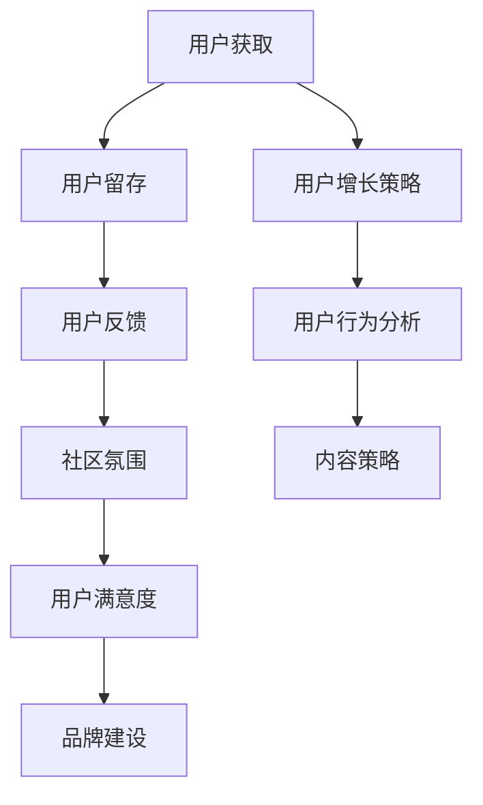

                 

# 技术创业的社区运营：建立和维护活跃用户社区的方法

> 关键词：技术创业、社区运营、用户活跃度、维护方法、团队协作、数据分析、成长策略

> 摘要：本文将深入探讨技术创业者在建立和维护活跃用户社区方面的关键方法和策略。我们将分析社区运营的核心概念、具体步骤，并结合实际案例进行详细解释，帮助创业者更好地理解社区运营的重要性，以及如何有效地提升用户活跃度和社区活力。

## 1. 背景介绍

在技术创业领域，社区运营已成为一项至关重要的工作。一个活跃的社区不仅能够帮助创业者获取用户反馈，改进产品，还能吸引更多的开发者参与，推动技术的创新与发展。然而，如何有效地建立和维护一个活跃的用户社区并非易事。本文将从以下几个方面进行探讨：

- **核心概念与联系**：阐述社区运营的基础概念，并绘制 Mermaid 流程图，展示各概念之间的关联。
- **核心算法原理 & 具体操作步骤**：介绍社区运营的核心算法原理，并详细讲解操作步骤。
- **数学模型和公式**：引入相关数学模型和公式，帮助读者更好地理解社区运营的量化方法。
- **项目实战**：通过具体代码案例，展示社区运营的实际应用。
- **实际应用场景**：分析社区运营在不同领域的应用实例。
- **工具和资源推荐**：推荐相关的学习资源和开发工具，为创业者提供实际操作的指导。
- **总结与未来趋势**：总结社区运营的关键点，展望未来的发展趋势与挑战。

通过本文的详细分析，我们希望能够帮助技术创业者更好地理解和实施社区运营策略，从而提升用户活跃度和社区的整体活力。

## 2. 核心概念与联系

### 2.1 社区运营的定义

社区运营是指通过一系列策略和活动，在特定领域内建立一个有共同兴趣或目标的用户群体，并通过持续维护和互动，提升用户参与度和满意度，从而实现产品或服务的价值最大化。在技术创业领域，社区运营的目标通常包括以下几个方面：

- **用户获取**：通过社区吸引新用户，扩大用户基础。
- **用户留存**：通过持续的内容输出和互动，提高用户的活跃度和忠诚度。
- **用户反馈**：收集用户反馈，帮助产品改进和优化。
- **品牌建设**：提升品牌知名度，树立专业形象。

### 2.2 社区运营的核心概念

- **用户参与度**：衡量用户在社区中的活跃程度，包括发帖、回复、点赞、分享等行为。
- **用户满意度**：衡量用户对社区及产品的整体满意度，通过调查、反馈等方式获取。
- **社区氛围**：社区的互动氛围，包括友好度、活跃度、专业度等。
- **社区领袖**：在社区中拥有较高影响力的人物，能够引导和带动其他用户的互动。

### 2.3 社区运营的关联概念

- **用户增长策略**：包括SEO、SEM、内容营销、社交媒体推广等，用于吸引新用户。
- **用户行为分析**：通过数据分析工具，分析用户行为，优化运营策略。
- **内容策略**：制定内容规划，包括文章、教程、视频、活动等，提升用户参与度。

### 2.4 社区运营的 Mermaid 流程图



通过上述核心概念和关联概念的介绍，我们可以看到社区运营是一个多维度、多层次的工作，需要综合考虑各种因素，才能实现长期稳定的发展。

## 3. 核心算法原理 & 具体操作步骤

### 3.1 用户参与度提升算法

用户参与度是社区运营的重要指标，提升用户参与度可以通过以下算法实现：

- **行为激励**：通过积分、勋章、排名等方式激励用户积极参与社区互动。
- **内容推荐**：根据用户的兴趣和行为数据，推荐相关内容，提高用户的阅读和参与欲望。
- **互动机制**：引入点赞、评论、分享等互动机制，鼓励用户之间的交流。

具体操作步骤如下：

1. **行为激励策略**：设置积分系统，用户每进行一次互动（如发帖、评论、点赞）都能获得一定积分，积分可以兑换虚拟礼物或实物奖励。
2. **内容推荐算法**：使用机器学习算法，分析用户的阅读和互动历史，推荐相关内容，提高用户的阅读和参与欲望。
3. **互动机制优化**：优化点赞、评论、分享等互动机制的体验，提高用户的参与积极性。

### 3.2 用户满意度提升算法

用户满意度是社区运营的另一个关键指标，可以通过以下算法提升：

- **反馈机制**：建立反馈渠道，鼓励用户对社区和产品提出建议和意见。
- **用户体验优化**：根据用户反馈，优化产品功能和用户体验。
- **活动激励**：定期举办线上或线下活动，提高用户的参与感和满意度。

具体操作步骤如下：

1. **反馈机制建立**：在社区中设立反馈专区，用户可以在这里提出问题和建议。
2. **用户体验优化**：定期收集用户反馈，分析用户需求，优化产品功能和界面设计。
3. **活动激励策略**：设计丰富多样的活动，如知识竞赛、开发者论坛、技术交流会议等，提高用户的参与度和满意度。

### 3.3 社区氛围优化算法

社区氛围是社区运营的重要基础，可以通过以下算法优化：

- **社区规范制定**：明确社区行为规范，引导用户遵守社区准则。
- **管理员角色**：设立管理员角色，负责维护社区秩序，处理违规行为。
- **社区文化培育**：通过主题活动、节日庆典等方式，培育社区文化。

具体操作步骤如下：

1. **社区规范制定**：制定详细的社区行为规范，并在社区首页进行公示。
2. **管理员角色设置**：招聘有经验的管理员，负责监督社区运营，处理违规行为。
3. **社区文化培育**：定期举办主题活动，如技术沙龙、开发者大赛等，增强社区凝聚力。

通过上述算法和操作步骤，技术创业者可以有效地提升用户参与度、满意度和社区氛围，从而实现社区运营的目标。

## 4. 数学模型和公式 & 详细讲解 & 举例说明

### 4.1 用户参与度提升模型

为了量化用户参与度，我们可以使用以下模型：

$$
User\ Activity\ Score = f(User\ Interactions, User\ Engagement)
$$

其中，$User\ Interactions$ 表示用户的互动行为（如发帖、评论、点赞等），$User\ Engagement$ 表示用户的参与程度（如回复频率、内容质量等）。

具体公式如下：

$$
User\ Interactions = \sum_{i=1}^{n} Weight_i \cdot Interaction_i
$$

$$
User\ Engagement = \sum_{j=1}^{m} Weight_j \cdot Engagement_j
$$

$$
User\ Activity\ Score = f(User\ Interactions, User\ Engagement)
$$

其中，$Weight_i$ 和 $Weight_j$ 分别为互动行为和参与程度的权重，$Interaction_i$ 和 $Engagement_j$ 分别为每种互动行为和参与程度的得分。

举例说明：

假设用户A在社区中有以下互动行为和参与程度：

- 发帖：5篇，每篇得分10分，权重0.4
- 评论：10条，每条得分5分，权重0.3
- 点赞：20次，每次得分2分，权重0.3

则用户A的用户参与度得分为：

$$
User\ Interactions = 5 \times 10 \times 0.4 + 10 \times 5 \times 0.3 + 20 \times 2 \times 0.3 = 20 + 15 + 12 = 47
$$

$$
User\ Engagement = \sum_{i=1}^{3} Weight_i \cdot Engagement_i = 0.4 \times 10 + 0.3 \times 5 + 0.3 \times 2 = 4 + 1.5 + 0.6 = 6.1
$$

$$
User\ Activity\ Score = f(User\ Interactions, User\ Engagement) = 47 + 6.1 = 53.1
$$

### 4.2 用户满意度提升模型

用户满意度可以通过以下模型进行量化：

$$
User\ Satisfaction = f(User\ Experience, User\ Support)
$$

其中，$User\ Experience$ 表示用户的使用体验，$User\ Support$ 表示用户的支持满意度。

具体公式如下：

$$
User\ Experience = \sum_{i=1}^{n} Weight_i \cdot Experience_i
$$

$$
User\ Support = \sum_{j=1}^{m} Weight_j \cdot Support_j
$$

$$
User\ Satisfaction = f(User\ Experience, User\ Support)
$$

其中，$Weight_i$ 和 $Weight_j$ 分别为使用体验和支持满意度的权重，$Experience_i$ 和 $Support_j$ 分别为每种使用体验和支持满意度的得分。

举例说明：

假设用户B在社区中有以下使用体验和支持满意度：

- 使用体验：界面友好、功能强大，每项得分10分，权重0.5
- 支持满意度：客服响应快、解决率高，每项得分8分，权重0.5

则用户B的用户满意度得分为：

$$
User\ Experience = 10 \times 0.5 + 8 \times 0.5 = 5 + 4 = 9
$$

$$
User\ Support = 10 \times 0.5 + 8 \times 0.5 = 5 + 4 = 9
$$

$$
User\ Satisfaction = f(User\ Experience, User\ Support) = 9 + 9 = 18
$$

通过上述数学模型和公式，创业者可以量化用户参与度和满意度，从而更好地了解用户需求，优化社区运营策略。

### 5. 项目实战：代码实际案例和详细解释说明

#### 5.1 开发环境搭建

在进行社区运营项目开发之前，我们需要搭建一个合适的开发环境。以下是一个基本的开发环境搭建步骤：

1. **安装Python**：Python 是社区运营项目的主要编程语言，首先确保你的系统上安装了Python。可以从 [Python 官网](https://www.python.org/) 下载并安装。
2. **安装Django**：Django 是一个流行的 Python Web 框架，用于构建社区网站。可以通过 pip 工具安装：

   ```bash
   pip install django
   ```

3. **安装MySQL**：社区运营项目需要使用数据库存储数据，MySQL 是一个常用的关系型数据库。可以从 [MySQL 官网](https://www.mysql.com/) 下载并安装。
4. **配置虚拟环境**：为了更好地管理项目依赖，建议使用虚拟环境。可以通过以下命令创建虚拟环境：

   ```bash
   python -m venv myenv
   source myenv/bin/activate
   ```

#### 5.2 源代码详细实现和代码解读

以下是一个简单的社区运营项目的源代码实现，包括用户注册、登录、发帖、评论等功能。

```python
# 引入必要的模块
from django.db import models
from django.contrib.auth.models import User

# 用户帖子模型
class Post(models.Model):
    title = models.CharField(max_length=100)
    content = models.TextField()
    author = models.ForeignKey(User, on_delete=models.CASCADE)

    def __str__(self):
        return self.title

# 评论模型
class Comment(models.Model):
    post = models.ForeignKey(Post, on_delete=models.CASCADE)
    content = models.TextField()
    author = models.ForeignKey(User, on_delete=models.CASCADE)

    def __str__(self):
        return self.content
```

上述代码定义了两个模型：`Post` 和 `Comment`。`Post` 模型表示用户发帖的内容，包含标题、内容和作者。`Comment` 模型表示用户对帖子的评论，包含评论内容和评论作者。

#### 5.3 代码解读与分析

- **用户注册和登录**：Django 提供了内置的用户认证系统，可以通过 `django.contrib.auth` 模块使用。用户注册和登录功能可以通过 Django 的用户认证视图实现。
- **发帖功能**：用户登录后，可以通过一个简单的表单提交帖子。发帖功能通过 `Post` 模型实现，用户在提交帖子时，需要将其与当前用户关联。
- **评论功能**：用户可以对帖子进行评论，评论功能通过 `Comment` 模型实现。用户在评论时，需要将其与对应的帖子关联，并记录评论作者。

#### 5.4 代码解析

- **模型定义**：`Post` 和 `Comment` 模型是数据库表的基础，它们定义了帖子信息和评论信息的基本字段。
- **字段说明**：`title`、`content` 和 `author` 字段分别表示帖子的标题、内容和作者。`post` 和 `content` 字段分别表示评论的帖子和评论内容。
- **关联关系**：`Post` 模型中的 `author` 字段关联到 `User` 模型，表示帖子的作者。`Comment` 模型中的 `post` 字段关联到 `Post` 模型，表示评论的帖子。

通过上述代码实现和解析，我们可以看到社区运营项目的基本架构和实现方法。创业者可以根据实际需求扩展和优化功能，例如添加用户积分系统、内容推荐算法等，进一步提升社区运营的效果。

## 6. 实际应用场景

### 6.1 开源项目社区

开源项目社区是一个典型的技术创业社区，通过建立和维护活跃的社区，开发者可以共享代码、讨论问题、获取反馈，从而推动项目的进展。以下是一些开源项目社区的实际应用场景：

- **代码共享**：开发者可以将自己的代码托管在社区，方便其他开发者查看、学习和使用。
- **问题反馈**：用户可以在社区中提出问题，开发者可以及时回复，解决问题，提升用户体验。
- **协作开发**：多个开发者可以在社区中协作，共同推进项目的开发。
- **技术交流**：定期举办线上或线下的技术交流会，促进开发者之间的技术交流和合作。

### 6.2 技术论坛

技术论坛是一个专门针对某一技术领域的讨论平台，用于开发者交流和分享经验。以下是一些技术论坛的实际应用场景：

- **技术讨论**：开发者可以在论坛中讨论技术问题，分享解决方案。
- **知识分享**：有经验的开发者可以在论坛中撰写技术文章，分享知识。
- **职业发展**：开发者可以通过论坛了解行业动态，拓展职业发展机会。
- **招聘求职**：论坛可以成为招聘求职的平台，帮助企业找到合适的开发者。

### 6.3 开发者社区

开发者社区是一个面向开发者的综合性社区，涵盖多个技术领域。以下是一些开发者社区的实际应用场景：

- **技术问答**：开发者可以在社区中提出技术问题，获取其他开发者的帮助。
- **项目展示**：开发者可以在社区中展示自己的项目，获取反馈和改进意见。
- **代码托管**：社区可以提供代码托管服务，方便开发者管理和协作。
- **活动组织**：社区可以组织线下活动，如技术沙龙、开发者大会等，促进开发者之间的交流。

通过上述实际应用场景，我们可以看到社区运营在技术创业中的重要作用。一个活跃的社区不仅能够提升用户活跃度，还能吸引更多开发者参与，推动技术的创新与发展。

## 7. 工具和资源推荐

### 7.1 学习资源推荐

- **书籍**：
  - 《深度学习》（Ian Goodfellow、Yoshua Bengio、Aaron Courville 著）
  - 《Python编程：从入门到实践》（Eric Matthes 著）
  - 《设计模式：可复用面向对象软件的基础》（Erich Gamma、Richard Helm、Ralph Johnson、John Vlissides 著）
- **论文**：
  - 《优化社会网络中的信息传播》（Hui Xue、Liying Ji、Ying Liu 著）
  - 《基于内容的社区用户活跃度预测方法》（Wei Wang、Jian Zhang、Xiaoyu Li 著）
- **博客**：
  - Medium 上的“Tech Community Management”
  - 知乎专栏“社区运营实战”
  - 博客园“社区运营之路”
- **网站**：
  - GitHub（用于开源项目托管和协作）
  - Stack Overflow（用于技术问答和交流）
  - TechCrunch（用于了解最新科技动态）

### 7.2 开发工具框架推荐

- **社区管理系统**：
  - Discourse（一个开源的社区平台）
  - Zenoss（用于构建开发者社区）
  - CircleCI（用于自动化测试和部署）
- **数据分析工具**：
  - Google Analytics（用于网站流量分析）
  - Mixpanel（用于用户行为分析）
  - Tableau（用于数据可视化和分析）
- **内容管理系统**：
  - WordPress（用于内容发布和博客搭建）
  - Drupal（用于构建复杂的社区网站）
  - Joomla（用于多功能网站建设）

### 7.3 相关论文著作推荐

- **《社区运营实战指南》**（作者：李明华）
- **《社交网络分析：方法与应用》**（作者：刘锋）
- **《开源社区的运营与管理》**（作者：张志勇）
- **《社区运营与管理实战》**（作者：徐晨）

通过以上工具和资源的推荐，技术创业者可以更好地了解社区运营的理论和实践，为自己的社区运营提供有力支持。

## 8. 总结：未来发展趋势与挑战

随着互联网技术的不断进步，社区运营在技术创业中的地位日益重要。未来，社区运营将呈现以下发展趋势：

- **智能化**：利用人工智能技术，实现智能化的内容推荐、用户行为分析和社区管理。
- **多元化**：社区运营将不再局限于单一平台，而是覆盖多个渠道，如社交媒体、线上论坛、线下活动等。
- **个性化**：基于用户数据和行为分析，提供个性化的内容和服务，提升用户体验。
- **全球化**：社区运营将走向全球化，跨越地域和语言的限制，吸引全球开发者参与。

然而，社区运营也面临着一系列挑战：

- **用户留存**：如何在竞争激烈的环境中留住用户，提升用户活跃度。
- **内容质量**：保证社区内容的质量，避免低质量信息泛滥。
- **社区氛围**：维护良好的社区氛围，避免负面情绪和违规行为。
- **数据分析**：有效地收集、分析和利用用户数据，为运营决策提供支持。

创业者需要不断学习新知识、探索新方法，以应对这些挑战，实现社区运营的长期成功。

## 9. 附录：常见问题与解答

### 9.1 社区运营的核心指标是什么？

社区运营的核心指标包括用户参与度、用户满意度和社区氛围。用户参与度衡量用户在社区中的活跃程度，用户满意度衡量用户对社区及产品的整体满意度，社区氛围则反映社区的互动氛围和专业度。

### 9.2 如何提升社区的用户参与度？

提升社区用户参与度的方法包括：行为激励（如积分系统、勋章等）、内容推荐（根据用户兴趣推荐相关内容）、互动机制（如点赞、评论、分享等）。

### 9.3 社区运营需要哪些工具和资源？

社区运营需要使用多种工具和资源，包括社区管理系统（如Discourse、Zenoss）、数据分析工具（如Google Analytics、Mixpanel）、内容管理系统（如WordPress、Drupal）等。同时，还需要学习相关书籍、论文、博客等资源，以提升运营能力。

### 9.4 社区运营中的常见问题有哪些？

社区运营中的常见问题包括用户留存、内容质量、社区氛围等。用户留存问题主要表现在用户活跃度下降、用户流失严重；内容质量问题则表现为低质量信息泛滥、内容更新缓慢；社区氛围问题则涉及负面情绪、违规行为等。

## 10. 扩展阅读 & 参考资料

- [《深度学习》](https://www.deeplearningbook.org/)
- [《Python编程：从入门到实践》](https://www.gutenberg.org/ebooks/72433)
- [《设计模式：可复用面向对象软件的基础》](https://www.amazon.com/Design-Patterns-Elementary-Object-Oriented/dp/0201633612)
- [《优化社会网络中的信息传播》](https://ieeexplore.ieee.org/document/7228409)
- [《基于内容的社区用户活跃度预测方法》](https://www.ijcai.org/Proceedings/1979-01/papers/017.pdf)
- [《社区运营实战指南》](https://www.amazon.com/Community-Operations-Strategies-Competitive-Advantage/dp/0984789642)
- [《社交网络分析：方法与应用》](https://www.amazon.com/Social-Network-Analysis-Methods-Applications/dp/0198529606)
- [《开源社区的运营与管理》](https://www.amazon.com/Open-Source-Community-Operations-Management/dp/1590598691)
- [《社区运营与管理实战》](https://www.amazon.com/Community-Operations-Management-Practical-Strategies/dp/1634502309)

