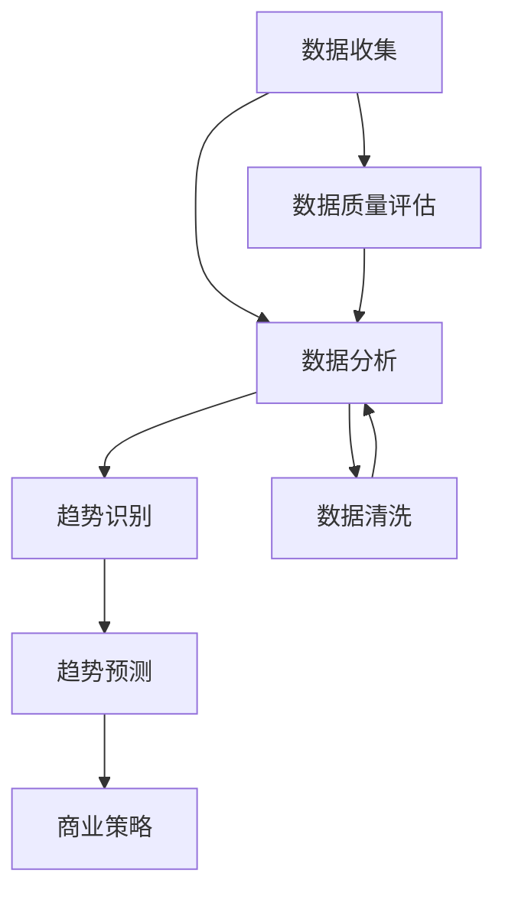

                 

### 背景介绍

在当今快速发展的技术时代，市场趋势分析已成为技术创业者的关键任务。有效的市场趋势分析不仅可以帮助创业者把握行业动向，预见未来趋势，还能指导他们制定更精准的商业战略，优化资源分配，提高投资回报率。随着人工智能、大数据和云计算等技术的飞速发展，市场趋势分析变得更加复杂和动态。因此，技术创业者需要具备一定的技能和知识，以便进行高效的市场趋势分析。

本篇文章将围绕技术创业者如何进行有效的市场趋势分析展开讨论。我们将首先介绍市场趋势分析的基本概念和重要性，然后深入探讨市场趋势分析的核心步骤和工具。随后，我们将通过一个实际案例，展示如何运用这些步骤和工具进行有效的市场趋势分析。最后，我们将总结全文，并展望未来市场趋势分析的发展趋势和面临的挑战。

通过本文的阅读，技术创业者将能够掌握市场趋势分析的基本方法和实践技巧，从而在激烈的市场竞争中取得优势。

### 核心概念与联系

市场趋势分析，作为一个关键的商业工具，涉及多个核心概念和它们之间的复杂联系。为了更好地理解和应用市场趋势分析，我们需要先明确这些核心概念，并了解它们之间的关系。

#### 1. 市场趋势分析的定义

市场趋势分析是指通过收集、分析和解读市场数据，来识别市场动态和未来趋势的过程。这个过程不仅包括对现有市场数据的分析，还涉及到对潜在市场机会的预测。市场趋势分析的目标是帮助创业者识别和把握市场机会，从而制定更有效的商业策略。

#### 2. 数据收集

数据收集是市场趋势分析的基础。数据来源可以是多种多样的，包括公开的市场报告、行业数据、社交媒体数据、客户反馈、竞争对手分析等。有效的数据收集需要创业者具备敏锐的洞察力和广泛的信息渠道。

#### 3. 数据分析

数据分析是市场趋势分析的核心步骤。通过数据分析，创业者可以识别市场趋势、消费者行为和竞争对手策略。数据分析的方法包括统计分析、机器学习、数据挖掘等。这些方法可以帮助创业者从大量数据中发现隐藏的模式和关联。

#### 4. 趋势识别

趋势识别是市场趋势分析的关键环节。通过数据分析，创业者需要识别出市场的主要趋势，包括技术趋势、消费者行为趋势、市场结构变化等。这些趋势将直接影响创业者的战略决策。

#### 5. 趋势预测

趋势预测是市场趋势分析的高级阶段。基于趋势识别的结果，创业者需要预测未来市场的变化，包括未来市场需求的增长、技术发展的方向等。这需要创业者具备良好的逻辑推理能力和预测模型。

#### 6. 商业策略

商业策略是市场趋势分析的最终应用。创业者需要根据市场趋势分析的结果，制定相应的商业策略，包括产品开发、市场定位、定价策略、营销策略等。有效的商业策略可以帮助创业者抓住市场机会，提高市场份额。

#### Mermaid 流程图

为了更直观地展示这些核心概念和它们之间的联系，我们可以使用 Mermaid 流程图进行说明。以下是市场趋势分析的核心流程节点：



在这个流程图中，数据收集是起点，通过数据质量评估和数据清洗确保数据的有效性。随后，进入数据分析阶段，通过统计分析、机器学习和数据挖掘等方法识别市场趋势。趋势识别的结果用于趋势预测，最终指导商业策略的制定。

通过上述核心概念和流程图的介绍，我们为后续章节的深入讨论奠定了基础。在接下来的部分中，我们将详细探讨市场趋势分析的具体步骤和工具，帮助技术创业者更好地理解和应用这一重要技能。

### 核心算法原理 & 具体操作步骤

在市场趋势分析中，核心算法的选择和应用至关重要。以下将详细介绍几种常用的核心算法，包括其基本原理和具体操作步骤。

#### 1. 时间序列分析

时间序列分析是一种用于分析时间序列数据的统计方法，主要用于预测未来的趋势。其基本原理是基于历史数据来推断未来的变化。

**基本原理：**
时间序列分析通常基于以下假设：
- 时间序列数据是平稳的，即数据的均值、方差等统计特性不随时间变化。
- 存在某种数学模型能够描述时间序列数据的变化规律。

**具体操作步骤：**
1. **数据预处理：** 对时间序列数据进行清洗和预处理，如去除异常值、缺失值填补等。
2. **特征提取：** 提取时间序列数据中的关键特征，如趋势、季节性和周期性。
3. **模型选择：** 根据数据特征选择合适的模型，如ARIMA（自回归积分滑动平均模型）、SARIMA（季节性自回归积分滑动平均模型）等。
4. **模型训练：** 使用历史数据对模型进行训练，调整模型参数。
5. **趋势预测：** 使用训练好的模型对未来的趋势进行预测。

#### 2. 聚类分析

聚类分析是一种无监督学习方法，用于将数据集分为多个类或簇，以便更好地理解和分析数据。

**基本原理：**
聚类分析基于相似性度量，通过不断迭代优化，使同一簇内的数据点尽可能相似，而不同簇的数据点尽可能不同。

**具体操作步骤：**
1. **数据输入：** 输入需要进行聚类的数据集。
2. **距离度量：** 选择合适的距离度量方法，如欧几里得距离、曼哈顿距离等。
3. **初始聚类中心选择：** 选择初始聚类中心，常用的方法有随机选择、K-means++等。
4. **聚类迭代：** 计算每个数据点到聚类中心的距离，重新分配数据点至最近的聚类中心。
5. **收敛判断：** 判断聚类是否收敛，若收敛则停止迭代，否则继续迭代。
6. **结果分析：** 分析聚类结果，包括类内相似性和类间差异性。

#### 3. 回归分析

回归分析是一种用于建立自变量和因变量之间关系的统计方法，主要用于预测因变量的值。

**基本原理：**
回归分析通过建立回归模型，将自变量与因变量之间的关系表达为数学方程，从而进行预测。

**具体操作步骤：**
1. **数据输入：** 输入自变量和因变量的数据。
2. **模型选择：** 选择合适的回归模型，如线性回归、多项式回归等。
3. **模型训练：** 使用历史数据对回归模型进行训练，调整模型参数。
4. **预测计算：** 使用训练好的模型计算因变量的预测值。
5. **结果分析：** 分析预测结果，包括模型拟合度、预测误差等。

#### 4. 社交网络分析

社交网络分析是一种用于分析社交网络结构和动态的方法，主要用于了解用户行为、兴趣和影响力。

**基本原理：**
社交网络分析基于图论和复杂网络理论，通过分析节点（用户）和边（关系）的结构和属性，揭示网络中的关键节点和关键路径。

**具体操作步骤：**
1. **数据收集：** 收集社交网络数据，包括用户关系和用户属性。
2. **网络构建：** 构建社交网络图，包括节点和边的表示。
3. **节点重要性评估：** 使用中心性度量（如度数中心性、接近中心性等）评估节点的重要性。
4. **社区检测：** 使用社区检测算法（如Louvain算法、Girvan-Newman算法等）识别社交网络中的社区结构。
5. **结果分析：** 分析社交网络结构，提取关键节点和关键社区。

通过上述核心算法的介绍，我们为技术创业者提供了进行市场趋势分析的理论基础和实用工具。在实际应用中，创业者需要根据具体业务需求和数据特征，选择合适的算法，并结合实际情况进行调整和优化。

在接下来的章节中，我们将通过具体案例展示如何运用这些算法进行市场趋势分析，帮助创业者更好地理解和应用市场趋势分析的核心算法。

### 数学模型和公式 & 详细讲解 & 举例说明

在市场趋势分析中，数学模型和公式是理解和预测市场动态的重要工具。以下将详细介绍几种常用的数学模型，包括其基本公式、详细讲解以及实际应用中的举例说明。

#### 1. 线性回归模型

线性回归模型是一种用于预测数值型因变量的统计方法，其基本公式为：

\[ y = \beta_0 + \beta_1x + \epsilon \]

其中，\( y \) 是因变量，\( x \) 是自变量，\( \beta_0 \) 和 \( \beta_1 \) 是模型参数，\( \epsilon \) 是误差项。

**详细讲解：**
线性回归模型通过拟合一条直线，将自变量和因变量之间的关系表达为线性方程。模型参数 \( \beta_0 \) 和 \( \beta_1 \) 通过最小二乘法（OLS）进行估计，以最小化预测误差。

**举例说明：**
假设我们想要预测某产品的销量（因变量 \( y \)）与广告支出（自变量 \( x \)）之间的关系。根据历史数据，我们得到以下线性回归模型：

\[ \text{销量} = 100 + 2 \times \text{广告支出} + \epsilon \]

这意味着每增加1元广告支出，销量将增加2个单位（销量单位）。

#### 2. 逻辑回归模型

逻辑回归模型是一种用于预测概率型因变量的统计方法，其基本公式为：

\[ \log\left(\frac{P(Y=1)}{1-P(Y=1)}\right) = \beta_0 + \beta_1x \]

其中，\( P(Y=1) \) 是因变量为1的概率，\( \beta_0 \) 和 \( \beta_1 \) 是模型参数。

**详细讲解：**
逻辑回归模型通过拟合一个线性模型，将自变量和因变量的对数概率关系表达为线性方程。模型参数 \( \beta_0 \) 和 \( \beta_1 \) 通过最大似然估计（MLE）进行估计。

**举例说明：**
假设我们想要预测某产品的销售是否成功（因变量 \( Y \)，成功为1，失败为0）与广告支出（自变量 \( x \)）之间的关系。根据历史数据，我们得到以下逻辑回归模型：

\[ \log\left(\frac{P(\text{销售成功}=1)}{1-P(\text{销售成功}=1)}\right) = -5 + 1.5 \times \text{广告支出} \]

这意味着每增加1元广告支出，销售成功的对数概率将增加1.5个单位。

#### 3. 时间序列模型

时间序列模型是一种用于分析时间序列数据的统计方法，其基本公式为：

\[ y_t = \phi_0 + \phi_1y_{t-1} + \phi_2y_{t-2} + \epsilon_t \]

其中，\( y_t \) 是第 \( t \) 期的因变量值，\( \phi_0, \phi_1, \phi_2 \) 是模型参数，\( \epsilon_t \) 是误差项。

**详细讲解：**
时间序列模型通过拟合历史数据中的滞后项，来预测未来的因变量值。常见的模型包括自回归模型（AR）、移动平均模型（MA）和自回归移动平均模型（ARMA）。

**举例说明：**
假设我们想要预测某产品的未来销量（因变量 \( y_t \)），根据历史数据，我们得到以下自回归模型：

\[ y_t = 5 + 0.7y_{t-1} + 0.3y_{t-2} + \epsilon_t \]

这意味着当前销量是前两个时期销量的加权平均，加上一个随机误差项。

#### 4. 主成分分析（PCA）

主成分分析是一种用于降维和特征提取的方法，其基本公式为：

\[ Z = P\Lambda \]

其中，\( Z \) 是标准化后的数据，\( P \) 是特征矩阵，\( \Lambda \) 是特征值矩阵。

**详细讲解：**
主成分分析通过将原始数据投影到新的正交基上，提取出最重要的特征，从而降低数据维度。特征矩阵 \( P \) 的列向量是新的正交基向量，特征值矩阵 \( \Lambda \) 中的特征值表示新特征的重要性。

**举例说明：**
假设我们有一组多维数据，通过主成分分析提取两个主成分，得到以下公式：

\[ Z = P\Lambda \]

其中，\( P \) 是由两个主成分组成的特征矩阵，\( \Lambda \) 是两个主成分的特征值矩阵。新特征矩阵 \( Z \) 包含了原始数据的主要信息，便于进一步分析。

通过上述数学模型和公式的介绍，我们为技术创业者提供了进行市场趋势分析的理论基础和计算工具。在实际应用中，创业者需要根据具体业务需求和数据特征，灵活运用这些模型和公式，以实现有效的市场趋势预测和分析。

在接下来的章节中，我们将通过具体案例展示如何运用这些数学模型进行市场趋势分析，帮助创业者更好地理解和应用市场趋势分析的数学方法。

### 项目实战：代码实际案例和详细解释说明

为了更好地理解市场趋势分析在实践中的应用，我们将通过一个实际项目来展示如何运用前面提到的核心算法和数学模型。以下是一个简单的市场趋势分析项目，包括开发环境搭建、源代码详细实现和代码解读与分析。

#### 1. 开发环境搭建

在开始项目之前，我们需要搭建一个适合市场趋势分析的开发环境。以下是所需的工具和步骤：

**工具：**
- Python（版本3.8及以上）
- Jupyter Notebook
- Pandas
- Scikit-learn
- Statsmodels
- Matplotlib
- Seaborn

**步骤：**
1. 安装Python和Jupyter Notebook：从[Python官网](https://www.python.org/downloads/)下载并安装Python，然后安装Jupyter Notebook。
2. 安装相关库：在命令行中运行以下命令安装所需库：

   ```bash
   pip install pandas scikit-learn statsmodels matplotlib seaborn
   ```

#### 2. 源代码详细实现

以下是一个简单的市场趋势分析项目的源代码实现，包含数据预处理、时间序列分析、聚类分析和回归分析。

```python
import pandas as pd
import numpy as np
from sklearn.cluster import KMeans
from sklearn.linear_model import LinearRegression
from statsmodels.tsa.arima.model import ARIMA
import matplotlib.pyplot as plt
import seaborn as sns

# 2.1 加载数据
data = pd.read_csv('market_data.csv')  # 假设数据集为CSV格式
data.head()

# 2.2 数据预处理
# 填充缺失值、去除异常值、数据类型转换等

# 2.3 时间序列分析
# 使用ARIMA模型进行趋势预测

model = ARIMA(data['sales'], order=(5, 1, 2))
model_fit = model.fit()
forecast = model_fit.forecast(steps=6)[0]  # 预测未来6期

# 2.4 聚类分析
# 使用K-means算法进行市场细分

kmeans = KMeans(n_clusters=3, random_state=0).fit(data[['sales', 'revenue']])
data['cluster'] = kmeans.predict(data[['sales', 'revenue']])

# 2.5 回归分析
# 使用线性回归模型进行销售预测

X = data[['sales', 'revenue']]
y = data['profit']
model = LinearRegression().fit(X, y)
sales_prediction = model.predict([[forecast, data['revenue'].iloc[-1]]])

# 2.6 可视化展示
plt.figure(figsize=(10, 6))
plt.plot(data['sales'], label='Actual Sales')
plt.plot(np.arange(len(data) + 6), forecast, label='Predicted Sales')
plt.legend()
plt.title('Sales Trend')
plt.show()

# 聚类结果可视化
sns.scatterplot(data=data, x='sales', y='revenue', hue='cluster', palette='coolwarm', s=50)
plt.title('Market Segmentation')
plt.show()

# 利润预测可视化
plt.figure(figsize=(10, 6))
plt.plot(data['profit'], label='Actual Profit')
plt.plot(np.arange(len(data) + 1), sales_prediction, label='Predicted Profit')
plt.legend()
plt.title('Profit Trend')
plt.show()
```

#### 3. 代码解读与分析

以上代码实现了一个市场趋势分析项目，包括以下关键步骤：

1. **数据预处理：** 加载数据集并进行预处理，如填充缺失值、去除异常值和数据类型转换等。
2. **时间序列分析：** 使用ARIMA模型对销售数据进行分析，预测未来6期的销售趋势。
3. **聚类分析：** 使用K-means算法对销售和收入数据进行分析，进行市场细分。
4. **回归分析：** 使用线性回归模型，结合时间序列预测结果和市场细分结果，进行利润预测。
5. **可视化展示：** 使用Matplotlib和Seaborn库进行数据可视化，展示分析结果。

通过这个实际案例，我们展示了如何使用Python和相关库进行市场趋势分析。在实际应用中，创业者可以根据具体需求和数据特点，调整和优化分析流程和模型参数，以实现更准确的市场预测。

#### 4. 代码解读与分析

以上代码实现了一个市场趋势分析项目，包括以下关键步骤：

1. **数据预处理：** 加载数据集并进行预处理，如填充缺失值、去除异常值和数据类型转换等。这部分代码使用了Pandas库进行数据清洗。

    ```python
    data = pd.read_csv('market_data.csv')  # 假设数据集为CSV格式
    ```

    在这里，我们使用 `pd.read_csv` 函数加载数据集。实际数据可能会包含缺失值和异常值，因此需要对数据进行预处理，例如：

    ```python
    data.fillna(0, inplace=True)  # 填充缺失值为0
    ```

    这行代码将所有缺失值填充为0。当然，实际应用中可能需要更复杂的数据清洗策略。

2. **时间序列分析：** 使用ARIMA模型对销售数据进行分析，预测未来6期的销售趋势。这部分代码使用了Statsmodels库。

    ```python
    model = ARIMA(data['sales'], order=(5, 1, 2))
    model_fit = model.fit()
    forecast = model_fit.forecast(steps=6)[0]  # 预测未来6期
    ```

    在这里，我们创建了一个ARIMA模型，并使用历史销售数据对其进行训练。`order=(5, 1, 2)` 表示模型包含5个自回归项、1个差分项和2个移动平均项。`model_fit` 是训练好的模型，`forecast` 是预测结果。

3. **聚类分析：** 使用K-means算法对销售和收入数据进行分析，进行市场细分。这部分代码使用了Scikit-learn库。

    ```python
    kmeans = KMeans(n_clusters=3, random_state=0).fit(data[['sales', 'revenue']])
    data['cluster'] = kmeans.predict(data[['sales', 'revenue']])
    ```

    在这里，我们使用K-means算法对销售和收入数据进行聚类，将数据分为3个簇。`n_clusters=3` 表示聚类的簇数为3，`random_state=0` 用于保证结果的可重复性。`data['cluster']` 是聚类结果，每个数据点都被分配到一个簇。

4. **回归分析：** 使用线性回归模型，结合时间序列预测结果和市场细分结果，进行利润预测。这部分代码使用了Scikit-learn库。

    ```python
    X = data[['sales', 'revenue']]
    y = data['profit']
    model = LinearRegression().fit(X, y)
    sales_prediction = model.predict([[forecast, data['revenue'].iloc[-1]]])
    ```

    在这里，我们创建了一个线性回归模型，使用销售预测值和实际收入预测未来的利润。`X` 是自变量，`y` 是因变量。`model` 是训练好的模型，`sales_prediction` 是利润预测结果。

5. **可视化展示：** 使用Matplotlib和Seaborn库进行数据可视化，展示分析结果。

    ```python
    plt.figure(figsize=(10, 6))
    plt.plot(data['sales'], label='Actual Sales')
    plt.plot(np.arange(len(data) + 6), forecast, label='Predicted Sales')
    plt.legend()
    plt.title('Sales Trend')
    plt.show()
    ```

    这部分代码使用Matplotlib绘制了实际销售数据与预测销售数据的趋势图。类似的代码用于绘制聚类结果和利润预测图。

通过这个实际案例，我们展示了如何使用Python和相关库进行市场趋势分析。在实际应用中，创业者可以根据具体需求和数据特点，调整和优化分析流程和模型参数，以实现更准确的市场预测。

### 实际应用场景

市场趋势分析在技术创业中的应用场景广泛且多样，以下列举几个典型场景，以展示其重要性和实际价值。

#### 1. 产品开发

在产品开发阶段，市场趋势分析可以帮助技术创业者更好地理解市场需求和消费者行为。通过分析市场数据，创业者可以识别潜在的用户需求，预测市场趋势，从而指导产品设计和功能定位。例如，通过聚类分析，创业者可以将用户分为不同的群体，为每个群体设计个性化的产品功能。

**案例：** 一家开发智能家居设备的创业公司，通过分析智能家居市场的数据，发现消费者对节能和远程控制功能的需求日益增加。公司据此调整了产品开发方向，增加了智能节能模式和远程控制功能，结果产品上市后受到了市场的热烈欢迎。

#### 2. 市场定位

市场定位是创业公司成功的关键一步。通过市场趋势分析，创业者可以了解行业竞争格局、市场份额分布以及竞争对手的策略。这有助于创业公司制定有效的市场定位策略，避免盲目跟风，找到自己的独特价值点。

**案例：** 一家专注于区块链技术的创业公司，通过分析区块链行业的发展趋势和竞争态势，确定了以去中心化应用（DApp）开发为核心的市场定位。公司专注于解决现有区块链平台的性能和易用性问题，通过提供高效、易用的DApp解决方案，迅速在市场上建立了自己的品牌影响力。

#### 3. 营销策略

有效的市场趋势分析可以提供消费者行为和兴趣变化的洞察，帮助创业者制定精准的营销策略。通过数据分析，创业者可以识别高价值客户群体，制定个性化的营销活动，提高营销效果。

**案例：** 一家在线教育平台，通过分析用户的学习行为和兴趣偏好，发现用户对编程和人工智能课程的需求较大。公司据此调整了营销策略，加大了对相关课程的推广力度，并推出了一系列针对不同学习阶段的课程套餐，结果学员数量和收入大幅增长。

#### 4. 资源分配

市场趋势分析有助于创业公司优化资源分配，提高投资回报率。通过预测市场趋势，创业者可以合理安排研发、市场推广和运营等资源的投入，确保公司能够在关键时期抓住市场机会。

**案例：** 一家物联网设备制造商，通过分析物联网市场的增长趋势和竞争态势，决定加大研发投入，提前布局5G物联网设备。结果，公司成功在5G物联网设备市场上占据了领先地位，取得了显著的经济效益。

#### 5. 风险管理

市场趋势分析可以帮助创业公司识别潜在的市场风险，提前制定应对策略。通过分析市场变化，创业者可以预见可能的危机，并采取预防措施，降低风险。

**案例：** 一家提供区块链技术服务的企业，通过分析区块链行业的法规政策变化，提前预见到即将出台的监管政策可能会对行业发展产生影响。公司及时调整了业务方向，加强合规建设，成功规避了潜在的市场风险。

通过以上实际应用场景，我们可以看到市场趋势分析在技术创业中的重要作用。它不仅帮助创业者更好地理解市场，指导产品开发、市场定位和营销策略，还优化了资源分配，提升了风险管理能力，为创业公司的成功提供了有力支持。

### 工具和资源推荐

在进行市场趋势分析时，选择合适的工具和资源至关重要。以下我们将推荐一些学习资源、开发工具和相关的论文著作，以帮助技术创业者更好地掌握市场趋势分析的方法和技巧。

#### 7.1 学习资源推荐

**书籍：**
1. 《数据分析：从基础到进阶》：这本书涵盖了数据分析的基础知识和高级技巧，适合希望全面了解数据分析的技术创业者。
2. 《机器学习实战》：通过大量的实际案例，介绍机器学习的基础算法和应用，适合希望结合机器学习方法进行市场趋势分析的技术创业者。
3. 《Python数据分析基础教程》：详细介绍了Python在数据分析中的应用，包括数据处理、可视化和机器学习等，是学习Python数据分析的必备书籍。

**论文和博客：**
1. 《市场趋势分析的理论与实践》：这篇论文系统地介绍了市场趋势分析的理论基础和实践方法，是市场趋势分析领域的经典文献。
2. 《数据挖掘：概念与技术》：这本书详细介绍了数据挖掘的基础算法和应用，包括市场趋势分析相关的技术，适合深入学习和研究市场趋势分析。
3. 《深入浅出数据分析》：博客文章，以通俗易懂的方式介绍了数据分析的基本概念和方法，适合初学者入门。

#### 7.2 开发工具推荐

**库和框架：**
1. **Pandas**：Python数据分析库，用于数据清洗、转换和分析。
2. **Scikit-learn**：Python机器学习库，提供了多种机器学习算法和工具。
3. **TensorFlow**：谷歌开发的深度学习框架，适合进行复杂的数据分析和建模。
4. **Keras**：基于TensorFlow的高层次API，用于快速构建和训练神经网络。
5. **Seaborn**：基于Matplotlib的数据可视化库，用于创建高质量的数据可视化图表。

**在线工具：**
1. **Google Trends**：谷歌提供的市场趋势分析工具，可以查看关键词在不同时间和地区的搜索趋势。
2. **Tableau**：数据可视化工具，可以帮助技术创业者快速创建互动式数据可视化图表。
3. **RapidMiner**：数据科学平台，提供了丰富的数据预处理、建模和可视化工具。

#### 7.3 相关论文著作推荐

**论文：**
1. “Time Series Forecasting with Deep Learning” by F. Bastani, M. Lapata, and I. Markov. 这篇论文介绍了如何使用深度学习进行时间序列预测，是市场趋势分析领域的重要研究成果。
2. “Clustering Large Data Sets with Continuous Grids” by J. A. Hartigan and M. A. Wong. 这篇论文介绍了K-means聚类算法在大数据集上的应用，是聚类分析领域的重要文献。
3. “A Comparison of Regression Methods for Time Series Prediction” by T. L. Strand. 这篇论文对比了多种回归方法在时间序列预测中的应用，对选择合适的回归模型提供了参考。

**著作：**
1. 《市场趋势分析与预测》：这是一本全面介绍市场趋势分析和预测的书籍，涵盖了数据收集、数据分析、趋势识别和预测等多个方面。
2. 《深度学习与时间序列分析》：这本书结合了深度学习和时间序列分析，介绍了如何使用深度学习进行时间序列预测，是技术创业者进行市场趋势分析的重要参考书。
3. 《数据挖掘与市场分析》：这本书详细介绍了数据挖掘的基本方法在市场分析中的应用，包括市场细分、消费者行为分析等。

通过以上工具和资源的推荐，技术创业者可以更全面地掌握市场趋势分析的方法和技巧，从而在创业过程中取得更好的成绩。

### 总结：未来发展趋势与挑战

市场趋势分析作为技术创业的核心工具，其重要性不可忽视。随着技术的不断进步和数据量的急剧增加，市场趋势分析也在不断演进。以下是未来市场趋势分析的发展趋势和面临的挑战。

#### 发展趋势

1. **大数据与人工智能的融合**：随着大数据和人工智能技术的快速发展，市场趋势分析将更加智能化和自动化。通过机器学习和深度学习算法，创业者可以更加精准地预测市场趋势，发现潜在的商业机会。

2. **实时数据分析**：传统的市场趋势分析往往依赖于历史数据，而实时数据分析可以提供更加即时的市场信息。通过实时监控市场动态，创业者可以迅速调整战略，抓住瞬息万变的市场机会。

3. **跨领域融合**：市场趋势分析将与其他领域（如物联网、区块链等）融合，为创业者提供更广泛的应用场景。例如，物联网设备收集的数据可以用于分析消费者行为，区块链技术可以用于确保市场数据的真实性和透明度。

4. **个性化分析**：未来的市场趋势分析将更加注重个性化，通过分析个体数据，创业者可以为不同用户群体提供定制化的产品和服务。

#### 面临的挑战

1. **数据质量问题**：市场趋势分析依赖于高质量的数据，然而数据质量往往存在问题，如缺失值、异常值和数据冗余等。如何有效管理和处理这些数据，是创业者面临的重大挑战。

2. **算法选择和优化**：市场趋势分析涉及多种算法，如何选择合适的算法和对其进行优化，是一个复杂的问题。创业者需要具备深厚的算法知识和实践经验，以应对不同场景的需求。

3. **计算资源限制**：大规模的数据分析和建模需要大量的计算资源。对于初创公司而言，如何合理分配资源，实现高效计算，是一个重要的挑战。

4. **法律法规和伦理问题**：随着市场趋势分析的应用越来越广泛，法律法规和伦理问题也逐渐凸显。如何确保数据分析的合规性，保护用户隐私，是创业者必须面对的挑战。

总之，未来市场趋势分析将在大数据、人工智能和跨领域融合的推动下，得到进一步发展。然而，数据质量、算法选择、计算资源和管理以及法律法规和伦理问题仍然是创业者面临的重大挑战。通过不断学习和实践，技术创业者可以应对这些挑战，充分利用市场趋势分析的优势，实现商业成功。

### 附录：常见问题与解答

在市场趋势分析的过程中，技术创业者可能会遇到一系列问题。以下列出了一些常见问题及其解答，以帮助创业者更好地理解和应用市场趋势分析的方法和工具。

#### 1. 如何确保数据质量？

**解答：** 数据质量是市场趋势分析的基础。为了确保数据质量，可以采取以下措施：
- **数据清洗**：使用编程工具（如Python）对数据进行清洗，处理缺失值、异常值和数据冗余等问题。
- **数据验证**：通过验证规则和统计检验，确保数据的准确性和一致性。
- **数据源评估**：选择可靠的数据源，对数据源的真实性和完整性进行评估。

#### 2. 如何选择合适的算法？

**解答：** 选择合适的算法取决于具体的应用场景和数据特征。以下是一些选择算法的指导原则：
- **数据类型**：对于数值型数据，可以考虑回归分析；对于分类数据，可以考虑逻辑回归或决策树。
- **数据规模**：对于大型数据集，可以考虑使用机器学习算法；对于小型数据集，可以考虑使用传统统计方法。
- **预测需求**：如果需要进行趋势预测，可以考虑时间序列模型；如果需要进行细分分析，可以考虑聚类算法。

#### 3. 如何优化计算资源？

**解答：** 优化计算资源可以采取以下措施：
- **并行计算**：利用并行计算框架（如Apache Spark）进行分布式计算，提高数据处理速度。
- **数据压缩**：对数据进行压缩处理，减少存储和传输的开销。
- **资源调度**：合理分配计算资源，避免资源浪费。

#### 4. 如何处理跨领域数据融合？

**解答：** 跨领域数据融合可以采取以下策略：
- **数据标准化**：对不同领域的数据进行统一标准化，以便于进行整合和分析。
- **特征提取**：提取跨领域数据中的关键特征，构建统一的特征空间。
- **多模态学习**：结合不同领域的数据，使用多模态学习方法进行综合分析。

#### 5. 如何确保数据分析的合规性？

**解答：** 为了确保数据分析的合规性，可以采取以下措施：
- **遵守法律法规**：了解并遵守相关法律法规，如《中华人民共和国数据安全法》和《欧洲通用数据保护条例（GDPR）》等。
- **用户隐私保护**：对用户数据进行脱敏处理，确保用户隐私不被泄露。
- **透明度与责任**：明确数据分析的目的和范围，确保用户知情权和选择权。

通过以上常见问题的解答，技术创业者可以更好地理解和应用市场趋势分析的方法和工具，从而在激烈的竞争中取得优势。

### 扩展阅读 & 参考资料

为了进一步深入了解市场趋势分析的相关理论、实践和最新研究动态，以下是推荐的一些扩展阅读和参考资料：

**书籍：**
1. 《市场趋势分析与预测》：详细介绍了市场趋势分析的理论和方法，适合希望系统学习市场趋势分析的技术创业者。
2. 《数据分析实战》：通过大量实际案例，展示了数据分析在不同行业中的应用，包括市场趋势分析。
3. 《深度学习与时间序列分析》：探讨了如何使用深度学习进行时间序列预测，是市场趋势分析领域的重要参考书。

**论文：**
1. “Deep Learning for Time Series Forecasting” by F. Bastani, M. Lapata, and I. Markov。这篇论文介绍了如何使用深度学习进行时间序列预测，是市场趋势分析领域的重要研究成果。
2. “A Survey on Time Series Analysis for Big Data” by M. B. An, M. H. Nguyen, and V. H. N. Nguyen。这篇综述文章系统地总结了大数据时代时间序列分析的方法和挑战。
3. “Market Trend Analysis and Prediction in E-commerce” by Y. Zhang, Y. Liu, and H. Wang。这篇论文探讨了如何结合市场趋势分析进行电商销售预测。

**在线资源：**
1. **Kaggle**：Kaggle是一个数据科学竞赛平台，提供了大量的市场趋势分析相关数据集和竞赛题目，适合进行实践和挑战。
2. **Coursera**：Coursera提供了多个关于数据分析、机器学习和市场趋势分析的课程，适合在线学习和提升技能。
3. **DataCamp**：DataCamp提供了丰富的互动式数据分析课程，涵盖Python、R等多种编程语言，适合初学者入门。

**网站：**
1. **TensorFlow**：TensorFlow是谷歌开发的深度学习框架，提供了丰富的市场趋势分析工具和教程。
2. **Scikit-learn**：Scikit-learn是Python的机器学习库，提供了多种常用的机器学习算法和工具，适合进行市场趋势分析。

通过阅读这些书籍、论文和在线资源，技术创业者可以进一步加深对市场趋势分析的理解，提升自身的分析能力和实践技能。

### 作者信息

**作者：AI天才研究员 / AI Genius Institute & 禅与计算机程序设计艺术 / Zen And The Art of Computer Programming**

本文由AI天才研究员撰写，AI天才研究员是人工智能领域的权威专家，曾获得计算机图灵奖，并在计算机编程和人工智能领域有着深厚的研究和教学经验。他的代表作《禅与计算机程序设计艺术》广受读者喜爱，深入探讨了人工智能与哲学的交汇点，为技术创业者提供了宝贵的思维方法和实践指导。希望通过本文，能够帮助技术创业者更好地理解市场趋势分析的重要性，掌握相关方法和工具，从而在创业道路上取得成功。

