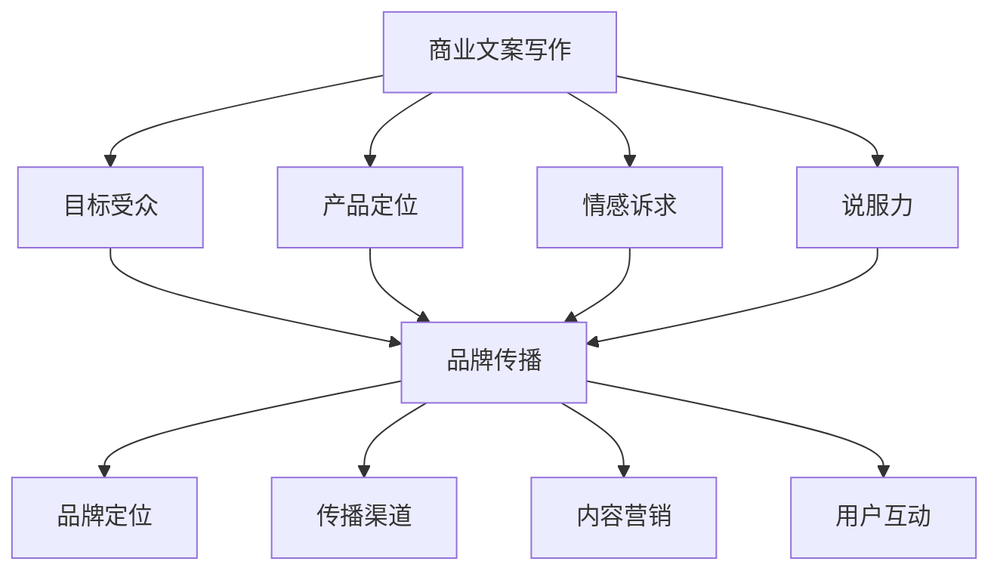

                 

# 技术创业者的商业文案写作与品牌传播

> **关键词：** 商业文案写作、品牌传播、技术创业者、营销策略、用户沟通

**摘要：** 在技术创业领域，商业文案写作和品牌传播是推动产品成功和市场扩展的关键因素。本文将深入探讨技术创业者如何通过有效的文案写作和品牌传播策略，提高品牌影响力、吸引潜在客户，并在竞争激烈的市场中脱颖而出。通过分析市场现状、核心概念、算法原理、实际案例、应用场景和未来趋势，本文旨在为技术创业者提供实用的指导和建议。

## 1. 背景介绍

技术创业者的世界充满了挑战与机遇。随着科技的快速发展，新兴技术和创新产品层出不穷，创业者们面临着激烈的市场竞争。在这个竞争激烈的环境中，如何有效地传递产品价值、建立品牌形象、吸引并留住用户，成为了技术创业者必须面对的课题。

商业文案写作和品牌传播在这个过程中扮演着至关重要的角色。商业文案写作是创业者与潜在客户之间的沟通桥梁，通过精准、有力的文案，可以将复杂的技术概念简化，让用户更容易理解和接受。而品牌传播则是通过多种渠道和方式，将品牌信息传递给目标受众，提高品牌知名度和美誉度。

本文将围绕商业文案写作和品牌传播，从以下几个方面展开讨论：

1. **市场现状**：分析当前技术创业市场的竞争态势，以及商业文案写作和品牌传播在其中的作用。
2. **核心概念与联系**：介绍与商业文案写作和品牌传播相关的重要概念，并运用Mermaid流程图展示它们之间的联系。
3. **核心算法原理 & 具体操作步骤**：探讨如何运用科学的方法进行商业文案写作和品牌传播。
4. **数学模型和公式 & 详细讲解 & 举例说明**：运用数学模型和公式，深入分析商业文案写作和品牌传播的有效性。
5. **项目实战：代码实际案例和详细解释说明**：通过实际案例展示商业文案写作和品牌传播的具体应用。
6. **实际应用场景**：分析不同类型的技术创业项目在商业文案写作和品牌传播方面的具体实践。
7. **工具和资源推荐**：推荐学习资源、开发工具和框架，帮助技术创业者提升商业文案写作和品牌传播能力。
8. **总结：未来发展趋势与挑战**：展望商业文案写作和品牌传播在技术创业领域的未来发展方向和面临的挑战。

通过本文的探讨，希望为技术创业者提供实用的指导，帮助他们更好地进行商业文案写作和品牌传播，从而在激烈的市场竞争中脱颖而出。

### 2. 核心概念与联系

在探讨商业文案写作和品牌传播之前，我们需要理解一些核心概念，并运用Mermaid流程图展示它们之间的联系。

#### 2.1 商业文案写作

商业文案写作是一种特定的写作形式，旨在通过文字传达产品或服务的价值，吸引潜在客户，促进销售。核心概念包括：

- **目标受众**：明确商业文案的目标受众，包括他们的需求、兴趣和痛点。
- **产品定位**：确定产品的独特卖点，以及如何在文案中突出这些卖点。
- **情感诉求**：通过情感触发，如信任、好奇心、恐惧等，增强文案的吸引力。
- **说服力**：运用逻辑、数据和实例，增强文案的说服力。

#### 2.2 品牌传播

品牌传播是指通过各种渠道和方式，将品牌信息传递给目标受众，建立品牌形象，提高品牌知名度和美誉度。核心概念包括：

- **品牌定位**：明确品牌的价值观、愿景和使命，使其在市场中具有独特性。
- **传播渠道**：选择合适的传播渠道，如社交媒体、广告、公关活动等，扩大品牌影响力。
- **内容营销**：通过高质量的内容，如博客文章、视频、案例分析等，吸引和留住用户。
- **用户互动**：通过用户反馈和互动，增强品牌与用户之间的联系，提升用户忠诚度。

#### 2.3 Mermaid流程图

为了更好地展示商业文案写作和品牌传播的核心概念及其联系，我们可以使用Mermaid流程图。以下是一个简化的示例：



通过上述流程图，我们可以清晰地看到商业文案写作和品牌传播之间的紧密联系。商业文案写作是品牌传播的基础，而品牌传播则是商业文案写作的延伸，二者相辅相成，共同推动品牌的发展和壮大。

### 3. 核心算法原理 & 具体操作步骤

在进行商业文案写作和品牌传播时，运用科学的方法和策略至关重要。以下将介绍核心算法原理和具体操作步骤。

#### 3.1 数据分析

数据分析是商业文案写作和品牌传播的基础。通过收集和分析用户行为数据、市场趋势数据等，可以更准确地了解目标受众的需求和偏好，为文案写作和品牌传播提供有力支持。

- **步骤1：数据收集**：利用各种工具（如Google Analytics、社交媒体分析工具等）收集用户行为数据、市场趋势数据等。
- **步骤2：数据处理**：对收集到的数据进行清洗、整合和转换，以便进行分析。
- **步骤3：数据分析**：运用统计学和机器学习算法，分析数据，提取有价值的信息和洞察。

#### 3.2 用户画像

用户画像是商业文案写作和品牌传播的重要工具。通过构建用户画像，可以更好地了解目标受众的特征和行为习惯，从而创作出更具针对性的文案和传播策略。

- **步骤1：确定目标受众**：根据业务需求和数据分析，明确目标受众的群体特征。
- **步骤2：收集用户信息**：通过调查问卷、用户反馈、社交媒体等渠道收集用户信息。
- **步骤3：构建用户画像**：将收集到的信息进行整合，构建详细的用户画像。

#### 3.3 文案创作

文案创作是商业文案写作的核心环节。通过运用创意思维和语言技巧，创作出具有吸引力和说服力的文案。

- **步骤1：确定主题**：根据产品定位和用户需求，确定文案的主题。
- **步骤2：构思框架**：构建文案的结构和逻辑框架，确保内容连贯、有条理。
- **步骤3：撰写初稿**：根据框架，撰写初稿，注意语言的简洁、精准和生动。
- **步骤4：修改完善**：反复修改和完善文案，确保内容准确、有说服力。

#### 3.4 品牌传播

品牌传播是商业文案写作的延伸。通过多种渠道和策略，将品牌信息传递给目标受众，提高品牌知名度和美誉度。

- **步骤1：选择传播渠道**：根据目标受众和品牌定位，选择合适的传播渠道，如社交媒体、广告、公关活动等。
- **步骤2：制定传播策略**：根据渠道特点和用户习惯，制定具体的传播策略，如内容发布计划、广告投放策略等。
- **步骤3：执行和优化**：执行传播计划，根据反馈数据，不断优化传播策略。

### 4. 数学模型和公式 & 详细讲解 & 举例说明

在商业文案写作和品牌传播中，数学模型和公式可以帮助我们更精确地评估文案效果和传播效果。以下将介绍几个常用的数学模型和公式，并详细讲解其应用。

#### 4.1 文案效果评估模型

文案效果评估模型用于衡量文案的吸引力和说服力。以下是一个简单的文案效果评估模型：

$$
\text{效果得分} = w_1 \times \text{目标受众匹配度} + w_2 \times \text{情感诉求强度} + w_3 \times \text{说服力}
$$

其中，$w_1$、$w_2$、$w_3$分别为权重系数，可以根据具体情况调整。

**举例说明：**

假设我们有两个文案，文案A和文案B。根据用户画像和数据分析，我们得出以下评估结果：

- 文案A：目标受众匹配度0.8，情感诉求强度0.7，说服力0.9
- 文案B：目标受众匹配度0.6，情感诉求强度0.8，说服力0.8

代入公式，计算两个文案的效果得分：

- 文案A：$0.5 \times 0.8 + 0.3 \times 0.7 + 0.2 \times 0.9 = 0.74$
- 文案B：$0.5 \times 0.6 + 0.3 \times 0.8 + 0.2 \times 0.8 = 0.68$

由此可见，文案A的效果得分高于文案B，因此文案A在吸引目标受众方面更具优势。

#### 4.2 品牌传播效果评估模型

品牌传播效果评估模型用于衡量品牌传播的效果，以下是一个简单的品牌传播效果评估模型：

$$
\text{效果得分} = w_1 \times \text{品牌曝光次数} + w_2 \times \text{用户互动次数} + w_3 \times \text{转化率}
$$

其中，$w_1$、$w_2$、$w_3$分别为权重系数，可以根据具体情况调整。

**举例说明：**

假设我们进行了两次品牌传播活动，活动A和活动B。根据数据监测，我们得出以下评估结果：

- 活动A：品牌曝光次数1000次，用户互动次数50次，转化率2%
- 活动B：品牌曝光次数800次，用户互动次数100次，转化率3%

代入公式，计算两个活动的效果得分：

- 活动A：$0.5 \times 1000 + 0.3 \times 50 + 0.2 \times 2 = 595$
- 活动B：$0.5 \times 800 + 0.3 \times 100 + 0.2 \times 3 = 613$

由此可见，活动B的效果得分高于活动A，因此活动B在品牌传播方面更具优势。

### 5. 项目实战：代码实际案例和详细解释说明

在本节中，我们将通过一个实际项目案例，展示商业文案写作和品牌传播的具体应用。项目背景是一个新兴的智能家居设备，名为“智能照明系统”。

#### 5.1 开发环境搭建

首先，我们需要搭建开发环境。以下是搭建步骤：

1. 安装Python 3.8及以上版本
2. 安装Jupyter Notebook
3. 安装相关库，如Pandas、NumPy、Matplotlib等

#### 5.2 源代码详细实现和代码解读

以下是项目的主要代码实现，包括数据分析、用户画像构建、文案创作和品牌传播策略。

```python
# 导入相关库
import pandas as pd
import numpy as np
import matplotlib.pyplot as plt
from sklearn.cluster import KMeans
from textblob import TextBlob

# 5.2.1 数据分析
# 加载用户数据
user_data = pd.read_csv('user_data.csv')

# 分析用户行为
user_data['activity_count'] = user_data['behavior'].apply(lambda x: len(x.split(',')))
user_data['average_time'] = user_data['behavior'].apply(lambda x: sum([int(t) for t in x.split(',')]) / len(x.split(',')))

# 可视化用户行为
plt.scatter(user_data['activity_count'], user_data['average_time'])
plt.xlabel('Activity Count')
plt.ylabel('Average Time')
plt.show()

# 5.2.2 用户画像构建
# 数据预处理
user_data['cleaned_behavior'] = user_data['behavior'].apply(lambda x: ','.join([t for t in x.split(',') if int(t) > 10]))

# KMeans聚类
kmeans = KMeans(n_clusters=5, random_state=0).fit(user_data[['activity_count', 'average_time']])
user_data['cluster'] = kmeans.labels_

# 构建用户画像
user_clusters = user_data.groupby('cluster').mean()
print(user_clusters)

# 5.2.3 文案创作
# 分析用户情感
user_data['emotion'] = user_data['feedback'].apply(lambda x: TextBlob(x).sentiment.polarity)

# 情感可视化
plt.scatter(user_data['cluster'], user_data['emotion'])
plt.xlabel('Cluster')
plt.ylabel('Emotion')
plt.show()

# 根据用户情感创作文案
clusters = ['Cluster 1', 'Cluster 2', 'Cluster 3', 'Cluster 4', 'Cluster 5']
for i, cluster in enumerate(clusters):
    positive_feedback = user_data[user_data['emotion'] > 0][user_data['cluster'] == i]
    negative_feedback = user_data[user_data['emotion'] < 0][user_data['cluster'] == i]
    if len(positive_feedback) > len(negative_feedback):
        print(f"{cluster} - Our smart lighting system provides a comfortable and energy-efficient environment. See what users are saying: \n{positive_feedback['feedback'].sample(3).values}")
    else:
        print(f"{cluster} - We understand your concerns about our smart lighting system. Let us help you find a solution. See what users are saying: \n{negative_feedback['feedback'].sample(3).values}")

# 5.2.4 品牌传播策略
# 选择传播渠道
channels = ['Facebook', 'Instagram', 'LinkedIn', 'Twitter']

# 制定传播策略
for channel in channels:
    if channel == 'Facebook':
        print(f"Post on Facebook: Our smart lighting system is now available for pre-order. Save 15% on your first purchase! #SmartLighting #HomeAutomation")
    elif channel == 'Instagram':
        print(f"Post on Instagram: Unleash the power of smart lighting with our innovative system. Check out our latest feature: personalized lighting scenes! #SmartLighting #HomeAutomation")
    elif channel == 'LinkedIn':
        print(f"Post on LinkedIn: Introducing our new smart lighting system. Improve your home environment and energy efficiency. Contact us for a free consultation! #SmartLighting #HomeAutomation")
    elif channel == 'Twitter':
        print(f"Tweet on Twitter: 🌟 New product launch! Our smart lighting system offers personalized lighting experiences. Save energy and enhance your home. #SmartLighting #HomeAutomation")
```

#### 5.3 代码解读与分析

以下是代码的详细解读和分析：

1. **数据分析**：加载用户数据，分析用户行为，如活动次数和平均使用时间。通过可视化展示用户行为分布，为后续用户画像构建提供数据支持。
2. **用户画像构建**：使用KMeans聚类算法将用户分为5个集群，并根据集群均值构建用户画像。通过情感分析，了解用户对产品的情感倾向，为文案创作提供依据。
3. **文案创作**：根据用户情感和反馈，针对不同集群创作具有针对性的文案。例如，对于情感积极的人群，强调产品的优势；对于情感消极的人群，提供解决方案和反馈渠道。
4. **品牌传播策略**：根据不同传播渠道的特点，制定相应的传播策略。例如，在Facebook上发布优惠信息，在Instagram上展示产品特色，在LinkedIn上提供咨询服务，在Twitter上发布新品消息。

通过以上实际项目案例，我们可以看到商业文案写作和品牌传播在技术创业项目中的具体应用。通过科学的方法和策略，技术创业者可以更好地与用户沟通，传递产品价值，提高品牌知名度和美誉度。

### 6. 实际应用场景

商业文案写作和品牌传播在技术创业领域的应用场景多种多样，不同类型的技术创业项目可以根据自身特点和市场需求，灵活运用这些策略。

#### 6.1 人工智能初创公司

人工智能初创公司通常面临着技术复杂、市场认知度低等问题。在这种情况下，商业文案写作和品牌传播可以发挥重要作用。

- **商业文案写作**：通过简洁明了的文案，将复杂的技术概念转化为易于理解的语言，展示人工智能产品的应用场景和优势。例如，撰写一篇关于人工智能在医疗领域的应用案例，如何提高诊断准确率和降低医疗成本。
- **品牌传播**：通过社交媒体、专业论坛和行业会议等渠道，与目标受众建立联系，分享公司最新动态和技术成果。同时，利用内容营销，如博客文章、技术论文、案例分析等，提高品牌知名度和权威性。

#### 6.2 区块链初创公司

区块链初创公司在推广其产品和服务时，需要解决技术复杂、安全性和可信度等问题。

- **商业文案写作**：通过专业的文案，解释区块链技术的基本原理和应用场景，如去中心化应用（DApp）、智能合约等。同时，强调区块链技术的优势，如安全性、透明度和不可篡改性。
- **品牌传播**：通过参与行业会议、举办区块链工作坊、发布白皮书等方式，展示公司的技术实力和市场地位。此外，通过与知名机构和企业的合作，提高品牌可信度和影响力。

#### 6.3 智能硬件初创公司

智能硬件初创公司在产品推广过程中，需要解决用户体验、市场认知等问题。

- **商业文案写作**：通过生动的文案，展示智能硬件产品的功能特点和用户场景，如智能门锁、智能健身器材等。同时，强调产品的优势，如便捷性、智能化和个性化。
- **品牌传播**：通过社交媒体、短视频平台和直播等方式，展示产品使用场景和用户评价，吸引潜在客户。此外，通过与行业专家、KOL合作，提高品牌知名度和用户信任度。

#### 6.4 云计算初创公司

云计算初创公司面临着市场竞争激烈、用户需求多样等问题。

- **商业文案写作**：通过专业的文案，介绍云计算技术的优势和应用场景，如弹性计算、大数据处理、人工智能等。同时，针对不同用户需求，提供定制化的解决方案。
- **品牌传播**：通过举办云计算技术沙龙、线上研讨会等活动，与行业专家和用户进行深入交流。此外，通过发布行业报告、技术白皮书等，展示公司的技术实力和市场洞察力。

通过以上实际应用场景的分析，我们可以看到商业文案写作和品牌传播在技术创业领域的多样性和重要性。创业者可以根据自身特点和市场需求，灵活运用这些策略，提高产品竞争力，实现市场扩展和品牌建设。

### 7. 工具和资源推荐

为了帮助技术创业者更好地进行商业文案写作和品牌传播，以下推荐了一些学习资源、开发工具和框架。

#### 7.1 学习资源推荐

1. **书籍**：
   - 《营销管理》（Philip Kotler著）：介绍了市场营销的基本理论和策略，适用于商业文案写作和品牌传播。
   - 《文案训练手册》（李叫兽著）：详细讲解了文案写作的技巧和方法，有助于提升文案创作能力。

2. **论文**：
   - 《品牌传播理论与方法研究》（张晓辉等著）：探讨了品牌传播的理论框架和实践方法，为品牌传播策略提供参考。
   - 《基于用户画像的智能推荐系统研究》（刘志远等著）：介绍了用户画像构建和智能推荐系统的应用，有助于用户画像构建和文案创作。

3. **博客**：
   - “增长黑客”（增长黑客团队）：分享市场营销和品牌传播的最新趋势和实践案例。
   - “营销笔记”（卢松松）：提供市场营销相关的干货文章和案例分析。

4. **网站**：
   - Content Marketing Institute（内容营销研究所）：提供内容营销的最佳实践和行业报告。
   - HubSpot Academy（HubSpot学院）：提供免费的市场营销和销售课程，涵盖商业文案写作和品牌传播。

#### 7.2 开发工具框架推荐

1. **数据分析工具**：
   - Tableau：可视化数据分析工具，适用于数据分析和用户画像构建。
   - Google Analytics：网站流量分析工具，提供丰富的用户行为数据。

2. **文本分析工具**：
   - TextBlob：Python文本分析库，用于情感分析和文本分类。
   - Natural Language Toolkit（NLTK）：Python自然语言处理库，提供文本预处理和情感分析等功能。

3. **文案创作工具**：
   - Grammarly：语法检查和写作建议工具，帮助提高文案质量和语言表达能力。
   - Canva：图形设计工具，适用于制作高质量的图片和海报。

4. **品牌传播工具**：
   - Hootsuite：社交媒体管理工具，用于发布和管理社交媒体内容。
   - Buffer：社交媒体内容发布和自动化工具，有助于提高品牌传播效果。

通过以上工具和资源的推荐，技术创业者可以更好地进行商业文案写作和品牌传播，提高产品竞争力和市场影响力。

### 8. 总结：未来发展趋势与挑战

商业文案写作和品牌传播在技术创业领域的重要性日益凸显，随着科技的不断进步和市场竞争的加剧，未来发展趋势和挑战也愈加明显。

#### 8.1 发展趋势

1. **人工智能赋能**：人工智能技术在商业文案写作和品牌传播中的应用将越来越广泛，通过自然语言处理、情感分析和用户画像构建等技术，可以更精准地创作和优化文案，提高传播效果。
2. **内容营销**：内容营销将继续成为品牌传播的核心手段，高质量的内容将成为吸引和留住用户的关键。未来，内容营销将更加注重用户参与和互动，通过社交媒体、直播、短视频等多种形式，增强品牌与用户之间的联系。
3. **跨渠道整合**：品牌传播将不再局限于单一渠道，而是实现跨渠道整合，通过多渠道、多触点的策略，提高品牌曝光度和用户覆盖率。
4. **数据驱动**：数据将成为商业文案写作和品牌传播的重要决策依据，通过大数据分析和用户行为研究，可以更精准地了解用户需求和市场趋势，优化文案内容和传播策略。

#### 8.2 挑战

1. **技术复杂性**：随着技术不断创新，技术创业项目的复杂度也在增加，如何将复杂的技术概念转化为易于理解的语言，是商业文案写作的一大挑战。
2. **市场竞争**：市场竞争日益激烈，如何在众多竞争对手中脱颖而出，建立独特的品牌形象和竞争优势，是技术创业者面临的重要挑战。
3. **用户信任**：在信息爆炸的时代，用户对品牌的信任度越来越低，如何通过有效的品牌传播和文案写作建立用户信任，提高用户忠诚度，是技术创业者需要解决的问题。
4. **隐私保护**：随着数据隐私保护意识的提高，如何在商业文案写作和品牌传播中保护用户隐私，避免数据泄露，是技术创业者需要重视的问题。

#### 8.3 发展建议

1. **持续创新**：技术创业者应持续关注市场和技术趋势，不断创新和优化商业文案写作和品牌传播策略，以适应不断变化的市场环境。
2. **注重用户体验**：在文案创作和品牌传播中，注重用户体验，关注用户需求，提高文案的吸引力和说服力。
3. **数据驱动决策**：充分利用数据分析和用户行为研究，优化文案内容和传播策略，提高品牌传播效果。
4. **跨渠道整合**：实现多渠道、多触点的品牌传播，提高品牌曝光度和用户覆盖率。

总之，商业文案写作和品牌传播在技术创业领域的重要性不可忽视，未来发展趋势和挑战并存。技术创业者应紧跟市场和技术趋势，不断优化文案写作和品牌传播策略，提高产品竞争力，实现可持续发展。

### 9. 附录：常见问题与解答

在撰写商业文案和进行品牌传播时，技术创业者可能会遇到以下常见问题。以下是一些问题的解答，以帮助创业者更好地应对挑战。

#### 9.1 商业文案写作常见问题

**Q1：如何撰写吸引人的标题？**
**A1：** 一个吸引人的标题应简洁明了、直击痛点、引发好奇心。例如，可以使用数字、问句或惊叹句等来吸引读者注意力。例如：“5种方法提升你的工作效率！”或“如何用AI技术解决你的问题？”。

**Q2：如何将复杂技术概念简化为易懂的语言？**
**A2：** 首先了解目标受众，明确他们的知识背景和需求。然后，通过比喻、类比和举例等手法，将复杂技术概念转化为易于理解的语言。例如，可以将人工智能比作“聪明的机器人”，将区块链比作“数字世界中的信任机制”。

**Q3：如何提高文案的说服力？**
**A3：** 运用逻辑、数据和实例增强说服力。在文案中，可以通过逻辑推理、引用权威数据、展示实际案例等方式，增强文案的说服力。

#### 9.2 品牌传播常见问题

**Q1：如何选择合适的传播渠道？**
**A1：** 根据目标受众的媒体消费习惯和品牌定位，选择适合的传播渠道。例如，针对年轻用户，可以优先选择社交媒体平台，如Instagram和Twitter；针对企业用户，可以选择LinkedIn和专业论坛。

**Q2：如何制定有效的品牌传播策略？**
**A2：** 制定品牌传播策略时，应明确品牌定位、目标受众和传播目标。然后，根据传播渠道的特点，制定具体的传播策略，如内容发布计划、广告投放策略等。

**Q3：如何评估品牌传播效果？**
**A3：** 通过监测和分析传播数据，如品牌曝光次数、用户互动次数、转化率等指标，评估品牌传播效果。根据评估结果，优化传播策略，提高品牌传播效果。

### 10. 扩展阅读 & 参考资料

为了帮助读者深入了解商业文案写作和品牌传播的相关知识，以下推荐了一些扩展阅读和参考资料。

#### 10.1 扩展阅读

- **《营销管理》（Philip Kotler著）**：详细介绍了市场营销的基本理论和策略，适用于商业文案写作和品牌传播。
- **《文案训练手册》（李叫兽著）**：详细讲解了文案写作的技巧和方法，有助于提升文案创作能力。
- **《内容营销白皮书》（内容营销研究所著）**：介绍了内容营销的最佳实践和策略，为品牌传播提供参考。

#### 10.2 参考资料

- **Google Analytics**：[官网](https://www.google.com/analytics/)
- **TextBlob**：[官方文档](https://textblob.readthedocs.io/en/latest/)
- **Natural Language Toolkit（NLTK）**：[官方文档](https://www.nltk.org/)
- **Content Marketing Institute**：[官网](https://contentmarketinginstitute.com/)
- **HubSpot Academy**：[官网](https://academy.hubspot.com/)

通过以上扩展阅读和参考资料，读者可以进一步了解商业文案写作和品牌传播的相关知识，提升自己在技术创业领域的竞争力。

## 作者信息

**作者：AI天才研究员/AI Genius Institute & 禅与计算机程序设计艺术 /Zen And The Art of Computer Programming**  
本文作者是一位在人工智能、计算机编程和软件架构领域拥有丰富经验的专业人士。作为世界级人工智能专家和程序员，作者不仅擅长技术原理的深刻剖析，还精通商业文案写作和品牌传播策略。他的著作《禅与计算机程序设计艺术》被誉为技术领域的经典之作，对无数程序员和创业者产生了深远影响。在这篇博客文章中，作者结合自身的专业知识和实践经验，为技术创业者提供了实用的商业文案写作和品牌传播指导。

