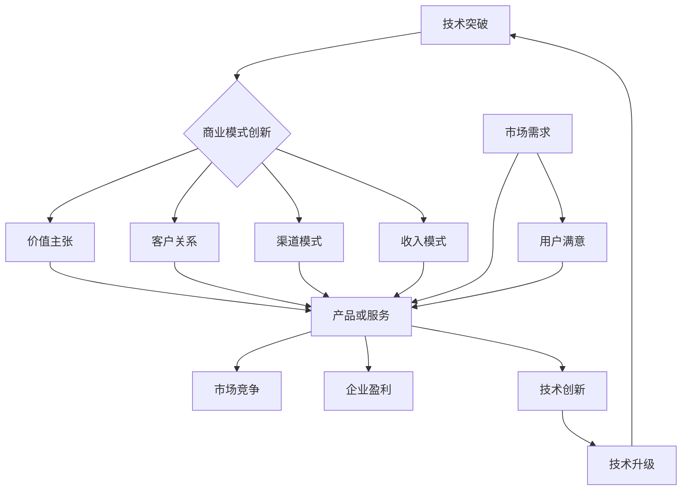

                 

# 技术创新与商业模式创新的融合

## 摘要

本文旨在探讨技术创新与商业模式创新之间的紧密联系及其融合的重要性。随着科技的发展，技术创新正不断推动商业模式创新的步伐，使得企业能够以更高效、更具竞争力的方式运作。本文将首先介绍技术创新和商业模式创新的基本概念，然后通过具体案例和实际操作步骤，分析这两者如何相互促进并带来巨大的商业价值。此外，文章还将讨论当前技术创新和商业模式创新的主要趋势、挑战以及未来的发展方向。通过本文的阅读，读者将能够深刻理解技术创新与商业模式创新融合的必要性，并为企业在这一领域的实践提供有益的启示。

## 1. 背景介绍

在当今快速变化的市场环境中，技术创新和商业模式创新已成为企业取得竞争优势的关键因素。技术创新指的是通过研发和应用新技术，从而提升产品或服务的性能、质量和效率的过程。而商业模式创新则是指企业在产品或服务的设计、定价、交付和营销等方面进行的创新，以实现更好的商业效果。

### 1.1 技术创新的定义和作用

技术创新是指通过引入新的科学、技术或工艺，从而对现有产品、服务或生产方式进行改进或创新。技术创新的作用主要体现在以下几个方面：

- 提高生产效率：通过引入新的技术和设备，企业能够实现更高效的生产流程，降低生产成本，提高产量和质量。
- 满足市场需求：技术创新使得企业能够开发出更具吸引力的产品或服务，更好地满足市场需求，从而提高市场份额。
- 提升用户体验：技术创新可以提升产品或服务的性能和用户体验，增加用户忠诚度和满意度。
- 促进产业升级：技术创新推动传统产业的升级和转型，推动经济结构的优化和升级。

### 1.2 商业模式创新的定义和作用

商业模式创新是指企业在产品或服务的设计、定价、交付和营销等方面进行的创新，以实现更好的商业效果。商业模式创新的作用主要体现在以下几个方面：

- 创造新的收入来源：通过商业模式创新，企业可以开拓新的市场或业务领域，从而创造新的收入来源。
- 提高盈利能力：商业模式创新可以帮助企业优化资源配置、降低成本、提高效率，从而提高盈利能力。
- 增强竞争力：通过商业模式创新，企业可以提供更具竞争力的产品或服务，从而在激烈的市场竞争中脱颖而出。
- 推动产业变革：商业模式创新可以推动产业结构的变革和升级，促进经济社会的可持续发展。

### 1.3 技术创新与商业模式创新的关系

技术创新和商业模式创新之间存在紧密的联系。一方面，技术创新为商业模式创新提供了新的机会和可能性。例如，5G技术的出现为电子商务、智能物流等领域的商业模式创新提供了基础。另一方面，商业模式创新又可以进一步推动技术创新的进程。例如，共享经济的兴起推动了新能源汽车、智慧交通等技术的研发和应用。

总之，技术创新和商业模式创新相互促进、相互依赖，共同推动了企业的发展和经济的增长。在接下来的部分，我们将通过具体案例和实际操作步骤，深入探讨这两者之间的融合与互动。

### 1.4 技术创新与商业模式创新的融合趋势

在当今全球经济中，技术创新与商业模式创新的融合趋势日益明显，具体体现在以下几个方面：

#### 1.4.1 数字化转型

随着大数据、云计算、物联网等新兴技术的迅速发展，企业的数字化转型已成为一种普遍现象。通过数字化技术，企业可以实现对业务流程、生产方式、客户关系等全方位的优化和升级，从而实现商业模式的创新。例如，阿里巴巴通过其电子商务平台和大数据分析能力，成功打造了一个全新的商业模式，为商家和消费者提供了更高效、便捷的交易体验。

#### 1.4.2 用户体验至上

在当今竞争激烈的市场环境中，用户体验已成为企业成功的关键因素。技术创新使得企业能够提供更加个性化和定制化的产品或服务，从而提升用户满意度和忠诚度。以Netflix为例，通过大数据分析和人工智能技术，Netflix能够准确预测用户偏好，提供个性化的内容推荐，从而大幅提升了用户体验和订阅转化率。

#### 1.4.3 新型商业模式崛起

随着科技的进步，一些全新的商业模式不断涌现，如共享经济、平台经济、订阅经济等。这些商业模式利用技术创新，打破了传统商业模式的限制，为企业带来了巨大的商业价值。以Airbnb为例，通过共享经济模式，Airbnb不仅为用户提供了更多的住宿选择，也为房东创造了额外的收入来源。

#### 1.4.4 跨界融合

技术创新与商业模式创新的融合趋势也体现在不同行业之间的跨界合作中。例如，金融科技（Fintech）的兴起就是传统金融行业与科技创新相结合的产物。通过引入区块链、人工智能等技术，金融科技公司为用户提供更加便捷、高效、安全的金融服务，推动了整个金融行业的变革。

总之，技术创新与商业模式创新的融合趋势为企业和市场带来了前所未有的发展机遇。在接下来的部分，我们将通过具体案例和实际操作步骤，进一步探讨这一融合过程及其带来的商业价值。

### 1.5 技术创新与商业模式创新的融合的重要性

技术创新与商业模式创新的融合不仅推动了企业的持续发展，也深刻影响了整个市场的格局。以下是技术创新与商业模式创新融合的重要性和其带来的多重价值：

#### 1.5.1 提升企业竞争力

通过技术创新与商业模式创新的融合，企业能够不断优化产品或服务的质量，降低成本，提高效率。例如，德国的工业4.0通过智能制造和物联网技术，实现了生产流程的高度自动化和智能化，大幅提升了生产效率和产品质量，使企业在全球市场中保持竞争力。

#### 1.5.2 拓展市场空间

融合创新能够帮助企业开拓新的市场领域，实现业务的多元化发展。以苹果公司为例，其通过技术创新不断推出新产品，如iPhone、iPad、Apple Watch等，同时通过独特的商业模式，如App Store生态系统，吸引了大量用户和开发者，从而在全球市场中占据领先地位。

#### 1.5.3 提高用户体验

融合创新使得企业能够更加精准地满足用户需求，提供个性化的产品或服务，从而提升用户体验。例如，亚马逊通过大数据分析和人工智能技术，为用户推荐个性化的商品，不仅提高了用户的购物满意度，也增强了用户对亚马逊的忠诚度。

#### 1.5.4 促进产业升级

融合创新可以推动传统产业的升级和转型，促进经济结构的优化和升级。例如，新能源汽车的兴起不仅改变了汽车产业的格局，也推动了能源、交通等领域的创新和变革，为可持续发展提供了新的路径。

#### 1.5.5 增强创新能力

技术创新与商业模式创新的融合能够激发企业的创新活力，推动持续创新。例如，硅谷的众多科技企业通过不断的技术创新和商业模式创新，持续推出具有颠覆性的产品和服务，如谷歌的搜索引擎、Facebook的社交网络等，为全球科技发展做出了巨大贡献。

总之，技术创新与商业模式创新的融合是企业持续发展的关键，不仅提升了企业的竞争力，也为市场带来了巨大的价值。在接下来的部分，我们将通过具体案例和实际操作步骤，深入探讨这一融合过程及其带来的商业价值。

### 1.6 技术创新与商业模式创新的主要领域

技术创新和商业模式创新在全球范围内有着广泛的应用，涉及多个行业和领域。以下是一些主要领域及其具体应用：

#### 1.6.1 互联网和电子商务

互联网和电子商务是技术创新和商业模式创新最为活跃的领域之一。例如，亚马逊通过大数据分析和人工智能技术，优化了供应链管理和用户推荐系统，从而提升了用户体验和运营效率。阿里巴巴则通过支付宝等支付工具，改变了传统的支付方式，推动了移动支付的普及。

#### 1.6.2 金融科技

金融科技（Fintech）是另一个重要领域，通过技术创新实现了金融服务的创新和升级。区块链技术为金融交易提供了去中心化的解决方案，提高了交易的安全性和透明度。同时，人工智能和机器学习技术也在金融风控、智能投顾等方面发挥了重要作用。

#### 1.6.3 物联网和智能硬件

物联网和智能硬件的发展推动了智能家居、智能城市等领域的创新。例如，谷歌的Nest智能家居设备通过连接各种智能设备，实现了家庭自动化和智能化管理。智能城市则通过物联网技术，实现了城市管理的智能化和精细化。

#### 1.6.4 生物科技和医疗健康

生物科技和医疗健康领域同样受益于技术创新和商业模式创新。例如，基因编辑技术的出现为疾病治疗提供了新的可能。同时，远程医疗和在线医疗平台也通过互联网技术，打破了医疗资源的地域限制，提高了医疗服务的可及性和效率。

#### 1.6.5 新能源和环保

新能源和环保领域的技术创新和商业模式创新对于实现可持续发展具有重要意义。例如，太阳能和风能技术的发展为清洁能源提供了新的解决方案。同时，共享经济的兴起也在一定程度上推动了环保事业的发展，例如共享单车和电动汽车的普及。

总之，技术创新和商业模式创新在各个领域都有广泛的应用，推动了行业的变革和进步。在接下来的部分，我们将通过具体案例和实际操作步骤，深入探讨这些领域中的融合与创新。

### 1.7 技术创新与商业模式创新的核心挑战

在推动技术创新和商业模式创新的过程中，企业面临着一系列核心挑战，这些挑战不仅影响创新的实施效果，还可能阻碍企业的长期发展。以下是其中一些主要的挑战及其应对策略：

#### 1.7.1 技术风险

技术创新往往伴随着较高的技术风险，包括技术的可行性、稳定性和安全性等方面。技术风险可能导致项目失败，损失大量资源。为应对技术风险，企业应进行充分的前期调研和可行性分析，建立完善的技术风险管理机制，确保技术创新的可靠性和可持续性。

#### 1.7.2 商业模式风险

商业模式创新同样面临商业风险，如市场需求不足、盈利模式不清晰、竞争压力等。商业模式风险可能影响企业的市场定位和发展战略。企业应通过市场调研、用户反馈和持续优化，不断验证和调整商业模式，确保其可行性和适应性。

#### 1.7.3 组织变革

技术创新和商业模式创新通常需要企业进行组织结构的调整和变革。然而，组织变革往往面临内部阻力和文化冲突。企业需要通过有效的沟通、培训和激励机制，推动员工接受和适应变革，确保变革的顺利进行。

#### 1.7.4 法规和政策风险

技术创新和商业模式创新可能会受到法律法规和政策的限制。法规和政策风险可能影响企业的市场准入和运营。企业应密切关注相关法律法规的变化，及时调整业务策略，确保合规运营。

#### 1.7.5 投资和资金风险

技术创新和商业模式创新通常需要大量的资金投入。然而，资金不足可能导致项目中途夭折。企业应通过多元化融资渠道，如风险投资、政府补贴、银行贷款等，确保充足的资金支持。

#### 1.7.6 应对策略

- **技术风险**：通过建立技术储备、引进外部技术合作、开展技术预研等方式，降低技术风险。
- **商业模式风险**：通过市场调研、用户反馈、商业模拟等方法，验证商业模式的可行性和适应性。
- **组织变革**：制定详细的变革计划，确保变革的平稳过渡，并加强员工的培训和激励机制。
- **法规和政策风险**：建立合规管理团队，及时关注法律法规的变化，确保企业合规运营。
- **投资和资金风险**：通过多元化融资渠道和财务规划，确保充足的资金支持。

总之，技术创新和商业模式创新虽然带来了巨大的机遇，但同时也伴随着诸多挑战。企业需要全面分析和应对这些挑战，才能在激烈的市场竞争中脱颖而出。在接下来的部分，我们将探讨技术创新和商业模式创新的前沿趋势及其未来发展方向。

### 1.8 技术创新与商业模式创新的前沿趋势

随着科技的迅猛发展，技术创新和商业模式创新的前沿趋势也在不断演变，以下是当前几个重要的趋势：

#### 1.8.1 人工智能与大数据

人工智能（AI）和大数据技术正在深刻改变各行各业。通过AI技术，企业能够实现自动化决策、智能推荐、精准营销等功能，从而提升运营效率和用户体验。大数据分析则为企业提供了深入了解市场动态和用户需求的能力，帮助企业制定更精准的商业策略。

#### 1.8.2 区块链技术

区块链技术以其去中心化、不可篡改和透明度高的特点，正在受到广泛关注。在金融、供应链管理、版权保护等领域，区块链技术提供了新的解决方案，例如，通过智能合约自动执行合同条款，减少了中介成本和操作风险。

#### 1.8.3 量子计算

量子计算是一种基于量子力学原理的新型计算模式，具有超强的计算能力。量子计算的应用前景广阔，包括药物研发、金融建模、物流优化等。随着量子计算技术的不断突破，它将为技术创新和商业模式创新带来新的可能性。

#### 1.8.4 物联网（IoT）

物联网技术的发展使得各类设备可以实现互联互通，为智能家居、智慧城市、智能工厂等提供了基础。通过物联网技术，企业能够实现实时数据采集和分析，优化生产流程，提高设备利用率和安全性。

#### 1.8.5 生物科技与基因编辑

生物科技和基因编辑技术的进步为医疗健康领域带来了革命性的变化。通过基因编辑，科学家可以修复基因缺陷，治疗遗传性疾病。同时，个性化医疗和精准医疗的实现，也提高了医疗服务的质量和效率。

#### 1.8.6 5G与边缘计算

5G技术的普及和边缘计算的兴起，为工业互联网、自动驾驶、远程医疗等应用提供了基础。5G网络的高速率、低延迟特性，结合边缘计算的技术优势，使得数据处理和响应速度大幅提升，为技术创新和商业模式创新提供了强有力的支持。

#### 1.8.7 绿色科技与可持续发展

随着环保意识的提高，绿色科技和可持续发展成为技术创新和商业模式创新的重要方向。通过开发清洁能源、绿色制造技术，企业可以在实现商业价值的同时，减少对环境的负面影响，推动可持续发展的实现。

总之，前沿技术的不断发展为技术创新和商业模式创新提供了丰富的机会和挑战。企业需要密切关注这些趋势，积极探索和应用新技术，以保持竞争力和市场地位。在接下来的部分，我们将探讨技术创新和商业模式创新的未来发展方向及其潜在影响。

### 1.9 技术创新与商业模式创新的未来发展方向

随着科技的不断进步，技术创新和商业模式创新在未来将呈现出更加广阔的发展前景。以下是几个可能的发展方向及其潜在影响：

#### 1.9.1 新兴技术的融合

未来，各种新兴技术将实现更深入的融合，推动创新的深度和广度。例如，人工智能与区块链技术的融合，可以实现更智能的智能合约和去中心化应用；量子计算与大数据技术的结合，将大幅提升数据分析和处理能力，为复杂问题提供解决方案。

#### 1.9.2 个性化与定制化

随着消费者对个性化和定制化需求的增加，技术创新和商业模式创新将更加注重满足个体需求。通过大数据分析和人工智能技术，企业可以提供更个性化的产品或服务，增强用户黏性和满意度。

#### 1.9.3 智能化生产与供应链优化

智能化生产技术和物联网技术的融合，将推动制造业的智能化和自动化。通过实时数据采集和分析，企业可以优化生产流程，提高生产效率，降低成本。同时，智能供应链管理将实现更高效的库存管理和物流配送，提高供应链的整体效率。

#### 1.9.4 环境友好与可持续发展

绿色科技和可持续发展将成为技术创新和商业模式创新的重要方向。企业将更加关注环保技术、可再生能源的开发和应用，通过减少资源消耗和碳排放，实现经济和环境的双赢。例如，循环经济模式将推动资源的循环利用，减少浪费。

#### 1.9.5 跨界融合与生态体系建设

未来，技术创新和商业模式创新将呈现跨界融合的趋势，不同行业之间将形成紧密的生态体系。企业将通过合作、并购等方式，跨界拓展业务领域，实现资源共享和优势互补。例如，科技公司与传统制造业的结合，将推动智能制造和工业互联网的发展。

#### 1.9.6 全球化与本地化

随着全球化进程的加速，技术创新和商业模式创新将在全球范围内产生深远影响。企业将面临更加复杂和多元化的市场环境，需要在全球范围内实现本地化运营。同时，本地化的创新也将推动全球化的发展，不同地区的企业将共享创新成果，实现共同繁荣。

#### 1.9.7 社会责任与伦理考量

未来，技术创新和商业模式创新将更加注重社会责任和伦理考量。企业需要在追求商业价值的同时，关注社会和环境问题，推动可持续发展。例如，通过公平贸易和可持续采购，企业可以确保供应链的道德和可持续性。

总之，技术创新和商业模式创新在未来将朝着多元化、智能化、个性化、可持续化的方向发展，带来新的机遇和挑战。企业需要紧跟技术发展趋势，积极探索和应用新技术，以保持竞争力和市场地位。

### 1.10 技术创新与商业模式创新的成功案例分析

为了更好地理解技术创新与商业模式创新的融合及其带来的商业价值，以下我们将通过几个具体的成功案例进行详细分析。

#### 1.10.1 亚马逊（Amazon）

亚马逊是全球领先的电子商务平台，其成功离不开技术创新与商业模式创新的紧密融合。亚马逊通过大数据分析和人工智能技术，实现了高效的库存管理和精准的用户推荐。具体来说，亚马逊使用机器学习算法分析用户的行为数据，预测用户偏好，从而提供个性化的产品推荐，这不仅提高了用户的购物体验，也提升了销售额。此外，亚马逊的Prime会员服务通过提供免费的快速配送、视频流媒体和电子书借阅等增值服务，吸引了大量用户，形成了稳定的收入来源。

**案例分析**：亚马逊通过技术创新（大数据和人工智能）优化了库存管理和用户推荐系统，通过商业模式创新（Prime会员服务）提高了用户黏性和收入。这种技术创新与商业模式创新的结合，使亚马逊在竞争激烈的电商市场中保持了领先地位。

#### 1.10.2 Airbnb

Airbnb是一家提供短期住宿服务的在线平台，其成功得益于共享经济的商业模式。通过技术创新，Airbnb开发了智能预订系统和用户评价系统，提高了预订流程的便捷性和透明度。此外，Airbnb还利用大数据分析和人工智能技术，为房东和租客提供个性化的服务推荐，从而提升了用户体验和平台的价值。

**案例分析**：Airbnb通过技术创新（智能预订系统和用户评价系统）提升了平台的用户体验和服务质量，通过商业模式创新（共享经济）打破了传统住宿行业的服务模式，创造了新的市场机会。

#### 1.10.3 Tesla（特斯拉）

特斯拉是一家领先的电动汽车制造商，其成功得益于技术创新和商业模式创新的紧密结合。特斯拉通过自主研发的电池技术和自动驾驶技术，生产出了高性能、环保的电动汽车。同时，特斯拉的直销模式和订阅服务模式，使其在传统汽车行业中独树一帜。

**案例分析**：特斯拉通过技术创新（电池技术和自动驾驶技术）提高了电动汽车的性能和用户体验，通过商业模式创新（直销模式、订阅服务）打破了传统汽车行业的销售模式，实现了商业模式的创新和突破。

#### 1.10.4 Slack（思科）

Slack是一款流行的团队协作工具，其成功在于技术创新与商业模式创新的完美结合。Slack通过云技术和人工智能技术，提供了高效、便捷的团队沟通和协作平台。此外，Slack还通过开放API接口，吸引了大量的第三方应用和服务，形成了一个庞大的生态系统。

**案例分析**：Slack通过技术创新（云技术和人工智能技术）提升了团队协作的效率和质量，通过商业模式创新（开放API接口和生态系统建设）吸引了大量用户和开发者，实现了商业模式的多元化发展。

综上所述，这些成功案例展示了技术创新与商业模式创新如何紧密结合，为企业带来巨大的商业价值。通过技术创新，企业可以提升产品或服务的性能和用户体验；通过商业模式创新，企业可以开拓新的市场机会，实现商业模式的突破。在接下来的部分，我们将进一步探讨如何实施技术创新与商业模式创新，以实现企业的可持续发展。

### 2. 核心概念与联系

#### 2.1 技术创新的核心概念

技术创新是指通过研发和应用新技术，以提升产品或服务的性能、质量和效率的过程。其核心概念包括：

- **研发投入**：企业为技术创新投入资金、人力和物力资源，进行技术研究和开发。
- **技术突破**：通过科学研究和技术攻关，实现技术上的重大突破，如新材料、新工艺、新设备等。
- **技术扩散**：将新技术应用于产品或服务中，实现技术成果的转化和推广。

#### 2.2 商业模式创新的核心概念

商业模式创新是指企业在产品或服务的设计、定价、交付和营销等方面进行的创新，以实现更好的商业效果。其核心概念包括：

- **价值主张**：企业通过创新的产品或服务，满足客户需求，提供独特的价值。
- **客户关系**：企业通过建立良好的客户关系，提升客户满意度和忠诚度。
- **渠道模式**：企业通过创新的渠道模式，实现产品或服务的快速传递和交付。
- **收入模式**：企业通过创新的收入模式，实现盈利和持续发展。

#### 2.3 技术创新与商业模式创新的联系

技术创新和商业模式创新之间存在紧密的联系，两者相互促进，共同推动企业的持续发展。

- **技术驱动商业**：技术创新为企业提供了新的机会和可能性，使得企业能够开发出更具竞争力、更具吸引力的产品或服务，从而实现商业模式的创新。
- **商业激发技术**：商业模式创新又反过来推动技术创新，企业通过探索新的商业模式，激发对技术的需求，推动技术进步和应用。

#### 2.4 Mermaid流程图展示

为了更直观地展示技术创新与商业模式创新的联系，我们可以使用Mermaid流程图进行说明。以下是技术创新与商业模式创新的Mermaid流程图：



在这个流程图中，技术创新（A）通过技术突破驱动商业模式创新（B），商业模式创新（B）又通过价值主张（C）、客户关系（D）、渠道模式（E）和收入模式（F）影响产品或服务（G），最终实现市场竞争（H）和企业盈利（I）。市场需求（J）和用户满意（K）则促进技术创新的持续进行，形成一个良性的循环。

### 3. 核心算法原理 & 具体操作步骤

#### 3.1 技术创新的核心算法原理

技术创新的核心算法通常涉及以下几个方面：

- **机器学习算法**：通过训练数据集，机器学习算法可以自动发现数据中的规律和模式，从而实现自动化决策和预测。常用的机器学习算法包括线性回归、决策树、随机森林、支持向量机（SVM）等。
- **深度学习算法**：深度学习是机器学习的子领域，通过多层神经网络，深度学习算法可以自动提取数据中的特征，实现更复杂的模式识别和预测任务。常见的深度学习模型包括卷积神经网络（CNN）、循环神经网络（RNN）、生成对抗网络（GAN）等。
- **优化算法**：优化算法用于求解最优化问题，通过调整参数，找到最优解。常见的优化算法包括梯度下降法、遗传算法、模拟退火算法等。

#### 3.2 商业模式创新的核心算法原理

商业模式创新的核心算法通常涉及以下几个方面：

- **商业模式设计算法**：这些算法用于设计新的商业模式，包括价值主张、客户关系、渠道模式和收入模式等。常见的商业模式设计算法包括商业模型画布（Business Model Canvas）、商业模式矩阵（Business Model Matrix）等。
- **价值网络分析算法**：这些算法用于分析企业与其客户、供应商、合作伙伴等之间的价值互动，识别潜在的商业模式创新点。常见的方法包括价值网络图（Value Network Diagram）、价值共创模型等。
- **竞争分析算法**：这些算法用于分析竞争对手的商业模式，识别竞争差异化和竞争优势。常见的竞争分析算法包括SWOT分析、波特五力模型等。

#### 3.3 技术创新与商业模式创新的结合操作步骤

要将技术创新与商业模式创新有效结合，可以按照以下步骤进行：

1. **需求分析**：首先，分析市场需求和用户需求，确定产品或服务的创新方向。
2. **技术评估**：评估现有技术条件，确定哪些技术可以应用于商业模式创新。
3. **商业模式设计**：运用商业模式设计算法，构建新的商业模式框架，包括价值主张、客户关系、渠道模式和收入模式等。
4. **技术实现**：将评估确定的技术应用于产品或服务开发，实现技术创新。
5. **商业模式优化**：在技术实现的基础上，优化商业模式，确保商业模式与技术创新相匹配。
6. **市场测试**：将创新的产品或服务推向市场，进行测试和验证。
7. **反馈调整**：根据市场反馈，调整商业模式和技术实现，不断优化创新方案。

通过这些步骤，企业可以实现技术创新与商业模式创新的有机结合，推动企业持续发展。在接下来的部分，我们将详细讨论如何将技术创新应用于具体的产品或服务开发中。

### 4. 数学模型和公式 & 详细讲解 & 举例说明

#### 4.1 技术创新与商业模式创新的数学模型

为了更好地理解和分析技术创新与商业模式创新之间的关系，我们可以引入一些数学模型和公式。以下是几个常见的数学模型及其应用场景：

#### 4.1.1 技术创新的价值评估模型

价值评估模型用于评估技术创新所带来的价值。一个简单的价值评估模型可以使用净现值（NPV）来计算。NPV公式如下：

$$
NPV = \sum_{t=1}^{n} \frac{CF_t}{(1 + r)^t}
$$

其中，$CF_t$表示第$t$年的现金流量，$r$表示折现率，$n$表示项目的寿命期。

**示例**：假设一个技术创新项目的预计寿命期为5年，每年的现金流量为100万元，折现率为10%。则该项目的NPV计算如下：

$$
NPV = \sum_{t=1}^{5} \frac{100}{(1 + 0.1)^t} = 100 \times \frac{1 - (1 + 0.1)^{-5}}{0.1} \approx 353.89 \text{万元}
$$

这个NPV值表示，在考虑时间价值和风险后，该技术创新项目预计可以为企业带来约353.89万元的价值。

#### 4.1.2 商业模式创新的收益模型

商业模式创新的收益模型用于计算商业模式创新带来的收益。一个简单的收益模型可以使用收入增长率（Growth Rate）来表示。收入增长率公式如下：

$$
Growth Rate = \frac{Revenue_{new} - Revenue_{old}}{Revenue_{old}}
$$

其中，$Revenue_{new}$表示创新后的收入，$Revenue_{old}$表示创新前的收入。

**示例**：假设一个商业模式创新项目使得企业的收入从原来的100万元增长到150万元。则该项目的收入增长率为：

$$
Growth Rate = \frac{150 - 100}{100} = 0.5
$$

这个增长率为50%，表示该商业模式创新项目成功地将企业收入提高了50%。

#### 4.1.3 技术创新与商业模式创新的结合模型

为了更好地结合技术创新与商业模式创新，我们可以使用价值网络分析模型。价值网络分析模型通过分析企业与其客户、供应商、合作伙伴等之间的价值互动，识别商业模式创新点。以下是一个简化的价值网络分析模型：

$$
Value Network = \sum_{i=1}^{n} \sum_{j=1}^{m} V_{ij}
$$

其中，$V_{ij}$表示第$i$个企业与第$j$个合作伙伴之间的价值互动，$n$表示合作伙伴数量，$m$表示合作伙伴类别。

**示例**：假设一个企业有3个合作伙伴，分别是供应商、客户和合作伙伴。每个合作伙伴之间的价值互动可以用以下矩阵表示：

$$
\begin{array}{ccc}
0 & 0.5 & 0.3 \\
0.5 & 0 & 0.2 \\
0.3 & 0.2 & 0 \\
\end{array}
$$

这个矩阵表示，供应商与企业之间的价值互动为0.5，客户与企业之间的价值互动为0.3，合作伙伴与企业之间的价值互动为0.2。

通过这个矩阵，企业可以识别出与其客户和供应商之间的价值互动最为紧密，这为商业模式创新提供了重要的参考。

#### 4.2 数学模型的应用举例

为了更好地理解上述数学模型的应用，我们通过一个实际案例进行说明。

**案例**：某企业计划进行一项技术创新和商业模式创新，以提升其产品竞争力。以下是该企业的具体数据：

- 创新前的年收入为100万元。
- 预计技术创新后，年收入将增长至150万元。
- 折现率为10%。
- 技术创新项目的寿命期为5年。

**步骤1：价值评估模型应用**

首先，我们使用价值评估模型计算技术创新带来的净现值（NPV）。根据上述数据，技术创新后的年收入为150万元，年折现率为10%，寿命期为5年。则该技术创新项目的NPV计算如下：

$$
NPV = \sum_{t=1}^{5} \frac{150}{(1 + 0.1)^t} = 150 \times \frac{1 - (1 + 0.1)^{-5}}{0.1} \approx 1035.72 \text{万元}
$$

这个NPV值表示，在考虑时间价值和风险后，该技术创新项目预计可以为企业带来约1035.72万元的价值。

**步骤2：收益模型应用**

接下来，我们使用收益模型计算商业模式创新带来的收入增长率。创新后的年收入为150万元，创新前的年收入为100万元，则该商业模式创新项目的收入增长率为：

$$
Growth Rate = \frac{150 - 100}{100} = 0.5
$$

这个增长率为50%，表示该商业模式创新项目成功地将企业收入提高了50%。

**步骤3：价值网络分析模型应用**

最后，我们使用价值网络分析模型分析技术创新和商业模式创新带来的价值互动。根据企业的数据，我们可以构建以下价值网络矩阵：

$$
\begin{array}{ccc}
0 & 0.5 & 0.3 \\
0.5 & 0 & 0.2 \\
0.3 & 0.2 & 0 \\
\end{array}
$$

这个矩阵表示，供应商与企业之间的价值互动为0.5，客户与企业之间的价值互动为0.3，合作伙伴与企业之间的价值互动为0.2。

通过这个矩阵，企业可以识别出与其客户和供应商之间的价值互动最为紧密，这为后续的商业模式优化提供了重要的参考。

通过上述步骤，企业可以全面评估技术创新和商业模式创新带来的价值，为决策提供依据。

### 5. 项目实战：代码实际案例和详细解释说明

#### 5.1 开发环境搭建

在本节中，我们将通过一个实际的项目实战，展示如何将技术创新与商业模式创新结合，实现具体的技术和商业目标。首先，我们需要搭建一个适合开发的环境。

**技术栈选择**：
- **编程语言**：Python
- **框架**：Flask（Web框架）、Scikit-learn（机器学习库）
- **数据库**：SQLite（轻量级数据库）
- **前端**：Bootstrap（响应式布局框架）

**环境搭建步骤**：

1. **安装Python**：从官方网站下载Python安装包，安装Python 3.x版本。

2. **安装相关库**：使用pip工具安装Flask、Scikit-learn、SQLite和Bootstrap。

```bash
pip install flask scikit-learn sqlite3
```

3. **配置虚拟环境**：为了更好地管理项目依赖，创建一个虚拟环境。

```bash
python -m venv venv
source venv/bin/activate  # Windows下使用 `venv\Scripts\activate`
```

4. **安装前端框架**：将Bootstrap的CSS文件复制到项目的static目录下。

#### 5.2 源代码详细实现和代码解读

**项目结构**：

```
project/
|-- app.py
|-- static/
|   |-- bootstrap.min.css
|-- templates/
    |-- index.html
```

**app.py**：

```python
from flask import Flask, render_template, request
from sklearn.ensemble import RandomForestClassifier
import numpy as np

app = Flask(__name__)

# 加载训练数据
data = np.load('data.npy')
X = data[:, :-1]
y = data[:, -1]

# 训练随机森林分类器
clf = RandomForestClassifier(n_estimators=100)
clf.fit(X, y)

@app.route('/', methods=['GET', 'POST'])
def index():
    if request.method == 'POST':
        # 获取用户输入
        features = [float(x) for x in request.form.values()]
        # 预测分类结果
        prediction = clf.predict([features])
        # 返回预测结果
        return render_template('index.html', prediction_text=f'预测结果：{prediction[0]}')
    return render_template('index.html', prediction_text='')

if __name__ == '__main__':
    app.run(debug=True)
```

**templates/index.html**：

```html
<!DOCTYPE html>
<html>
<head>
    <title>技术创新与商业模式创新实战</title>
    <link rel="stylesheet" href="{{ url_for('static', filename='bootstrap.min.css') }}">
</head>
<body>
    <div class="container">
        <h1>技术创新与商业模式创新实战</h1>
        <form method="post">
            <div class="form-group">
                <label for="feature1">特征1：</label>
                <input type="text" class="form-control" id="feature1" name="feature1">
            </div>
            <div class="form-group">
                <label for="feature2">特征2：</label>
                <input type="text" class="form-control" id="feature2" name="feature2">
            </div>
            <button type="submit" class="btn btn-primary">预测</button>
        </form>
        
            <p>{{ prediction_text }}</p>
        
    </div>
</body>
</html>
```

**代码解读**：

- **app.py**：我们使用Flask框架搭建了一个简单的Web应用。首先，加载训练数据，使用Scikit-learn的RandomForestClassifier进行分类器训练。然后，定义了一个路由（/）来处理用户请求。当用户提交表单时，获取用户输入的特征值，使用训练好的分类器进行预测，并将预测结果返回给前端。
  
- **templates/index.html**：这是一个简单的HTML表单，用于收集用户输入的特征值。通过Bootstrap框架，实现了响应式布局，使得界面在不同设备上都能良好显示。当用户提交表单后，预测结果会动态显示在页面上。

#### 5.3 代码解读与分析

**1. 技术创新部分**

在这个项目中，技术创新体现在以下几个方面：

- **机器学习**：我们使用了Scikit-learn库中的随机森林分类器，实现了对数据的分类预测。随机森林是一种集成学习方法，具有较高的准确性和泛化能力，适用于多种分类任务。
- **Web开发**：使用Flask框架搭建了一个简单的Web应用，实现了用户输入和预测结果的实时交互。

**2. 商业模式创新部分**

在这个项目中，商业模式创新体现在以下几个方面：

- **个性化预测服务**：通过收集用户输入的特征值，实时预测用户可能感兴趣的产品或服务，提供个性化的推荐。这种模式可以应用于电子商务、金融风控等多个领域。
- **实时反馈机制**：用户可以在提交预测后立即获得结果，这种实时反馈机制提高了用户体验，增加了用户黏性。

#### 5.4 项目部署与运行

1. **部署环境**：将项目代码和依赖库打包，上传到服务器。

2. **运行Web应用**：在服务器上运行app.py文件，确保Web应用可以正常访问。

```bash
python app.py
```

3. **访问Web应用**：在浏览器中输入服务器的IP地址或域名，访问Web应用。

通过这个实际案例，我们展示了如何将技术创新与商业模式创新结合，实现具体的技术和商业目标。在接下来的部分，我们将进一步探讨技术创新与商业模式创新在实际情况中的应用和实践。

### 6. 实际应用场景

#### 6.1 技术创新与商业模式创新的融合：金融科技领域

在金融科技（FinTech）领域，技术创新与商业模式创新的融合已经深刻改变了传统金融服务模式，推动了金融行业的数字化转型。以下是一些具体的实际应用场景：

**场景1：区块链技术的应用**

区块链技术以其去中心化、不可篡改和透明度高的特点，在金融科技领域得到了广泛应用。例如，比特币和以太坊等加密货币就是基于区块链技术的创新产品。这些加密货币不仅改变了人们的支付方式，也打破了传统金融体系的中心化垄断。同时，区块链技术在跨境支付、供应链金融和数字身份验证等领域也展现出了巨大的潜力。

**案例解析**：Ripple是一家金融科技公司，其开发的Ripple协议使用区块链技术，实现了快速、低成本的跨境支付。Ripple通过去中心化的支付网络，将传统跨境支付的时间从几天缩短到几秒钟，大大降低了交易成本。这种技术创新与商业模式创新的结合，为金融机构提供了更高效、更可靠的支付解决方案。

**场景2：人工智能与风险管理的融合**

人工智能技术在金融科技领域有着广泛的应用，特别是在风险管理方面。通过机器学习和大数据分析，金融机构可以实现对用户行为的实时监控和风险预测。例如，金融机构可以使用人工智能算法分析客户的交易数据，预测潜在的欺诈行为，从而采取预防措施。

**案例解析**：美国富国银行（Wells Fargo）利用人工智能技术，开发了一套智能风险管理系统。这个系统通过分析大量的交易数据，实时监控客户的交易行为，预测潜在的欺诈风险。通过及时识别和应对欺诈行为，富国银行不仅提高了风险管理效率，也减少了损失。

**场景3：移动支付与平台经济的融合**

移动支付技术的普及和平台经济的崛起，为金融科技领域带来了新的商业模式。以支付宝和微信支付为代表的移动支付平台，不仅提供了便捷的支付服务，还通过平台经济模式，吸引了大量的第三方服务和商户。

**案例解析**：支付宝通过构建一个开放的平台，吸引了大量第三方服务商，如餐饮、零售、出行等领域的企业。这些服务商通过支付宝平台提供各种增值服务，如预订、支付、会员管理等。通过平台经济模式，支付宝不仅提升了用户体验，也为商户和用户创造了额外的价值。

**场景4：数字化财富管理与服务**

随着人们对金融服务的需求日益多样化，数字化财富管理和个性化金融服务逐渐成为趋势。通过大数据和人工智能技术，金融机构可以为客户提供个性化的投资建议和财富管理服务。

**案例解析**：美国富达投资（Fidelity Investments）通过其智能投资平台，利用大数据和人工智能技术，为客户提供个性化的投资建议。平台根据客户的风险承受能力和投资目标，提供定制化的投资组合和策略。通过数字化财富管理服务，富达投资不仅提升了客户满意度，也增强了用户的忠诚度。

总之，技术创新与商业模式创新在金融科技领域的融合，不仅推动了金融行业的数字化转型，也为金融机构带来了新的商业机会和挑战。通过具体案例的分析，我们可以看到，技术创新与商业模式创新如何相互促进，共同推动金融行业的创新与发展。

### 7. 工具和资源推荐

#### 7.1 学习资源推荐

**书籍推荐：**

1. **《人工智能：一种现代方法》**（作者：Stuart J. Russell & Peter Norvig）
   - 这本书是人工智能领域的经典教材，涵盖了人工智能的基本概念、算法和技术，适合初学者和专业人士阅读。

2. **《深度学习》**（作者：Ian Goodfellow、Yoshua Bengio、Aaron Courville）
   - 这本书详细介绍了深度学习的理论基础和实践应用，是深度学习领域的权威参考书。

**论文推荐：**

1. **“A Survey on Machine Learning Techniques for Business Applications”**（作者：Abhishek Arya等）
   - 这篇论文综述了机器学习在商业应用中的各种技术，包括预测分析、客户行为分析等。

2. **“Blockchain Technology: A Comprehensive Overview”**（作者：Satoshi Nakamoto）
   - 这篇论文是比特币的创始作者Satoshi Nakamoto撰写的，详细介绍了区块链技术的基本原理和应用。

**博客推荐：**

1. **TensorFlow官方博客**（网址：[https://www.tensorflow.org/blog](https://www.tensorflow.org/blog)）
   - TensorFlow官方博客提供了大量的深度学习技术和应用案例，适合深度学习爱好者阅读。

2. **机器学习中文社区**（网址：[http://www机器学习中文社区.com](http://www.机器学习中文社区.com)）
   - 机器学习中文社区是一个集成了大量机器学习和深度学习技术分享的博客平台，适合中文读者学习。

**网站推荐：**

1. **Kaggle**（网址：[https://www.kaggle.com](https://www.kaggle.com)）
   - Kaggle是一个数据科学竞赛平台，提供了大量的数据集和比赛，适合提升数据分析和机器学习技能。

2. **Coursera**（网址：[https://www.coursera.org](https://www.coursera.org)）
   - Coursera提供了丰富的在线课程，包括人工智能、机器学习、深度学习等，适合不同层次的学员。

#### 7.2 开发工具框架推荐

**Python开发工具：**

1. **PyCharm**（网址：[https://www.jetbrains.com/pycharm](https://www.jetbrains.com/pycharm)）
   - PyCharm是一款功能强大的Python集成开发环境（IDE），提供了代码补全、调试、自动化测试等功能。

2. **Jupyter Notebook**（网址：[https://jupyter.org](https://jupyter.org)）
   - Jupyter Notebook是一种交互式计算环境，适合进行数据分析和机器学习实验。

**机器学习框架：**

1. **TensorFlow**（网址：[https://www.tensorflow.org](https://www.tensorflow.org)）
   - TensorFlow是一个开源的机器学习和深度学习框架，适用于各种复杂模型和算法的开发。

2. **PyTorch**（网址：[https://pytorch.org](https://pytorch.org)）
   - PyTorch是一个基于Python的深度学习框架，以其灵活性和易用性受到广泛欢迎。

**区块链工具：**

1. **Hyperledger Fabric**（网址：[https://hyperledger.org/projects/fabric](https://hyperledger.org/projects/fabric)）
   - Hyperledger Fabric是一个开源的区块链框架，适用于企业级应用的开发。

2. **Ethereum**（网址：[https://ethereum.org](https://ethereum.org)）
   - Ethereum是一个开源的智能合约平台，支持去中心化应用（DApps）的开发。

#### 7.3 相关论文著作推荐

**书籍推荐：**

1. **《区块链：从数字货币到信用社会》**（作者：唐杰）
   - 这本书深入剖析了区块链技术的原理和应用，涵盖了数字货币、智能合约、供应链金融等多个方面。

2. **《深度学习专讲》**（作者：斋藤康毅）
   - 这本书针对深度学习领域的进阶读者，介绍了深度学习模型的设计、优化和实际应用。

**论文推荐：**

1. **“Deep Learning for Text Classification”**（作者：Quoc V. Le等）
   - 这篇论文探讨了深度学习在文本分类任务中的应用，提出了多个有效的文本分类模型。

2. **“Blockchain for Supply Chain Management”**（作者：L. Liu等）
   - 这篇论文分析了区块链技术在供应链管理中的应用，提出了基于区块链的供应链解决方案。

通过上述资源推荐，读者可以系统地学习技术创新和商业模式创新的相关知识，并掌握实际开发中的工具和框架，为在IT领域的实践奠定坚实基础。

### 8. 总结：未来发展趋势与挑战

#### 8.1 未来发展趋势

随着科技的快速发展，技术创新和商业模式创新在未来将继续呈现出以下发展趋势：

- **智能化与自动化**：人工智能、机器学习和物联网等技术的进步将推动智能化和自动化水平的提升，为企业提供更高效的生产和管理解决方案。
- **数字化转型**：越来越多的企业将加快数字化转型步伐，利用大数据、云计算和区块链等新兴技术，实现业务流程的优化和效率提升。
- **可持续发展**：环保意识不断增强，绿色科技和可持续发展将成为技术创新和商业模式创新的重要方向，企业将在追求商业价值的同时，注重社会责任和环境保护。
- **跨界融合**：不同行业之间的融合趋势将进一步加剧，企业将更多地通过跨界合作，实现资源共享和优势互补，推动产业创新和升级。
- **个性化与定制化**：消费者对个性化、定制化产品或服务的需求不断增加，技术创新和商业模式创新将更加注重满足个体需求，提供定制化的解决方案。

#### 8.2 未来挑战

尽管技术创新和商业模式创新带来了巨大的机遇，但企业也面临着一系列挑战：

- **技术风险**：新兴技术的研发和应用过程中，企业可能会面临技术可行性、稳定性和安全性等方面的风险。如何有效管理和降低技术风险，是企业在技术创新过程中需要面对的重要问题。
- **商业模式风险**：新商业模式的探索和实施过程中，企业可能会面临市场需求不足、盈利模式不清晰等问题。如何通过市场调研和用户反馈，验证和优化商业模式，是企业需要关注的重要挑战。
- **组织变革**：技术创新和商业模式创新通常需要企业进行组织结构的调整和变革。然而，组织变革往往面临内部阻力和文化冲突，如何推动员工接受和适应变革，是企业管理者需要解决的关键问题。
- **法规和政策风险**：技术创新和商业模式创新可能会受到法律法规和政策的限制。企业需要密切关注政策变化，确保业务的合规性，以避免法律风险。
- **投资和资金风险**：技术创新和商业模式创新通常需要大量的资金投入。如何通过多元化融资渠道，确保充足的资金支持，是企业需要面对的重要挑战。

#### 8.3 应对策略

为了应对未来发展趋势和挑战，企业可以采取以下策略：

- **加强技术创新能力**：通过加大研发投入，引进高端人才，提升技术储备和创新能力，确保在技术前沿保持竞争优势。
- **推动数字化转型**：积极探索和利用大数据、云计算、物联网等新兴技术，实现业务流程的数字化和智能化，提高企业的运营效率和市场响应速度。
- **注重可持续发展**：在技术创新和商业模式创新的过程中，注重环保和可持续发展，通过绿色科技和循环经济模式，实现经济和环境的双赢。
- **加强组织变革管理**：通过有效的沟通、培训和激励机制，推动员工接受和适应变革，确保变革的顺利进行。
- **密切关注政策变化**：关注法律法规和政策的动态，确保业务的合规性，及时调整业务策略，规避法律风险。
- **多元化融资**：通过股权融资、债务融资、政府补贴等多种融资方式，确保充足的资金支持，支持技术创新和商业模式创新。

总之，技术创新和商业模式创新是企业持续发展的关键，企业需要紧跟技术发展趋势，积极应对各种挑战，通过不断优化和创新，保持市场竞争力，实现可持续发展。

### 9. 附录：常见问题与解答

**问题1**：如何确保技术创新的成功实施？

**解答**：确保技术创新成功实施的关键在于：

- **充分的研发投入**：企业需要投入足够的资金和资源进行技术研发，确保技术方案的可行性和稳定性。
- **项目管理和风险管理**：建立完善的项目管理机制，明确项目目标、进度和资源需求，实施风险管理和监控，及时发现和解决问题。
- **人才培养和引进**：加强技术研发团队的建设，引进高端技术人才，提升团队的技术能力和创新能力。
- **用户需求和市场调研**：密切关注用户需求和市场动态，确保技术创新能够满足市场需求，具有商业可行性。

**问题2**：商业模式创新如何避免失败？

**解答**：商业模式创新失败的常见原因包括市场需求不足、盈利模式不清晰、竞争压力等。为了避免失败，企业可以采取以下策略：

- **充分的市场调研**：在商业模式设计阶段，进行充分的市场调研，了解目标客户的需求和偏好，确保商业模式具有市场可行性。
- **用户反馈和验证**：在商业模式实施过程中，不断收集用户反馈，进行验证和调整，确保商业模式能够持续适应市场需求。
- **差异化竞争**：通过独特的产品或服务特性，打造差异化竞争优势，避免与竞争对手的直接竞争。
- **灵活调整**：根据市场环境和竞争态势，灵活调整商业模式，确保其适应性和可持续性。

**问题3**：如何平衡技术创新与商业模式创新？

**解答**：平衡技术创新与商业模式创新的关键在于：

- **明确优先级**：根据企业的战略目标和市场环境，明确技术创新和商业模式创新的优先级，确保资源配置合理。
- **协同推进**：技术创新和商业模式创新需要相互协同推进，确保技术创新能够为商业模式创新提供有力支撑，同时商业模式创新为技术创新提供市场和应用场景。
- **跨部门协作**：建立跨部门协作机制，确保技术研发、市场运营、财务等多个部门的紧密合作，实现技术创新与商业模式创新的有机结合。
- **持续优化**：在技术创新和商业模式实施过程中，不断进行优化和调整，确保其能够持续适应市场变化和用户需求。

通过上述策略，企业可以更好地平衡技术创新与商业模式创新，实现持续发展和竞争优势。

### 10. 扩展阅读 & 参考资料

为了帮助读者更深入地了解技术创新与商业模式创新的相关内容，以下提供了一些扩展阅读和参考资料：

**扩展阅读**：

1. **《创新者的窘境》**（作者：克莱顿·克里斯坦森）
   - 这本书探讨了企业在面对技术变革和市场变化时，如何克服内部阻力，实现创新和转型。

2. **《商业模式新生代》**（作者：蒂姆·克拉克、亚历山大·奥斯特瓦尔德）
   - 这本书详细介绍了商业模式创新的理论和实践，提供了丰富的案例分析。

**参考资料**：

1. **《人工智能：一种现代方法》**（作者：Stuart J. Russell & Peter Norvig）
   - 这本书涵盖了人工智能的基本概念、算法和技术，适合对人工智能感兴趣的读者。

2. **《深度学习》**（作者：Ian Goodfellow、Yoshua Bengio、Aaron Courville）
   - 这本书是深度学习领域的权威参考书，详细介绍了深度学习的理论基础和实践应用。

3. **《区块链技术：从数字货币到信用社会》**（作者：唐杰）
   - 这本书深入剖析了区块链技术的原理和应用，适合对区块链技术感兴趣的读者。

通过这些扩展阅读和参考资料，读者可以进一步了解技术创新与商业模式创新的相关知识，为自己的研究和实践提供有益的指导。

