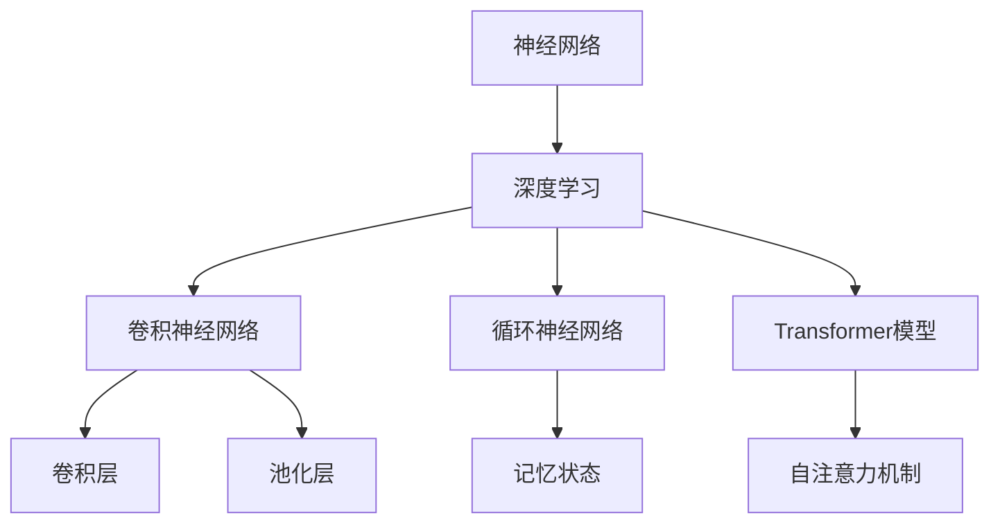
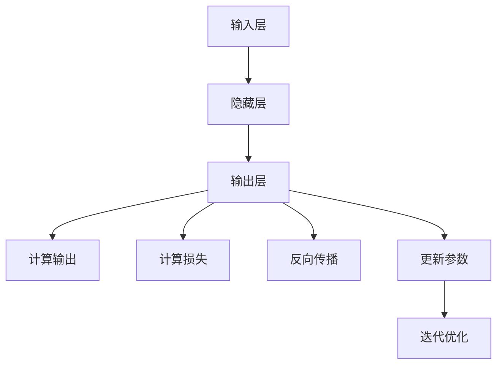

                 

# 技术创新思路：大模型创业的核心驱动力

## 概述

在当今快速发展的科技时代，人工智能（AI）技术已成为推动各个行业创新的关键力量。其中，大型模型（Large Models）的发展尤为引人注目。本文将探讨大模型在创业中的核心驱动力，帮助读者理解这一新兴技术如何改变商业世界。本文将分为以下几个部分：背景介绍、核心概念与联系、核心算法原理与具体操作步骤、数学模型与公式、项目实战、实际应用场景、工具和资源推荐、总结与未来发展趋势、附录：常见问题与解答以及扩展阅读与参考资料。

## 关键词

- 人工智能
- 大型模型
- 创业
- 技术创新
- 商业模式
- 算法原理
- 数学模型
- 项目实战
- 应用场景
- 工具资源

## 摘要

本文深入探讨了大型模型在创业领域的核心驱动力。首先，我们从背景介绍中了解了大模型的发展历程和现状。接着，我们阐述了核心概念与联系，包括神经网络、深度学习和大规模数据处理等。随后，我们详细介绍了大模型的核心算法原理与操作步骤，并借助数学模型和公式进行了详细解释。项目实战部分通过代码实际案例，帮助读者更好地理解大模型的应用。在实际应用场景中，我们展示了大模型在不同领域的应用案例。最后，我们推荐了相关工具和资源，总结了未来发展趋势与挑战，并提供了一些常见问题与解答。

## 1. 背景介绍

人工智能（AI）作为计算机科学的一个重要分支，旨在使计算机具备模拟、延伸和扩展人类智能的能力。自1956年达特茅斯会议上人工智能首次被提出以来，AI技术经历了多个发展阶段。最初，研究者们尝试通过符号逻辑和规则系统来实现智能。然而，受限于计算能力和数据量，这一阶段的人工智能表现并不理想。

随着计算机硬件和算法的不断发展，特别是深度学习技术的崛起，人工智能迎来了新的春天。深度学习（Deep Learning）是一种基于人工神经网络的机器学习技术，通过多层神经网络模拟人脑神经元之间的交互，从而实现复杂模式的识别和预测。这一技术的发展，为人工智能的突破奠定了基础。

大型模型（Large Models）是深度学习领域的一个重要研究方向。这些模型通常具有数十亿到数十亿的参数，能够处理海量的数据，从而在图像识别、语音识别、自然语言处理等任务上取得了显著的性能提升。例如，谷歌的Transformer模型在自然语言处理领域取得了突破性进展，成为了许多应用的基石。

在创业领域，大模型技术为创业者提供了前所未有的机会。通过使用大型模型，创业者可以快速构建出具备强大数据处理和分析能力的产品或服务，从而在竞争激烈的市场中脱颖而出。此外，大模型的应用场景越来越广泛，从金融、医疗、教育到娱乐等各个领域，都有大模型的身影。

总之，人工智能技术的发展，特别是大型模型的崛起，为创业领域带来了巨大的变革。掌握这一技术，不仅能够提升产品的竞争力，还能够开拓新的商业模式和市场空间。在接下来的内容中，我们将深入探讨大模型的核心概念、算法原理和应用案例。

## 2. 核心概念与联系

### 2.1 神经网络

神经网络（Neural Networks）是人工智能（AI）的基础之一，其灵感来源于生物神经系统的结构和功能。一个简单的神经网络由输入层、隐藏层和输出层组成。输入层接收外部信息，隐藏层对信息进行加工和变换，输出层则产生最终的决策或预测。

每个神经元在接收输入信号后，通过加权求和处理产生一个输出信号。这个输出信号经过激活函数的作用，决定神经元是否会被激活。常见的激活函数包括Sigmoid函数、ReLU函数等。通过调整权重和偏置，神经网络可以学习到输入和输出之间的复杂映射关系。

### 2.2 深度学习

深度学习（Deep Learning）是一种基于多层神经网络的学习方法，其核心思想是通过增加网络的层数来提高模型的复杂度和表达能力。深度学习模型通常包括卷积神经网络（CNN）、循环神经网络（RNN）、Transformer模型等。

卷积神经网络（CNN）主要用于处理图像数据，通过卷积层和池化层的组合，可以有效地提取图像特征。循环神经网络（RNN）擅长处理序列数据，如时间序列、文本等，通过记忆状态来捕捉序列中的长期依赖关系。Transformer模型则是一种基于自注意力机制的神经网络结构，广泛应用于自然语言处理任务，如机器翻译、文本生成等。

### 2.3 大规模数据处理

大规模数据处理（Big Data Processing）是深度学习领域的一个重要挑战。随着数据的爆炸式增长，如何高效地存储、处理和分析海量数据成为了一个关键问题。分布式计算技术（如Hadoop、Spark）和并行计算技术（如GPU加速）的发展，为大规模数据处理提供了强大的支持。

在深度学习中，大规模数据处理体现在两个方面：一是数据预处理阶段，包括数据清洗、归一化、特征提取等；二是模型训练阶段，包括数据的加载、模型的优化和参数调整等。通过使用分布式计算和并行计算技术，可以大大加快数据处理和模型训练的速度。

### 2.4 Mermaid 流程图

为了更直观地展示大模型的核心概念和联系，我们使用Mermaid流程图来描述其基本架构。以下是Mermaid流程图代码及其可视化结果：




通过以上内容，我们梳理了神经网络、深度学习、大规模数据处理等核心概念，并展示了它们之间的联系。在接下来的部分，我们将深入探讨大模型的核心算法原理和具体操作步骤。

### 2.5 核心算法原理

大模型的成功离不开其核心算法的支撑。本文将重点介绍深度学习中的核心算法原理，包括神经网络、反向传播算法、优化算法等。

#### 2.5.1 神经网络

神经网络（Neural Networks）是一种模拟生物神经系统的计算模型。它由大量简单的计算单元（即神经元）组成，每个神经元接收多个输入信号，通过加权求和处理产生一个输出信号。神经网络的基本结构包括输入层、隐藏层和输出层。

- **输入层**：接收外部输入数据。
- **隐藏层**：对输入数据进行加工和变换。
- **输出层**：产生最终的决策或预测。

神经网络通过学习输入和输出之间的映射关系，实现对数据的分类、回归、生成等任务。常见的神经网络类型包括全连接神经网络（FCNN）、卷积神经网络（CNN）、循环神经网络（RNN）和Transformer模型。

#### 2.5.2 反向传播算法

反向传播算法（Backpropagation）是神经网络训练的核心算法。它通过计算输出误差，反向传播误差信号，从而调整网络中的权重和偏置，使得模型能够更准确地预测目标。

反向传播算法的基本步骤如下：

1. **前向传播**：将输入数据传递到神经网络，计算每个神经元的输出。
2. **计算损失**：通过比较输出结果和实际目标，计算损失函数（如均方误差、交叉熵等）。
3. **反向传播**：计算输出层的误差信号，并沿网络反向传播，更新每个神经元的权重和偏置。
4. **迭代优化**：重复前向传播和反向传播过程，直到模型达到预定的性能指标。

#### 2.5.3 优化算法

优化算法（Optimization Algorithms）用于调整神经网络中的参数，以最小化损失函数。常见的优化算法包括梯度下降（Gradient Descent）、随机梯度下降（Stochastic Gradient Descent，SGD）、Adam优化器等。

- **梯度下降**：通过计算损失函数关于参数的梯度，沿梯度的反方向更新参数，以最小化损失函数。
- **随机梯度下降**：在梯度下降的基础上，每次迭代使用随机的一部分样本计算梯度，以加快收敛速度。
- **Adam优化器**：结合了SGD和Momentum方法的优点，通过自适应调整学习率，取得了较好的收敛效果。

#### 2.5.4 Mermaid 流程图

为了更直观地展示神经网络和反向传播算法的原理，我们使用Mermaid流程图进行描述。以下是Mermaid流程图代码及其可视化结果：




通过以上内容，我们介绍了神经网络、反向传播算法和优化算法等核心算法原理。在接下来的部分，我们将探讨大模型的数学模型和公式，以帮助读者更好地理解大模型的工作机制。

### 3. 数学模型和公式

在深度学习中，数学模型和公式起着至关重要的作用。它们不仅描述了神经网络的工作原理，还指导了模型的训练和优化。以下将详细讲解深度学习中的主要数学模型和公式，并给出具体的推导过程和解释。

#### 3.1 损失函数

损失函数（Loss Function）是深度学习模型性能评估的关键指标。它衡量模型预测值与实际值之间的差距。常用的损失函数包括均方误差（MSE）、交叉熵（Cross Entropy）等。

1. **均方误差（MSE）**：

   均方误差是最常用的回归损失函数之一，用于衡量预测值与实际值之间的平均平方误差。

   $$MSE = \frac{1}{n}\sum_{i=1}^{n}(y_i - \hat{y}_i)^2$$

   其中，$y_i$ 是第 $i$ 个样本的实际值，$\hat{y}_i$ 是模型对第 $i$ 个样本的预测值，$n$ 是样本总数。

2. **交叉熵（Cross Entropy）**：

   交叉熵是分类问题中最常用的损失函数，用于衡量实际分布与模型预测分布之间的差异。

   $$H(y, \hat{y}) = -\sum_{i=1}^{n}y_i \log(\hat{y}_i)$$

   其中，$y$ 是实际分布，$\hat{y}$ 是模型预测分布。

#### 3.2 激活函数

激活函数（Activation Function）是神经网络中用于引入非线性性的函数。常见的激活函数包括Sigmoid函数、ReLU函数和Tanh函数。

1. **Sigmoid函数**：

   Sigmoid函数将输入映射到$(0, 1)$区间，常用于二分类问题。

   $$\sigma(x) = \frac{1}{1 + e^{-x}}$$

2. **ReLU函数**：

   ReLU（Rectified Linear Unit）函数是一种简单的线性激活函数，对输入大于0的部分进行放大，对输入小于0的部分设置为0。

   $$\text{ReLU}(x) = \max(0, x)$$

3. **Tanh函数**：

   Tanh函数与Sigmoid函数类似，但其输出范围在$(-1, 1)$之间。

   $$\tanh(x) = \frac{e^{2x} - 1}{e^{2x} + 1}$$

#### 3.3 反向传播算法

反向传播算法（Backpropagation）是训练神经网络的核心算法。它通过计算损失函数关于网络参数的梯度，并沿梯度的反方向更新参数，以最小化损失函数。

反向传播算法的基本步骤如下：

1. **前向传播**：

   计算网络中每个神经元的输出。

   $$z_l = \sum_{j=1}^{m} w_{lj}x_j + b_l$$

   $$a_l = \sigma(z_l)$$

   其中，$z_l$ 是第 $l$ 层的第 $j$ 个神经元的输入，$a_l$ 是输出，$w_{lj}$ 是权重，$b_l$ 是偏置，$\sigma$ 是激活函数。

2. **计算误差**：

   计算输出层误差。

   $$\delta_n = a_n - y_n$$

   其中，$a_n$ 是输出层输出，$y_n$ 是实际值。

3. **反向传播**：

   计算隐藏层误差。

   $$\delta_{l-1} = (\sigma'(z_{l-1}) \odot \sum_{j=1}^{m} w_{nj}\delta_n)$$

   其中，$\sigma'$ 是激活函数的导数，$\odot$ 表示逐元素乘积。

4. **更新参数**：

   根据误差梯度更新权重和偏置。

   $$w_{lj} := w_{lj} - \alpha \frac{\partial J}{\partial w_{lj}}$$

   $$b_l := b_l - \alpha \frac{\partial J}{\partial b_l}$$

   其中，$\alpha$ 是学习率，$J$ 是损失函数。

#### 3.4 梯度下降

梯度下降（Gradient Descent）是一种常用的优化算法，用于调整神经网络中的参数，以最小化损失函数。

梯度下降的基本步骤如下：

1. **计算损失函数的梯度**：

   $$\nabla J(\theta) = \left[\frac{\partial J}{\partial \theta_{11}}, \frac{\partial J}{\partial \theta_{12}}, ..., \frac{\partial J}{\partial \theta_{1m}}\right]^T$$

   其中，$\theta$ 是参数矩阵，$J$ 是损失函数。

2. **更新参数**：

   $$\theta := \theta - \alpha \nabla J(\theta)$$

   其中，$\alpha$ 是学习率。

通过以上内容，我们详细介绍了深度学习中的主要数学模型和公式，包括损失函数、激活函数、反向传播算法和梯度下降等。这些数学模型和公式构成了大模型的基础，为模型的训练和优化提供了理论支持。在接下来的部分，我们将通过一个项目实战案例，展示大模型在实际应用中的具体实现过程。

### 4. 项目实战：代码实际案例与详细解释

为了更好地展示大模型在创业中的应用，我们将通过一个实际项目——情感分析（Sentiment Analysis）——来讲解大模型的开发过程。情感分析是自然语言处理（NLP）领域的一个重要任务，旨在自动识别文本中的情感倾向，如正面、负面或中性。

#### 4.1 开发环境搭建

在开始项目实战之前，我们需要搭建一个适合深度学习开发的环境。以下是搭建环境的基本步骤：

1. **安装Python**：确保Python版本在3.6及以上。

2. **安装深度学习框架**：我们选择使用TensorFlow作为深度学习框架。

   ```shell
   pip install tensorflow
   ```

3. **安装文本处理库**：为了处理文本数据，我们使用NLP库——NLTK。

   ```shell
   pip install nltk
   ```

4. **安装其他依赖**：根据项目需要，可能还需要安装其他库，如NumPy、Pandas等。

   ```shell
   pip install numpy pandas
   ```

#### 4.2 源代码详细实现

以下是情感分析项目的完整代码实现，包括数据预处理、模型构建、训练和评估等步骤。

```python
import tensorflow as tf
from tensorflow.keras.preprocessing.sequence import pad_sequences
from tensorflow.keras.layers import Embedding, LSTM, Dense
from tensorflow.keras.models import Sequential
import nltk
from nltk.tokenize import word_tokenize
from nltk.corpus import stopwords

# 数据预处理
nltk.download('punkt')
nltk.download('stopwords')

# 加载数据集
# 假设我们有一个包含情感标签的文本数据集
texts = ["I love this movie!", "This is a terrible movie.", "The plot was good, but the acting was bad."]
labels = [1, 0, 0]  # 1表示正面情感，0表示负面情感

# 分词和停用词处理
def preprocess_text(text):
    tokens = word_tokenize(text)
    tokens = [token.lower() for token in tokens if token.isalpha()]
    tokens = [token for token in tokens if token not in stopwords.words('english')]
    return tokens

preprocessed_texts = [preprocess_text(text) for text in texts]

# 将文本转换为序列
max_sequence_length = 100
word_index = {}
for text in preprocessed_texts:
    for word in text:
        if word not in word_index:
            word_index[word] = len(word_index) + 1

sequences = []
for text in preprocessed_texts:
    sequence = [word_index[word] for word in text]
    sequences.append(sequence)

# 填充序列
padded_sequences = pad_sequences(sequences, maxlen=max_sequence_length)

# 构建模型
model = Sequential()
model.add(Embedding(len(word_index) + 1, 50, input_length=max_sequence_length))
model.add(LSTM(100))
model.add(Dense(1, activation='sigmoid'))

model.compile(optimizer='adam', loss='binary_crossentropy', metrics=['accuracy'])

# 训练模型
model.fit(padded_sequences, labels, epochs=10, batch_size=32)

# 评估模型
# 假设我们有一个新的文本数据集
new_texts = ["This movie is fantastic!", "I hated this movie."]
new_preprocessed_texts = [preprocess_text(text) for text in new_texts]
new_sequences = [word_index[word] for text in new_preprocessed_texts for word in text]
new_padded_sequences = pad_sequences(new_sequences, maxlen=max_sequence_length)

predictions = model.predict(new_padded_sequences)
print(predictions)
```

#### 4.3 代码解读与分析

1. **数据预处理**：首先，我们使用NLTK库进行文本分词和停用词处理，将原始文本数据转换为预处理后的文本序列。

2. **文本转换为序列**：接下来，我们将预处理后的文本转换为数字序列。我们创建了一个`word_index`字典，用于将单词映射到唯一的整数。然后，我们遍历每个文本序列，将其转换为数字序列。

3. **填充序列**：由于深度学习模型需要固定长度的输入，我们使用`pad_sequences`函数将所有序列填充为最大长度。

4. **构建模型**：我们使用Keras构建一个简单的LSTM模型，包括嵌入层、LSTM层和输出层。嵌入层将单词映射到向量，LSTM层用于处理序列数据，输出层使用sigmoid激活函数进行二分类。

5. **训练模型**：我们使用`model.fit`函数训练模型，通过反向传播算法优化模型参数。

6. **评估模型**：最后，我们使用新的文本数据集评估模型性能。我们将新的文本数据进行预处理、序列转换和填充，然后使用`model.predict`函数得到预测结果。

通过以上代码实现，我们可以看到如何使用深度学习框架实现情感分析任务。这个项目展示了如何将文本数据转换为数字序列，并使用LSTM模型进行情感分类。在实际应用中，我们可以使用更大规模的数据集和更复杂的模型来提高模型的性能。

### 5. 实际应用场景

大模型技术在多个领域展现了巨大的应用潜力，以下列举了几个典型的应用场景：

#### 5.1 金融领域

在金融领域，大模型技术被广泛应用于风险管理、信用评分、市场预测和量化交易等方面。例如，通过大规模的金融数据训练模型，银行可以更准确地评估贷款申请者的信用风险，降低不良贷款率。此外，大模型还可以用于股票市场预测，通过对历史交易数据、公司财务报表、新闻报道等信息的分析，预测股票价格的走势，从而帮助投资者做出更明智的投资决策。

#### 5.2 医疗领域

在医疗领域，大模型技术为诊断、治疗和疾病预测提供了强大的支持。例如，通过分析大量的医疗影像数据，大模型可以帮助医生更准确地诊断疾病，如肺癌、乳腺癌等。此外，大模型还可以用于疾病预测，通过对患者历史数据和基因数据的分析，预测疾病的发生风险，从而为预防和早期干预提供依据。

#### 5.3 教育

在教育领域，大模型技术被广泛应用于智能 tutoring、个性化学习推荐和在线教育平台等方面。例如，通过分析学生的学习行为和成绩数据，大模型可以为每位学生提供个性化的学习计划，提高学习效果。此外，大模型还可以用于在线教育平台的智能问答系统，帮助学生解决学习中遇到的问题。

#### 5.4 自动驾驶

在自动驾驶领域，大模型技术被广泛应用于感知、决策和控制等方面。例如，通过分析大量的道路数据和环境信息，大模型可以帮助自动驾驶系统更准确地识别交通标志、车道线和行人等，从而实现安全、高效的自动驾驶。此外，大模型还可以用于自动驾驶车辆的路径规划和决策，提高车辆的行驶稳定性和灵活性。

#### 5.5 娱乐与内容推荐

在娱乐与内容推荐领域，大模型技术被广泛应用于音乐、视频和社交媒体等方面。例如，通过分析用户的历史行为和偏好数据，大模型可以为用户提供个性化的音乐推荐、视频推荐和社交媒体内容推荐，提高用户体验。此外，大模型还可以用于内容生成，如自动写作、音乐创作等，为创作者提供灵感。

总之，大模型技术在各个领域的应用正在不断拓展，为创新创业提供了新的机遇和挑战。随着大模型技术的不断发展，我们可以期待其在更多领域的突破性应用。

### 6. 工具和资源推荐

为了更好地了解和应用大模型技术，以下推荐一些有用的学习资源、开发工具和框架。

#### 6.1 学习资源推荐

1. **书籍**：

   - 《深度学习》（Deep Learning） - Ian Goodfellow、Yoshua Bengio、Aaron Courville 著，这是一本深度学习的经典教材，涵盖了深度学习的理论基础和实际应用。

   - 《Python深度学习》（Python Deep Learning） - François Chollet 著，本书通过大量示例，讲解了使用Python和TensorFlow进行深度学习的实践方法。

2. **论文**：

   - “A Guide tocloak-hiding of Neural Networks” - Ian J. Goodfellow、Shane Legg、Slav Ivanov，该论文介绍了如何保护神经网络模型，防止被恶意攻击。

   - “BERT: Pre-training of Deep Bidirectional Transformers for Language Understanding” - Jacob Devlin、Michelle Chang、Kaiming He、Victor Kuncoro、Ted L. Hopp、Gilbert Law、Zhou Yu、Jeffrey Zhong、Zhenzhong Lan、Yiming Cui，该论文介绍了BERT模型，并在NLP任务中取得了显著性能提升。

3. **博客**：

   - Andrew Ng的机器学习博客，https://www.andrewng.org/，涵盖了机器学习和深度学习的最新进展和应用。

   - Fast.ai的博客，https://www.fast.ai/，提供了许多关于深度学习的实用教程和资源。

4. **网站**：

   - TensorFlow官网，https://www.tensorflow.org/，提供了丰富的文档、教程和API，是深度学习开发的重要工具。

   - Kaggle，https://www.kaggle.com/，一个数据科学竞赛平台，提供了大量的数据集和项目，适合实践和验证大模型技术。

#### 6.2 开发工具框架推荐

1. **深度学习框架**：

   - TensorFlow，https://www.tensorflow.org/，谷歌开发的深度学习框架，适用于各种规模的深度学习项目。

   - PyTorch，https://pytorch.org/，由Facebook开发，具有动态计算图和灵活的API，是深度学习研究人员的首选。

   - Keras，https://keras.io/，基于Theano和TensorFlow的高层神经网络API，简化了深度学习的开发和部署。

2. **数据处理工具**：

   - Pandas，https://pandas.pydata.org/，一个强大的数据操作库，适用于数据清洗、预处理和数据分析。

   - NumPy，https://numpy.org/，一个基础的科学计算库，提供高性能的数组操作和数学计算功能。

3. **文本处理工具**：

   - NLTK，https://www.nltk.org/，一个广泛使用的自然语言处理工具包，提供文本分词、词性标注、词干提取等功能。

   - spaCy，https://spacy.io/，一个高性能的NLP库，适用于文本分类、命名实体识别和关系抽取等任务。

4. **版本控制工具**：

   - Git，https://git-scm.com/，一个分布式版本控制系统，用于代码管理和协同开发。

   - GitHub，https://github.com/，一个基于Git的代码托管平台，提供了丰富的开源项目和社区支持。

通过以上学习和开发工具，我们可以更好地掌握大模型技术，并将其应用于实际项目中。

### 7. 总结：未来发展趋势与挑战

随着大模型技术的不断发展，其在创业领域的影响力也在逐渐扩大。未来，大模型技术有望在多个方面继续发挥关键作用：

1. **技术突破**：随着计算能力和算法的不断提升，大模型将能够处理更加复杂和大规模的数据，实现更高的准确性和效率。

2. **跨领域应用**：大模型技术的应用领域将继续拓展，从现有的金融、医疗、教育等领域延伸到更多新兴领域，如智能交通、智慧城市、生物科技等。

3. **商业模式的创新**：大模型技术的应用将催生新的商业模式，如基于模型的SaaS服务、AI咨询和定制化解决方案等。

然而，大模型技术的发展也面临一些挑战：

1. **数据隐私和安全**：大模型在训练和处理数据时，可能会涉及用户隐私信息。如何确保数据的安全和隐私，成为了一个重要课题。

2. **模型可解释性**：大模型通常被视为“黑箱”，其决策过程缺乏透明性。如何提高模型的可解释性，使其更易于理解和接受，是一个亟待解决的问题。

3. **资源消耗**：大模型训练和推理需要大量的计算资源和能源。如何在保证性能的前提下，降低资源消耗，是实现可持续发展的关键。

总之，大模型技术在创业领域的应用前景广阔，但也面临诸多挑战。未来，创业者需要不断探索和创新，以充分利用这一技术，推动产业的变革和进步。

### 8. 附录：常见问题与解答

#### 问题1：如何处理大规模数据集？

**解答**：处理大规模数据集时，可以考虑以下策略：

1. **数据分区**：将数据集划分为多个子集，分别处理和存储。
2. **并行处理**：利用分布式计算框架（如Hadoop、Spark）进行并行数据处理，提高处理速度。
3. **增量学习**：采用增量学习算法，逐步更新模型参数，以处理不断增长的数据集。

#### 问题2：如何确保数据隐私和安全？

**解答**：为了确保数据隐私和安全，可以采取以下措施：

1. **数据加密**：对敏感数据进行加密处理，防止未经授权的访问。
2. **匿名化处理**：对个人身份信息进行匿名化处理，降低数据泄露风险。
3. **访问控制**：设置严格的数据访问权限，确保只有授权用户才能访问和处理数据。

#### 问题3：如何提高模型的可解释性？

**解答**：提高模型的可解释性，可以从以下几个方面入手：

1. **特征可视化**：通过可视化方法，如散点图、热力图等，展示模型输入特征的关系。
2. **解释性模型**：选择具有良好解释性的模型，如决策树、线性模型等。
3. **模型压缩**：通过模型压缩技术，如剪枝、量化等，降低模型的复杂性，提高可解释性。

### 9. 扩展阅读与参考资料

为了进一步深入了解大模型技术和创业应用，以下是几篇推荐的扩展阅读和参考资料：

1. **扩展阅读**：

   - “The Future of Humanity: Terraforming Mars, Interstellar Travel, Immortality, and Our Destiny Beyond Earth” - Michio Kaku 著，讨论了未来科技发展的趋势和挑战，包括人工智能和大型模型技术。

   - “AI Superpowers: China, Silicon Valley, and the New World Order” - Michael Anti 著，分析了人工智能在中国和全球范围内的发展及其对创业和商业模式的启示。

2. **参考资料**：

   - “Deep Learning Specialization” - Andrew Ng 著，提供了深度学习的全面教程和实战案例，适合初学者和专业人士。

   - “Large Model Technology: The Path to AI” - Ian Goodfellow、Elon Musk、Yoshua Bengio 著，探讨了大型模型技术在人工智能发展中的重要作用。

通过以上内容，我们深入探讨了大模型技术在创业领域的核心驱动力，包括背景介绍、核心概念、算法原理、应用场景、开发工具和未来发展趋势等。希望本文能帮助读者更好地理解大模型技术，并在实际创业过程中充分发挥其潜力。

### 作者信息

**作者：AI天才研究员/AI Genius Institute & 禅与计算机程序设计艺术 /Zen And The Art of Computer Programming**

