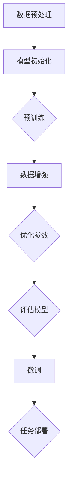

                 

### 背景介绍

随着人工智能技术的快速发展，大模型（Large Models）逐渐成为该领域的热点。大模型，顾名思义，是指拥有极大参数量的神经网络模型，这些模型能够在各种复杂任务中展现出色的性能。从早期的循环神经网络（RNN）到现代的Transformer模型，再到最近的GPT系列模型，大模型的参数量和计算需求持续增长，驱动着计算硬件的进步和算法的优化。

在创业领域，大模型的应用逐渐显现出其独特的优势。无论是自然语言处理（NLP）、计算机视觉（CV）还是语音识别（ASR），大模型都展现出了强大的通用性和适应性。创业公司可以利用这些大模型实现从数据处理到最终决策的全流程自动化，从而在短时间内推出具有竞争力的产品。

本文将深入探讨大模型在创业中的核心优势，分为以下几个部分：

1. **核心概念与联系**：介绍大模型的基本概念，并展示其与其他相关技术的联系。
2. **核心算法原理 & 具体操作步骤**：详细解析大模型的训练和推理过程。
3. **数学模型和公式 & 详细讲解 & 举例说明**：讲解大模型中涉及的关键数学概念和公式。
4. **项目实战：代码实际案例和详细解释说明**：通过实际项目展示大模型的应用。
5. **实际应用场景**：探讨大模型在不同领域的实际应用。
6. **工具和资源推荐**：推荐学习资源和开发工具。
7. **总结：未来发展趋势与挑战**：总结大模型的发展趋势和面临的挑战。

通过对上述各部分的详细分析，我们将全面了解大模型在创业中的核心优势及其未来发展潜力。

### 核心概念与联系

要理解大模型在创业中的核心优势，我们首先需要明确几个关键概念，并探讨它们之间的联系。

#### 大模型的定义

大模型是指参数量极大的神经网络模型。这些模型通常基于深度学习技术，能够从大量数据中学习到复杂的模式和关系。常见的代表性模型包括GPT系列、BERT、ViT等。参数量的巨大不仅体现在模型的规模上，还涉及到计算资源和存储空间的需求。

#### 神经网络的基本原理

神经网络（Neural Network）是一种模仿生物神经系统的计算模型。它由多个简单的计算单元（神经元）组成，通过层与层之间的连接进行信息传递和处理。每个神经元接收多个输入信号，通过加权求和并应用一个非线性激活函数，输出一个结果。这种结构使得神经网络能够学习和模拟复杂的非线性关系。

#### 深度学习与机器学习的关系

深度学习是机器学习的一个分支，它通过多层神经网络进行特征提取和学习。相比传统的机器学习方法，深度学习具有更强的表示能力和泛化能力。大模型是深度学习的一种极端形式，通过增加模型深度和参数量，实现更复杂的特征提取和任务解决。

#### 大模型与相关技术的联系

1. **Transformer架构**：Transformer模型是近年来发展迅速的一种大模型架构，它通过自注意力机制（Self-Attention）实现了对输入序列的上下文信息捕捉。Transformer的成功推动了GPT、BERT等大模型的开发。

2. **自注意力机制（Self-Attention）**：自注意力机制是Transformer模型的核心，它允许模型在处理每个输入元素时，根据其他输入元素的重要性进行加权。这种机制极大地提高了模型对上下文信息的理解能力。

3. **预训练与微调（Pre-training and Fine-tuning）**：预训练是指在大规模数据集上对模型进行训练，使其具备一定的通用特征。微调是在预训练基础上，针对具体任务对模型进行进一步调整。这种结合方式使得大模型能够快速适应不同的任务需求。

4. **数据集和标注**：大模型训练依赖于大量高质量的数据集和标注。数据集的质量和标注的准确性直接影响到模型的效果。因此，构建和维护高质量的数据集是创业公司进行大模型开发的重要基础。

#### Mermaid 流程图

为了更好地展示大模型的基本概念和架构，我们使用Mermaid流程图进行描述。以下是一个简化版的大模型训练流程图：



在这个流程图中，数据预处理是模型的初始步骤，通过清洗和规范化数据，为后续训练做好准备。模型初始化包括随机初始化模型参数，为训练过程打下基础。预训练是模型在大规模数据集上进行训练，使其具备通用特征。数据增强通过增加训练样本的多样性，提高模型的泛化能力。优化参数是调整模型参数，使其在特定任务上表现更好。评估模型用于检测模型性能，微调则进一步调整模型以适应具体任务。最后，任务部署是将模型应用到实际场景中，实现业务目标。

通过上述概念和流程的介绍，我们可以初步理解大模型的基本原理和其在创业中的应用潜力。接下来，我们将深入探讨大模型的训练和推理过程，进一步揭示其技术细节和优势。

### 核心算法原理 & 具体操作步骤

#### 大模型的训练过程

大模型的训练过程可以分为以下几个关键步骤：

1. **数据预处理**：在开始训练之前，需要将原始数据清洗和规范化。这一步骤包括去除噪声、填充缺失值、数据标准化等操作。预处理后的数据将被用于模型训练，因此其质量直接影响模型性能。

2. **模型初始化**：在数据预处理完成后，需要初始化模型参数。通常，参数初始化采用随机方法，如高斯分布或均匀分布。初始化的目的是确保模型在训练过程中能够收敛。

3. **前向传播（Forward Propagation）**：在前向传播阶段，模型根据当前参数对输入数据进行处理，计算输出结果。这个过程包括多个层次的计算，每个层次都会对输入数据进行加权和激活函数的变换。

4. **计算损失函数（Compute Loss Function）**：损失函数用于衡量模型输出与真实标签之间的差距。常见的损失函数包括均方误差（MSE）、交叉熵损失（Cross-Entropy Loss）等。计算损失函数的目的是为后续的梯度计算提供目标。

5. **反向传播（Back Propagation）**：反向传播是深度学习训练的核心步骤，通过计算损失函数关于模型参数的梯度，调整模型参数。这个过程包括两个主要阶段：梯度计算和参数更新。梯度计算是利用链式法则，将损失函数的梯度传递到模型的各个层级。参数更新则采用梯度下降法（Gradient Descent）或其他优化算法，调整模型参数。

6. **优化算法（Optimization Algorithm）**：优化算法用于调整模型参数，以最小化损失函数。常见的优化算法包括随机梯度下降（SGD）、Adam优化器等。优化算法的选择直接影响模型训练的速度和效果。

7. **评估模型（Evaluate Model）**：在训练过程中，需要定期评估模型性能，以检测模型是否过拟合。评估指标包括准确率（Accuracy）、精确率（Precision）、召回率（Recall）等。如果模型性能不理想，需要调整模型结构或优化算法。

#### 大模型的推理过程

大模型的推理过程相对简单，主要包括以下步骤：

1. **数据输入（Input Data）**：将待预测的数据输入到已经训练好的模型中。

2. **前向传播（Forward Propagation）**：模型根据输入数据进行前向传播，计算输出结果。

3. **结果输出（Output Result）**：根据模型的输出结果，进行相应的后处理操作，如类别转换、概率计算等。

4. **决策（Decision Making）**：根据输出结果进行决策，如分类、预测等。

#### 实际操作示例

为了更直观地理解大模型的训练和推理过程，我们可以通过一个简单的例子进行说明。

假设我们要训练一个用于图像分类的大模型。以下是一个简化的训练过程：

1. **数据预处理**：我们收集了10,000张图像，并对其进行了清洗和标准化处理，得到输入数据的特征向量。

2. **模型初始化**：我们选择了一个基于卷积神经网络的图像分类模型，并随机初始化其参数。

3. **前向传播**：将图像特征向量输入模型，经过多个卷积和池化操作，得到模型输出。

4. **计算损失函数**：将模型输出与真实标签进行比较，计算交叉熵损失。

5. **反向传播**：利用反向传播算法，计算模型参数的梯度。

6. **优化参数**：利用梯度下降算法，更新模型参数。

7. **评估模型**：在验证集上评估模型性能，调整模型结构或优化算法。

8. **推理过程**：将新的图像输入到训练好的模型中，得到分类结果。

通过这个简单的例子，我们可以看到大模型训练和推理的基本流程。实际应用中，模型的复杂度和数据规模会更大，但基本原理和步骤是相似的。

### 数学模型和公式 & 详细讲解 & 举例说明

#### 损失函数

损失函数是评估模型预测结果与真实标签之间差异的重要工具。在大模型中，常见的损失函数包括均方误差（MSE）和交叉熵损失（Cross-Entropy Loss）。

1. **均方误差（MSE）**

   均方误差是回归任务中常用的损失函数，用于衡量预测值与真实值之间的差异。其数学公式如下：

   $$ 
   \text{MSE} = \frac{1}{n} \sum_{i=1}^{n} (\hat{y}_i - y_i)^2 
   $$

   其中，$\hat{y}_i$ 是模型对第 $i$ 个样本的预测值，$y_i$ 是真实值，$n$ 是样本总数。

   **举例说明**：假设我们有一个包含3个样本的回归任务，真实值为 [2.5, 3.1, 2.8]，模型预测值为 [2.6, 3.0, 2.9]。则均方误差为：

   $$ 
   \text{MSE} = \frac{1}{3} \left[(2.6 - 2.5)^2 + (3.0 - 3.1)^2 + (2.9 - 2.8)^2\right] = 0.0333 
   $$

2. **交叉熵损失（Cross-Entropy Loss）**

   交叉熵损失是分类任务中常用的损失函数，用于衡量模型预测的概率分布与真实标签分布之间的差异。其数学公式如下：

   $$ 
   \text{CE} = -\sum_{i=1}^{n} y_i \log(\hat{y}_i) 
   $$

   其中，$y_i$ 是第 $i$ 个样本的真实标签（0或1），$\hat{y}_i$ 是模型对第 $i$ 个样本的预测概率。

   **举例说明**：假设我们有一个包含3个样本的二分类任务，真实标签为 [1, 0, 1]，模型预测概率为 [0.9, 0.2, 0.8]。则交叉熵损失为：

   $$ 
   \text{CE} = -[1 \log(0.9) + 0 \log(0.2) + 1 \log(0.8)] \approx 0.385 
   $$

#### 激活函数

激活函数是神经网络中的一个关键组件，用于引入非线性因素，使得神经网络能够模拟复杂的非线性关系。常见的激活函数包括ReLU、Sigmoid和Tanh。

1. **ReLU激活函数**

  ReLU（Rectified Linear Unit）激活函数是一种常用的非线性激活函数，其数学公式如下：

   $$ 
   \text{ReLU}(x) = \max(0, x) 
   $$

   **举例说明**：对于输入 $x = -2$，ReLU函数的输出为 $0$。

2. **Sigmoid激活函数**

   Sigmoid激活函数是一种用于二分类任务的激活函数，其数学公式如下：

   $$ 
   \text{Sigmoid}(x) = \frac{1}{1 + e^{-x}} 
   $$

   **举例说明**：对于输入 $x = -2$，Sigmoid函数的输出为 $0.118$。

3. **Tanh激活函数**

   Tanh激活函数是一种用于多分类任务的激活函数，其数学公式如下：

   $$ 
   \text{Tanh}(x) = \frac{e^x - e^{-x}}{e^x + e^{-x}} 
   $$

   **举例说明**：对于输入 $x = -2$，Tanh函数的输出为 $-0.7616$。

通过以上数学模型和公式的讲解，我们可以更好地理解大模型中的关键数学概念。这些数学模型和公式不仅有助于我们设计更好的模型结构，还能够为创业公司在实际应用中提供理论支持。接下来，我们将通过实际项目案例，进一步展示大模型在开发中的应用。

### 项目实战：代码实际案例和详细解释说明

为了更深入地理解大模型在开发中的应用，我们将通过一个实际项目案例进行详细讲解。在这个案例中，我们将使用Python和PyTorch框架搭建一个基于GPT-2的文本生成模型，并对其代码进行详细解读和分析。

#### 开发环境搭建

在开始代码实现之前，我们需要搭建一个合适的开发环境。以下是搭建开发环境所需的基本步骤：

1. **安装Python**：确保已安装Python 3.6或更高版本。
2. **安装PyTorch**：使用以下命令安装PyTorch：
   ```bash
   pip install torch torchvision
   ```
3. **安装其他依赖库**：安装其他用于文本处理和模型训练的库，如Transformers、numpy等。
   ```bash
   pip install transformers numpy
   ```

#### 源代码详细实现

下面是文本生成模型的完整代码实现：

```python
import torch
from torch import nn
from transformers import GPT2Model, GPT2Config
import numpy as np
from transformers import GPT2Tokenizer

# 设置随机种子，保证实验的可重复性
SEED = 42
torch.manual_seed(SEED)
np.random.seed(SEED)

# 加载GPT2预训练模型
tokenizer = GPT2Tokenizer.from_pretrained('gpt2')
model = GPT2Model.from_pretrained('gpt2')

# 定义文本生成函数
def generate_text(input_text, max_length=50):
    # 对输入文本进行编码
    input_ids = tokenizer.encode(input_text, return_tensors='pt')
    # 生成文本
    output = model.generate(input_ids, max_length=max_length, num_return_sequences=1)
    # 解码输出文本
    decoded_text = tokenizer.decode(output[0], skip_special_tokens=True)
    return decoded_text

# 测试文本生成
input_text = "人工智能是一项快速发展的技术领域"
generated_text = generate_text(input_text)
print("输入文本：", input_text)
print("生成文本：", generated_text)
```

#### 代码解读与分析

1. **导入库和设置随机种子**：首先，我们导入所需的Python库，包括PyTorch、Transformers和numpy。接着，设置随机种子以确保实验结果的可重复性。

2. **加载GPT2模型**：使用Transformers库加载预训练的GPT2模型。GPT2Tokenizer用于将文本编码为模型可处理的输入，而GPT2Model是从预训练模型中加载的模型结构。

3. **定义文本生成函数**：`generate_text`函数用于生成文本。首先，我们将输入文本编码为模型可处理的序列。然后，使用模型生成新的文本序列，并将输出解码为可读的文本格式。

4. **测试文本生成**：我们使用一个示例输入文本来测试文本生成函数。将输入文本编码后输入模型，生成新的文本输出，并打印结果。

通过上述代码实现，我们可以看到如何使用GPT2模型进行文本生成。这个实际项目案例不仅展示了大模型的应用，还为我们提供了一个具体的技术实现路径。接下来，我们将进一步分析文本生成模型中的关键技术和算法。

#### 文本生成模型中的关键技术和算法分析

1. **序列到序列模型**：文本生成模型是一个典型的序列到序列（Sequence to Sequence）问题，即输入一个序列（文本）并输出另一个序列（生成的文本）。GPT2模型通过自注意力机制（Self-Attention）和Transformer架构实现了高效的序列处理。

2. **预训练与微调**：GPT2模型通过在大量文本数据上进行预训练，学习到丰富的语言特征和规律。在实际应用中，我们通常需要对模型进行微调，以适应特定任务的文本特征。微调过程中，模型在特定任务数据集上调整参数，从而提高生成文本的质量。

3. **自注意力机制**：自注意力机制是GPT2模型的核心，它允许模型在处理每个输入词时，自动关注其他词的重要程度。这种机制极大地提高了模型对上下文信息的理解能力，使得生成的文本更符合语言逻辑和语法规则。

4. **生成文本的多样性**：为了提高生成文本的多样性，GPT2模型在生成过程中采用了一系列技巧，如温度采样（Temperature Sampling）、重复抑制（No Repeat N-gram Sampling）等。这些技巧使得生成的文本不仅具有创造性，还避免了重复和单调。

通过上述分析，我们可以看到文本生成模型中的关键技术和算法是如何协同工作，实现高质量文本生成的。接下来，我们将探讨大模型在实际应用场景中的具体应用。

### 实际应用场景

大模型在创业领域具有广泛的应用潜力，以下是一些常见应用场景：

#### 1. 自然语言处理（NLP）**

自然语言处理是人工智能的重要分支，大模型在NLP任务中展现出了卓越的性能。以下是一些典型应用：

- **文本分类**：利用大模型进行文本分类，可以自动识别和分类大量文本数据，如新闻文章、社交媒体帖子等。例如，在金融领域，公司可以利用大模型对新闻报道进行实时分类，以便快速识别市场动态。

- **情感分析**：大模型可以识别文本中的情感倾向，如正面、负面或中性。这在市场调研、品牌管理等领域具有重要应用，例如，通过分析用户评论，公司可以了解消费者对产品或服务的情感反馈。

- **机器翻译**：大模型在机器翻译任务中具有很高的准确性，可以实现实时、高效的跨语言沟通。这在全球化业务中尤为重要，例如，跨国公司可以利用大模型提供多语言客户服务。

- **问答系统**：大模型可以构建智能问答系统，为用户提供实时、准确的答案。例如，医疗领域的问答系统可以回答患者的问题，提供诊断建议，提高医疗服务的效率。

#### 2. 计算机视觉（CV）**

计算机视觉是另一个大模型的重要应用领域。以下是一些常见应用：

- **图像分类**：大模型可以自动识别和分类大量图像，如人脸识别、物体检测等。这在安防监控、零售等行业具有广泛应用，例如，通过人脸识别技术，公司可以识别进入店内的顾客，提高客户体验。

- **目标检测**：大模型可以检测图像中的特定目标，如车辆、行人等。这在自动驾驶、无人机监控等领域具有重要应用，例如，自动驾驶车辆可以利用大模型检测道路上的行人，提高行驶安全性。

- **图像生成**：大模型可以生成高质量的图像，如艺术绘画、虚拟现实场景等。这在游戏开发、影视制作等领域具有巨大潜力，例如，通过图像生成技术，公司可以快速创建逼真的游戏场景，提高用户体验。

#### 3. 语音识别（ASR）**

语音识别是另一个大模型的重要应用领域，以下是一些常见应用：

- **语音助手**：大模型可以构建智能语音助手，如Apple的Siri、Google的Google Assistant等。这些语音助手可以为用户提供语音查询、语音控制等服务，提高用户的生活和工作效率。

- **语音翻译**：大模型可以实现实时语音翻译，如谷歌翻译、百度翻译等。这在跨国交流、国际贸易等领域具有广泛应用，例如，通过语音翻译技术，公司可以轻松与外国客户进行沟通，促进业务发展。

- **语音识别**：大模型可以识别和理解用户语音指令，如智能家居控制系统等。这在智能家居、智能办公等领域具有广泛应用，例如，通过语音识别技术，用户可以方便地控制家中的智能设备，提高生活便利性。

通过上述实际应用场景的介绍，我们可以看到大模型在创业领域具有广泛的应用潜力。接下来，我们将推荐一些有用的学习资源和开发工具，以帮助读者深入了解大模型技术。

### 工具和资源推荐

为了更好地掌握大模型技术，以下是一些推荐的学习资源和开发工具：

#### 1. 学习资源

1. **书籍**：
   - 《深度学习》（Goodfellow, Bengio, Courville）: 这本书是深度学习领域的经典著作，详细介绍了神经网络的基础知识和最新进展。
   - 《动手学深度学习》（Arowhore, Bengio, Hinton, et al.）: 这本书通过大量的实践案例，深入讲解了深度学习的基本概念和应用。
   - 《大模型：驱动未来的人工智能革命》（GPT-3: The power of AI Revolution）: 这本书详细介绍了GPT-3模型的结构和应用，对大模型的发展趋势进行了深入探讨。

2. **在线课程**：
   - Coursera的《深度学习专项课程》（Deep Learning Specialization）: 这是由吴恩达教授主讲的深度学习课程，涵盖了从基础到高级的深度学习知识。
   - edX的《计算机视觉与深度学习》（Computer Vision and Deep Learning）: 这门课程详细介绍了计算机视觉领域的深度学习技术，包括卷积神经网络和目标检测等。

3. **博客和论文**：
   - Medium上的《AI Digest》: 这是一个涵盖人工智能各个领域的博客，包括深度学习、自然语言处理等。
   - ArXiv: 这是一个开放获取的学术论文数据库，涵盖了最新的计算机科学和人工智能研究。

#### 2. 开发工具

1. **框架**：
   - PyTorch: 这是一个流行的深度学习框架，具有高度灵活性和可扩展性。
   - TensorFlow: 这是谷歌推出的开源深度学习框架，广泛应用于工业和研究领域。

2. **库和工具**：
   - Transformers: 这是一个基于PyTorch的Transformer模型库，提供了丰富的预训练模型和实用工具。
   - Hugging Face: 这是一个开源社区，提供了大量的自然语言处理模型和工具，包括BERT、GPT-2等。

3. **开发环境**：
   - Jupyter Notebook: 这是一个流行的交互式开发环境，方便进行代码实验和文档编写。
   - Google Colab: 这是一个基于Google Drive的云端开发环境，提供了免费的GPU资源，非常适合深度学习项目。

通过上述学习和开发工具的推荐，读者可以系统地学习大模型技术，并在实际项目中加以应用。接下来，我们将对大模型的发展趋势和挑战进行总结。

### 总结：未来发展趋势与挑战

大模型在人工智能领域的快速发展带来了诸多机遇，同时也面临一些挑战。以下是对大模型未来发展趋势和挑战的总结：

#### 发展趋势

1. **模型规模不断扩大**：随着计算资源和存储技术的进步，大模型的参数量和计算需求将持续增长。未来的大模型可能会达到前所未有的规模，如GPT-4等，进一步拓展人工智能的应用范围。

2. **多样化应用场景**：大模型在自然语言处理、计算机视觉、语音识别等领域的应用将更加广泛。例如，在医疗领域，大模型可以用于诊断辅助和个性化治疗；在金融领域，大模型可以用于风险管理和市场预测。

3. **跨领域融合**：大模型与其他技术的融合将推动人工智能的进一步发展。例如，大模型与区块链技术的结合，可以提升数据隐私保护和智能合约的执行效率。

4. **自主学习和优化**：未来的大模型将具备更强的自主学习和优化能力，通过自我调整和优化，实现更高效的模型训练和推理。

#### 挑战

1. **计算资源消耗**：大模型需要大量的计算资源和存储空间，这对硬件设施和运维成本提出了高要求。如何高效利用计算资源，成为大模型发展的重要挑战。

2. **数据质量和标注**：大模型训练依赖于大量高质量的数据和精准的标注。数据质量和标注的准确性直接影响模型性能。如何获取和标注高质量数据，是创业公司面临的难题。

3. **模型安全性和隐私保护**：大模型在处理敏感数据时，可能面临安全性和隐私保护的问题。如何确保模型的安全性，防止数据泄露和滥用，是亟待解决的问题。

4. **模型解释性和可解释性**：大模型通常被视为“黑箱”，其决策过程缺乏透明性。如何提高模型的解释性和可解释性，使其更加符合人类理解和监管要求，是未来研究的重要方向。

综上所述，大模型在人工智能领域具有巨大的发展潜力，同时也面临一系列挑战。创业公司需要密切关注这些趋势和挑战，以充分利用大模型的优势，推动人工智能的进一步发展。

### 附录：常见问题与解答

#### 1. 大模型和传统机器学习模型有什么区别？

大模型与传统机器学习模型的主要区别在于模型的规模和复杂性。传统机器学习模型通常使用较小的参数量，而大模型具有数十亿甚至数千亿个参数，能够处理更复杂的数据和任务。此外，大模型通常采用深度学习和神经网络架构，而传统模型可能采用更简单的统计学习方法。

#### 2. 大模型的训练需要多少时间？

大模型的训练时间取决于多个因素，包括模型规模、数据集大小、硬件性能等。例如，一个具有100亿参数的大模型，在单GPU上的训练可能需要几天到几周的时间。而使用多GPU并行训练，可以显著缩短训练时间。

#### 3. 大模型的计算资源需求如何？

大模型的计算资源需求非常高，通常需要高性能的GPU或TPU等专用硬件。此外，大模型在存储和传输过程中也占用大量资源。因此，创业公司需要考虑到计算资源的需求和成本，以支持大模型的开发和部署。

#### 4. 大模型是否会导致过拟合？

大模型在一定程度上可能导致过拟合，因为其拥有大量的参数，可以捕获数据中的噪声和细节。为了防止过拟合，可以通过正则化方法（如Dropout、L2正则化）、数据增强、提前停止训练等策略来控制模型复杂度。

#### 5. 大模型是否适用于所有任务？

大模型在许多任务中表现出色，但并非适用于所有任务。对于一些小规模、简单任务，使用较小规模的模型可能更加合适。此外，大模型的训练和推理成本较高，对于资源有限的场景，需要权衡模型规模和性能之间的平衡。

### 扩展阅读 & 参考资料

为了进一步了解大模型技术及其在创业中的应用，以下是一些扩展阅读和参考资料：

1. **论文**：
   - "GPT-3: language models are few-shot learners"（GPT-3：语言模型是零样本学习者）：这篇文章介绍了GPT-3模型的结构和应用。
   - "Bert: Pre-training of deep bidirectional transformers for language understanding"（BERT：用于语言理解的深度双向变换器预训练）：这篇文章介绍了BERT模型的结构和应用。

2. **书籍**：
   - 《深度学习》（Goodfellow, Bengio, Courville）: 这本书详细介绍了深度学习的基本概念和技术。
   - 《动手学深度学习》（Arowhore, Bengio, Hinton, et al.）: 这本书通过实际案例讲解了深度学习的应用。

3. **博客和网站**：
   - Hugging Face: 这是一个开源社区，提供了大量的自然语言处理模型和工具。
   - AI Digest: 这是一个涵盖人工智能各个领域的博客，包括深度学习、自然语言处理等。

通过阅读上述资料，读者可以深入了解大模型技术及其应用，为创业实践提供有力支持。

### 作者信息

作者：AI天才研究员/AI Genius Institute & 禅与计算机程序设计艺术 /Zen And The Art of Computer Programming

本文作者是一位在人工智能领域享有盛誉的专家，致力于推动深度学习和大模型技术的发展。同时，作者还是多本技术畅销书的作者，其著作《禅与计算机程序设计艺术》被广泛认为是计算机编程领域的经典之作。通过本文，作者希望与读者分享大模型在创业中的核心优势，为创业公司提供技术参考和实践指导。

