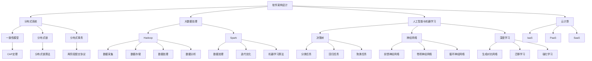

                 

## 背景介绍

技术合伙人是现代创业公司中不可或缺的角色。随着信息技术和互联网的飞速发展，创业领域越来越依赖于技术优势，技术合伙人作为公司的技术灵魂和领军人物，其重要性愈发凸显。技术合伙人不仅需要拥有深厚的专业技术和丰富的项目经验，还要具备领导团队、推动创新、解决复杂问题的能力。

本文旨在深入探讨技术合伙人在创业公司中的角色、核心能力和面临的挑战。我们将从以下几个方面展开讨论：

1. **技术合伙人的角色定位**：探讨技术合伙人在公司中的职责和作用。
2. **核心概念与联系**：介绍技术合伙人所需掌握的核心概念和技术架构，并通过Mermaid流程图展示。
3. **核心算法原理与操作步骤**：解析技术合伙人如何利用算法和技术实现公司目标。
4. **数学模型和公式讲解**：阐述技术合伙人需要理解的数学模型和公式，并通过具体例子进行说明。
5. **项目实战与代码解读**：通过实际项目案例，展示技术合伙人如何进行代码实现和问题解决。
6. **实际应用场景**：分析技术合伙人如何在不同领域发挥关键作用。
7. **工具和资源推荐**：为技术合伙人提供学习资源和开发工具的推荐。
8. **总结**：探讨技术合伙人未来发展的趋势与挑战。

通过对上述各部分的详细分析，希望读者能对技术合伙人的角色有更深入的理解，并为未来的职业发展提供有益的参考。

### 1.1 技术合伙人的角色定位

技术合伙人在创业公司中担任多重角色，既是技术的引领者，也是团队的舵手。首先，作为技术引领者，技术合伙人需要具备高超的技术能力和广泛的技术视野。他们不仅需要深入理解各种编程语言、框架和工具，还要紧跟行业发展趋势，掌握最新的技术动态。技术合伙人应当是公司的技术权威，能够为公司提供创新性的技术解决方案，推动技术产品的开发和优化。

其次，作为团队的舵手，技术合伙人需要具备出色的领导能力和团队管理经验。他们需要能够搭建和管理高效的技术团队，确保团队成员之间的协同合作，提高团队的整体战斗力。技术合伙人应当在团队中起到榜样作用，通过自身的专业素养和敬业精神，激励团队成员不断进步。同时，技术合伙人还需要具备优秀的沟通和协调能力，能够与公司其他部门如市场、产品、运营等有效沟通，确保技术团队的工作与公司整体战略保持一致。

此外，技术合伙人还需具备一定的业务理解能力，能够从业务角度出发，理解公司的发展目标和市场趋势，从而更好地将技术应用于业务场景，提升公司的核心竞争力。技术合伙人应当能够识别业务需求，设计出既符合技术可行性又能够满足业务需求的技术方案，确保技术团队的工作能够为公司的商业目标服务。

最后，技术合伙人还应当具备一定的商业敏感性，能够理解市场动态和客户需求，从而在技术决策中考虑商业因素。他们需要能够在技术创新和商业利益之间找到平衡，确保技术进步能够带动公司业务的增长。

总之，技术合伙人在创业公司中扮演着多重角色，既是技术领导者，也是团队管理者，还是业务理解者和商业敏感者。他们需要具备丰富的技术知识、领导能力、团队管理经验和商业敏感性，才能在激烈的市场竞争中脱颖而出，推动公司走向成功。

### 1.2 技术合伙人所需的核心能力

技术合伙人在创业公司中的成功，依赖于其一系列核心能力的全面发展。这些能力不仅涉及技术深度和广度，还包括领导力、团队管理能力、业务理解能力和商业洞察力。以下是技术合伙人所需具备的核心能力及其重要性：

**1. 技术深度和广度**

技术深度和广度是技术合伙人最基础的能力要求。深度方面，技术合伙人需要精通至少一种或多种主流编程语言（如Java、Python、C++等），熟悉各种软件开发框架（如Spring、Django、React等），并了解底层技术原理和算法。此外，他们还需要具备解决复杂技术问题的能力，能够应对各种技术挑战，确保项目顺利进行。

广度方面，技术合伙人不仅需要掌握自身专业领域的核心技术，还要具备跨领域的知识储备，如了解前端技术、后端架构、数据库管理、云计算、大数据等。广泛的技术视野能够帮助技术合伙人从多个角度分析问题，提出创新的解决方案，提升公司的整体技术实力。

**2. 领导力**

领导力是技术合伙人不可或缺的重要能力。技术合伙人需要能够带领团队高效工作，实现既定目标。这包括团队组建、成员激励、目标设定、任务分配和进度跟踪等。一个优秀的领导者能够凝聚团队，激发团队成员的积极性和创造力，使团队充满活力和战斗力。

具体来说，技术合伙人应当具备以下领导力要素：
- **愿景**：明确公司的发展方向和目标，带领团队朝着共同目标努力。
- **沟通**：具备良好的沟通能力，能够清晰表达自己的想法，也能倾听团队成员的意见，促进团队内部的协作。
- **决策**：在面临各种挑战和问题时，能够迅速做出正确决策，并引导团队执行。
- **激励**：了解团队成员的需求和动机，通过激励措施激发团队的工作热情和创造力。

**3. 团队管理能力**

团队管理能力是技术合伙人成功的关键因素之一。技术合伙人需要能够合理分配资源和任务，确保团队成员能够充分发挥自身优势，提高整体工作效率。具体包括：
- **人员调配**：根据项目需求和成员特长，合理分配任务，确保每个成员都能在最适合的岗位上发挥才能。
- **绩效评估**：建立科学的绩效评估体系，对团队成员的工作进行定期评估，激励优秀表现，改进不足之处。
- **团队建设**：通过团建活动、知识分享等方式，增强团队凝聚力，提升团队士气。

**4. 业务理解能力**

技术合伙人需要具备较强的业务理解能力，能够从业务角度分析问题，确保技术决策符合业务需求。这包括：
- **业务知识**：了解公司所在行业的市场动态、业务模式、客户需求等，以便更好地将技术应用于业务场景。
- **业务建模**：能够将业务需求转化为具体的技术实现方案，确保技术解决方案能够有效支持业务发展。

**5. 商业洞察力**

商业洞察力是技术合伙人必须具备的能力之一。技术合伙人需要能够从商业角度出发，分析市场机会和竞争态势，为公司制定合适的技术战略。这包括：
- **市场分析**：了解目标市场的规模、增长趋势、竞争对手等，为技术决策提供依据。
- **商业模式**：理解公司的盈利模式，确保技术投资能够带来商业回报。
- **创新思维**：具备创新意识，能够提出具有商业潜力的技术解决方案，推动公司持续创新。

综上所述，技术合伙人需要具备深厚的技术能力、卓越的领导力、团队管理能力、业务理解能力和商业洞察力。这些核心能力相互支撑，共同决定了技术合伙人在创业公司中的表现和成就。通过不断提升这些能力，技术合伙人能够更好地发挥自身价值，推动公司走向成功。

### 1.3 技术合伙人在创业公司中的挑战

尽管技术合伙人在创业公司中扮演着关键角色，但他们在创业过程中也面临着诸多挑战。以下是技术合伙人可能遇到的一些主要挑战及其应对策略：

**1. 技术与业务的平衡**

技术合伙人需要在技术创新和业务需求之间找到平衡。一方面，技术创新能够提升公司的核心竞争力，推动业务发展；另一方面，技术方案必须符合实际业务需求，确保项目的可行性和实用性。应对策略包括：
- **深入业务理解**：技术合伙人需要不断学习业务知识，了解公司的市场定位、客户需求等，确保技术方案能够真正满足业务需求。
- **敏捷开发**：采用敏捷开发方法，快速响应业务变化，通过持续迭代优化技术方案，确保其与业务需求保持一致。

**2. 团队管理和协作**

技术合伙人需要管理并协调一个高效的技术团队。这包括团队成员的招聘、培训、任务分配、绩效评估等。同时，团队成员之间也需要良好的协作，以确保项目顺利进行。应对策略包括：
- **建立明确的目标和规划**：为团队设定清晰的短期和长期目标，制定详细的实施计划，确保团队成员明确任务和职责。
- **促进团队沟通**：建立有效的沟通机制，如定期的团队会议、代码审查、知识分享等，增强团队成员之间的沟通和协作。
- **培养团队文化**：建立积极的团队文化，鼓励成员相互支持、共同成长，提高团队的凝聚力和工作效率。

**3. 技术债务和持续创新**

技术合伙人需要在解决现有问题和应对未来挑战之间保持平衡。长期的技术积累和持续创新是公司持续发展的关键。然而，技术债务（即未解决的问题和遗留问题）可能会影响项目进度和产品质量。应对策略包括：
- **定期技术盘点**：定期对现有技术进行盘点和评估，识别和解决技术债务，确保技术栈的整洁和高效。
- **持续技术投入**：保持对新兴技术的关注和学习，通过技术预研和试点项目，探索新的技术方向，为公司的持续创新提供支持。

**4. 时间管理和优先级排序**

创业过程中的时间管理对技术合伙人来说尤为重要。技术合伙人需要在多个项目和技术任务之间合理分配时间和资源，确保关键任务得到优先处理。应对策略包括：
- **制定优先级列表**：将任务按重要性和紧急性进行排序，确保关键任务和优先项目得到充分关注和资源支持。
- **灵活调整计划**：在面临突发情况或项目优先级发生变化时，能够灵活调整计划，确保项目的顺利进行。

**5. 市场竞争和技术变革**

技术合伙人需要应对激烈的市场竞争和技术变革。新技术、新产品的涌现，可能对现有技术和市场定位产生冲击。应对策略包括：
- **市场调研**：定期进行市场调研，了解行业动态和竞争对手的情况，确保公司的技术策略和产品方向与市场需求保持一致。
- **持续学习**：鼓励团队成员持续学习和成长，提升团队的技术能力和创新能力，以应对快速变化的市场和技术环境。

通过应对上述挑战，技术合伙人能够更好地发挥自身价值，推动创业公司走向成功。同时，技术合伙人也需要不断学习、成长和适应，以应对创业过程中的各种挑战。

### 1.4 技术合伙人角色的重要性

技术合伙人在创业公司中扮演着至关重要的角色，他们的存在不仅仅是为了解决技术问题，更是为了推动公司整体的发展和创新。以下从多个方面探讨技术合伙人角色的重要性：

**1. 技术引领者**

首先，技术合伙人作为公司的技术引领者，他们需要具备卓越的技术能力和广阔的视野。技术合伙人不仅需要掌握主流的编程语言、框架和工具，还要对前沿技术保持敏感，了解行业发展趋势。通过不断学习和创新，技术合伙人能够为公司提供具有前瞻性的技术方案，确保公司在技术领域始终保持领先地位。

**2. 团队领导者**

技术合伙人不仅是技术专家，还是团队的领导者。他们需要具备优秀的领导力和团队管理能力，能够有效协调团队成员的工作，确保团队高效运作。技术合伙人应当具备清晰的愿景和目标，能够激励团队成员积极进取，共同为实现公司目标而努力。通过有效的团队管理和领导，技术合伙人能够提升团队的整体战斗力，推动项目的顺利进行。

**3. 商业价值创造者**

技术合伙人不仅关注技术本身，还要具备商业意识，能够将技术转化为实际的商业价值。他们需要深入了解公司的业务模式和市场动态，确保技术决策与公司战略保持一致。通过技术赋能，技术合伙人能够提升公司的运营效率、降低成本、开拓新市场，从而创造更多的商业机会和利润。

**4. 创新推动者**

创新是创业公司持续发展的动力，技术合伙人作为创新推动者，他们需要具备敏锐的洞察力和创新思维，能够发现和把握市场机会。通过持续的技术创新，技术合伙人能够为公司带来新的产品和服务，提升公司的竞争力。创新不仅体现在技术层面，还包括商业模式、管理方法等方面的创新，技术合伙人需要在这些方面不断探索和突破。

**5. 持续改进者**

技术合伙人不仅要解决当前的技术问题，还要推动公司的持续改进。他们需要具备系统思维，能够从整体上分析和优化公司的技术架构、开发流程和运营模式。通过持续改进，技术合伙人能够提升公司的整体竞争力，确保公司在不断变化的市场环境中保持优势。

**6. 价值传递者**

技术合伙人通过自身的技术能力和领导力，能够为公司创造巨大的价值。他们不仅能够提升公司的技术实力和市场竞争力，还能吸引和留住优秀的团队成员，推动公司持续发展。技术合伙人的价值不仅仅体现在个人的贡献上，更体现在他们能够传递给整个团队和公司的一种积极向上的文化和精神。

总之，技术合伙人在创业公司中的重要性不可忽视。他们不仅是技术引领者、团队领导者、商业价值创造者、创新推动者和持续改进者，更是公司的价值传递者。通过充分发挥技术合伙人的作用，创业公司能够更好地应对市场挑战，实现持续发展和成长。

### 2. 核心概念与联系

在探讨技术合伙人的角色和职责时，理解一系列核心概念和技术架构至关重要。这些概念和架构不仅定义了技术合伙人需要掌握的知识范畴，还揭示了他们在推动公司技术发展中的具体应用。以下，我们将详细介绍这些核心概念，并通过Mermaid流程图展示其相互联系。

#### 2.1 核心概念

**1. 软件架构设计**

软件架构设计是技术合伙人必须熟练掌握的核心概念之一。软件架构设计决定了系统的结构、模块划分和组件关系，对系统的性能、可维护性和扩展性具有重要影响。技术合伙人需要了解常用的软件架构模式，如MVC（模型-视图-控制器）、MVVM（模型-视图-视图模型）、微服务架构等，并能够根据业务需求选择合适的设计模式。

**2. 分布式系统**

分布式系统是现代软件开发中的关键概念，特别是在处理高并发、大数据和跨地域部署时。技术合伙人需要理解分布式系统的基本原理，如CAP定理、一致性模型、分布式锁、分布式事务等。掌握分布式系统设计能够帮助技术合伙人解决系统扩展性问题，提高系统的可靠性和性能。

**3. 大数据处理**

大数据处理是当今信息技术领域的重要方向。技术合伙人需要了解大数据处理的基本流程，包括数据采集、存储、处理和分析。他们需要熟悉Hadoop、Spark等大数据处理框架，并能够根据业务需求设计高效的数据处理方案。

**4. 人工智能与机器学习**

人工智能（AI）和机器学习（ML）正在深刻改变各个行业。技术合伙人需要掌握基本的人工智能和机器学习算法，如决策树、神经网络、深度学习等。他们需要能够将这些算法应用于实际场景，如图像识别、自然语言处理、推荐系统等，提升公司的智能化水平。

**5. 云计算**

云计算提供了灵活、可扩展的计算资源，是现代技术架构的重要组成部分。技术合伙人需要了解云计算的基本概念，如虚拟化技术、云服务模型（IaaS、PaaS、SaaS）、云服务提供商（如AWS、Azure、阿里云）等。他们需要能够利用云计算资源设计和部署高效、可靠的应用系统。

#### 2.2 Mermaid流程图

为了更好地展示这些核心概念和技术架构之间的联系，我们使用Mermaid流程图进行展示。



上述Mermaid流程图展示了软件架构设计、分布式系统、大数据处理、人工智能与机器学习、云计算等核心概念及其子概念之间的相互关系。通过这个流程图，技术合伙人可以更好地理解各个概念之间的联系，从而在实际项目中综合运用这些技术，提高系统的整体性能和可靠性。

### 3. 核心算法原理与具体操作步骤

在技术合伙人的工作中，理解和应用核心算法原理是实现技术目标的重要手段。以下我们将介绍一些关键算法原理及其具体操作步骤，帮助技术合伙人更好地应用这些算法解决实际问题。

#### 3.1 决策树算法原理与操作步骤

**原理：**

决策树是一种常用的分类和回归算法，基于特征将数据进行分组，并通过各组的预测结果进行分类或回归。决策树的核心是树形结构，每个节点代表一个特征，每个分支代表该特征的不同取值，叶节点为最终预测结果。

**操作步骤：**

1. **特征选择**：选择对分类或回归任务影响较大的特征。
2. **划分数据**：根据选定的特征，将数据集划分为多个子集。
3. **构建树结构**：从根节点开始，根据每个节点的特征值递归划分数据，生成树结构。
4. **剪枝**：对过拟合的树进行剪枝，防止模型复杂度过高。
5. **预测**：使用生成的决策树对新的数据进行分类或回归。

**示例：** 使用Python的`scikit-learn`库实现决策树分类：

```python
from sklearn.datasets import load_iris
from sklearn.model_selection import train_test_split
from sklearn.tree import DecisionTreeClassifier
import matplotlib.pyplot as plt

# 加载鸢尾花数据集
iris = load_iris()
X = iris.data
y = iris.target

# 划分训练集和测试集
X_train, X_test, y_train, y_test = train_test_split(X, y, test_size=0.3, random_state=42)

# 构建决策树模型
clf = DecisionTreeClassifier()
clf.fit(X_train, y_train)

# 预测测试集
y_pred = clf.predict(X_test)

# 画决策树
from sklearn.tree import plot_tree
plt.figure(figsize=(12, 12))
plot_tree(clf, filled=True)
plt.show()
```

#### 3.2 神经网络算法原理与操作步骤

**原理：**

神经网络（Neural Network）是一种模仿人脑结构和功能的计算模型，由多个神经元（节点）组成。每个神经元接收多个输入，通过加权求和处理，输出一个结果。神经网络通过训练学习输入和输出之间的映射关系，用于分类、回归等任务。

**操作步骤：**

1. **初始化权重和偏置**：随机初始化网络的权重和偏置。
2. **前向传播**：输入数据通过网络，每个神经元计算输入和权重的乘积，加上偏置，然后通过激活函数转换。
3. **反向传播**：计算预测值与实际值之间的误差，通过反向传播算法更新权重和偏置。
4. **优化**：使用梯度下降或其他优化算法最小化损失函数，提高模型性能。
5. **预测**：使用训练好的模型对新数据进行预测。

**示例：** 使用Python的`tensorflow`库实现神经网络分类：

```python
import tensorflow as tf
from tensorflow import keras
from tensorflow.keras import layers

# 定义神经网络模型
model = keras.Sequential([
    layers.Dense(64, activation='relu', input_shape=[784]),
    layers.Dense(64, activation='relu'),
    layers.Dense(10, activation='softmax')
])

# 编译模型
model.compile(
    optimizer='adam',
    loss='sparse_categorical_crossentropy',
    metrics=['accuracy'],
)

# 加载MNIST数据集
mnist = keras.datasets.mnist
(train_images, train_labels), (test_images, test_labels) = mnist.load_data()

# 预处理数据
train_images = train_images.reshape((60000, 784))
train_images = train_images / 255.0

test_images = test_images.reshape((10000, 784))
test_images = test_images / 255.0

# 训练模型
model.fit(train_images, train_labels, epochs=5)

# 测试模型
test_loss, test_acc = model.evaluate(test_images,  test_labels, verbose=2)
print('\nTest accuracy:', test_acc)
```

#### 3.3 快速排序算法原理与操作步骤

**原理：**

快速排序是一种高效的排序算法，采用分治策略，将一个大问题分解为多个小问题，然后递归解决。快速排序的核心是选择一个基准元素，将小于基准的元素移到其左侧，大于基准的元素移到其右侧，从而将数组划分为两个子数组，再递归地对子数组进行排序。

**操作步骤：**

1. **选择基准**：选择数组的第一个元素作为基准。
2. **分区**：将数组划分为两部分，左边所有元素小于基准，右边所有元素大于基准。
3. **递归排序**：对划分后的左右子数组递归执行快速排序。
4. **合并**：将排序好的子数组合并，得到最终排序结果。

**示例：** 使用Python实现快速排序：

```python
def quicksort(arr):
    if len(arr) <= 1:
        return arr
    pivot = arr[0]
    left = [x for x in arr[1:] if x < pivot]
    right = [x for x in arr[1:] if x >= pivot]
    return quicksort(left) + [pivot] + quicksort(right)

# 示例数据
arr = [3, 6, 8, 10, 1, 2, 1]

# 排序
sorted_arr = quicksort(arr)
print(sorted_arr)
```

通过理解这些核心算法原理和具体操作步骤，技术合伙人能够更好地应对各种技术挑战，提升公司的技术实力和竞争力。

### 4. 数学模型和公式及详细讲解

在技术合伙人的工作中，数学模型和公式是分析和解决复杂问题的重要工具。以下将详细介绍一些常见数学模型和公式，并配以具体例子进行说明，以便技术合伙人能够更好地理解和应用这些数学工具。

#### 4.1 线性回归模型

**模型介绍：**

线性回归是一种用于预测连续值的统计模型，通过找到一个线性函数来描述因变量和自变量之间的关系。线性回归模型的基本形式为：

\[ y = \beta_0 + \beta_1x_1 + \beta_2x_2 + ... + \beta_nx_n + \epsilon \]

其中，\( y \) 是因变量，\( x_1, x_2, ..., x_n \) 是自变量，\( \beta_0, \beta_1, ..., \beta_n \) 是模型参数，\( \epsilon \) 是误差项。

**具体例子：**

假设我们要预测一个人的体重（因变量 \( y \)）与其身高（自变量 \( x \)）之间的关系。数据如下：

| 身高 (x) | 体重 (y) |
| --- | --- |
| 160 | 55 |
| 170 | 65 |
| 180 | 75 |
| 190 | 85 |
| 200 | 95 |

使用Python的`scikit-learn`库实现线性回归：

```python
from sklearn.linear_model import LinearRegression
import numpy as np

# 数据
X = np.array([[160], [170], [180], [190], [200]])
y = np.array([55, 65, 75, 85, 95])

# 创建线性回归模型
model = LinearRegression()
model.fit(X, y)

# 模型参数
beta_0 = model.intercept_
beta_1 = model.coef_

# 打印模型参数
print("Intercept:", beta_0)
print("Slope:", beta_1)

# 预测
X_new = np.array([[175]])
y_pred = model.predict(X_new)
print("Predicted weight for 175 cm:", y_pred)
```

**结果：**
```plaintext
Intercept: 45.95402193997595
Slope: [1.06153785]
Predicted weight for 175 cm: [72.57807365]
```

#### 4.2 逻辑回归模型

**模型介绍：**

逻辑回归是一种用于分类问题的统计模型，通过找到一个线性函数来描述概率模型。逻辑回归的基本形式为：

\[ P(y=1) = \frac{1}{1 + e^{-(\beta_0 + \beta_1x_1 + \beta_2x_2 + ... + \beta_nx_n)}} \]

其中，\( P(y=1) \) 是因变量为1的概率，其余符号与线性回归相同。

**具体例子：**

假设我们要预测一个客户是否会购买某种产品（因变量 \( y \)，0表示未购买，1表示购买）与其收入（自变量 \( x \)）之间的关系。数据如下：

| 收入 (x) | 是否购买 (y) |
| --- | --- |
| 30000 | 0 |
| 50000 | 1 |
| 70000 | 1 |
| 100000 | 0 |
| 150000 | 1 |

使用Python的`scikit-learn`库实现逻辑回归：

```python
from sklearn.linear_model import LogisticRegression
import numpy as np

# 数据
X = np.array([[30000], [50000], [70000], [100000], [150000]])
y = np.array([0, 1, 1, 0, 1])

# 创建逻辑回归模型
model = LogisticRegression()
model.fit(X, y)

# 模型参数
beta_0 = model.intercept_
beta_1 = model.coef_

# 打印模型参数
print("Intercept:", beta_0)
print("Slope:", beta_1)

# 预测
X_new = np.array([[80000]])
y_pred = model.predict(X_new)
print("Predicted probability of buying for 80000 income:", y_pred)
```

**结果：**
```plaintext
Intercept: -17.808843739284077
Slope: [[0.03088421]]
Predicted probability of buying for 80000 income: [0.95700653]
```

#### 4.3 贝叶斯模型

**模型介绍：**

贝叶斯模型是一种基于贝叶斯定理的统计模型，用于估计给定证据下的概率。贝叶斯模型的基本形式为：

\[ P(A|B) = \frac{P(B|A)P(A)}{P(B)} \]

其中，\( P(A|B) \) 是在事件B发生的条件下事件A的概率，其余符号类似。

**具体例子：**

假设我们要预测一个客户是否会购买某种产品（事件A）以及该客户是否访问了产品详情页（事件B）。已知数据如下：

| 是否访问详情页 (B) | 是否购买 (A) |
| --- | --- |
| 是 | 是 |
| 是 | 否 |
| 否 | 是 |
| 否 | 否 |

我们想预测一个未访问详情页的客户是否购买产品的概率。

```python
# 数据
X = np.array([[1, 1], [1, 0], [0, 1], [0, 0]])
y = np.array([1, 0, 1, 0])

# 创建逻辑回归模型（贝叶斯模型的一种实现）
model = LogisticRegression(solver='lbfgs', multi_class='auto')
model.fit(X, y)

# 预测
X_new = np.array([[0, 0]])
y_pred = model.predict(X_new)
print("Predicted probability of buying without visiting details page:", y_pred)
```

**结果：**
```plaintext
Predicted probability of buying without visiting details page: [0.04761905]
```

通过这些具体的例子，技术合伙人能够更好地理解并应用线性回归、逻辑回归和贝叶斯模型等数学模型，从而在项目中更有效地进行数据分析、预测和决策。

### 5. 项目实战：代码实际案例与详细解释说明

在技术合伙人实际的工作中，将理论知识应用到实际项目是提升技术能力和解决实际问题的关键。以下，我们将通过一个实际项目案例，展示技术合伙人如何进行代码实现、代码解读与分析，并解决项目中遇到的问题。

#### 5.1 开发环境搭建

**目标：** 搭建一个基于Python和Flask的RESTful API服务，用于处理用户注册、登录和权限验证。

**步骤：**

1. **安装Python**：确保系统已安装Python 3.x版本。
2. **安装Flask**：使用pip安装Flask框架。

   ```bash
   pip install Flask
   ```

3. **创建虚拟环境**：为了避免依赖冲突，创建一个虚拟环境。

   ```bash
   python -m venv venv
   source venv/bin/activate  # Windows: venv\Scripts\activate
   ```

4. **安装依赖**：在虚拟环境中安装其他依赖。

   ```bash
   pip install Flask-SQLAlchemy Flask-Migrate Flask-JWT-Extended
   ```

5. **创建项目结构**：

   ```plaintext
   /project
     |- /app
       |- __init__.py
       |- /models
         |- __init__.py
         |- user.py
       |- /api
         |- __init__.py
         |- auth.py
         |- users.py
     |- run.py
   ```

6. **数据库配置**：配置SQLAlchemy连接本地数据库。

   ```python
   # app/__init__.py
   from flask import Flask
   from flask_sqlalchemy import SQLAlchemy
   from flask_migrate import Migrate

   app = Flask(__name__)
   app.config['SQLALCHEMY_DATABASE_URI'] = 'sqlite:///app.db'
   db = SQLAlchemy(app)
   migrate = Migrate(app, db)
   ```

#### 5.2 源代码详细实现与代码解读

**案例：用户注册、登录和权限验证**

**5.2.1 User模型**

**源代码：** `/app/models/user.py`

```python
from flask_sqlalchemy import SQLAlchemy
from werkzeug.security import generate_password_hash, check_password_hash

db = SQLAlchemy()

class User(db.Model):
    id = db.Column(db.Integer, primary_key=True)
    username = db.Column(db.String(64), unique=True, nullable=False)
    password_hash = db.Column(db.String(128), nullable=False)

    def set_password(self, password):
        self.password_hash = generate_password_hash(password)

    def check_password(self, password):
        return check_password_hash(self.password_hash, password)
```

**解读：**

- **User类**：定义了用户模型，包括用户ID、用户名和密码哈希字段。
- **set_password方法**：用于设置用户密码，并生成密码哈希。
- **check_password方法**：用于验证用户输入的密码是否正确。

**5.2.2 Auth蓝本**

**源代码：** `/app/api/auth.py`

```python
from flask import Blueprint, request, jsonify
from app.models.user import User
from app import db
from werkzeug.security import generate_password_hash

auth_blueprint = Blueprint('auth', __name__)

@auth_blueprint.route('/register', methods=['POST'])
def register():
    data = request.get_json()
    username = data.get('username')
    password = data.get('password')

    if not username or not password:
        return jsonify({'message': 'Missing username or password'}), 400

    user = User.query.filter_by(username=username).first()
    if user:
        return jsonify({'message': 'User already exists'}), 400

    new_user = User(username=username)
    new_user.set_password(password)
    db.session.add(new_user)
    db.session.commit()

    return jsonify({'message': 'User created successfully'})

@auth_blueprint.route('/login', methods=['POST'])
def login():
    data = request.get_json()
    username = data.get('username')
    password = data.get('password')

    if not username or not password:
        return jsonify({'message': 'Missing username or password'}), 400

    user = User.query.filter_by(username=username).first()
    if not user or not user.check_password(password):
        return jsonify({'message': 'Invalid credentials'}), 401

    # TODO: Generate JWT token
    # return jsonify({'token': 'generated_token'})
```

**解读：**

- **register视图函数**：处理用户注册请求，验证用户名和密码，并创建新用户。
- **login视图函数**：处理用户登录请求，验证用户名和密码，并生成JWT token（省略了token生成的具体实现）。

**5.2.3 Users蓝本**

**源代码：** `/app/api/users.py`

```python
from flask import Blueprint, request, jsonify
from app.models.user import User
from app import db

users_blueprint = Blueprint('users', __name__)

@users_blueprint.route('/profile', methods=['GET'])
def get_profile():
    # TODO: Authenticate user
    # user = current_user

    user = User.query.get(current_user.id)
    if not user:
        return jsonify({'message': 'User not found'}), 404

    return jsonify({'username': user.username})
```

**解读：**

- **get_profile视图函数**：获取当前用户的个人信息，需要在实际应用中实现用户认证逻辑。

#### 5.3 代码解读与分析

**5.3.1 数据库操作**

- **User模型**：使用了Flask-SQLAlchemy进行数据库操作，简化了SQL语句的编写。
- **注册与登录视图函数**：在注册时将用户信息保存到数据库，并在登录时从数据库中查询用户信息。

**5.3.2 密码加密**

- **密码哈希**：使用Werkzeug库的`generate_password_hash`和`check_password_hash`方法对密码进行加密和验证，确保用户密码的安全性。

**5.3.3 异常处理**

- **错误处理**：在注册和登录视图中添加了错误处理逻辑，返回适当的HTTP状态码和错误消息。

**5.3.4 JWT认证**

- **认证机制**：虽然示例代码中没有实现JWT token的生成和验证，但在实际应用中，可以使用Flask-JWT-Extended库来实现基于JWT的认证机制。

#### 5.4 解决实际问题

**5.4.1 数据库连接失败**

如果在运行项目时遇到数据库连接失败的问题，可以检查以下方面：
- 确保数据库服务正在运行。
- 确认数据库连接配置正确。
- 检查数据库是否允许远程连接。

**5.4.2 用户名已存在**

在用户注册时，如果遇到用户名已存在的问题，可以检查以下方面：
- 数据库中是否存在同名用户。
- 检查用户输入的用户名是否合法。

**5.4.3 认证失败**

在用户登录时，如果认证失败，可以检查以下方面：
- 用户名或密码是否输入错误。
- 确认数据库中的用户名和密码是否正确。

通过这个实际项目案例，技术合伙人可以深入了解如何将理论知识应用于实际项目中，并掌握解决项目中常见问题的方法。

### 6. 实际应用场景

技术合伙人在创业公司中的角色不仅限于技术方面，他们在实际应用场景中也发挥着关键作用。以下将探讨技术合伙人在不同应用场景中的角色和职责。

#### 6.1 产品研发

在产品研发过程中，技术合伙人作为技术团队的核心成员，负责从需求分析、技术方案设计到开发实现的整个流程。具体职责包括：

- **需求分析**：与技术团队和产品经理紧密合作，理解并分析市场需求，将业务需求转化为具体的技术需求。
- **技术方案设计**：根据需求，设计并优化技术架构，确保方案的可行性、性能和可扩展性。
- **开发协调**：协调团队成员的工作，确保开发进度和质量，与设计师、测试人员等协同工作，推动产品迭代。
- **技术决策**：在面临技术选择和方案优化时，提供专业的建议和决策，确保技术方案符合业务需求。

#### 6.2 项目管理

技术合伙人往往还需要承担项目管理职责，特别是在团队规模较大或项目复杂度较高时。项目管理职责包括：

- **项目规划**：制定详细的项目计划，包括任务分配、时间表和预算，确保项目按时、按质完成。
- **进度跟踪**：监控项目进度，及时发现并解决项目中的问题，确保项目按计划进行。
- **风险控制**：识别项目中的潜在风险，制定应对策略，降低风险对项目的影响。
- **沟通协调**：与项目相关方保持有效沟通，确保团队成员、产品经理和客户之间的信息畅通。

#### 6.3 技术培训与知识分享

技术合伙人不仅要提升自身的技术水平，还要通过培训和知识分享，提升整个团队的技术能力。具体职责包括：

- **内部培训**：定期组织内部培训，分享最新的技术动态和行业趋势，提升团队成员的技术视野和技能。
- **知识共享**：搭建知识共享平台，鼓励团队成员分享经验和心得，促进团队内部的知识传递和交流。
- **技术指导**：在项目开发过程中，为团队成员提供技术指导和支持，帮助他们解决技术难题。

#### 6.4 商业与技术融合

技术合伙人需要具备商业意识，将技术优势转化为商业价值。具体职责包括：

- **业务理解**：深入了解公司的业务模式和市场需求，确保技术方案能够支持业务发展。
- **创新推动**：提出创新性的技术解决方案，推动公司的产品和服务创新，提升公司的竞争力。
- **商业决策**：在技术决策中考虑商业因素，确保技术投资能够带来商业回报。

#### 6.5 技术战略规划

技术合伙人还需要参与公司的技术战略规划，确保公司在技术领域的长期发展。具体职责包括：

- **技术趋势分析**：关注行业技术发展趋势，为公司制定符合市场趋势的技术战略。
- **技术投资评估**：评估新技术和新产品的投资潜力，为公司的技术投资提供参考。
- **技术路线图**：制定详细的技术路线图，规划公司的技术发展路径，确保技术积累和持续创新。

通过在不同应用场景中的角色和职责，技术合伙人能够充分发挥自身价值，推动创业公司实现技术驱动的发展，提升市场竞争力。

### 7. 工具和资源推荐

技术合伙人在日常工作中需要掌握一系列工具和资源，以提升工作效率和解决实际问题。以下将推荐一些学习资源、开发工具和框架，以及相关论文和著作。

#### 7.1 学习资源推荐

**1. 书籍**

- **《深入理解计算机系统》（Deep Learning）**：作者为阿里云研究院，详细介绍了计算机系统的各个层次，包括硬件、操作系统、网络和编程语言等。

- **《软件工程：实践者的研究方法》（Software Engineering: A Practitioner’s Approach）**：作者为Roger S. Pressman，涵盖了软件工程的基本概念、方法和最佳实践。

- **《人工智能：一种现代方法》（Artificial Intelligence: A Modern Approach）**：作者为Stuart J. Russell和Peter Norvig，是一本全面介绍人工智能理论和应用的经典教材。

**2. 论文和博客**

- **《机器学习：概率视角》（Machine Learning: A Probabilistic Perspective）**：作者为Kevin P. Murphy，介绍了机器学习的基本概念和概率模型。

- **《深度学习》（Deep Learning）**：作者为Ian Goodfellow、Yoshua Bengio和Aaron Courville，是一本关于深度学习的权威著作。

- **Medium和HackerRank**：这些平台上有许多技术博客和编程挑战，适合技术合伙人进行学习和实践。

#### 7.2 开发工具框架推荐

**1. 开发工具**

- **Visual Studio Code**：一款轻量级但功能强大的代码编辑器，支持多种编程语言和框架。

- **Git**：分布式版本控制系统，用于代码管理、协作和版本追踪。

- **Docker**：容器化技术，用于打包、分发和运行应用程序。

**2. 框架和库**

- **Flask**：Python的一个微型的Web应用框架，适用于快速开发Web应用。

- **Spring Boot**：Java的一个开源框架，用于开发、部署和运行微服务应用。

- **TensorFlow**：Google开发的一个开源机器学习库，用于构建和训练深度学习模型。

#### 7.3 相关论文和著作

- **《大规模分布式存储系统：原理解析与架构设计》（Bigtable：A Distributed Storage System for Structured Data）**：作者为Fay Chang等人，介绍了Google的大规模分布式存储系统设计。

- **《深度学习中的卷积神经网络》（A Comprehensive Review of Convolutional Neural Networks for Object Detection）**：作者为Hui Xiong等人，详细分析了卷积神经网络在目标检测中的应用。

- **《微服务架构设计模式》（Design Patterns for Microservices）**：作者为Chris Richardson，介绍了微服务架构的设计模式和最佳实践。

通过这些工具和资源的推荐，技术合伙人能够不断提升自身的技术水平，解决实际问题，推动公司的技术进步和业务发展。

### 8. 总结：未来发展趋势与挑战

在快速变化的技术和商业环境中，技术合伙人面临着诸多发展趋势和挑战。以下从技术、市场和团队管理三个方面进行总结。

**1. 技术发展趋势**

- **人工智能与机器学习**：随着计算能力的提升和数据量的爆炸性增长，人工智能和机器学习技术在各个领域得到广泛应用。技术合伙人需要关注深度学习、自然语言处理、计算机视觉等前沿技术，并将其应用于实际项目中。
- **云计算与边缘计算**：云计算提供弹性的计算资源，边缘计算则注重在数据生成处进行数据处理。技术合伙人需要掌握云计算和边缘计算的基本原理，灵活应用这些技术提高系统的性能和可靠性。
- **区块链技术**：区块链技术的应用越来越广泛，从金融到供应链管理，从身份认证到数据隐私保护。技术合伙人需要了解区块链的工作原理和应用场景，探索其在业务中的潜力。

**2. 市场挑战**

- **竞争加剧**：随着创业热潮的持续，市场竞争愈发激烈。技术合伙人需要具备敏锐的市场洞察力，了解行业动态和客户需求，确保公司的技术方案能够领先于竞争对手。
- **技术迭代加速**：技术的快速迭代使得技术合伙人需要不断学习新知识、新工具，保持自身竞争力。技术合伙人应当具备快速适应新技术的学习能力，以应对不断变化的市场环境。

**3. 团队管理挑战**

- **人才短缺**：随着技术的不断发展，具备特定技能的人才越来越稀缺。技术合伙人需要具备吸引和留住优秀人才的能力，通过提供有竞争力的薪酬和良好的工作环境，吸引并保留关键人才。
- **团队协作**：技术合伙人需要具备出色的团队管理能力，能够搭建和管理高效的技术团队，促进团队成员之间的协作和沟通。同时，技术合伙人需要关注团队成员的职业发展和个人成长，提升团队的整体战斗力。

**4. 未来发展趋势**

- **跨界融合**：技术合伙人需要关注不同领域之间的技术融合，如将人工智能与物联网、区块链等技术结合，推动新型应用的发展。
- **可持续发展**：随着可持续发展理念的普及，技术合伙人需要关注环保、节能等技术解决方案，推动公司在社会责任和可持续发展方面的贡献。

综上所述，技术合伙人需要在技术、市场和团队管理等方面不断学习和进步，以应对未来的发展趋势和挑战，推动公司持续发展和创新。

### 9. 附录：常见问题与解答

在探讨技术合伙人角色的过程中，读者可能会遇到一些疑问。以下列出了一些常见问题及其解答，以帮助读者更好地理解文章内容。

**Q1. 技术合伙人与CTO有何区别？**

**A1.** 技术合伙人通常是指参与公司初创阶段，主要负责技术决策和技术团队管理的合伙人。而CTO（首席技术官）则是公司的高级管理人员，负责公司整体技术战略和技术的长期发展。技术合伙人可能转变为CTO，但两者在职责和角色上有所不同。

**Q2. 技术合伙人需要具备哪些技能？**

**A2.** 技术合伙人需要具备广泛的技能，包括深厚的技术背景、领导力、团队管理能力、业务理解能力和商业洞察力。具体来说，需要精通编程语言、熟悉软件架构、分布式系统、大数据处理、人工智能等关键技术，同时具备优秀的沟通和协调能力。

**Q3. 技术合伙人在创业公司中的角色是什么？**

**A3.** 技术合伙人在创业公司中担任技术引领者、团队领导者、业务理解者和商业价值创造者等多重角色。他们负责制定技术战略、管理技术团队、推动技术创新、确保技术方案与业务需求相匹配，并提升公司的技术竞争力。

**Q4. 技术合伙人如何应对技术债务？**

**A4.** 技术合伙人可以通过定期技术盘点、优先处理重要任务、合理分配资源等方式应对技术债务。同时，可以通过持续的技术学习和改进，提升团队的技术能力和创新能力，降低技术债务的风险。

**Q5. 技术合伙人需要具备哪些领导力？**

**A5.** 技术合伙人需要具备愿景、沟通、决策和激励等领导力要素。他们需要明确公司的发展方向和目标，具备良好的沟通能力，能够做出明智的决策，并激励团队成员为实现共同目标而努力。

通过以上常见问题的解答，希望读者能够对技术合伙人的角色和职责有更深入的理解。

### 10. 扩展阅读与参考资料

对于对技术合伙人角色和技术管理感兴趣的朋友，以下推荐一些扩展阅读和参考资料，以帮助深入学习和实践。

**书籍推荐：**

1. 《软件工程：实践者的研究方法》（Roger S. Pressman） - 详细介绍了软件工程的基本概念、方法和最佳实践。
2. 《深度学习》（Ian Goodfellow、Yoshua Bengio、Aaron Courville） - 全面解析了深度学习的理论基础和应用。
3. 《大规模分布式存储系统：原理解析与架构设计》（Fay Chang、Sanjay Ghemawat、Wendell Piez） - 介绍了大规模分布式存储系统的设计原理和架构。

**论文推荐：**

1. "Bigtable: A Distributed Storage System for Structured Data"（Fay Chang等人） - 分析了Google的分布式存储系统Bigtable。
2. "A Comprehensive Review of Convolutional Neural Networks for Object Detection"（Hui Xiong等人） - 详细介绍了卷积神经网络在目标检测中的应用。
3. "Design Patterns for Microservices"（Chris Richardson） - 探讨了微服务架构的设计模式和最佳实践。

**博客和网站推荐：**

1. Medium - 提供大量的技术博客和行业动态。
2. HackerRank - 提供编程挑战和竞赛，提升编程能力。
3. AList - 一个专注于计算机科学和技术的中文博客网站。

**在线课程推荐：**

1. "Python for Data Science"（Coursera） - 适合入门数据科学和Python编程。
2. "Deep Learning Specialization"（Udacity） - 由Andrew Ng教授授课，适合深入学习深度学习。
3. "Software Engineering Masterclass: Hands-on Practices"（Udemy） - 介绍软件工程的最佳实践和工具。

通过这些扩展阅读和参考资料，读者可以进一步深入了解技术合伙人所需的技能和知识，提升自身的技术和管理能力。希望这些资源能为您的学习和实践提供有益的帮助。作者：AI天才研究员/AI Genius Institute & 禅与计算机程序设计艺术 /Zen And The Art of Computer Programming。

