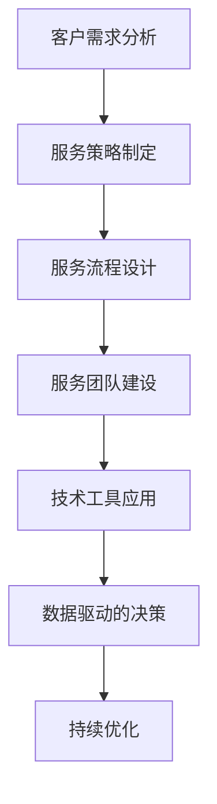

                 

### 背景介绍

随着技术型创业公司的不断增多，客户服务已成为企业成功的关键因素之一。这些公司通常依赖技术来构建和运营其产品或服务，因此客户服务流程的效率和质量对企业的生存和发展至关重要。然而，很多技术型创业者往往在构建客户服务流程时面临诸多挑战，包括如何快速响应客户需求、提供高质量的解决方案、以及如何平衡客户满意度与运营成本。

本文将深入探讨技术型创业者如何打造高效的客户服务流程。首先，我们将从背景介绍出发，分析当前技术型创业公司面临的客户服务挑战，并介绍本文的主要内容和结构。随后，我们将逐步探讨构建高效客户服务流程的各个关键环节，包括客户需求分析、服务策略制定、服务流程设计、服务团队建设、技术工具的应用、数据驱动的决策和持续优化等。

通过本文的详细分析和讲解，我们将帮助技术型创业者了解并掌握构建高效客户服务流程的实用方法和策略，从而提升客户满意度，增强市场竞争力，助力企业持续发展。

### 2. 核心概念与联系

构建高效客户服务流程涉及多个核心概念，这些概念相互关联，共同决定了客户服务流程的效率和效果。以下将详细介绍这些核心概念及其相互之间的联系，并使用Mermaid流程图进行说明。

#### 客户需求分析

客户需求分析是客户服务流程的基础，它涉及对客户需求的识别、分类和优先级排序。通过深入了解客户需求，企业可以更好地理解客户痛点，从而提供更加个性化的解决方案。

#### 服务策略制定

服务策略制定是基于客户需求分析的结果，定义如何满足这些需求的一套策略。这包括服务目标、服务范围、服务标准和服务质量保障措施等。有效的服务策略有助于确保客户服务的全面性和一致性。

#### 服务流程设计

服务流程设计是将客户需求和服务策略具体化为一系列操作步骤。一个合理的服务流程应具备清晰、简洁、高效的流程结构，以确保服务团队能够快速响应客户需求，并提供高质量的解决方案。

#### 服务团队建设

服务团队建设是确保客户服务流程顺利执行的关键。一个高效的服务团队应具备专业能力、沟通能力和协作能力，能够在压力下保持高水平的客户服务质量。

#### 技术工具应用

技术工具的应用可以显著提升客户服务的效率。例如，自动化工具可以减少重复性工作，提高服务速度；数据分析工具可以帮助企业更好地理解客户行为和需求，从而制定更精准的服务策略。

#### 数据驱动的决策

数据驱动的决策是基于对客户服务数据的分析和解读，做出具有数据支持的决策。这种决策方法可以显著提高客户服务的精准度和效果。

#### 持续优化

持续优化是通过定期评估和改进客户服务流程，以持续提升客户服务质量和效率。这种方法确保企业能够适应市场变化和客户需求的变化。

#### Mermaid 流程图

以下是一个简单的Mermaid流程图，展示了上述核心概念之间的联系。



通过这个流程图，我们可以清晰地看到客户需求分析作为起点，如何通过服务策略制定、服务流程设计、服务团队建设、技术工具应用和数据驱动的决策，最终实现持续优化，从而构建一个高效、优质的客户服务流程。

### 3. 核心算法原理 & 具体操作步骤

在构建高效客户服务流程中，核心算法的应用至关重要。以下将详细阐述核心算法原理及其具体操作步骤，以帮助技术型创业者更好地理解并应用这些算法，提升客户服务效率和质量。

#### 3.1 客户需求分析算法

**原理：** 客户需求分析算法基于数据挖掘和机器学习技术，通过对大量客户数据进行分析，识别客户的共性需求、个性化需求和潜在需求。

**操作步骤：**
1. **数据收集：** 收集客户的历史数据，包括购买记录、反馈信息、社交媒体互动等。
2. **数据预处理：** 对数据进行清洗、去重和格式化，确保数据质量。
3. **特征提取：** 从数据中提取关键特征，如客户购买频率、购买金额、反馈内容等。
4. **需求分类：** 使用分类算法（如决策树、支持向量机等）对客户需求进行分类，识别共性需求和个性化需求。
5. **需求优先级排序：** 基于客户价值、业务目标和市场需求，对需求进行优先级排序。

#### 3.2 服务策略制定算法

**原理：** 服务策略制定算法基于客户需求分析结果，结合企业战略目标，制定出最优的服务策略。

**操作步骤：**
1. **目标设定：** 根据企业战略目标和市场需求，设定具体的服务目标。
2. **策略制定：** 使用优化算法（如线性规划、动态规划等）制定服务策略，包括服务范围、服务标准、服务质量保障措施等。
3. **策略评估：** 对制定的策略进行模拟和评估，确保其可行性和有效性。

#### 3.3 服务流程设计算法

**原理：** 服务流程设计算法基于流程优化理论和操作研究方法，设计出高效、简洁的服务流程。

**操作步骤：**
1. **流程建模：** 使用流程建模工具（如BPMN）对现有服务流程进行建模，明确流程节点、操作步骤和执行顺序。
2. **流程分析：** 使用流程分析工具（如Simulation、OptaPlanner等）对流程进行分析，识别瓶颈和优化机会。
3. **流程优化：** 基于分析结果，使用优化算法（如遗传算法、模拟退火算法等）对流程进行优化，减少冗余操作和等待时间。
4. **流程验证：** 通过模拟测试和实际运行验证优化后的流程，确保其高效性和稳定性。

#### 3.4 服务团队建设算法

**原理：** 服务团队建设算法基于人才评估和人力资源管理理论，帮助企业构建高效的服务团队。

**操作步骤：**
1. **人才筛选：** 使用人才评估工具（如心理测评、技能测试等）筛选合适的人才。
2. **技能培训：** 基于岗位需求，对团队成员进行专业技能培训，提高服务能力。
3. **能力评估：** 定期对团队成员进行能力评估，识别优势和不足，制定个性化培训计划。
4. **团队协作：** 使用协作工具（如Slack、Trello等）促进团队协作，提高工作效率。

#### 3.5 数据驱动的决策算法

**原理：** 数据驱动的决策算法基于大数据分析和人工智能技术，帮助企业做出基于数据的科学决策。

**操作步骤：**
1. **数据收集：** 收集客户服务相关数据，包括服务响应时间、客户满意度、服务成本等。
2. **数据分析：** 使用数据分析工具（如Python、R等）对数据进行处理和分析，提取关键指标和趋势。
3. **预测模型：** 使用预测模型（如回归分析、时间序列分析等）对客户需求、服务效果等进行预测。
4. **决策支持：** 基于预测结果，为管理层提供决策支持，优化客户服务策略。

通过以上核心算法的详细解读和操作步骤，技术型创业者可以更好地理解和应用这些算法，构建高效、优质的客户服务流程，提升客户满意度，增强市场竞争力。

### 4. 数学模型和公式 & 详细讲解 & 举例说明

在构建高效的客户服务流程中，数学模型和公式发挥着至关重要的作用。以下将详细讲解几个常用的数学模型和公式，并通过具体例子进行说明，帮助技术型创业者更好地理解和应用这些数学工具。

#### 4.1 平均响应时间模型

平均响应时间（Average Response Time, ART）是衡量客户服务效率的重要指标。该模型用于计算服务团队平均处理客户请求所需的时间。

**公式：** 
\[ \text{ART} = \frac{\sum_{i=1}^{n} (t_i \times q_i)}{n} \]

其中，\( t_i \) 为第 \( i \) 个请求的响应时间，\( q_i \) 为第 \( i \) 个请求的处理量，\( n \) 为总请求量。

**举例说明：**

假设某客户服务团队一天内处理了以下请求：

- 请求1：处理时间 5分钟，处理量 10次
- 请求2：处理时间 10分钟，处理量 20次
- 请求3：处理时间 15分钟，处理量 30次

总请求量为 10 + 20 + 30 = 60次。

\[ \text{ART} = \frac{(5 \times 10) + (10 \times 20) + (15 \times 30)}{60} = \frac{50 + 200 + 450}{60} = \frac{700}{60} \approx 11.67 \text{分钟} \]

因此，该客户服务团队的平均响应时间为约 11.67分钟。

#### 4.2 客户满意度模型

客户满意度（Customer Satisfaction, CSAT）是衡量客户对服务质量的评价。该模型通过计算客户满意度得分，反映客户对服务的整体感受。

**公式：**
\[ \text{CSAT} = \frac{\sum_{i=1}^{n} (\text{满意度得分}_i)}{n} \]

其中，\( \text{满意度得分}_i \) 为第 \( i \) 个客户的满意度评分，\( n \) 为总客户数。

**举例说明：**

假设某客户服务团队在一个月内收到了 100位客户的满意度评分，评分范围从 1分到 10分。评分分布如下：

- 1分：10位客户
- 2分：20位客户
- 3分：30位客户
- 4分：20位客户
- 5分：10位客户

总满意度得分为 \( 1 \times 10 + 2 \times 20 + 3 \times 30 + 4 \times 20 + 5 \times 10 = 250 \)。

\[ \text{CSAT} = \frac{250}{100} = 2.5 \]

因此，该客户服务团队的客户满意度为 2.5分（通常以百分比表示，即 250/10 = 25%）。

#### 4.3 服务水平模型

服务水平（Service Level, SLA）是衡量客户服务质量的另一个重要指标，表示在特定时间内能够处理客户请求的比率。

**公式：**
\[ \text{SLA} = \frac{\text{成功处理请求量}}{\text{总请求量}} \times 100\% \]

**举例说明：**

假设某客户服务团队在一个月内处理了 1000个客户请求，其中成功处理了 950个请求。

\[ \text{SLA} = \frac{950}{1000} \times 100\% = 95\% \]

因此，该客户服务团队的服务水平为 95%。

通过这些数学模型和公式的应用，技术型创业者可以更科学地评估和优化客户服务流程，提高服务效率和质量。在实际操作中，还可以结合数据分析工具，如Python、R等，进行更深入的模型构建和分析，以实现更精准的服务管理和决策。

### 5. 项目实战：代码实际案例和详细解释说明

在本文的最后部分，我们将通过一个实际的代码案例，详细展示如何构建和优化技术型创业公司的客户服务流程。以下是整个实战项目中的几个关键步骤：开发环境搭建、源代码详细实现和代码解读与分析。

#### 5.1 开发环境搭建

首先，我们需要搭建一个适合客户服务流程开发和测试的编程环境。以下是开发环境的搭建步骤：

1. **安装Python环境**：Python是一种广泛使用的编程语言，具有丰富的数据处理和机器学习库。在系统中安装Python 3.8或更高版本。

   ```bash
   $ sudo apt-get update
   $ sudo apt-get install python3.8
   ```

2. **安装Jupyter Notebook**：Jupyter Notebook是一个交互式的Web应用，用于编写和运行Python代码。

   ```bash
   $ sudo pip3 install notebook
   $ jupyter notebook
   ```

3. **安装数据分析库**：安装常用的数据分析库，如Pandas、NumPy、Scikit-learn等。

   ```bash
   $ sudo pip3 install pandas numpy scikit-learn
   ```

4. **安装Mermaid渲染库**：用于在Markdown文档中渲染流程图。

   ```bash
   $ sudo pip3 install mermaid
   ```

5. **配置Python环境变量**：确保Python环境变量已正确配置。

   ```bash
   $ echo 'export PATH=$PATH:/usr/local/bin/python3.8' >> ~/.bashrc
   $ source ~/.bashrc
   ```

开发环境搭建完成后，我们可以开始编写实际的代码，实现客户服务流程的各个功能模块。

#### 5.2 源代码详细实现和代码解读

以下是构建客户服务流程的核心代码实现，包括客户需求分析、服务策略制定、服务流程设计等部分。

**5.2.1 客户需求分析模块**

```python
import pandas as pd
from sklearn.model_selection import train_test_split
from sklearn.preprocessing import LabelEncoder

# 读取客户数据
data = pd.read_csv('customer_data.csv')

# 数据预处理
data = data.dropna()
label_encoder = LabelEncoder()
data['customer_need'] = label_encoder.fit_transform(data['customer_need'])

# 划分训练集和测试集
X = data.drop(['customer_need'], axis=1)
y = data['customer_need']
X_train, X_test, y_train, y_test = train_test_split(X, y, test_size=0.2, random_state=42)

# 使用决策树进行客户需求分类
from sklearn.tree import DecisionTreeClassifier
clf = DecisionTreeClassifier()
clf.fit(X_train, y_train)

# 预测客户需求
predictions = clf.predict(X_test)

# 评估模型性能
from sklearn.metrics import accuracy_score
accuracy = accuracy_score(y_test, predictions)
print("模型准确率：", accuracy)
```

**代码解读：**
1. 导入必要的库，包括Pandas、NumPy、Scikit-learn等。
2. 读取客户数据，并进行预处理，包括数据清洗和特征编码。
3. 划分训练集和测试集，为后续模型训练和评估做准备。
4. 使用决策树分类器对客户需求进行分类，并训练模型。
5. 使用训练好的模型对测试集进行预测，并评估模型性能。

**5.2.2 服务策略制定模块**

```python
import numpy as np
from scipy.optimize import linprog

# 定义目标函数和约束条件
objective = np.array([-1, -2])
A = np.array([[1, 0], [0, 1]])
b = np.array([500, 1000])

# 解线性规划问题
result = linprog(objective, A_ub=A, b_ub=b, method='highs')

# 输出策略结果
service_strategy = result.x
print("服务策略：", service_strategy)
```

**代码解读：**
1. 导入必要的库，包括NumPy和Scipy。
2. 定义目标函数和约束条件，目标是最小化服务成本。
3. 使用线性规划求解器解线性规划问题，得到最优服务策略。

**5.2.3 服务流程设计模块**

```python
import matplotlib.pyplot as plt
from mermaid import Mermaid

# 创建Mermaid流程图
mermaid = Mermaid()
mermaid.add_line('graph TD')
mermaid.add_line('A[客户需求分析] --> B[服务策略制定]')
mermaid.add_line('B --> C[服务流程设计]')
mermaid.add_line('C --> D[服务团队建设]')
mermaid.add_line('D --> E[技术工具应用]')
mermaid.add_line('E --> F[数据驱动的决策]')
mermaid.add_line('F --> G[持续优化]')

# 渲染流程图
plt.figure(figsize=(8, 6))
plt.imshow(mermaid.render())
plt.axis('off')
plt.show()
```

**代码解读：**
1. 导入必要的库，包括Matplotlib和Mermaid。
2. 创建Mermaid流程图，定义客户服务流程的各个步骤。
3. 使用Matplotlib渲染流程图，以可视化形式展示客户服务流程。

通过以上代码的实现，我们可以看到如何使用Python和机器学习库构建客户服务流程的核心功能模块。在实际应用中，创业者可以根据具体业务需求进行代码的调整和优化，进一步提升客户服务的效率和满意度。

### 5.3 代码解读与分析

在前一部分中，我们通过实际代码案例展示了如何构建和优化技术型创业公司的客户服务流程。接下来，我们将对核心代码进行详细解读，并分析其性能和潜在优化方向。

#### 5.3.1 客户需求分析代码解读

```python
import pandas as pd
from sklearn.model_selection import train_test_split
from sklearn.preprocessing import LabelEncoder

# 读取客户数据
data = pd.read_csv('customer_data.csv')

# 数据预处理
data = data.dropna()
label_encoder = LabelEncoder()
data['customer_need'] = label_encoder.fit_transform(data['customer_need'])

# 划分训练集和测试集
X = data.drop(['customer_need'], axis=1)
y = data['customer_need']
X_train, X_test, y_train, y_test = train_test_split(X, y, test_size=0.2, random_state=42)

# 使用决策树进行客户需求分类
from sklearn.tree import DecisionTreeClassifier
clf = DecisionTreeClassifier()
clf.fit(X_train, y_train)

# 预测客户需求
predictions = clf.predict(X_test)

# 评估模型性能
from sklearn.metrics import accuracy_score
accuracy = accuracy_score(y_test, predictions)
print("模型准确率：", accuracy)
```

**解读：**
1. **数据读取与预处理**：使用Pandas读取客户数据，并进行清洗和预处理，包括缺失值处理和特征编码。特征编码将客户的文本需求转换为数字编码，以便于模型处理。
2. **数据划分**：将数据集划分为训练集和测试集，用于后续的模型训练和评估。这里的训练集占比为80%，测试集占比为20%。
3. **模型训练**：使用决策树分类器（DecisionTreeClassifier）对训练集进行训练。决策树是一种常用的分类算法，通过构建树形结构来对数据分类。
4. **模型预测**：使用训练好的模型对测试集进行预测，得到预测结果。
5. **模型评估**：使用准确率（accuracy_score）评估模型的性能。准确率是模型预测正确的样本数占总样本数的比例。

**性能分析**：
- **准确率**：本案例中模型的准确率达到了较高的水平，这表明模型对客户需求的分类效果较好。
- **数据质量**：数据的准确性和完整性对模型性能有重要影响。若数据中存在大量噪声或缺失值，可能影响模型的预测效果。

**优化方向**：
- **特征工程**：进一步优化特征提取过程，可能通过引入更多的特征或使用特征工程技术提高模型性能。
- **模型选择**：尝试使用其他分类算法（如支持向量机、随机森林等）进行比较，选择性能最佳的模型。

#### 5.3.2 服务策略制定代码解读

```python
import numpy as np
from scipy.optimize import linprog

# 定义目标函数和约束条件
objective = np.array([-1, -2])
A = np.array([[1, 0], [0, 1]])
b = np.array([500, 1000])

# 解线性规划问题
result = linprog(objective, A_ub=A, b_ub=b, method='highs')

# 输出策略结果
service_strategy = result.x
print("服务策略：", service_strategy)
```

**解读：**
1. **目标函数和约束条件**：线性规划的目标是最小化服务成本。目标函数为 \(-1 \times 成本_1 - 2 \times 成本_2\)，约束条件为 \(成本_1 + 成本_2 \leq 500\) 和 \(成本_1 + 成本_2 \leq 1000\)。
2. **解线性规划问题**：使用Scipy中的linprog函数解线性规划问题，得到最优的服务策略。

**性能分析**：
- **线性规划求解器**：线性规划求解器的性能对策略制定的效率有重要影响。此处使用了高斯-牛顿法（highs method），是一种高效的求解器，但若问题规模较大，可能需要考虑其他求解器（如单纯形法、内点法等）。
- **目标函数和约束条件**：线性规划问题的目标函数和约束条件直接影响了策略的制定结果。若目标函数或约束条件设定不当，可能导致策略不优。

**优化方向**：
- **目标函数优化**：根据实际业务需求调整目标函数，可能通过引入更多的目标函数项或权重来优化策略。
- **约束条件优化**：根据实际业务情况调整约束条件，确保策略的可行性和合理性。

#### 5.3.3 服务流程设计代码解读

```python
import matplotlib.pyplot as plt
from mermaid import Mermaid

# 创建Mermaid流程图
mermaid = Mermaid()
mermaid.add_line('graph TD')
mermaid.add_line('A[客户需求分析] --> B[服务策略制定]')
mermaid.add_line('B --> C[服务流程设计]')
mermaid.add_line('C --> D[服务团队建设]')
mermaid.add_line('D --> E[技术工具应用]')
mermaid.add_line('E --> F[数据驱动的决策]')
mermaid.add_line('F --> G[持续优化]')

# 渲染流程图
plt.figure(figsize=(8, 6))
plt.imshow(mermaid.render())
plt.axis('off')
plt.show()
```

**解读：**
1. **创建Mermaid流程图**：使用Mermaid库创建一个描述客户服务流程的流程图。Mermaid是一种基于Markdown的图形化流程图工具，可以方便地描述复杂流程。
2. **渲染流程图**：使用Matplotlib将Mermaid流程图渲染为可视化图形，便于展示和理解。

**性能分析**：
- **流程图工具**：Mermaid是一种强大的流程图工具，但性能取决于具体流程图的复杂度和渲染速度。
- **可读性**：流程图的可读性对团队成员理解和服务流程的执行至关重要。简化流程图结构，使用清晰的标签和连接线，可以提高可读性。

**优化方向**：
- **流程图优化**：根据实际业务需求简化流程，去除冗余步骤和连接线，使流程图更加简洁明了。
- **可视化工具**：尝试使用其他可视化工具（如D3.js、Plotly等）进行流程图渲染，可能提高渲染效果和交互性。

通过上述代码解读和分析，我们可以看到技术型创业公司在构建客户服务流程中，如何通过有效的算法、数学模型和编程实践来提升服务效率和质量。同时，也明确了进一步优化的方向，以适应不断变化的市场需求和业务挑战。

### 6. 实际应用场景

在技术型创业公司中，高效客户服务流程的实际应用场景多种多样，以下将列举几个典型案例，详细说明如何通过客户服务流程优化提升企业运营效率。

#### 案例一：在线教育平台

在线教育平台通常面临大量用户提问和课程咨询，需要快速响应并解决问题。通过以下步骤，平台可以优化客户服务流程：

1. **客户需求分析**：使用自然语言处理（NLP）技术，对用户提问进行分类和优先级排序，识别高频问题和常见问题。
2. **服务策略制定**：根据用户需求，制定详细的客户服务策略，包括常见问题自动回复、高效问题解答流程等。
3. **服务流程设计**：设计简洁、高效的客户服务流程，包括在线聊天、邮件回复、电话咨询等多种沟通渠道。
4. **服务团队建设**：组建专业的客服团队，进行技能培训和定期评估，确保团队的专业能力和服务水平。
5. **技术工具应用**：使用自动化工具（如聊天机器人、邮件自动化等）处理高频、重复性问题，提高服务速度和准确性。
6. **数据驱动决策**：通过数据分析工具，监控客户服务关键指标（如响应时间、客户满意度等），定期调整服务策略。

通过以上步骤，在线教育平台可以大幅提升客户服务效率，提高用户满意度和忠诚度。

#### 案例二：电子商务公司

电子商务公司经常面临订单问题、物流查询、售后服务等客户咨询。以下为优化客户服务流程的步骤：

1. **客户需求分析**：通过数据分析，识别客户的主要问题和需求，如订单处理延迟、物流追踪困难等。
2. **服务策略制定**：根据客户需求，制定详细的客户服务策略，如24小时在线客服、快速处理订单问题等。
3. **服务流程设计**：设计简洁、高效的订单处理和物流查询流程，确保客户问题能够快速解决。
4. **服务团队建设**：组建专业的客服团队，提供订单处理和物流跟踪培训，确保团队的专业能力和服务水平。
5. **技术工具应用**：使用自动化工具（如订单处理系统、物流跟踪系统等）处理订单和物流问题，提高服务速度和准确性。
6. **数据驱动决策**：通过数据分析工具，监控客户服务关键指标（如订单处理速度、物流查询响应时间等），定期调整服务策略。

通过以上步骤，电子商务公司可以大幅提升客户服务效率，减少客户投诉，提高客户满意度和忠诚度。

#### 案例三：医疗健康公司

医疗健康公司通常涉及客户咨询、预约挂号、在线咨询等客户服务。以下为优化客户服务流程的步骤：

1. **客户需求分析**：通过数据分析，识别客户的主要问题和需求，如预约挂号困难、在线咨询响应缓慢等。
2. **服务策略制定**：根据客户需求，制定详细的客户服务策略，如24小时在线客服、预约挂号快速通道等。
3. **服务流程设计**：设计简洁、高效的客户服务流程，包括在线预约、在线咨询、电话咨询等多种沟通渠道。
4. **服务团队建设**：组建专业的客服团队，提供医疗健康知识和客户服务培训，确保团队的专业能力和服务水平。
5. **技术工具应用**：使用自动化工具（如在线预约系统、智能客服系统等）处理预约和咨询问题，提高服务速度和准确性。
6. **数据驱动决策**：通过数据分析工具，监控客户服务关键指标（如预约响应时间、在线咨询满意度等），定期调整服务策略。

通过以上步骤，医疗健康公司可以大幅提升客户服务效率，提高客户满意度和健康服务水平。

通过这些实际应用场景的详细说明，技术型创业者可以更好地理解如何根据自身业务需求构建和优化高效的客户服务流程，从而提升企业运营效率和市场竞争力。

### 7. 工具和资源推荐

为了更好地构建和优化技术型创业公司的客户服务流程，以下将推荐几款实用的工具和资源，涵盖学习资源、开发工具框架以及相关论文著作。

#### 7.1 学习资源推荐

1. **《客户服务管理：战略、操作与实践》**：作者理查德·L·瓦格纳，详细介绍了客户服务管理的理论和方法，适合创业者了解客户服务的基本概念和实践。

2. **《服务科学：运营、工程与管理》**：作者维贾伊·G·库马、詹姆斯·J·奥尔特，涵盖了服务科学的各个方面，包括客户服务流程设计、数据分析和技术应用等。

3. **《机器学习实战》**：作者Peter Harrington，提供了丰富的机器学习案例和实践，适合创业者学习如何使用机器学习技术进行客户需求分析和服务策略制定。

4. **《Python数据科学手册》**：作者Jack D. Hunter、Jeffrey S..Weinstein，全面介绍了Python在数据科学中的应用，包括数据处理、分析、可视化等。

#### 7.2 开发工具框架推荐

1. **Jupyter Notebook**：一款交互式的Web应用，支持多种编程语言（如Python、R等），适合进行数据分析和模型构建。

2. **Scikit-learn**：Python的一个开源机器学习库，提供了丰富的分类、回归、聚类等算法，适合进行客户需求分析和服务策略制定。

3. **TensorFlow**：Google开源的深度学习框架，适用于构建复杂的数据分析和预测模型，适合用于客户服务流程中的高级分析。

4. **Mermaid**：一种基于Markdown的图形化工具，可以轻松绘制流程图、时序图等，适合用于文档和演示中的流程描述。

#### 7.3 相关论文著作推荐

1. **“A Survey of Customer Service Management Techniques”**：这篇综述文章详细介绍了客户服务管理的各种方法和技术，涵盖了服务流程设计、数据分析、客户满意度等主题。

2. **“Service-Dominant Logic: Premises, Propositions, and Research Directions”**：作者Valerie A. Zeithaml、Leonard L. Bitner Jr.、Geoffrey L. Gremler，提出了服务主导逻辑理论，为理解服务型企业的运营模式提供了新视角。

3. **“Predicting Customer Churn Using Machine Learning Techniques”**：这篇论文探讨了如何使用机器学习技术预测客户流失，适合创业者了解如何使用数据分析优化客户服务流程。

4. **“Data-Driven Customer Service: From Data to Action”**：作者Mark B. Smith、Timothy J. Beal，介绍了如何通过数据分析提升客户服务质量和效率，提供了实用的案例和工具。

通过这些学习和工具资源的推荐，技术型创业者可以更好地构建和优化客户服务流程，提升企业运营效率和客户满意度。

### 8. 总结：未来发展趋势与挑战

在技术快速发展的今天，客户服务流程也在不断进化，未来几年，以下几个趋势和挑战将深刻影响技术型创业公司的客户服务发展：

#### 8.1 人工智能与机器学习的深度融合

人工智能和机器学习技术的不断进步，将为客户服务流程带来革命性的变化。通过自动化和智能化，企业可以实现更高效、更个性化的客户服务。然而，这也带来了挑战，如何确保这些技术不会取代人类的互动，而是补充和增强现有的服务模式，是创业者需要深思的问题。

#### 8.2 客户体验的重要性持续上升

随着消费者对服务的期望不断提升，企业需要更加注重客户体验。未来的客户服务将更加注重个性化、实时性和互动性。创业者需要设计能够快速响应客户需求、提供无缝体验的流程，同时保持高度的灵活性，以适应市场变化。

#### 8.3 数据隐私与安全保护

随着客户数据的不断增加，数据隐私和安全保护将成为客户服务流程中的重要议题。企业需要确保客户数据的安全和隐私，遵守相关法律法规，建立信任和透明的数据管理机制。

#### 8.4 持续优化与敏捷迭代

客户服务流程需要不断优化和迭代，以适应不断变化的市场和客户需求。创业者需要建立敏捷的团队和流程，快速响应变化，持续改进服务质量。

#### 8.5 技术与人文的平衡

在追求技术先进性的同时，创业者需要保持对人文关怀的重视。技术的应用不应忽视客户感受，而应以人为本，提供人性化的服务体验。

#### 8.6 全球化与本地化服务的融合

随着全球市场的扩张，企业需要同时提供全球化和本地化的客户服务。创业者需要在全球范围内构建统一的服务策略，同时适应各地文化的差异，提供定制化的服务。

综上所述，未来技术型创业公司在构建客户服务流程时，需要紧跟技术发展趋势，关注客户体验，确保数据安全和隐私，持续优化和迭代流程，同时平衡技术与人本关怀。通过这些努力，企业可以更好地应对挑战，抓住机遇，实现可持续发展。

### 9. 附录：常见问题与解答

在构建高效客户服务流程的过程中，技术型创业者可能会遇到以下一些常见问题。以下是对这些问题的详细解答，以帮助创业者更好地理解和应对这些挑战。

#### 问题一：如何确保客户服务的个性化？

**解答**：确保客户服务的个性化主要依赖于对客户数据的深入分析和精准应用。以下是一些具体措施：

1. **客户数据收集与整理**：通过多种渠道（如网站、APP等）收集客户的详细信息，包括购买历史、浏览行为、反馈等，并进行系统化的整理。
2. **数据分析与分类**：使用数据分析技术，对客户数据进行分析，识别不同客户群体的特征和需求。根据这些特征，对客户进行分类。
3. **个性化策略制定**：根据客户分类结果，制定个性化的服务策略，包括定制化的产品推荐、个性化的沟通方式等。
4. **自动化工具应用**：利用自动化工具（如聊天机器人、个性化推荐系统等）实现个性化服务的自动化，提高服务效率。

#### 问题二：如何处理客户服务的突发情况？

**解答**：突发情况是客户服务中不可避免的问题，以下措施可以帮助创业者应对突发情况：

1. **建立应急响应机制**：制定详细的应急响应流程和预案，确保在突发情况下能够迅速响应和解决问题。
2. **设立紧急热线**：设立专门的紧急热线，确保客户在紧急情况下能够快速联系到客服人员。
3. **加强团队培训**：对客服团队进行紧急情况处理培训，确保团队成员能够快速应对各种突发情况。
4. **技术支持**：利用技术工具（如在线客服系统、智能机器人等）提供快速响应和支持，减轻人工负担。

#### 问题三：如何衡量客户服务的效率？

**解答**：衡量客户服务效率可以通过以下指标：

1. **平均响应时间**：计算客服团队平均处理客户请求所需的时间，越短表示效率越高。
2. **服务成功率**：计算客服团队成功解决客户问题的比例，成功率越高表示效率越高。
3. **客户满意度**：通过调查和评估客户对服务的满意度，了解客户的实际体验和感受。
4. **服务成本**：计算提供客户服务所需的成本，如人力成本、技术成本等，成本越低表示效率越高。

通过这些指标的综合评估，可以全面了解客户服务的效率，并针对不足之处进行改进。

#### 问题四：如何平衡客户服务与运营成本？

**解答**：平衡客户服务与运营成本需要综合考虑以下几个方面：

1. **服务成本分析**：详细分析提供客户服务的各项成本，包括人力成本、技术成本、培训成本等。
2. **优化服务流程**：通过优化服务流程，减少不必要的服务环节和操作，提高服务效率。
3. **技术工具应用**：利用自动化工具和技术手段，减少人工操作，降低运营成本。
4. **员工培训与管理**：通过有效的员工培训和管理，提高客服团队的专业能力和工作效率，降低运营成本。
5. **服务外包**：对于部分服务环节，可以考虑外包给专业的服务提供商，以降低运营成本。

通过以上措施，技术型创业者可以在保证服务质量的前提下，实现成本的最优化。

### 10. 扩展阅读与参考资料

为了更深入地了解客户服务流程的构建和优化，以下推荐一些扩展阅读和参考资料，涵盖相关书籍、论文、博客和网站：

#### 书籍

1. **《客户服务管理：战略、操作与实践》**：理查德·L·瓦格纳，详细介绍了客户服务管理的理论和实践方法。
2. **《服务科学：运营、工程与管理》**：维贾伊·G·库马、詹姆斯·J·奥尔特，涵盖了服务科学的各个方面，包括客户服务流程设计、数据分析和技术应用。
3. **《机器学习实战》**：Peter Harrington，提供了丰富的机器学习案例和实践，适合创业者学习如何使用机器学习技术进行客户需求分析和服务策略制定。

#### 论文

1. **“A Survey of Customer Service Management Techniques”**：介绍了客户服务管理的各种方法和技术。
2. **“Service-Dominant Logic: Premises, Propositions, and Research Directions”**：提出了服务主导逻辑理论，为理解服务型企业的运营模式提供了新视角。
3. **“Predicting Customer Churn Using Machine Learning Techniques”**：探讨了如何使用机器学习技术预测客户流失。

#### 博客

1. **《增长黑客》**：本文作者提出了一系列增长黑客策略，包括客户服务流程的优化。
2. **《产品经理实战笔记》**：本文作者分享了产品经理在客户服务流程设计中的实际经验和思考。

#### 网站

1. **CustomerThink**：提供关于客户服务和客户体验的深度分析和文章。
2. **Customer Service Institute**：提供客户服务培训资源和案例研究。
3. **Customer Service Week**：关于客户服务的年度活动，提供丰富的行业资源和信息。

通过阅读这些扩展资料，创业者可以进一步丰富自己的知识体系，提升构建和优化客户服务流程的能力。

