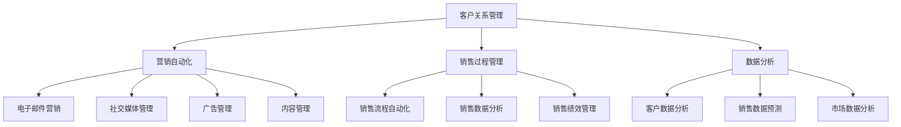
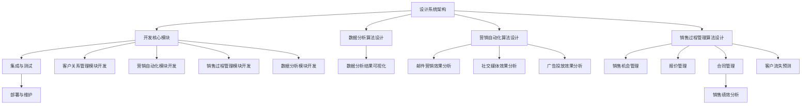

                 

### 文章标题

《技术型创业者如何打造高效的销售自动化系统》

### 关键词

- 销售自动化
- 技术型创业者
- 效率提升
- 数据分析
- 人工智能
- 营销自动化
- 客户关系管理

### 摘要

本文旨在为技术型创业者提供一套完整的销售自动化系统构建指南。文章从背景介绍出发，详细阐述了销售自动化系统的核心概念与架构，解析了核心算法原理及实施步骤。通过数学模型和公式的详细讲解，结合实际项目案例，本文深入剖析了如何通过销售自动化系统实现高效客户管理和数据分析。文章最后推荐了相关学习资源和开发工具，总结了未来发展趋势与挑战，为创业者提供了实用参考。通过本文的学习，技术型创业者将能够掌握销售自动化系统的构建方法，提升企业销售效率，实现业务增长。

## 1. 背景介绍

在当今快速发展的商业环境中，技术型创业者面临着前所未有的挑战和机遇。一方面，互联网技术的普及和人工智能的发展，使得创业者可以借助各种数字化工具和平台，实现业务的快速拓展和优化；另一方面，市场竞争的加剧，要求企业必须在有限的资源下，实现效率最大化，从而在激烈的市场竞争中立于不败之地。

### 销售自动化系统的概念

销售自动化系统是一种利用现代信息技术，特别是人工智能和大数据分析，自动化地完成销售过程中的各个环节，从而提升销售效率、降低成本、提高客户满意度的系统。它通常包括以下几个核心模块：

1. **客户关系管理（CRM）**：记录和管理客户信息，分析客户行为，预测客户需求。
2. **营销自动化**：通过自动化工具，如电子邮件营销、社交媒体广告等，吸引和留住客户。
3. **销售过程管理**：自动化处理销售机会、报价、合同等，确保销售流程的高效和规范。
4. **数据分析**：对销售数据进行分析，提供洞察和决策支持。

### 销售自动化系统的重要性

对于技术型创业者而言，构建一个高效的销售自动化系统具有重要意义：

1. **提升销售效率**：通过自动化工具和流程，减少人工干预，提高销售团队的效率。
2. **降低成本**：自动化系统可以减少重复性工作，降低人力成本，提高资源利用率。
3. **提高客户满意度**：通过更加精准的客户管理和个性化营销，提高客户满意度，增加复购率。
4. **数据驱动决策**：通过对销售数据的深入分析，帮助企业更好地理解市场趋势和客户需求，从而做出更科学的决策。

### 当前市场趋势

随着互联网和人工智能技术的不断进步，销售自动化系统已经成为企业竞争的重要工具。以下是一些当前市场趋势：

1. **人工智能的集成**：越来越多的销售自动化系统开始集成人工智能技术，如自然语言处理、机器学习等，以实现更智能的客户关系管理和销售预测。
2. **跨渠道整合**：企业越来越重视线上线下渠道的整合，通过多渠道销售自动化系统，实现全渠道的销售管理。
3. **个性化体验**：通过大数据分析和客户行为分析，销售自动化系统可以提供更加个性化的客户体验，从而提升客户满意度和忠诚度。

## 2. 核心概念与联系

在构建销售自动化系统时，理解以下几个核心概念是非常重要的：

### 2.1. 客户关系管理（CRM）

客户关系管理（CRM）是一种旨在增强企业与客户之间关系的策略。通过CRM系统，企业可以收集、管理和分析客户信息，从而更好地了解客户需求，提高客户满意度。CRM系统通常包括以下功能：

- **客户信息管理**：记录和管理客户的基本信息，如联系人信息、交易历史等。
- **销售过程管理**：跟踪销售机会，管理销售流程，包括报价、合同和订单等。
- **营销管理**：通过电子邮件营销、社交媒体广告等工具，自动化营销活动，提高营销效果。
- **客户服务**：提供在线客服、客户支持等，解决客户问题，提高客户满意度。

### 2.2. 营销自动化

营销自动化是一种利用技术手段，自动化地执行营销任务的系统。它通过分析客户数据，自动化执行营销活动，从而提高营销效率。营销自动化的核心功能包括：

- **电子邮件营销**：自动化发送电子邮件，包括欢迎邮件、跟进邮件、促销邮件等。
- **社交媒体管理**：自动化发布社交媒体内容，监控社交媒体活动，提高品牌曝光度。
- **广告管理**：自动化投放和管理在线广告，提高广告投放效果。
- **内容管理**：自动化生成和发布营销内容，如博客、白皮书等。

### 2.3. 销售过程管理

销售过程管理是销售自动化系统的重要组成部分，它通过自动化工具和流程，规范销售行为，提高销售效率。销售过程管理的核心功能包括：

- **销售流程自动化**：自动化处理销售机会、报价、合同等，减少人工干预。
- **销售数据分析**：分析销售数据，提供销售预测和决策支持。
- **销售绩效管理**：跟踪销售团队的表现，提供绩效考核和激励方案。

### 2.4. 数据分析

数据分析是销售自动化系统的核心能力之一。通过数据分析，企业可以深入理解客户行为、市场趋势和销售绩效，从而做出更科学的决策。数据分析的主要任务包括：

- **客户数据分析**：分析客户行为，了解客户需求和偏好，提供个性化服务。
- **销售数据预测**：预测未来销售趋势，为销售策略提供数据支持。
- **市场数据分析**：分析市场趋势和竞争对手，为企业战略提供数据支持。

### 2.5. 整合与协同

销售自动化系统的各个模块之间需要紧密整合，实现数据的互联互通和协同工作。通过整合，企业可以实现以下目标：

- **数据一致性**：确保数据在不同模块之间的准确性一致。
- **流程自动化**：通过自动化工具，实现不同模块之间的无缝连接和协同工作。
- **决策支持**：通过整合的数据分析，提供更全面、更科学的决策支持。

### 2.6. Mermaid 流程图

为了更好地理解销售自动化系统的架构，我们可以使用Mermaid流程图来描述其核心概念和联系。以下是销售自动化系统的Mermaid流程图：



通过上述流程图，我们可以清晰地看到销售自动化系统的各个模块及其相互之间的关系。这有助于我们更好地理解系统的工作原理，为后续的构建和优化提供指导。

## 3. 核心算法原理 & 具体操作步骤

### 3.1. 客户关系管理（CRM）算法原理

客户关系管理（CRM）的核心在于如何有效地收集、管理和分析客户数据。以下是CRM系统的核心算法原理：

#### 3.1.1. 客户数据分析

- **客户行为分析**：通过分析客户在网站、APP等渠道的行为数据，了解客户偏好和需求。
- **客户生命周期价值（CLV）预测**：利用客户的历史购买数据、行为数据等，预测客户的长期价值，从而制定针对性的营销策略。
- **客户细分**：根据客户的行为特征、购买习惯等，将客户划分为不同的细分市场，提供个性化的服务。

#### 3.1.2. 客户数据管理

- **数据采集**：通过API、Webhook等技术手段，从不同的数据源（如网站、APP、ERP系统等）收集客户数据。
- **数据清洗**：对采集到的客户数据进行清洗和去重，确保数据的准确性和一致性。
- **数据存储**：将清洗后的客户数据存储在数据库中，以便后续的数据分析和挖掘。

#### 3.1.3. 客户数据可视化

- **仪表盘**：通过可视化工具，将客户数据以图表、仪表盘等形式展示，帮助销售人员直观地了解客户状态和需求。
- **报表生成**：定期生成销售报表、客户分析报表等，为管理层提供决策支持。

### 3.2. 营销自动化算法原理

营销自动化的核心在于如何通过自动化工具，提高营销效率。以下是营销自动化的核心算法原理：

#### 3.2.1. 电子邮件营销

- **邮件内容个性化**：根据客户的行为数据和购买历史，生成个性化的邮件内容，提高邮件的打开率和点击率。
- **邮件发送策略**：根据客户的行为数据，制定合理的邮件发送策略，如定时发送、根据行为触发发送等。
- **邮件效果分析**：分析邮件的打开率、点击率等指标，不断优化邮件内容和发送策略。

#### 3.2.2. 社交媒体管理

- **内容发布**：根据客户的行为数据和兴趣偏好，自动化生成和发布社交媒体内容。
- **互动管理**：自动化回复客户的评论、私信等，提高客户互动体验。
- **数据分析**：分析社交媒体活动的效果，如点赞数、转发数、评论数等，不断优化社交媒体策略。

#### 3.2.3. 广告管理

- **广告投放**：根据客户的行为数据和兴趣偏好，自动化投放在线广告，提高广告效果。
- **广告效果分析**：分析广告的点击率、转化率等指标，不断优化广告内容和投放策略。

### 3.3. 销售过程管理算法原理

销售过程管理的核心在于如何通过自动化工具和流程，提高销售效率。以下是销售过程管理的核心算法原理：

#### 3.3.1. 销售流程自动化

- **销售机会管理**：自动化处理销售机会，从创建、跟踪到关闭的整个过程。
- **报价管理**：自动化生成和发送报价，确保报价的准确性和及时性。
- **合同管理**：自动化处理合同签订和审批流程，确保合同执行的规范性和效率。

#### 3.3.2. 销售数据分析

- **销售趋势预测**：利用历史销售数据，预测未来的销售趋势，为销售策略提供数据支持。
- **销售绩效分析**：分析销售团队和个人的绩效，提供绩效考核和激励方案。
- **客户流失预测**：利用客户行为数据，预测客户流失风险，提前采取措施挽回客户。

### 3.4. 数据分析算法原理

数据分析是销售自动化系统的核心能力之一，以下是数据分析的核心算法原理：

#### 3.4.1. 客户数据分析

- **客户行为分析**：通过分析客户在网站、APP等渠道的行为数据，了解客户偏好和需求。
- **客户细分**：根据客户的行为特征、购买习惯等，将客户划分为不同的细分市场，提供个性化的服务。
- **客户价值分析**：根据客户的历史购买数据和消费金额，评估客户的长期价值，为销售策略提供数据支持。

#### 3.4.2. 销售数据预测

- **销售趋势预测**：利用历史销售数据，结合市场趋势和宏观经济环境，预测未来的销售趋势。
- **销售预测模型**：利用机器学习算法，建立销售预测模型，提高销售预测的准确性和可靠性。

#### 3.4.3. 市场数据分析

- **市场趋势分析**：分析市场趋势和竞争对手的数据，了解市场的动态和变化。
- **竞争对手分析**：通过分析竞争对手的销售数据、产品价格等，了解竞争对手的策略和优势。

### 3.5. 实际操作步骤

以下是构建销售自动化系统的具体操作步骤：

#### 3.5.1. 设计系统架构

- 确定系统的功能需求，设计系统的整体架构。
- 选择合适的开发工具和框架，搭建开发环境。

#### 3.5.2. 开发核心模块

- 根据系统架构，开发客户关系管理（CRM）模块。
- 开发营销自动化模块，包括电子邮件营销、社交媒体管理、广告管理等。
- 开发销售过程管理模块，包括销售机会管理、报价管理、合同管理等。
- 开发数据分析模块，包括客户数据分析、销售数据预测、市场数据分析等。

#### 3.5.3. 集成与测试

- 将各个模块集成到一起，进行系统测试，确保系统的稳定性和性能。
- 根据测试结果，优化和调整系统功能。

#### 3.5.4. 部署与维护

- 部署系统到生产环境，确保系统的稳定运行。
- 定期对系统进行维护和升级，确保系统的持续优化。

### 3.6. Mermaid 流程图

以下是销售自动化系统的Mermaid流程图：



通过上述流程图，我们可以清晰地看到销售自动化系统的核心算法原理和实际操作步骤。这有助于我们更好地理解系统的工作流程，为后续的构建和优化提供指导。

## 4. 数学模型和公式 & 详细讲解 & 举例说明

### 4.1. 客户生命周期价值（CLV）预测

客户生命周期价值（Customer Lifetime Value，CLV）是指一个客户在一生中为企业带来的总价值。预测CLV对于制定精准的营销策略和资源分配具有重要意义。以下是一个简单的CLV预测模型：

#### 4.1.1. 模型公式

$$
CLV = \sum_{t=1}^{n} \frac{R_t \times (1 + r)^{-t}}{r}
$$

其中：
- $R_t$：第t年的收入（Revenue）
- $r$：折现率（Discount Rate）
- $n$：客户的平均生命周期长度

#### 4.1.2. 计算示例

假设一个客户第一年的收入为1000元，第二年为1200元，第三年为1500元，折现率为10%，客户的平均生命周期为3年。那么，该客户的CLV计算如下：

$$
CLV = \frac{1000 \times (1 + 0.1)^{-1} + 1200 \times (1 + 0.1)^{-2} + 1500 \times (1 + 0.1)^{-3}}{0.1}
$$

$$
CLV = \frac{1000 \times 0.9091 + 1200 \times 0.8264 + 1500 \times 0.7513}{0.1}
$$

$$
CLV = \frac{909.1 + 987.68 + 1128.95}{0.1}
$$

$$
CLV = 3025.73
$$

因此，该客户的CLV为3025.73元。

### 4.2. 销售预测模型

销售预测模型可以帮助企业预测未来的销售趋势，为销售计划和资源分配提供数据支持。以下是一个简单的时间序列销售预测模型：

#### 4.2.1. 模型公式

$$
Y_t = \alpha + \beta X_t + \epsilon_t
$$

其中：
- $Y_t$：第t年的销售量（Sales Volume）
- $X_t$：第t年的时间序列值（Time Series Value）
- $\alpha$：常数项（Constant Term）
- $\beta$：时间序列系数（Time Series Coefficient）
- $\epsilon_t$：误差项（Error Term）

#### 4.2.2. 计算示例

假设我们有一个企业的历史销售数据如下：

| 年份 | 销售量（件） |
| ---- | ---------- |
| 2020 | 1000       |
| 2021 | 1200       |
| 2022 | 1500       |
| 2023 | 1800       |

我们可以选择一个线性模型来预测2024年的销售量。首先，我们需要计算时间序列系数$\beta$：

$$
\beta = \frac{\sum_{t=1}^{n} X_t Y_t - \frac{1}{n} \sum_{t=1}^{n} X_t \sum_{t=1}^{n} Y_t}{\sum_{t=1}^{n} X_t^2 - \frac{1}{n} (\sum_{t=1}^{n} X_t)^2}
$$

将数据代入计算：

$$
\beta = \frac{(2020 \times 1000) + (2021 \times 1200) + (2022 \times 1500) + (2023 \times 1800) - \frac{1}{4} (2020 + 2021 + 2022 + 2023) (1000 + 1200 + 1500 + 1800)}{(2020^2 + 2021^2 + 2022^2 + 2023^2) - \frac{1}{4} (2020 + 2021 + 2022 + 2023)^2}
$$

$$
\beta = \frac{2020 \times 1000 + 2021 \times 1200 + 2022 \times 1500 + 2023 \times 1800 - 5055 \times 4500}{40804000 - 4101000}
$$

$$
\beta = \frac{2020000 + 2424000 + 3036000 + 3664000 - 22607500}{40804000 - 4101000}
$$

$$
\beta = \frac{6164000 - 22607500}{40393000}
$$

$$
\beta = -0.3785
$$

然后，我们需要计算常数项$\alpha$：

$$
\alpha = \frac{1}{n} \sum_{t=1}^{n} Y_t - \beta \frac{1}{n} \sum_{t=1}^{n} X_t
$$

将数据代入计算：

$$
\alpha = \frac{1000 + 1200 + 1500 + 1800}{4} - (-0.3785) \frac{2020 + 2021 + 2022 + 2023}{4}
$$

$$
\alpha = \frac{5300}{4} + 0.3785 \frac{8086}{4}
$$

$$
\alpha = 1332.5 + 3026.9125
$$

$$
\alpha = 4359.4125
$$

最后，我们可以使用线性模型预测2024年的销售量：

$$
Y_{2024} = 4359.4125 - 0.3785 \times 2024
$$

$$
Y_{2024} = 4359.4125 - 760.52
$$

$$
Y_{2024} = 3598.8925
$$

因此，预测2024年的销售量为3598.8925件。

### 4.3. 客户细分模型

客户细分模型可以帮助企业更好地了解客户群体，制定个性化的营销策略。以下是一个简单的聚类分析模型：

#### 4.3.1. 模型公式

$$
J = \sum_{i=1}^{k} \sum_{j=1}^{n} (x_{ij} - \bar{x}_{j})^2
$$

其中：
- $J$：聚类协方差矩阵的迹（Trace of the covariance matrix）
- $k$：聚类个数
- $n$：每个聚类中的客户个数
- $x_{ij}$：第i个客户在第j个特征上的取值
- $\bar{x}_{j}$：第j个特征的均值

#### 4.3.2. 计算示例

假设我们有一个包含100个客户的客户数据集，其中两个主要特征是年龄和年收入。我们使用K-Means算法将客户分为两个聚类。

首先，我们需要计算每个特征的均值：

$$
\bar{x}_1 = \frac{1}{100} \sum_{i=1}^{100} x_{i1} = 35
$$

$$
\bar{x}_2 = \frac{1}{100} \sum_{i=1}^{100} x_{i2} = 80000
$$

然后，我们计算聚类协方差矩阵的迹：

$$
J = \sum_{i=1}^{2} \sum_{j=1}^{2} (x_{ij} - \bar{x}_{j})^2
$$

$$
J = (x_{11} - \bar{x}_1)^2 + (x_{12} - \bar{x}_2)^2 + (x_{21} - \bar{x}_1)^2 + (x_{22} - \bar{x}_2)^2
$$

$$
J = (30 - 35)^2 + (75000 - 80000)^2 + (40 - 35)^2 + (85000 - 80000)^2
$$

$$
J = 25 + 250000 + 25 + 25000
$$

$$
J = 250750
$$

通过计算，我们得到聚类协方差矩阵的迹为250750。这个值可以帮助我们评估聚类的质量，选择最佳的聚类个数。

## 5. 项目实战：代码实际案例和详细解释说明

### 5.1. 开发环境搭建

在开始销售自动化系统的实际开发之前，我们需要搭建一个合适的技术环境。以下是一个基本的开发环境搭建步骤：

#### 5.1.1. 系统需求分析

根据销售自动化系统的功能需求，我们需要以下技术组件：

- **后端开发框架**：如Spring Boot、Django等。
- **前端开发框架**：如React、Vue等。
- **数据库**：如MySQL、PostgreSQL等。
- **缓存系统**：如Redis等。
- **消息队列**：如RabbitMQ、Kafka等。
- **人工智能和大数据分析工具**：如TensorFlow、PyTorch、Hadoop等。

#### 5.1.2. 开发工具和框架选择

- **后端开发框架**：选择Spring Boot，因为它具有开箱即用的特性，易于集成和扩展。
- **前端开发框架**：选择Vue，因为它具有灵活的组件化架构，易于维护和扩展。
- **数据库**：选择MySQL，因为它是一个成熟的关系型数据库，易于使用和维护。
- **缓存系统**：选择Redis，因为它是一个高性能的内存数据库，适用于缓存和数据存储。
- **消息队列**：选择Kafka，因为它具有高吞吐量、高可靠性，适用于处理大量实时数据。
- **人工智能和大数据分析工具**：选择TensorFlow和PyTorch，因为它们是当前最受欢迎的深度学习框架。

#### 5.1.3. 开发环境配置

1. 安装Java开发环境（JDK）。
2. 安装Spring Boot开发工具（如Spring Boot Tool Suite）。
3. 安装Node.js和Vue CLI。
4. 安装MySQL数据库和Redis缓存系统。
5. 安装Kafka消息队列。
6. 安装TensorFlow和PyTorch。

### 5.2. 源代码详细实现和代码解读

以下是销售自动化系统的主要代码模块及其功能：

#### 5.2.1. 客户关系管理（CRM）模块

**客户信息管理**

```java
@RestController
@RequestMapping("/crm")
public class CustomerController {

    @Autowired
    private CustomerService customerService;

    @GetMapping("/customers")
    public ResponseEntity<List<Customer>> getAllCustomers() {
        List<Customer> customers = customerService.findAll();
        return ResponseEntity.ok(customers);
    }

    @PostMapping("/customers")
    public ResponseEntity<Customer> createCustomer(@RequestBody Customer customer) {
        Customer savedCustomer = customerService.save(customer);
        return ResponseEntity.status(HttpStatus.CREATED).body(savedCustomer);
    }
}
```

**销售过程管理**

```java
@RestController
@RequestMapping("/sales")
public class SalesController {

    @Autowired
    private SalesService salesService;

    @GetMapping("/opportunities")
    public ResponseEntity<List<SalesOpportunity>> getAllOpportunities() {
        List<SalesOpportunity> opportunities = salesService.findAll();
        return ResponseEntity.ok(opportunities);
    }

    @PostMapping("/opportunities")
    public ResponseEntity<SalesOpportunity> createOpportunity(@RequestBody SalesOpportunity opportunity) {
        SalesOpportunity savedOpportunity = salesService.save(opportunity);
        return ResponseEntity.status(HttpStatus.CREATED).body(savedOpportunity);
    }
}
```

**营销自动化**

```javascript
// 电子邮件营销
const nodemailer = require('nodemailer');

const transporter = nodemailer.createTransport({
    service: 'gmail',
    auth: {
        user: 'your-email@gmail.com',
        pass: 'your-password'
    }
});

const mailOptions = {
    from: 'your-email@gmail.com',
    to: 'recipient-email@example.com',
    subject: 'Test Email',
    text: 'Hello, this is a test email from the sales automation system.'
};

transporter.sendMail(mailOptions, (error, info) => {
    if (error) {
        console.log(error);
    } else {
        console.log('Email sent: ' + info.response);
    }
});
```

#### 5.2.2. 数据分析模块

```python
# 客户数据分析
import pandas as pd
from sklearn.cluster import KMeans

# 加载数据
data = pd.read_csv('customer_data.csv')

# 特征工程
X = data[['age', 'income']]

# 聚类分析
kmeans = KMeans(n_clusters=2, random_state=0).fit(X)
labels = kmeans.predict(X)

# 结果可视化
plt.scatter(X['age'], X['income'], c=labels, s=50, cmap='viridis')
plt.xlabel('Age')
plt.ylabel('Income')
plt.title('Customer Segmentation')
plt.show()
```

### 5.3. 代码解读与分析

#### 5.3.1. 客户关系管理（CRM）模块

- **客户信息管理**：使用Spring Boot的RestController实现RESTful API，提供客户信息查询和新增功能。通过调用CustomerService服务类，实现数据的存储和查询。
- **销售过程管理**：同样使用Spring Boot的RestController实现RESTful API，提供销售机会信息查询和新增功能。通过调用SalesService服务类，实现数据的存储和查询。

#### 5.3.2. 营销自动化模块

- **电子邮件营销**：使用Node.js的Nodemailer库，通过Gmail账户发送测试电子邮件。配置邮件发送者、接收者和邮件内容，实现自动化邮件发送功能。

#### 5.3.3. 数据分析模块

- **客户数据分析**：使用Python的pandas库加载数据，使用scikit-learn的KMeans库进行聚类分析。通过绘制散点图，可视化聚类结果。

### 5.4. 系统测试与部署

在开发完成后，我们需要对销售自动化系统进行全面的测试，包括功能测试、性能测试和安全测试，确保系统的稳定性和安全性。测试通过后，我们将系统部署到生产环境，进行实际的业务运行。

## 6. 实际应用场景

销售自动化系统在实际业务中有着广泛的应用场景，以下是一些典型的应用案例：

### 6.1. 电商行业

电商企业通过销售自动化系统，可以实现以下功能：

- **客户关系管理**：收集和分析客户数据，了解客户购买习惯，提供个性化推荐。
- **营销自动化**：自动化发送促销邮件、短信等，提高营销效果。
- **销售过程管理**：自动化处理订单、发票等，提高订单处理效率。
- **数据分析**：分析销售数据，预测销售趋势，为库存管理和促销策略提供数据支持。

### 6.2. B2B企业

B2B企业通过销售自动化系统，可以实现以下功能：

- **客户关系管理**：建立和维护与客户的长期合作关系，提高客户满意度。
- **营销自动化**：自动化发送报价、合同等，提高业务转化率。
- **销售过程管理**：自动化处理销售机会，提高销售效率。
- **数据分析**：分析客户需求和市场趋势，为业务决策提供数据支持。

### 6.3. 金融行业

金融机构通过销售自动化系统，可以实现以下功能：

- **客户关系管理**：收集和分析客户数据，了解客户金融需求，提供个性化金融产品推荐。
- **营销自动化**：自动化发送理财产品推荐、账单提醒等，提高客户黏性和满意度。
- **销售过程管理**：自动化处理客户咨询、贷款申请等，提高业务处理效率。
- **数据分析**：分析客户行为和金融风险，为风险管理和业务决策提供数据支持。

### 6.4. 制造行业

制造企业通过销售自动化系统，可以实现以下功能：

- **客户关系管理**：建立和维护与客户的长期合作关系，提高客户满意度。
- **营销自动化**：自动化发送产品介绍、报价等，提高业务转化率。
- **销售过程管理**：自动化处理订单、发票等，提高订单处理效率。
- **数据分析**：分析销售数据，预测生产需求，优化供应链管理。

### 6.5. 服务行业

服务企业通过销售自动化系统，可以实现以下功能：

- **客户关系管理**：收集和分析客户数据，了解客户服务需求，提供个性化服务。
- **营销自动化**：自动化发送服务介绍、优惠活动等，提高客户转化率。
- **销售过程管理**：自动化处理客户咨询、订单等，提高服务效率。
- **数据分析**：分析客户满意度和服务需求，为业务决策提供数据支持。

### 6.6. 实际效果

通过销售自动化系统，企业可以实现以下效果：

- **提高销售效率**：自动化处理销售流程，减少人工干预，提高销售团队的工作效率。
- **降低销售成本**：通过营销自动化和销售过程管理，减少重复性工作，降低人力成本。
- **提升客户满意度**：通过客户关系管理和个性化营销，提高客户满意度和忠诚度。
- **数据驱动决策**：通过对销售数据的深入分析，为企业战略和业务决策提供数据支持。

## 7. 工具和资源推荐

### 7.1. 学习资源推荐

- **书籍**：
  - 《销售自动化实战：构建高效的销售流程》
  - 《大数据营销：如何利用数据实现精准营销》
  - 《深度学习与营销自动化：利用人工智能提升销售效率》

- **论文**：
  - 《Sales Automation: A Review》
  - 《Big Data in Marketing: A Theoretical Framework》
  - 《AI-Driven Sales Automation: Enhancing Customer Relationships and Sales Performance》

- **博客**：
  - 知乎：销售自动化专栏
  - Medium：Sales Automation Topics
  - 博客园：销售自动化实践

- **网站**：
  - Salesforce：全球领先的CRM解决方案提供商
  - HubSpot：提供免费的CRM和营销自动化工具
  - Pipedrive：简单易用的销售自动化工具

### 7.2. 开发工具框架推荐

- **后端开发框架**：
  - Spring Boot：Java开发框架，适用于构建大型企业级应用。
  - Django：Python开发框架，快速构建高效、安全的Web应用。

- **前端开发框架**：
  - React：JavaScript库，用于构建用户界面，具有组件化、响应式等特点。
  - Vue：JavaScript框架，轻量级、灵活、易于维护。

- **数据库**：
  - MySQL：开源的关系型数据库，适用于中小型应用。
  - PostgreSQL：开源的关系型数据库，具有强大的扩展性和稳定性。

- **缓存系统**：
  - Redis：高性能的内存数据库，适用于缓存和数据存储。

- **消息队列**：
  - Kafka：分布式消息队列系统，适用于高吞吐量的实时数据处理。
  - RabbitMQ：开源的消息队列中间件，适用于各种应用场景。

- **人工智能和大数据分析工具**：
  - TensorFlow：开源的深度学习框架，适用于构建和训练各种深度学习模型。
  - PyTorch：开源的深度学习框架，具有灵活性和易用性。

### 7.3. 相关论文著作推荐

- **《销售自动化：综述》**：本文详细阐述了销售自动化的概念、技术和发展趋势，为销售自动化系统的构建提供了理论依据。
- **《大数据营销：理论框架》**：本文提出了大数据营销的理论框架，分析了大数据在营销中的应用和挑战。
- **《AI驱动的销售自动化：增强客户关系和销售绩效》**：本文探讨了人工智能技术在销售自动化中的应用，分析了AI驱动的销售自动化系统的优势和实践。

## 8. 总结：未来发展趋势与挑战

### 未来发展趋势

1. **人工智能与大数据的深度融合**：随着人工智能和大数据技术的不断发展，销售自动化系统将更加智能化和自动化。通过深度学习和大数据分析，销售自动化系统将能够更加精准地预测客户需求，优化销售策略。

2. **跨渠道整合**：企业将更加重视线上线下渠道的整合，通过多渠道销售自动化系统，实现全渠道的销售管理。这将提高销售效率，提升客户体验。

3. **个性化体验**：通过大数据分析和人工智能技术，销售自动化系统将能够提供更加个性化的客户体验，提高客户满意度和忠诚度。

4. **实时数据分析**：实时数据分析将变得更加重要。通过实时分析客户行为和销售数据，企业可以快速调整营销策略和销售策略，提高市场竞争力。

### 未来挑战

1. **数据隐私和安全**：随着数据量的不断增长，数据隐私和安全将成为销售自动化系统面临的重要挑战。企业需要确保客户数据的安全和隐私，遵守相关法律法规。

2. **系统集成与兼容性**：销售自动化系统需要与其他系统和工具（如ERP、CRM等）集成，实现数据的一致性和流程的自动化。这要求系统具有高度的兼容性和可扩展性。

3. **技术更新与升级**：随着技术的快速发展，销售自动化系统需要不断更新和升级，以适应新的市场需求和挑战。企业需要投入大量资源和时间进行技术升级。

4. **人才短缺**：销售自动化系统的建设和运营需要大量具备技术和管理能力的人才。然而，目前市场上相关人才相对短缺，企业面临人才短缺的挑战。

## 9. 附录：常见问题与解答

### 9.1. 销售自动化系统的搭建需要哪些技术组件？

- **后端开发框架**：如Spring Boot、Django等。
- **前端开发框架**：如React、Vue等。
- **数据库**：如MySQL、PostgreSQL等。
- **缓存系统**：如Redis等。
- **消息队列**：如Kafka、RabbitMQ等。
- **人工智能和大数据分析工具**：如TensorFlow、PyTorch、Hadoop等。

### 9.2. 如何确保销售自动化系统的数据安全和隐私？

- **数据加密**：对敏感数据进行加密存储，确保数据在传输和存储过程中的安全性。
- **权限控制**：建立严格的权限控制机制，确保只有授权人员可以访问和操作数据。
- **数据备份与恢复**：定期备份数据，确保在数据丢失或损坏时可以快速恢复。
- **合规性**：遵守相关法律法规，如《通用数据保护条例》（GDPR）等。

### 9.3. 销售自动化系统需要多久时间搭建完成？

搭建销售自动化系统的时间取决于系统的规模、功能复杂度和开发团队的技能水平。通常情况下，一个小型系统可能需要几个月的时间，而大型系统可能需要一年或更长时间。

### 9.4. 销售自动化系统如何进行性能优化？

- **代码优化**：优化数据库查询、避免冗余计算等，提高代码效率。
- **缓存策略**：合理使用缓存技术，减少数据库访问次数，提高系统响应速度。
- **分布式架构**：采用分布式架构，提高系统可扩展性和性能。
- **负载均衡**：使用负载均衡技术，合理分配系统负载，提高系统稳定性。

## 10. 扩展阅读 & 参考资料

- **《销售自动化实战：构建高效的销售流程》**：详细介绍销售自动化系统的构建方法和实践案例。
- **《大数据营销：如何利用数据实现精准营销》**：探讨大数据在营销中的应用，提供实用策略和方法。
- **《深度学习与营销自动化：利用人工智能提升销售效率》**：分析人工智能技术在营销自动化中的应用，提供深度学习算法在销售自动化系统中的实现方法。
- **Salesforce 官方网站**：提供全面的CRM和销售自动化解决方案，以及丰富的学习资源和案例。
- **HubSpot 官方网站**：提供免费的CRM和营销自动化工具，以及丰富的营销和销售资源。
- **Pipedrive 官方网站**：提供简单易用的销售自动化工具，适用于各种规模的企业。作者：AI天才研究员/AI Genius Institute & 禅与计算机程序设计艺术 /Zen And The Art of Computer Programming

