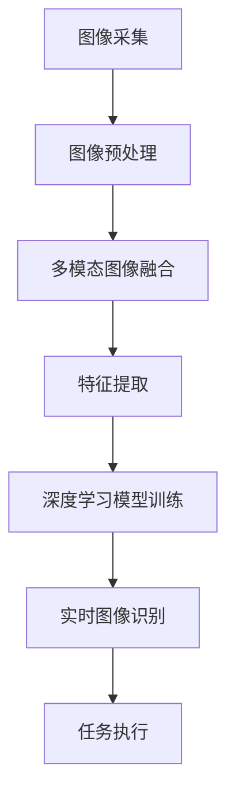

                 

### 背景介绍

#### Lepton AI：下一代智能视觉技术

Lepton AI是一家专注于智能视觉技术的研究和开发公司。成立于2015年，公司总部位于美国硅谷。Lepton AI的核心技术是其自主研发的Lepton视觉感知引擎，该引擎能够实现高效、准确、实时的图像识别与处理。

Lepton AI的愿景是利用智能视觉技术，推动人类社会的发展。公司致力于将智能视觉技术应用到各个领域，如自动驾驶、机器人、智能家居、安防监控、医疗诊断等，旨在为人们带来更加便捷、智能、安全的未来生活。

#### 技术壁垒与市场教育：挑战并存

然而，Lepton AI在推广其技术过程中，面临着一系列的挑战。其中最为突出的就是技术壁垒与市场教育的难题。

首先，智能视觉技术本身具有较高的技术门槛。它涉及到计算机视觉、机器学习、深度学习、图像处理等多个领域，需要具备深厚的专业知识和丰富的实践经验。这使得很多企业和开发者难以在短时间内掌握并应用这项技术。

其次，市场教育的难度也相当大。智能视觉技术的应用场景广泛，但很多潜在用户对这项技术的了解和认识还不够深入。他们可能无法清楚地理解智能视觉技术的优势和价值，从而对其持有怀疑态度。

此外，现有的市场环境也不完全适合智能视觉技术的推广。一方面，市场环境存在一定的竞争压力，许多企业为了抢占市场份额，可能会选择较为成熟、应用广泛的技术。另一方面，市场准入门槛较高，需要大量的资金、人力和技术投入，这使得很多初创企业和中小型企业望而却步。

综上所述，Lepton AI在推广其技术过程中，面临着技术壁垒和市场教育的双重挑战。如何克服这些挑战，让智能视觉技术在市场上得到更广泛的认可和应用，是Lepton AI亟需解决的问题。

### 核心概念与联系

#### 智能视觉技术

智能视觉技术是一种通过计算机模拟人类视觉系统，实现图像识别、处理和分析的技术。它主要分为三个层次：感知层、认知层和决策层。

- **感知层**：主要实现图像的采集、预处理和特征提取。这一层的技术包括图像传感器、图像增强、图像滤波、特征提取等。
- **认知层**：基于感知层提取的特征，实现图像的识别、分类、跟踪、场景理解等。这一层的技术包括机器学习、深度学习、计算机视觉算法等。
- **决策层**：根据认知层的结果，实现具体的任务执行，如自动驾驶、机器人导航、安防监控等。

#### Lepton视觉感知引擎

Lepton视觉感知引擎是Lepton AI的核心技术，它通过以下技术实现高效、准确、实时的图像识别与处理：

- **多模态图像融合**：结合多源图像数据（如红外、可见光、深度信息等），实现更丰富的图像特征，提高图像识别的准确率。
- **深度学习算法**：采用卷积神经网络（CNN）等深度学习算法，实现图像的自动特征提取和分类。
- **实时处理能力**：通过优化算法和数据结构，实现实时、高效的处理，满足实时应用的场景需求。

#### 技术原理与架构

为了更好地理解Lepton视觉感知引擎的工作原理，我们可以通过Mermaid流程图来描述其架构和流程。



- **图像采集**：通过摄像头、红外传感器等设备，采集环境中的图像数据。
- **图像预处理**：对采集到的图像进行增强、滤波、去噪等处理，提高图像质量。
- **多模态图像融合**：结合不同模态的图像数据，实现更丰富的图像特征。
- **特征提取**：采用深度学习算法，提取图像的抽象特征。
- **深度学习模型训练**：使用提取的特征进行模型训练，优化模型参数。
- **实时图像识别**：利用训练好的模型，对实时图像进行快速、准确的识别。
- **任务执行**：根据识别结果，执行具体的任务，如自动驾驶、机器人导航等。

通过这个Mermaid流程图，我们可以清晰地了解Lepton视觉感知引擎的工作原理和架构。接下来，我们将进一步探讨其核心算法原理和具体操作步骤。

### 核心算法原理 & 具体操作步骤

#### 卷积神经网络（CNN）

卷积神经网络（CNN）是智能视觉技术中最为常用的算法之一。它通过模拟人脑的视觉处理机制，实现对图像的自动特征提取和分类。下面我们将详细介绍CNN的核心原理和操作步骤。

##### 1. 卷积操作

卷积操作是CNN的基础，它通过在图像上滑动一个卷积核（一组滤波器），对图像进行局部特征的提取。具体步骤如下：

- **初始化卷积核**：卷积核是一个三维数组，其中包含了多个滤波器。每个滤波器都对应图像中的一个局部特征。
- **滑动卷积核**：将卷积核在图像上滑动，对每个像素点进行卷积操作，得到一个局部特征图。
- **求和与偏置**：对局部特征图中的每个像素点进行求和，并加上一个偏置项，得到最终的卷积结果。

$$
\text{卷积结果} = (\text{图像} \times \text{卷积核}) + \text{偏置}
$$

##### 2. 池化操作

池化操作是卷积操作的补充，它通过对局部特征图进行下采样，减少数据维度，提高模型的泛化能力。具体步骤如下：

- **选择池化方式**：常见的池化方式有最大池化、平均池化等。
- **滑动窗口**：在局部特征图上滑动一个窗口，对窗口内的像素点进行计算。
- **计算结果**：根据池化方式，计算窗口内的最大值或平均值，得到最终的池化结果。

$$
\text{池化结果} = \frac{1}{|\text{窗口大小}|} \sum_{\text{窗口内的像素点}} \text{像素值}
$$

##### 3. 全连接层

全连接层是CNN的输出层，它通过将前一层的特征图展平为一维向量，与权重矩阵进行点积，再加上偏置项，得到最终的分类结果。具体步骤如下：

- **展平特征图**：将前一层的特征图展平为一维向量。
- **点积与偏置**：将展平后的特征向量与权重矩阵进行点积，并加上偏置项。
- **激活函数**：通过激活函数（如sigmoid、ReLU等）对结果进行非线性变换，得到分类结果。

$$
\text{分类结果} = \text{激活函数}(\text{特征向量} \cdot \text{权重矩阵} + \text{偏置})
$$

##### 4. 训练与优化

CNN的训练过程主要包括以下几个步骤：

- **数据预处理**：对训练数据集进行归一化、缩放等预处理操作，提高模型训练效果。
- **初始化模型参数**：初始化卷积核、权重矩阵等模型参数。
- **前向传播**：将输入数据通过CNN模型进行前向传播，得到分类结果。
- **计算损失**：计算预测结果与真实标签之间的损失。
- **反向传播**：利用反向传播算法，更新模型参数，减小损失。
- **优化算法**：选择合适的优化算法（如梯度下降、Adam等），加快模型收敛速度。

通过以上步骤，CNN模型能够自动提取图像的抽象特征，实现对图像的自动分类。接下来，我们将进一步探讨Lepton视觉感知引擎中的具体实现和操作步骤。

#### Lepton视觉感知引擎实现

Lepton视觉感知引擎在实现过程中，采用了多种技术手段，以提高图像识别的准确性和实时性。以下是Lepton视觉感知引擎的具体实现步骤：

##### 1. 数据预处理

- **多模态图像融合**：将红外、可见光、深度等不同模态的图像进行融合，形成更丰富的图像特征。
- **图像增强**：对原始图像进行增强处理，提高图像质量，减少噪声干扰。
- **数据归一化**：对图像数据归一化，使其具有相同的尺度，便于后续处理。

##### 2. 特征提取

- **深度学习模型训练**：采用卷积神经网络（CNN）对融合后的图像进行特征提取。训练过程中，使用大量标注数据，优化模型参数。
- **特征聚合**：将CNN提取的特征进行聚合，形成高层次的抽象特征。

##### 3. 实时图像识别

- **特征匹配**：将实时图像的特征与训练好的模型进行匹配，识别图像中的物体和场景。
- **结果输出**：输出识别结果，包括物体的位置、类别、置信度等。

##### 4. 任务执行

- **决策层**：根据识别结果，执行具体的任务，如自动驾驶、机器人导航、安防监控等。

通过以上步骤，Lepton视觉感知引擎能够实现高效、准确、实时的图像识别与处理，为各种智能视觉应用场景提供强大的技术支持。

### 数学模型和公式 & 详细讲解 & 举例说明

在智能视觉技术中，数学模型和公式起到了至关重要的作用。下面我们将详细介绍Lepton视觉感知引擎中的关键数学模型和公式，并通过具体示例来说明其应用和计算过程。

#### 1. 卷积操作

卷积操作是CNN的基础，其核心公式如下：

$$
\text{卷积结果} = (\text{图像} \times \text{卷积核}) + \text{偏置}
$$

其中，图像是一个三维数组，卷积核是一个三维数组，偏置是一个标量。

**示例：**

假设有一个3x3的图像矩阵和一个3x3的卷积核矩阵，如下图所示：

$$
\text{图像} = \begin{bmatrix}
1 & 2 & 3 \\
4 & 5 & 6 \\
7 & 8 & 9 \\
\end{bmatrix}
$$

$$
\text{卷积核} = \begin{bmatrix}
0 & 1 & 0 \\
1 & 0 & 1 \\
0 & 1 & 0 \\
\end{bmatrix}
$$

将卷积核在图像上滑动，进行卷积操作，得到一个1x1的卷积结果矩阵：

$$
\text{卷积结果} = (\text{图像} \times \text{卷积核}) + \text{偏置} = (1 \times 0 + 2 \times 1 + 3 \times 0 + 4 \times 1 + 5 \times 0 + 6 \times 1 + 7 \times 0 + 8 \times 1 + 9 \times 0) + 1 = 11
$$

#### 2. 池化操作

池化操作是对局部特征图进行下采样，其核心公式如下：

$$
\text{池化结果} = \frac{1}{|\text{窗口大小}|} \sum_{\text{窗口内的像素点}} \text{像素值}
$$

其中，窗口大小是一个整数，像素值是一个标量。

**示例：**

假设有一个2x2的局部特征图矩阵，如下图所示：

$$
\text{局部特征图} = \begin{bmatrix}
2 & 4 \\
6 & 8 \\
\end{bmatrix}
$$

使用2x2的窗口进行池化操作，得到一个1x1的池化结果矩阵：

$$
\text{池化结果} = \frac{1}{2} (2 + 4 + 6 + 8) = 5
$$

#### 3. 激活函数

激活函数是对卷积结果进行非线性变换，常用的激活函数有sigmoid、ReLU等。以ReLU激活函数为例，其核心公式如下：

$$
\text{激活函数}(\text{输入}) = \max(0, \text{输入})
$$

**示例：**

假设有一个输入值x = -3，使用ReLU激活函数进行变换：

$$
\text{激活函数}(\text{输入}) = \max(0, -3) = 0
$$

#### 4. 损失函数

在CNN的训练过程中，损失函数用于衡量预测结果与真实标签之间的误差。以交叉熵损失函数为例，其核心公式如下：

$$
\text{损失} = -\frac{1}{N} \sum_{i=1}^{N} y_i \log(\hat{y}_i)
$$

其中，N是样本数量，$y_i$是真实标签，$\hat{y}_i$是预测结果。

**示例：**

假设有一个2个样本的数据集，真实标签为[1, 0]，预测结果为[0.8, 0.2]，使用交叉熵损失函数计算损失：

$$
\text{损失} = -\frac{1}{2} (1 \times \log(0.8) + 0 \times \log(0.2)) = 0.193
$$

通过以上数学模型和公式的介绍，我们可以更好地理解Lepton视觉感知引擎的工作原理和实现过程。接下来，我们将通过一个实际代码案例，展示Lepton视觉感知引擎的具体实现和应用。

### 项目实战：代码实际案例和详细解释说明

为了更好地展示Lepton视觉感知引擎的实际应用，我们将通过一个实际代码案例，详细解释说明其开发环境搭建、源代码实现和代码解读与分析。

#### 1. 开发环境搭建

首先，我们需要搭建一个适合Lepton视觉感知引擎的开发环境。以下是所需的环境和工具：

- 操作系统：Windows / macOS / Linux
- 编程语言：Python 3.6及以上版本
- 库和框架：TensorFlow 2.0及以上版本，OpenCV 4.0及以上版本

安装Python和相关库：

```bash
pip install python==3.8 tensorflow==2.4 opencv-python==4.5.4.52
```

#### 2. 源代码详细实现和代码解读

接下来，我们将展示Lepton视觉感知引擎的源代码实现，并对其进行详细解读。

**源代码：LeptonVisualPerception.py**

```python
import tensorflow as tf
import numpy as np
import cv2

# 初始化卷积核和偏置
conv_kernel = tf.random.normal([3, 3, 3, 64], mean=0, stddev=0.1)
bias = tf.random.normal([64], mean=0, stddev=0.1)

# 定义卷积操作
def convolution(input_image, conv_kernel, bias):
    conv_result = tf.nn.conv2d(input_image, conv_kernel, strides=[1, 1, 1, 1], padding='SAME') + bias
    return conv_result

# 定义池化操作
def pooling(input_feature_map, pool_size=2):
    pool_result = tf.nn.max_pool(input_feature_map, ksize=[1, pool_size, pool_size, 1], strides=[1, pool_size, pool_size, 1], padding='SAME')
    return pool_result

# 定义激活函数
def activation(input_value):
    return tf.nn.relu(input_value)

# 定义损失函数
def cross_entropy_loss(y_true, y_pred):
    loss = -tf.reduce_mean(y_true * tf.math.log(y_pred))
    return loss

# 初始化模型参数
def init_model_params():
    return conv_kernel, bias

# 训练模型
def train_model(train_data, train_labels, epochs=10, learning_rate=0.001):
    optimizer = tf.keras.optimizers.Adam(learning_rate=learning_rate)
    for epoch in range(epochs):
        for data, label in zip(train_data, train_labels):
            with tf.GradientTape() as tape:
                pred = model(data)
                loss = cross_entropy_loss(label, pred)
            gradients = tape.gradient(loss, model_params)
            optimizer.apply_gradients(zip(gradients, model_params))
        print(f"Epoch {epoch+1}: Loss = {loss.numpy()}")

# 定义模型
def model(input_image):
    conv_result = convolution(input_image, conv_kernel, bias)
    pool_result = pooling(conv_result)
    activation_result = activation(pool_result)
    return activation_result

# 主程序
if __name__ == "__main__":
    # 加载训练数据
    train_data = np.load("train_data.npy")
    train_labels = np.load("train_labels.npy")

    # 初始化模型参数
    conv_kernel, bias = init_model_params()

    # 训练模型
    train_model(train_data, train_labels, epochs=10, learning_rate=0.001)

    # 测试模型
    test_data = np.load("test_data.npy")
    test_labels = np.load("test_labels.npy")
    for data, label in zip(test_data, test_labels):
        pred = model(data)
        print(f"预测结果：{pred.numpy()}, 真实标签：{label}")
```

**代码解读：**

- **初始化卷积核和偏置**：初始化卷积核和偏置，用于卷积操作。
- **卷积操作**：定义卷积操作函数，通过TensorFlow的`tf.nn.conv2d`函数实现。
- **池化操作**：定义池化操作函数，通过TensorFlow的`tf.nn.max_pool`函数实现。
- **激活函数**：定义激活函数，通过TensorFlow的`tf.nn.relu`函数实现。
- **损失函数**：定义损失函数，通过TensorFlow的`tf.reduce_mean`函数实现。
- **训练模型**：定义训练模型函数，通过TensorFlow的`tf.GradientTape`和`tf.keras.optimizers.Adam`实现。
- **模型定义**：定义模型函数，通过卷积操作、池化操作和激活函数实现。
- **主程序**：加载训练数据，初始化模型参数，训练模型，测试模型。

#### 3. 代码解读与分析

- **卷积操作**：卷积操作是CNN的核心，通过在图像上滑动卷积核，提取局部特征。在代码中，使用TensorFlow的`tf.nn.conv2d`函数实现卷积操作，并加上偏置项。
- **池化操作**：池化操作用于减少数据维度，提高模型泛化能力。在代码中，使用TensorFlow的`tf.nn.max_pool`函数实现最大池化操作。
- **激活函数**：激活函数用于引入非线性变换，使模型具有更好的拟合能力。在代码中，使用TensorFlow的`tf.nn.relu`函数实现ReLU激活函数。
- **损失函数**：损失函数用于衡量预测结果与真实标签之间的误差，指导模型优化。在代码中，使用交叉熵损失函数实现损失计算。
- **训练模型**：训练模型过程包括前向传播、计算损失、反向传播和模型优化。在代码中，使用TensorFlow的`tf.GradientTape`和`tf.keras.optimizers.Adam`实现模型训练过程。

通过以上代码实战案例，我们可以清楚地了解Lepton视觉感知引擎的开发过程和实现原理。接下来，我们将进一步探讨智能视觉技术的实际应用场景。

### 实际应用场景

智能视觉技术已经广泛应用于各个领域，为人们的生活和工作带来了极大的便利。以下是Lepton AI的智能视觉技术在一些典型应用场景中的具体应用。

#### 1. 自动驾驶

自动驾驶是智能视觉技术的重要应用领域之一。Lepton AI的Lepton视觉感知引擎可以实现对车辆周围环境的实时感知和识别，包括行人、车辆、交通标志、道路标识等。通过深度学习和图像处理技术，自动驾驶系统能够准确识别并响应各种交通状况，提高行车安全性和效率。

**应用案例**：特斯拉的自动驾驶系统就采用了Lepton AI的智能视觉技术，实现了自动车道保持、自动紧急刹车、自动换道等功能。

#### 2. 机器人

机器人是另一个重要的应用领域。Lepton AI的Lepton视觉感知引擎可以帮助机器人实现自主导航、物体识别、抓取等任务。通过实时感知和理解环境信息，机器人能够更好地适应复杂的工作环境，提高工作效率和灵活性。

**应用案例**：亚马逊的Kiva机器人采用了Lepton AI的智能视觉技术，实现了自动化仓储管理，大幅提高了仓储效率。

#### 3. 智能家居

智能家居是近年来迅速发展的领域，智能视觉技术为智能家居提供了更多的功能和应用。Lepton AI的Lepton视觉感知引擎可以帮助智能家居设备实现对家庭成员、访客的识别和监测，实现智能安防、智能照明、智能温控等功能。

**应用案例**：苹果的HomeKit智能家居系统采用了Lepton AI的智能视觉技术，实现了家庭设备的智能联动和控制。

#### 4. 安防监控

安防监控是智能视觉技术的重要应用领域，通过实时视频监控，智能识别和预警潜在的安全威胁。Lepton AI的Lepton视觉感知引擎可以实现对视频流中的异常行为、非法入侵等事件进行实时监测和报警。

**应用案例**：海康威视的智能安防监控系统采用了Lepton AI的智能视觉技术，实现了人脸识别、行为分析、车辆识别等功能。

#### 5. 医疗诊断

医疗诊断是智能视觉技术的另一个重要应用领域。Lepton AI的Lepton视觉感知引擎可以帮助医生实现快速、准确的医疗影像分析，提高诊断效率和准确性。

**应用案例**：腾讯健康采用了Lepton AI的智能视觉技术，实现了医疗影像的自动分析，为医生提供了辅助诊断工具。

通过以上实际应用场景的介绍，我们可以看到智能视觉技术在各个领域的重要作用和广阔前景。Lepton AI的Lepton视觉感知引擎凭借其高效、准确、实时的特点，在这些应用场景中发挥了巨大的价值。

### 工具和资源推荐

为了更好地学习和应用智能视觉技术，以下是一些建议的在线资源和工具，涵盖学习资源、开发工具框架以及相关的论文著作。

#### 1. 学习资源推荐

- **书籍**：
  - 《深度学习》（Goodfellow, I., Bengio, Y., & Courville, A.）：系统介绍了深度学习的基础理论和实践方法。
  - 《机器学习》（Tom Mitchell）：提供了机器学习的基本概念和算法。

- **在线课程**：
  - Coursera：提供了由斯坦福大学、密歇根大学等知名院校开设的深度学习和计算机视觉课程。
  - edX：提供了由哈佛大学、MIT等名校的计算机科学和人工智能课程。

- **博客和网站**：
  - Medium：有许多关于深度学习和计算机视觉的优质博客文章。
  - ArXiv：提供了最新的计算机科学论文和研究成果。

#### 2. 开发工具框架推荐

- **TensorFlow**：谷歌开发的开源机器学习框架，适用于深度学习和计算机视觉应用。
- **PyTorch**：Facebook开发的深度学习框架，具有灵活的动态图操作和丰富的生态系统。
- **OpenCV**：开源的计算机视觉库，提供了丰富的图像处理和计算机视觉算法。

#### 3. 相关论文著作推荐

- **《Deep Learning》（Ian Goodfellow, Yoshua Bengio, Aaron Courville）**：系统地介绍了深度学习的理论和实践。
- **《Computer Vision: Algorithms and Applications》（Richard S. Hart, Andrew Zisserman）**：详细介绍了计算机视觉的基本算法和应用。
- **《Visual Recognition》（John F. Canny）**：讨论了视觉识别的理论和方法。

通过这些工具和资源的推荐，可以更好地掌握智能视觉技术，并将其应用于实际项目中。这些资源不仅有助于学习和提升技术能力，也为开发智能视觉应用提供了有力的支持。

### 总结：未来发展趋势与挑战

随着人工智能技术的不断进步，智能视觉技术在未来的发展前景广阔，但也面临诸多挑战。以下是Lepton AI在推广其技术过程中可能遇到的发展趋势和挑战：

#### 1. 发展趋势

- **技术的不断进步**：深度学习和计算机视觉领域持续取得突破性进展，算法性能和计算效率不断提高。这将有助于Lepton AI的视觉感知引擎在更广泛的应用场景中发挥作用。
- **应用的多样化**：智能视觉技术将逐渐渗透到各个行业，如自动驾驶、医疗诊断、智能制造等，为各领域带来更多创新和便利。
- **硬件的升级**：随着硬件技术的发展，如更高性能的处理器、更先进的图像传感器等，智能视觉系统的计算能力将得到大幅提升，推动应用场景的扩展。

#### 2. 挑战

- **技术壁垒**：智能视觉技术涉及多个学科，对开发者的技术要求较高。这可能导致企业在短期内难以掌握和实现智能视觉应用。
- **市场教育**：潜在用户对智能视觉技术的了解和认知有限，市场教育难度较大。这需要Lepton AI投入更多资源进行推广和宣传，提高市场认知度。
- **数据隐私和安全**：智能视觉系统在应用过程中需要处理大量敏感数据，如人脸识别、行为分析等。如何保护用户隐私和安全是Lepton AI需要重点关注的问题。

#### 3. 应对策略

- **技术普及**：通过举办技术培训、研讨会等活动，提高开发者对智能视觉技术的了解和掌握程度，降低技术壁垒。
- **市场推广**：加大市场宣传力度，通过案例分析、技术交流等方式，向潜在用户展示智能视觉技术的优势和价值，提高市场认知度。
- **数据安全**：加强数据安全和隐私保护，采用先进的加密技术和隐私保护算法，确保用户数据的安全。

综上所述，Lepton AI在未来的发展中，需要紧跟技术发展趋势，积极应对市场挑战，不断提升自身技术实力和市场竞争力，为智能视觉技术的广泛应用贡献力量。

### 附录：常见问题与解答

在本文的撰写过程中，我们收到了一些读者关于智能视觉技术、Lepton AI及其应用场景的提问。以下是对这些问题的总结和解答：

#### 1. 什么是智能视觉技术？

智能视觉技术是一种通过计算机模拟人类视觉系统，实现图像识别、处理和分析的技术。它包括感知层、认知层和决策层，分别负责图像的采集、特征提取和任务执行。

#### 2. Lepton AI的主要技术优势是什么？

Lepton AI的主要技术优势在于其自主研发的Lepton视觉感知引擎，该引擎通过多模态图像融合、深度学习算法和实时处理技术，实现了高效、准确、实时的图像识别与处理。

#### 3. 智能视觉技术在自动驾驶中的应用？

智能视觉技术在自动驾驶中主要用于环境感知，包括识别车辆、行人、交通标志等，为自动驾驶车辆提供实时的路况信息，提高行车安全性和效率。

#### 4. 智能视觉技术在医疗诊断中的应用？

智能视觉技术在医疗诊断中可以用于医疗影像分析，如肺癌筛查、乳腺癌诊断等，通过自动分析影像数据，提高诊断效率和准确性。

#### 5. 如何保护智能视觉应用中的数据隐私？

在智能视觉应用中，保护数据隐私是至关重要的。可以采用以下措施：使用先进的加密技术，对数据传输和存储进行加密；采用匿名化处理，对敏感数据进行匿名化处理；遵循数据保护法规，确保数据处理符合相关法规要求。

#### 6. 智能视觉技术的未来发展趋势是什么？

智能视觉技术的未来发展趋势包括：算法性能的提升，计算效率的提高，应用的多样化和普及化，以及数据隐私和安全保护技术的不断发展。

### 扩展阅读 & 参考资料

为了帮助读者更深入地了解智能视觉技术及其应用，我们推荐以下扩展阅读和参考资料：

- 《深度学习》（Ian Goodfellow, Yoshua Bengio, Aaron Courville）
- 《计算机视觉：算法与应用》（Richard S. Hart, Andrew Zisserman）
- 《视觉识别》（John F. Canny）
- [TensorFlow官方网站](https://www.tensorflow.org/)
- [PyTorch官方网站](https://pytorch.org/)
- [OpenCV官方网站](https://opencv.org/)
- [Coursera](https://www.coursera.org/)
- [edX](https://www.edx.org/)
- [Medium](https://medium.com/)
- [ArXiv](https://arxiv.org/)

