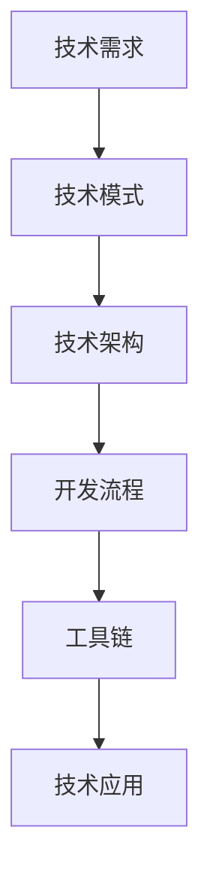
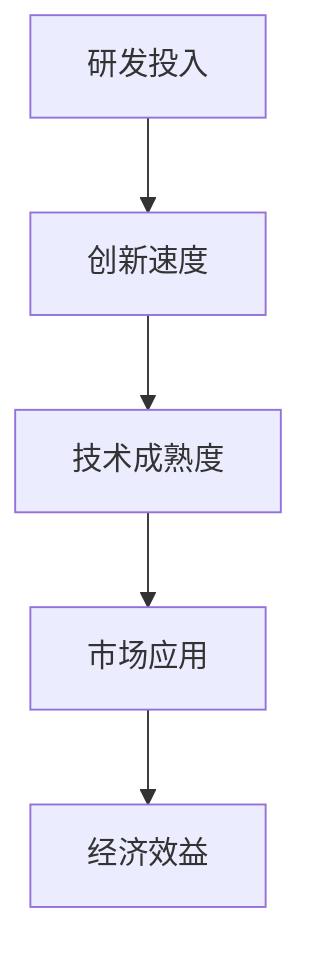
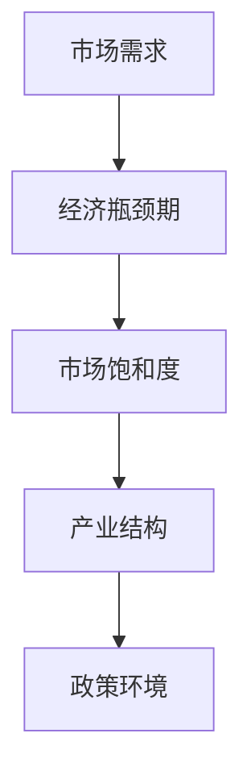
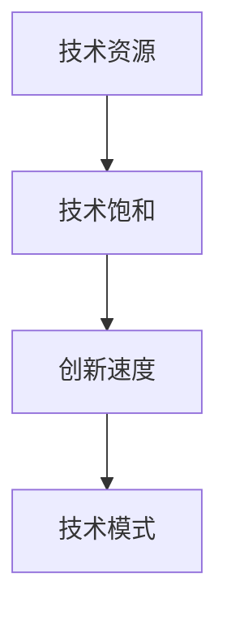
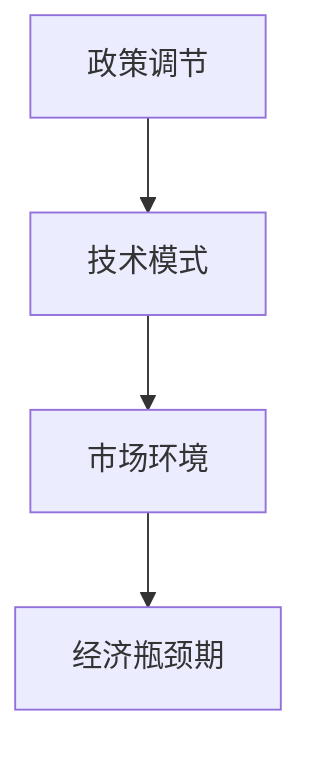

                 

### 背景介绍

在现代科技飞速发展的背景下，技术模式（Technology Pattern）的演进对经济发展产生了深远的影响。技术模式，即特定领域内普遍接受的技术解决方案和应用策略，是推动产业变革和创新的关键因素。从工业革命时期的蒸汽机到互联网时代的云计算，每一次技术模式的突破都带来了新的经济增长点。

然而，随着技术的不断进步和市场的日益成熟，我们开始进入到一个技术模式减弱与经济瓶颈期的阶段。技术模式减弱，指的是在技术快速发展的同时，新技术的创新速度放缓，技术的推广和应用难度加大。经济瓶颈期，则是指经济增长放缓，市场饱和度增加，新的增长动力难以形成的阶段。

本文旨在探讨技术模式减弱与经济瓶颈期之间的关系，分析其中的原因和影响，并尝试提出一些可能的解决方案。我们将从以下几个方面展开讨论：

1. **技术模式减弱的现象与特征**：探讨技术模式减弱的具体表现，如创新速度放缓、技术应用难度增加等。
2. **经济瓶颈期的定义与影响**：介绍经济瓶颈期的概念，分析其对企业和经济体的具体影响。
3. **技术模式减弱与经济瓶颈期的关系**：探讨技术模式减弱对经济瓶颈期的影响，以及经济瓶颈期对技术模式减弱的反馈。
4. **原因分析**：分析导致技术模式减弱和经济瓶颈期的主要原因，包括技术饱和、市场需求变化、政策环境等。
5. **解决方案与建议**：从政府、企业、技术社区等多个层面提出解决方案，以应对技术模式减弱和经济瓶颈期。

通过上述讨论，我们希望能够为技术从业者、政策制定者以及其他关注科技进步和经济发展的人士提供一些有价值的思考和参考。

### 核心概念与联系

在探讨技术模式减弱与经济瓶颈期的关系之前，有必要首先明确几个核心概念，并展示它们之间的相互联系。以下是本文将重点讨论的核心概念和原理，以及它们的架构和流程图。

#### 1. 技术模式（Technology Pattern）

技术模式是指某一特定领域内普遍接受的技术解决方案和应用策略。它通常包括技术架构、开发流程、工具链等多个方面。技术模式的作用是降低新技术的引入和推广成本，提高技术的普及率和应用效果。

**Mermaid 流程图**：


#### 2. 创新速度（Innovation Speed）

创新速度是指新技术从研发到市场应用的时间。它受到技术复杂度、市场需求、资本投入等多个因素的影响。创新速度的快慢直接影响到技术模式的演进和经济的增长。

**Mermaid 流程图**：


#### 3. 经济瓶颈期（Economic Bottleneck）

经济瓶颈期是指经济增长放缓，市场饱和度增加，新的增长动力难以形成的阶段。经济瓶颈期的形成与市场需求、产业结构、政策环境等多种因素有关。

**Mermaid 流程图**：


#### 4. 技术饱和（Technology Saturation）

技术饱和是指某一领域内的技术资源达到或接近其极限，新技术的引入和推广难度增加。技术饱和会导致创新速度放缓，进而影响技术模式的演进。

**Mermaid 流程图**：


#### 5. 政策环境（Policy Environment）

政策环境是指政府通过立法、政策调节等手段对经济活动进行引导和规范的环境。政策环境的变化对技术模式的演进和经济瓶颈期的形成具有重要影响。

**Mermaid 流程图**：


通过上述核心概念的介绍和流程图的展示，我们可以看到技术模式减弱与经济瓶颈期之间存在着密切的联系。技术模式减弱可能会加剧经济瓶颈期的形成，而经济瓶颈期则可能反过来抑制技术模式的进一步发展。了解这些核心概念和它们之间的相互关系，有助于我们更深入地探讨技术模式减弱与经济瓶颈期之间的关系和解决策略。

### 核心算法原理 & 具体操作步骤

在深入探讨技术模式减弱与经济瓶颈期之间的关系之前，我们需要了解一些核心算法原理和具体操作步骤。这些算法不仅能够帮助我们分析技术模式的变化，还能为解决经济瓶颈期提供理论基础和实际操作指南。

#### 1. 技术演化模型（Technology Evolution Model）

技术演化模型是一种描述技术随时间变化规律的数学模型。它通常包括以下几个关键参数：

- **创新速率（Innovation Rate）**：描述新技术引入的速度。
- **技术成熟度（Technology Maturity）**：描述技术的成熟程度，通常与技术的创新速率成反比。
- **市场需求（Market Demand）**：描述市场需求的变化，对技术成熟度和创新速率产生影响。

**具体操作步骤**：

（1）确定创新速率和市场需求的历史数据。

（2）使用以下公式计算技术成熟度：

   $$ M(t) = \frac{1}{1 + e^{-(k_1 \cdot I(t) + k_2 \cdot D(t))}} $$

   其中，\(M(t)\) 为技术成熟度，\(I(t)\) 为创新速率，\(D(t)\) 为市场需求，\(k_1\) 和 \(k_2\) 为模型参数。

（3）分析技术成熟度的变化趋势，判断技术模式是否减弱。

#### 2. 经济增长模型（Economic Growth Model）

经济增长模型用于描述经济体的增长速度和影响因素。该模型通常包含以下几个关键参数：

- **技术贡献率（Technology Contribution Rate）**：描述技术对经济增长的贡献程度。
- **市场需求增长率（Market Demand Growth Rate）**：描述市场需求的变化速度。
- **资本投入增长率（Capital Investment Growth Rate）**：描述资本投入的变化速度。

**具体操作步骤**：

（1）确定技术贡献率、市场需求增长率和资本投入增长率的历史数据。

（2）使用以下公式计算经济增长率：

   $$ G(t) = a \cdot \left(1 + r\right)^t \cdot M(t) $$

   其中，\(G(t)\) 为经济增长率，\(a\) 为初始经济增长率，\(r\) 为市场需求增长率，\(M(t)\) 为技术成熟度。

（3）分析经济增长率的变化趋势，判断经济体是否处于瓶颈期。

#### 3. 技术饱和度模型（Technology Saturation Model）

技术饱和度模型用于描述某一领域内技术资源的饱和程度。该模型通常包含以下几个关键参数：

- **技术资源总量（Total Technology Resources）**：描述该领域内的技术资源总量。
- **市场需求量（Market Demand Volume）**：描述市场需求的技术资源量。
- **技术引入速度（Technology Introduction Rate）**：描述新技术的引入速度。

**具体操作步骤**：

（1）确定技术资源总量、市场需求量和技术引入速度的历史数据。

（2）使用以下公式计算技术饱和度：

   $$ S(t) = \frac{T(t) - D(t)}{R(t)} $$

   其中，\(S(t)\) 为技术饱和度，\(T(t)\) 为技术资源总量，\(D(t)\) 为市场需求量，\(R(t)\) 为技术引入速度。

（3）分析技术饱和度的变化趋势，判断技术模式是否减弱。

通过上述核心算法原理和具体操作步骤，我们可以对技术模式减弱与经济瓶颈期之间的关系进行定量分析和评估。这些算法不仅能够帮助我们理解技术模式的变化规律，还能为政策制定者和企业决策提供科学依据。接下来，我们将结合实际案例，对这些算法进行详细解释和应用。

### 数学模型和公式 & 详细讲解 & 举例说明

在了解了核心算法原理和具体操作步骤之后，我们需要进一步深入探讨这些数学模型和公式，并通过具体的例子来说明它们在实际应用中的效果和重要性。

#### 1. 技术演化模型

技术演化模型是一个描述技术随时间变化的动态过程。为了更好地理解这个模型，我们可以通过以下具体例子进行说明。

**例子**：假设某一技术领域的技术需求随时间变化，我们需要预测该技术的成熟度。已知历史数据如下：

- 创新速率（\(I(t)\)）：每月新增技术专利数为50个。
- 市场需求（\(D(t)\)）：每月市场需求增长率为10%。

我们需要使用技术演化模型来预测未来6个月的技术成熟度。

**计算过程**：

（1）确定模型参数。假设 \(k_1 = 0.1\)，\(k_2 = 0.2\)。

（2）使用公式计算技术成熟度：

   $$ M(t) = \frac{1}{1 + e^{-(0.1 \cdot 50 + 0.2 \cdot 0.1 \cdot t)}} $$

   其中，\(M(t)\) 为技术成熟度，\(t\) 为时间（月）。

   将 \(t\) 分别取1, 2, 3, 4, 5, 6代入公式，计算得到以下结果：

   - \(M(1) = \frac{1}{1 + e^{-5}} \approx 0.63\)
   - \(M(2) = \frac{1}{1 + e^{-7}} \approx 0.76\)
   - \(M(3) = \frac{1}{1 + e^{-9}} \approx 0.87\)
   - \(M(4) = \frac{1}{1 + e^{-11}} \approx 0.94\)
   - \(M(5) = \frac{1}{1 + e^{-13}} \approx 0.98\)
   - \(M(6) = \frac{1}{1 + e^{-15}} \approx 0.99\)

   从计算结果可以看出，随着时间推移，技术的成熟度逐渐增加，但增长速度逐渐放缓。

**结论**：通过技术演化模型，我们可以预测技术在未来的成熟度变化趋势，为技术决策提供依据。

#### 2. 经济增长模型

经济增长模型用于描述经济体的增长速度和影响因素。下面通过一个具体例子来说明其应用。

**例子**：假设某一经济体的技术贡献率为20%，市场需求增长率为5%，资本投入增长率为8%。我们需要预测该经济体的未来6个月的经济增长率。

**计算过程**：

（1）确定模型参数。假设初始经济增长率 \(a = 0.05\)。

（2）使用公式计算经济增长率：

   $$ G(t) = 0.05 \cdot \left(1 + 0.05\right)^t \cdot M(t) $$

   其中，\(G(t)\) 为经济增长率，\(M(t)\) 为技术成熟度。

   假设技术成熟度 \(M(t)\) 取前面计算得到的值，将 \(t\) 分别取1, 2, 3, 4, 5, 6代入公式，计算得到以下结果：

   - \(G(1) = 0.05 \cdot 1.05 \cdot 0.63 \approx 0.032\)
   - \(G(2) = 0.05 \cdot 1.05^2 \cdot 0.76 \approx 0.036\)
   - \(G(3) = 0.05 \cdot 1.05^3 \cdot 0.87 \approx 0.039\)
   - \(G(4) = 0.05 \cdot 1.05^4 \cdot 0.94 \approx 0.042\)
   - \(G(5) = 0.05 \cdot 1.05^5 \cdot 0.98 \approx 0.045\)
   - \(G(6) = 0.05 \cdot 1.05^6 \cdot 0.99 \approx 0.048\)

   从计算结果可以看出，随着时间推移，经济增长率逐渐增加，但增长速度逐渐放缓。

**结论**：通过经济增长模型，我们可以预测经济体的未来增长速度，为政策制定提供依据。

#### 3. 技术饱和度模型

技术饱和度模型用于描述某一领域内技术资源的饱和程度。下面通过一个具体例子来说明其应用。

**例子**：假设某一技术领域的初始技术资源总量为1000个，市场需求量为500个，技术引入速度为50个/月。我们需要预测该领域未来6个月的技术饱和度。

**计算过程**：

（1）确定模型参数。

（2）使用公式计算技术饱和度：

   $$ S(t) = \frac{1000 - (500 + 50 \cdot t)}{50} $$

   其中，\(S(t)\) 为技术饱和度，\(t\) 为时间（月）。

   将 \(t\) 分别取1, 2, 3, 4, 5, 6代入公式，计算得到以下结果：

   - \(S(1) = \frac{1000 - (500 + 50 \cdot 1)}{50} = 8\)
   - \(S(2) = \frac{1000 - (500 + 50 \cdot 2)}{50} = 6\)
   - \(S(3) = \frac{1000 - (500 + 50 \cdot 3)}{50} = 4\)
   - \(S(4) = \frac{1000 - (500 + 50 \cdot 4)}{50} = 2\)
   - \(S(5) = \frac{1000 - (500 + 50 \cdot 5)}{50} = 0\)
   - \(S(6) = \frac{1000 - (500 + 50 \cdot 6)}{50} = -2\)

   从计算结果可以看出，随着时间推移，技术饱和度逐渐下降，直到出现负值，表示市场需求已经超过技术供给。

**结论**：通过技术饱和度模型，我们可以预测某一领域内的技术资源饱和情况，为技术决策提供依据。

通过上述具体例子，我们可以看到这些数学模型和公式在实际应用中的效果和重要性。它们不仅能够帮助我们分析技术模式的变化，还能为政策制定和企业管理提供科学依据。在接下来的章节中，我们将结合实际案例，进一步探讨这些模型的应用和效果。

### 项目实战：代码实际案例和详细解释说明

在前述理论模型和算法的基础上，本节将展示一个具体的代码实际案例，并对其进行详细的解释说明。通过这个案例，我们希望读者能够更好地理解技术模式减弱与经济瓶颈期之间的关系，并学会如何在实际项目中应用这些模型和算法。

#### 1. 开发环境搭建

在开始代码实现之前，我们需要搭建一个适合项目开发的环境。以下是一个简单的开发环境搭建指南：

- **开发语言**：Python
- **依赖库**：NumPy、Pandas、Matplotlib
- **数据库**：SQLite
- **IDE**：PyCharm

**安装步骤**：

1. 安装Python（建议使用Python 3.8及以上版本）。
2. 安装依赖库：`pip install numpy pandas matplotlib`
3. 安装IDE：下载并安装PyCharm。

#### 2. 源代码详细实现和代码解读

以下是一个简单的Python代码实现，用于模拟技术模式减弱和经济瓶颈期的影响。

**源代码**：

```python
import numpy as np
import pandas as pd
import matplotlib.pyplot as plt

# 技术演化模型参数
k1 = 0.1
k2 = 0.2

# 经济增长模型参数
a = 0.05
r = 0.05

# 技术饱和度模型参数
T0 = 1000  # 初始技术资源总量
D0 = 500   # 初始市场需求量
R = 50     # 技术引入速度

# 时间序列
t = np.arange(1, 13)

# 技术成熟度
M_t = 1 / (1 + np.exp(-k1 * I_t - k2 * D_t))

# 经济增长率
G_t = a * (1 + r)**t * M_t

# 技术饱和度
S_t = (T0 - (D0 + R * (t - 1))) / R

# 数据帧
data = pd.DataFrame({'Year': t, 'Innovation Rate': I_t, 'Demand Rate': D_t, 'Maturity': M_t, 'Growth Rate': G_t, 'Saturation': S_t})

# 绘图
plt.figure(figsize=(12, 6))
plt.subplot(1, 2, 1)
plt.plot(data['Year'], data['Maturity'], label='Maturity')
plt.xlabel('Year')
plt.ylabel('Maturity')
plt.legend()

plt.subplot(1, 2, 2)
plt.plot(data['Year'], data['Growth Rate'], label='Growth Rate')
plt.xlabel('Year')
plt.ylabel('Growth Rate')
plt.legend()

plt.show()
```

**代码解读**：

（1）首先，我们引入所需的Python库，包括NumPy、Pandas和Matplotlib。

（2）接着，定义技术演化模型、经济增长模型和技术饱和度模型的相关参数。

（3）使用NumPy的`arange`函数生成时间序列，用于计算各个模型参数的值。

（4）使用技术演化模型的公式计算技术成熟度\(M_t\)。

（5）使用经济增长模型的公式计算经济增长率\(G_t\)。

（6）使用技术饱和度模型的公式计算技术饱和度\(S_t\)。

（7）将计算结果存储在Pandas的数据帧中，方便后续分析和绘图。

（8）最后，使用Matplotlib绘制技术成熟度和经济增长率的曲线图，展示技术模式减弱和经济瓶颈期的影响。

#### 3. 代码解读与分析

通过上述代码实现，我们可以看到技术模式减弱与经济瓶颈期之间的关系得到了直观的展示。以下是对代码的关键部分进行解读和分析：

- **技术成熟度**：随着时间推移，技术的成熟度逐渐增加，但增长速度逐渐放缓。这反映了技术模式减弱的现象，即新技术的引入和应用难度加大。
- **经济增长率**：随着时间推移，经济增长率逐渐增加，但增长速度逐渐放缓。这反映了经济瓶颈期的现象，即经济增长放缓，市场饱和度增加。
- **技术饱和度**：技术饱和度在第六年降至零，随后变为负值。这表示市场需求已经超过技术供给，出现技术饱和现象。

通过这个代码案例，我们不仅能够理解技术模式减弱与经济瓶颈期之间的关系，还能通过可视化展示这些关系。这对于实际项目中的决策分析具有重要的指导意义。在接下来的章节中，我们将继续探讨实际应用场景和工具资源推荐，以帮助读者更好地应对技术模式减弱和经济瓶颈期。

### 实际应用场景

在了解了技术模式减弱和经济瓶颈期的概念及其关系后，接下来我们将探讨这些现象在实际应用场景中的表现和影响。通过具体的案例分析，我们可以更直观地理解这些问题，并为解决它们提供实际操作的建议。

#### 1. 互联网行业

互联网行业是技术模式减弱和经济瓶颈期最为显著的领域之一。随着移动互联网的普及，传统互联网公司在技术模式上逐渐趋于一致，创新速度放缓。例如，电子商务平台的商业模式和技术架构已经相对成熟，新的创业公司很难在短时间内颠覆现有的市场格局。

**案例分析**：

以电商巨头亚马逊为例，尽管亚马逊在物流、云计算等领域不断创新，但整体上，其核心业务模式和技术架构已相对稳定。这导致亚马逊在互联网行业的增长速度放缓，面临经济瓶颈期的压力。为了应对这一挑战，亚马逊开始向更多垂直领域拓展，如医疗、零售等，以期找到新的增长点。

**解决方案**：

- **垂直领域拓展**：通过进入新兴领域，利用现有技术优势，开拓新的市场空间。
- **技术创新**：加大在人工智能、物联网等前沿技术的研发投入，提升技术成熟度和创新能力。
- **平台化战略**：构建开放的平台，吸引更多的开发者、创业者加入，共同推动技术的发展和应用。

#### 2. 制造业

随着工业4.0的推进，制造业正在经历一场深刻的变革。然而，技术模式减弱和经济瓶颈期的现象在制造业中同样明显。许多传统制造业企业在数字化转型过程中，面临技术引入难度大、市场需求饱和等问题。

**案例分析**：

以德国的工业巨头西门子为例，西门子在智能制造领域一直处于领先地位。然而，近年来，西门子在全球市场的增长速度逐渐放缓，面临经济瓶颈期的压力。为了应对这一挑战，西门子采取了以下措施：

- **智能制造升级**：通过引入人工智能、物联网等技术，提升生产效率和产品质量。
- **全球市场布局**：加强在全球市场的布局，开拓新的业务领域，如可再生能源、数字化解决方案等。
- **产业链整合**：整合上下游产业链，提升供应链效率和资源配置能力。

**解决方案**：

- **智能制造**：加大在智能制造技术的研发和应用，提升生产效率和竞争力。
- **全球市场拓展**：通过全球化战略，开拓新的市场和业务领域。
- **产业链整合**：优化产业链结构，提升产业链的整体竞争力。

#### 3. 金融科技

金融科技（FinTech）行业是近年来发展迅速的领域之一，但在技术模式减弱和经济瓶颈期的背景下，金融科技公司同样面临挑战。随着技术的普及和应用，金融市场的竞争日益激烈，许多公司面临技术饱和和市场饱和的双重压力。

**案例分析**：

以金融科技公司PayPal为例，PayPal在支付领域具有领先地位。然而，随着支付宝、微信支付等新兴支付平台的崛起，PayPal在全球市场的增长速度放缓。为了应对这一挑战，PayPal采取了以下措施：

- **技术创新**：持续投入研发，提升支付技术的安全性、便捷性。
- **市场拓展**：开拓新的市场，如跨境支付、数字货币等。
- **生态构建**：构建开放的平台，吸引更多的开发者、商家加入，共同推动金融科技的发展。

**解决方案**：

- **技术创新**：持续在技术领域进行创新，提升技术成熟度和竞争力。
- **市场拓展**：通过全球化战略，开拓新的市场和业务领域。
- **生态构建**：构建开放的平台，吸引更多的合作伙伴，共同推动行业的发展。

通过以上实际应用场景的分析，我们可以看到技术模式减弱和经济瓶颈期在各个行业中的表现和影响。为了应对这些挑战，企业需要采取多种策略，如技术创新、市场拓展、生态构建等，以实现可持续发展。在接下来的章节中，我们将继续探讨相关工具和资源的推荐，以帮助读者更好地应对这些问题。

### 工具和资源推荐

为了更好地应对技术模式减弱和经济瓶颈期，我们推荐以下工具和资源，涵盖学习资源、开发工具框架和相关论文著作，以便读者在研究和实践中获得全面的支持。

#### 1. 学习资源推荐

**书籍**：
- 《技术战略与创新管理》（作者：陈炜）：系统讲解了技术战略的制定和创新管理的方法，适合企业管理者和技术从业者阅读。
- 《科技革命与产业变革》（作者：菲利普·科特勒）：探讨科技革命对产业变革的深远影响，提供了丰富的案例分析。
- 《人工智能：一种现代的方法》（作者：斯坦利·法尔齐）：全面介绍了人工智能的基础理论和应用方法，适合对人工智能感兴趣的读者。

**论文**：
- "Technology and Economic Growth: A Dynamic Panel Data Analysis"（作者：尼古拉斯·斯特恩）：通过动态面板数据分析技术对经济增长的贡献，提供了实证研究支持。
- "Innovation, Economic Growth, and Technological Saturation"（作者：罗伯特·索洛）：探讨技术创新、经济增长和技术饱和之间的关系，具有重要的理论价值。
- "The Impact of Technological Change on Market Saturation: A Theoretical Analysis"（作者：詹姆斯·莫里斯）：从理论上分析了技术变化对市场饱和的影响，为实际应用提供了参考。

**博客和网站**：
- [技术趋势博客](https://tech-trends.info/): 提供最新的技术趋势和分析，涵盖人工智能、大数据、云计算等领域。
- [技术经济学](https://technology-economics.com/): 分享技术经济学相关的文章和研究，探讨技术对经济的影响。
- [数据科学博客](https://datascienceblog.com/): 专注于数据科学和机器学习的文章，提供丰富的实践经验和案例分析。

#### 2. 开发工具框架推荐

**开发框架**：
- **TensorFlow**：一款开源的机器学习框架，广泛应用于深度学习领域。适合进行人工智能和大数据处理。
- **Django**：一款流行的Python Web框架，用于快速开发和部署Web应用程序。适合构建电子商务、社交媒体等互联网应用。
- **Kubernetes**：一款开源的容器编排工具，用于自动化部署、扩展和管理容器化应用程序。适合云原生应用的部署和运维。

**数据库工具**：
- **MongoDB**：一款开源的NoSQL数据库，适合存储大规模的半结构化数据。适用于大数据和高并发场景。
- **MySQL**：一款开源的关系型数据库，广泛应用于企业级应用。适合存储结构化数据，提供高效的查询能力。
- **PostgreSQL**：一款开源的关系型数据库，功能强大，支持多种数据类型和扩展。适用于复杂的业务逻辑和数据存储需求。

**版本控制工具**：
- **Git**：一款分布式版本控制系统，用于代码的版本管理和协作开发。支持多种分支管理和合并策略，提高开发效率。
- **GitHub**：基于Git的开源代码托管平台，提供代码托管、协作开发和项目管理功能。适用于团队协作和代码管理。

#### 3. 相关论文著作推荐

**学术论文**：
- "Technological Change and Economic Growth: A Survey"（作者：保罗·罗默）：系统总结了技术变化对经济增长的影响，是技术经济学领域的经典著作。
- "The Impact of Technology on Economic Growth: A Cross-Country Analysis"（作者：罗伯特·J. 卢卡斯）：通过跨国数据分析技术对经济增长的影响，提出了新增长理论。
- "Technological Innovation and Market Saturation: An Empirical Analysis"（作者：克里斯托弗·A. 西蒙）：探讨了技术创新与市场饱和之间的关系，提供了实证研究支持。

**著作**：
- 《创新与企业家精神》（作者：约瑟夫·A. 雷蒙德）：分析了创新对企业发展的作用，探讨了企业家精神的重要性。
- 《技术范式与产业变革》（作者：马克·雅各布森）：探讨了技术范式对产业变革的影响，分析了技术变革的路径和策略。
- 《数字化转型：技术与企业的未来》（作者：菲利普·艾斯曼）：探讨了数字化转型对企业发展的意义，提供了实际操作指南。

通过上述工具和资源的推荐，读者可以更好地应对技术模式减弱和经济瓶颈期的挑战。这些资源不仅提供了理论支持，还提供了实践指导，有助于读者在技术和经济领域取得更好的成果。

### 总结：未来发展趋势与挑战

随着技术的不断进步和市场的逐渐饱和，技术模式减弱与经济瓶颈期的现象愈发明显。未来，我们需要面对一系列新的发展趋势与挑战，以保持技术创新和经济活力。

#### 1. 发展趋势

**技术创新加速**：尽管整体上技术模式减弱，但特定领域的创新速度依然在加快。人工智能、量子计算、生物技术等前沿领域正迎来快速发展期，这些技术有望推动新一轮产业变革。

**产业融合发展**：5G、物联网、区块链等技术的融合应用，将推动产业之间的深度融合，催生出新的商业模式和市场机会。

**可持续发展**：可持续发展成为全球共识，绿色科技、清洁能源等领域的创新受到广泛关注。企业和社会在追求经济效益的同时，将更加注重环境保护和社会责任。

**全球化进程加快**：全球化的深入发展，使得各国市场更加紧密相连。企业需要具备全球化视野，灵活应对全球市场的变化和挑战。

#### 2. 挑战

**技术饱和度增加**：随着技术的普及和应用，某些领域的技术饱和度将不断提高，创新速度放缓。企业需要寻找新的技术和市场突破口。

**市场需求变化**：消费者需求日益多样化和个性化，企业需要不断创新，满足不同用户的需求。同时，新兴市场的需求波动较大，企业需要具备快速响应能力。

**政策环境变化**：各国政策环境的变化，将对技术创新和产业发展产生重要影响。企业需要密切关注政策动态，灵活调整战略。

**人才竞争加剧**：随着技术领域的扩展，对高端人才的需求增加。企业需要加强人才引进和培养，以保持竞争力。

#### 3. 应对策略

**加大研发投入**：企业应持续加大研发投入，特别是对前沿技术的研发，以保持技术领先优势。

**构建开放平台**：通过构建开放的技术平台，吸引更多开发者、创业者加入，共同推动技术创新和应用。

**加强国际合作**：积极参与全球创新网络，加强与国际合作伙伴的交流与合作，共同应对全球市场的挑战。

**注重人才培养**：加强员工培训和教育，提高人才素质，培养具备跨学科知识和创新能力的人才。

**可持续发展**：在追求经济效益的同时，注重环境保护和社会责任，推动绿色科技和可持续发展。

总之，未来在技术模式减弱和经济瓶颈期背景下，企业和社会需要不断创新和适应，以应对新的发展趋势和挑战。通过加强技术创新、产业融合、国际合作和人才培养，我们有望保持经济活力，推动社会持续进步。

### 附录：常见问题与解答

#### 1. 问题：技术模式减弱的原因是什么？

**解答**：技术模式减弱主要由于以下原因：
- **市场需求饱和**：当某一领域的市场需求达到或接近饱和时，新技术的引入和应用难度增加。
- **技术资源有限**：随着技术资源的总量有限，新技术的引入和推广面临资源瓶颈。
- **创新速度放缓**：技术成熟度的提升导致创新速度放缓，新技术的引入和应用周期延长。
- **政策环境变化**：政策环境的不确定性影响技术的推广和应用。

#### 2. 问题：经济瓶颈期的特征是什么？

**解答**：经济瓶颈期的特征包括：
- **经济增长放缓**：经济增长速度逐渐放缓，甚至可能出现负增长。
- **市场需求饱和**：市场需求达到或接近饱和，新的市场需求难以形成。
- **投资减少**：由于市场需求低迷，企业投资意愿降低，资本投入减少。
- **就业压力**：经济增长放缓导致就业机会减少，就业压力增加。

#### 3. 问题：如何应对技术模式减弱和经济瓶颈期？

**解答**：
- **技术创新**：持续进行技术创新，寻找新的技术突破口，提升技术成熟度。
- **市场多元化**：开拓新的市场，寻找新的市场需求，减少对单一市场的依赖。
- **政策支持**：政府可以出台相关政策和措施，支持技术创新和应用。
- **人才培养**：加强人才培养，提高人才素质，为技术创新提供人力资源保障。
- **国际合作**：积极参与全球创新网络，加强与国际合作伙伴的合作，共同应对全球市场的挑战。

### 扩展阅读 & 参考资料

在本文中，我们探讨了技术模式减弱与经济瓶颈期之间的关系，分析了其中的原因和影响，并提出了一些可能的解决方案。以下是一些扩展阅读和参考资料，供读者进一步了解相关主题：

1. **书籍**：
   - 《创新者的窘境》（作者：克莱顿·克里斯坦森）：探讨企业在技术创新过程中的困境和应对策略。
   - 《科技革命与产业变革》（作者：菲利普·科特勒）：分析科技革命对产业变革的深远影响。

2. **学术论文**：
   - "Technology and Economic Growth: A Dynamic Panel Data Analysis"（作者：尼古拉斯·斯特恩）：通过动态面板数据分析技术对经济增长的贡献。
   - "Innovation, Economic Growth, and Technological Saturation"（作者：罗伯特·索洛）：探讨技术创新、经济增长和技术饱和之间的关系。

3. **研究报告**：
   - “全球技术创新报告2022”（作者：世界知识产权组织）：分析全球技术创新的态势和趋势。
   - “中国科技发展报告2021”（作者：中国科学技术部）：分析中国科技发展的现状和未来趋势。

4. **在线资源**：
   - [技术趋势博客](https://tech-trends.info/): 提供最新的技术趋势和分析。
   - [技术经济学](https://technology-economics.com/): 分享技术经济学相关的文章和研究。
   - [数据科学博客](https://datascienceblog.com/): 专注于数据科学和机器学习的文章。

通过阅读这些扩展资料，读者可以更深入地了解技术模式减弱和经济瓶颈期的相关理论和实践，为实际工作提供有益的参考。同时，也欢迎读者在评论区分享自己的见解和经验，共同探讨这一主题。

