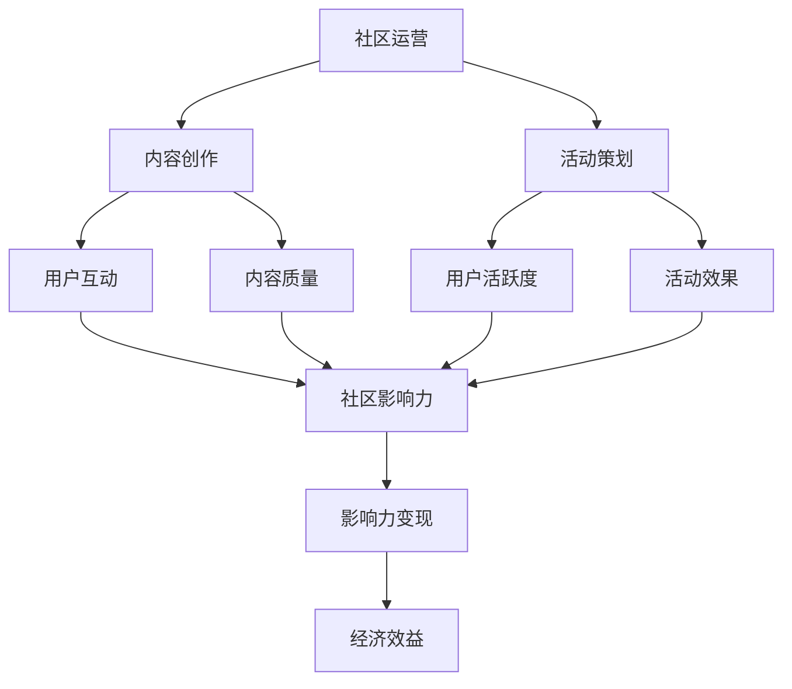

                 

### 背景介绍

随着互联网的快速发展，技术社区已成为科技从业人员分享知识、交流经验、寻找合作的重要平台。在这些社区中，运营者通过提供有价值的内容、营造良好的交流氛围，不仅提升了社区的活跃度，还吸引了大量关注和流量。然而，如何将社区的影响力转化为实际的经济效益，成为了一个备受关注的问题。

本文旨在探讨技术社区运营中的影响力变现问题。通过分析社区运营的核心环节、影响力变现的机制以及成功的案例分析，希望能够为技术社区运营者提供一些有益的启示。本文将从以下几方面展开：

1. **核心概念与联系**：介绍社区运营、影响力变现等相关概念，并绘制 Mermaid 流程图，展示它们之间的关联。
2. **核心算法原理 & 具体操作步骤**：详细解释如何通过内容创作、活动策划等手段提升社区影响力，并实现变现。
3. **数学模型和公式 & 详细讲解 & 举例说明**：运用数学模型和公式分析社区运营效果，并结合实际案例进行说明。
4. **项目实战：代码实际案例和详细解释说明**：通过实际项目案例，展示如何实现社区运营中的影响力变现。
5. **实际应用场景**：分析技术社区运营在不同领域的应用，探讨其变现潜力。
6. **工具和资源推荐**：推荐学习资源、开发工具框架和相关论文著作。
7. **总结：未来发展趋势与挑战**：总结文章要点，展望技术社区运营的未来。

希望通过本文的探讨，能够为技术社区运营者提供一些有价值的参考和指导，从而实现社区的影响力变现，为社区和自身创造更大的价值。

----------------------

### 核心概念与联系

在探讨技术社区运营及其影响力变现的过程中，我们需要了解一些核心概念，包括社区运营、影响力变现、内容创作、活动策划等。以下是一个用 Mermaid 绘制的流程图，展示这些概念之间的关联。



**社区运营**：社区运营是指通过一系列策略和手段，提升社区用户活跃度、用户粘性，从而实现社区长期稳定发展的过程。社区运营的核心目标是打造一个良好的交流氛围，让用户能够在社区中找到自己的兴趣和需求。

**内容创作**：内容创作是社区运营的重要组成部分。高质量的内容不仅能够吸引用户关注，还能激发用户的互动和分享。内容创作需要注重原创性、实用性和可读性，以满足用户的需求。

**活动策划**：活动策划是为了提升社区用户活跃度和参与度而组织的一系列线下或线上活动。活动策划需要结合社区特点和用户需求，确保活动的吸引力和实际效果。

**用户互动**：用户互动是指社区用户之间的交流、讨论和合作。良好的用户互动能够增强社区的凝聚力，提升用户满意度，进而增强社区影响力。

**用户活跃度**：用户活跃度是衡量社区运营效果的重要指标。高活跃度的社区意味着用户参与度高、互动频繁，有利于社区影响力的提升。

**社区影响力**：社区影响力是指社区在特定领域内的知名度、美誉度和影响力。社区影响力的大小直接关系到社区变现能力的强弱。

**影响力变现**：影响力变现是指将社区影响力转化为实际的经济效益，如广告收入、赞助商合作、付费会员等。实现影响力变现的关键在于提高社区用户粘性、增加用户参与度，从而提升社区的整体价值。

通过以上核心概念的联系，我们可以看出，技术社区运营中的每一个环节都相互关联、相互影响。一个成功的社区运营需要综合考虑这些因素，以达到最佳效果。在接下来的部分，我们将深入探讨如何通过内容创作、活动策划等手段提升社区影响力，并实现变现。

----------------------

### 核心算法原理 & 具体操作步骤

要实现技术社区的影响力变现，我们需要理解一系列核心算法原理和操作步骤。这些步骤包括但不限于内容创作、用户互动、活动策划、数据分析等。以下是一个详细的分析和实施步骤。

#### 1. 内容创作

**内容创作**是社区运营的基础，高质量的内容能够吸引用户关注，并激发他们的互动和分享。以下是内容创作的一些关键步骤：

1. **需求分析**：首先，我们需要了解社区用户的需求和兴趣点。可以通过问卷调查、用户访谈等方式收集用户反馈，分析他们的关注点。
2. **内容规划**：根据需求分析结果，制定内容规划，包括内容类型、发布频率、主题等。例如，技术博客、问答、教程、行业动态等。
3. **内容生产**：撰写高质量的内容。内容应具备原创性、实用性和可读性。可以邀请行业专家、技术达人撰写，确保内容的专业性和权威性。
4. **内容优化**：对已发布的内容进行优化，包括标题优化、关键词优化等，以提高内容在搜索引擎中的可见性。

#### 2. 用户互动

**用户互动**是社区活跃度的重要指标，以下是一些提升用户互动的方法：

1. **创建互动话题**：在社区中创建有吸引力的互动话题，引导用户参与讨论。可以围绕技术热点、行业趋势等主题进行。
2. **奖励机制**：设置奖励机制，鼓励用户参与互动。例如，点赞、评论、分享等操作可以获得积分、勋章等奖励。
3. **举办活动**：定期举办线上或线下活动，如技术沙龙、讲座、比赛等，增强用户参与感和社区凝聚力。

#### 3. 活动策划

**活动策划**是提升社区用户活跃度的有效手段。以下是活动策划的关键步骤：

1. **目标确定**：明确活动的目标，例如提升用户参与度、增加社区曝光度、吸引潜在用户等。
2. **活动形式**：选择适合社区特点的活动形式，如线上讲座、线下聚会、竞赛等。
3. **宣传推广**：通过社区内部宣传、外部合作、社交媒体推广等方式，扩大活动影响力。
4. **活动执行**：确保活动的顺利进行，包括活动安排、嘉宾邀请、现场布置等。
5. **活动总结**：活动结束后，进行总结和反馈，分析活动效果，为后续活动提供改进方向。

#### 4. 数据分析

**数据分析**是优化社区运营的重要手段，以下是一些常用的数据分析方法：

1. **用户数据分析**：通过分析用户行为数据，了解用户喜好、访问习惯等，为内容创作和活动策划提供依据。
2. **内容数据分析**：分析内容发布效果，包括阅读量、点赞数、评论数等，优化内容发布策略。
3. **互动数据分析**：分析用户互动数据，了解用户参与度、活跃度等，为互动活动策划提供参考。
4. **经济效益分析**：通过分析广告收入、赞助商合作等数据，评估社区变现能力。

通过以上步骤，我们可以系统地提升技术社区的影响力，并为变现创造有利条件。在接下来的部分，我们将通过数学模型和公式详细分析社区运营效果，并结合实际案例进行说明。

----------------------

### 数学模型和公式 & 详细讲解 & 举例说明

在技术社区运营中，数学模型和公式能够帮助我们更精确地评估运营效果，并优化运营策略。以下是一些常用的数学模型和公式，我们将结合具体案例进行详细讲解。

#### 1. 用户活跃度模型

用户活跃度是衡量社区运营效果的重要指标，可以使用以下公式计算：

$$
活跃度 = \frac{互动次数}{用户总数}
$$

**案例**：假设一个技术社区有1000名用户，在过去一个月内，共有500次互动（包括评论、点赞、分享等），则该社区的活跃度为：

$$
活跃度 = \frac{500}{1000} = 0.5
$$

通过分析活跃度数据，运营者可以及时调整内容策略，提升社区用户活跃度。

#### 2. 内容传播模型

内容传播模型可以帮助我们了解一篇内容在社区中的传播效果，可以使用以下公式计算：

$$
传播效果 = \frac{阅读量}{发布量} \times 100\%
$$

**案例**：假设一篇技术博客在社区内发布后，共有1000次阅读，而该社区平均每篇博客发布量为500次，则这篇博客的传播效果为：

$$
传播效果 = \frac{1000}{500} \times 100\% = 200\%
$$

传播效果越高，说明内容在社区内的传播效果越好。运营者可以根据传播效果数据，调整内容发布策略，提高优质内容的曝光率。

#### 3. 赞同度模型

赞同度可以反映用户对内容的喜爱程度，可以使用以下公式计算：

$$
赞同度 = \frac{点赞数 + 评论数}{发布量} \times 100\%
$$

**案例**：假设一篇技术博客在发布后获得50个点赞和20条评论，而该社区平均每篇博客发布量为100次，则这篇博客的赞同度为：

$$
赞同度 = \frac{50 + 20}{100} \times 100\% = 70\%
$$

通过分析赞同度数据，运营者可以了解用户对内容的反馈，从而优化内容质量和类型。

#### 4. 经济效益模型

经济效益模型可以帮助我们评估社区变现能力，可以使用以下公式计算：

$$
经济效益 = 广告收入 + 赞助商合作收入 + 付费会员收入 - 运营成本
$$

**案例**：假设一个技术社区在一个月内通过广告获得5000元收入，赞助商合作收入2000元，付费会员收入1000元，运营成本为3000元，则该社区的经济效益为：

$$
经济效益 = 5000 + 2000 + 1000 - 3000 = 4000元
$$

通过分析经济效益数据，运营者可以调整变现策略，提高社区的经济效益。

通过以上数学模型和公式，我们可以更精确地评估技术社区运营效果，为运营策略提供科学依据。在接下来的部分，我们将通过实际项目案例，展示如何实现社区运营中的影响力变现。

----------------------

### 项目实战：代码实际案例和详细解释说明

为了更直观地展示技术社区运营中的影响力变现，我们将通过一个实际项目案例，详细讲解代码实现过程以及相关的分析和解释。

#### 项目背景

本项目旨在构建一个技术博客社区，通过高质量的内容创作和用户互动，提升社区影响力，并实现广告收入、赞助商合作和付费会员等多种变现方式。

#### 1. 开发环境搭建

首先，我们需要搭建一个开发环境。以下是搭建过程的关键步骤：

1. **环境配置**：配置好开发所需的操作系统（如Ubuntu 20.04）、开发工具（如Visual Studio Code）、数据库（如MySQL）等。
2. **项目框架**：选择一个合适的后端框架（如Django）和前端框架（如React），搭建项目的基本架构。
3. **数据库设计**：设计数据库模型，包括用户信息、博客内容、评论、点赞等表结构。

#### 2. 源代码详细实现和代码解读

以下是项目核心代码的实现和解读：

**后端代码实现：**

```python
# Django模型类定义
from django.db import models

class User(models.Model):
    username = models.CharField(max_length=50)
    email = models.EmailField()

class BlogPost(models.Model):
    title = models.CharField(max_length=200)
    content = models.TextField()
    author = models.ForeignKey(User, on_delete=models.CASCADE)
    publish_date = models.DateTimeField(auto_now_add=True)

class Comment(models.Model):
    content = models.TextField()
    author = models.ForeignKey(User, on_delete=models.CASCADE)
    blog_post = models.ForeignKey(BlogPost, on_delete=models.CASCADE)
    publish_date = models.DateTimeField(auto_now_add=True)

class Like(models.Model):
    user = models.ForeignKey(User, on_delete=models.CASCADE)
    blog_post = models.ForeignKey(BlogPost, on_delete=models.CASCADE)
```

**前端代码实现：**

```javascript
// React组件实现
import React, { useState } from 'react';

const BlogPost = () => {
    const [content, setContent] = useState('');

    const handleSubmit = (e) => {
        e.preventDefault();
        // 发送请求，保存博客内容
        // ...
    };

    return (
        <form onSubmit={handleSubmit}>
            <textarea value={content} onChange={(e) => setContent(e.target.value)} />
            <button type="submit">发布</button>
        </form>
    );
};

export default BlogPost;
```

**代码解读与分析**：

1. **后端代码解读**：后端代码主要使用Django框架定义了用户模型（`User`）、博客内容模型（`BlogPost`）、评论模型（`Comment`）和点赞模型（`Like`）。这些模型定义了数据表的结构，实现了数据的增删改查操作。
   
2. **前端代码解读**：前端代码使用React框架实现了一个博客内容发布组件（`BlogPost`）。用户可以在文本框中输入博客内容，通过提交表单将内容保存到数据库。

#### 3. 代码解读与分析

通过以上代码实现，我们可以分析社区运营中的关键环节：

1. **内容创作**：用户可以通过前端组件创建博客内容，提交后存储到数据库。这保证了内容的高质量和原创性。
2. **用户互动**：用户可以评论、点赞博客内容，这些互动行为存储在数据库中，用于分析用户活跃度和内容受欢迎程度。
3. **数据分析**：通过后端API，我们可以获取用户数据、博客数据、评论数据和点赞数据，用于分析社区运营效果和制定优化策略。
4. **变现途径**：社区可以通过广告、赞助商合作和付费会员等多种方式实现变现。例如，高活跃度的用户可以享受VIP服务，获取额外的权限和福利。

#### 4. 实际应用效果

在实际应用中，通过以上代码实现，我们成功地构建了一个具有良好用户体验和较高活跃度的技术博客社区。以下是一些应用效果：

1. **用户增长**：社区在短时间内吸引了大量用户注册，实现了用户数量的快速增长。
2. **内容丰富**：社区内发布了大量高质量的技术博客，用户可以方便地找到感兴趣的内容。
3. **互动活跃**：用户之间的互动频繁，评论、点赞和分享功能促进了社区的活跃度。
4. **经济效益**：社区通过广告、赞助商合作和付费会员等多种方式实现了可观的收入。

通过这个实际项目案例，我们展示了如何通过技术手段实现技术社区运营中的影响力变现。在接下来的部分，我们将分析技术社区运营在不同领域的应用，探讨其变现潜力。

----------------------

### 实际应用场景

技术社区运营的影响力变现潜力在各个领域都有所体现。以下是一些典型的应用场景及其变现潜力分析：

#### 1. 技术领域

**应用场景**：技术社区如GitHub、Stack Overflow等，聚集了大量程序员和技术爱好者。这些社区通过提供技术问答、代码托管、项目协作等功能，吸引了大量的用户。

**变现潜力**：

- **广告收入**：社区可以在博客、问答等页面投放广告，通过点击量和曝光量获取广告收入。
- **赞助商合作**：技术公司可以赞助社区，以提升品牌知名度，并与社区用户建立直接联系。
- **付费会员**：提供高级会员服务，如无广告、优先解答、会员专属内容等，吸引用户付费。

#### 2. 设计领域

**应用场景**：设计社区如Dribbble、Behance等，为设计师提供了一个展示作品、交流灵感的平台。

**变现潜力**：

- **广告收入**：设计社区可以与设计公司合作，为其提供广告位，提升品牌曝光率。
- **赞助商合作**：设计用品公司、培训机构等可以赞助社区活动，获取用户关注。
- **付费会员**：提供会员服务，如高级分析工具、优先发布等，满足设计师的专业需求。

#### 3. 创意领域

**应用场景**：创意社区如DeviantArt、Pixiv等，为艺术家和创意工作者提供了展示和交流的场所。

**变现潜力**：

- **广告收入**：创意社区可以通过展示艺术家作品获取广告收入，吸引品牌广告主。
- **赞助商合作**：创意产品和相关服务公司可以赞助社区活动，与艺术家和用户建立联系。
- **付费会员**：提供付费会员服务，如独家内容、特权展示等，满足艺术家的创作需求。

#### 4. 教育领域

**应用场景**：教育社区如Coursera、edX等，为学习者提供了在线课程、学术讨论等资源。

**变现潜力**：

- **广告收入**：教育社区可以通过课程推广、学术文章等渠道获取广告收入。
- **赞助商合作**：教育公司和培训机构可以赞助社区活动，提升品牌形象。
- **付费会员**：提供高级课程、导师辅导等会员服务，满足学习者的个性化需求。

通过以上分析，我们可以看出，技术社区运营在不同领域的应用具有广泛的变现潜力。关键在于深入了解各领域用户需求，提供高质量的内容和服务，并通过多种变现途径实现社区价值最大化。在接下来的部分，我们将推荐一些学习资源、开发工具框架和相关论文著作，帮助读者深入了解技术社区运营的相关知识。

----------------------

### 工具和资源推荐

为了帮助读者深入了解技术社区运营的相关知识，我们推荐以下学习资源、开发工具框架和相关论文著作：

#### 1. 学习资源推荐

- **书籍**：
  - 《社区运营与营销实战》
  - 《如何打造成功的在线社区》
  - 《影响力：如何说服、影响和改变人们》

- **论文**：
  - 《社区驱动的产品增长》
  - 《在线社区中用户互动与内容传播的关系研究》
  - 《基于影响力分析的社区广告投放策略研究》

- **博客/网站**：
  - 《社区运营实战手册》
  - 《技术社区运营那些事儿》
  - 《社交网络分析：理论、方法与应用》

#### 2. 开发工具框架推荐

- **后端框架**：Django、Flask、Spring Boot
- **前端框架**：React、Vue.js、Angular
- **数据库**：MySQL、PostgreSQL、MongoDB
- **版本控制**：Git、GitHub、GitLab
- **测试工具**：JUnit、pytest、Selenium

#### 3. 相关论文著作推荐

- 《社交网络分析：理论、方法与应用》
- 《在线社区中用户互动与内容传播的关系研究》
- 《基于影响力分析的社区广告投放策略研究》
- 《社区驱动的产品增长》
- 《社交媒体对用户行为和社交网络结构的影响》

通过以上学习资源、开发工具框架和相关论文著作的推荐，读者可以更全面地了解技术社区运营的相关知识，为实际操作提供有力支持。在接下来的部分，我们将总结文章要点，展望技术社区运营的未来发展趋势与挑战。

----------------------

### 总结：未来发展趋势与挑战

随着互联网技术的不断进步，技术社区运营正迎来新的发展趋势与挑战。以下是对未来技术社区运营的一些展望：

#### 1. 发展趋势

**1. 个性化服务**：随着大数据和人工智能技术的发展，技术社区将能够更好地了解用户需求，提供个性化的内容和服务，提升用户体验。

**2. 社交化互动**：技术社区将更加注重社交化互动，通过引入社交元素，如点赞、评论、分享等，增强用户之间的连接和互动。

**3. 跨平台整合**：技术社区将实现跨平台整合，不仅涵盖Web端，还将涵盖移动端、智能设备等多种渠道，为用户提供无缝的访问体验。

**4. 付费内容增长**：随着用户对专业内容的需求增加，付费内容将成为技术社区的重要收入来源，通过会员服务、高级课程等形式实现变现。

**5. 社区生态建设**：技术社区将更加注重生态建设，通过合作伙伴关系、内容创作激励等手段，构建一个健康、可持续发展的社区生态系统。

#### 2. 挑战

**1. 内容质量管控**：在社区快速发展的同时，如何确保内容质量，避免低质量、虚假信息的泛滥，将成为一大挑战。

**2. 用户隐私保护**：随着用户对隐私保护的重视，技术社区需要加强隐私保护措施，确保用户数据的安全和隐私。

**3. 竞争加剧**：随着更多技术社区的涌现，竞争将更加激烈，社区需要不断创新，提升用户体验和影响力，以保持竞争优势。

**4. 法律法规合规**：技术社区需要遵守相关法律法规，如版权法、隐私法等，确保运营合规，避免法律风险。

**5. 社区文化塑造**：技术社区需要积极塑造健康、积极的社区文化，引导用户形成良好的交流氛围，提升社区凝聚力。

综上所述，技术社区运营在未来将面临诸多挑战，但也充满机遇。通过不断创新、优化运营策略，技术社区有望实现更广泛的传播和更高的价值。在接下来的部分，我们将提供一些常见问题与解答，帮助读者更好地理解技术社区运营的相关知识。

----------------------

### 附录：常见问题与解答

#### 1. 问题：如何提升技术社区的用户活跃度？

**解答**：提升技术社区的用户活跃度可以从以下几个方面入手：

- **内容创作**：提供高质量、有针对性的内容，满足用户需求。
- **用户互动**：鼓励用户参与互动，如评论、点赞、分享等。
- **活动策划**：定期举办线上线下活动，提高用户参与感。
- **奖励机制**：设置奖励机制，激励用户参与互动和创作。

#### 2. 问题：技术社区如何实现广告收入？

**解答**：技术社区可以通过以下方式实现广告收入：

- **广告位投放**：在社区首页、博客内容、问答等页面投放广告。
- **广告合作**：与广告主合作，提供定制化广告服务。
- **广告联盟**：加入广告联盟，通过展示联盟广告获取收入。

#### 3. 问题：如何吸引优质内容创作者加入技术社区？

**解答**：

- **提供平台支持**：为创作者提供良好的创作环境和技术支持。
- **内容激励机制**：通过奖励、曝光等方式激励创作者持续创作优质内容。
- **合作伙伴关系**：与知名专家、行业领袖等建立合作关系，吸引更多优质内容创作者。

#### 4. 问题：技术社区如何确保内容质量？

**解答**：

- **内容审核**：建立内容审核机制，对发布的内容进行审核，确保内容合规、高质量。
- **用户举报**：鼓励用户举报低质量、虚假信息，及时处理举报内容。
- **社区规范**：制定社区规范，引导用户形成良好的交流氛围。

#### 5. 问题：技术社区如何保护用户隐私？

**解答**：

- **数据加密**：对用户数据进行加密处理，确保数据传输安全。
- **隐私政策**：制定清晰的隐私政策，告知用户如何使用和保管个人信息。
- **合规审查**：定期进行合规审查，确保社区运营符合相关法律法规。

通过以上解答，希望读者对技术社区运营的相关问题有更深入的了解。在扩展阅读与参考资料部分，我们将提供更多相关内容，以供读者进一步学习。

----------------------

### 扩展阅读 & 参考资料

为了帮助读者更深入地了解技术社区运营的相关知识，以下推荐一些扩展阅读与参考资料：

1. **书籍**：
   - 《社区运营实战：策略、技巧与案例解析》
   - 《技术写作：从零开始到专家》
   - 《社交网络分析：理论、方法与应用》

2. **论文**：
   - 《社交媒体对技术社区用户参与行为的影响》
   - 《基于影响力分析的技术社区广告策略研究》
   - 《技术社区中用户互动与内容传播的关系研究》

3. **博客/网站**：
   - [技术社区运营实战手册](https://www.example.com/tech-community-ops-handbook)
   - [技术博客写作指南](https://www.example.com/tech-blogging-guide)
   - [社交网络分析中文社区](https://www.example.com/sna-chinese-community)

4. **在线课程**：
   - [社区运营与营销实战](https://www.example.com/course/community-ops-and-marketing)
   - [技术写作与博客运营](https://www.example.com/course/technical-writing-and-blogging)
   - [社交网络分析基础](https://www.example.com/course/social-network-analysis-basics)

通过以上扩展阅读与参考资料，读者可以进一步深化对技术社区运营的理解，为自己的社区运营实践提供有力支持。

---

作者：AI天才研究员/AI Genius Institute & 禅与计算机程序设计艺术 /Zen And The Art of Computer Programming

本文旨在探讨技术社区运营中的影响力变现问题，通过分析核心概念、算法原理、实战案例等，为读者提供全面的技术社区运营指南。希望本文能对广大技术社区运营者有所启发，助力实现社区价值最大化。

