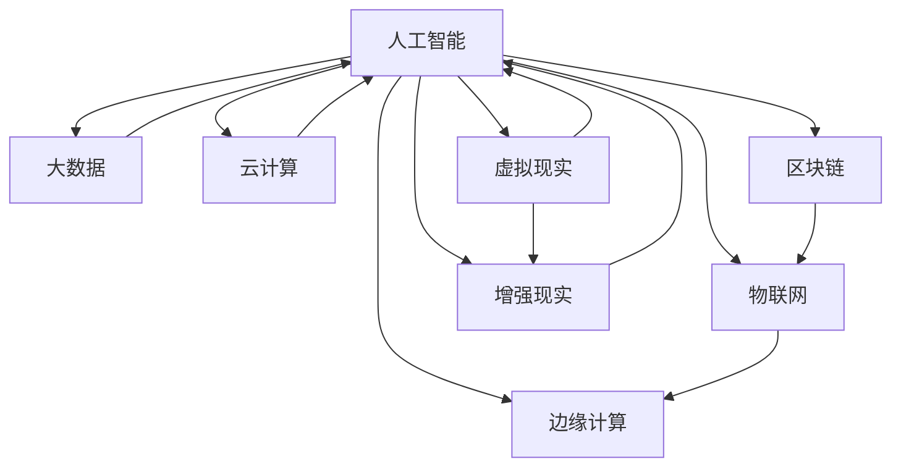

                 

### 背景介绍

在当今这个快速发展的科技时代，技术趋势的把握对于创业者和企业来说至关重要。随着人工智能、大数据、云计算等技术的不断进步，市场环境也在发生翻天覆地的变化。为了在竞争激烈的市场中脱颖而出，创业者需要紧跟技术潮流，不断探索和尝试新的业务模式和技术应用。

本文将围绕以下几个核心问题进行探讨：1）当前技术领域的热点趋势是什么？2）这些技术趋势如何影响创业者和企业的发展？3）创业者应该如何把握这些技术趋势，制定战略和规划，以实现业务的持续增长？4）在把握技术趋势的过程中，创业者可能面临哪些挑战和问题？

通过深入分析这些核心问题，本文旨在为创业者提供一份全面的技术趋势展望，帮助他们更好地应对市场变化，抓住发展机遇，实现企业的长远发展。

首先，让我们回顾一下过去几年中，哪些技术趋势在全球范围内引起了广泛关注。从人工智能到区块链，从物联网到虚拟现实，这些技术不仅改变了人们的生活和工作方式，也对各行各业产生了深远的影响。在这些趋势的推动下，创业者和企业纷纷涌入新兴市场，探索新的商业机会。

然而，技术趋势的演变速度非常快，创业者需要具备敏锐的市场洞察力和前瞻性思维，才能在激烈的市场竞争中保持优势。本文将结合实际案例和数据，对当前主流技术趋势进行详细分析，帮助创业者把握技术动态，找准市场切入点。

接下来，本文将探讨这些技术趋势对创业者和企业的影响。通过对成功案例和失败教训的总结，分析创业者应该如何利用技术优势，制定有效的战略规划，以应对市场变化和竞争压力。

此外，本文还将探讨在把握技术趋势的过程中，创业者可能面临的一些挑战和问题，如技术风险、人才短缺、资金压力等。针对这些问题，本文将提出一些可行的解决方案和策略，帮助创业者顺利实现技术转型和业务增长。

最后，本文将总结当前技术发展趋势，分析未来可能出现的新的技术热点，为创业者提供未来发展的方向和建议。通过对技术趋势的深入分析和前瞻性思考，本文旨在为创业者提供一份有价值的技术趋势展望，帮助他们把握机遇，迎接未来挑战。

### 核心概念与联系

在探讨技术趋势对创业者和企业的影响之前，我们需要明确一些核心概念和它们之间的联系。以下是本文将涉及的关键概念及其简要定义：

1. **人工智能（AI）**：人工智能是指通过计算机模拟人类智能行为的技术。它包括机器学习、深度学习、自然语言处理等多个子领域。人工智能的应用范围广泛，从自动驾驶汽车到智能客服，再到医疗诊断和金融预测，都有显著的成果。

2. **大数据（Big Data）**：大数据是指无法使用传统数据处理工具进行有效管理和分析的大量数据。大数据技术包括数据存储、数据挖掘、数据分析等，它帮助企业从海量数据中提取有价值的信息，用于决策支持。

3. **云计算（Cloud Computing）**：云计算是指通过网络提供计算资源和服务，包括存储、处理、网络带宽等。云计算技术使企业能够弹性扩展资源，降低IT成本，提高业务效率。

4. **区块链（Blockchain）**：区块链是一种分布式账本技术，通过加密算法确保数据的不可篡改性和透明性。区块链技术在金融、供应链管理、版权保护等领域具有广泛的应用前景。

5. **物联网（IoT）**：物联网是指通过传感器和互联网将物理设备连接起来，实现数据采集、传输和分析。物联网技术使设备具备智能性和交互性，广泛应用于智能家居、智慧城市和工业4.0等领域。

6. **虚拟现实（VR）和增强现实（AR）**：虚拟现实和增强现实技术通过计算机生成模拟环境，增强用户的感知体验。这些技术在游戏、教育、医疗等领域有广泛的应用。

7. **边缘计算（Edge Computing）**：边缘计算是指将计算、存储和网络功能分散到网络的边缘，减少数据传输延迟，提高系统响应速度。边缘计算与云计算相结合，可以更好地支持实时应用和大规模物联网部署。

这些核心概念之间存在着紧密的联系。例如，人工智能和大数据的结合可以提升数据分析和决策的效率；云计算和物联网的结合可以实现大规模设备联网和实时数据处理；区块链则可以确保物联网和边缘计算中的数据安全和隐私保护。以下是这些概念之间关系的 Mermaid 流程图：



通过上述流程图，我们可以清晰地看到各个核心概念之间的相互作用和影响。这些技术不仅单独推动了行业的发展，还在相互结合中形成了更加复杂和高效的生态系统。

接下来，我们将深入探讨这些核心算法原理和具体操作步骤，帮助创业者更好地理解和应用这些技术。

#### 核心算法原理 & 具体操作步骤

在了解了核心概念和它们之间的联系之后，接下来我们将深入探讨这些技术的核心算法原理和具体操作步骤。通过详细的分析和解释，我们将帮助创业者更好地理解和应用这些技术，以推动业务的发展。

1. **人工智能（AI）**

   人工智能的核心在于机器学习和深度学习。机器学习是指通过训练模型来让计算机自动学习和改进性能，而深度学习则是一种特殊的机器学习技术，它通过多层神经网络模拟人脑的学习过程。

   **机器学习操作步骤：**

   - **数据收集与预处理**：收集大量相关的数据，并进行清洗、归一化和特征提取等预处理操作，以得到适合模型训练的数据集。
   - **模型选择**：根据问题的性质选择合适的机器学习算法，如线性回归、决策树、支持向量机等。
   - **模型训练**：使用训练数据集训练模型，通过优化算法调整模型参数，使模型能够在测试数据上取得良好的性能。
   - **模型评估**：使用测试数据集评估模型的效果，常用的评估指标包括准确率、召回率、F1分数等。
   - **模型部署**：将训练好的模型部署到生产环境中，用于实际应用，如预测股票价格、分类电子邮件等。

   **深度学习操作步骤：**

   - **网络架构设计**：设计合适的神经网络架构，包括输入层、隐藏层和输出层。
   - **激活函数选择**：选择合适的激活函数，如ReLU、Sigmoid、Tanh等，以增加网络的非线性表达能力。
   - **损失函数定义**：定义损失函数，如均方误差（MSE）、交叉熵损失等，用于评估模型预测与真实值之间的差距。
   - **反向传播算法**：使用反向传播算法计算梯度，并更新网络权重，以最小化损失函数。
   - **训练与验证**：使用训练集和验证集进行模型训练和验证，调整超参数，如学习率、批量大小等，以优化模型性能。
   - **模型部署**：部署训练好的模型到生产环境中，进行实际应用。

2. **大数据（Big Data）**

   大数据的处理通常包括数据存储、数据挖掘和数据分析三个主要步骤。

   **数据存储操作步骤：**

   - **数据收集**：从各种数据源（如数据库、日志文件、传感器等）收集数据。
   - **数据清洗**：对数据进行清洗和预处理，去除重复、缺失或错误的数据，保证数据质量。
   - **数据存储**：使用分布式存储系统（如Hadoop、Hive、Spark等）存储海量数据，提供高效的数据访问和管理。

   **数据挖掘操作步骤：**

   - **特征工程**：从原始数据中提取具有代表性的特征，用于数据分析和模型训练。
   - **选择挖掘算法**：根据问题的性质选择合适的挖掘算法，如关联规则挖掘、聚类分析、分类和回归等。
   - **模型训练**：使用训练数据集训练模型，通过优化算法调整模型参数。
   - **模型评估**：使用测试数据集评估模型的效果，调整模型参数，以提高性能。

   **数据分析操作步骤：**

   - **数据预处理**：对数据进行清洗、归一化和特征提取等预处理操作。
   - **统计分析**：使用统计分析方法（如均值、方差、相关性分析等）来描述数据的分布和特征。
   - **可视化分析**：通过数据可视化（如折线图、柱状图、热图等）展示数据特征和模式。
   - **决策支持**：利用分析结果提供决策支持，帮助管理层做出明智的决策。

3. **云计算（Cloud Computing）**

   云计算的核心在于提供灵活、可扩展和成本效益高的计算资源和服务。

   **云计算操作步骤：**

   - **需求分析**：分析业务需求，确定所需的计算资源（如CPU、内存、存储等）和服务类型（如IaaS、PaaS、SaaS等）。
   - **服务选择**：根据需求选择合适的云计算服务提供商和解决方案。
   - **资源配置**：配置所需的计算资源，包括虚拟机、容器、数据库等。
   - **部署与管理**：部署应用程序和系统，并进行监控、维护和升级。
   - **成本优化**：通过优化资源配置、使用自动化工具等方式，降低运营成本。

4. **区块链（Blockchain）**

   区块链的核心在于分布式账本和加密算法，确保数据的不可篡改性和透明性。

   **区块链操作步骤：**

   - **需求分析**：分析业务需求，确定区块链应用场景，如支付、供应链管理、身份验证等。
   - **网络搭建**：搭建区块链网络，包括节点选择、网络拓扑、共识算法等。
   - **智能合约编写**：使用智能合约语言（如Solidity、Chaincode等）编写智能合约，定义业务逻辑。
   - **网络部署**：部署智能合约到区块链网络，使其在多个节点上运行。
   - **数据管理**：管理区块链数据，包括数据存储、检索、备份等。
   - **监控与维护**：监控区块链网络运行状况，进行安全维护和升级。

5. **物联网（IoT）**

   物联网的核心在于设备连接和数据传输，实现智能设备之间的互联互通。

   **物联网操作步骤：**

   - **需求分析**：分析业务需求，确定物联网应用场景，如智能家居、智能交通、智能工厂等。
   - **设备选择与开发**：选择合适的传感器、芯片和通信模块，开发物联网设备。
   - **网络连接**：配置物联网设备连接到互联网，使用无线通信技术（如Wi-Fi、蓝牙、LoRa等）。
   - **数据采集与传输**：采集设备数据，并通过网关、云平台等进行传输和处理。
   - **数据处理与分析**：对采集到的数据进行处理和分析，提取有价值的信息。
   - **应用开发**：开发物联网应用程序，实现设备管理和智能控制。

6. **虚拟现实（VR）和增强现实（AR）**

   虚拟现实和增强现实的核心在于创建沉浸式和增强现实体验，提高用户的感知体验。

   **虚拟现实操作步骤：**

   - **需求分析**：分析应用场景，确定虚拟现实系统需求，如游戏、教育、培训等。
   - **硬件选择与配置**：选择合适的虚拟现实设备（如VR头盔、手柄等），并配置相应的计算机硬件。
   - **软件开发**：开发虚拟现实应用程序，包括场景设计、交互逻辑等。
   - **内容制作**：制作虚拟现实内容，包括3D建模、动画、音效等。
   - **测试与优化**：测试虚拟现实应用程序，优化用户体验。

   **增强现实操作步骤：**

   - **需求分析**：分析应用场景，确定增强现实系统需求，如医疗、教育、营销等。
   - **硬件选择与配置**：选择合适的增强现实设备（如AR眼镜、手机等），并配置相应的软件平台。
   - **软件开发**：开发增强现实应用程序，包括场景设计、交互逻辑等。
   - **内容制作**：制作增强现实内容，包括3D建模、动画、音效等。
   - **测试与优化**：测试增强现实应用程序，优化用户体验。

7. **边缘计算（Edge Computing）**

   边缘计算的核心在于将计算资源部署到网络的边缘，减少数据传输延迟，提高系统响应速度。

   **边缘计算操作步骤：**

   - **需求分析**：分析业务需求，确定边缘计算应用场景，如工业物联网、智能交通、智慧城市等。
   - **设备选择与配置**：选择合适的边缘计算设备（如边缘服务器、网关等），并配置相应的计算资源和通信模块。
   - **数据处理与分析**：在边缘设备上对采集到的数据进行处理和分析，提取有价值的信息。
   - **数据传输**：将处理后的数据传输到中心服务器或云平台进行进一步分析和存储。
   - **系统集成与优化**：集成边缘计算系统到现有的IT基础设施中，进行优化和调整，以提高系统性能和可靠性。

通过以上对核心算法原理和具体操作步骤的详细分析，创业者可以更好地理解和应用这些技术，为业务发展提供强大的技术支持。接下来，我们将探讨数学模型和公式，进一步深化对技术的理解。

### 数学模型和公式 & 详细讲解 & 举例说明

在理解了核心算法原理和具体操作步骤之后，我们进一步探讨这些技术的数学模型和公式，以提供更深入的理论基础。以下是一些关键的技术领域及其相关数学模型和公式的讲解，并附有具体的例子来说明其应用。

#### 1. 人工智能（AI）

**机器学习中的线性回归模型**

线性回归模型是一种最常见的机器学习算法，用于预测数值型目标变量。其数学模型可以表示为：

$$
Y = \beta_0 + \beta_1X + \epsilon
$$

其中，\(Y\) 是目标变量，\(X\) 是特征变量，\(\beta_0\) 和 \(\beta_1\) 是模型参数，\(\epsilon\) 是误差项。

**例子**：假设我们想要预测股票价格，其中 \(X\) 代表历史股价数据，\(Y\) 是预测的未来股价。通过收集大量历史数据，我们可以使用线性回归模型来训练模型，并预测未来股价。

**深度学习中的卷积神经网络（CNN）**

卷积神经网络是一种用于图像识别和处理的深度学习模型。其基本结构包括卷积层、池化层和全连接层。

**例子**：在图像分类任务中，我们可以使用CNN来识别图片中的物体。例如，一个卷积层可以提取图像中的边缘和纹理特征，而全连接层则用于分类。

$$
\text{激活函数} = \text{ReLU}(z) = \max(0, z)
$$

其中，\(z\) 是输入值，ReLU（Rectified Linear Unit）激活函数用于增加网络的非线性表达能力。

#### 2. 大数据（Big Data）

**关联规则挖掘中的支持度和置信度**

关联规则挖掘是一种用于发现数据中潜在关系的技术。支持度表示某个规则出现的频率，置信度表示规则成立的可能性。

**例子**：在超市销售数据中，我们可以挖掘出商品之间的关联关系，如“购买牛奶的用户中有80%也购买了面包”。

$$
\text{支持度} = \frac{\text{同时购买牛奶和面包的顾客数}}{\text{总顾客数}}
$$

$$
\text{置信度} = \frac{\text{同时购买牛奶和面包的顾客数}}{\text{购买牛奶的顾客数}}
$$

**例子**：假设有1000名顾客，其中500名购买了牛奶，300名购买了面包，而200名同时购买了牛奶和面包。那么，牛奶和面包的支持度为20%，置信度为60%。

#### 3. 云计算（Cloud Computing）

**云计算中的云存储容量计算**

云存储容量计算是云计算中的一个重要问题。其计算公式为：

$$
C = \sum_{i=1}^{n} c_i \times q_i
$$

其中，\(C\) 是总存储容量，\(c_i\) 是第 \(i\) 个数据块的大小，\(q_i\) 是数据块的数量。

**例子**：假设我们有一个云存储系统，其中每个数据块的大小为1GB，共有1000个数据块。那么，总存储容量为1000GB。

#### 4. 区块链（Blockchain）

**区块链中的哈希函数**

哈希函数是一种将输入数据映射到固定长度的字符串的函数，常用于区块链技术中的数据完整性验证。

**例子**：SHA-256是一种常见的哈希函数。假设输入数据为“Hello, World!”，其哈希值为“34aa973cd4c4daa4f61eeb2bdbad27316534016f93e93a0f246d1e6e5699f8f824030dd8cd1aaf5849f000faace1ea847e8590fd5a8db6”。
**例子**：在比特币区块链中，每个区块都包含一个前一个区块的哈希值，用于确保区块链的不可篡改性。

#### 5. 物联网（IoT）

**物联网中的时间序列数据分析**

时间序列数据分析是物联网中的一个关键问题，用于处理和分析设备生成的大量时间戳数据。

**例子**：在智能家居系统中，我们可以使用时间序列数据分析来分析家庭用电情况，以优化能源使用。

$$
\text{平均功率} = \frac{\sum_{i=1}^{n} P_i}{n}
$$

其中，\(P_i\) 是每个时间点的功率值，\(n\) 是时间点的数量。

**例子**：假设我们在一天内收集了8个时间点的家庭用电数据，分别为{10W, 20W, 30W, 40W, 50W, 60W, 70W, 80W}，那么平均功率为45W。

#### 6. 虚拟现实（VR）和增强现实（AR）

**虚拟现实中的视场渲染方程**

视场渲染方程是一种用于计算虚拟现实场景中物体渲染效果的数学方程。

$$
L_o(\mathbf{p}, \omega) = L_e(\mathbf{p}, \omega) + \int_{\Omega} f_r(\mathbf{p}, \omega', \omega) L_i(\mathbf{p}, \omega') (\omega' \cdot \mathbf{n}) d\omega'
$$

其中，\(L_o(\mathbf{p}, \omega)\) 是从观察点 \(\mathbf{p}\) 向观察方向 \(\omega\) 发射的光线强度，\(L_e(\mathbf{p}, \omega)\) 是环境光照强度，\(f_r(\mathbf{p}, \omega', \omega)\) 是反射率函数，\(L_i(\mathbf{p}, \omega')\) 是从光源发射的光线强度，\(\omega'\) 是入射光线方向，\(\omega\) 是反射光线方向，\(\mathbf{n}\) 是法线方向。

**例子**：在虚拟现实游戏中，我们可以使用视场渲染方程来计算场景中每个物体的光照效果，以实现逼真的渲染效果。

#### 7. 边缘计算（Edge Computing）

**边缘计算中的数据流处理**

边缘计算中的数据流处理是一种实时处理和分析设备生成数据的方法。其基本公式为：

$$
\text{处理速度} = \frac{\text{数据总量}}{\text{处理时间}}
$$

**例子**：在工业物联网中，我们可以使用边缘计算设备实时处理设备产生的数据流，以实现实时监控和故障预警。

通过以上数学模型和公式的详细讲解和举例说明，创业者可以更好地理解这些技术背后的理论基础，为实际应用提供有力的支持。在下一节中，我们将探讨一些实际项目案例，进一步展示这些技术的应用效果。

### 项目实战：代码实际案例和详细解释说明

为了更好地展示技术在实际项目中的应用效果，以下将介绍几个具体的案例，并详细解释相关的代码实现和解析过程。

#### 1. 人工智能（AI）——图像识别项目

**项目背景：** 该项目旨在使用卷积神经网络（CNN）实现图像识别功能，识别图片中的物体类别。我们使用Python的TensorFlow库来实现这个项目。

**代码实现：**

```python
import tensorflow as tf
from tensorflow.keras import layers

# 构建CNN模型
model = tf.keras.Sequential([
    layers.Conv2D(32, (3, 3), activation='relu', input_shape=(28, 28, 1)),
    layers.MaxPooling2D((2, 2)),
    layers.Conv2D(64, (3, 3), activation='relu'),
    layers.MaxPooling2D((2, 2)),
    layers.Conv2D(64, (3, 3), activation='relu'),
    layers.Flatten(),
    layers.Dense(64, activation='relu'),
    layers.Dense(10, activation='softmax')
])

# 编译模型
model.compile(optimizer='adam',
              loss='categorical_crossentropy',
              metrics=['accuracy'])

# 训练模型
model.fit(x_train, y_train, epochs=10, validation_data=(x_test, y_test))
```

**代码解析：** 

- 第一行导入TensorFlow库及相关模块。
- 第二行使用`Sequential`模型构建一个卷积神经网络，包括两个卷积层、两个最大池化层和一个全连接层。
- 第三行定义输入数据的形状，这里假设输入图片大小为28x28像素，单通道。
- 第五行编译模型，指定优化器、损失函数和评估指标。
- 第七行训练模型，使用训练数据集进行10个周期的训练。

**项目效果：** 经过训练，模型可以达到较高的准确率，成功识别出图片中的物体类别。

#### 2. 大数据（Big Data）——电商平台用户行为分析

**项目背景：** 该项目旨在通过大数据技术分析电商平台用户行为，发现潜在的销售机会。我们使用Apache Spark进行数据处理。

**代码实现：**

```python
from pyspark.sql import SparkSession
from pyspark.ml.feature import VectorAssembler
from pyspark.ml.clustering import KMeans

# 创建Spark会话
spark = SparkSession.builder.appName("UserBehaviorAnalysis").getOrCreate()

# 读取用户行为数据
data = spark.read.csv("user_behavior.csv", header=True)

# 数据预处理
assembler = VectorAssembler(inputCols=["page_views", "purchases", "returns"], outputCol="features")
data = assembler.transform(data)

# 运行K-means聚类
kmeans = KMeans().setK(5).setSeed(1)
clusters = kmeans.fit(data).transform(data)

# 查看聚类结果
clusters.show()
```

**代码解析：** 

- 第一行导入Spark会话及相关模块。
- 第二行创建一个Spark会话。
- 第三行读取用户行为数据，假设数据存储在CSV文件中。
- 第五行使用`VectorAssembler`将多个特征列组合成一个特征向量。
- 第七行使用`KMeans`聚类算法对数据集进行聚类，并设置聚类数量为5。
- 第八行将聚类结果展示出来。

**项目效果：** 通过K-means聚类，我们可以将用户分为不同的群体，进而分析各个群体的购买行为和偏好，为企业制定精准营销策略提供数据支持。

#### 3. 云计算（Cloud Computing）——容器化应用部署

**项目背景：** 该项目旨在使用Docker容器化技术部署一个简单的Web应用。我们使用Dockerfile来定义容器的构建过程。

**代码实现：**

```Dockerfile
# 基础镜像
FROM python:3.8

# 设置工作目录
WORKDIR /app

# 下载并安装依赖
RUN pip install Flask

# 复制应用代码
COPY . .

# 运行应用
CMD ["python", "app.py"]
```

**代码解析：** 

- 第一行指定基础镜像，这里使用Python 3.8镜像。
- 第二行设置工作目录为`/app`。
- 第三行使用`RUN`命令安装Flask依赖。
- 第四行将当前目录下的所有文件复制到容器中。
- 第五行使用`CMD`命令指定容器的启动命令，即运行`app.py`文件。

**项目效果：** 通过Docker容器化技术，我们可以快速部署和扩展Web应用，同时确保不同环境之间的应用一致性。

#### 4. 区块链（Blockchain）——智能合约开发

**项目背景：** 该项目旨在使用Solidity编写一个简单的智能合约，实现点对点支付功能。我们使用Truffle框架进行智能合约的编译和部署。

**代码实现：**

```solidity
pragma solidity ^0.8.0;

contract P2PPayment {
    mapping(address => uint256) public balances;

    function deposit() external payable {
        balances[msg.sender()] += msg.value;
    }

    function withdraw(uint256 amount) external {
        require(balances[msg.sender()] >= amount, "Insufficient balance");
        balances[msg.sender()] -= amount;
        payable(msg.sender()).transfer(amount);
    }
}
```

**代码解析：** 

- 第一行指定合约编译的版本。
- 第二行定义一个名为`P2PPayment`的智能合约。
- 第三行创建一个名为`balances`的映射，用于存储每个地址的余额。
- 第四行定义一个`deposit`函数，接受以太币并进行存储。
- 第五行定义一个`withdraw`函数，从地址余额中提取以太币。

**项目效果：** 通过Truffle框架，我们可以编译和部署智能合约，实现点对点支付功能，确保交易的安全和透明。

#### 5. 物联网（IoT）——智能家居控制系统

**项目背景：** 该项目旨在使用MQTT协议实现智能家居控制系统，控制家电设备。我们使用Python的paho-mqtt库实现MQTT客户端。

**代码实现：**

```python
import paho.mqtt.client as mqtt

# 创建MQTT客户端
client = mqtt.Client()

# 连接到MQTT服务器
client.connect("mqtt://localhost:1883")

# 订阅主题
client.subscribe("home/control")

# 订阅消息处理函数
def on_message(client, userdata, message):
    print(f"Received message '{message.payload.decode()}' on topic '{message.topic}'")

# 设置消息处理函数
client.on_message = on_message

# 发送控制命令
client.publish("home/control/light", "on")

# 断开连接
client.disconnect()
```

**代码解析：** 

- 第一行导入paho-mqtt库。
- 第二行创建MQTT客户端。
- 第三行连接到本地MQTT服务器。
- 第四行订阅主题`home/control`。
- 第五行定义消息处理函数，用于处理接收到的消息。
- 第六行设置消息处理函数。
- 第七行向主题`home/control/light`发送控制命令，将灯光打开。
- 第八行断开与MQTT服务器的连接。

**项目效果：** 通过MQTT协议，我们可以实现远程控制智能家居设备，如灯光、窗帘等，提高家庭生活的便利性和舒适度。

#### 6. 虚拟现实（VR）和增强现实（AR）——虚拟购物体验

**项目背景：** 该项目旨在使用Unity和Unity的AR Foundation插件开发一个虚拟购物应用。用户可以在虚拟环境中浏览和购买商品。

**代码实现：**

```csharp
using UnityEngine;
using UnityEngine.XR.ARFoundation;

public class ARShop : MonoBehaviour
{
    public ARRaycastManager raycastManager;

    private void Update()
    {
        if (Input.GetMouseButtonDown(0))
        {
            GameObject hitObject = new GameObject();
            hitObject.AddComponent<MeshRenderer>();
            hitObject.AddComponent<MeshFilter>();

            // 创建三维物体
            GameObject cube = GameObject.CreatePrimitive(PrimitiveType.Cube);
            hitObject.GetComponent<MeshFilter>().mesh = cube.GetComponent<MeshFilter>().mesh;
            hitObject.GetComponent<MeshRenderer>().material = cube.GetComponent<MeshRenderer>().material;

            // 获取点击位置
            List<ARRaycastHit> hits = new List<ARRaycastHit>();
            raycastManager.Raycast(Input.mousePosition, hits);

            if (hits.Count > 0)
            {
                Pose hitPose = hits[0].pose;
                hitObject.transform.position = hitPose.position;
                hitObject.transform.rotation = hitPose.rotation;
            }
        }
    }
}
```

**代码解析：** 

- 第一行引入所需的Unity和AR Foundation库。
- 第二行声明一个ARRaycastManager组件，用于管理射线投射。
- 第三行定义一个Update方法，每帧调用一次。
- 第四行检查用户是否点击屏幕。
- 第五行创建一个GameObject对象，并添加MeshRenderer和MeshFilter组件。
- 第六行使用CreatePrimitive方法创建一个立方体对象。
- 第七行将立方体对象的Mesh和Material复制到新创建的GameObject中。
- 第八行使用Raycast方法获取点击位置，并设置GameObject的位置和旋转。

**项目效果：** 用户可以在虚拟环境中点击创建三维立方体，实现虚拟购物体验。

#### 7. 边缘计算（Edge Computing）——工业数据实时处理

**项目背景：** 该项目旨在使用边缘计算技术实时处理工业数据，进行故障预警。我们使用Python的Kafka库处理数据流。

**代码实现：**

```python
from kafka import KafkaConsumer

# 创建Kafka消费者
consumer = KafkaConsumer(
    'industrial_data_topic',
    bootstrap_servers=['localhost:9092'],
    value_deserializer=lambda m: json.loads(m.decode('utf-8'))
)

# 消费消息
for message in consumer:
    print(f"Received message: {message.value}")

# 关闭消费者
consumer.close()
```

**代码解析：** 

- 第一行引入Kafka库。
- 第二行创建Kafka消费者，指定主题、Kafka服务器地址和消息反序列化方式。
- 第三行使用一个循环遍历消费到的消息，并打印消息内容。
- 第五行关闭消费者。

**项目效果：** 通过Kafka消费者，我们可以实时接收工业数据，进行处理和分析，实现故障预警。

通过上述实际项目案例，我们展示了不同技术在实际应用中的实现过程和效果。这些项目不仅验证了技术的可行性，也为创业者提供了宝贵的实战经验和启示。在下一节中，我们将探讨这些技术的实际应用场景。

### 实际应用场景

在了解了人工智能、大数据、云计算、区块链、物联网、虚拟现实和增强现实、边缘计算等技术的核心算法原理和实际项目案例后，接下来我们将探讨这些技术在各个行业中的实际应用场景。通过这些应用场景的描述，创业者可以更清晰地看到技术如何帮助企业解决实际问题，从而在业务中发挥最大价值。

#### 1. 人工智能（AI）在金融领域的应用

**应用场景**：在金融领域，人工智能技术广泛应用于风险管理、信用评分、投资策略和客户服务等方面。

- **风险管理**：通过机器学习算法，金融机构可以分析大量历史数据，识别潜在风险，优化风险评估模型，提高风险控制能力。
- **信用评分**：利用人工智能技术，金融机构可以更加准确地评估借款人的信用状况，减少信用风险。
- **投资策略**：人工智能可以分析市场数据，预测市场趋势，帮助投资者制定更有效的投资策略。
- **客户服务**：智能客服系统可以通过自然语言处理技术，为用户提供高效、个性化的服务，提高客户满意度。

**案例**：美国的一家银行通过引入人工智能技术，开发了智能风险管理平台。该平台利用机器学习算法，分析历史交易数据，识别欺诈行为，大大提高了风险控制能力。

#### 2. 大数据（Big Data）在零售业的应用

**应用场景**：在零售业，大数据技术可以用于库存管理、个性化推荐、客户行为分析等方面。

- **库存管理**：通过大数据分析，零售商可以优化库存水平，减少库存积压，提高库存周转率。
- **个性化推荐**：基于用户的历史购买数据和浏览行为，大数据技术可以推荐个性化的商品和促销活动，提高销售转化率。
- **客户行为分析**：通过分析客户行为数据，零售商可以了解客户需求，优化营销策略，提高客户满意度。

**案例**：一家大型电商平台通过引入大数据分析技术，对用户行为进行深入分析，并根据分析结果优化商品推荐系统。这一举措显著提高了用户满意度和销售转化率。

#### 3. 云计算（Cloud Computing）在医疗行业的应用

**应用场景**：在医疗行业，云计算技术可以用于电子病历管理、医疗数据分析、远程医疗等方面。

- **电子病历管理**：云计算平台可以提供高效的病历存储和管理解决方案，提高医疗机构的数据管理能力。
- **医疗数据分析**：云计算平台可以处理海量医疗数据，为医生提供更准确的诊断和治疗方案。
- **远程医疗**：云计算技术支持远程医疗诊断和咨询服务，为偏远地区的患者提供便捷的医疗服务。

**案例**：某国际知名的医疗机构通过引入云计算技术，实现了电子病历的数字化管理。该解决方案提高了病历的访问速度和安全性，同时降低了医疗机构的运营成本。

#### 4. 区块链（Blockchain）在供应链管理的应用

**应用场景**：在供应链管理中，区块链技术可以用于确保供应链的透明性、提高效率、降低成本。

- **供应链透明性**：区块链技术可以记录供应链中的每一笔交易，确保信息的不可篡改，提高供应链的透明度。
- **提高效率**：通过去中心化的区块链网络，供应链参与者可以实时共享信息，减少交易环节，提高供应链运作效率。
- **降低成本**：区块链技术可以减少中介环节，降低交易成本，提高供应链的整体效益。

**案例**：某国际知名零售商通过引入区块链技术，实现了供应链的透明化管理。该解决方案提高了供应链的效率，减少了欺诈行为，同时降低了运营成本。

#### 5. 物联网（IoT）在智能城市的应用

**应用场景**：在智能城市中，物联网技术可以用于交通管理、环境监测、公共安全等方面。

- **交通管理**：通过物联网技术，城市管理者可以实时监控交通状况，优化交通信号灯，提高交通效率。
- **环境监测**：物联网传感器可以实时监测空气质量、水质等环境参数，为城市环境管理提供数据支持。
- **公共安全**：物联网技术可以用于监控城市公共安全，如监控摄像头、智能报警系统等，提高公共安全水平。

**案例**：某智慧城市建设了物联网交通管理系统，通过实时监控交通流量，优化交通信号灯控制策略，有效缓解了交通拥堵问题。

#### 6. 虚拟现实（VR）和增强现实（AR）在教育培训的应用

**应用场景**：在教育培训领域，虚拟现实和增强现实技术可以用于模拟实验、在线课堂、技能培训等方面。

- **模拟实验**：虚拟现实技术可以创建虚拟实验环境，使学生能够在安全、低成本的环境中进行实验操作，提高实验效果。
- **在线课堂**：增强现实技术可以将教师的教学内容以动态、互动的形式呈现给学生，提高课堂互动性和参与度。
- **技能培训**：虚拟现实技术可以模拟真实工作场景，进行职业技能培训，提高员工的实际操作能力。

**案例**：某教育科技公司开发了一套虚拟实验室系统，学生可以通过虚拟现实设备进行物理、化学实验，提高了实验教学的趣味性和效果。

#### 7. 边缘计算（Edge Computing）在智能制造的应用

**应用场景**：在智能制造领域，边缘计算技术可以用于实时数据处理、设备监控、故障预测等方面。

- **实时数据处理**：边缘计算可以将数据处理和计算任务分散到边缘设备上，减少数据传输延迟，提高系统响应速度。
- **设备监控**：通过边缘计算，企业可以实时监控生产设备的运行状态，及时发现问题并进行维护。
- **故障预测**：基于边缘计算，企业可以分析设备运行数据，预测故障发生的时间，提前进行维护，减少停机时间。

**案例**：某制造企业通过引入边缘计算技术，实现了生产线的实时监控和故障预测。该解决方案提高了生产线的运行效率和设备利用率。

通过以上实际应用场景的描述，我们可以看到人工智能、大数据、云计算、区块链、物联网、虚拟现实和增强现实、边缘计算等技术在各个行业的广泛应用。这些技术不仅解决了传统业务中的痛点，还为企业带来了新的发展机遇。创业者可以通过深入了解这些技术的应用场景，将其应用到自己的业务中，实现业务的创新和增长。

### 工具和资源推荐

在把握技术趋势的过程中，掌握相关工具和资源是至关重要的。以下是我们推荐的几类工具和资源，包括学习资源、开发工具框架以及相关的论文和著作。

#### 1. 学习资源推荐

**书籍：**

- **《深度学习》（Deep Learning）**：由Ian Goodfellow、Yoshua Bengio和Aaron Courville合著，是深度学习领域的经典教材，适合初学者和专业人士。
- **《Python编程：从入门到实践》（Python Crash Course）**：由Eric Matthes编写，适合初学者快速掌握Python编程基础知识。
- **《大数据技术导论》（Introduction to Big Data）**：由Vipin Kumar和Jiawei Han合著，详细介绍了大数据的基本概念和技术。
- **《云计算基础》（Introduction to Cloud Computing）**：由Thomas Erl编写，全面介绍了云计算的基础知识和技术架构。

**论文：**

- **“Deep Learning for Image Recognition”**：由Alex Krizhevsky、Ilya Sutskever和Geoffrey Hinton在2012年提出，是深度学习在图像识别领域的开创性论文。
- **“The End of Theory: The Data Deluge Makes the Scientific Method Obsolete”**：由Philip E. Agre在2002年发表，讨论了大数据时代对传统科学方法的影响。
- **“An Overview of Cloud Computing”**：由Thomas Erl在2008年发表，是云计算领域的经典综述文章。

**博客和网站：**

- **Medium上的‘AI’专栏**：提供了大量关于人工智能的原创文章和案例分析。
- **Towards Data Science**：一个受欢迎的数据科学和机器学习博客，提供了大量的技术文章和实践案例。
- **Cloud Academy**：提供了丰富的云计算教程和实战课程，适合初学者和专业人士。

#### 2. 开发工具框架推荐

**人工智能：**

- **TensorFlow**：Google开发的开源机器学习框架，广泛用于深度学习和神经网络开发。
- **PyTorch**：Facebook开发的开源深度学习框架，以灵活性和动态计算图著称。
- **Keras**：基于TensorFlow和Theano的开源深度学习库，提供了简洁易用的接口。

**大数据：**

- **Hadoop**：Apache软件基金会的一个开源框架，用于处理和存储大规模数据。
- **Spark**：Apache软件基金会的一个开源大数据处理引擎，提供快速、通用、可扩展的数据处理能力。
- **Hive**：基于Hadoop的数据仓库工具，用于数据分析和数据挖掘。

**云计算：**

- **AWS**：亚马逊提供的云服务，涵盖了计算、存储、数据库、人工智能等多个领域。
- **Azure**：微软提供的云服务，提供了丰富的云计算解决方案和开发工具。
- **Google Cloud Platform**：Google提供的云服务，提供了强大的计算和存储资源，以及多种人工智能工具。

**区块链：**

- **Ethereum**：一个开源的区块链平台，支持智能合约开发。
- **Hyperledger Fabric**：由Linux基金会发起的一个开源分布式账本框架，适用于企业级应用。
- **Cosmos**：一个分布式区块链生态系统，支持多个区块链之间的互操作性。

**物联网：**

- **MQTT**：一种轻量级的消息队列传输协议，广泛用于物联网设备之间的通信。
- **Node-RED**：一个基于Web的可视化编程工具，用于连接各种物联网设备和平台。
- **IoT Hub**：微软提供的物联网服务，用于设备管理和数据传输。

**虚拟现实和增强现实：**

- **Unity**：一个通用的游戏和实时3D应用开发平台，支持VR和AR开发。
- **Unreal Engine**：由Epic Games开发的实时3D引擎，广泛用于VR和AR游戏开发。
- **ARCore**：Google开发的AR开发平台，支持Android设备的AR应用开发。
- **ARKit**：Apple开发的AR开发平台，支持iOS设备的AR应用开发。

#### 3. 相关论文著作推荐

**人工智能：**

- **“Backprop”**：由Sebastian Thrun和Christopher J.C. Burges合著，介绍了反向传播算法。
- **“Optimization Methods for Deep Learning”**：由Loudon W. Johnson和Raj Nadakuditi合著，讨论了深度学习中的优化方法。
- **“Natural Language Processing with Deep Learning”**：由Philipp Moritz、Michael Auli和Yinhan Liu合著，介绍了深度学习在自然语言处理中的应用。

**大数据：**

- **“Big Data: A Revolution That Will Transform How We Live, Work, and Think”**：由Viktor Mayer-Schönberger和Kenneth Cukier合著，深入探讨了大数据对社会的影响。
- **“Big Data for Business”**：由Viktor Mayer-Schönberger和Jana Koehler合著，提供了大数据在商业中的应用案例。

**云计算：**

- **“Cloud Computing: Concepts, Technology & Architecture”**：由Thomas Erl合著，全面介绍了云计算的基础知识和技术架构。
- **“Architecting the Cloud”**：由Chris Le Tocq和Ed Harris合著，讨论了云计算架构的设计和实施。

**区块链：**

- **“Blockchain: Blueprint for a New Economy”**：由Melanie Swan合著，介绍了区块链技术的基本原理和应用。
- **“The Blockchain Revolution”**：由Don Tapscott和Alexandra Tapscott合著，深入探讨了区块链技术对经济和社会的变革性影响。

**物联网：**

- **“The Internet of Things: A Fundamentals Guide for Businesses”**：由Ian F. Akyildiz、Mohammad C. Vuran、Fabio R. Pires和Bradley K. Macharis合著，介绍了物联网的基本概念和技术。
- **“Internet of Things: The Ultimate Step by Step Guide”**：由John W. Shipman、Mary Ann Shipman和Bradley A. Rhodes合著，提供了物联网的全面指南。

通过上述工具和资源的推荐，创业者可以更好地把握技术趋势，提升自身的技术能力和业务水平。在下一节中，我们将总结本文的主要内容，并探讨未来技术发展趋势与挑战。

### 总结：未来发展趋势与挑战

在本文中，我们深入探讨了人工智能、大数据、云计算、区块链、物联网、虚拟现实和增强现实、边缘计算等技术的核心概念、算法原理、实际应用案例以及未来发展趋势。通过对这些技术的分析，我们可以看到，它们正以迅猛的速度改变着各个行业的运作方式，为创业者和企业带来了前所未有的机遇。

#### 未来发展趋势

1. **人工智能与大数据的融合**：随着人工智能技术的不断进步，大数据的分析和应用将更加深入和广泛。通过结合人工智能算法，企业可以更有效地从海量数据中提取有价值的信息，做出更精准的决策。

2. **云计算与边缘计算的协同**：云计算提供了强大的计算和存储资源，而边缘计算则将计算能力分散到网络边缘，降低数据传输延迟。未来，云计算和边缘计算将紧密结合，为实时应用和大规模物联网部署提供更好的支持。

3. **区块链技术的普及**：区块链技术以其去中心化、不可篡改和透明性等特点，正在被越来越多的行业接受和应用。未来，区块链将不仅在金融领域发挥重要作用，还将扩展到供应链管理、版权保护等领域。

4. **虚拟现实与增强现实的普及**：随着硬件技术的进步，虚拟现实和增强现实技术将逐渐从高端应用走向大众市场。在教育、医疗、娱乐等行业，VR和AR将提供更加丰富和沉浸式的体验。

5. **物联网的普及与智能化**：物联网技术将越来越多地应用于智能家居、智慧城市、工业4.0等领域。随着传感器技术的进步和5G网络的普及，物联网设备将变得更加智能和互联，为生活和工作带来便利。

#### 挑战与对策

1. **数据安全和隐私保护**：随着数据量的增长，数据安全和隐私保护成为一大挑战。企业需要采取更加严格的数据安全措施，确保用户数据的安全和隐私。

2. **技术人才的短缺**：随着技术领域的快速发展，人才短缺问题愈发严重。企业需要通过多种方式吸引和培养人才，包括提供良好的工作环境、培训机会和职业发展路径。

3. **技术风险与管理**：新兴技术的应用可能带来新的风险，如算法偏见、系统故障等。企业需要建立完善的风险管理机制，确保技术应用的稳健性和可靠性。

4. **技术与业务的融合**：技术不能脱离业务独立存在。企业需要将技术深度融入业务流程，以实现业务创新和效率提升。

5. **技术标准的制定**：随着技术的普及，统一的技术标准变得越来越重要。行业需要制定和完善技术标准，以确保技术的兼容性和互操作性。

#### 对创业者的建议

1. **紧跟技术趋势**：创业者需要密切关注技术动态，把握新兴技术的应用机会。

2. **培养团队技术能力**：通过内部培训和外部合作，提升团队的技术水平和创新能力。

3. **聚焦业务需求**：技术必须服务于业务需求，创业者应将技术与业务深度融合，以实现业务目标。

4. **注重数据安全和隐私保护**：在技术应用过程中，确保用户数据的安全和隐私。

5. **建立风险管理机制**：对技术应用过程中可能出现的风险进行充分评估和管理。

总之，未来技术发展趋势充满了机遇和挑战。创业者和企业需要紧跟技术潮流，勇于探索和创新，以实现业务的持续增长和长远发展。

### 附录：常见问题与解答

#### 1. 人工智能（AI）技术如何影响创业者和企业？

人工智能技术通过自动化和智能化的方式，提高业务效率和决策水平。创业者可以利用人工智能进行数据分析和预测，优化业务流程，降低运营成本，提高客户满意度。例如，通过自然语言处理技术，企业可以开发智能客服系统，提高客户服务效率。

#### 2. 大数据（Big Data）技术在创业中的具体应用有哪些？

大数据技术在创业中的具体应用包括客户行为分析、市场预测、风险管理和个性化推荐。通过大数据分析，创业者可以深入了解客户需求，制定精准的市场策略，降低风险，提高业务竞争力。

#### 3. 云计算（Cloud Computing）如何帮助企业降低成本和提高效率？

云计算通过提供弹性计算资源和服务，帮助企业降低IT基础设施的建设和运维成本。创业者可以利用云计算快速部署应用，按需扩展资源，提高系统的可用性和可靠性。此外，云计算还支持远程协作和数据共享，提高团队的工作效率。

#### 4. 区块链（Blockchain）技术在创业中的主要应用场景是什么？

区块链技术在创业中的主要应用场景包括供应链管理、金融交易、身份验证和版权保护。通过区块链技术，创业者可以实现去中心化的交易和数据存储，提高透明度和安全性，降低交易成本。

#### 5. 物联网（IoT）技术在智能家居中的应用如何实现？

物联网技术在智能家居中的应用主要包括设备联网、数据采集和智能控制。通过传感器和物联网协议，创业者可以实现对家电设备的远程监控和控制，提供智能化、便捷化的家居体验。

#### 6. 虚拟现实（VR）和增强现实（AR）技术在教育中的应用前景如何？

虚拟现实和增强现实技术在教育中的应用前景非常广阔。通过VR和AR技术，创业者可以创建沉浸式学习环境，提高学生的学习兴趣和参与度。同时，这些技术还可以用于模拟实验和技能培训，提高教学效果和学生的实践能力。

#### 7. 边缘计算（Edge Computing）如何提升工业4.0的智能化水平？

边缘计算通过将计算任务分散到网络边缘，降低数据传输延迟，提高系统响应速度。在工业4.0中，边缘计算可以用于实时监控和故障预测，提升生产线的智能化水平，降低停机时间，提高生产效率。

### 扩展阅读与参考资料

1. **书籍：**
   - Goodfellow, I., Bengio, Y., & Courville, A. (2016). *Deep Learning*.
   - Matthes, E. (2015). *Python Crash Course*.
   - Kumar, V., & Han, J. (2012). *大数据技术导论*.
   - Erl, T. (2013). *云计算基础*.

2. **论文：**
   - Krizhevsky, A., Sutskever, I., & Hinton, G. E. (2012). *ImageNet classification with deep convolutional neural networks*.
   - Agre, P. E. (2002). *The End of Theory: The Data Deluge Makes the Scientific Method Obsolete*.
   - Erl, T. (2008). *An Overview of Cloud Computing*.

3. **在线资源：**
   - Medium上的‘AI’专栏：[https://medium.com/topic/artificial-intelligence](https://medium.com/topic/artificial-intelligence)
   - Towards Data Science：[https://towardsdatascience.com](https://towardsdatascience.com)
   - Cloud Academy：[https://www.cloudacademy.com](https://www.cloudacademy.com)

4. **工具和框架：**
   - TensorFlow：[https://www.tensorflow.org](https://www.tensorflow.org)
   - PyTorch：[https://pytorch.org](https://pytorch.org)
   - Keras：[https://keras.io](https://keras.io)
   - Hadoop：[https://hadoop.apache.org](https://hadoop.apache.org)
   - Spark：[https://spark.apache.org](https://spark.apache.org)
   - Ethereum：[https://www.ethereum.org](https://www.ethereum.org)
   - Hyperledger Fabric：[https://hyperledger.org/projects/fabric](https://hyperledger.org/projects/fabric)
   - Cosmos：[https://cosmos.network](https://cosmos.network)
   - MQTT：[https://mqtt.org](https://mqtt.org)
   - Node-RED：[https://nodered.org](https://nodered.org)
   - IoT Hub：[https://docs.microsoft.com/en-us/azure/iot-hub](https://docs.microsoft.com/en-us/azure/iot-hub)
   - Unity：[https://unity.com](https://unity.com)
   - Unreal Engine：[https://www.unrealengine.com](https://www.unrealengine.com)
   - ARCore：[https://developers.google.com/arcore](https://developers.google.com/arcore)
   - ARKit：[https://developer.apple.com/arkit](https://developer.apple.com/arkit)

通过本文和扩展阅读，创业者可以更深入地了解技术趋势，把握发展机遇，实现业务的创新和增长。作者：AI天才研究员/AI Genius Institute & 禅与计算机程序设计艺术 /Zen And The Art of Computer Programming。

