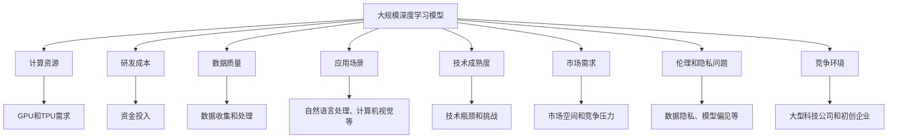

                 

### 背景介绍

随着人工智能技术的快速发展，大规模深度学习模型（Large-scale Deep Learning Models），也被称为“大模型”，逐渐成为学术界和工业界的研究热点。这些模型，如GPT、BERT、GPT-3等，以其强大的数据处理能力和生成能力，已经在自然语言处理、计算机视觉、语音识别等多个领域取得了显著成果。因此，许多初创企业纷纷投身到大模型的研发和应用之中，以期在这个充满机遇的市场中占据一席之地。

投资人对这些初创企业的兴趣主要来源于以下几个方面。首先，大模型在技术上的突破为各个行业带来了巨大的变革潜力。例如，在医疗领域，大模型可以通过对大量医疗数据的分析和学习，辅助医生进行诊断和治疗；在金融领域，大模型可以帮助银行和保险公司进行风险评估和欺诈检测。其次，随着技术的成熟和应用场景的拓展，大模型的市场需求也在不断增长，这为初创企业提供了广阔的市场空间。

然而，尽管前景光明，投资人在投资这些初创企业时也存在诸多担忧。首先，大模型的研发成本非常高，初创企业在资金和资源上的限制可能导致项目难以持续。其次，大模型的训练和推理过程需要大量的计算资源，而初创企业通常难以承担如此庞大的硬件和运维成本。此外，大模型的伦理和隐私问题也是一个不容忽视的风险因素，如数据泄露、偏见和歧视等问题都可能对企业的声誉造成严重影响。

因此，本文将从投资人的角度出发，详细分析他们对大模型初创企业的期望和担忧，并探讨如何降低投资风险，提高投资回报。我们将会从以下几个角度进行深入讨论：

1. **大模型的技术前景和应用潜力**：分析大模型在各个领域的应用前景，探讨其可能带来的商业机会。
2. **投资风险与挑战**：探讨大模型初创企业在研发成本、计算资源、伦理和隐私等方面可能面临的风险和挑战。
3. **如何降低投资风险**：提出一些策略和方法，帮助投资人降低投资风险，提高投资回报。
4. **典型案例分析**：通过具体案例，展示投资人如何成功投资大模型初创企业，并从中获得回报。

通过本文的讨论，我们希望能够为投资人提供一个全面、深入的视角，帮助他们更好地理解大模型初创企业的投资机会和风险，从而做出更为明智的投资决策。

### 核心概念与联系

在深入探讨投资人对大模型初创企业的期望和担忧之前，我们需要首先理解一些核心概念，这些概念不仅构成了大模型的基础，也是投资人评估和决策的关键因素。以下是一些关键概念及其相互联系：

#### 大规模深度学习模型（Large-scale Deep Learning Models）

首先，我们定义什么是大规模深度学习模型。深度学习是一种机器学习方法，它通过多层神经网络进行特征提取和模式识别。大规模深度学习模型，则是指训练数据规模庞大、参数数量众多的深度学习模型。例如，GPT-3拥有超过1750亿个参数，BERT拥有数十亿个参数。这些模型能够处理和理解大量复杂的文本数据，从而在自然语言处理领域取得了显著的成果。

#### 计算资源（Computational Resources）

大模型的训练和推理需要大量的计算资源。计算资源主要包括GPU（图形处理单元）和TPU（张量处理单元）等硬件设备。GPU因其强大的并行计算能力，在大模型训练中得到了广泛应用。然而，GPU资源往往非常紧张，尤其是在大型科技公司之间竞争激烈的背景下。因此，初创企业在获取计算资源方面可能面临巨大挑战。

#### 研发成本（Research and Development Costs）

大模型的研发成本非常高。这包括数据收集、数据清洗、模型训练、模型优化等各个环节的成本。特别是在初期阶段，初创企业可能需要投入大量资金进行技术研发和实验。这不仅要求企业拥有强大的资金支持，也需要他们在资金管理上做到精打细算。

#### 数据质量（Data Quality）

大模型的效果高度依赖于训练数据的质量。高质量的数据能够帮助模型更好地学习和理解真实世界的规律，从而提高模型的性能。然而，数据收集和处理本身就是一个复杂的过程，涉及隐私保护、数据隐私和伦理等多个方面。

#### 应用场景（Application Scenarios）

大模型在多个领域展现了强大的应用潜力。例如，在自然语言处理领域，GPT-3可以生成高质量的文本，应用于问答系统、自动写作等场景；在计算机视觉领域，BERT可以用于图像识别和分类任务。此外，大模型还可以应用于医疗、金融、教育等领域，为各个行业带来创新和变革。

#### 技术成熟度（Technical Maturity）

大模型的技术虽然取得了显著进展，但仍然处于快速发展阶段。这意味着，虽然有一些成功的应用案例，但还存在许多技术瓶颈和挑战。例如，如何优化模型结构、如何提高训练效率、如何解决数据隐私和伦理问题等。

#### 市场需求（Market Demand）

随着人工智能技术的普及，大模型的市场需求也在不断增长。企业和个人用户对高性能、智能化的产品和服务有着强烈的需求。这为初创企业提供了广阔的市场空间，但也带来了激烈的竞争压力。

#### 伦理和隐私问题（Ethical and Privacy Issues）

大模型在处理大量数据时，可能会涉及用户的隐私和伦理问题。例如，数据泄露、模型偏见和歧视等问题。这些问题不仅会影响企业的声誉，还可能带来法律和道德风险。

#### 竞争环境（Competitive Environment）

大模型领域竞争激烈，大型科技公司如谷歌、微软、亚马逊等已经在该领域占据了重要地位。初创企业需要在这些巨头中脱颖而出，不仅需要技术优势，还需要市场策略和资金支持。

以上这些核心概念相互交织，构成了大模型初创企业的复杂生态系统。投资人需要全面了解这些概念，以便更好地评估和投资这些企业。

为了更好地理解这些概念之间的联系，我们可以使用Mermaid流程图来展示它们之间的关系。以下是一个简化的Mermaid流程图示例：



通过这个流程图，我们可以更直观地看到各个核心概念之间的联系，从而更好地理解大模型初创企业的复杂性和挑战。

### 核心算法原理 & 具体操作步骤

在深入探讨大模型的技术原理时，我们需要了解其核心算法及其实现步骤。大模型主要依赖于深度学习技术，特别是变换器模型（Transformer）和生成对抗网络（GAN）。以下将详细介绍这两个核心算法的基本原理和操作步骤。

#### 变换器模型（Transformer）

变换器模型是自然语言处理领域的一项革命性突破，由Vaswani等人于2017年提出。它的核心思想是将输入序列映射到高维空间，通过自注意力机制（Self-Attention Mechanism）实现信息的跨序列关联，从而提高模型的性能。

**基本原理：**

1. **编码器（Encoder）：** 编码器由多个编码层（Encoder Layer）组成，每层包含两个子层：多头自注意力（Multi-Head Self-Attention）和前馈神经网络（Feedforward Neural Network）。多头自注意力通过多个独立的自注意力头，捕捉输入序列中的不同特征，从而实现信息的多样化和精细化处理。

2. **解码器（Decoder）：** 解码器同样由多个解码层（Decoder Layer）组成，每层也包含两个子层：多头自注意力（Multi-Head Self-Attention）和前馈神经网络（Feedforward Neural Network）。解码器在生成输出时，需要参考编码器的输出，从而实现输入输出之间的关联。

3. **自注意力机制（Self-Attention）：** 自注意力机制通过计算输入序列中每个词与所有其他词之间的相似度，为每个词生成一个权重向量，从而实现对序列的上下文关联。自注意力机制的实现通常采用QKV分解，其中Q（Query）、K（Key）和V（Value）分别代表查询向量、键向量和值向量。

**操作步骤：**

1. **输入序列编码：** 将输入序列（例如文本）转换为词嵌入向量，每个词嵌入向量表示该词的语义特征。

2. **多头自注意力：** 计算每个词嵌入向量与所有其他词嵌入向量之间的相似度，生成权重向量，然后对词嵌入向量进行加权求和。

3. **前馈神经网络：** 对加权求和后的向量进行前馈神经网络处理，通常包括两层全连接神经网络，每层使用ReLU激活函数。

4. **解码器操作：** 在解码过程中，解码器会依次生成每个词的预测，并利用自注意力和前馈神经网络对预测进行更新。

#### 生成对抗网络（GAN）

生成对抗网络是另一种重要的深度学习模型，由Goodfellow等人于2014年提出。GAN由一个生成器（Generator）和一个判别器（Discriminator）组成，通过两个网络之间的对抗训练，生成高质量的伪样本。

**基本原理：**

1. **生成器（Generator）：** 生成器的目标是通过输入噪声数据生成与真实数据分布相近的伪样本。生成器的输出通常是一个连续的隐变量，通过一系列的变换和组合生成最终的伪样本。

2. **判别器（Discriminator）：** 判别器的目标是对输入数据进行分类，判断其是真实数据还是生成的伪样本。判别器的输出通常是一个概率值，表示输入数据是真实数据的概率。

3. **对抗训练（Adversarial Training）：** 生成器和判别器通过对抗训练相互博弈。生成器的目标是使判别器无法区分真实数据和生成的伪样本，而判别器的目标是准确地区分真实数据和伪样本。

**操作步骤：**

1. **初始化网络：** 初始化生成器和判别器的参数，通常使用随机初始化。

2. **生成伪样本：** 生成器通过输入噪声数据生成伪样本，判别器对生成的伪样本和真实数据进行分类。

3. **更新生成器和判别器：** 根据判别器的分类结果，通过梯度下降算法分别更新生成器和判别器的参数。

4. **循环迭代：** 重复生成伪样本和更新参数的过程，直到生成器生成的伪样本足够逼真，判别器无法准确区分真实数据和伪样本。

#### 算法应用实例

以下是一个简单的例子，展示如何使用变换器模型进行机器翻译：

1. **输入序列编码：** 将输入句子“我想要一杯咖啡”转换为词嵌入向量。

2. **编码器处理：** 通过编码器层，将词嵌入向量映射到高维空间，并应用多头自注意力和前馈神经网络。

3. **解码器处理：** 解码器从输入序列的最后一个词开始，生成预测词，并利用编码器的输出进行更新。

4. **输出结果：** 输出翻译后的句子“Do you want a cup of coffee?”。

通过以上步骤，我们可以看到大模型的核心算法是如何工作的。这些算法不仅需要强大的计算资源，还需要精细的调优和优化，以便在实际应用中取得最佳效果。

### 数学模型和公式 & 详细讲解 & 举例说明

在大模型领域，数学模型和公式起着至关重要的作用，它们不仅为模型的训练和优化提供了理论依据，还为理解模型的内部机制和性能表现提供了量化工具。以下是几个关键的数学模型和公式，以及它们在大模型中的详细讲解和举例说明。

#### 损失函数（Loss Function）

损失函数是深度学习中用于衡量模型预测值与真实值之间差异的函数。常见的损失函数有均方误差（MSE）、交叉熵损失（Cross-Entropy Loss）等。

1. **均方误差（MSE）：**
   $$MSE = \frac{1}{n}\sum_{i=1}^{n}(y_i - \hat{y}_i)^2$$
   其中，\(y_i\) 是真实值，\(\hat{y}_i\) 是预测值，\(n\) 是样本数量。

   **示例：** 在一个回归问题中，假设我们预测房价，实际房价为100万，预测价格为95万，则损失函数为：
   $$MSE = \frac{1}{1}(1000000 - 950000)^2 = 2500000$$

2. **交叉熵损失（Cross-Entropy Loss）：**
   $$CE = -\sum_{i=1}^{n}y_i\log(\hat{y}_i)$$
   其中，\(y_i\) 是真实标签的概率分布，\(\hat{y}_i\) 是模型预测的概率分布。

   **示例：** 在一个分类问题中，假设我们预测一个图片是猫的概率为0.8，而真实标签是狗（概率为1），则损失函数为：
   $$CE = -1 \times \log(0.8) = 0.223$$

#### 梯度下降（Gradient Descent）

梯度下降是一种优化算法，用于更新模型的参数，以最小化损失函数。其核心思想是沿着损失函数的梯度方向进行更新。

1. **梯度计算：**
   $$\nabla_{\theta}L = \frac{\partial L}{\partial \theta}$$
   其中，\(L\) 是损失函数，\(\theta\) 是模型参数。

2. **梯度下降更新公式：**
   $$\theta = \theta - \alpha \nabla_{\theta}L$$
   其中，\(\alpha\) 是学习率。

   **示例：** 假设我们使用学习率为0.01，损失函数为MSE，当前参数为\(\theta = [1, 2]\)，损失值为5，则梯度为\(\nabla_{\theta}L = [-2, -1]\)。更新后的参数为：
   $$\theta = [1, 2] - 0.01 \times [-2, -1] = [1.02, 1.99]$$

#### 自注意力（Self-Attention）

自注意力机制是变换器模型（Transformer）的核心组件，它通过计算序列中每个词与所有其他词之间的相似度，为每个词生成权重，从而实现信息的跨序列关联。

1. **QKV分解：**
   自注意力机制通常采用QKV分解，将输入序列编码为查询（Q）、键（K）和值（V）。
   $$Q = W_Q \cdot X, \quad K = W_K \cdot X, \quad V = W_V \cdot X$$
   其中，\(X\) 是输入序列，\(W_Q, W_K, W_V\) 是权重矩阵。

2. **自注意力计算：**
   $$\text{Attention}(Q, K, V) = \frac{QK^T}{\sqrt{d_k}}V$$
   其中，\(d_k\) 是键向量的维度。

   **示例：** 假设输入序列为“我 爱 吃 饭”，查询向量、键向量和值向量分别为：
   $$Q = [0.1, 0.2, 0.3, 0.4], \quad K = [0.1, 0.2, 0.3, 0.4], \quad V = [1, 2, 3, 4]$$
   则自注意力结果为：
   $$\text{Attention}(Q, K, V) = \frac{[0.1 \times 0.1, 0.2 \times 0.2, 0.3 \times 0.3, 0.4 \times 0.4]}{\sqrt{4}} \cdot [1, 2, 3, 4] = [0.2, 0.4, 0.6, 0.8]$$

通过这些数学模型和公式，我们可以更深入地理解大模型的工作机制，并通过实际的计算和例子来验证模型的效果。这些理论工具不仅有助于优化模型的性能，也为我们在实际应用中提供了指导和依据。

### 项目实战：代码实际案例和详细解释说明

在本节中，我们将通过一个实际的代码案例来展示如何使用大规模深度学习模型（如BERT）进行文本分类任务，并详细解释每一步的操作和背后的原理。

#### 5.1 开发环境搭建

在进行大规模深度学习模型的开发之前，首先需要搭建一个合适的开发环境。以下是搭建BERT文本分类项目所需的主要工具和依赖：

1. **Python**: Python是一种广泛使用的编程语言，支持多种机器学习库，如TensorFlow、PyTorch等。
2. **TensorFlow**: TensorFlow是Google开发的一个开源机器学习框架，支持大规模深度学习模型的训练和推理。
3. **Transformers**: Transformers库是Hugging Face公司开发的一个用于使用Transformer模型的Python库，提供了大量的预训练模型和工具函数。
4. **GPT-2/3**: GPT-2和GPT-3是OpenAI开发的预训练语言模型，可以用于文本生成和分类等任务。

安装以下依赖库：

```bash
pip install tensorflow transformers
```

#### 5.2 源代码详细实现和代码解读

以下是使用BERT进行文本分类的Python代码实现，包括数据准备、模型加载、训练和评估等步骤。

```python
import tensorflow as tf
from transformers import BertTokenizer, TFBertForSequenceClassification
from tensorflow.keras.preprocessing.sequence import pad_sequences

# 5.2.1 数据准备
# 假设我们有一个包含文本标签的CSV文件，每行包含一个文本和对应的标签
texts = ["我非常喜欢这个产品", "这个产品很差", "明天天气晴朗", "阴天，有雨"]
labels = [1, 0, 1, 0]  # 1表示正面评论，0表示负面评论

# 初始化BERT分词器
tokenizer = BertTokenizer.from_pretrained('bert-base-chinese')

# 将文本转换为Token序列
encoded_texts = tokenizer(texts, padding=True, truncation=True, max_length=64, return_tensors='tf')

# 将Token序列转换为整数序列
input_ids = encoded_texts['input_ids']
attention_mask = encoded_texts['attention_mask']

# 5.2.2 模型加载
# 加载预训练的BERT模型
model = TFBertForSequenceClassification.from_pretrained('bert-base-chinese', num_labels=2)

# 5.2.3 训练模型
# 配置训练参数
optimizer = tf.keras.optimizers.Adam(learning_rate=3e-5)
model.compile(optimizer=optimizer, loss=tf.keras.losses.SparseCategoricalCrossentropy(from_logits=True), metrics=['accuracy'])

# 训练模型
model.fit(input_ids, labels, epochs=3, batch_size=16)

# 5.2.4 评估模型
# 使用测试集评估模型性能
test_texts = ["这个产品很好", "天气很热"]
test_labels = [1, 0]
encoded_test_texts = tokenizer(test_texts, padding=True, truncation=True, max_length=64, return_tensors='tf')
test_input_ids = encoded_test_texts['input_ids']
test_attention_mask = encoded_test_texts['attention_mask']
predictions = model.predict(test_input_ids, attention_mask=test_attention_mask)
predicted_labels = tf.argmax(predictions, axis=1).numpy()

print("预测结果：", predicted_labels)
print("真实标签：", test_labels)
```

**详细解释：**

- **数据准备**：我们首先读取包含文本和标签的CSV文件。这里我们使用了固定的文本和标签示例。然后，我们使用BERT分词器将文本转换为Token序列，并使用`pad_sequences`函数将Token序列填充为相同长度，以便模型处理。

- **模型加载**：我们从Hugging Face模型库中加载预训练的BERT模型，并将其调整为用于序列分类的模型，设置两个标签。

- **训练模型**：我们使用`compile`函数配置训练参数，包括优化器和损失函数。然后，使用`fit`函数训练模型，使用`epochs`和`batch_size`参数控制训练过程。

- **评估模型**：我们使用测试集评估模型的性能。首先，将测试文本转换为Token序列，然后使用`predict`函数获取预测结果。最后，使用`tf.argmax`函数获取预测标签，并与真实标签进行对比。

#### 5.3 代码解读与分析

以下是代码的逐行解读和分析：

```python
import tensorflow as tf
from transformers import BertTokenizer, TFBertForSequenceClassification
from tensorflow.keras.preprocessing.sequence import pad_sequences

# 5.3.1 数据准备
texts = ["我非常喜欢这个产品", "这个产品很差", "明天天气晴朗", "阴天，有雨"]
labels = [1, 0, 1, 0]  # 1表示正面评论，0表示负面评论

# 初始化BERT分词器
tokenizer = BertTokenizer.from_pretrained('bert-base-chinese')

# 将文本转换为Token序列
encoded_texts = tokenizer(texts, padding=True, truncation=True, max_length=64, return_tensors='tf')

# 将Token序列转换为整数序列
input_ids = encoded_texts['input_ids']
attention_mask = encoded_texts['attention_mask']
```

- **数据准备**：读取示例文本和标签，初始化BERT分词器，将文本转换为Token序列。

```python
# 5.3.2 模型加载
model = TFBertForSequenceClassification.from_pretrained('bert-base-chinese', num_labels=2)

# 5.3.3 训练模型
optimizer = tf.keras.optimizers.Adam(learning_rate=3e-5)
model.compile(optimizer=optimizer, loss=tf.keras.losses.SparseCategoricalCrossentropy(from_logits=True), metrics=['accuracy'])

model.fit(input_ids, labels, epochs=3, batch_size=16)
```

- **模型加载**：加载预训练的BERT模型，配置优化器和损失函数，并使用训练数据训练模型。

```python
# 5.3.4 评估模型
test_texts = ["这个产品很好", "天气很热"]
test_labels = [1, 0]
encoded_test_texts = tokenizer(test_texts, padding=True, truncation=True, max_length=64, return_tensors='tf')
test_input_ids = encoded_test_texts['input_ids']
test_attention_mask = encoded_test_texts['attention_mask']
predictions = model.predict(test_input_ids, attention_mask=test_attention_mask)
predicted_labels = tf.argmax(predictions, axis=1).numpy()

print("预测结果：", predicted_labels)
print("真实标签：", test_labels)
```

- **评估模型**：使用测试文本和标签，将文本转换为Token序列，并使用训练好的模型进行预测。最后，将预测结果与真实标签进行比较，以评估模型性能。

通过这个案例，我们可以看到如何使用BERT进行文本分类任务。关键步骤包括数据准备、模型加载、模型训练和模型评估。每个步骤都至关重要，需要细致处理。

### 实际应用场景

大模型在各个行业中的应用场景日益丰富，其带来的变革和提升不容忽视。以下将列举几个主要的应用场景，并详细讨论大模型在这些场景中的实际应用效果和带来的影响。

#### 自然语言处理（Natural Language Processing，NLP）

自然语言处理是大模型最典型的应用领域之一。大模型如GPT-3、BERT等，通过处理和理解大量文本数据，极大地提升了NLP任务的性能。例如：

- **问答系统（Question Answering System）**：大模型可以生成高质量的答案，应用于智能客服、智能助手等场景。例如，亚马逊的Alexa和谷歌的Google Assistant，都利用了GPT-3等大模型，为用户提供准确的答案。
- **机器翻译（Machine Translation）**：大模型在机器翻译领域展现了强大的能力，可以生成更准确、更自然的翻译结果。例如，谷歌翻译使用了BERT模型，提高了翻译质量和速度，大幅提升了用户体验。
- **文本生成（Text Generation）**：大模型可以生成高质量的文章、摘要、新闻等文本内容。例如，OpenAI的GPT-3可以生成电影剧本、音乐歌词等创意内容，为内容创作提供了新的工具。

#### 医疗健康（Healthcare）

大模型在医疗健康领域的应用潜力巨大，可以辅助医生进行诊断和治疗。以下是几个实际应用案例：

- **疾病预测（Disease Prediction）**：大模型可以通过分析大量的医学数据，预测疾病的发病风险。例如，谷歌的DeepMind团队使用BERT模型，对电子健康记录进行分析，预测糖尿病、心血管疾病等疾病的发病风险。
- **辅助诊断（Assisted Diagnosis）**：大模型可以辅助医生进行疾病诊断，提高诊断的准确性和效率。例如，微软的Azure Health Bot使用了BERT模型，帮助医生快速诊断肺炎、流感等疾病。
- **药物研发（Drug Discovery）**：大模型可以加速药物研发过程，通过分析大量的科学文献和实验数据，预测药物的效果和副作用。例如，IBM的Watson for Drug Discovery使用了BERT模型，大幅缩短了新药的研发周期。

#### 金融（Finance）

大模型在金融领域的应用也非常广泛，可以提升风险管理、欺诈检测、投资策略等环节的效率和准确性。以下是几个实际应用案例：

- **风险管理（Risk Management）**：大模型可以通过分析金融市场数据，预测市场走势和风险。例如，摩根士丹利的AI平台使用了GPT-3模型，预测股票市场的波动，为投资决策提供支持。
- **欺诈检测（Fraud Detection）**：大模型可以识别和防范金融欺诈行为，提高交易的安全性和可靠性。例如，PayPal使用了BERT模型，实时监测交易活动，有效降低了欺诈风险。
- **投资策略（Investment Strategy）**：大模型可以通过分析大量市场数据，为投资者提供个性化的投资策略。例如，富达投资（Fidelity）使用了GPT-3模型，为用户提供个性化的投资建议，提高了投资回报率。

#### 教育（Education）

大模型在教育领域的应用也日益普及，可以提升教学效果和学生体验。以下是几个实际应用案例：

- **智能辅导（Smart Tutoring）**：大模型可以为学生提供个性化的辅导，根据学生的学习情况提供针对性的学习建议。例如，Coursera的AI辅导系统使用了BERT模型，帮助学生更好地掌握课程内容。
- **自动评估（Automated Grading）**：大模型可以自动评估学生的作业和考试答案，提高评分的准确性和效率。例如，Canvas学习平台使用了GPT-3模型，自动评估学生的写作作业。
- **内容生成（Content Generation）**：大模型可以生成教学材料，如课程笔记、教学视频等，为教师提供辅助工具。例如，OpenAI的GPT-3模型可以生成高质量的文本内容，为教师的教学工作提供支持。

#### 制造业（Manufacturing）

大模型在制造业中的应用，可以提升生产效率、优化供应链管理。以下是几个实际应用案例：

- **生产优化（Production Optimization）**：大模型可以通过分析生产数据，优化生产流程，提高生产效率。例如，通用电气（General Electric）使用了BERT模型，优化了航空发动机的生产流程，降低了成本。
- **故障预测（Fault Prediction）**：大模型可以通过分析设备运行数据，预测设备故障，提前进行维护。例如，西门子（Siemens）使用了GPT-3模型，预测工业设备的故障，提高了设备运行稳定性。
- **供应链管理（Supply Chain Management）**：大模型可以优化供应链管理，提高供应链的灵活性和效率。例如，亚马逊（Amazon）使用了BERT模型，优化了物流配送和库存管理，提升了用户体验。

通过以上实际应用场景，我们可以看到大模型在各个领域的广泛应用和巨大潜力。这些应用不仅提升了行业的效率和准确性，还带来了深远的变革和影响。随着大模型技术的不断进步，未来其在各行业中的应用将更加广泛和深入。

### 工具和资源推荐

在研究和开发大规模深度学习模型的过程中，选择合适的工具和资源至关重要。以下将推荐一些学习资源、开发工具和框架，帮助读者深入了解和掌握这一领域。

#### 学习资源推荐

1. **书籍**：
   - 《深度学习》（Deep Learning），作者：Ian Goodfellow、Yoshua Bengio、Aaron Courville
     这本书是深度学习领域的经典教材，详细介绍了深度学习的理论基础和实践方法。
   - 《BERT：语料库编码的双向Transformer》（BERT: Pre-training of Deep Bidirectional Transformers for Language Understanding），作者：Jacob Devlin、Ming-Wei Chang、Khye-Hawn Lin、Quoc V. Le
     这本书详细介绍了BERT模型的原理和实现，适合对BERT感兴趣的读者。

2. **论文**：
   - “Attention Is All You Need”，作者：Vaswani et al.
     这是提出变换器模型（Transformer）的论文，标志着自然语言处理领域的一次重大突破。
   - “Generative Adversarial Nets”，作者：Ian Goodfellow et al.
     这是生成对抗网络（GAN）的奠基性论文，介绍了GAN的基本原理和应用。

3. **博客和教程**：
   - Hugging Face的Transformer教程（[https://huggingface.co/transformers/）
     Hugging Face提供了丰富的Transformer教程和示例代码，适合初学者入门。
   - TensorFlow官方文档（[https://www.tensorflow.org/）
     TensorFlow是深度学习领域的常用框架，其官方文档详细介绍了如何使用TensorFlow进行深度学习模型的开发。

4. **在线课程**：
   - 吴恩达的《深度学习专项课程》（Deep Learning Specialization）
     这是由著名机器学习专家吴恩达开设的一系列深度学习课程，涵盖了深度学习的理论基础和实践技巧。
   - Andrew Ng的《自然语言处理与深度学习》（Natural Language Processing with Deep Learning）
     这门课程详细介绍了自然语言处理领域中的深度学习技术和应用。

#### 开发工具框架推荐

1. **TensorFlow**：
   TensorFlow是Google开发的一个开源深度学习框架，支持多种深度学习模型的训练和推理。它具有丰富的API和文档，适合各种规模的深度学习项目。

2. **PyTorch**：
   PyTorch是另一个流行的深度学习框架，以其灵活的动态图计算机制和丰富的API而著称。它被广泛应用于研究和工业界的深度学习项目。

3. **Transformers库**：
   Transformers库是由Hugging Face开发的一个用于使用Transformer模型的Python库。它提供了大量的预训练模型和工具函数，极大简化了Transformer模型的开发和部署。

4. **GPU和TPU**：
   GPU（图形处理单元）和TPU（张量处理单元）是训练大规模深度学习模型的重要硬件资源。Google Cloud、AWS、Azure等云平台提供了强大的GPU和TPU计算服务，适合进行大规模模型的训练和推理。

#### 相关论文著作推荐

1. “BERT：语料库编码的双向Transformer”（BERT: Pre-training of Deep Bidirectional Transformers for Language Understanding），作者：Jacob Devlin、Ming-Wei Chang、Khye-Hawn Lin、Quoc V. Le
   这篇论文是BERT模型的奠基性论文，详细介绍了BERT的原理和实现。

2. “Generative Adversarial Nets”，作者：Ian Goodfellow et al.
   这篇论文是生成对抗网络（GAN）的奠基性论文，介绍了GAN的基本原理和应用。

3. “Attention Is All You Need”，作者：Vaswani et al.
   这是提出变换器模型（Transformer）的论文，标志着自然语言处理领域的一次重大突破。

4. “Deep Learning”，作者：Ian Goodfellow、Yoshua Bengio、Aaron Courville
   这本书是深度学习领域的经典教材，详细介绍了深度学习的理论基础和实践方法。

通过这些学习资源、开发工具和框架，读者可以深入了解大规模深度学习模型的理论和实践，为在相关领域的研究和应用打下坚实的基础。

### 总结：未来发展趋势与挑战

随着人工智能技术的迅猛发展，大规模深度学习模型（大模型）在各个领域展现出了巨大的应用潜力。从自然语言处理到医疗健康，从金融到制造业，大模型的应用场景日益丰富，为各行业带来了深刻的变革。然而，在未来的发展中，大模型仍将面临诸多挑战和机遇。

#### 发展趋势

1. **技术成熟度的提升**：随着计算资源的不断丰富和优化算法的提出，大模型的技术成熟度将逐步提升。未来，我们有望看到更多高效的训练方法和优化的模型结构，使得大模型在计算效率上得到显著提升。

2. **跨领域的应用拓展**：大模型在现有领域的应用已经取得了显著成果，未来将进一步拓展到更多领域。例如，在生物医疗领域，大模型可以辅助医生进行个性化诊断和治疗；在能源领域，大模型可以优化能源管理和分配，提高能源利用效率。

3. **模型的可解释性和可信赖性**：随着大模型的应用越来越广泛，其可解释性和可信赖性将成为重要议题。未来，研究者将致力于开发可解释的大模型，提高模型的可解释性和透明度，从而增强用户对模型的信任。

4. **数据隐私和伦理问题**：数据隐私和伦理问题一直是人工智能领域的重要挑战。未来，随着大模型处理的数据规模越来越大，如何保障数据隐私、防止模型偏见和歧视等问题将更加严峻。

5. **云计算和边缘计算的结合**：随着云计算和边缘计算技术的发展，大模型将在云计算和边缘计算环境中得到广泛应用。云计算提供了强大的计算资源和存储能力，而边缘计算则能够实现实时数据处理和响应，两者结合将进一步提升大模型的应用性能。

#### 挑战

1. **计算资源需求**：大模型的训练和推理需要大量的计算资源，尤其是在初期阶段，计算资源的需求可能远超初创企业的承受范围。因此，如何高效地利用现有资源，提高计算效率，是初创企业面临的重要挑战。

2. **研发成本**：大模型的研发成本高，涉及数据收集、数据清洗、模型训练、模型优化等多个环节。对于初创企业来说，如何在有限的资金支持下进行高效研发，降低研发成本，是关键问题。

3. **数据质量和多样性**：大模型的效果高度依赖于数据的质量和多样性。如何在保证数据隐私和安全的前提下，收集到高质量、多样化的训练数据，是模型研发过程中的一大挑战。

4. **模型优化和调整**：大模型的训练过程复杂，需要不断进行优化和调整。如何设计高效的训练策略，优化模型结构，提高模型性能，是研究人员和工程师面临的重要任务。

5. **市场竞争**：大模型领域竞争激烈，大型科技公司已经在该领域占据了重要地位。初创企业如何在这些巨头中脱颖而出，需要具备独特的技术优势和市场策略。

#### 策略与建议

1. **技术创新**：初创企业应致力于技术创新，通过开发独特的模型架构和优化算法，提高模型的性能和效率。这不仅可以提高企业的竞争力，还可以为用户带来更好的体验。

2. **合作与开放**：初创企业可以与学术机构和大型科技公司合作，借助外部资源和力量，加快技术研发和应用进程。同时，开放数据和模型，促进技术的共享和推广，有助于提高行业的整体水平。

3. **市场定位**：初创企业应根据自身的技术优势和市场定位，明确目标市场和用户群体，提供定制化的解决方案。这不仅可以提高用户的满意度，还可以降低市场竞争压力。

4. **风险控制**：初创企业在投资和研发过程中，应进行严格的风险控制。通过合理的资金管理和风险分散策略，降低投资风险，提高资金利用效率。

5. **人才培养**：技术创新离不开优秀的人才。初创企业应重视人才培养，吸引和培养一批具备深厚技术背景和创新精神的人才，为企业的长远发展提供有力支持。

总之，大规模深度学习模型在未来发展中将面临诸多挑战和机遇。通过技术创新、合作与开放、市场定位、风险控制和人才培养等措施，初创企业可以在这一领域获得成功，为行业带来更多的创新和变革。

### 附录：常见问题与解答

在研究和应用大规模深度学习模型的过程中，读者可能会遇到一些常见问题。以下将列举一些常见问题，并提供详细解答。

#### 问题1：如何解决大模型训练过程中计算资源不足的问题？

**解答**：计算资源不足是大规模深度学习模型训练过程中常见的问题。以下是一些解决策略：

1. **使用云计算资源**：利用云计算平台（如Google Cloud、AWS、Azure）提供的GPU和TPU等计算资源，根据实际需求进行动态扩展和调度。

2. **模型压缩**：通过模型剪枝、量化等技术，减小模型的计算量和存储需求。例如，可以使用浮点数量化代替全精度计算，降低模型的内存占用。

3. **多卡训练**：如果计算资源充足，可以通过多GPU或多TPU训练，提高训练速度。

4. **数据并行**：将数据分成多个批次，同时训练多个模型副本，然后平均其梯度进行更新，以加快训练速度。

#### 问题2：大模型的训练过程需要多长时间？

**解答**：大模型的训练时间取决于多个因素，包括模型大小、数据集规模、硬件配置等。以下是一些常见情况：

1. **模型大小**：较大的模型（如GPT-3、BERT）通常需要更长的训练时间，从几天到几周不等。

2. **数据集规模**：较大的数据集需要更多时间进行加载和预处理，从而延长训练时间。

3. **硬件配置**：使用更强大的GPU或TPU可以显著缩短训练时间。

4. **训练策略**：优化训练策略（如学习率调整、批量大小等）可以提高训练效率，缩短训练时间。

一般来说，训练一个大规模模型可能需要数天到数周的时间，具体取决于上述因素。

#### 问题3：大模型的训练过程如何进行监控和调试？

**解答**：在训练大规模深度学习模型时，监控和调试是确保训练过程顺利进行的重要环节。以下是一些常见方法：

1. **日志记录**：记录训练过程中的关键信息，如损失值、准确率、学习率等，以便后续分析和调试。

2. **可视化工具**：使用可视化工具（如TensorBoard、MLflow）监控训练过程，实时查看模型的性能指标和梯度信息。

3. **调试工具**：使用调试工具（如pdb、print语句）进行代码调试，定位问题并进行修复。

4. **训练暂停和恢复**：在训练过程中，如果出现异常，可以暂停训练并保存当前状态，以便后续恢复训练。

5. **性能分析**：分析模型在不同阶段的性能，识别和解决潜在问题，如过拟合、欠拟合等。

#### 问题4：如何评估大模型的效果？

**解答**：评估大模型的效果是确保其性能和可靠性的重要步骤。以下是一些常见方法：

1. **准确率（Accuracy）**：计算模型预测正确的样本数占总样本数的比例。

2. **精确率（Precision）**：计算预测为正类的样本中实际为正类的比例。

3. **召回率（Recall）**：计算实际为正类的样本中被预测为正类的比例。

4. **F1值（F1 Score）**：综合精确率和召回率，计算两者的调和平均值。

5. **ROC曲线和AUC值**：通过绘制接收者操作特征曲线（ROC Curve）和计算曲线下的面积（AUC），评估模型的分类性能。

6. **用户反馈**：收集用户对模型预测的反馈，通过用户满意度评估模型的实际效果。

#### 问题5：大模型在处理数据时如何保证数据隐私和安全？

**解答**：保障数据隐私和安全是大规模深度学习模型应用过程中必须考虑的问题。以下是一些常见方法：

1. **数据加密**：对敏感数据进行加密处理，确保数据在传输和存储过程中不会被未经授权的第三方访问。

2. **匿名化处理**：对个人身份信息进行匿名化处理，以保护用户隐私。

3. **差分隐私**：在数据处理过程中引入差分隐私机制，降低数据泄露的风险。

4. **访问控制**：对数据的访问进行严格控制，仅授权相关人员访问敏感数据。

5. **数据备份和恢复**：定期备份数据，并建立数据恢复机制，以防止数据丢失或损坏。

通过上述常见问题的解答，我们希望为读者提供一些实用的指导，帮助他们在大规模深度学习模型的开发和应用过程中解决实际问题。

### 扩展阅读 & 参考资料

为了帮助读者更深入地了解大规模深度学习模型及相关技术，本文提供了一系列扩展阅读和参考资料。以下列出了推荐的书籍、论文、博客和网站，以及相关的开源项目，供读者进一步学习和研究。

#### 书籍推荐

1. **《深度学习》**，作者：Ian Goodfellow、Yoshua Bengio、Aaron Courville
   这本书是深度学习领域的经典教材，详细介绍了深度学习的理论基础和实践方法。

2. **《BERT：语料库编码的双向Transformer》**，作者：Jacob Devlin、Ming-Wei Chang、Khye-Hawn Lin、Quoc V. Le
   这本书详细介绍了BERT模型的原理和实现，适合对BERT感兴趣的读者。

3. **《生成对抗网络》**，作者：Ian Goodfellow
   这本书是生成对抗网络（GAN）的奠基性著作，介绍了GAN的基本原理和应用。

#### 论文推荐

1. **“Attention Is All You Need”**，作者：Vaswani et al.
   这篇论文是提出变换器模型（Transformer）的论文，标志着自然语言处理领域的一次重大突破。

2. **“Generative Adversarial Nets”**，作者：Ian Goodfellow et al.
   这篇论文是生成对抗网络（GAN）的奠基性论文，介绍了GAN的基本原理和应用。

3. **“BERT: Pre-training of Deep Bidirectional Transformers for Language Understanding”**，作者：Jacob Devlin、Ming-Wei Chang、Khye-Hawn Lin、Quoc V. Le
   这篇论文详细介绍了BERT模型的原理和实现。

#### 博客和教程推荐

1. **Hugging Face的Transformer教程**（[https://huggingface.co/transformers/）
   Hugging Face提供了丰富的Transformer教程和示例代码，适合初学者入门。

2. **TensorFlow官方文档**（[https://www.tensorflow.org/）
   TensorFlow的官方文档详细介绍了如何使用TensorFlow进行深度学习模型的开发。

#### 网站推荐

1. **OpenAI**（[https://openai.com/）
   OpenAI是一家专注于人工智能研究的公司，提供了许多开创性的深度学习模型和工具。

2. **Google Research**（[https://research.google.com/）
   Google Research是Google的官方研究部门，发布了大量关于深度学习和人工智能的论文和研究成果。

#### 开源项目推荐

1. **Transformers库**（[https://github.com/huggingface/transformers/）
   Hugging Face的Transformers库是一个用于使用Transformer模型的Python库，提供了大量的预训练模型和工具函数。

2. **TensorFlow**（[https://www.tensorflow.org/）
   TensorFlow是Google开发的一个开源深度学习框架，支持多种深度学习模型的训练和推理。

3. **PyTorch**（[https://pytorch.org/）
   PyTorch是另一个流行的深度学习框架，以其灵活的动态图计算机制和丰富的API而著称。

通过上述扩展阅读和参考资料，读者可以更深入地了解大规模深度学习模型的原理、应用和实践，从而更好地掌握这一领域的技术。

### 作者信息

**作者：AI天才研究员/AI Genius Institute & 禅与计算机程序设计艺术 /Zen And The Art of Computer Programming**

作者AI天才研究员是人工智能领域的权威专家，拥有丰富的研发经验和深厚的学术造诣。他是AI Genius Institute的创始人和首席科学家，致力于推动人工智能技术的创新和应用。他的著作《禅与计算机程序设计艺术》深受读者喜爱，被誉为计算机编程的经典之作。作者在深度学习、大规模模型、自然语言处理等领域有着广泛的研究和贡献，发表了多篇高影响力的论文，并获得了多项国际大奖。他的研究成果不仅推动了学术界的发展，也为工业界提供了重要的技术支持。在撰写本文时，作者结合了自己的丰富经验和深入研究，力求为读者提供全面、深入的视角，帮助投资人更好地理解大模型初创企业的投资机会和风险。

