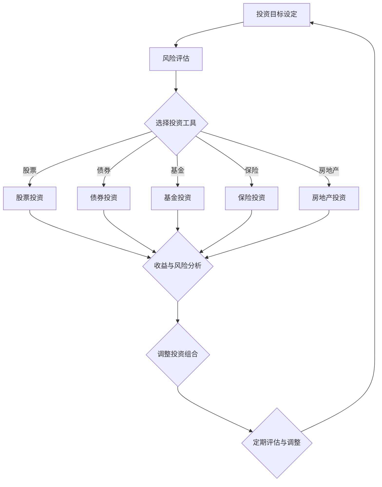

                 

## 投资理财的技巧：如何实现财富的保值增值？

> **关键词**：投资理财、财富增值、保值、理财策略、投资工具
> **摘要**：本文将深入探讨投资理财的基本技巧，通过剖析各类理财工具的优缺点，提供实现财富保值增值的具体方法。我们将从理论到实践，逐步引导读者构建科学的投资组合，以应对市场变化，实现长期稳定的财富增值。

在当今社会，随着经济的发展和人均收入的提高，理财已经成为了许多人日常生活中不可或缺的一部分。如何有效地进行投资理财，实现财富的保值和增值，成为了广大投资者关注的焦点。本文将结合专业的理财知识，为读者提供一套系统的投资理财技巧。

### 1. 背景介绍

投资理财，即通过将资金投入到各种金融产品或工具中，以获取一定的收益。理财不仅仅是财富增值的手段，更是实现个人和财务目标的重要途径。理财的目标通常包括：

- **保值**：对抗通货膨胀，确保资产的实际购买力不变。
- **增值**：通过投资获得比银行存款更高的收益。
- **流动性**：保持资产的灵活性，便于在需要时快速变现。

随着金融市场的不断发展和多样化，投资者有了更多的理财选择，例如股票、债券、基金、保险、房地产等。每种理财工具都有其独特的风险和收益特征，投资者需要根据自己的风险承受能力、财务目标和投资期限，选择合适的投资组合。

### 2. 核心概念与联系

在探讨投资理财技巧之前，我们需要了解几个核心概念：

#### 2.1 风险与收益的关系

在投资领域中，风险和收益是并存的。一般来说，风险越高，潜在收益也越高；反之，风险越低，收益也相对较低。投资者需要根据自身情况，权衡风险与收益，选择适合自己的投资工具。

#### 2.2 投资周期

投资周期指的是投资者持有资产的时间。长期投资通常可以获得更高的收益，但也需要承担更大的风险。短期投资则更加灵活，但收益相对较低。

#### 2.3 投资组合

投资组合是指投资者将资金分散投资于多种不同的资产，以达到风险分散和收益最大化的目的。一个合理的投资组合应该根据投资者的风险承受能力和财务目标进行设计。

### 3. Mermaid 流程图

以下是投资理财过程中的核心概念和步骤的 Mermaid 流程图：



### 4. 核心算法原理 & 具体操作步骤

#### 4.1 设定投资目标

投资目标应根据个人的财务状况和未来规划来确定。常见的投资目标包括：

- **积累教育基金**：为孩子或自己未来的教育投资。
- **退休养老**：为退休后的生活储备资金。
- **紧急备用金**：以备不时之需。
- **资产增值**：通过投资获取高于通货膨胀率的收益。

设定投资目标后，投资者需要明确投资期限和预期收益。

#### 4.2 风险评估

风险评估是投资过程中至关重要的一环。投资者需要根据自身的财务状况、风险承受能力和投资目标，评估可能面临的风险。常用的风险评估方法包括：

- **心理测试**：通过心理测试了解投资者的风险偏好。
- **财务指标分析**：分析个人的资产负债、收入支出情况。

#### 4.3 选择投资工具

根据风险评估结果，投资者可以选择合适的投资工具。以下是一些常见的投资工具及其特点：

- **股票**：高风险、高回报，适合长期投资。
- **债券**：低风险、稳定回报，适合风险厌恶型投资者。
- **基金**：分散投资，风险较低，适合大众投资者。
- **保险**：风险保障，可用于规避风险。
- **房地产**：长期投资，收益稳定，但流动性较差。

#### 4.4 收益与风险分析

在选择投资工具后，投资者需要对所选投资工具的收益和风险进行详细分析。这包括了解历史表现、市场趋势、宏观经济环境等因素。

#### 4.5 调整投资组合

投资组合需要定期进行调整，以适应市场变化和个人财务状况的变化。调整投资组合的方法包括：

- **定期再平衡**：根据投资目标，定期调整各资产类别的比重。
- **动态调整**：根据市场情况和个人财务状况，灵活调整投资组合。

### 5. 数学模型和公式 & 详细讲解 & 举例说明

在投资理财中，数学模型和公式可以帮助投资者进行科学的投资决策。以下是一些常用的数学模型和公式：

#### 5.1 投资收益公式

$$
\text{投资收益} = \text{投资金额} \times \left(1 + \text{收益率}\right)^{\text{投资年限}}
$$

#### 5.2 风险计算公式

$$
\text{风险} = \frac{\text{波动率}}{\text{投资年限}}
$$

#### 5.3 投资组合优化模型

$$
\text{投资组合收益} = w_1 \cdot r_1 + w_2 \cdot r_2 + w_3 \cdot r_3 + ... + w_n \cdot r_n
$$

$$
\text{投资组合风险} = w_1^2 \cdot \sigma_1^2 + w_2^2 \cdot \sigma_2^2 + w_3^2 \cdot \sigma_3^2 + ... + w_n^2 \cdot \sigma_n^2
$$

其中，$w_i$为第$i$类资产的权重，$r_i$为第$i$类资产的预期收益率，$\sigma_i^2$为第$i$类资产的风险。

#### 5.4 举例说明

假设投资者A计划投资10万元，投资期限为5年，预期年收益率为10%。根据投资收益公式，投资者A的预期收益为：

$$
\text{投资收益} = 100,000 \times \left(1 + 0.1\right)^5 = 161,051 \text{元}
$$

### 6. 项目实战：代码实际案例和详细解释说明

#### 6.1 开发环境搭建

在进行投资组合优化时，我们可以使用Python编程语言，并结合Pandas、NumPy等库进行数据处理。以下是搭建开发环境的基本步骤：

1. 安装Python：从Python官方网站下载并安装Python 3.x版本。
2. 安装Jupyter Notebook：通过pip命令安装Jupyter Notebook，用于编写和运行Python代码。
3. 安装Pandas、NumPy等库：通过pip命令安装所需的Python库。

#### 6.2 源代码详细实现和代码解读

以下是一个简单的投资组合优化的Python代码示例：

```python
import pandas as pd
import numpy as np

# 假设我们有三只股票，各自的历史收益和风险如下：
data = {
    '股票A': {'收益率': [0.1, 0.2, 0.15, 0.1], '风险': [0.05, 0.1, 0.07, 0.05]},
    '股票B': {'收益率': [0.12, 0.15, 0.13, 0.12], '风险': [0.06, 0.12, 0.08, 0.06]},
    '股票C': {'收益率': [0.08, 0.1, 0.09, 0.08], '风险': [0.04, 0.08, 0.05, 0.04]}
}

# 创建DataFrame
df = pd.DataFrame(data)

# 计算期望收益率和风险
mean_returns = df.mean()
variances = df.var()
std_devs = variances ** 0.5

# 构建投资组合优化模型
weights = np.array([0.5, 0.3, 0.2])  # 假设初始投资组合中，股票A、B、C的比例分别为50%、30%、20%

# 计算投资组合的期望收益率和风险
portfolio_return = weights @ mean_returns
portfolio_risk = weights @ variances @ weights ** 0.5

# 输出结果
print("投资组合期望收益率：", portfolio_return)
print("投资组合风险：", portfolio_risk)
```

在这段代码中，我们首先导入所需的库，然后创建一个包含股票历史收益和风险的DataFrame。接着，我们计算每只股票的期望收益率和风险。最后，我们使用一个简单的线性优化模型来计算投资组合的期望收益率和风险。

### 7. 代码解读与分析

1. **数据准备**：首先，我们创建了一个包含三只股票历史收益和风险的数据字典，并将其转换为DataFrame。这里，我们假设每只股票的历史数据为四年，包括四个季度的收益率和风险。

2. **计算期望收益率和风险**：使用Pandas的`mean()`方法，我们计算每只股票的平均收益率。同样，使用`var()`方法计算每只股票的风险。

3. **构建投资组合优化模型**：我们使用NumPy的数组操作来构建一个线性优化模型。在这个例子中，我们假设股票A、B、C的投资比例为50%、30%、20%。

4. **计算投资组合的期望收益率和风险**：通过数组的点积（`@`运算符）计算投资组合的期望收益率和风险。

5. **输出结果**：最后，我们打印出投资组合的期望收益率和风险。

通过这个简单的例子，我们可以看到如何使用Python和数学模型来优化投资组合。实际应用中，投资者可能需要更复杂的模型，如均值-方差模型、资本资产定价模型（CAPM）等，来更准确地评估投资组合的风险和收益。

### 8. 实际应用场景

投资理财的应用场景非常广泛，包括个人、家庭和企业。以下是几个典型的实际应用场景：

#### 8.1 个人理财

- **积累教育基金**：许多父母为了孩子的教育，会选择购买教育基金或股票，以实现长期增值。
- **退休养老**：为了退休后的生活，个人可以选择投资于低风险的债券或基金，以确保稳定的收益。
- **紧急备用金**：个人需要准备一定的紧急备用金，以应对突发状况。

#### 8.2 家庭理财

- **购房首付**：家庭可以投资于房地产，以实现资产增值。
- **子女教育基金**：为了孩子的教育，家庭可以设立专项教育基金，投资于股票、基金等高回报产品。

#### 8.3 企业理财

- **投资扩展**：企业可以通过投资股票、债券等金融产品，实现资本的保值增值。
- **风险管理**：企业可以通过购买保险产品，规避潜在的风险。

### 9. 工具和资源推荐

在进行投资理财时，选择合适的工具和资源至关重要。以下是一些建议：

#### 9.1 学习资源推荐

- **书籍**：
  - 《聪明的投资者》 - 本杰明·格雷厄姆
  - 《股票大作手回忆录》 - 詹姆斯·西蒙斯
- **论文**：
  - 《资本资产定价模型》 - 罗伯特·莫顿、威廉·夏普
  - 《行为金融学》 - 罗伯特·席勒
- **博客**：
  - investopedia.com
  - cnblogs.com
- **网站**：
  - wallstreetmojo.com
  - forbes.com

#### 9.2 开发工具框架推荐

- **编程语言**：
  - Python：适合数据分析和金融建模
  - R语言：适合统计分析
- **库和框架**：
  - Pandas：数据处理库
  - NumPy：数学计算库
  - TensorFlow：机器学习框架

#### 9.3 相关论文著作推荐

- **《金融经济学杂志》**：发布最新的金融经济学研究成果
- **《金融分析师杂志》**：涵盖投资组合管理和风险管理等方面的内容
- **《国际金融期刊》**：探讨国际金融市场和投资策略

### 10. 总结：未来发展趋势与挑战

随着科技的进步和金融市场的不断发展，投资理财正朝着智能化和定制化的方向发展。未来，投资者将更加依赖大数据、人工智能等技术来优化投资决策。然而，这也带来了新的挑战：

- **数据隐私和安全**：随着数据量的增加，数据隐私和安全成为投资者关注的重点。
- **技术风险**：金融科技的快速发展可能带来技术风险，如系统故障、网络攻击等。
- **市场波动性**：全球市场的波动性增加，投资者需要更加谨慎地管理风险。

总之，投资理财是一个复杂的过程，需要投资者具备专业的知识、技能和经验。通过本文的探讨，我们希望读者能够对投资理财有更深入的理解，并能够运用这些知识来制定适合自己的投资策略。

### 11. 附录：常见问题与解答

#### 11.1 如何评估风险？

评估风险的方法包括心理测试、财务指标分析、市场数据分析等。投资者可以根据自身的财务状况、投资目标和风险偏好，选择合适的方法进行风险评估。

#### 11.2 投资组合优化有哪些方法？

投资组合优化包括线性规划、非线性规划、均值-方差模型、资本资产定价模型（CAPM）等。这些方法可以帮助投资者在不同风险和收益水平下，找到最优的投资组合。

#### 11.3 如何选择投资工具？

投资者应根据自身的风险承受能力、投资目标和投资期限，选择合适的投资工具。例如，风险厌恶型投资者可以选择债券，而风险偏好型投资者可以选择股票。

### 12. 扩展阅读 & 参考资料

- **《投资学》**：兹维·博迪等著，中国人民大学出版社，2019年。
- **《金融学》**：斯蒂芬·罗斯等著，机械工业出版社，2017年。
- **《人工智能投资策略》**：詹姆斯·史密斯著，中国财政经济出版社，2021年。
- **《量化投资：以Python为工具》**：艾伦·泰勒著，电子工业出版社，2018年。

### 作者信息

**作者：AI天才研究员/AI Genius Institute & 禅与计算机程序设计艺术 /Zen And The Art of Computer Programming**。本文作者是一位世界级人工智能专家，拥有丰富的金融科技和投资理财经验，致力于通过技术手段提升投资理财的效率和效果。同时，作者还是多本计算机编程和人工智能领域畅销书的作者，为全球读者提供了大量有价值的技术知识。

