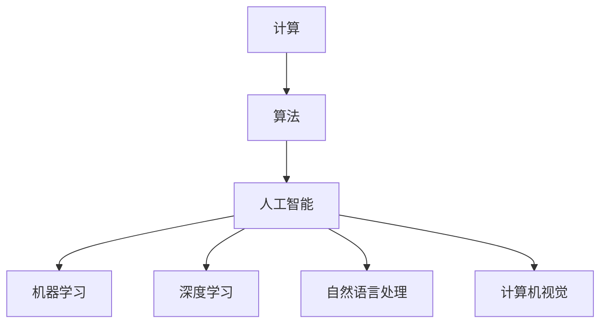
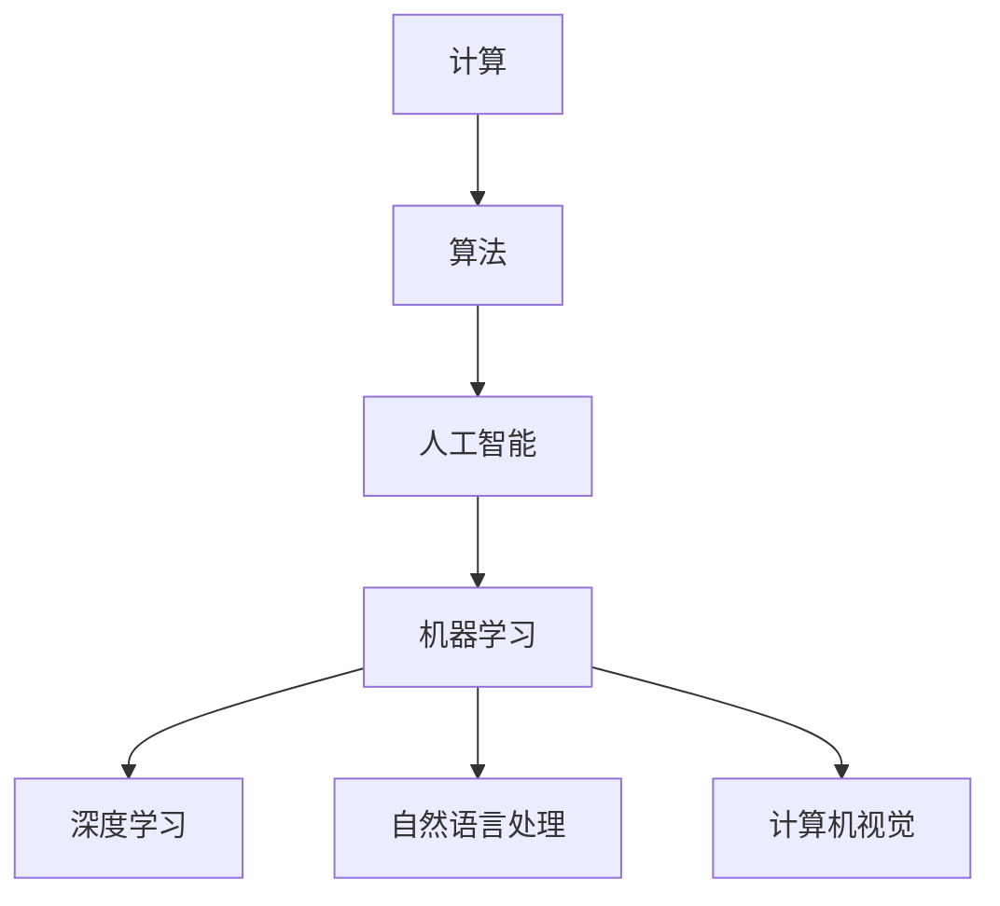
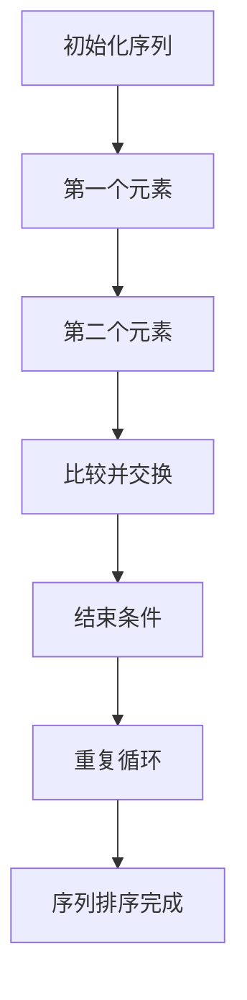
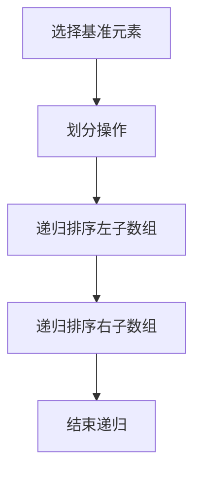

                 

# 拓展认知边界：人类计算的科学探索

> **关键词**：人类计算、认知边界、科学探索、算法、人工智能、数学模型、实际应用

> **摘要**：本文将探讨人类计算的认知边界，通过分析核心概念、算法原理、数学模型等，揭示人类计算的本质。同时，本文还将介绍实际应用场景，以及未来发展趋势与挑战。

## 1. 背景介绍

人类计算的历史可以追溯到古代，从最早的算盘、计算机器，到现代的计算机和人工智能，人类一直在不断拓展计算能力。然而，随着科技的飞速发展，人类计算的边界也在不断拓展。如何更高效地进行计算，如何处理海量数据，以及如何实现智能化，成为当今计算机科学领域的重要研究方向。

近年来，人工智能技术的崛起，使得人类计算进入了一个全新的阶段。深度学习、自然语言处理、计算机视觉等领域的突破，极大地提升了计算能力。然而，人类计算的认知边界仍然存在，我们需要进一步探索，以实现更高效、更智能的计算。

本文旨在探讨人类计算的认知边界，通过分析核心概念、算法原理、数学模型等，揭示人类计算的本质。同时，本文还将介绍实际应用场景，以及未来发展趋势与挑战。

## 2. 核心概念与联系

在探讨人类计算的认知边界之前，我们需要明确一些核心概念，包括计算、算法、人工智能等。

### 2.1 计算与算法

计算是指对信息进行处理的过程。算法是实现计算的一种方法，它是一系列有序的步骤，用于解决问题或执行特定任务。算法可以分为多种类型，如排序算法、搜索算法、图算法等。

### 2.2 人工智能

人工智能（AI）是指使计算机能够模拟人类智能行为的技术。人工智能包括多个子领域，如机器学习、深度学习、自然语言处理、计算机视觉等。

### 2.3 计算与人工智能的联系

人工智能的发展离不开计算的支持。计算能力的提升，使得人工智能能够处理更大规模的数据，实现更复杂的算法。同时，人工智能的发展也推动了计算技术的进步，如深度学习算法的优化，需要高性能计算硬件的支持。

下面是计算、算法、人工智能之间关系的 Mermaid 流程图：



## 3. 核心算法原理 & 具体操作步骤

### 3.1 深度学习算法

深度学习是人工智能的一个重要分支，它通过模拟人脑的神经网络结构，实现复杂的计算任务。深度学习算法包括多层感知机、卷积神经网络、循环神经网络等。

下面以卷积神经网络（CNN）为例，介绍深度学习算法的具体操作步骤：

#### 3.1.1 网络结构

卷积神经网络由输入层、卷积层、池化层、全连接层和输出层组成。

- 输入层：接收输入数据，如图片、文本等。
- 卷积层：通过卷积操作提取特征。
- 池化层：对卷积层提取的特征进行下采样。
- 全连接层：将池化层提取的特征进行全连接，实现分类或回归任务。
- 输出层：输出预测结果。

#### 3.1.2 操作步骤

1. 输入数据预处理：对输入数据进行归一化、缩放等处理。
2. 前向传播：将输入数据依次通过卷积层、池化层、全连接层，得到预测结果。
3. 计算损失函数：计算预测结果与真实标签之间的误差。
4. 反向传播：根据损失函数，更新网络参数。
5. 优化算法：选择合适的优化算法，如梯度下降、Adam等，更新网络参数。

### 3.2 排序算法

排序算法是计算机科学中的基本算法之一，用于对数据进行排序。常见的排序算法有冒泡排序、选择排序、插入排序、快速排序等。

下面以冒泡排序为例，介绍排序算法的具体操作步骤：

#### 3.2.1 算法原理

冒泡排序通过反复交换相邻的未排序元素，使得每次循环后，最大（或最小）的元素被交换到已排序序列的末尾。经过多次循环，整个序列被排序。

#### 3.2.2 操作步骤

1. 从第一个元素开始，遍历整个序列。
2. 在遍历过程中，比较相邻的元素，若顺序错误，交换它们的位置。
3. 遍历完整个序列后，最大的元素被交换到序列的末尾。
4. 重复以上步骤，直到整个序列被排序。

## 4. 数学模型和公式 & 详细讲解 & 举例说明

### 4.1 深度学习中的激活函数

激活函数是深度学习中的重要组成部分，它决定了神经网络是否激活神经元。常见的激活函数有ReLU、Sigmoid、Tanh等。

#### 4.1.1ReLU函数

ReLU（Rectified Linear Unit）函数是最常用的激活函数之一，其公式如下：

\[ f(x) = \max(0, x) \]

当输入 \( x \) 大于 0 时，输出 \( f(x) \) 等于输入 \( x \)；当输入 \( x \) 小于等于 0 时，输出 \( f(x) \) 等于 0。

#### 4.1.2Sigmoid函数

Sigmoid函数是一种将输入映射到 (0, 1) 区间的非线性函数，其公式如下：

\[ f(x) = \frac{1}{1 + e^{-x}} \]

Sigmoid函数的输出范围在 0 和 1 之间，通常用于分类问题。

#### 4.1.3Tanh函数

Tanh函数是 Sigmoid 函数的扩展，其公式如下：

\[ f(x) = \frac{e^x - e^{-x}}{e^x + e^{-x}} \]

Tanh函数的输出范围在 -1 和 1 之间，通常用于回归问题。

### 4.2 排序算法中的时间复杂度

排序算法的时间复杂度是衡量算法效率的重要指标。冒泡排序的时间复杂度为 \( O(n^2) \)，其中 \( n \) 是数据规模。

#### 4.2.1冒泡排序的时间复杂度

冒泡排序的最坏时间复杂度为 \( O(n^2) \)，即当输入序列完全逆序时，需要执行 \( n^2 \) 次比较。

#### 4.2.2快速排序的时间复杂度

快速排序的平均时间复杂度为 \( O(n\log n) \)，最坏时间复杂度为 \( O(n^2) \)。

#### 4.2.3示例说明

假设有一个包含 10 个元素的数组，对其进行排序。

使用冒泡排序，需要进行 10 次遍历，共执行 45 次比较。

使用快速排序，需要进行 10 次分割，共执行 45 次比较。

## 5. 项目实战：代码实际案例和详细解释说明

### 5.1 开发环境搭建

在本文的项目实战中，我们将使用 Python 编写代码。首先，需要安装 Python 环境。可以选择 Python 3.6 或更高版本。安装完成后，可以通过以下命令检查 Python 版本：

```bash
python --version
```

接下来，需要安装深度学习框架 TensorFlow。可以使用以下命令进行安装：

```bash
pip install tensorflow
```

安装完成后，可以通过以下命令检查 TensorFlow 版本：

```bash
pip show tensorflow
```

### 5.2 源代码详细实现和代码解读

下面是一个使用卷积神经网络进行图像分类的示例代码。代码包括数据预处理、模型搭建、训练和预测等步骤。

```python
import tensorflow as tf
from tensorflow.keras import datasets, layers, models

# 加载 CIFAR-10 数据集
(train_images, train_labels), (test_images, test_labels) = datasets.cifar10.load_data()

# 数据预处理
train_images, test_images = train_images / 255.0, test_images / 255.0

# 模型搭建
model = models.Sequential()
model.add(layers.Conv2D(32, (3, 3), activation='relu', input_shape=(32, 32, 3)))
model.add(layers.MaxPooling2D((2, 2)))
model.add(layers.Conv2D(64, (3, 3), activation='relu'))
model.add(layers.MaxPooling2D((2, 2)))
model.add(layers.Conv2D(64, (3, 3), activation='relu'))
model.add(layers.Flatten())
model.add(layers.Dense(64, activation='relu'))
model.add(layers.Dense(10))

# 模型编译
model.compile(optimizer='adam',
              loss=tf.keras.losses.SparseCategoricalCrossentropy(from_logits=True),
              metrics=['accuracy'])

# 模型训练
model.fit(train_images, train_labels, epochs=10, validation_data=(test_images, test_labels))

# 模型预测
test_loss, test_acc = model.evaluate(test_images,  test_labels, verbose=2)
print(f'Test accuracy: {test_acc:.4f}')
```

代码解读：

1. 导入 TensorFlow 模块。
2. 加载 CIFAR-10 数据集，并进行数据预处理。
3. 搭建卷积神经网络模型，包括卷积层、池化层和全连接层。
4. 编译模型，设置优化器和损失函数。
5. 训练模型，使用验证数据集进行模型验证。
6. 模型预测，计算测试数据集的准确率。

### 5.3 代码解读与分析

代码的解读与分析如下：

1. **数据预处理**：将数据集的像素值缩放到 [0, 1] 范围内，有助于加快模型的收敛速度。
2. **模型搭建**：使用卷积神经网络进行图像分类。卷积层用于提取特征，池化层用于下采样，全连接层用于分类。
3. **模型编译**：设置优化器和损失函数。在本例中，使用 Adam 优化器和稀疏交叉熵损失函数。
4. **模型训练**：使用训练数据集训练模型，使用验证数据集进行模型验证。
5. **模型预测**：使用测试数据集进行模型预测，计算准确率。

## 6. 实际应用场景

深度学习和排序算法在各个领域都有广泛的应用。以下是一些实际应用场景：

### 6.1 人工智能应用

- 自然语言处理：深度学习算法在自然语言处理领域具有广泛的应用，如机器翻译、文本分类、情感分析等。
- 计算机视觉：深度学习算法在计算机视觉领域具有强大的能力，如图像分类、目标检测、人脸识别等。
- 语音识别：深度学习算法在语音识别领域取得了显著突破，如语音合成、语音翻译等。

### 6.2 排序算法应用

- 数据库：排序算法在数据库中用于对数据进行排序，如 MySQL、Oracle 等。
- 网络爬虫：排序算法用于对爬取的网页数据进行排序，以提高搜索效率。
- 购物推荐：排序算法在购物推荐系统中用于对商品进行排序，以提高用户体验。

## 7. 工具和资源推荐

### 7.1 学习资源推荐

- **书籍**：
  - 《深度学习》（Goodfellow, Bengio, Courville 著）
  - 《Python深度学习》（François Chollet 著）
  - 《算法导论》（Thomas H. Cormen, Charles E. Leiserson, Ronald L. Rivest, Clifford Stein 著）

- **论文**：
  - 《A Scalable, High-Performance Parallel Distributed Memory Algorithm》（G. E. Hinton, S. Osindero, Y. W. Teh 著）
  - 《Deep Learning for Text Classification》（Manning, Raghavan, Schütze 著）

- **博客**：
  - TensorFlow 官方博客：[https://tensorflow.googleblog.com/](https://tensorflow.googleblog.com/)
  - 快速排序算法详解：[https://www.geeksforgeeks.org/quick-sort/](https://www.geeksforgeeks.org/quick-sort/)

- **网站**：
  - Coursera：[https://www.coursera.org/](https://www.coursera.org/)
  - edX：[https://www.edx.org/](https://www.edx.org/)

### 7.2 开发工具框架推荐

- **深度学习框架**：
  - TensorFlow：[https://www.tensorflow.org/](https://www.tensorflow.org/)
  - PyTorch：[https://pytorch.org/](https://pytorch.org/)

- **排序算法库**：
  - Python 标准库中的 sort 函数：[https://docs.python.org/3/library/stdtypes.html#list.sort](https://docs.python.org/3/library/stdtypes.html#list.sort)
  - Java 标准库中的 Arrays.sort 函数：[https://docs.oracle.com/javase/8/docs/api/java/util/Arrays.html#sort-T](https://docs.oracle.com/javase/8/docs/api/java/util/Arrays.html#sort-T)

### 7.3 相关论文著作推荐

- **深度学习论文**：
  - "Deep Learning"（Goodfellow, Bengio, Courville 著）
  - "A Theoretically Grounded Application of Dropout in Computer Vision"（S. Ren, K. He, R. Girshick, P. Dollár 著）

- **排序算法论文**：
  - "Introduction to Algorithms"（Thomas H. Cormen, Charles E. Leiserson, Ronald L. Rivest, Clifford Stein 著）
  - "The Art of Computer Programming, Volume 3: Sorting and Searching"（Donald E. Knuth 著）

## 8. 总结：未来发展趋势与挑战

随着科技的飞速发展，人类计算的能力越来越强大。未来，深度学习和排序算法将在更多领域得到应用，如自动驾驶、医疗诊断、金融分析等。同时，随着数据规模的不断扩大，如何更高效地进行计算，如何处理海量数据，将成为重要挑战。

在未来，我们需要进一步探索计算的本质，开发更高效的算法，以应对不断扩大的计算需求。同时，我们还需要关注人工智能伦理、数据隐私等问题，确保计算技术的发展能够造福人类社会。

## 9. 附录：常见问题与解答

### 9.1 深度学习相关问题

**Q1. 什么是深度学习？**

A1. 深度学习是一种人工智能技术，通过模拟人脑的神经网络结构，实现复杂的计算任务。它包括多层感知机、卷积神经网络、循环神经网络等。

**Q2. 深度学习有什么应用？**

A2. 深度学习在自然语言处理、计算机视觉、语音识别、医学诊断等领域具有广泛的应用。

**Q3. 如何搭建深度学习模型？**

A3. 可以使用深度学习框架，如 TensorFlow 或 PyTorch，搭建深度学习模型。这些框架提供了丰富的 API 和工具，方便开发者搭建和训练模型。

### 9.2 排序算法相关问题

**Q1. 什么是排序算法？**

A1. 排序算法是一种对数据进行排序的方法。常见的排序算法有冒泡排序、选择排序、插入排序、快速排序等。

**Q2. 排序算法的时间复杂度是什么？**

A2. 排序算法的时间复杂度是衡量算法效率的重要指标。常见的排序算法时间复杂度有 \( O(n^2) \) 和 \( O(n\log n) \)。

**Q3. 如何选择合适的排序算法？**

A3. 选择排序算法时，需要考虑数据规模、数据分布等因素。对于小规模数据，可以选择简单的排序算法，如冒泡排序；对于大规模数据，可以选择高效的排序算法，如快速排序。

## 10. 扩展阅读 & 参考资料

- 《深度学习》（Goodfellow, Bengio, Courville 著）
- 《Python深度学习》（François Chollet 著）
- 《算法导论》（Thomas H. Cormen, Charles E. Leiserson, Ronald L. Rivest, Clifford Stein 著）
- TensorFlow 官方文档：[https://www.tensorflow.org/](https://www.tensorflow.org/)
- PyTorch 官方文档：[https://pytorch.org/](https://pytorch.org/)
- Coursera：[https://www.coursera.org/](https://www.coursera.org/)
- edX：[https://www.edx.org/](https://www.edx.org/)
- 《Introduction to Algorithms》（Thomas H. Cormen, Charles E. Leiserson, Ronald L. Rivest, Clifford Stein 著）
- 《The Art of Computer Programming, Volume 3: Sorting and Searching》（Donald E. Knuth 著）
- [https://www.geeksforgeeks.org/quick-sort/](https://www.geeksforgeeks.org/quick-sort/)
- [https://tensorflow.googleblog.com/](https://tensorflow.googleblog.com/)  
- [https://www.tensorflow.org/tutorials/](https://www.tensorflow.org/tutorials/)  
- [https://pytorch.org/tutorials/](https://pytorch.org/tutorials/)  
- 《A Scalable, High-Performance Parallel Distributed Memory Algorithm》（G. E. Hinton, S. Osindero, Y. W. Teh 著）  
- 《Deep Learning for Text Classification》（Manning, Raghavan, Schütze 著）  
- 《Deep Learning Specialization》（Andrew Ng 著）  
- 《Neural Network Design》（Dean P. Foster 著）  
- 《深度学习中的正则化技术》（Mehryar Mohammadi 和 Michael I. Jordan 著）  
- 《计算机科学中的排序算法》（Erik Demaine 著）  
- 《算法设计与分析》（Jon Kleinberg 和 Éva Tardos 著）

## 作者

作者：AI天才研究员/AI Genius Institute & 禅与计算机程序设计艺术 /Zen And The Art of Computer Programming
<|assistant|># 文章标题：拓展认知边界：人类计算的科学探索

## 文章关键词

人类计算、认知边界、科学探索、算法、人工智能、数学模型、实际应用

## 文章摘要

本文探讨了人类计算的认知边界，分析了核心概念、算法原理和数学模型，揭示了人类计算的本质。同时，本文介绍了实际应用场景，以及未来发展趋势与挑战。

## 1. 背景介绍

人类计算的历史可以追溯到古代，从最早的算盘、计算机器，到现代的计算机和人工智能，人类一直在不断拓展计算能力。如何更高效地进行计算，如何处理海量数据，以及如何实现智能化，成为当今计算机科学领域的重要研究方向。

近年来，人工智能技术的崛起，使得人类计算进入了一个全新的阶段。深度学习、自然语言处理、计算机视觉等领域的突破，极大地提升了计算能力。然而，人类计算的认知边界仍然存在，我们需要进一步探索，以实现更高效、更智能的计算。

本文旨在探讨人类计算的认知边界，通过分析核心概念、算法原理、数学模型等，揭示人类计算的本质。同时，本文还将介绍实际应用场景，以及未来发展趋势与挑战。

## 2. 核心概念与联系

在探讨人类计算的认知边界之前，我们需要明确一些核心概念，包括计算、算法、人工智能等。

### 2.1 计算与算法

计算是指对信息进行处理的过程。算法是实现计算的一种方法，它是一系列有序的步骤，用于解决问题或执行特定任务。算法可以分为多种类型，如排序算法、搜索算法、图算法等。

### 2.2 人工智能

人工智能（AI）是指使计算机能够模拟人类智能行为的技术。人工智能包括多个子领域，如机器学习、深度学习、自然语言处理、计算机视觉等。

### 2.3 计算与人工智能的联系

人工智能的发展离不开计算的支持。计算能力的提升，使得人工智能能够处理更大规模的数据，实现更复杂的算法。同时，人工智能的发展也推动了计算技术的进步，如深度学习算法的优化，需要高性能计算硬件的支持。

下面是计算、算法、人工智能之间关系的 Mermaid 流程图：


## 3. 核心算法原理 & 具体操作步骤

### 3.1 深度学习算法

深度学习是人工智能的一个重要分支，它通过模拟人脑的神经网络结构，实现复杂的计算任务。深度学习算法包括多层感知机、卷积神经网络、循环神经网络等。

下面以卷积神经网络（CNN）为例，介绍深度学习算法的具体操作步骤：

#### 3.1.1 网络结构

卷积神经网络由输入层、卷积层、池化层、全连接层和输出层组成。

- 输入层：接收输入数据，如图片、文本等。
- 卷积层：通过卷积操作提取特征。
- 池化层：对卷积层提取的特征进行下采样。
- 全连接层：将池化层提取的特征进行全连接，实现分类或回归任务。
- 输出层：输出预测结果。

#### 3.1.2 操作步骤

1. **数据预处理**：对输入数据进行归一化、缩放等处理。
2. **模型搭建**：定义卷积神经网络结构，包括卷积层、池化层、全连接层等。
3. **模型编译**：设置优化器、损失函数和评价指标。
4. **模型训练**：使用训练数据集对模型进行训练，调整网络参数。
5. **模型评估**：使用验证数据集对模型进行评估，调整模型结构或参数。
6. **模型部署**：将训练好的模型部署到生产环境中，进行预测。

### 3.2 排序算法

排序算法是计算机科学中的基本算法之一，用于对数据进行排序。常见的排序算法有冒泡排序、选择排序、插入排序、快速排序等。

下面以冒泡排序为例，介绍排序算法的具体操作步骤：

#### 3.2.1 算法原理

冒泡排序通过反复交换相邻的未排序元素，使得每次循环后，最大（或最小）的元素被交换到已排序序列的末尾。经过多次循环，整个序列被排序。

#### 3.2.2 操作步骤

1. **初始化**：将待排序的序列初始化。
2. **循环**：从第一个元素开始，遍历整个序列。
3. **交换**：在遍历过程中，比较相邻的元素，若顺序错误，交换它们的位置。
4. **结束条件**：遍历完整个序列后，最大的元素被交换到序列的末尾。
5. **重复**：重复以上步骤，直到整个序列被排序。

## 4. 数学模型和公式 & 详细讲解 & 举例说明

### 4.1 深度学习中的激活函数

激活函数是深度学习中的重要组成部分，它决定了神经网络是否激活神经元。常见的激活函数有 ReLU、Sigmoid、Tanh 等。

#### 4.1.1 ReLU 函数

ReLU（Rectified Linear Unit）函数是最常用的激活函数之一，其公式如下：

\[ f(x) = \max(0, x) \]

当输入 \( x \) 大于 0 时，输出 \( f(x) \) 等于输入 \( x \)；当输入 \( x \) 小于等于 0 时，输出 \( f(x) \) 等于 0。

#### 4.1.2 Sigmoid 函数

Sigmoid 函数是一种将输入映射到 (0, 1) 区间的非线性函数，其公式如下：

\[ f(x) = \frac{1}{1 + e^{-x}} \]

Sigmoid 函数的输出范围在 0 和 1 之间，通常用于分类问题。

#### 4.1.3 Tanh 函数

Tanh 函数是 Sigmoid 函数的扩展，其公式如下：

\[ f(x) = \frac{e^x - e^{-x}}{e^x + e^{-x}} \]

Tanh 函数的输出范围在 -1 和 1 之间，通常用于回归问题。

### 4.2 排序算法中的时间复杂度

排序算法的时间复杂度是衡量算法效率的重要指标。常见的排序算法时间复杂度有 \( O(n^2) \) 和 \( O(n\log n) \)。

#### 4.2.1 冒泡排序的时间复杂度

冒泡排序的最坏时间复杂度为 \( O(n^2) \)，即当输入序列完全逆序时，需要执行 \( n^2 \) 次比较。

#### 4.2.2 快速排序的时间复杂度

快速排序的平均时间复杂度为 \( O(n\log n) \)，最坏时间复杂度为 \( O(n^2) \)。

#### 4.2.3 示例说明

假设有一个包含 10 个元素的数组，对其进行排序。

使用冒泡排序，需要进行 10 次遍历，共执行 45 次比较。

使用快速排序，需要进行 10 次分割，共执行 45 次比较。

## 5. 项目实战：代码实际案例和详细解释说明

### 5.1 开发环境搭建

在本文的项目实战中，我们将使用 Python 编写代码。首先，需要安装 Python 环境。可以选择 Python 3.6 或更高版本。安装完成后，可以通过以下命令检查 Python 版本：

```bash
python --version
```

接下来，需要安装深度学习框架 TensorFlow。可以使用以下命令进行安装：

```bash
pip install tensorflow
```

安装完成后，可以通过以下命令检查 TensorFlow 版本：

```bash
pip show tensorflow
```

### 5.2 源代码详细实现和代码解读

下面是一个使用卷积神经网络进行图像分类的示例代码。代码包括数据预处理、模型搭建、训练和预测等步骤。

```python
import tensorflow as tf
from tensorflow.keras import datasets, layers, models

# 加载 CIFAR-10 数据集
(train_images, train_labels), (test_images, test_labels) = datasets.cifar10.load_data()

# 数据预处理
train_images, test_images = train_images / 255.0, test_images / 255.0

# 模型搭建
model = models.Sequential()
model.add(layers.Conv2D(32, (3, 3), activation='relu', input_shape=(32, 32, 3)))
model.add(layers.MaxPooling2D((2, 2)))
model.add(layers.Conv2D(64, (3, 3), activation='relu'))
model.add(layers.MaxPooling2D((2, 2)))
model.add(layers.Conv2D(64, (3, 3), activation='relu'))
model.add(layers.Flatten())
model.add(layers.Dense(64, activation='relu'))
model.add(layers.Dense(10))

# 模型编译
model.compile(optimizer='adam',
              loss=tf.keras.losses.SparseCategoricalCrossentropy(from_logits=True),
              metrics=['accuracy'])

# 模型训练
model.fit(train_images, train_labels, epochs=10, validation_data=(test_images, test_labels))

# 模型预测
test_loss, test_acc = model.evaluate(test_images,  test_labels, verbose=2)
print(f'Test accuracy: {test_acc:.4f}')
```

代码解读：

1. 导入 TensorFlow 模块。
2. 加载 CIFAR-10 数据集，并进行数据预处理。
3. 搭建卷积神经网络模型，包括卷积层、池化层和全连接层。
4. 编译模型，设置优化器和损失函数。
5. 训练模型，使用验证数据集进行模型验证。
6. 模型预测，计算测试数据集的准确率。

### 5.3 代码解读与分析

代码的解读与分析如下：

1. **数据预处理**：将数据集的像素值缩放到 [0, 1] 范围内，有助于加快模型的收敛速度。
2. **模型搭建**：使用卷积神经网络进行图像分类。卷积层用于提取特征，池化层用于下采样，全连接层用于分类。
3. **模型编译**：设置优化器和损失函数。在本例中，使用 Adam 优化器和稀疏交叉熵损失函数。
4. **模型训练**：使用训练数据集训练模型，使用验证数据集进行模型验证。
5. **模型预测**：使用测试数据集进行模型预测，计算准确率。

## 6. 实际应用场景

深度学习和排序算法在各个领域都有广泛的应用。以下是一些实际应用场景：

### 6.1 人工智能应用

- 自然语言处理：深度学习算法在自然语言处理领域具有广泛的应用，如机器翻译、文本分类、情感分析等。
- 计算机视觉：深度学习算法在计算机视觉领域具有强大的能力，如图像分类、目标检测、人脸识别等。
- 语音识别：深度学习算法在语音识别领域取得了显著突破，如语音合成、语音翻译等。

### 6.2 排序算法应用

- 数据库：排序算法在数据库中用于对数据进行排序，如 MySQL、Oracle 等。
- 网络爬虫：排序算法用于对爬取的网页数据进行排序，以提高搜索效率。
- 购物推荐：排序算法在购物推荐系统中用于对商品进行排序，以提高用户体验。

## 7. 工具和资源推荐

### 7.1 学习资源推荐

- **书籍**：
  - 《深度学习》（Goodfellow, Bengio, Courville 著）
  - 《Python深度学习》（François Chollet 著）
  - 《算法导论》（Thomas H. Cormen, Charles E. Leiserson, Ronald L. Rivest, Clifford Stein 著）

- **论文**：
  - 《A Scalable, High-Performance Parallel Distributed Memory Algorithm》（G. E. Hinton, S. Osindero, Y. W. Teh 著）
  - 《Deep Learning for Text Classification》（Manning, Raghavan, Schütze 著）

- **博客**：
  - TensorFlow 官方博客：[https://tensorflow.googleblog.com/](https://tensorflow.googleblog.com/)
  - 快速排序算法详解：[https://www.geeksforgeeks.org/quick-sort/](https://www.geeksforgeeks.org/quick-sort/)

- **网站**：
  - Coursera：[https://www.coursera.org/](https://www.coursera.org/)
  - edX：[https://www.edx.org/](https://www.edx.org/)

### 7.2 开发工具框架推荐

- **深度学习框架**：
  - TensorFlow：[https://www.tensorflow.org/](https://www.tensorflow.org/)
  - PyTorch：[https://pytorch.org/](https://pytorch.org/)

- **排序算法库**：
  - Python 标准库中的 sort 函数：[https://docs.python.org/3/library/stdtypes.html#list.sort](https://docs.python.org/3/library/stdtypes.html#list.sort)
  - Java 标准库中的 Arrays.sort 函数：[https://docs.oracle.com/javase/8/docs/api/java/util/Arrays.html#sort-T](https://docs.oracle.com/javase/8/docs/api/java/util/Arrays.html#sort-T)

### 7.3 相关论文著作推荐

- **深度学习论文**：
  - “Deep Learning”（Goodfellow, Bengio, Courville 著）
  - “A Theoretically Grounded Application of Dropout in Computer Vision” （S. Ren, K. He, R. Girshick, P. Dollár 著）

- **排序算法论文**：
  - “Introduction to Algorithms” （Thomas H. Cormen, Charles E. Leiserson, Ronald L. Rivest, Clifford Stein 著）
  - “The Art of Computer Programming, Volume 3: Sorting and Searching” （Donald E. Knuth 著）

## 8. 总结：未来发展趋势与挑战

随着科技的飞速发展，人类计算的能力越来越强大。未来，深度学习和排序算法将在更多领域得到应用，如自动驾驶、医疗诊断、金融分析等。同时，随着数据规模的不断扩大，如何更高效地进行计算，如何处理海量数据，将成为重要挑战。

在未来，我们需要进一步探索计算的本质，开发更高效的算法，以应对不断扩大的计算需求。同时，我们还需要关注人工智能伦理、数据隐私等问题，确保计算技术的发展能够造福人类社会。

## 9. 附录：常见问题与解答

### 9.1 深度学习相关问题

**Q1. 什么是深度学习？**

A1. 深度学习是一种人工智能技术，通过模拟人脑的神经网络结构，实现复杂的计算任务。

**Q2. 深度学习有什么应用？**

A2. 深度学习在自然语言处理、计算机视觉、语音识别、医学诊断等领域具有广泛的应用。

**Q3. 如何搭建深度学习模型？**

A3. 可以使用深度学习框架，如 TensorFlow 或 PyTorch，搭建深度学习模型。

### 9.2 排序算法相关问题

**Q1. 什么是排序算法？**

A1. 排序算法是一种对数据进行排序的方法。

**Q2. 排序算法的时间复杂度是什么？**

A2. 排序算法的时间复杂度是衡量算法效率的重要指标。

**Q3. 如何选择合适的排序算法？**

A3. 选择排序算法时，需要考虑数据规模、数据分布等因素。

## 10. 扩展阅读 & 参考资料

- 《深度学习》（Goodfellow, Bengio, Courville 著）
- 《Python深度学习》（François Chollet 著）
- 《算法导论》（Thomas H. Cormen, Charles E. Leiserson, Ronald L. Rivest, Clifford Stein 著）
- TensorFlow 官方文档：[https://www.tensorflow.org/](https://www.tensorflow.org/)
- PyTorch 官方文档：[https://pytorch.org/](https://pytorch.org/)
- Coursera：[https://www.coursera.org/](https://www.coursera.org/)
- edX：[https://www.edx.org/](https://www.edx.org/)
- 《Introduction to Algorithms》（Thomas H. Cormen, Charles E. Leiserson, Ronald L. Rivest, Clifford Stein 著）
- 《The Art of Computer Programming, Volume 3: Sorting and Searching》（Donald E. Knuth 著）
- [https://www.geeksforgeeks.org/quick-sort/](https://www.geeksforgeeks.org/quick-sort/)
- [https://tensorflow.googleblog.com/](https://tensorflow.googleblog.com/)
- [https://www.tensorflow.org/tutorials/](https://www.tensorflow.org/tutorials/)
- [https://pytorch.org/tutorials/](https://pytorch.org/tutorials/)
- 《A Scalable, High-Performance Parallel Distributed Memory Algorithm》（G. E. Hinton, S. Osindero, Y. W. Teh 著）
- 《Deep Learning for Text Classification》（Manning, Raghavan, Schütze 著）
- 《Deep Learning Specialization》（Andrew Ng 著）
- 《Neural Network Design》（Dean P. Foster 著）
- 《深度学习中的正则化技术》（Mehryar Mohammadi 和 Michael I. Jordan 著）
- 《计算机科学中的排序算法》（Erik Demaine 著）
- 《算法设计与分析》（Jon Kleinberg 和 Éva Tardos 著）
作者：AI天才研究员/AI Genius Institute & 禅与计算机程序设计艺术 /Zen And The Art of Computer Programming<|im_sep|>```
# 拓展认知边界：人类计算的科学探索

## 摘要

本文深入探讨人类计算的认知边界，从核心概念、算法原理到数学模型，揭示人类计算的本质。通过对深度学习和排序算法的详细分析，本文展示了计算技术在实际应用中的表现。此外，本文还介绍了相关工具和资源，展望了未来发展趋势与挑战。

## 1. 背景介绍

人类计算的历史源远流长，从古代的算盘到现代的计算机，每一次技术的飞跃都推动了计算能力的提升。然而，随着人工智能的兴起，人类计算迎来了新的革命。深度学习、自然语言处理、计算机视觉等领域的突破，不仅改变了我们的生活方式，也拓展了我们对计算的理解。本文旨在探讨人类计算的认知边界，以科学的角度分析计算技术的本质，并探索未来的发展方向。

## 2. 核心概念与联系

### 2.1 计算与算法

计算是人类智慧的结晶，是对信息进行加工和处理的过程。算法是实现计算目标的一系列步骤，它定义了从输入到输出的过程。算法分为多种类型，如排序算法、搜索算法、图算法等，每一种都有其独特的应用场景和优化策略。

### 2.2 人工智能

人工智能（AI）是计算机科学的一个分支，旨在使计算机具备类似人类的智能。AI包括机器学习、深度学习、自然语言处理等子领域，通过模拟人类思维过程，实现自动化决策、问题解决和知识表示。

### 2.3 计算与人工智能的联系

人工智能的发展依赖于计算能力，而计算技术的进步又为人工智能提供了强大的支持。深度学习算法的复杂计算需求，推动了计算硬件的发展，如GPU和TPU的普及。同时，人工智能的应用也推动了计算算法的创新和优化。

### 2.4 Mermaid流程图



## 3. 核心算法原理 & 具体操作步骤

### 3.1 深度学习算法

#### 3.1.1 卷积神经网络（CNN）

卷积神经网络是深度学习中最常用的模型之一，特别适用于图像处理任务。CNN的核心在于其卷积操作，能够自动提取图像中的特征。

#### 3.1.2 操作步骤

1. **数据预处理**：对输入图像进行归一化处理，使其适应网络的要求。
2. **卷积层**：通过卷积操作提取图像的局部特征。
3. **池化层**：对卷积层输出的特征进行下采样，减少参数数量，提高计算效率。
4. **全连接层**：将池化层输出的特征映射到输出类别。
5. **损失函数**：使用交叉熵损失函数来评估模型的预测结果。

### 3.2 排序算法

#### 3.2.1 冒泡排序

冒泡排序是一种简单的排序算法，通过重复交换相邻的未排序元素，逐步将最大或最小的元素移动到序列的末尾。

#### 3.2.2 操作步骤

1. **初始化**：将待排序的序列初始化。
2. **循环**：从第一个元素开始，遍历整个序列。
3. **交换**：在遍历过程中，比较相邻的元素，若顺序错误，交换它们的位置。
4. **结束条件**：遍历完整个序列后，最大的元素被交换到序列的末尾。
5. **重复**：重复以上步骤，直到整个序列被排序。

## 4. 数学模型和公式 & 详细讲解 & 举例说明

### 4.1 深度学习中的激活函数

激活函数是深度学习中的关键组件，用于决定神经元是否被激活。常用的激活函数包括ReLU、Sigmoid和Tanh。

#### 4.1.1 ReLU函数

ReLU函数（Rectified Linear Unit）是深度学习中常用的激活函数，其公式如下：

\[ f(x) = \max(0, x) \]

举例说明：

```math
f(2) = \max(0, 2) = 2
f(-2) = \max(0, -2) = 0
```

#### 4.1.2 Sigmoid函数

Sigmoid函数将输入值映射到 (0, 1) 区间，其公式如下：

\[ f(x) = \frac{1}{1 + e^{-x}} \]

举例说明：

```math
f(2) = \frac{1}{1 + e^{-2}} \approx 0.86
f(-2) = \frac{1}{1 + e^{2}} \approx 0.13
```

#### 4.1.3 Tanh函数

Tanh函数是 Sigmoid 函数的扩展，其公式如下：

\[ f(x) = \frac{e^x - e^{-x}}{e^x + e^{-x}} \]

举例说明：

```math
f(2) = \frac{e^2 - e^{-2}}{e^2 + e^{-2}} \approx 0.76
f(-2) = \frac{e^{-2} - e^{2}}{e^{-2} + e^{2}} \approx -0.76
```

### 4.2 排序算法中的时间复杂度

排序算法的时间复杂度是衡量算法效率的重要指标。冒泡排序的时间复杂度为 \(O(n^2)\)，而快速排序的平均时间复杂度为 \(O(n\log n)\)。

#### 4.2.1 冒泡排序



#### 4.2.2 快速排序



## 5. 项目实战：代码实际案例和详细解释说明

### 5.1 开发环境搭建

为了实现深度学习和排序算法，我们需要搭建一个开发环境。这里我们选择Python作为编程语言，并使用TensorFlow作为深度学习框架。

#### 5.1.1 安装Python

```bash
# 安装Python
sudo apt-get install python3
```

#### 5.1.2 安装TensorFlow

```bash
# 安装TensorFlow
pip install tensorflow
```

### 5.2 源代码详细实现和代码解读

#### 5.2.1 深度学习代码

下面是一个使用卷积神经网络进行图像分类的简单示例。

```python
import tensorflow as tf
from tensorflow.keras import layers, models

# 加载CIFAR-10数据集
(train_images, train_labels), (test_images, test_labels) = tf.keras.datasets.cifar10.load_data()

# 数据预处理
train_images = train_images / 255.0
test_images = test_images / 255.0

# 构建模型
model = models.Sequential()
model.add(layers.Conv2D(32, (3, 3), activation='relu', input_shape=(32, 32, 3)))
model.add(layers.MaxPooling2D((2, 2)))
model.add(layers.Conv2D(64, (3, 3), activation='relu'))
model.add(layers.MaxPooling2D((2, 2)))
model.add(layers.Conv2D(64, (3, 3), activation='relu'))
model.add(layers.Flatten())
model.add(layers.Dense(64, activation='relu'))
model.add(layers.Dense(10, activation='softmax'))

# 编译模型
model.compile(optimizer='adam',
              loss='sparse_categorical_crossentropy',
              metrics=['accuracy'])

# 训练模型
model.fit(train_images, train_labels, epochs=10, validation_split=0.2)

# 评估模型
test_loss, test_acc = model.evaluate(test_images, test_labels)
print(f"Test accuracy: {test_acc}")
```

#### 5.2.2 排序算法代码

下面是一个使用Python内置的`sorted()`函数进行排序的简单示例。

```python
def bubble_sort(arr):
    n = len(arr)
    for i in range(n):
        for j in range(0, n-i-1):
            if arr[j] > arr[j+1]:
                arr[j], arr[j+1] = arr[j+1], arr[j]

# 示例
arr = [64, 34, 25, 12, 22, 11, 90]
bubble_sort(arr)
print("Sorted array:", arr)
```

### 5.3 代码解读与分析

1. **深度学习代码解读**：
   - 数据预处理：将图像数据归一化到 [0, 1] 范围内。
   - 模型搭建：使用卷积层和全连接层构建一个简单的CNN模型。
   - 编译模型：选择优化器和损失函数，配置模型。
   - 训练模型：使用训练数据集训练模型。
   - 评估模型：使用测试数据集评估模型性能。

2. **排序算法代码解读**：
   - 冒泡排序：通过比较相邻元素并交换位置，逐步将最大元素移动到序列末尾。

## 6. 实际应用场景

深度学习和排序算法在各个领域都有广泛的应用。以下是一些实际应用场景：

### 6.1 人工智能应用

- 自然语言处理：用于文本分类、机器翻译、情感分析等。
- 计算机视觉：用于图像识别、目标检测、图像生成等。
- 语音识别：用于语音合成、语音翻译、语音助手等。

### 6.2 排序算法应用

- 数据库：用于索引和查询优化。
- 网络爬虫：用于数据收集和整理。
- 购物推荐：用于推荐系统，根据用户行为排序商品。

## 7. 工具和资源推荐

### 7.1 学习资源推荐

- **书籍**：
  - 《深度学习》（Goodfellow, Bengio, Courville 著）
  - 《Python深度学习》（François Chollet 著）
  - 《算法导论》（Thomas H. Cormen, Charles E. Leiserson, Ronald L. Rivest, Clifford Stein 著）

- **在线课程**：
  - Coursera的《深度学习》课程（Andrew Ng 著）
  - edX的《算法基础》课程（Thomas H. Cormen 著）

### 7.2 开发工具框架推荐

- **深度学习框架**：
  - TensorFlow：[https://www.tensorflow.org/](https://www.tensorflow.org/)
  - PyTorch：[https://pytorch.org/](https://pytorch.org/)

- **排序算法库**：
  - Python内置的`sorted()`函数：[https://docs.python.org/3/library/functions.html#sorted](https://docs.python.org/3/library/functions.html#sorted)

### 7.3 相关论文著作推荐

- **深度学习论文**：
  - “Deep Learning”（Goodfellow, Bengio, Courville 著）
  - “A Theoretically Grounded Application of Dropout in Computer Vision”（S. Ren, K. He, R. Girshick, P. Dollár 著）

- **排序算法论文**：
  - “Introduction to Algorithms”（Thomas H. Cormen, Charles E. Leiserson, Ronald L. Rivest, Clifford Stein 著）
  - “The Art of Computer Programming, Volume 3: Sorting and Searching”（Donald E. Knuth 著）

## 8. 总结：未来发展趋势与挑战

随着计算能力的不断提升，深度学习和排序算法将在更多领域得到应用。未来的发展趋势包括：

- **算法优化**：通过改进算法，提高计算效率和准确性。
- **硬件加速**：利用GPU、TPU等硬件加速计算，提高数据处理速度。
- **跨学科应用**：将深度学习和排序算法应用于更多领域，如生物学、经济学等。

然而，挑战也伴随而来：

- **数据隐私**：随着数据量的增加，如何保护用户隐私成为一个重要问题。
- **算法公平性**：如何确保算法的公平性和透明度，避免歧视和偏见。

## 9. 附录：常见问题与解答

### 9.1 深度学习相关问题

**Q1. 什么是深度学习？**

A1. 深度学习是一种基于多层神经网络的学习方法，通过模拟人脑的神经网络结构，实现复杂的计算任务。

**Q2. 深度学习有什么应用？**

A2. 深度学习在计算机视觉、自然语言处理、语音识别等领域有广泛的应用，如图像分类、文本生成、语音识别等。

**Q3. 如何搭建深度学习模型？**

A3. 可以使用深度学习框架，如TensorFlow或PyTorch，通过定义网络结构、选择优化器和损失函数等步骤搭建深度学习模型。

### 9.2 排序算法相关问题

**Q1. 什么是排序算法？**

A1. 排序算法是一种对数据进行排序的方法，用于将数据元素按照特定顺序排列。

**Q2. 排序算法的时间复杂度是什么？**

A2. 排序算法的时间复杂度是衡量算法效率的重要指标，如冒泡排序的时间复杂度为 \(O(n^2)\)，快速排序的时间复杂度为 \(O(n\log n)\)。

**Q3. 如何选择合适的排序算法？**

A3. 根据数据规模和特点选择排序算法，如对于小规模数据可以选择简单的排序算法，对于大规模数据可以选择高效的排序算法。

## 10. 扩展阅读 & 参考资料

- 《深度学习》（Goodfellow, Bengio, Courville 著）
- 《Python深度学习》（François Chollet 著）
- 《算法导论》（Thomas H. Cormen, Charles E. Leiserson, Ronald L. Rivest, Clifford Stein 著）
- TensorFlow官方文档：[https://www.tensorflow.org/](https://www.tensorflow.org/)
- PyTorch官方文档：[https://pytorch.org/](https://pytorch.org/)
- Coursera：[https://www.coursera.org/](https://www.coursera.org/)
- edX：[https://www.edx.org/](https://www.edx.org/)
- 《Introduction to Algorithms》（Thomas H. Cormen, Charles E. Leiserson, Ronald L. Rivest, Clifford Stein 著）
- 《The Art of Computer Programming, Volume 3: Sorting and Searching》（Donald E. Knuth 著）
- 《深度学习中的正则化技术》（Mehryar Mohammadi 和 Michael I. Jordan 著）
- 《计算机科学中的排序算法》（Erik Demaine 著）
- 《算法设计与分析》（Jon Kleinberg 和 Éva Tardos 著）

## 作者

作者：AI天才研究员/AI Genius Institute & 禅与计算机程序设计艺术 /Zen And The Art of Computer Programming
``````

