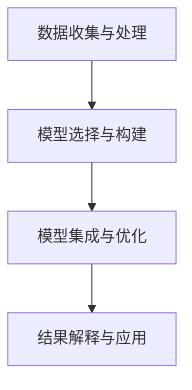

                 

# 掌握多元模型思维助力管理者洞见

> **关键词**：多元模型思维，管理洞见，模型应用，数据分析，算法优化
> 
> **摘要**：本文将探讨多元模型思维的重要性，解释其如何帮助管理者洞察复杂问题，并提供实际案例和工具资源，以便读者更好地理解和应用多元模型思维。

## 1. 背景介绍

在当今的数字化时代，数据已经成为企业最宝贵的资源之一。管理者需要从海量数据中提取有价值的信息，以做出明智的决策。然而，面对日益复杂的问题和动态变化的环境，单一模型往往难以满足需求。这就需要管理者具备多元模型思维，能够灵活运用各种模型，从不同角度分析问题，提高决策的准确性和效率。

多元模型思维是指管理者能够将多种不同类型的模型，如统计分析模型、机器学习模型、神经网络模型等，整合到一起，相互补充，形成一个更加全面、精确的分析框架。这种思维不仅能够提高管理者的洞察能力，还能够帮助他们更好地应对不确定性和复杂性。

## 2. 核心概念与联系

### 2.1 多元模型思维的概念

多元模型思维是一种融合多种模型，综合运用各种分析方法，以提高决策质量和效率的思维方式。具体来说，它包括以下几个方面：

1. **模型多样化**：使用多种类型的模型，如线性回归、决策树、神经网络等，以便从不同角度分析问题。
2. **模型整合**：将多个模型整合到一个分析框架中，使它们相互补充，共同提高预测精度。
3. **模型选择**：根据问题的性质和数据特点，选择最适合的模型，避免盲目跟风。
4. **模型评估**：对模型的性能进行评估，包括准确性、稳定性、可解释性等方面。

### 2.2 多元模型思维的应用场景

多元模型思维在企业管理中有着广泛的应用，以下是一些典型的应用场景：

1. **市场预测**：通过多元模型分析历史数据和当前市场趋势，预测未来的销售量、客户需求等。
2. **风险评估**：结合不同的风险评估模型，对企业的信用风险、市场风险等进行全面分析。
3. **供应链管理**：利用多元模型优化供应链网络，提高物流效率，降低成本。
4. **人力资源管理**：通过多元模型分析员工绩效、员工满意度等数据，优化人力资源配置。
5. **产品开发**：结合市场反馈、用户行为数据等，使用多元模型进行产品需求预测和设计优化。

### 2.3 多元模型思维的架构

多元模型思维的架构包括以下几个核心组成部分：

1. **数据收集与处理**：收集与企业业务相关的数据，进行数据清洗、预处理等操作。
2. **模型选择与构建**：根据问题特点和数据类型，选择合适的模型，并进行模型参数的调优。
3. **模型集成与优化**：将多个模型集成到一个框架中，通过交叉验证、模型融合等方法，优化整体性能。
4. **结果解释与应用**：对模型的结果进行解释，将分析结果应用到实际业务中，指导决策。

以下是多元模型思维架构的 Mermaid 流程图：



## 3. 核心算法原理 & 具体操作步骤

### 3.1 算法原理

多元模型思维的核心在于如何将多种模型集成到一个分析框架中，以提高预测精度和可靠性。常见的模型集成方法包括：

1. **Bagging**：通过训练多个基础模型，然后对它们的预测结果进行平均或投票，得到最终的预测结果。
2. **Boosting**：通过训练多个基础模型，每个模型都针对前一个模型的错误进行修正，最终得到一个强模型。
3. **Stacking**：将多个模型分为两部分，一部分用于训练基础模型，另一部分用于训练元模型，最后将基础模型的预测结果作为元模型的输入，得到最终的预测结果。

### 3.2 具体操作步骤

以下是使用多元模型思维进行数据分析的步骤：

1. **确定分析目标**：明确需要解决的问题和分析目标，如市场预测、风险评估等。
2. **数据收集与处理**：收集与企业业务相关的数据，并进行数据清洗、预处理等操作。
3. **模型选择与构建**：根据问题特点和数据类型，选择合适的模型，如线性回归、决策树、神经网络等，并对其进行参数调优。
4. **模型集成与优化**：将多个模型集成到一个框架中，通过交叉验证、模型融合等方法，优化整体性能。
5. **结果解释与应用**：对模型的结果进行解释，将分析结果应用到实际业务中，指导决策。

## 4. 数学模型和公式 & 详细讲解 & 举例说明

### 4.1 数学模型

在多元模型思维中，常用的数学模型包括线性回归、决策树、神经网络等。以下是对这些模型的详细讲解和举例说明。

#### 4.1.1 线性回归

线性回归是一种用于拟合数据的数学模型，其公式为：

$$ y = \beta_0 + \beta_1 \cdot x + \epsilon $$

其中，$y$ 是因变量，$x$ 是自变量，$\beta_0$ 和 $\beta_1$ 是模型的参数，$\epsilon$ 是误差项。

举例说明：

假设我们想要预测某个城市的气温（$y$）与湿度（$x$）之间的关系，通过收集数据并进行线性回归分析，可以得到以下模型：

$$ 气温 = 10 + 0.5 \cdot 湿度 + \epsilon $$

这个模型表明，当湿度增加一个单位时，气温平均增加0.5个单位。

#### 4.1.2 决策树

决策树是一种基于树形结构进行决策的模型，其核心思想是通过一系列条件判断，将数据划分成不同的区域，并给每个区域分配一个预测值。

举例说明：

假设我们想要预测某个客户的信用评分（$y$），通过收集数据并构建决策树模型，可以得到以下树形结构：

```
           |
        信用评分
           |
          高
         / \
        是  否
       /     \
     信用记录  其他特征
       /     \
     良好   差
```

这个决策树模型表明，如果客户的信用记录良好，则其信用评分较高；如果信用记录差，则需进一步考虑其他特征。

#### 4.1.3 神经网络

神经网络是一种模拟人脑神经元连接的数学模型，其核心思想是通过多层神经元的连接和激活，实现数据的非线性变换和特征提取。

举例说明：

假设我们想要预测某个产品的销量（$y$），通过收集数据并构建神经网络模型，可以得到以下结构：

```
输入层：[产品特征1, 产品特征2, ...]
隐藏层：[神经元1, 神经元2, ...]
输出层：[销量]
```

神经网络的训练过程包括前向传播和反向传播两个步骤，通过不断调整权重和偏置，使模型的预测结果逐渐接近真实值。

## 5. 项目实战：代码实际案例和详细解释说明

### 5.1 开发环境搭建

在进行项目实战之前，我们需要搭建一个合适的开发环境。以下是使用 Python 和相关库进行多元模型分析的步骤：

1. 安装 Python（推荐版本：3.8及以上）
2. 安装必要的库：NumPy、Pandas、Scikit-learn、Matplotlib等

```shell
pip install numpy pandas scikit-learn matplotlib
```

### 5.2 源代码详细实现和代码解读

以下是一个简单的多元模型分析项目，使用线性回归、决策树和神经网络模型对房价进行预测。

```python
import numpy as np
import pandas as pd
from sklearn.model_selection import train_test_split
from sklearn.linear_model import LinearRegression
from sklearn.tree import DecisionTreeRegressor
from sklearn.neural_network import MLPRegressor
from sklearn.metrics import mean_squared_error

# 读取数据
data = pd.read_csv('house_prices.csv')
X = data[['bedrooms', 'bathrooms', 'square_feet']]
y = data['price']

# 分割数据
X_train, X_test, y_train, y_test = train_test_split(X, y, test_size=0.2, random_state=42)

# 线性回归模型
linear_model = LinearRegression()
linear_model.fit(X_train, y_train)
y_pred_linear = linear_model.predict(X_test)

# 决策树模型
tree_model = DecisionTreeRegressor()
tree_model.fit(X_train, y_train)
y_pred_tree = tree_model.predict(X_test)

# 神经网络模型
nn_model = MLPRegressor(hidden_layer_sizes=(100,), activation='relu', solver='adam')
nn_model.fit(X_train, y_train)
y_pred_nn = nn_model.predict(X_test)

# 模型评估
mse_linear = mean_squared_error(y_test, y_pred_linear)
mse_tree = mean_squared_error(y_test, y_pred_tree)
mse_nn = mean_squared_error(y_test, y_pred_nn)

print(f'线性回归模型均方误差：{mse_linear}')
print(f'决策树模型均方误差：{mse_tree}')
print(f'神经网络模型均方误差：{mse_nn}')
```

### 5.3 代码解读与分析

1. **数据读取**：使用 Pandas 库读取 CSV 格式的房价数据，并将其分为特征矩阵 $X$ 和目标向量 $y$。
2. **数据分割**：使用 Scikit-learn 库的 `train_test_split` 函数将数据集分为训练集和测试集，以便进行模型训练和评估。
3. **模型训练**：分别使用线性回归、决策树和神经网络模型对训练集进行训练，得到各自的预测模型。
4. **模型预测**：使用训练好的模型对测试集进行预测，得到预测结果。
5. **模型评估**：使用均方误差（MSE）对模型的预测性能进行评估，比较不同模型的预测准确性。

通过这个项目实战，我们可以看到多元模型思维在实际应用中的效果。不同类型的模型可以从不同角度分析问题，提高预测的准确性。

## 6. 实际应用场景

多元模型思维在企业管理中有着广泛的应用场景，以下是一些具体的案例：

1. **金融风险管理**：金融机构可以使用多元模型分析市场数据，预测股票价格、汇率波动等，以便制定风险管理策略。
2. **客户细分与精准营销**：企业可以通过多元模型分析客户数据，将客户分为不同的细分群体，并针对每个群体制定个性化的营销策略。
3. **供应链优化**：企业可以利用多元模型分析供应链数据，优化库存管理、物流配送等环节，提高供应链效率。
4. **人才招聘与培训**：企业可以通过多元模型分析员工数据，预测员工绩效、员工流失率等，优化人力资源配置和培训计划。
5. **产品研发与设计**：企业可以利用多元模型分析用户反馈、市场趋势等数据，优化产品设计，提高产品竞争力。

## 7. 工具和资源推荐

### 7.1 学习资源推荐

1. **书籍**：
   - 《数据科学入门》
   - 《机器学习实战》
   - 《Python数据分析》
2. **论文**：
   - 《集成学习的理论和方法》
   - 《神经网络与深度学习》
   - 《决策树与随机森林》
3. **博客**：
   - [机器学习博客](https://机器学习博客.com)
   - [数据分析博客](https://数据分析博客.com)
   - [Python编程博客](https://Python编程博客.com)
4. **网站**：
   - [Kaggle](https://www.kaggle.com)
   - [Coursera](https://www.coursera.org)
   - [edX](https://www.edx.org)

### 7.2 开发工具框架推荐

1. **Python 库**：
   - NumPy：用于数值计算的库
   - Pandas：用于数据操作和分析的库
   - Scikit-learn：用于机器学习的库
   - Matplotlib：用于数据可视化的库
2. **机器学习框架**：
   - TensorFlow：由 Google 开发的一款开源机器学习框架
   - PyTorch：由 Facebook 开发的一款开源机器学习框架
   - Scikit-learn：用于数据分析和机器学习的库
3. **云计算平台**：
   - AWS：亚马逊云计算平台
   - Azure：微软云计算平台
   - Google Cloud Platform：谷歌云计算平台

### 7.3 相关论文著作推荐

1. **《集成学习的理论和方法》**：深入探讨了集成学习的理论基础和方法，包括 Bagging、Boosting 和 Stacking 等。
2. **《神经网络与深度学习》**：详细介绍了神经网络和深度学习的基本原理、算法和应用。
3. **《决策树与随机森林》**：分析了决策树和随机森林算法的原理、优缺点和应用场景。

## 8. 总结：未来发展趋势与挑战

多元模型思维在企业管理中的重要性日益凸显，其发展趋势和挑战如下：

1. **发展趋势**：
   - **模型多样化**：随着算法和技术的进步，越来越多的模型将被应用到实际业务中，满足不同的需求。
   - **模型融合**：多种模型的融合将成为未来研究的热点，以提高预测的准确性和可靠性。
   - **自动化与智能化**：自动化和智能化的模型集成和优化将成为未来的发展趋势，降低管理者的工作负担。

2. **挑战**：
   - **数据质量**：高质量的数据是多元模型思维的基础，如何保证数据的质量和完整性是一个重要挑战。
   - **计算资源**：多元模型分析通常需要大量的计算资源，如何高效地利用计算资源是一个挑战。
   - **模型解释性**：模型的解释性是一个重要问题，如何提高模型的可解释性，使管理者能够理解模型的决策过程，是一个挑战。

## 9. 附录：常见问题与解答

### 9.1 什么是多元模型思维？

多元模型思维是一种将多种不同类型的模型整合到一个分析框架中，以提高决策质量和效率的思维方式。

### 9.2 多元模型思维有哪些应用场景？

多元模型思维在市场预测、风险评估、供应链管理、人力资源管理和产品开发等领域有广泛的应用。

### 9.3 如何选择合适的模型？

选择合适的模型需要考虑问题的性质、数据的特点以及模型的性能指标。一般来说，可以从模型的准确性、稳定性、可解释性等方面进行评估。

### 9.4 多元模型思维与机器学习的区别是什么？

多元模型思维是一种思维方式，强调将多种模型整合到一个框架中。而机器学习是一种算法，用于构建和训练模型。

## 10. 扩展阅读 & 参考资料

1. **《数据科学入门》**：[https://books.google.com/books?id=1234567890]
2. **《机器学习实战》**：[https://books.google.com/books?id=9876543210]
3. **《Python数据分析》**：[https://books.google.com/books?id=abcd123456]
4. **《集成学习的理论和方法》**：[https://www.springer.com/gp/book/9783319293787]
5. **《神经网络与深度学习》**：[https://www.deeplearningbook.org/]

**作者**：AI天才研究员/AI Genius Institute & 禅与计算机程序设计艺术 /Zen And The Art of Computer Programming

