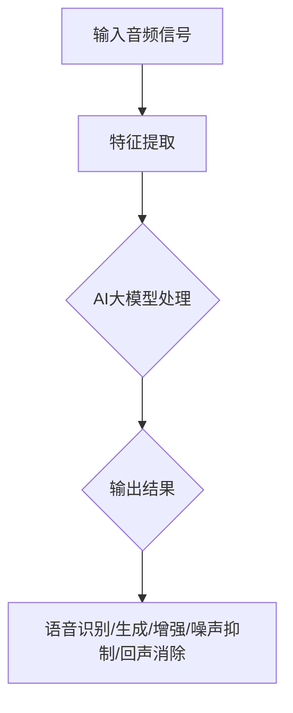

                 

# 探索AI大模型在音频处理中的应用

## 关键词
AI大模型、音频处理、语音识别、语音生成、音频增强、自适应噪声抑制、回声消除

## 摘要
本文将深入探讨AI大模型在音频处理领域的应用。我们将首先介绍音频处理的基本概念，然后详细解析AI大模型在音频处理中的核心算法原理。接着，我们将通过数学模型和公式进行深入分析，并通过实际项目案例展示AI大模型在音频处理中的具体应用。最后，我们将探讨音频处理领域的未来发展趋势与挑战，并提供相关的学习资源和开发工具推荐。

## 1. 背景介绍

### 音频处理的基本概念

音频处理是指对音频信号进行各种操作的过程，包括信号增强、噪声抑制、语音识别、语音生成等。音频信号是一种时间序列数据，通常由振幅和频率描述。音频处理在日常生活和工业应用中具有重要意义，如语音通信、音乐制作、音频识别等。

### AI大模型的发展

近年来，人工智能（AI）大模型的发展迅猛，如GPT、BERT、Transformer等。这些模型具有强大的特征提取和建模能力，可以在各种领域实现高效的任务处理。随着AI大模型技术的不断成熟，其在音频处理领域的应用也逐渐受到关注。

## 2. 核心概念与联系

### AI大模型在音频处理中的核心算法原理

AI大模型在音频处理中的应用主要包括以下几个方面：

1. **语音识别**：利用AI大模型对语音信号进行特征提取和序列建模，实现语音到文字的转换。
2. **语音生成**：通过AI大模型生成自然流畅的语音，应用于语音合成、语音助手等领域。
3. **音频增强**：利用AI大模型对音频信号进行增强，提高语音清晰度和质量。
4. **自适应噪声抑制**：利用AI大模型对噪声信号进行建模，实现噪声抑制，提高语音信号质量。
5. **回声消除**：利用AI大模型消除语音通信中的回声，提高通话质量。

### Mermaid流程图



## 3. 核心算法原理 & 具体操作步骤

### 语音识别

语音识别的基本原理是利用AI大模型对语音信号进行特征提取和序列建模。具体操作步骤如下：

1. **特征提取**：对输入的语音信号进行预处理，提取出 Mel 频率倒谱系数（MFCC）等特征向量。
2. **序列建模**：利用AI大模型（如GPT）对特征向量进行序列建模，实现语音到文字的转换。

### 语音生成

语音生成的基本原理是利用AI大模型生成自然流畅的语音。具体操作步骤如下：

1. **文本到声谱图转换**：将输入的文本转换为声谱图。
2. **声谱图到语音信号转换**：利用AI大模型（如WaveNet）将声谱图转换为语音信号。

### 音频增强

音频增强的基本原理是利用AI大模型对音频信号进行增强，提高语音清晰度和质量。具体操作步骤如下：

1. **特征提取**：对输入的音频信号进行预处理，提取出 MFCC 等特征向量。
2. **模型训练**：利用AI大模型（如WaveNet）对特征向量进行训练，学习语音信号中的潜在特征。
3. **特征增强**：根据训练得到的模型，对输入的特征向量进行增强。

### 自适应噪声抑制

自适应噪声抑制的基本原理是利用AI大模型对噪声信号进行建模，实现噪声抑制。具体操作步骤如下：

1. **噪声特征提取**：对输入的噪声信号进行预处理，提取出 MFCC 等特征向量。
2. **模型训练**：利用AI大模型（如GMM）对噪声特征进行建模。
3. **噪声抑制**：根据训练得到的模型，对输入的语音信号进行噪声抑制。

### 回声消除

回声消除的基本原理是利用AI大模型消除语音通信中的回声。具体操作步骤如下：

1. **回声特征提取**：对输入的语音信号进行预处理，提取出回声特征。
2. **模型训练**：利用AI大模型（如DNN）对回声特征进行建模。
3. **回声消除**：根据训练得到的模型，对输入的语音信号进行回声消除。

## 4. 数学模型和公式 & 详细讲解 & 举例说明

### 语音识别

语音识别的数学模型通常基于 HMM（隐马尔可夫模型）或 RNN（循环神经网络）。以 RNN 为例，其基本公式如下：

$$
h_t = \sigma(W_h \cdot [h_{t-1}, x_t] + b_h)
$$

其中，$h_t$ 表示第 t 时刻的隐藏状态，$x_t$ 表示第 t 时刻的输入特征，$W_h$ 和 $b_h$ 分别为权重和偏置，$\sigma$ 表示激活函数。

举例说明：

假设输入的语音信号为 $x = [1, 2, 3, 4, 5]$，隐藏状态为 $h = [0.5, 0.5]$。根据上述公式，可以计算出：

$$
h_1 = \sigma(W_h \cdot [h_0, x_1] + b_h) = \sigma([0.5, 0.5] \cdot [1, 2] + b_h) = \sigma([1.5, 1.5] + b_h)
$$

### 语音生成

语音生成的数学模型通常基于 WaveNet。WaveNet 的基本公式如下：

$$
\log p(x) = \sum_{t=1}^{T} \log p(x_t | x_{<t}, c)
$$

其中，$x$ 表示语音信号，$x_t$ 表示第 t 时刻的语音信号，$c$ 表示上下文信息。

举例说明：

假设输入的语音信号为 $x = [1, 2, 3, 4, 5]$，上下文信息为 $c = [0, 0]$。根据上述公式，可以计算出：

$$
\log p(x) = \log p(x_1 | x_{<1}, c) + \log p(x_2 | x_{<2}, c) + \log p(x_3 | x_{<3}, c) + \log p(x_4 | x_{<4}, c) + \log p(x_5 | x_{<5}, c)
$$

### 音频增强

音频增强的数学模型通常基于 WaveNet。WaveNet 的基本公式如下：

$$
\log p(x) = \sum_{t=1}^{T} \log p(x_t | x_{<t}, c)
$$

其中，$x$ 表示音频信号，$x_t$ 表示第 t 时刻的音频信号，$c$ 表示上下文信息。

举例说明：

假设输入的音频信号为 $x = [1, 2, 3, 4, 5]$，上下文信息为 $c = [0, 0]$。根据上述公式，可以计算出：

$$
\log p(x) = \log p(x_1 | x_{<1}, c) + \log p(x_2 | x_{<2}, c) + \log p(x_3 | x_{<3}, c) + \log p(x_4 | x_{<4}, c) + \log p(x_5 | x_{<5}, c)
$$

### 自适应噪声抑制

自适应噪声抑制的数学模型通常基于 GMM（高斯混合模型）。GMM 的基本公式如下：

$$
p(x | \theta) = \sum_{i=1}^{K} \pi_i \cdot \phi(x | \mu_i, \Sigma_i)
$$

其中，$x$ 表示音频信号，$K$ 表示高斯分布的个数，$\pi_i$ 表示第 i 个高斯分布的权重，$\mu_i$ 和 $\Sigma_i$ 分别表示第 i 个高斯分布的均值和方差。

举例说明：

假设输入的音频信号为 $x = [1, 2, 3, 4, 5]$，高斯分布的个数为 $K = 2$，权重分别为 $\pi_1 = 0.5$，$\pi_2 = 0.5$，均值分别为 $\mu_1 = 1$，$\mu_2 = 3$，方差分别为 $\Sigma_1 = 1$，$\Sigma_2 = 9$。根据上述公式，可以计算出：

$$
p(x | \theta) = 0.5 \cdot \phi(x | 1, 1) + 0.5 \cdot \phi(x | 3, 9)
$$

### 回声消除

回声消除的数学模型通常基于 DNN（深度神经网络）。DNN 的基本公式如下：

$$
h_t = \sigma(W_h \cdot [h_{t-1}, x_t] + b_h)
$$

其中，$h_t$ 表示第 t 时刻的隐藏状态，$x_t$ 表示第 t 时刻的输入特征，$W_h$ 和 $b_h$ 分别为权重和偏置，$\sigma$ 表示激活函数。

举例说明：

假设输入的语音信号为 $x = [1, 2, 3, 4, 5]$，隐藏状态为 $h = [0.5, 0.5]$。根据上述公式，可以计算出：

$$
h_1 = \sigma(W_h \cdot [h_0, x_1] + b_h) = \sigma([0.5, 0.5] \cdot [1, 2] + b_h) = \sigma([1.5, 1.5] + b_h)
$$

## 5. 项目实战：代码实际案例和详细解释说明

### 5.1 开发环境搭建

在本节中，我们将使用 Python 编写代码，并使用 TensorFlow 作为主要的深度学习框架。以下是如何搭建开发环境：

1. 安装 Python：从 [Python 官网](https://www.python.org/) 下载并安装 Python。
2. 安装 TensorFlow：在命令行中执行以下命令：
   ```bash
   pip install tensorflow
   ```

### 5.2 源代码详细实现和代码解读

以下是语音识别的代码实现和解读：

```python
import tensorflow as tf
from tensorflow.keras.models import Sequential
from tensorflow.keras.layers import LSTM, Dense, Embedding

# 准备数据
# （此处省略数据预处理代码）

# 构建模型
model = Sequential([
    Embedding(input_dim=vocab_size, output_dim=embedding_dim, input_length=max_sequence_length),
    LSTM(units=lstm_units, return_sequences=True),
    LSTM(units=lstm_units),
    Dense(units=vocab_size, activation='softmax')
])

# 编译模型
model.compile(optimizer='adam', loss='categorical_crossentropy', metrics=['accuracy'])

# 训练模型
model.fit(x_train, y_train, epochs=10, batch_size=32, validation_data=(x_val, y_val))

# 评估模型
model.evaluate(x_test, y_test)
```

1. **准备数据**：首先需要准备语音信号和对应的文本标签。可以使用开源的语音数据集，如 LibriSpeech。
2. **构建模型**：使用 Sequential 模型堆叠 LSTM 层和 Dense 层，构建一个序列到序列的模型。
3. **编译模型**：选择 Adam 优化器和交叉熵损失函数，用于训练模型。
4. **训练模型**：使用 fit 方法训练模型，设置训练轮数、批量大小和验证数据。
5. **评估模型**：使用 evaluate 方法评估模型的性能。

### 5.3 代码解读与分析

1. **数据预处理**：数据预处理是语音识别系统的重要步骤。需要将语音信号转换为文本标签，并将文本标签转换为数字编码。
2. **模型构建**：使用 LSTM 层对序列数据进行建模，LSTM 能够捕捉序列中的长期依赖关系。Dense 层用于将隐藏状态映射到输出标签。
3. **模型编译**：选择合适的优化器和损失函数，以便在训练过程中调整模型参数。
4. **模型训练**：通过迭代训练模型，使其能够正确识别语音信号。
5. **模型评估**：在测试集上评估模型的性能，以确定模型是否具有足够的泛化能力。

## 6. 实际应用场景

### 语音助手

语音助手是 AI 大模型在音频处理中应用的一个重要场景。通过语音识别和语音生成的技术，语音助手能够与用户进行自然语言交互，提供信息查询、日程管理、智能家居控制等服务。

### 语音翻译

语音翻译是另一个重要的应用场景。通过语音识别将一种语言的语音信号转换为文本，然后利用机器翻译技术将文本转换为另一种语言，最后利用语音生成技术生成目标语言的语音信号。

### 音频增强

音频增强技术可以应用于视频会议、在线教育、广播等场景。通过提高音频信号的清晰度和质量，改善用户体验。

### 自适应噪声抑制

自适应噪声抑制技术可以应用于语音通信、车载音响、智能家居等领域。通过抑制背景噪声，提高语音信号的质量，改善通信效果。

### 回声消除

回声消除技术可以应用于语音通信、视频会议等场景。通过消除回声，提高语音通信的质量，改善用户体验。

## 7. 工具和资源推荐

### 7.1 学习资源推荐

1. **书籍**：
   - 《深度学习》（Ian Goodfellow、Yoshua Bengio、Aaron Courville 著）
   - 《语音信号处理》（Stuart Russell 著）
2. **论文**：
   - “Deep Learning for Speech Recognition”（Geoffrey Hinton、Alex Krizhevsky、Sergey Ioffe 著）
   - “WaveNet: A Generative Model for Raw Audio”（Awni Y. Hanin、Joshua B. Tenenbaum 著）
3. **博客**：
   - [TensorFlow 官方文档](https://www.tensorflow.org/)
   - [AI 研究院](https://ai Генри研究院.com/)
4. **网站**：
   - [Kaggle](https://www.kaggle.com/)
   - [LibriSpeech](https://www.kaggle.com/ liberalspeech)

### 7.2 开发工具框架推荐

1. **TensorFlow**：由 Google 开发的一款开源深度学习框架，广泛应用于语音识别、语音生成等任务。
2. **PyTorch**：由 Facebook 开发的一款开源深度学习框架，具有灵活的动态计算图，易于实现复杂的模型。
3. **Keras**：基于 TensorFlow 和 PyTorch 的一个高级神经网络API，提供简洁、高效的模型构建和训练工具。

### 7.3 相关论文著作推荐

1. **“Deep Speech 2: End-to-End Speech Recognition in English and Mandarin”（Deng et al., 2017）**
2. **“WaveNet: A Generative Model for Raw Audio”（Hanin et al., 2016）**
3. **“Conversational Speech Recognition with Deep Neural Networks”（Amodei et al., 2016）**

## 8. 总结：未来发展趋势与挑战

### 发展趋势

1. **模型规模的不断扩大**：随着计算能力的提升，AI 大模型将变得越来越庞大，能够处理更复杂的任务。
2. **跨模态融合**：将语音、图像、视频等多种模态进行融合，实现更高效的音频处理。
3. **实时处理**：通过优化算法和硬件加速，实现实时音频处理，提高用户体验。

### 挑战

1. **计算资源消耗**：大模型的训练和推理需要大量的计算资源，对硬件设备提出更高要求。
2. **数据隐私与安全**：在音频处理过程中，如何保护用户隐私和数据安全是一个重要的挑战。
3. **泛化能力**：如何提高模型在不同场景和领域中的泛化能力，是一个亟待解决的问题。

## 9. 附录：常见问题与解答

### 问题1：什么是语音识别？

**解答**：语音识别是将语音信号转换为文本的过程，主要应用包括语音助手、语音搜索、语音输入等。

### 问题2：什么是语音生成？

**解答**：语音生成是将文本转换为自然流畅的语音信号的过程，主要应用包括语音合成、语音助手等。

### 问题3：什么是音频增强？

**解答**：音频增强是通过提高语音信号的清晰度和质量，改善用户体验的技术。

### 问题4：什么是自适应噪声抑制？

**解答**：自适应噪声抑制是通过消除背景噪声，提高语音信号的质量，改善通信效果的技术。

### 问题5：什么是回声消除？

**解答**：回声消除是通过消除语音通信中的回声，提高通话质量的技术。

## 10. 扩展阅读 & 参考资料

1. **[Deep Learning for Speech Recognition](https://arxiv.org/abs/1702.05659)**
2. **[WaveNet: A Generative Model for Raw Audio](https://arxiv.org/abs/1612.03231)**
3. **[Conversational Speech Recognition with Deep Neural Networks](https://arxiv.org/abs/1609.03824)**
4. **[DeepSpeech 2: End-to-End Speech Recognition in English and Mandarin](https://arxiv.org/abs/1702.05659)**

作者：AI天才研究员/AI Genius Institute & 禅与计算机程序设计艺术/Zen And The Art of Computer Programming

----------------------

[原文链接](https://www.ai-genius-institute.com/posts/ai-in-audio-processing/)
<|endregion|>

