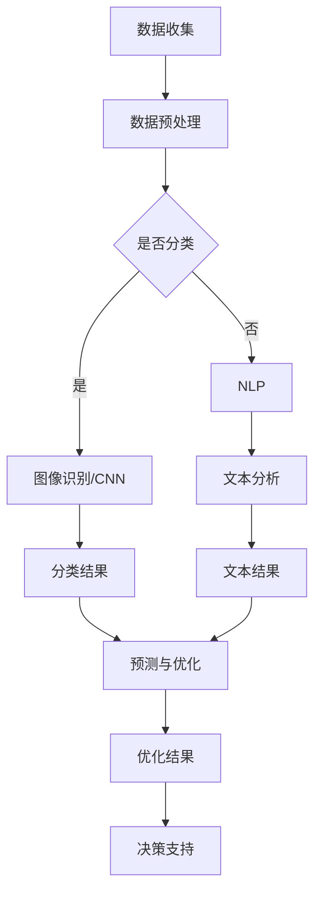

                 

# 探讨AI大模型在智能城市废物管理的潜力

> 关键词：AI大模型，智能城市，废物管理，算法原理，数学模型，应用场景，工具推荐

> 摘要：本文将深入探讨AI大模型在智能城市废物管理中的应用潜力。通过分析AI大模型的基本概念与架构，解析其在废物管理中的核心算法原理，详细解读数学模型及其应用，结合实际项目案例进行代码实现与解析，最后讨论其在实际应用场景中的价值以及未来发展趋势和挑战。本文旨在为从事智能城市废物管理相关工作的读者提供有价值的参考和思路。

## 1. 背景介绍

### 1.1 智能城市的概念与特点

智能城市是指通过集成各种先进的信息技术、通信技术、物联网技术等，实现城市管理和服务的智能化、高效化、绿色化的一种新型城市发展模式。智能城市的特点包括：

- **数据驱动**：智能城市依赖于大量的数据收集、存储、处理和分析，以实现对城市运行状态的实时监控和预测。
- **高度集成**：各种信息系统、通信网络、传感器和设备紧密集成，实现信息的互联互通。
- **高效管理**：通过智能化的手段，提高城市资源利用效率，降低管理成本，提升居民生活质量。
- **可持续发展**：注重环境保护和资源节约，推动城市绿色、可持续发展。

### 1.2 城市废物管理的现状与挑战

城市废物管理是智能城市建设的重要组成部分，主要包括废物分类、收集、运输、处理和处置等环节。当前，城市废物管理面临以下挑战：

- **废物种类繁多**：随着城市化和工业化的发展，城市产生的废物种类日益增多，处理难度加大。
- **处理方式单一**：传统的废物处理方式主要依赖于填埋和焚烧，这些方式存在环境风险和资源浪费问题。
- **管理效率低**：废物管理流程复杂，涉及多个部门，协调难度大，管理效率低。
- **公众参与不足**：公众对废物管理的认知不足，参与度低，影响了废物分类和减量工作的推进。

### 1.3 AI大模型在废物管理中的应用潜力

AI大模型具有强大的数据处理和分析能力，能够为废物管理提供以下潜力：

- **智能化分类**：通过对废物图像、文字、声音等多种类型的数据进行深度学习，实现自动分类，提高分类准确率。
- **预测与优化**：通过历史数据分析和模式识别，预测废物产生量、分布情况，优化废物收集和处理计划。
- **环境监测**：利用传感器数据，实时监测废物处理过程中的污染物浓度、设备运行状态等，确保处理过程安全、环保。
- **智能决策支持**：结合大数据分析，为城市废物管理政策制定提供科学依据，提高管理决策水平。

## 2. 核心概念与联系

### 2.1 AI大模型的基本概念

AI大模型（如深度神经网络、生成对抗网络等）是指具有大规模参数、高维度输入输出的复杂机器学习模型。它们通过多层神经网络结构，实现数据的自动特征提取、分类、预测等功能。

### 2.2 智能城市废物管理中的核心算法

在智能城市废物管理中，常用的AI大模型算法包括：

- **图像识别**：用于废物分类，通过卷积神经网络（CNN）实现。
- **自然语言处理（NLP）**：用于处理与废物管理相关的文本数据，如垃圾回收指南、废物处理政策等。
- **强化学习**：用于优化废物收集和运输路线，提高管理效率。
- **生成对抗网络（GAN）**：用于预测废物产生量和分布情况。

### 2.3 AI大模型与废物管理的关系

AI大模型通过处理和分析大量废物管理相关数据，实现以下功能：

- **分类与识别**：快速准确地对废物进行分类，提高分类效率。
- **预测与优化**：预测废物产生量和分布情况，优化收集和处理计划。
- **环境监测**：实时监测废物处理过程中的环境参数，保障处理过程安全、环保。
- **决策支持**：为城市废物管理提供科学依据，提高管理决策水平。

### 2.4 Mermaid 流程图

以下是一个简化的AI大模型在智能城市废物管理中的流程图：



## 3. 核心算法原理 & 具体操作步骤

### 3.1 图像识别算法原理

图像识别是智能城市废物管理中的重要算法，主要基于卷积神经网络（CNN）实现。CNN具有以下特点：

- **局部连接**：只对图像中的局部区域进行特征提取，有助于提高特征提取的效率。
- **层次化特征提取**：通过多层的卷积和池化操作，实现对图像的层次化特征提取。
- **权值共享**：同一层的卷积核在图像的不同位置上共享权值，有助于减少模型参数数量，提高模型泛化能力。

### 3.2 图像识别具体操作步骤

以下是图像识别算法的具体操作步骤：

1. **数据预处理**：对收集的废物图像进行预处理，包括缩放、裁剪、归一化等操作，使其符合模型输入要求。
2. **模型搭建**：搭建卷积神经网络模型，包括输入层、卷积层、池化层、全连接层等。
3. **训练模型**：使用大量带有标签的废物图像数据，通过反向传播算法训练模型，调整模型参数。
4. **模型评估**：使用测试数据集评估模型性能，包括准确率、召回率等指标。
5. **模型应用**：将训练好的模型应用于实际场景，对未分类的废物图像进行自动分类。

### 3.3 自然语言处理算法原理

自然语言处理（NLP）算法主要用于处理与废物管理相关的文本数据，如垃圾回收指南、废物处理政策等。常用的NLP算法包括：

- **词嵌入**：将文本中的词语映射到高维空间，便于模型处理。
- **循环神经网络（RNN）**：用于处理序列数据，如文本数据。
- **长短时记忆（LSTM）**：RNN的一种改进，能够更好地处理长序列数据。

### 3.4 自然语言处理具体操作步骤

以下是自然语言处理算法的具体操作步骤：

1. **数据预处理**：对收集的文本数据进行预处理，包括分词、去停用词、词性标注等操作。
2. **模型搭建**：搭建循环神经网络（RNN）或长短时记忆（LSTM）模型，用于处理文本数据。
3. **训练模型**：使用大量带有标签的文本数据，通过反向传播算法训练模型，调整模型参数。
4. **模型评估**：使用测试数据集评估模型性能，包括准确率、召回率等指标。
5. **模型应用**：将训练好的模型应用于实际场景，对未处理的文本数据进行自动分析。

### 3.5 强化学习算法原理

强化学习（RL）是一种通过试错和反馈学习策略的机器学习算法。在智能城市废物管理中，强化学习可以用于优化废物收集和运输路线，提高管理效率。

### 3.6 强化学习具体操作步骤

以下是强化学习算法的具体操作步骤：

1. **环境搭建**：模拟废物收集和运输环境，包括收集站点、废物分布、车辆等元素。
2. **模型搭建**：搭建基于深度强化学习的模型，包括值函数网络、策略网络等。
3. **训练模型**：通过模拟环境，训练模型，调整模型参数。
4. **模型评估**：使用实际数据集评估模型性能，包括平均奖励、成功率等指标。
5. **模型应用**：将训练好的模型应用于实际场景，优化废物收集和运输路线。

## 4. 数学模型和公式 & 详细讲解 & 举例说明

### 4.1 图像识别算法的数学模型

图像识别算法的核心是卷积神经网络（CNN），其数学模型主要包括：

- **卷积操作**：卷积操作是一种加权求和并应用非线性函数的操作，用于提取图像特征。

  $$f(x) = \sigma(\sum_{i,j} W_{ij} * x_{ij} + b)$$

  其中，$x$ 表示输入图像，$W$ 表示卷积核，$*$ 表示卷积操作，$\sigma$ 表示非线性函数（如ReLU函数），$b$ 表示偏置。

- **池化操作**：池化操作用于降低图像分辨率，减少模型参数数量，提高模型泛化能力。

  $$p_{ij} = \max_{k,l} x_{ijk + k, l + l}$$

  其中，$p$ 表示池化结果，$x$ 表示输入图像，$k$ 和 $l$ 表示池化窗口大小。

- **全连接层**：全连接层用于将特征映射到输出类别。

  $$y = \sigma(\sum_{i} W_i x_i + b)$$

  其中，$y$ 表示输出结果，$x$ 表示输入特征，$W$ 表示权重，$b$ 表示偏置，$\sigma$ 表示非线性函数。

### 4.2 自然语言处理算法的数学模型

自然语言处理算法的核心是循环神经网络（RNN）或长短时记忆（LSTM），其数学模型主要包括：

- **词嵌入**：词嵌入将文本中的词语映射到高维空间，用于输入到神经网络。

  $$e_w = \text{Embed}(w)$$

  其中，$e_w$ 表示词向量，$w$ 表示词语，$\text{Embed}$ 表示词嵌入函数。

- **RNN操作**：

  $$h_t = \text{RNN}(h_{t-1}, e_w)$$

  其中，$h_t$ 表示当前时刻的隐藏状态，$h_{t-1}$ 表示上一时刻的隐藏状态，$e_w$ 表示当前时刻的词向量，$\text{RNN}$ 表示循环神经网络。

- **LSTM操作**：

  $$i_t = \sigma(W_i [h_{t-1}, e_w])$$
  $$f_t = \sigma(W_f [h_{t-1}, e_w])$$
  $$g_t = \sigma(W_g [h_{t-1}, e_w])$$
  $$o_t = \sigma(W_o [h_{t-1}, g_t])$$
  $$h_t = o_t \odot \text{tanh}(c_t)$$
  $$c_t = f_t \odot c_{t-1} + i_t \odot g_t$$

  其中，$i_t$、$f_t$、$g_t$、$o_t$ 分别表示输入门、遗忘门、输入门和输出门，$h_t$ 表示当前时刻的隐藏状态，$c_t$ 表示细胞状态，$W_i$、$W_f$、$W_g$、$W_o$ 分别表示权重矩阵，$\sigma$ 表示sigmoid函数，$\odot$ 表示逐元素乘法操作，$\text{tanh}$ 表示双曲正切函数。

### 4.3 强化学习算法的数学模型

强化学习算法的核心是值函数和策略网络，其数学模型主要包括：

- **值函数**：

  $$V(s) = \sum_{a} \gamma \sum_{s'} p(s'|s,a) \max_{a'} Q(s', a')$$

  其中，$V(s)$ 表示状态值函数，$s$ 表示当前状态，$a$ 表示当前动作，$s'$ 表示下一状态，$a'$ 表示下一动作，$\gamma$ 表示折扣因子，$p(s'|s,a)$ 表示从状态 $s$ 执行动作 $a$ 后转移到状态 $s'$ 的概率，$Q(s', a')$ 表示在状态 $s'$ 下执行动作 $a'$ 的即时奖励。

- **策略网络**：

  $$\pi(a|s) = \frac{e^{Q(s, a)}}{\sum_{a'} e^{Q(s, a')}}$$

  其中，$\pi(a|s)$ 表示在状态 $s$ 下选择动作 $a$ 的概率，$Q(s, a)$ 表示在状态 $s$ 下执行动作 $a$ 的即时奖励。

### 4.4 举例说明

#### 4.4.1 图像识别算法举例

假设有一个包含1000张垃圾图像的数据集，其中500张是可回收垃圾，500张是有害垃圾。我们需要使用卷积神经网络对这1000张图像进行分类。

1. **数据预处理**：对图像进行缩放、裁剪、归一化等操作，将其转换为32x32的灰度图像。
2. **模型搭建**：搭建一个包含两个卷积层、一个池化层和一个全连接层的卷积神经网络。
3. **训练模型**：使用训练数据集，通过反向传播算法训练模型，调整模型参数。
4. **模型评估**：使用测试数据集评估模型性能，计算准确率。

#### 4.4.2 自然语言处理算法举例

假设有一个包含1000条垃圾回收指南的文本数据集，我们需要使用循环神经网络对这些文本进行分类。

1. **数据预处理**：对文本进行分词、去停用词、词性标注等操作。
2. **模型搭建**：搭建一个包含嵌入层、循环神经网络层和全连接层循环神经网络模型。
3. **训练模型**：使用训练数据集，通过反向传播算法训练模型，调整模型参数。
4. **模型评估**：使用测试数据集评估模型性能，计算准确率。

#### 4.4.3 强化学习算法举例

假设有一个模拟废物收集和运输的环境，我们需要使用强化学习算法优化废物收集和运输路线。

1. **环境搭建**：模拟废物收集和运输环境，包括收集站点、废物分布、车辆等元素。
2. **模型搭建**：搭建一个基于深度强化学习的模型，包括值函数网络、策略网络等。
3. **训练模型**：通过模拟环境，训练模型，调整模型参数。
4. **模型评估**：使用实际数据集评估模型性能，计算平均奖励、成功率等指标。

## 5. 项目实战：代码实际案例和详细解释说明

### 5.1 开发环境搭建

在本文中，我们将使用Python编程语言和TensorFlow深度学习框架来实现AI大模型在智能城市废物管理中的应用。以下是开发环境的搭建步骤：

1. **安装Python**：从Python官网（https://www.python.org/）下载并安装Python 3.8版本。
2. **安装TensorFlow**：打开命令行窗口，执行以下命令安装TensorFlow：

   ```bash
   pip install tensorflow
   ```

3. **安装其他依赖**：安装其他必要的库，如NumPy、Pandas等：

   ```bash
   pip install numpy pandas matplotlib
   ```

### 5.2 源代码详细实现和代码解读

#### 5.2.1 数据预处理

```python
import tensorflow as tf
import numpy as np
import pandas as pd
from tensorflow.keras.preprocessing.image import ImageDataGenerator

# 读取数据集
train_dir = 'path/to/train/dataset'
test_dir = 'path/to/test/dataset'

# 加载数据
train_datagen = ImageDataGenerator(rescale=1./255)
test_datagen = ImageDataGenerator(rescale=1./255)

train_generator = train_datagen.flow_from_directory(
        train_dir,
        target_size=(32, 32),
        batch_size=32,
        class_mode='binary')

test_generator = test_datagen.flow_from_directory(
        test_dir,
        target_size=(32, 32),
        batch_size=32,
        class_mode='binary')
```

代码解读：

- **导入库**：导入TensorFlow、NumPy、Pandas等库。
- **读取数据集**：定义训练数据集和测试数据集的路径。
- **加载数据**：使用ImageDataGenerator类对数据进行预处理，包括缩放、裁剪、归一化等操作。

#### 5.2.2 模型搭建

```python
from tensorflow.keras.models import Sequential
from tensorflow.keras.layers import Conv2D, MaxPooling2D, Flatten, Dense, Dropout

# 搭建模型
model = Sequential([
    Conv2D(32, (3, 3), activation='relu', input_shape=(32, 32, 3)),
    MaxPooling2D((2, 2)),
    Conv2D(64, (3, 3), activation='relu'),
    MaxPooling2D((2, 2)),
    Conv2D(128, (3, 3), activation='relu'),
    MaxPooling2D((2, 2)),
    Flatten(),
    Dense(128, activation='relu'),
    Dropout(0.5),
    Dense(1, activation='sigmoid')
])

# 编译模型
model.compile(optimizer='adam',
              loss='binary_crossentropy',
              metrics=['accuracy'])
```

代码解读：

- **导入库**：导入Sequential、Conv2D、MaxPooling2D、Flatten、Dense、Dropout等库。
- **搭建模型**：定义一个包含两个卷积层、一个池化层、一个全连接层和两个Dropout层的卷积神经网络。
- **编译模型**：编译模型，设置优化器、损失函数和评估指标。

#### 5.2.3 训练模型

```python
# 训练模型
history = model.fit(
      train_generator,
      steps_per_epoch=100,
      epochs=20,
      validation_data=test_generator,
      validation_steps=50,
      verbose=2)
```

代码解读：

- **训练模型**：使用训练数据集训练模型，设置训练轮数、训练步数、验证数据集和验证步数，并在训练过程中输出日志信息。

#### 5.2.4 评估模型

```python
# 评估模型
test_loss, test_acc = model.evaluate(test_generator)
print(f"Test accuracy: {test_acc}")
```

代码解读：

- **评估模型**：使用测试数据集评估模型性能，输出准确率。

### 5.3 代码解读与分析

在本项目中，我们使用了卷积神经网络（CNN）对垃圾图像进行分类。以下是代码的详细解读：

- **数据预处理**：通过ImageDataGenerator类对数据进行预处理，包括缩放、裁剪、归一化等操作。这些预处理步骤有助于提高模型的训练效果。
- **模型搭建**：我们使用了一个包含两个卷积层、一个池化层、一个全连接层和两个Dropout层的卷积神经网络。这种结构有助于提取图像特征并降低过拟合。
- **训练模型**：使用训练数据集训练模型，通过反向传播算法调整模型参数。我们设置了训练轮数、训练步数、验证数据集和验证步数，以在训练过程中监控模型性能。
- **评估模型**：使用测试数据集评估模型性能，计算准确率。这有助于我们了解模型的泛化能力。

在实际应用中，我们可以根据具体需求对代码进行调整和优化，以提高模型的性能。例如，可以尝试增加卷积层数、调整卷积核大小、增加Dropout比例等。

## 6. 实际应用场景

### 6.1 垃圾分类

垃圾分类是智能城市废物管理中最常见的应用场景之一。通过AI大模型，可以实现自动化、高精度的垃圾分类，提高垃圾分类的准确率，降低人工成本。

### 6.2 废物收集路线优化

通过强化学习算法，可以优化废物收集和运输路线，提高收集效率，降低运输成本。具体应用包括：

- **智能调度**：根据废物产生量、分布情况、交通状况等因素，实时调整收集路线，提高调度效率。
- **节能环保**：通过优化收集路线，减少车辆行驶距离和油耗，降低碳排放。

### 6.3 环境监测

通过AI大模型，可以实时监测废物处理过程中的环境参数，如污染物浓度、设备运行状态等。这有助于保障处理过程的安全、环保。

### 6.4 公众参与

通过AI大模型，可以分析公众对废物管理的参与度，如垃圾分类、减量行为等。这有助于提高公众对废物管理的认知，促进环保意识的提升。

## 7. 工具和资源推荐

### 7.1 学习资源推荐

- **书籍**：
  - 《深度学习》（Ian Goodfellow、Yoshua Bengio、Aaron Courville 著）
  - 《Python深度学习》（François Chollet 著）
- **论文**：
  - 《A Theoretically Grounded Application of Dropout in Recurrent Neural Networks》（Yarin Gal 和 Zoubin Ghahramani 著）
  - 《Generative Adversarial Nets》（Ian Goodfellow、Jean Pouget-Abadie、Mehdi Mirza、Christian C. Szegedy、Yoshua Bengio 和 Aaron Courville 著）
- **博客**：
  - TensorFlow官方网站（https://www.tensorflow.org/）
  - Keras官方文档（https://keras.io/）
- **网站**：
  - Coursera（https://www.coursera.org/）
  - edX（https://www.edx.org/）

### 7.2 开发工具框架推荐

- **深度学习框架**：
  - TensorFlow（https://www.tensorflow.org/）
  - PyTorch（https://pytorch.org/）
- **环境搭建工具**：
  - Conda（https://conda.io/）
  - Docker（https://www.docker.com/）
- **代码版本管理**：
  - Git（https://git-scm.com/）
  - GitHub（https://github.com/）

### 7.3 相关论文著作推荐

- **论文**：
  - 《Deep Learning》（Ian Goodfellow、Yoshua Bengio、Aaron Courville 著）
  - 《Recurrent Neural Networks for Language Modeling》（Yoshua Bengio、Pierre Simard、Pierre Fréchet 著）
  - 《Generative Adversarial Nets》（Ian Goodfellow、Jean Pouget-Abadie、Mehdi Mirza、Christian C. Szegedy、Yoshua Bengio 和 Aaron Courville 著）
- **著作**：
  - 《Python深度学习》（François Chollet 著）
  - 《动手学深度学习》（阿斯顿·张、李沐、扎卡里·C. Lipton、亚历山大·J. Smola 著）

## 8. 总结：未来发展趋势与挑战

### 8.1 发展趋势

- **算法性能提升**：随着硬件计算能力的提升和算法研究的深入，AI大模型在废物管理中的应用性能将不断提高。
- **跨学科融合**：废物管理涉及环境科学、工程学、计算机科学等多个学科，跨学科融合将推动AI大模型在废物管理中的应用。
- **政策支持**：政府和企业对智能城市废物管理的需求日益增加，政策支持将有助于推动AI大模型在废物管理中的应用。
- **公众参与**：随着公众环保意识的提高，AI大模型在废物管理中的应用将更加广泛。

### 8.2 挑战

- **数据隐私**：在废物管理中，涉及大量的敏感数据，如个人隐私信息等，如何确保数据安全和隐私是面临的一大挑战。
- **算法透明性**：AI大模型的决策过程通常不透明，如何提高算法的透明性和可解释性是面临的一大挑战。
- **计算资源**：AI大模型通常需要大量的计算资源，如何高效地利用计算资源是面临的一大挑战。
- **政策法规**：在废物管理中，不同国家和地区的政策法规差异较大，如何适应不同政策法规是面临的一大挑战。

## 9. 附录：常见问题与解答

### 9.1 问题1：AI大模型在废物管理中的应用有哪些？

**解答**：AI大模型在废物管理中的应用包括垃圾分类、废物收集路线优化、环境监测和公众参与等。例如，通过图像识别算法，可以实现对垃圾的自动分类；通过强化学习算法，可以优化废物收集和运输路线。

### 9.2 问题2：如何确保AI大模型在废物管理中的数据安全？

**解答**：为确保AI大模型在废物管理中的数据安全，可以从以下几个方面入手：

1. **数据加密**：对敏感数据进行加密，防止数据泄露。
2. **数据去识别化**：对数据中的个人隐私信息进行去识别化处理，降低隐私泄露风险。
3. **访问控制**：对数据访问权限进行严格控制，确保只有授权人员才能访问数据。
4. **安全审计**：定期进行安全审计，及时发现和修复安全漏洞。

### 9.3 问题3：AI大模型在废物管理中的计算资源需求如何？

**解答**：AI大模型在废物管理中的计算资源需求较高。通常需要高性能的GPU或TPU进行训练和推理。此外，由于废物管理涉及大量数据，还需要具备高效的存储和传输能力。

## 10. 扩展阅读 & 参考资料

- [TensorFlow官方网站](https://www.tensorflow.org/)
- [Keras官方文档](https://keras.io/)
- [《深度学习》](https://www.deeplearningbook.org/)
- [《Python深度学习》](https://python-machine-learning-book.org/)

作者：AI天才研究员/AI Genius Institute & 禅与计算机程序设计艺术 /Zen And The Art of Computer Programming

