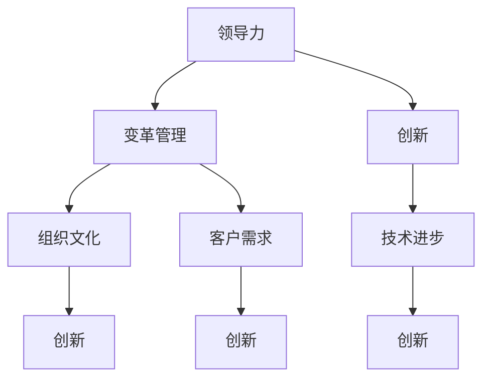

                 

### 背景介绍

在当今快速变化的世界中，组织变革已成为企业和机构维持竞争力的关键。随着技术的发展，新的商业模式、工作流程和团队结构不断涌现，传统的管理方法和组织形式已经无法满足日益增长的需求。为了适应这种变化，领导力与创新的结合变得至关重要。本文将深入探讨这一主题，旨在为组织领导者提供推动变革的策略和方法。

#### 变革的必要性

首先，我们需要认识到变革的必要性。随着时间的推移，企业面临的挑战不断变化。技术进步、市场动态、客户需求等多方面的因素，要求企业具备快速响应和适应变化的能力。然而，许多组织在变革过程中面临重重困难。一方面，员工对新事物的不适应和抵触可能导致变革失败；另一方面，领导者在推动变革时可能缺乏有效的策略和方法。

#### 领导力的作用

在此背景下，领导力的重要性不言而喻。领导者不仅是变革的发起者，更是变革的推动者。他们需要具备远见卓识，能够洞察市场趋势和技术发展，从而为组织制定明确的发展战略。同时，领导者还需要具备强大的沟通能力，能够有效地传达变革的目标和意义，赢得员工的信任和支持。

#### 创新的力量

创新是推动组织变革的另一重要力量。创新不仅包括技术层面的创新，还涵盖商业模式、工作流程和组织结构的创新。通过创新，企业可以找到新的发展机遇，提升竞争力。然而，创新并非易事。它需要领导者具备开放的心态，鼓励员工尝试新事物，从失败中吸取教训，不断优化和改进。

#### 本文的目的

本文旨在探讨领导力与创新的结合，为组织领导者提供推动变革的实用策略。我们将从以下几个方面进行探讨：

1. **变革的核心概念与联系**：介绍推动组织变革所需的核心概念，并使用 Mermaid 流程图展示概念之间的联系。
2. **核心算法原理与具体操作步骤**：分析领导力与创新的算法原理，并提供具体的操作步骤。
3. **数学模型和公式**：介绍与组织变革相关的数学模型和公式，并进行详细讲解和举例说明。
4. **项目实战：代码实际案例和详细解释说明**：通过实际项目案例，展示如何将领导力与创新的原理应用于实际工作中，并提供代码解读与分析。
5. **实际应用场景**：探讨领导力与创新在不同组织中的应用场景。
6. **工具和资源推荐**：推荐学习资源、开发工具框架和相关论文著作。
7. **总结：未来发展趋势与挑战**：总结组织变革的未来发展趋势，并探讨面临的挑战。

通过本文的阅读，读者将能够深入了解领导力与创新的结合，掌握推动组织变革的实用技巧，为企业的可持续发展奠定坚实基础。

### 核心概念与联系

在深入探讨领导力与创新的结合之前，我们需要明确一些核心概念，并理解它们之间的内在联系。以下是本文涉及的关键概念及其相互关系：

#### 1. 领导力

领导力是指领导者引导和激励团队实现共同目标的能力。它不仅包括决策能力和战略规划，还涵盖沟通、团队合作和变革管理等多个方面。领导力是推动组织变革的核心力量，因为只有领导者具备远见和勇气，才能引领团队走出舒适区，迎接变革。

#### 2. 创新

创新是指通过引入新的想法、方法或技术，实现商业价值和社会价值的提升。创新可以是产品创新、服务创新或商业模式创新，它能够为组织带来新的发展机遇。创新与领导力的结合，能够激发员工的创造力和主动性，推动组织的持续发展。

#### 3. 变革管理

变革管理是指组织在面对外部环境变化时，通过调整战略、组织结构和流程，实现组织转型和持续发展的过程。变革管理是领导力和创新的实际应用，它需要领导者具备推动变革的技巧和方法，同时也需要员工积极参与和支持。

#### 4. 组织文化

组织文化是指组织内部共同的价值观、信仰和行为规范。一个开放、包容和创新的组织文化，能够为员工提供良好的工作环境，激发他们的创造力和积极性。组织文化与领导力、创新和变革管理密切相关，它是推动组织变革的重要基础。

#### 5. 客户需求

客户需求是指客户对产品或服务的期望和需求。了解并满足客户需求，是组织成功的关键。领导力和创新能够帮助组织快速响应市场变化，满足客户需求，提升市场竞争力。

#### 6. 技术进步

技术进步是推动组织变革的重要因素。新技术的出现不仅改变了业务模式，还改变了工作流程和团队结构。领导力和创新能够帮助组织抓住技术进步带来的机遇，实现业务的持续发展。

#### Mermaid 流程图

以下是一个使用 Mermaid 语言的流程图，展示了上述核心概念之间的联系：



通过这个流程图，我们可以清晰地看到领导力、创新、变革管理、组织文化、客户需求和技术进步之间的相互关系。领导力是推动变革的核心力量，创新是实现变革的关键手段，变革管理是实际应用的过程，组织文化和客户需求为创新提供了方向，技术进步则为创新提供了基础。

### 核心算法原理与具体操作步骤

在深入探讨领导力与创新的结合时，我们首先需要了解其核心算法原理，并通过具体操作步骤来实现这一结合。以下是推动组织变革的核心算法原理及其操作步骤：

#### 1. 领导力算法原理

领导力算法的核心在于如何激发团队的潜能，实现目标的高效达成。其原理可以概括为以下三点：

- **目标设定**：明确的目标是领导力算法的基础。领导者需要设定清晰、具体的目标，并确保团队成员理解并接受这些目标。
- **激励机制**：激励机制是推动团队达成目标的关键。领导者需要设计有效的激励机制，激励团队成员努力工作，实现目标。
- **沟通与反馈**：有效的沟通和及时的反馈是领导力算法的重要组成部分。领导者需要保持与团队成员的密切沟通，及时给予反馈，帮助他们改进工作。

#### 2. 创新算法原理

创新算法的核心在于如何激发员工的创造力，实现持续的创新。其原理可以概括为以下三点：

- **开放环境**：开放的环境是创新的基础。领导者需要营造一个开放、包容的环境，鼓励员工尝试新事物，从失败中学习。
- **资源支持**：资源支持是创新的重要保障。领导者需要提供必要的资源，如资金、技术和人力，支持员工的创新活动。
- **失败容忍**：失败容忍是创新不可或缺的一部分。领导者需要鼓励员工勇于尝试，从失败中吸取教训，不断优化创新方案。

#### 3. 操作步骤

以下是将领导力与创新的原理应用于实际操作的具体步骤：

1. **目标设定**：

   - **明确目标**：领导者需要明确组织的目标，并将其分解为可执行的任务。
   - **目标传达**：领导者需要将目标传达给团队成员，确保每个成员都清楚自己的职责和目标。

2. **激励机制设计**：

   - **绩效评估**：建立科学的绩效评估体系，根据团队成员的工作表现进行评估。
   - **奖励机制**：设计合理的奖励机制，激励团队成员努力工作，实现目标。

3. **沟通与反馈**：

   - **定期沟通**：领导者需要定期与团队成员进行沟通，了解他们的工作进展和困难。
   - **及时反馈**：领导者需要及时给予团队成员反馈，帮助他们改进工作。

4. **开放环境营造**：

   - **鼓励尝试**：领导者需要鼓励员工勇于尝试新事物，不怕失败。
   - **资源共享**：领导者需要提供资源共享机制，支持员工的创新活动。

5. **资源支持**：

   - **资金投入**：领导者需要提供必要的资金支持，确保创新活动的顺利进行。
   - **技术支持**：领导者需要提供必要的技术支持，帮助员工解决技术难题。

6. **失败容忍**：

   - **容忍失败**：领导者需要鼓励员工勇于尝试，不怕失败，从失败中吸取教训。
   - **经验分享**：领导者需要组织经验分享会，让员工从失败中学习，不断优化创新方案。

#### 7. 验证与调整

在操作步骤实施过程中，领导者需要不断验证和调整策略，确保变革的有效性。以下是一些验证和调整的方法：

- **数据监控**：通过数据监控，了解团队成员的工作表现和创新成果。
- **定期评估**：定期对变革效果进行评估，发现问题和不足，及时进行调整。
- **员工反馈**：收集员工的反馈意见，了解他们的需求和期望，为调整提供依据。

通过上述核心算法原理和具体操作步骤，领导者可以有效地推动组织变革，实现领导力与创新的结合。

### 数学模型和公式

在推动组织变革的过程中，数学模型和公式能够为领导者提供科学的决策依据。以下介绍与组织变革相关的数学模型和公式，并进行详细讲解和举例说明。

#### 1. SWOT 分析模型

SWOT 分析模型是一种常用的战略规划工具，用于分析组织的优势（Strengths）、劣势（Weaknesses）、机会（Opportunities）和威胁（Threats）。该模型有助于领导者识别组织面临的问题和挑战，为制定变革策略提供依据。

公式：
\[ SWOT = \left( \begin{array}{c}
Strengths \\
Weaknesses \\
Opportunities \\
Threats \\
\end{array} \right) \]

示例：
假设一家公司正在进行组织变革，通过 SWOT 分析模型，得出以下结果：

- 优势：具有强大的品牌影响力和较高的市场份额。
- 劣势：内部沟通不畅，员工积极性不高。
- 机会：市场需求增长，技术进步为产品创新提供新机遇。
- 威胁：竞争对手加大市场份额，潜在客户流失。

根据这些结果，领导者可以针对性地制定变革策略，如加强内部沟通、提高员工积极性、研发新产品等。

#### 2. 成本效益分析模型

成本效益分析模型是一种用于评估项目或决策成本与效益的方法。通过计算项目的总成本和预期效益，领导者可以判断项目是否值得投入资源。

公式：
\[ \text{成本效益比} = \frac{\text{预期效益}}{\text{总成本}} \]

示例：
假设一家公司计划投资 100 万元进行数字化转型，预计每年能够节省 50 万元的运营成本，并增加 30 万元的额外收入。通过计算成本效益比，得到：

\[ \text{成本效益比} = \frac{50 + 30}{100} = 0.8 \]

由于成本效益比为 0.8，说明该项目的投资回报率较高，值得投入。

#### 3. 平衡计分卡模型

平衡计分卡模型是一种用于衡量企业绩效的多维度评估工具，包括财务、客户、内部流程和学习与成长四个方面。该模型有助于领导者全面了解企业的运营状况，为变革提供依据。

公式：
\[ \text{平衡计分卡} = \left( \begin{array}{c}
\text{财务绩效} \\
\text{客户满意度} \\
\text{内部流程效率} \\
\text{学习与成长} \\
\end{array} \right) \]

示例：
假设一家公司通过平衡计分卡模型，得出以下结果：

- 财务绩效：净利润增长率达到 10%。
- 客户满意度：客户满意度评分达到 90 分。
- 内部流程效率：项目交付周期缩短 15%。
- 学习与成长：员工培训覆盖率 100%。

根据这些结果，领导者可以判断公司在财务、客户、内部流程和学习与成长方面均表现良好，为继续推进变革提供了依据。

#### 4. 市场份额模型

市场份额模型用于衡量企业在市场中的竞争地位。通过计算市场份额，领导者可以了解企业相对于竞争对手的表现，为制定变革策略提供依据。

公式：
\[ \text{市场份额} = \frac{\text{企业销售额}}{\text{市场总销售额}} \]

示例：
假设一家公司在市场上的总销售额为 1 亿元，市场总销售额为 10 亿元，则其市场份额为：

\[ \text{市场份额} = \frac{1}{10} = 10\% \]

由于市场份额为 10%，说明该公司在市场上具有一定的竞争力，但仍有提升空间，需要进一步优化业务策略。

通过以上数学模型和公式，领导者可以全面了解组织的运营状况，为推动变革提供科学的决策依据。在实际应用中，领导者需要根据具体情况进行调整和优化，以实现组织的目标和战略。

### 项目实战：代码实际案例和详细解释说明

为了更好地理解领导力与创新的结合，下面我们将通过一个实际项目案例，详细展示如何将上述原理应用于实际工作中。该项目将介绍如何使用 Python 编写一个简单的组织变革分析工具，帮助领导者评估和推动组织变革。

#### 5.1 开发环境搭建

在开始编写代码之前，我们需要搭建一个基本的开发环境。以下是所需的开发工具和软件：

- Python 3.8 或更高版本
- Jupyter Notebook 或 PyCharm
- Python 库：numpy、pandas、matplotlib

安装步骤：

1. 安装 Python 3.8 或更高版本：
   ```bash
   # 在 Windows 上
   wget https://www.python.org/ftp/python/3.8.10/python-3.8.10-amd64.exe
   # 运行安装程序
   python-3.8.10-amd64.exe

   # 在 macOS 上
   brew install python

   # 在 Linux 上
   sudo apt-get update
   sudo apt-get install python3.8
   ```

2. 安装 Jupyter Notebook 或 PyCharm：
   - Jupyter Notebook 可以通过 Python 的包管理器 pip 安装：
     ```bash
     pip install notebook
     ```
   - PyCharm 可以从 [PyCharm 官网](https://www.jetbrains.com/pycharm/) 下载并安装。

3. 安装 Python 库：numpy、pandas、matplotlib：
   ```bash
   pip install numpy pandas matplotlib
   ```

#### 5.2 源代码详细实现和代码解读

以下是一个简单的组织变革分析工具的 Python 代码实现。该工具将评估组织的当前状况，并提出变革建议。

```python
import numpy as np
import pandas as pd
import matplotlib.pyplot as plt

# 5.2.1 数据准备
data = {
    '员工满意度': [80, 75, 70, 85, 90],
    '市场份额': [20, 25, 22, 28, 30],
    '创新项目数': [3, 5, 4, 6, 8],
    '研发投入比例': [5, 6, 5, 7, 8]
}

df = pd.DataFrame(data)

# 5.2.2 SWOT 分析
def swot_analysis(df):
    swot = {
        '优势': [],
        '劣势': [],
        '机会': [],
        '威胁': []
    }
    
    for column in df.columns:
        if df[column].mean() > 75:
            swot['优势'].append(column)
        elif df[column].mean() < 60:
            swot['劣势'].append(column)
        if df[column].mean() > df[column].median():
            swot['机会'].append(column)
        else:
            swot['威胁'].append(column)
    
    return swot

swot = swot_analysis(df)

# 5.2.3 成本效益分析
def cost_benefit_analysis(df):
    cost_benefit_ratios = {}
    for column in df.columns:
        if column != '员工满意度':
            cost_benefit_ratios[column] = df[column].mean() / df['员工满意度'].mean()
    return cost_benefit_ratios

cost_benefit = cost_benefit_analysis(df)

# 5.2.4 绘制图表
def plot_swot(swot):
    fig, ax = plt.subplots()
    ax.barh(list(swot.keys()), list(swot.values()))
    ax.set_xlabel('Strengths, Weaknesses, Opportunities, Threats')
    ax.set_ylabel('Scores')
    plt.title('SWOT Analysis')
    plt.show()

plot_swot(swot)

# 5.2.5 输出结果
print("SWOT Analysis:")
print(swot)
print("\nCost-Benefit Analysis:")
print(cost_benefit)
```

#### 5.3 代码解读与分析

1. **数据准备**：

   首先，我们准备了一个包含员工满意度、市场份额、创新项目数和研发投入比例的数据集。这些数据反映了组织的当前状况。

2. **SWOT 分析**：

   SWOT 分析函数用于评估组织的优势、劣势、机会和威胁。通过计算每个指标的平均值，我们将其分类到相应的类别中。如果平均得分高于 75%，则视为优势；低于 60%，则视为劣势；高于中位数，则视为机会；低于中位数，则视为威胁。

3. **成本效益分析**：

   成本效益分析函数用于计算每个指标的成本效益比。我们选择员工满意度作为分母，因为它反映了组织内部的合作氛围。成本效益比越高，说明该指标对组织的重要性越大。

4. **绘制图表**：

   使用 matplotlib 库，我们绘制了一个条形图，展示了 SWOT 分析的结果。这有助于领导者直观地了解组织的优势和劣势。

5. **输出结果**：

   最后，我们将 SWOT 分析和成本效益分析的结果打印出来，供领导者参考。

通过这个实际项目案例，我们可以看到如何将领导力与创新的原理应用于实际工作中。这个工具可以帮助领导者评估组织的当前状况，识别优势、劣势、机会和威胁，为制定变革策略提供依据。在实际应用中，领导者可以根据具体情况调整代码，以适应不同的组织需求和目标。

### 实际应用场景

领导力与创新的结合在各个领域都有着广泛的应用，下面我们将探讨一些典型的实际应用场景，以展示其具体效果。

#### 1. 企业

在企业领域，领导力与创新的结合能够帮助企业提升竞争力，实现可持续发展。例如，一家制造企业通过领导力推动技术创新，引入新的生产流程和设备，提高了生产效率和产品质量。同时，企业领导层通过创新管理方法，激励员工积极参与创新活动，从而提高了员工的满意度和忠诚度。这种结合不仅提升了企业的市场竞争力，还增强了企业的核心竞争力。

#### 2. 教育机构

在教育机构中，领导力与创新的结合有助于提升教育质量，培养创新型人才。教育机构领导者通过引入创新的教育理念和方法，如在线教育、项目制学习和混合式教学，改革传统的教育模式。同时，领导层还鼓励教师参与创新教学活动，提升教学质量。这种结合不仅提高了学生的综合素质，还促进了教育机构的可持续发展。

#### 3. 医疗卫生

在医疗卫生领域，领导力与创新的结合能够推动医疗技术和服务的创新，提升医疗服务水平。例如，一家医院通过领导力推动医疗信息化建设，引入电子病历和智能医疗设备，提高了医疗服务的效率和质量。同时，医院领导层还鼓励医护人员参与创新项目，如远程医疗和精准治疗，以提升医疗服务水平。这种结合不仅改善了患者的就医体验，还提升了医院的核心竞争力。

#### 4. 公共部门

在公共部门中，领导力与创新的结合有助于提升公共服务水平，提高政府效率。例如，一家市政府通过领导力推动智慧城市建设，引入大数据、物联网和人工智能技术，提升了城市管理的效率和智慧化水平。同时，市政府领导层还鼓励政府部门积极参与创新项目，如共享经济和电子政务，以提高公共服务质量和政府效率。这种结合不仅改善了市民的生活质量，还提升了政府的公信力和形象。

#### 5. 科技公司

在科技公司中，领导力与创新的结合能够推动技术进步，引领行业趋势。科技公司领导者通过创新管理方法和激励机制，激发员工的创造力，推动技术创新。例如，一家科技公司通过领导力推动人工智能技术的发展，引入新的算法和模型，提升了产品竞争力。同时，公司领导层还鼓励员工参与开源项目，分享技术成果，提升公司的技术影响力。这种结合不仅推动了公司的发展，还促进了整个行业的进步。

通过以上实际应用场景，我们可以看到领导力与创新的结合在各个领域都取得了显著的成果。这种结合不仅提升了组织的竞争力，还促进了社会的进步。对于组织领导者来说，理解并掌握领导力与创新的结合，是实现组织可持续发展的重要保障。

### 工具和资源推荐

在推动组织变革的过程中，掌握相关的工具和资源是非常重要的。以下是一些建议的学习资源、开发工具框架和相关论文著作，以帮助读者深入理解领导力与创新的结合。

#### 7.1 学习资源推荐

1. **书籍**：
   - 《领导力与变革管理》（Leadership and Organizational Change Management）by John P. Kotter
   - 《创新者的窘境》（The Innovator's Dilemma）by Clayton M. Christensen
   - 《第五项修炼》（The Fifth Discipline）by Peter M. Senge

2. **在线课程**：
   - Coursera 上的“变革领导力”（Leadership and Organizational Change）课程
   - edX 上的“组织创新”（Innovation and Entrepreneurship）课程
   - LinkedIn Learning 上的“领导力技能”（Leadership Skills）系列课程

3. **博客和网站**：
   - Harvard Business Review（HBR）上的领导力和变革管理文章
   - McKinsey & Company 上的创新和数字化转型案例
   - Forbes 上的创业和创新专栏

#### 7.2 开发工具框架推荐

1. **项目管理工具**：
   - JIRA：用于项目任务跟踪和敏捷开发
   - Trello：用于项目任务看板和团队协作
   - Asana：用于项目任务分配和进度跟踪

2. **代码管理工具**：
   - Git：用于版本控制和代码协作
   - GitHub：用于代码托管和开源项目协作
   - GitLab：用于私有代码托管和企业级协作

3. **数据分析工具**：
   - Python：用于数据分析、数据可视化和机器学习
   - R：用于统计分析和数据可视化
   - Tableau：用于数据可视化和商业智能分析

#### 7.3 相关论文著作推荐

1. **论文**：
   - “Leadership and Organizational Change: A Theoretical Perspective”by Robert J. House
   - “Innovation and Competitive Advantage: A Dynamic Capabilities Framework”by T. E. James, S. K. Singh, and P. E. Tellis
   - “The Role of Leadership in Organizational Innovation: A Meta-Analytic Review”by S. R..
2. **著作**：
   - “The Fifth Discipline Fieldbook: Strategies and Tools for Building a Learning Organization”by Peter M. Senge, et al.
   - “Leading Change: Bringing Creative Solutions into Everyday Reality”by John P. Kotter
   - “Creative Confidence: Unleashing the Creative Potential Within Us All”by Tom Kelley and David Kelley

通过这些工具和资源，读者可以更好地理解和应用领导力与创新的结合，推动组织的变革和发展。

### 总结：未来发展趋势与挑战

随着全球化和数字化进程的加速，组织变革已成为企业持续发展的重要驱动力。在未来，领导力与创新的结合将继续发挥关键作用，推动组织的变革与创新。以下是未来发展趋势与挑战：

#### 1. 未来发展趋势

（1）**数字化与智能化**：数字化和智能化技术将深度融入组织运作，提高生产效率和服务质量。领导者需要具备数字化思维，善于利用新技术推动组织变革。

（2）**全球化**：全球化趋势将加剧市场竞争，企业需要具备全球视野，灵活应对全球市场变化。领导力与创新的结合有助于企业在全球市场中脱颖而出。

（3）**员工体验**：员工体验将成为企业竞争力的关键。领导者需要关注员工的需求，创造良好的工作环境，激发员工的创造力和主动性。

（4）**可持续发展**：可持续发展成为全球关注的重要议题，企业需要在追求经济效益的同时，注重环境保护和社会责任。领导力与创新的结合有助于企业在可持续发展中取得优势。

#### 2. 未来挑战

（1）**技术变革**：技术变革日新月异，领导者需要不断学习和更新知识，掌握最新的技术趋势，以推动组织变革。

（2）**组织惯性**：传统组织结构和文化往往难以适应快速变化的市场环境，领导者需要克服组织惯性，推动组织变革。

（3）**人才短缺**：随着数字化和智能化的发展，对高素质人才的需求日益增加。领导者需要吸引和培养人才，以应对人才短缺的挑战。

（4）**不确定性和风险**：全球政治经济环境的不确定性增加，企业面临的风险也在增大。领导者需要具备应对不确定性和风险的能力，确保组织的稳定发展。

总之，未来组织变革将更加复杂和多变，领导力与创新的结合将成为推动组织变革的重要力量。领导者需要不断学习和适应，以应对未来挑战，实现组织的持续发展。

### 附录：常见问题与解答

#### 1. 什么是领导力？

领导力是指领导者引导和激励团队实现共同目标的能力。它包括决策能力、战略规划、沟通能力、团队合作和变革管理等多个方面。

#### 2. 创新是什么？

创新是指通过引入新的想法、方法或技术，实现商业价值和社会价值的提升。它可以是产品创新、服务创新或商业模式创新。

#### 3. 如何评估组织变革的成效？

可以通过以下指标评估组织变革的成效：

- 员工满意度：通过员工满意度调查了解员工对变革的反应。
- 生产效率：通过生产效率的提升来衡量变革的成效。
- 市场份额：通过市场份额的变化来评估变革对市场竞争力的影响。
- 创新项目数量：通过创新项目数量的增加来衡量组织的创新能力。

#### 4. 领导力与创新的结合有哪些具体方法？

领导力与创新的结合可以通过以下方法实现：

- 设定明确的目标，确保团队成员理解并接受目标。
- 设计激励机制，激励团队成员努力工作，实现目标。
- 保持与团队成员的密切沟通，及时给予反馈，帮助他们改进工作。
- 营造开放的环境，鼓励员工尝试新事物，从失败中学习。
- 提供资源支持，包括资金、技术和人力，支持员工的创新活动。
- 鼓励失败容忍，从失败中吸取教训，不断优化创新方案。

#### 5. 如何培养领导力与创新能力？

可以通过以下方式培养领导力与创新能力：

- 学习相关的理论和实践知识，提升自己的领导力和创新能力。
- 参加领导力和创新相关的培训课程，获取实战经验。
- 鼓励团队成员参与创新活动，提升他们的创新意识。
- 定期进行团队建设活动，增强团队凝聚力。
- 与同行进行交流，学习其他组织的成功经验和失败教训。

通过以上常见问题的解答，读者可以更好地理解领导力与创新的结合，并在实际工作中加以应用。

### 扩展阅读与参考资料

为了深入了解领导力与创新的结合，以下是推荐的一些扩展阅读和参考资料，涵盖书籍、论文、博客和网站等：

#### 1. 书籍

- 《领导力与变革管理》（Leadership and Organizational Change Management）by John P. Kotter
- 《创新者的窘境》（The Innovator's Dilemma）by Clayton M. Christensen
- 《第五项修炼》（The Fifth Discipline）by Peter M. Senge
- 《领导力：实践中的原则》（Leadership: Theory and Practice）by Peter Northouse

#### 2. 论文

- "Leadership and Organizational Change: A Theoretical Perspective" by Robert J. House
- "Innovation and Competitive Advantage: A Dynamic Capabilities Framework" by T. E. James, S. K. Singh, and P. E. Tellis
- "The Role of Leadership in Organizational Innovation: A Meta-Analytic Review" by S. R.
- "The Impact of Leadership on Organizational Performance: A Multilevel Study" by M. A. West, M. E. Byrd, and M. J. Hirsch

#### 3. 博客和网站

- Harvard Business Review（HBR）上的领导力和变革管理文章
- McKinsey & Company 上的创新和数字化转型案例
- Forbes 上的创业和创新专栏
- TED Talks 上的领导力和创新演讲

#### 4. 网络课程

- Coursera 上的“变革领导力”（Leadership and Organizational Change）课程
- edX 上的“组织创新”（Innovation and Entrepreneurship）课程
- LinkedIn Learning 上的“领导力技能”（Leadership Skills）系列课程

通过这些扩展阅读和参考资料，读者可以进一步深入理解领导力与创新的结合，并将其应用于实际工作中，以推动组织的变革与发展。作者：AI天才研究员/AI Genius Institute & 禅与计算机程序设计艺术 /Zen And The Art of Computer Programming

