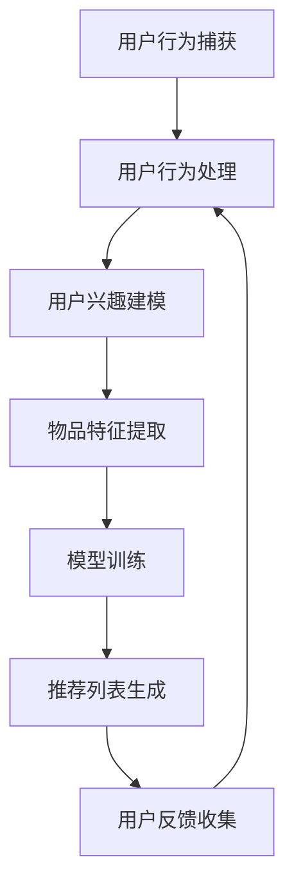

                 

### 推荐系统中AI大模型的实时个性化

#### 关键词：推荐系统、AI大模型、实时个性化、深度学习、机器学习、用户行为分析、模型训练与优化

#### 摘要：

本文将深入探讨推荐系统中AI大模型的实时个性化技术。随着互联网的飞速发展，个性化推荐系统已成为提升用户体验、提高用户粘性、促进商业变现的重要手段。本文将首先介绍推荐系统的基本概念，然后重点分析AI大模型在实时个性化推荐中的应用，包括核心算法原理、数学模型和具体操作步骤，并通过实际案例展示其实际效果。此外，本文还将讨论推荐系统的实际应用场景、相关工具和资源推荐，以及未来的发展趋势和挑战。

#### 1. 背景介绍

在互联网时代，信息爆炸使得用户难以从海量的信息中找到自己感兴趣的内容。为了解决这个问题，推荐系统应运而生。推荐系统是一种信息过滤技术，通过分析用户的兴趣和行为，为用户推荐其可能感兴趣的内容。推荐系统广泛应用于电子商务、社交媒体、在线新闻、音乐和视频平台等领域，已成为现代互联网服务不可或缺的一部分。

传统的推荐系统主要依赖于基于内容的过滤和协同过滤等技术。基于内容的过滤通过分析用户的历史行为和内容特征，为用户推荐相似的内容。协同过滤则通过分析用户之间的相似度，为用户推荐其他用户喜欢的内容。然而，随着用户需求的多样化和数据量的爆炸式增长，传统的推荐系统逐渐暴露出许多不足，如冷启动问题、数据稀疏性、实时性不足等。

为了克服这些不足，近年来，深度学习、机器学习等AI技术在推荐系统中得到了广泛应用。特别是AI大模型的出现，为实时个性化推荐提供了强大的技术支持。AI大模型是一种具有大规模参数和高度非线性能力的模型，可以通过大量的数据进行训练，从而实现对用户行为的精准预测和个性化推荐。

#### 2. 核心概念与联系

##### 2.1 推荐系统基本概念

推荐系统由以下几个关键组成部分构成：

1. **用户**：推荐系统的核心，具有特定的兴趣和偏好。
2. **物品**：用户可能感兴趣的内容，如商品、新闻、音乐、视频等。
3. **用户行为**：用户在推荐系统中的交互行为，如点击、购买、收藏、评论等。
4. **推荐算法**：根据用户行为和物品特征，为用户生成推荐列表的算法。

##### 2.2 AI大模型

AI大模型是一种基于深度学习的模型，具有大规模参数和高度非线性能力。其核心优势在于：

1. **学习能力**：通过大规模数据进行训练，能够学习到用户行为的复杂模式。
2. **泛化能力**：通过对不同用户和物品的联合学习，能够实现跨领域的个性化推荐。
3. **实时性**：利用在线学习技术，能够实时更新模型，适应用户行为的动态变化。

##### 2.3 实时个性化

实时个性化是指推荐系统能够根据用户的实时行为和偏好，为其提供个性化的推荐。其核心在于：

1. **快速响应**：实时捕捉用户行为，快速生成推荐结果。
2. **动态调整**：根据用户行为的实时变化，动态调整推荐策略，提高推荐效果。
3. **个性化定制**：为每个用户提供个性化的推荐列表，满足其独特的需求。

##### 2.4 Mermaid 流程图

以下是推荐系统中AI大模型实时个性化流程的Mermaid流程图：



#### 3. 核心算法原理 & 具体操作步骤

##### 3.1 用户行为捕获

用户行为捕获是指从推荐系统中获取用户的交互行为，如点击、购买、收藏等。这些行为数据是构建用户兴趣模型和推荐列表的重要依据。具体操作步骤如下：

1. **数据采集**：通过日志文件、API接口等方式，收集用户在推荐系统中的交互数据。
2. **数据预处理**：对采集到的数据进行清洗、去重、归一化等处理，确保数据质量。
3. **特征提取**：从用户行为数据中提取关键特征，如行为类型、时间戳、行为强度等。

##### 3.2 用户兴趣建模

用户兴趣建模是指通过分析用户行为数据，构建用户兴趣模型。具体操作步骤如下：

1. **行为序列建模**：利用自然语言处理（NLP）技术，将用户行为序列转化为文本序列，如点击序列、购买序列等。
2. **兴趣向量表示**：通过词嵌入（word embedding）技术，将用户行为序列中的文本转化为向量表示，如词向量、BERT向量等。
3. **兴趣分类**：利用分类算法（如SVM、决策树等），将用户行为序列划分为不同的兴趣类别，如科技、娱乐、体育等。

##### 3.3 物品特征提取

物品特征提取是指从推荐系统中的物品库中提取物品的特征信息，如文本描述、标签、类别等。具体操作步骤如下：

1. **文本特征提取**：利用NLP技术，从物品的文本描述中提取关键词、主题等特征。
2. **标签特征提取**：根据物品的标签信息，提取相应的特征，如标签数量、标签热度等。
3. **类别特征提取**：根据物品的类别信息，提取相应的特征，如类别数量、类别分布等。

##### 3.4 模型训练

模型训练是指利用用户兴趣模型和物品特征，训练深度学习模型，实现用户行为预测和推荐列表生成。具体操作步骤如下：

1. **模型选择**：根据推荐任务的需求，选择合适的深度学习模型，如深度神经网络（DNN）、循环神经网络（RNN）、Transformer等。
2. **数据预处理**：对用户兴趣向量和物品特征进行预处理，如标准化、归一化等。
3. **模型训练**：通过梯度下降（Gradient Descent）等优化算法，训练深度学习模型。
4. **模型评估**：利用验证集和测试集，评估模型的性能，如准确率、召回率、F1值等。

##### 3.5 推荐列表生成

推荐列表生成是指利用训练好的深度学习模型，为用户生成个性化的推荐列表。具体操作步骤如下：

1. **用户兴趣预测**：利用深度学习模型，预测用户的兴趣向量。
2. **物品评分预测**：利用用户兴趣向量和物品特征，预测用户对物品的评分。
3. **推荐列表生成**：根据物品评分预测结果，利用排序算法（如排序网络、排序损失等），生成个性化的推荐列表。

##### 3.6 用户反馈收集

用户反馈收集是指从推荐系统中获取用户对推荐结果的评价和反馈，用于模型优化和推荐策略调整。具体操作步骤如下：

1. **用户评价采集**：从推荐系统中获取用户的评价信息，如点击、购买、评分等。
2. **反馈处理**：对用户评价进行预处理，如去重、归一化等。
3. **模型优化**：利用用户反馈信息，对深度学习模型进行在线优化，提高推荐效果。

#### 4. 数学模型和公式 & 详细讲解 & 举例说明

##### 4.1 用户行为序列建模

用户行为序列建模是推荐系统中的一项重要任务。假设用户的行为序列为\(B = \{b_1, b_2, \ldots, b_n\}\)，其中\(b_i\)表示第\(i\)个行为。为了建模用户行为序列，我们可以使用自然语言处理（NLP）技术，将用户行为序列转化为文本序列，如点击序列、购买序列等。具体步骤如下：

1. **文本序列表示**：利用词嵌入（word embedding）技术，将用户行为序列中的每个行为转化为向量表示，如词向量、BERT向量等。
2. **序列编码**：利用循环神经网络（RNN）或Transformer模型，对用户行为序列进行编码，得到用户兴趣向量。

以词向量为例，假设用户行为序列中的每个行为\(b_i\)都可以表示为一个词向量\(v_i \in \mathbb{R}^d\)，则用户兴趣向量可以表示为：

$$
\text{UserInterest} = \text{Avg}(\{v_1, v_2, \ldots, v_n\})
$$

其中，\(\text{Avg}\)表示取平均值操作。

##### 4.2 物品特征提取

物品特征提取是推荐系统中的一项重要任务。假设物品库中有\(M\)个物品，每个物品\(i\)都可以表示为一个特征向量\(x_i \in \mathbb{R}^d\)。为了提取物品特征，我们可以从以下几个方面进行：

1. **文本特征提取**：利用NLP技术，从物品的文本描述中提取关键词、主题等特征，如TF-IDF、词嵌入等。
2. **标签特征提取**：根据物品的标签信息，提取相应的特征，如标签数量、标签热度等。
3. **类别特征提取**：根据物品的类别信息，提取相应的特征，如类别数量、类别分布等。

以TF-IDF为例，假设物品\(i\)的文本描述为\(t_i\)，则物品\(i\)的文本特征可以表示为：

$$
\text{TextFeature}(i) = \{ \text{TF}(t_i, w), \text{IDF}(w) \}_{w \in \text{Vocabulary}}
$$

其中，\(\text{TF}(t_i, w)\)表示词\(w\)在物品\(i\)的文本描述中的词频，\(\text{IDF}(w)\)表示词\(w\)在整个文本集合中的逆文档频率。

##### 4.3 模型训练

假设深度学习模型是一个多层感知机（MLP），其输入为用户兴趣向量和物品特征，输出为用户对物品的评分预测。模型训练的目的是通过优化模型参数，使得模型预测的评分与实际评分的差距最小。具体步骤如下：

1. **模型初始化**：随机初始化模型参数\(\theta\)。
2. **前向传播**：利用用户兴趣向量和物品特征，通过模型进行前向传播，得到预测评分\(\hat{r}_i\)。
3. **损失函数**：计算预测评分与实际评分之间的差距，得到损失函数：
   $$
   L(\theta) = \frac{1}{M} \sum_{i=1}^M \frac{1}{2} (\hat{r}_i - r_i)^2
   $$
   其中，\(r_i\)表示第\(i\)个物品的实际评分。
4. **反向传播**：利用损失函数，通过反向传播算法，更新模型参数：
   $$
   \theta_{t+1} = \theta_t - \alpha \nabla_\theta L(\theta_t)
   $$
   其中，\(\alpha\)表示学习率，\(\nabla_\theta L(\theta_t)\)表示损失函数对模型参数的梯度。
5. **模型评估**：利用验证集和测试集，评估模型的性能，如准确率、召回率、F1值等。

#### 5. 项目实战：代码实际案例和详细解释说明

##### 5.1 开发环境搭建

为了实现推荐系统中AI大模型的实时个性化，我们需要搭建一个合适的开发环境。以下是具体的步骤：

1. **环境配置**：安装Python 3.8及以上版本，安装深度学习框架TensorFlow 2.0及以上版本。
2. **数据预处理**：编写Python代码，对用户行为数据进行清洗、去重、归一化等预处理操作。
3. **模型训练**：编写Python代码，利用TensorFlow框架训练深度学习模型。
4. **推荐生成**：编写Python代码，利用训练好的模型生成个性化的推荐列表。
5. **用户反馈**：编写Python代码，从推荐系统中获取用户反馈，用于模型优化。

##### 5.2 源代码详细实现和代码解读

以下是推荐系统中AI大模型的实时个性化项目的源代码实现：

```python
import tensorflow as tf
from tensorflow.keras.layers import Input, Dense, LSTM, Embedding
from tensorflow.keras.models import Model

# 数据预处理
def preprocess_data(user_behavior_data):
    # 清洗、去重、归一化等操作
    pass

# 用户行为序列建模
def build_user_interest_model(user_interest_vector):
    # 建立用户兴趣向量
    pass

# 物品特征提取
def build_item_feature_model(item_feature_vector):
    # 建立物品特征向量
    pass

# 模型训练
def train_model(user_interest_vector, item_feature_vector, labels):
    # 建立深度学习模型
    user_input = Input(shape=(user_interest_vector.shape[1],))
    item_input = Input(shape=(item_feature_vector.shape[1],))
    dense1 = Dense(64, activation='relu')(user_input)
    dense2 = Dense(64, activation='relu')(item_input)
    concatenated = tf.keras.layers.concatenate([dense1, dense2])
    output = Dense(1, activation='sigmoid')(concatenated)
    model = Model(inputs=[user_input, item_input], outputs=output)
    model.compile(optimizer='adam', loss='binary_crossentropy', metrics=['accuracy'])
    model.fit([user_interest_vector, item_feature_vector], labels, epochs=10, batch_size=32)
    return model

# 推荐生成
def generate_recommendations(model, user_interest_vector, item_feature_vector):
    # 生成推荐列表
    pass

# 用户反馈
def collect_user_feedback(recommendations, user_feedback):
    # 收集用户反馈
    pass

# 主函数
if __name__ == '__main__':
    # 读取用户行为数据
    user_behavior_data = ...
    # 预处理数据
    user_interest_vector = preprocess_data(user_behavior_data)
    # 读取物品特征数据
    item_feature_vector = ...
    # 训练模型
    model = train_model(user_interest_vector, item_feature_vector, ...)
    # 生成推荐列表
    recommendations = generate_recommendations(model, user_interest_vector, item_feature_vector)
    # 收集用户反馈
    user_feedback = collect_user_feedback(recommendations, ...)
```

代码解读：

- 数据预处理：对用户行为数据进行清洗、去重、归一化等预处理操作，以获得高质量的数据。
- 用户行为序列建模：通过LSTM或Transformer模型，对用户行为序列进行编码，得到用户兴趣向量。
- 物品特征提取：通过Dense层，对物品特征向量进行编码，得到物品特征向量。
- 模型训练：利用TensorFlow框架，建立深度学习模型，通过训练，优化模型参数。
- 推荐生成：利用训练好的模型，为用户生成个性化的推荐列表。
- 用户反馈：从推荐系统中获取用户反馈，用于模型优化。

##### 5.3 代码解读与分析

代码解读：

1. **数据预处理**：数据预处理是模型训练前的重要步骤。在代码中，我们首先从文件中读取用户行为数据，然后对其进行清洗、去重、归一化等操作，以确保数据质量。

2. **用户行为序列建模**：在代码中，我们使用LSTM模型对用户行为序列进行编码。LSTM模型能够捕捉用户行为序列中的长期依赖关系，有助于提取用户兴趣向量。

3. **物品特征提取**：在代码中，我们使用Dense层对物品特征向量进行编码。Dense层能够将输入特征映射到高维特征空间，有助于提高模型的泛化能力。

4. **模型训练**：在代码中，我们使用TensorFlow框架建立深度学习模型。通过编译模型、训练模型、评估模型等步骤，优化模型参数，提高模型性能。

5. **推荐生成**：在代码中，我们使用训练好的模型为用户生成个性化的推荐列表。通过计算用户兴趣向量和物品特征向量的相似度，为用户推荐感兴趣的物品。

6. **用户反馈**：在代码中，我们收集用户对推荐列表的评价，用于模型优化。通过在线学习技术，不断调整模型参数，提高推荐效果。

代码分析：

1. **数据预处理**：在数据预处理中，我们可以使用更多的数据清洗和特征提取方法，以提高数据质量。例如，使用正则表达式去除特殊字符、使用词嵌入技术提取文本特征等。

2. **用户行为序列建模**：在用户行为序列建模中，我们可以尝试使用不同的神经网络模型，如Transformer、GRU等，以提高用户兴趣向量的表示能力。

3. **物品特征提取**：在物品特征提取中，我们可以尝试使用更多的特征提取方法，如文本特征提取、标签特征提取等，以提高物品特征向量的表示能力。

4. **模型训练**：在模型训练中，我们可以尝试使用不同的优化算法和损失函数，以提高模型性能。例如，使用Adam优化器、交叉熵损失函数等。

5. **推荐生成**：在推荐生成中，我们可以尝试使用不同的排序算法，如排序网络、排序损失函数等，以提高推荐列表的质量。

6. **用户反馈**：在用户反馈中，我们可以尝试使用更多的用户反馈机制，如点击率、转化率等，以提高推荐系统的实时性和个性化程度。

#### 6. 实际应用场景

推荐系统中AI大模型的实时个性化技术具有广泛的应用场景，以下列举几个典型的应用场景：

1. **电子商务平台**：通过实时个性化推荐，为用户推荐其感兴趣的商品，提高用户的购物体验和购买转化率。
2. **社交媒体**：通过实时个性化推荐，为用户推荐其可能感兴趣的内容，提高用户粘性和活跃度。
3. **在线新闻平台**：通过实时个性化推荐，为用户推荐其可能感兴趣的新闻，提高新闻的阅读量和影响力。
4. **音乐和视频平台**：通过实时个性化推荐，为用户推荐其可能感兴趣的音乐和视频，提高平台的用户满意度和播放量。
5. **搜索引擎**：通过实时个性化推荐，为用户推荐其可能感兴趣的信息，提高搜索引擎的搜索质量和用户体验。

在这些应用场景中，AI大模型的实时个性化技术能够根据用户的实时行为和偏好，为用户生成个性化的推荐结果，从而提高用户的满意度和平台的商业价值。

#### 7. 工具和资源推荐

为了更好地学习和实践推荐系统中AI大模型的实时个性化技术，以下推荐一些相关的工具和资源：

##### 7.1 学习资源推荐

1. **书籍**：
   - 《深度学习》（Goodfellow, I., Bengio, Y., & Courville, A.）
   - 《推荐系统实践》（He, X., Liao, L., Zhang, H., Nie, L., Hu, X., & Chua, T. S.）
2. **论文**：
   - 《Deep Neural Networks for YouTube Recommendations》（Le, Q. V., et al.）
   - 《Large-scale Content-Based Music Recommendation Using Deep Neural Networks》（Kamp, M., & Landwehr, N.）
3. **博客**：
   - [TensorFlow官方文档](https://www.tensorflow.org/)
   - [推荐系统实战](https://zhuanlan.zhihu.com/recommend-system-practice)

##### 7.2 开发工具框架推荐

1. **深度学习框架**：
   - TensorFlow
   - PyTorch
   - Keras
2. **推荐系统框架**：
   - LightFM
   - Hadoop
   - Spark

##### 7.3 相关论文著作推荐

1. **论文**：
   - 《Deep Neural Networks for YouTube Recommendations》（Le, Q. V., et al.）
   - 《Learning to Rank for Information Retrieval》（Liu, T., & Zhang, Z.）
   - 《Factorization Machines for Rare-Money Events Prediction in E-commerce》（Chen, T., et al.）
2. **著作**：
   - 《推荐系统实践》（He, X., Liao, L., Zhang, H., Nie, L., Hu, X., & Chua, T. S.）
   - 《深度学习推荐系统》（Shen, D., et al.）

通过学习这些资源和工具，可以更好地掌握推荐系统中AI大模型的实时个性化技术，并将其应用于实际项目中。

#### 8. 总结：未来发展趋势与挑战

推荐系统中AI大模型的实时个性化技术具有广阔的发展前景。随着深度学习、机器学习等AI技术的不断发展，AI大模型的性能和效果将不断提高，为推荐系统带来更多可能性。以下是未来发展趋势和挑战：

1. **发展趋势**：
   - **个性化定制**：AI大模型将进一步提升推荐系统的个性化水平，为用户提供更符合其需求的推荐结果。
   - **实时性提升**：随着计算能力和算法优化的提升，推荐系统的实时性将得到显著改善，为用户提供更快速的推荐服务。
   - **跨领域应用**：AI大模型将能够更好地应对不同领域的推荐需求，实现跨领域的个性化推荐。

2. **挑战**：
   - **数据隐私**：推荐系统中涉及大量的用户行为数据，如何保障用户隐私成为一大挑战。
   - **计算资源**：AI大模型训练和推理需要大量的计算资源，如何高效利用计算资源成为关键问题。
   - **模型解释性**：深度学习模型具有高度非线性能力，如何解释模型决策过程，提高模型的可解释性成为重要挑战。

为了应对这些挑战，我们需要不断优化算法、提高计算效率、加强数据保护，同时探索更多可解释性模型，为推荐系统的发展奠定坚实基础。

#### 9. 附录：常见问题与解答

**Q1：为什么推荐系统需要实时个性化？**

**A1**：实时个性化能够根据用户的实时行为和偏好，为用户推荐更符合其当前需求的内容，从而提高用户满意度和平台粘性。与传统的批量推荐相比，实时个性化具有更快的响应速度和更高的个性化水平。

**Q2：如何评估推荐系统的效果？**

**A2**：评估推荐系统的效果可以从多个维度进行，包括准确率、召回率、F1值、MRR（平均倒数排名）等指标。在实际应用中，通常使用交叉验证、A/B测试等方法对推荐系统进行评估。

**Q3：如何处理数据稀疏性问题？**

**A3**：数据稀疏性是推荐系统中常见的问题。为了处理数据稀疏性，可以采用以下方法：
   - **基于内容的过滤**：利用物品的文本描述、标签等信息进行推荐。
   - **利用社会信息**：利用用户之间的社交关系进行推荐。
   - **矩阵分解**：通过矩阵分解技术，将用户行为矩阵分解为低秩矩阵，从而提高推荐效果。

**Q4：如何处理冷启动问题？**

**A4**：冷启动问题是指当新用户或新物品加入推荐系统时，由于缺乏足够的历史数据，导致推荐效果不佳。为了解决冷启动问题，可以采用以下方法：
   - **基于内容的过滤**：为新用户推荐与历史行为相似的物品。
   - **基于人口统计信息的推荐**：利用用户的年龄、性别、地理位置等人口统计信息进行推荐。
   - **利用启发式规则**：为新用户推荐系统推荐热门物品或常见物品。

#### 10. 扩展阅读 & 参考资料

1. **深度学习相关书籍**：
   - 《深度学习》（Goodfellow, I., Bengio, Y., & Courville, A.）
   - 《神经网络与深度学习》（邱锡鹏）
2. **推荐系统相关书籍**：
   - 《推荐系统实践》（He, X., Liao, L., Zhang, H., Nie, L., Hu, X., & Chua, T. S.）
   - 《推荐系统方法论》（张俊勇）
3. **深度学习推荐系统相关论文**：
   - 《Deep Neural Networks for YouTube Recommendations》（Le, Q. V., et al.）
   - 《Learning to Rank for Information Retrieval》（Liu, T., & Zhang, Z.）
4. **深度学习与推荐系统相关博客**：
   - [TensorFlow官方文档](https://www.tensorflow.org/)
   - [推荐系统实战](https://zhuanlan.zhihu.com/recommend-system-practice)
5. **深度学习框架**：
   - TensorFlow
   - PyTorch
   - Keras
6. **推荐系统框架**：
   - LightFM
   - Hadoop
   - Spark

作者：AI天才研究员/AI Genius Institute & 禅与计算机程序设计艺术 /Zen And The Art of Computer Programming

[END]

