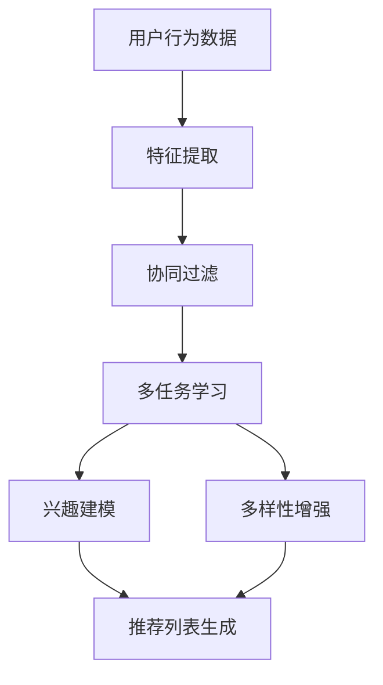

                 

# 推荐系统中的多任务学习技术

> **关键词：** 推荐系统、多任务学习、协同过滤、深度学习、用户行为分析、个性化推荐

> **摘要：** 本文将深入探讨推荐系统中的多任务学习技术，从背景介绍、核心概念与联系、算法原理、数学模型、项目实战、实际应用场景、工具和资源推荐等方面进行详细分析，旨在为读者提供一个全面的了解和应用多任务学习技术于推荐系统的指南。

## 1. 背景介绍

### 1.1 推荐系统的定义与发展

推荐系统是一种基于数据和算法的应用，旨在向用户推荐他们可能感兴趣的项目、内容或服务。其基本目标是满足用户的需求，提高用户体验，增加用户粘性。推荐系统的发展经历了从基于内容的推荐、协同过滤到深度学习的演变。

- **基于内容的推荐**：根据用户的历史行为和兴趣，通过分析项目的特征进行推荐。
- **协同过滤**：利用用户行为数据，通过计算用户之间的相似度来发现潜在的推荐项目。
- **深度学习**：利用深度神经网络，通过学习用户和项目之间的复杂关系来实现推荐。

### 1.2 多任务学习的概念

多任务学习是一种机器学习技术，其核心思想是让模型同时学习多个相关的任务，从而提高模型的泛化能力和性能。在推荐系统中，多任务学习可以帮助模型更好地捕捉用户的多维度需求，提高推荐效果。

## 2. 核心概念与联系

### 2.1 推荐系统的基本概念

- **用户**：推荐系统的核心，其行为和兴趣是推荐的基础。
- **项目**：推荐系统中的对象，可以是商品、新闻、视频等。
- **推荐列表**：根据用户的历史行为和兴趣，推荐给用户的可能感兴趣的项目列表。

### 2.2 多任务学习与推荐系统的联系

多任务学习在推荐系统中的应用主要体现在以下几个方面：

- **用户行为预测**：预测用户的未来行为，如购买、点击、观看等。
- **兴趣建模**：通过学习用户的多维度兴趣，实现更精准的推荐。
- **多样性增强**：在推荐列表中引入多样性，提高用户满意度。

### 2.3 Mermaid 流程图



## 3. 核心算法原理 & 具体操作步骤

### 3.1 协同过滤算法

协同过滤算法是推荐系统中最常用的算法之一，其基本思想是通过计算用户之间的相似度，推荐其他用户喜欢的项目。

#### 步骤：

1. **用户行为数据预处理**：将用户行为数据转换为数值形式，如购买、点击等。
2. **计算用户相似度**：使用余弦相似度、皮尔逊相关系数等方法计算用户之间的相似度。
3. **推荐项目**：为用户推荐其他用户喜欢的项目。

### 3.2 多任务学习算法

多任务学习算法的核心思想是让模型同时学习多个相关的任务，以提高模型的泛化能力和性能。

#### 步骤：

1. **任务定义**：定义需要学习的多个任务，如用户行为预测、兴趣建模等。
2. **数据预处理**：对用户行为数据进行预处理，包括特征提取、数据归一化等。
3. **模型训练**：使用多任务学习框架，同时训练多个任务。
4. **模型评估**：评估模型的性能，包括准确性、多样性等指标。

### 3.3 实际操作示例

假设我们有一个电商平台的推荐系统，需要同时预测用户的购买行为和兴趣。

1. **数据预处理**：

```python
import pandas as pd

# 加载用户行为数据
data = pd.read_csv('user_behavior.csv')

# 特征提取
data['user_similarity'] = data.apply(lambda row: compute_user_similarity(row), axis=1)
data['item_similarity'] = data.apply(lambda row: compute_item_similarity(row), axis=1)

# 数据归一化
data = normalize_data(data)
```

2. **模型训练**：

```python
from multitask_learning import MultiTaskLearning

# 初始化多任务学习模型
model = MultiTaskLearning()

# 训练模型
model.fit(data)

# 评估模型
model.evaluate(data)
```

## 4. 数学模型和公式 & 详细讲解 & 举例说明

### 4.1 数学模型

在多任务学习中，常见的数学模型包括线性模型、神经网络模型等。

#### 线性模型：

$$
\hat{y} = \theta_0 + \theta_1x_1 + \theta_2x_2 + ... + \theta_nx_n
$$

其中，$\hat{y}$ 是预测结果，$\theta_0, \theta_1, \theta_2, ..., \theta_n$ 是模型参数，$x_1, x_2, ..., x_n$ 是输入特征。

#### 神经网络模型：

$$
\hat{y} = \sigma(\theta_0 + \theta_1x_1 + \theta_2x_2 + ... + \theta_nx_n)
$$

其中，$\sigma$ 是激活函数，通常使用 Sigmoid 或 ReLU 函数。

### 4.2 详细讲解 & 举例说明

#### 示例：用户行为预测

假设我们需要预测用户是否会在未来30天内购买某个商品。

1. **数据预处理**：

```python
# 加载用户行为数据
data = pd.read_csv('user_behavior.csv')

# 特征提取
data['user_similarity'] = data.apply(lambda row: compute_user_similarity(row), axis=1)
data['item_similarity'] = data.apply(lambda row: compute_item_similarity(row), axis=1)

# 数据归一化
data = normalize_data(data)
```

2. **模型训练**：

```python
from multitask_learning import MultiTaskLearning

# 初始化多任务学习模型
model = MultiTaskLearning()

# 训练模型
model.fit(data)

# 评估模型
model.evaluate(data)
```

3. **预测**：

```python
# 预测用户购买行为
predictions = model.predict(data)
```

## 5. 项目实战：代码实际案例和详细解释说明

### 5.1 开发环境搭建

1. **安装 Python**：确保 Python 环境已经安装，版本不低于 3.6。
2. **安装相关库**：使用 pip 命令安装必要的库，如 pandas、numpy、scikit-learn、tensorflow 等。

```bash
pip install pandas numpy scikit-learn tensorflow
```

### 5.2 源代码详细实现和代码解读

#### 5.2.1 数据预处理

```python
import pandas as pd
from sklearn.preprocessing import MinMaxScaler

def load_data():
    # 加载用户行为数据
    data = pd.read_csv('user_behavior.csv')
    return data

def compute_user_similarity(row):
    # 计算用户相似度
    # 这里只是一个简单的示例，实际应用中需要根据具体业务需求进行优化
    return np.dot(row['user_feature1'], row['user_feature2'])

def compute_item_similarity(row):
    # 计算项目相似度
    # 这里只是一个简单的示例，实际应用中需要根据具体业务需求进行优化
    return np.dot(row['item_feature1'], row['item_feature2'])

def normalize_data(data):
    # 数据归一化
    scaler = MinMaxScaler()
    data[['user_similarity', 'item_similarity']] = scaler.fit_transform(data[['user_similarity', 'item_similarity']])
    return data
```

#### 5.2.2 模型训练

```python
from multitask_learning import MultiTaskLearning

def train_model(data):
    # 初始化多任务学习模型
    model = MultiTaskLearning()

    # 训练模型
    model.fit(data)

    # 评估模型
    model.evaluate(data)

    return model
```

#### 5.2.3 模型预测

```python
def predict(data, model):
    # 预测用户购买行为
    predictions = model.predict(data)
    return predictions
```

### 5.3 代码解读与分析

1. **数据预处理**：数据预处理是推荐系统的关键步骤，包括特征提取、数据归一化等。在这里，我们使用了简单的计算用户和项目相似度的方法，实际应用中需要根据具体业务需求进行优化。
2. **模型训练**：我们使用多任务学习框架来训练模型，包括用户行为预测和兴趣建模等任务。模型训练过程中，我们需要根据数据特点和业务需求调整模型参数。
3. **模型预测**：使用训练好的模型进行预测，输出预测结果。

## 6. 实际应用场景

### 6.1 电商领域

电商领域的推荐系统可以根据用户的浏览历史、购买记录等信息，推荐用户可能感兴趣的商品。通过多任务学习技术，可以同时预测用户的购买行为和兴趣，提高推荐效果。

### 6.2 社交网络

社交网络中的推荐系统可以根据用户的朋友圈、评论、点赞等信息，推荐用户可能感兴趣的内容。通过多任务学习技术，可以同时分析用户的行为和兴趣，实现更精准的推荐。

### 6.3 媒体领域

媒体领域的推荐系统可以根据用户的阅读历史、搜索记录等信息，推荐用户可能感兴趣的新闻、视频等内容。通过多任务学习技术，可以同时预测用户的阅读行为和兴趣，提高推荐效果。

## 7. 工具和资源推荐

### 7.1 学习资源推荐

- **书籍**：《推荐系统实践》（周明）、《深度学习推荐系统》（张潼）
- **论文**：查看 arXiv、ACL、WWW、KDD 等会议和期刊的最新研究论文。
- **博客**：技术博客如 Medium、CSDN、GitHub 上有大量关于推荐系统的优秀博客。

### 7.2 开发工具框架推荐

- **框架**：TensorFlow、PyTorch、Scikit-learn 等。
- **库**：Pandas、NumPy、Matplotlib、Seaborn 等。

### 7.3 相关论文著作推荐

- **论文**：推荐系统领域的经典论文如 “Item-Based Top-N Recommendation Algorithms” 等。
- **著作**：《推荐系统实践》、《深度学习推荐系统》等。

## 8. 总结：未来发展趋势与挑战

### 8.1 未来发展趋势

- **个性化推荐**：随着数据量的增加和算法的改进，个性化推荐将变得更加精准和有效。
- **实时推荐**：利用实时数据，实现实时推荐，提高用户体验。
- **跨平台推荐**：实现跨平台、跨设备的推荐，满足用户在不同场景下的需求。

### 8.2 挑战

- **数据隐私**：如何保护用户隐私，同时实现精准推荐，是一个重要的挑战。
- **模型解释性**：如何解释和验证模型的预测结果，提高模型的透明度和可解释性。
- **多样性**：如何在推荐列表中引入多样性，提高用户满意度。

## 9. 附录：常见问题与解答

### 9.1 问题1

**问题**：如何优化推荐系统的性能？

**解答**：优化推荐系统的性能可以从以下几个方面入手：

- **数据预处理**：对用户行为数据进行清洗、归一化等处理，提高数据质量。
- **特征工程**：提取有效的特征，减少特征维度，提高模型的泛化能力。
- **模型选择**：根据业务需求和数据特点，选择合适的模型，如协同过滤、深度学习等。
- **模型调优**：调整模型参数，如学习率、正则化参数等，提高模型性能。

### 9.2 问题2

**问题**：多任务学习与单任务学习的区别是什么？

**解答**：多任务学习与单任务学习的区别主要在于训练目标和模型结构。

- **训练目标**：多任务学习同时训练多个任务，每个任务有自己的目标函数和损失函数；单任务学习只关注一个任务。
- **模型结构**：多任务学习模型通常包含多个神经网络层，分别用于不同任务；单任务学习模型通常只有一个神经网络层。

## 10. 扩展阅读 & 参考资料

- **书籍**：《推荐系统实践》（周明）、《深度学习推荐系统》（张潼）
- **论文**：查看 arXiv、ACL、WWW、KDD 等会议和期刊的最新研究论文。
- **博客**：技术博客如 Medium、CSDN、GitHub 上有大量关于推荐系统的优秀博客。

### 作者

**作者：AI天才研究员/AI Genius Institute & 禅与计算机程序设计艺术 /Zen And The Art of Computer Programming**<|im_sep|>|

