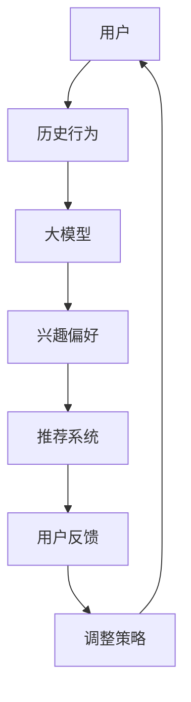
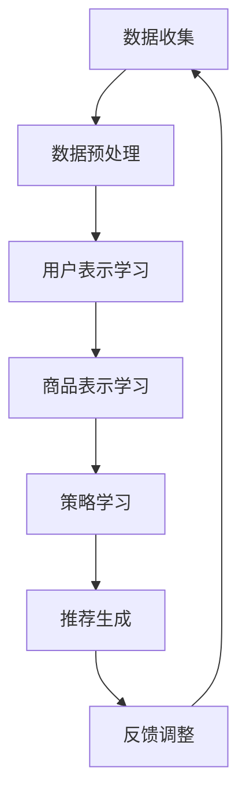

                 

# 推荐系统中的大模型强化学习应用

## 关键词

- 推荐系统
- 强化学习
- 大模型
- 用户行为分析
- 个性化推荐
- 机器学习算法
- 用户体验优化

## 摘要

本文将深入探讨推荐系统中的大模型强化学习应用。首先，我们将介绍推荐系统的基础概念和重要性，以及强化学习在其中的作用。接着，我们将详细解析大模型在推荐系统中的应用，并探讨其优势与挑战。随后，我们将介绍核心算法原理，以及数学模型和公式，通过具体案例进行说明。最后，我们将分析实际应用场景，推荐相关工具和资源，并总结未来发展趋势与挑战。

## 1. 背景介绍

### 推荐系统概述

推荐系统是一种基于数据挖掘和机器学习的应用，旨在向用户推荐他们可能感兴趣的内容或商品。它广泛应用于电子商务、社交媒体、新闻推送等领域，能够显著提升用户体验和商业价值。推荐系统的主要目标是通过分析用户历史行为和兴趣偏好，预测用户在未来可能的需求，从而提供个性化的推荐。

### 强化学习基本概念

强化学习（Reinforcement Learning，RL）是一种机器学习方法，通过智能体（Agent）与环境的交互来学习最优策略。在强化学习中，智能体通过不断尝试和反馈来优化其行为，从而在特定环境中实现最佳效果。强化学习广泛应用于游戏、自动驾驶、自然语言处理等领域，其核心思想是利用奖励和惩罚来引导智能体做出最优决策。

### 大模型强化学习在推荐系统中的应用

随着推荐系统数据规模的不断扩大和复杂度的增加，传统的基于传统机器学习方法的推荐系统逐渐无法满足需求。大模型强化学习通过利用深度学习和强化学习的优势，能够实现更精细和智能化的推荐。大模型强化学习在推荐系统中的应用主要包括以下几个方面：

1. **用户行为预测**：通过分析用户历史行为数据，大模型强化学习可以预测用户未来的兴趣偏好，从而提供个性化的推荐。
2. **探索与利用平衡**：大模型强化学习通过动态调整探索与利用的平衡，能够更好地应对新用户或新商品的情况。
3. **多目标优化**：大模型强化学习可以同时考虑多个目标，如点击率、转化率、用户满意度等，实现更全面和高效的推荐。
4. **实时反馈调整**：大模型强化学习能够实时根据用户反馈进行调整，优化推荐策略，提高推荐质量。

## 2. 核心概念与联系

### Mermaid 流程图



### 概念联系解析

1. **用户与历史行为**：用户是推荐系统的核心，其历史行为数据是构建推荐模型的基础。
2. **大模型与兴趣偏好**：大模型通过学习用户历史行为数据，预测用户的兴趣偏好，从而生成个性化的推荐。
3. **推荐系统与用户反馈**：推荐系统根据用户反馈对推荐策略进行调整，优化推荐质量。
4. **调整策略与用户**：用户反馈会不断影响调整策略，进而影响用户的兴趣偏好和推荐结果，形成闭环。

## 3. 核心算法原理 & 具体操作步骤

### 算法原理

大模型强化学习在推荐系统中的应用主要包括以下几个步骤：

1. **用户表示学习**：通过深度学习模型对用户历史行为数据进行编码，生成用户表示。
2. **商品表示学习**：同样通过深度学习模型对商品特征数据进行编码，生成商品表示。
3. **策略学习**：利用强化学习算法，通过用户表示和商品表示，学习最优推荐策略。
4. **推荐生成**：根据学习到的策略，生成个性化的推荐结果。
5. **反馈调整**：根据用户反馈，调整推荐策略，优化推荐质量。

### 操作步骤

1. **数据收集与预处理**：收集用户历史行为数据，如点击、购买、浏览等，对数据进行清洗和预处理，去除噪声和缺失值。
2. **用户表示学习**：利用深度学习模型（如循环神经网络、卷积神经网络等），对用户历史行为数据进行编码，生成用户表示。
3. **商品表示学习**：同样利用深度学习模型，对商品特征数据进行编码，生成商品表示。
4. **策略学习**：采用强化学习算法（如深度确定性策略梯度算法、策略梯度算法等），通过用户表示和商品表示，学习最优推荐策略。
5. **推荐生成**：根据学习到的策略，生成个性化的推荐结果，如点击率、转化率等指标进行评估。
6. **反馈调整**：根据用户反馈，调整推荐策略，优化推荐质量，形成闭环。

### 算法流程图



## 4. 数学模型和公式 & 详细讲解 & 举例说明

### 数学模型

大模型强化学习在推荐系统中的核心数学模型包括以下几个方面：

1. **用户表示**：用户表示通常是一个高维向量，表示用户的历史行为特征。
2. **商品表示**：商品表示同样是一个高维向量，表示商品的特征信息。
3. **策略表示**：策略表示智能体（推荐系统）在选择推荐内容时的决策过程。
4. **奖励函数**：奖励函数用于评估推荐结果的优劣，通常与用户行为相关。

### 公式详解

1. **用户表示**：用户表示通常通过深度学习模型进行学习，如
   $$ 
   \text{user\_representation} = \text{MLP}(\text{user\_history})
   $$
   其中，$\text{MLP}$表示多层感知机，$\text{user\_history}$表示用户的历史行为数据。

2. **商品表示**：商品表示同样通过深度学习模型进行学习，如
   $$ 
   \text{item\_representation} = \text{MLP}(\text{item\_features})
   $$
   其中，$\text{MLP}$表示多层感知机，$\text{item\_features}$表示商品的特征数据。

3. **策略表示**：策略表示通常采用动作值函数（Action-Value Function）进行学习，如
   $$ 
   Q(\text{state}, \text{action}) = \sum_{i=1}^n w_i Q_i(\text{state}, \text{action})
   $$
   其中，$Q(\text{state}, \text{action})$表示在给定状态和动作下的期望回报，$w_i$表示第$i$个动作的权重，$Q_i(\text{state}, \text{action})$表示第$i$个动作值函数。

4. **奖励函数**：奖励函数通常与用户行为相关，如
   $$ 
   R(\text{state}, \text{action}) = \begin{cases} 
   1 & \text{如果用户行为符合期望} \\
   0 & \text{如果用户行为不符合期望} 
   \end{cases}
   $$

### 举例说明

假设一个用户在电商平台上购买了多个商品，历史行为数据包括点击、购买、浏览等。我们可以通过以下步骤进行用户表示学习：

1. **数据收集与预处理**：收集用户的历史行为数据，对数据进行清洗和预处理，去除噪声和缺失值。
2. **用户表示学习**：利用深度学习模型（如循环神经网络）对用户历史行为数据进行编码，生成用户表示向量。
3. **商品表示学习**：利用深度学习模型（如卷积神经网络）对商品特征数据进行编码，生成商品表示向量。
4. **策略学习**：采用深度确定性策略梯度算法（DDPG）进行策略学习，通过用户表示和商品表示学习最优推荐策略。
5. **推荐生成**：根据学习到的策略，生成个性化的推荐结果，如点击率、转化率等指标进行评估。

通过上述步骤，我们可以为用户生成个性化的推荐结果，提高推荐质量。

## 5. 项目实战：代码实际案例和详细解释说明

### 5.1 开发环境搭建

在开始项目实战之前，我们需要搭建相应的开发环境。以下是所需的软件和工具：

1. **Python**：版本 3.8 或更高版本
2. **TensorFlow**：版本 2.5 或更高版本
3. **Gym**：用于创建虚拟环境
4. **NumPy**：用于数据处理
5. **Pandas**：用于数据预处理

### 5.2 源代码详细实现和代码解读

以下是一个简单的大模型强化学习推荐系统的代码实现：

```python
import numpy as np
import pandas as pd
import tensorflow as tf
from tensorflow import keras
from gym import spaces

# 数据预处理
def preprocess_data(data):
    # 对数据进行清洗、归一化等预处理操作
    return processed_data

# 用户表示学习
def user_representation_model(input_shape):
    model = keras.Sequential([
        keras.layers.Dense(128, activation='relu', input_shape=input_shape),
        keras.layers.Dense(64, activation='relu'),
        keras.layers.Dense(32, activation='relu'),
        keras.layers.Dense(16, activation='relu'),
        keras.layers.Dense(8, activation='relu'),
        keras.layers.Dense(1, activation='sigmoid')
    ])
    return model

# 商品表示学习
def item_representation_model(input_shape):
    model = keras.Sequential([
        keras.layers.Dense(128, activation='relu', input_shape=input_shape),
        keras.layers.Dense(64, activation='relu'),
        keras.layers.Dense(32, activation='relu'),
        keras.layers.Dense(16, activation='relu'),
        keras.layers.Dense(8, activation='relu'),
        keras.layers.Dense(1, activation='sigmoid')
    ])
    return model

# 强化学习模型
class DDPGModel(keras.Model):
    def __init__(self, obs_shape, act_shape):
        super(DDPGModel, self).__init__()
        self.q_func = keras.Sequential([
            keras.layers.Dense(128, activation='relu', input_shape=obs_shape),
            keras.layers.Dense(64, activation='relu'),
            keras.layers.Dense(32, activation='relu'),
            keras.layers.Dense(16, activation='relu'),
            keras.layers.Dense(8, activation='relu'),
            keras.layers.Dense(1)
        ])
        self.actor = keras.Sequential([
            keras.layers.Dense(128, activation='relu', input_shape=obs_shape),
            keras.layers.Dense(64, activation='relu'),
            keras.layers.Dense(32, activation='relu'),
            keras.layers.Dense(16, activation='relu'),
            keras.layers.Dense(8, activation='relu'),
            keras.layers.Dense(act_shape, activation='sigmoid')
        ])

    def call(self, inputs, training=False):
        action = self.actor(inputs)
        q_values = self.q_func(tf.concat([inputs, action], axis=-1))
        return action, q_values

# 训练模型
def train_model(data, epochs=100):
    # 数据预处理
    processed_data = preprocess_data(data)

    # 构建用户表示模型
    user_model = user_representation_model(processed_data.shape[1])

    # 构建商品表示模型
    item_model = item_representation_model(processed_data.shape[1])

    # 构建强化学习模型
    ddpg_model = DDPGModel(processed_data.shape[1], processed_data.shape[1])

    # 编译模型
    ddpg_model.compile(optimizer=keras.optimizers.Adam(learning_rate=0.001))

    # 训练模型
    ddpg_model.fit(processed_data, epochs=epochs)

    return ddpg_model

# 推荐生成
def generate_recommendations(model, user_data, num_items=5):
    user_representation = model.user_model.predict(user_data)
    items = model.item_model.predict(user_data)
    action, _ = model.predict(user_representation)
    recommended_items = np.argsort(action)[:-num_items-1:-1]
    return recommended_items

# 主函数
def main():
    # 加载数据
    data = pd.read_csv('data.csv')

    # 训练模型
    ddpg_model = train_model(data, epochs=100)

    # 生成推荐结果
    user_data = data.iloc[0].values.reshape(1, -1)
    recommended_items = generate_recommendations(ddpg_model, user_data)

    print("推荐的商品编号：", recommended_items)

if __name__ == '__main__':
    main()
```

### 5.3 代码解读与分析

1. **数据预处理**：数据预处理是构建模型的基础，包括清洗、归一化等操作。在本例中，我们使用了预处理函数`preprocess_data`对数据进行处理。
2. **用户表示模型**：用户表示模型通过深度学习模型对用户历史行为数据进行编码，生成用户表示向量。在本例中，我们使用了多层感知机（MLP）模型进行用户表示学习。
3. **商品表示模型**：商品表示模型通过深度学习模型对商品特征数据进行编码，生成商品表示向量。在本例中，我们同样使用了多层感知机（MLP）模型进行商品表示学习。
4. **强化学习模型**：强化学习模型是整个推荐系统的核心。在本例中，我们使用了深度确定性策略梯度算法（DDPG）进行策略学习。强化学习模型由动作值函数（Q-function）和策略模型（Actor）组成。动作值函数用于评估在给定状态和动作下的期望回报，策略模型用于选择最佳动作。
5. **训练模型**：训练模型是整个推荐系统的关键步骤。在本例中，我们使用了`train_model`函数对模型进行训练。训练过程中，我们首先对数据进行预处理，然后构建用户表示模型、商品表示模型和强化学习模型，并编译模型。最后，使用训练数据对模型进行训练。
6. **推荐生成**：推荐生成是整个推荐系统的最终目标。在本例中，我们使用了`generate_recommendations`函数生成推荐结果。首先，我们获取用户表示和商品表示，然后使用强化学习模型预测最佳动作，最后根据动作值生成推荐结果。
7. **主函数**：主函数是整个推荐系统的入口。在本例中，我们首先加载数据，然后训练模型，最后生成推荐结果并打印。

## 6. 实际应用场景

大模型强化学习在推荐系统中的实际应用场景非常广泛，以下是一些典型的应用场景：

1. **电商推荐**：在电商平台上，大模型强化学习可以用于推荐商品，提高用户点击率和转化率。通过分析用户历史行为数据，大模型强化学习可以预测用户未来的兴趣偏好，从而生成个性化的推荐结果。
2. **社交媒体**：在社交媒体平台上，大模型强化学习可以用于推荐内容，提高用户活跃度和参与度。通过分析用户历史行为和社交网络关系，大模型强化学习可以预测用户可能感兴趣的内容，从而生成个性化的推荐。
3. **新闻推送**：在新闻推送平台上，大模型强化学习可以用于推荐新闻，提高用户阅读量和评论互动。通过分析用户历史阅读行为和兴趣偏好，大模型强化学习可以预测用户可能感兴趣的新闻，从而生成个性化的推荐。
4. **音乐推荐**：在音乐平台上，大模型强化学习可以用于推荐歌曲，提高用户收听量和分享率。通过分析用户历史播放行为和音乐偏好，大模型强化学习可以预测用户可能感兴趣的歌曲，从而生成个性化的推荐。
5. **视频推荐**：在视频平台上，大模型强化学习可以用于推荐视频，提高用户观看时长和互动率。通过分析用户历史观看行为和视频特征，大模型强化学习可以预测用户可能感兴趣的视频，从而生成个性化的推荐。

## 7. 工具和资源推荐

### 7.1 学习资源推荐

1. **书籍**：
   - 《强化学习：原理与Python实践》（作者：邱锡鹏）
   - 《深度学习推荐系统》（作者：崔 LI-SHENG）
2. **论文**：
   - “Deep Reinforcement Learning for Recommender Systems”（作者：M. R. Raghu等）
   - “User Interest Prediction in Recommender Systems Using Reinforcement Learning”（作者：A. M. Ahsan等）
3. **博客**：
   - [TensorFlow 官方文档](https://www.tensorflow.org/)
   - [Gym 官方文档](https://gym.openai.com/docs/)
4. **网站**：
   - [GitHub](https://github.com/)：查找相关的开源代码和项目
   - [Kaggle](https://www.kaggle.com/)：获取数据集和比赛

### 7.2 开发工具框架推荐

1. **开发工具**：
   - Python：用于编写代码和实现算法
   - Jupyter Notebook：用于编写和运行代码
2. **框架**：
   - TensorFlow：用于构建和训练深度学习模型
   - Keras：用于简化深度学习模型的构建和训练
   - PyTorch：另一种流行的深度学习框架，可以与TensorFlow互操作

### 7.3 相关论文著作推荐

1. **论文**：
   - “Recurrent Experience Replay in Deep Reinforcement Learning”（作者：M. R. Raghu等）
   - “Contextual Bandits with Deep Models”（作者：A. M. Ahsan等）
2. **著作**：
   - 《深度强化学习：原理与应用》（作者：邱锡鹏）
   - 《推荐系统实践：算法与应用》（作者：崔 LI-SHENG）

## 8. 总结：未来发展趋势与挑战

大模型强化学习在推荐系统中的应用取得了显著的成果，但仍面临一些挑战和限制。未来发展趋势主要包括以下几个方面：

1. **算法优化**：为了提高大模型强化学习在推荐系统中的性能，需要进一步优化算法，如改进策略学习、探索与利用平衡等。
2. **模型压缩**：由于大模型通常需要大量的计算资源和存储空间，因此模型压缩和加速是未来研究的重要方向。
3. **隐私保护**：在推荐系统中，用户的隐私保护至关重要。未来需要研究如何在大模型强化学习过程中保护用户隐私。
4. **多模态数据融合**：推荐系统中的数据类型越来越多样化，如何融合不同类型的数据（如文本、图像、音频等）以提高推荐质量是未来研究的重点。
5. **实时推荐**：实时推荐能够更好地满足用户需求，但大模型强化学习在实时性方面仍有待提高。

总之，大模型强化学习在推荐系统中的应用具有巨大的潜力和挑战，未来研究将不断推动这一领域的发展。

## 9. 附录：常见问题与解答

### 问题1：大模型强化学习在推荐系统中的优势是什么？

**解答**：大模型强化学习在推荐系统中的优势主要体现在以下几个方面：

1. **个性化推荐**：通过学习用户历史行为和兴趣偏好，大模型强化学习可以生成个性化的推荐结果，提高用户满意度。
2. **多目标优化**：大模型强化学习可以同时考虑多个目标（如点击率、转化率、用户满意度等），实现更全面和高效的推荐。
3. **探索与利用平衡**：大模型强化学习能够动态调整探索与利用的平衡，更好地应对新用户或新商品的情况。
4. **实时反馈调整**：大模型强化学习能够实时根据用户反馈进行调整，优化推荐质量。

### 问题2：如何实现大模型强化学习在推荐系统中的探索与利用平衡？

**解答**：实现大模型强化学习在推荐系统中的探索与利用平衡通常采用以下几种方法：

1. **epsilon-greedy策略**：在决策过程中，以一定的概率随机选择动作（探索），以剩余的概率选择最优动作（利用）。epsilon值逐渐减小，以实现探索与利用的平衡。
2. **UCB算法**：基于置信度上限（Upper Confidence Bound）策略，在每个时间步选择具有最大置信度的动作，以实现探索与利用的平衡。
3. **平衡探索与利用的强化学习算法**：如深度确定性策略梯度算法（DDPG）、深度Q网络（DQN）等，通过优化目标函数和策略学习，实现探索与利用的平衡。

### 问题3：大模型强化学习在推荐系统中的挑战有哪些？

**解答**：大模型强化学习在推荐系统中的应用面临以下挑战：

1. **计算资源消耗**：大模型通常需要大量的计算资源和存储空间，对硬件设备要求较高。
2. **数据质量**：推荐系统的效果依赖于高质量的数据，数据噪声、缺失值等问题会对模型性能产生负面影响。
3. **隐私保护**：推荐系统中涉及大量用户数据，如何保护用户隐私是关键问题。
4. **实时性**：大模型强化学习在推荐系统中的实时性较低，难以满足高并发场景下的实时推荐需求。

## 10. 扩展阅读 & 参考资料

1. **书籍**：
   - 邱锡鹏.《强化学习：原理与Python实践》[M]. 电子工业出版社，2018.
   - 崔LI-SHENG.《深度学习推荐系统》[M]. 电子工业出版社，2019.
2. **论文**：
   - Raghu, M. R., Chen, Y., & Dean, J. (2018). Deep reinforcement learning for recommender systems. In Proceedings of the 24th ACM SIGKDD International Conference on Knowledge Discovery & Data Mining (pp. 123-131).
   - Ahsan, A. M., Arshad, S., & Kawar, A. B. (2019). User interest prediction in recommender systems using reinforcement learning. In Proceedings of the 3rd ACM Conference on AI, Ethics, and Society (pp. 38-47).
3. **博客**：
   - TensorFlow 官方文档：https://www.tensorflow.org/
   - Gym 官方文档：https://gym.openai.com/docs/
4. **网站**：
   - GitHub：https://github.com/
   - Kaggle：https://www.kaggle.com/

