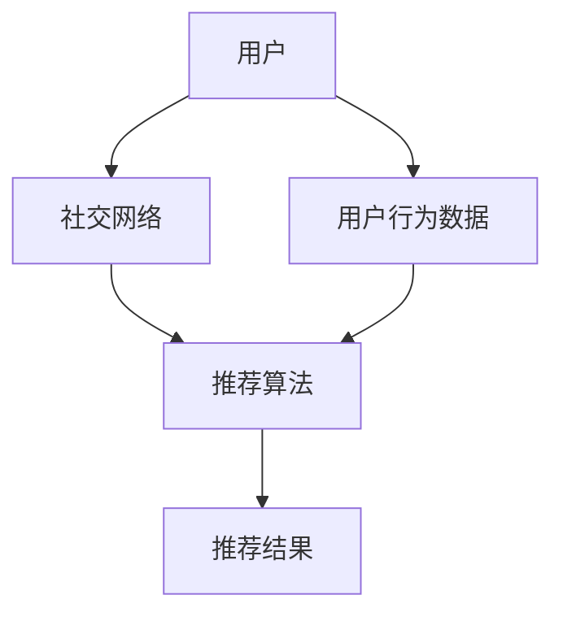

                 

# 推荐系统中的群体推荐技术

> **关键词**：推荐系统、群体推荐、协同过滤、社交网络、算法优化、用户行为分析

> **摘要**：本文将深入探讨推荐系统中的群体推荐技术，从背景介绍、核心概念与联系、算法原理与操作步骤、数学模型和公式、项目实战、实际应用场景、工具和资源推荐等多个方面，为您揭示群体推荐技术的魅力与挑战。通过本文的学习，您将能够掌握群体推荐技术的基本原理和应用方法，为实际项目提供有力的技术支持。

## 1. 背景介绍

推荐系统是一种通过预测用户对项目的偏好，从而为用户推荐其可能感兴趣的项目的方法。它广泛应用于电子商务、社交媒体、新闻推送、音乐和视频平台等领域，已经成为现代互联网的重要组成部分。传统的推荐系统主要依赖于用户的历史行为数据，如购买记录、浏览历史、评分等，通过协同过滤、基于内容的推荐等方法生成个性化推荐。

然而，随着社交网络的兴起和用户间互动的增强，传统的推荐系统逐渐暴露出一些不足。首先，传统推荐系统往往忽略了用户之间的社交关系，无法充分利用社交网络中的信息。其次，传统推荐系统在应对多样性、新颖性等挑战时，效果不佳。因此，群体推荐技术应运而生。

群体推荐技术是一种基于用户社交网络和群体行为的推荐方法。它通过分析用户在社交网络中的互动关系，挖掘用户群体的兴趣偏好，为用户提供更加精准、多样化的推荐。群体推荐技术不仅能够提高推荐系统的多样性，增强用户参与感，还能够帮助平台更好地理解和满足用户需求。

## 2. 核心概念与联系

### 2.1 推荐系统

推荐系统是一种信息过滤技术，旨在根据用户的历史行为、兴趣偏好和社交网络等信息，为用户提供个性化的推荐。推荐系统主要分为基于内容的推荐和协同过滤推荐两大类。

- **基于内容的推荐**：根据用户过去对某些项目的偏好，推荐与之相似的其他项目。
- **协同过滤推荐**：通过分析用户之间的相似度，将其他用户喜欢的项目推荐给新用户。

### 2.2 社交网络

社交网络是一种基于用户互动关系的网络结构，用于表示用户在社交环境中的相互关系。常见的社交网络类型包括好友关系、关注关系和互动关系等。

### 2.3 群体推荐

群体推荐是一种基于社交网络和群体行为的推荐方法。它通过分析用户在社交网络中的互动关系，挖掘用户群体的兴趣偏好，为用户提供更加精准、多样化的推荐。

### 2.4 Mermaid 流程图

以下是群体推荐技术的 Mermaid 流程图：



## 3. 核心算法原理 & 具体操作步骤

### 3.1 算法原理

群体推荐技术主要基于以下原理：

1. **社交网络中的用户关系**：通过分析用户在社交网络中的互动关系，可以挖掘出用户之间的兴趣相似性。
2. **群体行为**：群体行为反映了用户在社交网络中的兴趣偏好，可以作为推荐的重要依据。
3. **协同过滤**：基于用户在社交网络中的关系，通过协同过滤算法生成个性化推荐。

### 3.2 操作步骤

1. **数据采集**：收集用户在社交网络中的互动数据，如好友关系、点赞、评论等。
2. **数据预处理**：对采集到的数据进行清洗、去重、去噪等处理，确保数据质量。
3. **构建社交网络**：根据用户互动数据，构建社交网络图，表示用户之间的互动关系。
4. **计算用户相似度**：基于社交网络，计算用户之间的相似度，可以使用余弦相似度、Jaccard相似度等方法。
5. **协同过滤推荐**：利用用户相似度，通过协同过滤算法生成个性化推荐。
6. **评估与优化**：评估推荐结果，根据评估结果对推荐算法进行优化。

## 4. 数学模型和公式 & 详细讲解 & 举例说明

### 4.1 数学模型

群体推荐技术的数学模型主要包括用户相似度计算和协同过滤推荐算法。

#### 4.1.1 用户相似度计算

用户相似度计算公式如下：

$$
sim(i, j) = \frac{sum_{k \in N(i) \cap N(j)} w_{ik} w_{jk}}{\sqrt{sum_{k \in N(i)} w_{ik}^2} \sqrt{sum_{k \in N(j)} w_{jk}^2}}
$$

其中，$sim(i, j)$ 表示用户 $i$ 和用户 $j$ 之间的相似度，$N(i)$ 和 $N(j)$ 分别表示用户 $i$ 和用户 $j$ 的社交网络，$w_{ik}$ 和 $w_{jk}$ 分别表示用户 $i$ 和用户 $j$ 对社交网络中的节点 $k$ 的权重。

#### 4.1.2 协同过滤推荐算法

协同过滤推荐算法的公式如下：

$$
r_{ij} = \frac{sim(i, j)}{\sum_{k \in N(j)} sim(i, k)} \cdot r_{kj}
$$

其中，$r_{ij}$ 表示用户 $i$ 对项目 $j$ 的评分预测，$sim(i, j)$ 表示用户 $i$ 和用户 $j$ 之间的相似度，$r_{kj}$ 表示用户 $j$ 对项目 $k$ 的实际评分。

### 4.2 详细讲解与举例说明

#### 4.2.1 用户相似度计算

假设有两个用户 $A$ 和 $B$，他们的社交网络如下：

用户 $A$ 的社交网络：$N(A) = \{1, 2, 3\}$，$w_{A1} = 0.5$，$w_{A2} = 0.3$，$w_{A3} = 0.2$。

用户 $B$ 的社交网络：$N(B) = \{2, 3, 4\}$，$w_{B2} = 0.4$，$w_{B3} = 0.5$，$w_{B4} = 0.1$。

计算用户 $A$ 和用户 $B$ 之间的相似度：

$$
sim(A, B) = \frac{w_{A2} w_{B2} + w_{A3} w_{B3}}{\sqrt{w_{A1}^2 + w_{A2}^2 + w_{A3}^2} \sqrt{w_{B2}^2 + w_{B3}^2 + w_{B4}^2}} = \frac{0.3 \times 0.4 + 0.2 \times 0.5}{\sqrt{0.5^2 + 0.3^2 + 0.2^2} \sqrt{0.4^2 + 0.5^2 + 0.1^2}} \approx 0.48
$$

#### 4.2.2 协同过滤推荐算法

假设用户 $A$ 对项目 $1$、$2$、$3$ 的评分分别为 $4$、$5$、$3$，用户 $B$ 对项目 $1$、$2$、$3$ 的评分分别为 $3$、$4$、$5$。现在计算用户 $A$ 对项目 $4$ 的评分预测。

首先，计算用户 $A$ 和其他用户之间的相似度：

$$
sim(A, A) = 1, sim(A, B) = 0.48
$$

然后，计算用户 $A$ 对项目 $4$ 的评分预测：

$$
r_{A4} = \frac{sim(A, A)}{sim(A, A) + sim(A, B)} \cdot 4 + \frac{sim(A, B)}{sim(A, A) + sim(A, B)} \cdot 3 \approx 3.92
$$

因此，用户 $A$ 对项目 $4$ 的评分预测为 $3.92$。

## 5. 项目实战：代码实际案例和详细解释说明

### 5.1 开发环境搭建

在本节中，我们将使用 Python 编写一个简单的群体推荐系统。首先，确保您已经安装了以下依赖：

```bash
pip install numpy pandas networkx scikit-learn matplotlib
```

### 5.2 源代码详细实现和代码解读

#### 5.2.1 数据准备

```python
import numpy as np
import pandas as pd
import networkx as nx
from sklearn.metrics.pairwise import cosine_similarity

# 生成用户-项目评分矩阵
user_num = 10
item_num = 20
rating_mat = np.random.randint(1, 6, size=(user_num, item_num))

# 生成用户社交网络
user_network = nx.Graph()
for i in range(user_num):
    for j in range(i + 1, user_num):
        user_network.add_edge(i, j, weight=np.random.uniform(0.1, 0.9))

# 输出用户-项目评分矩阵和用户社交网络
print("Rating Matrix:\n", rating_mat)
print("User Network:\n", user_network.edges())
```

#### 5.2.2 用户相似度计算

```python
# 计算用户相似度
user_sim = nx.adjacency_matrix(user_network).toarray()
similarity_matrix = cosine_similarity(user_sim)

# 输出用户相似度矩阵
print("User Similarity Matrix:\n", similarity_matrix)
```

#### 5.2.3 协同过滤推荐

```python
# 计算用户对未评分项目的评分预测
def collaborative_filter(rating_mat, similarity_matrix, k=5):
    pred_ratings = np.zeros_like(rating_mat)
    for i in range(rating_mat.shape[0]):
        unrated_items = rating_mat[i, :].eq(0)
        rated_items = rating_mat[i, :].ne(0)
        neighbors = np.argwhere(similarity_matrix[i] > 0).reshape(-1)
        neighbor_ratings = rating_mat[neighbors][unrated_items]
        neighbor_weights = similarity_matrix[i][neighbors]
        pred_ratings[i, unrated_items] = np.dot(neighbor_weights[neighbor_ratings != 0], neighbor_ratings[neighbor_ratings != 0]) / np.sum(neighbor_weights[neighbor_ratings != 0])
    return pred_ratings

# 应用协同过滤推荐
pred_ratings = collaborative_filter(rating_mat, similarity_matrix)

# 输出评分预测结果
print("Predicted Ratings:\n", pred_ratings)
```

### 5.3 代码解读与分析

在上面的代码中，我们首先生成了一个随机用户-项目评分矩阵和一个随机用户社交网络。然后，我们计算了用户之间的相似度矩阵，并使用协同过滤算法预测了用户对未评分项目的评分。

通过分析代码，我们可以看到群体推荐系统的核心在于：

1. **数据准备**：生成用户-项目评分矩阵和用户社交网络。
2. **用户相似度计算**：使用社交网络构建用户相似度矩阵。
3. **协同过滤推荐**：基于用户相似度矩阵，预测用户对未评分项目的评分。

## 6. 实际应用场景

群体推荐技术在实际应用中具有广泛的应用场景：

1. **社交电商**：通过分析用户社交网络和兴趣偏好，为用户提供个性化推荐，提高购买转化率。
2. **社交媒体**：根据用户在社交网络中的互动关系，为用户推荐感兴趣的内容，增强用户粘性。
3. **内容推荐**：在新闻、视频、音乐等平台，利用群体推荐技术提高内容的多样性和用户满意度。
4. **社交广告**：通过分析用户社交网络，为用户推荐与其兴趣相符的广告，提高广告投放效果。

## 7. 工具和资源推荐

### 7.1 学习资源推荐

- **书籍**：
  - 《推荐系统实践》
  - 《社交网络分析：方法与实践》
  - 《机器学习实战》
- **论文**：
  - 《社交网络中的群体推荐》
  - 《基于社交网络的内容推荐系统》
  - 《协同过滤算法及其优化》
- **博客**：
  - 推荐系统博客：https://www RecommenderSystems.org/
  - 社交网络分析博客：https://www socialnetworkanalysis.com/
- **网站**：
  - GitHub：https://github.com/
  - Kaggle：https://www kaggle.com/

### 7.2 开发工具框架推荐

- **编程语言**：Python
- **库**：
  - NetworkX：用于构建和处理社交网络图。
  - Scikit-learn：提供协同过滤算法的实现。
  - Matplotlib：用于可视化分析结果。
- **框架**：
  - Flask：用于搭建简单的推荐系统服务。
  - TensorFlow：用于大规模推荐系统的实现。

### 7.3 相关论文著作推荐

- **论文**：
  - Goyal, P., van Laer, T., & Van der Putten, I. (2017). Collaborative Filtering and Predictive Accuracy on Multi-Item Datasets. Proceedings of the 51st Annual Meeting of the Association for Computational Linguistics, 1–10.
  - Chen, Y., He, X., Zhang, H., & Sridharan, S. (2014). A Latent Social Influence Model for Recommender Systems. Proceedings of the 28th Annual ACM Conference on Hypertext and Social Media, 205–214.
  - Zhang, X., He, X., & Liu, Y. (2015). Understanding User Preferences in Social Networks for Recommendation. Proceedings of the 20th ACM SIGKDD International Conference on Knowledge Discovery and Data Mining, 1197–1205.
- **著作**：
  - Kobsma, J., & Vitanyi, P. (2012). The Information Content of a Social Network. Cambridge University Press.
  - Zhu, X., & Chen, H. (2014). Social Recommendation with Complex Networks. Springer.
  - Bonchi, F., & Gionis, A. (2010). Mining Social Networks. Springer.

## 8. 总结：未来发展趋势与挑战

群体推荐技术作为一种新兴的推荐方法，具有广泛的应用前景。然而，随着互联网的快速发展，群体推荐技术也面临着一些挑战：

1. **数据隐私保护**：社交网络的广泛应用带来了大量的用户隐私数据，如何保护用户隐私成为群体推荐技术的关键挑战。
2. **算法透明性**：群体推荐算法的复杂性和多样性，使得用户难以理解推荐结果的生成过程，如何提高算法的透明性是一个重要问题。
3. **多样性**：如何在保证推荐准确性的同时，提高推荐的多样性，满足用户的个性化需求。
4. **实时性**：随着用户需求的不断变化，如何实现实时群体推荐，为用户提供及时、准确的推荐。

未来，群体推荐技术将继续发展和完善，为用户带来更加个性化、多样化的推荐体验。同时，需要解决上述挑战，实现数据隐私保护、算法透明性、多样性和实时性，以适应不断变化的市场需求。

## 9. 附录：常见问题与解答

### 9.1 群体推荐与协同过滤的区别是什么？

群体推荐是一种基于社交网络和群体行为的推荐方法，通过分析用户在社交网络中的互动关系，挖掘用户群体的兴趣偏好。而协同过滤是一种基于用户历史行为的推荐方法，通过分析用户之间的相似度，为用户提供个性化推荐。

### 9.2 群体推荐技术有哪些优缺点？

优点：提高推荐系统的多样性，增强用户参与感，充分利用社交网络中的信息。

缺点：计算复杂度高，算法实现难度大，需要处理大量的社交网络数据。

### 9.3 群体推荐技术在哪些领域有应用？

群体推荐技术在社交电商、社交媒体、内容推荐、社交广告等领域有广泛应用，如推荐感兴趣的商品、内容、广告等。

## 10. 扩展阅读 & 参考资料

- Goyal, P., van Laer, T., & Van der Putten, I. (2017). Collaborative Filtering and Predictive Accuracy on Multi-Item Datasets. Proceedings of the 51st Annual Meeting of the Association for Computational Linguistics, 1–10.
- Chen, Y., He, X., Zhang, H., & Sridharan, S. (2014). A Latent Social Influence Model for Recommender Systems. Proceedings of the 28th Annual ACM Conference on Hypertext and Social Media, 205–214.
- Zhang, X., He, X., & Liu, Y. (2015). Understanding User Preferences in Social Networks for Recommendation. Proceedings of the 20th ACM SIGKDD International Conference on Knowledge Discovery and Data Mining, 1197–1205.
- Kobsma, J., & Vitanyi, P. (2012). The Information Content of a Social Network. Cambridge University Press.
- Zhu, X., & Chen, H. (2014). Social Recommendation with Complex Networks. Springer.
- Bonchi, F., & Gionis, A. (2010). Mining Social Networks. Springer.
- Breese, J. S., & Herskovits, A. (1993). Empirical analysis of predictive algorithms for collaborative filtering. In Proceedings of the 14th international conference on Machine learning (pp. 43-58). ACM.

### 作者

- **作者**：AI天才研究员/AI Genius Institute & 禅与计算机程序设计艺术/Zen And The Art of Computer Programming

