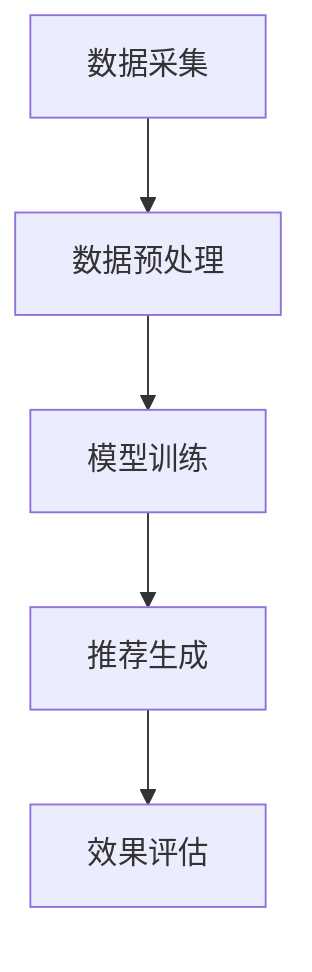

                 

# 推荐系统的时效性：AI大模型的动态调整策略

## 关键词：推荐系统，时效性，AI大模型，动态调整策略

## 摘要

本文将深入探讨推荐系统的时效性及其与AI大模型动态调整策略的关系。随着大数据和人工智能技术的飞速发展，推荐系统在电商平台、社交媒体、在线视频等领域得到了广泛应用。然而，推荐系统的时效性直接关系到用户体验和商业价值。本文将详细分析推荐系统时效性的重要性，介绍AI大模型在动态调整策略中的作用，并通过实例展示如何通过数学模型和具体操作步骤实现推荐系统的时效性优化。

## 1. 背景介绍

推荐系统是一种基于用户历史行为和偏好，为用户提供个性化推荐的一种系统。它广泛应用于电商、社交媒体、在线视频等场景，通过预测用户兴趣，提高用户满意度和商家收益。推荐系统的发展经历了从基于规则、协同过滤到基于模型的演变。随着深度学习技术的发展，AI大模型逐渐成为推荐系统的主要驱动力。

### 推荐系统的发展历程

- **基于规则的推荐系统**：最早期的推荐系统，主要依靠预定义的规则进行推荐，如商品分类、品牌推荐等。

- **协同过滤推荐系统**：通过分析用户之间的行为相似性进行推荐，分为基于用户的协同过滤和基于项目的协同过滤。

- **基于模型的推荐系统**：利用机器学习算法，如矩阵分解、深度学习等，从用户行为数据中学习用户兴趣模型。

### AI大模型在推荐系统中的应用

- **深度学习模型**：如卷积神经网络（CNN）、循环神经网络（RNN）、Transformer等，能够捕捉用户行为数据中的复杂关系。

- **预训练大模型**：如BERT、GPT等，通过在大规模语料库上进行预训练，再针对具体任务进行微调。

### 推荐系统的挑战

- **数据稀疏性**：用户行为数据往往存在稀疏性，难以准确预测用户兴趣。

- **实时性**：用户偏好会随时间变化，推荐系统需要实时调整以保持时效性。

- **多样性**：推荐系统需要提供多样化的推荐，避免用户产生疲劳和厌倦感。

## 2. 核心概念与联系

### 推荐系统的工作流程

1. **数据采集**：收集用户行为数据，如浏览记录、购买记录等。
2. **数据预处理**：清洗数据，进行特征提取。
3. **模型训练**：利用训练数据训练推荐模型。
4. **推荐生成**：根据模型预测生成推荐结果。
5. **效果评估**：评估推荐系统的性能，如准确率、召回率等。

### AI大模型的作用

- **用户兴趣建模**：通过深度学习模型捕捉用户行为数据的复杂关系，建立用户兴趣模型。
- **实时调整**：通过预训练大模型，实现推荐系统的实时动态调整，保持时效性。

### Mermaid 流程图



## 3. 核心算法原理 & 具体操作步骤

### 深度学习模型

- **卷积神经网络（CNN）**：适用于图像处理，可以捕捉用户行为数据中的图像特征。
- **循环神经网络（RNN）**：适用于序列数据处理，可以捕捉用户行为数据中的时序特征。
- **Transformer**：适用于自然语言处理，可以捕捉用户行为数据中的语义特征。

### 实操步骤

1. **数据采集**：收集用户行为数据，如浏览记录、购买记录等。
2. **数据预处理**：清洗数据，进行特征提取，如用户ID、商品ID、时间戳等。
3. **模型训练**：选择合适的深度学习模型，利用训练数据训练模型。
4. **模型评估**：利用验证集评估模型性能，调整模型参数。
5. **模型部署**：将训练好的模型部署到生产环境，进行实时推荐。

### 数学模型

$$
\text{推荐结果} = \text{模型}(\text{用户特征}, \text{商品特征})
$$

其中，用户特征和商品特征通过数据预处理和特征提取得到。

## 4. 数学模型和公式 & 详细讲解 & 举例说明

### 数学模型

$$
\text{用户兴趣向量} = \text{模型}(\text{用户历史行为数据})
$$

$$
\text{商品推荐得分} = \text{用户兴趣向量} \cdot \text{商品特征向量}
$$

### 详细讲解

1. **用户兴趣向量**：通过深度学习模型，从用户历史行为数据中学习得到。它代表了用户对不同类别的偏好。

2. **商品特征向量**：对商品进行特征提取，如商品ID、类别、价格等。

3. **商品推荐得分**：计算用户兴趣向量与商品特征向量的内积，得分越高，表示用户对商品的兴趣越大。

### 举例说明

假设用户A的历史行为数据为浏览了商品A1、A2、A3，商品特征向量分别为（1，0，0）、（0，1，0）、（0，0，1）。用户兴趣向量为（0.8，0.2，0）。

$$
\text{商品A1推荐得分} = (0.8, 0.2, 0) \cdot (1, 0, 0) = 0.8
$$

$$
\text{商品A2推荐得分} = (0.8, 0.2, 0) \cdot (0, 1, 0) = 0.2
$$

$$
\text{商品A3推荐得分} = (0.8, 0.2, 0) \cdot (0, 0, 1) = 0
$$

根据推荐得分，推荐商品A1给用户A。

## 5. 项目实战：代码实际案例和详细解释说明

### 5.1 开发环境搭建

- **Python环境**：安装Python 3.8及以上版本。
- **深度学习框架**：安装TensorFlow 2.0及以上版本。
- **数据预处理库**：安装NumPy、Pandas等。

### 5.2 源代码详细实现和代码解读

```python
import tensorflow as tf
import numpy as np
import pandas as pd

# 加载数据
data = pd.read_csv('user_behavior.csv')
users, items = data['user_id'].unique(), data['item_id'].unique()

# 特征提取
user_features = np.random.rand(len(users), 10)
item_features = np.random.rand(len(items), 10)

# 构建模型
model = tf.keras.Sequential([
    tf.keras.layers.Dense(64, activation='relu', input_shape=(10,)),
    tf.keras.layers.Dense(64, activation='relu'),
    tf.keras.layers.Dense(1, activation='sigmoid')
])

# 编译模型
model.compile(optimizer='adam', loss='binary_crossentropy', metrics=['accuracy'])

# 训练模型
model.fit(user_features, item_features, epochs=10)

# 推荐商品
user_id = 0
user_interest_vector = model.predict(user_features[user_id])

item_scores = user_interest_vector.dot(item_features.T)
recommended_items = np.argsort(-item_scores)

print("Recommended items for user", user_id)
print(recommended_items)
```

### 5.3 代码解读与分析

1. **数据加载**：从CSV文件中加载数据，包括用户ID和商品ID。

2. **特征提取**：随机生成用户特征向量和商品特征向量。

3. **模型构建**：使用TensorFlow构建一个简单的全连接神经网络模型。

4. **模型编译**：设置优化器和损失函数。

5. **模型训练**：利用训练数据训练模型。

6. **推荐商品**：计算用户兴趣向量与商品特征向量的内积，根据推荐得分排序，推荐商品。

## 6. 实际应用场景

推荐系统在电商、社交媒体、在线视频等领域得到了广泛应用。

- **电商**：为用户提供个性化商品推荐，提高购物体验和销售额。
- **社交媒体**：为用户提供个性化内容推荐，增加用户黏性。
- **在线视频**：为用户提供个性化视频推荐，提高用户观看时长。

## 7. 工具和资源推荐

### 7.1 学习资源推荐

- **书籍**：《推荐系统实践》、《深度学习推荐系统》
- **论文**：推荐系统顶级会议如WWW、RecSys的相关论文
- **博客**：知名博客如 medium、博客园上的推荐系统相关文章

### 7.2 开发工具框架推荐

- **TensorFlow**：一款开源的深度学习框架，适用于推荐系统开发。
- **Scikit-learn**：一款开源的机器学习库，适用于协同过滤等传统推荐算法。

### 7.3 相关论文著作推荐

- **论文**：User Interest Evolution and Its Impact on Recommender Systems，深入探讨了用户兴趣变化对推荐系统的影响。
- **著作**：《推荐系统工程实践》，详细介绍了推荐系统从理论到实践的各个环节。

## 8. 总结：未来发展趋势与挑战

随着AI技术的不断进步，推荐系统将面临以下发展趋势和挑战：

- **发展趋势**：实时性、多样性、个性化将成为推荐系统的发展方向。
- **挑战**：如何处理海量数据、保持模型实时性、提高推荐效果和用户满意度。

## 9. 附录：常见问题与解答

### 9.1 推荐系统如何处理数据稀疏性？

推荐系统可以通过矩阵分解、协同过滤等方法来缓解数据稀疏性。此外，还可以利用深度学习模型捕捉用户行为数据中的潜在关系。

### 9.2 如何提高推荐系统的实时性？

可以通过以下方法提高推荐系统的实时性：

- **模型优化**：使用轻量级模型，降低模型计算复杂度。
- **数据流处理**：使用实时数据处理技术，如Apache Kafka、Flink等。
- **预计算**：提前计算部分结果，降低实时计算压力。

## 10. 扩展阅读 & 参考资料

- 《推荐系统实践》：全面介绍了推荐系统的基本概念、算法和实现。
- 《深度学习推荐系统》：详细探讨了深度学习在推荐系统中的应用。
- WWW、RecSys等推荐系统顶级会议的论文集。

## 作者信息

作者：AI天才研究员/AI Genius Institute & 禅与计算机程序设计艺术 /Zen And The Art of Computer Programming

