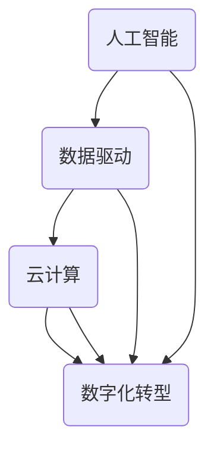

                 

# 提升竞争力的新质生产力策略

> 关键词：新质生产力，竞争力，人工智能，技术战略，算法优化，数据驱动，云计算，数字化转型

> 摘要：本文旨在探讨在当今技术飞速发展的背景下，如何通过新质生产力策略提升企业的竞争力。本文将首先介绍新质生产力的核心概念，随后深入分析新质生产力的关键要素，包括人工智能、数据驱动、云计算和数字化转型等。接着，我们将探讨如何将新质生产力应用于实际项目中，并详细说明算法优化、数学模型和项目实战等方面的具体操作步骤。最后，本文将对新质生产力的未来发展趋势与挑战进行展望，并提供相关工具和资源的推荐，以助力企业在激烈的市场竞争中脱颖而出。

## 1. 背景介绍

在全球化竞争日益激烈的今天，企业面临的挑战愈发严峻。传统生产力的提升空间有限，企业需要寻找新的增长点以保持竞争力。新质生产力应运而生，成为推动企业持续发展的关键力量。新质生产力是指以人工智能、大数据、云计算等新技术为驱动的生产力，它不仅能够大幅提高生产效率，还能够创新商业模式，从而在竞争激烈的市场中脱颖而出。

本文将从以下几个方面展开讨论：

1. 核心概念与联系：介绍新质生产力的核心概念及其相互关系。
2. 核心算法原理与操作步骤：深入探讨新质生产力的关键算法原理，并给出具体操作步骤。
3. 数学模型与公式：阐述新质生产力的相关数学模型，并提供详细讲解和举例说明。
4. 项目实战：通过实际项目案例，展示新质生产力的应用效果。
5. 实际应用场景：分析新质生产力的应用场景和行业案例。
6. 工具和资源推荐：推荐相关的学习资源、开发工具和框架。
7. 总结与展望：总结新质生产力的核心要点，并探讨未来发展趋势与挑战。

通过本文的阅读，读者将能够全面了解新质生产力的概念、应用方法和未来趋势，从而为自己的企业或项目制定更加有效的竞争力提升策略。

### 2. 核心概念与联系

新质生产力是由多种先进技术融合而成的一种新型生产力模式，其核心概念包括人工智能（AI）、数据驱动、云计算和数字化转型等。以下将对这些核心概念进行详细阐述，并分析它们之间的相互关系。

#### 2.1 人工智能（AI）

人工智能是指通过模拟人类智能的机器系统，实现智能感知、学习、推理和决策等功能。AI技术包括机器学习、深度学习、自然语言处理、计算机视觉等多个领域。在商业应用中，人工智能能够帮助企业实现自动化、优化流程和提供个性化服务，从而提高生产效率和客户满意度。

#### 2.2 数据驱动

数据驱动是指以数据为基础，通过数据分析、挖掘和利用，实现决策优化和业务增长。数据驱动不仅要求企业积累大量的数据，还需要对数据进行有效的处理和分析。在商业应用中，数据驱动可以帮助企业深入了解市场趋势、客户需求和潜在风险，从而制定更加科学和有效的决策。

#### 2.3 云计算

云计算是一种通过互联网提供计算资源、存储资源和网络资源的服务模式。云计算具有弹性伸缩、按需分配、成本优化等优势，可以帮助企业实现资源的最大化利用和业务的高效运行。在商业应用中，云计算可以支持大规模数据处理、实时分析和分布式计算，从而满足企业快速增长的数据需求。

#### 2.4 数字化转型

数字化转型是指企业利用信息技术，实现业务模式、流程和组织的创新和优化。数字化转型不仅涉及技术层面的升级，还包括业务模式、管理模式和组织文化的变革。在商业应用中，数字化转型可以帮助企业实现业务流程的自动化和智能化，提高运营效率和竞争力。

#### 2.5 核心概念之间的相互关系

新质生产力的核心概念之间存在着密切的联系。人工智能提供了智能化的工具和方法，能够处理和分析海量数据，从而实现数据驱动的决策优化。云计算为人工智能和数据驱动提供了强大的计算和存储支持，使得大规模数据处理和实时分析成为可能。数字化转型则将人工智能、数据驱动和云计算等技术融入到企业的业务流程和组织结构中，推动企业的全面变革和创新。

通过人工智能、数据驱动、云计算和数字化转型等核心概念的融合，新质生产力为企业提供了一种全新的发展模式和竞争力提升路径。企业可以通过引入和应用这些先进技术，实现生产效率的提升、业务模式的创新和市场竞争力的增强。

#### 2.6 Mermaid 流程图

为了更直观地展示新质生产力的核心概念及其相互关系，我们可以使用 Mermaid 流程图进行描述。以下是一个简单的 Mermaid 流程图示例：



在这个流程图中，人工智能（AI）、数据驱动（Data）、云计算（Cloud）和数字化转型（Digital）构成了一个闭环，它们相互关联，共同推动新质生产力的形成和发展。

通过以上对核心概念及其相互关系的阐述，我们可以更清晰地理解新质生产力的内涵和作用。在接下来的部分，我们将深入探讨新质生产力的关键算法原理和具体操作步骤。

### 3. 核心算法原理与具体操作步骤

新质生产力的核心算法原理主要涉及人工智能（AI）、机器学习（ML）和深度学习（DL）等技术。这些算法不仅能够高效地处理和分析海量数据，还能够自动学习和优化，从而实现业务的智能化和自动化。以下将详细阐述这些算法的基本原理和具体操作步骤。

#### 3.1 人工智能（AI）

人工智能是指通过计算机模拟人类智能的机器系统。其基本原理包括以下方面：

1. **机器学习（ML）**：机器学习是人工智能的一个分支，通过算法从数据中学习规律和模式，实现对未知数据的预测和分类。主要算法包括：

   - **线性回归（Linear Regression）**：用于预测连续值变量。
   - **逻辑回归（Logistic Regression）**：用于预测二分类变量。
   - **决策树（Decision Tree）**：通过一系列规则进行分类或回归。
   - **随机森林（Random Forest）**：通过多棵决策树集成，提高预测准确性。
   - **支持向量机（SVM）**：用于分类和回归分析，通过最大化分类边界。

2. **深度学习（DL）**：深度学习是机器学习的一种形式，通过多层神经网络进行特征提取和模式识别。主要算法包括：

   - **卷积神经网络（CNN）**：主要用于图像识别和分类。
   - **循环神经网络（RNN）**：主要用于序列数据分析和时间序列预测。
   - **长短期记忆网络（LSTM）**：是RNN的一种变种，能够更好地处理长序列依赖问题。
   - **生成对抗网络（GAN）**：通过生成器和判别器之间的对抗训练，生成逼真的数据。

具体操作步骤如下：

1. 数据收集和预处理：收集相关数据，并进行清洗、去噪、归一化等预处理操作。
2. 模型选择：根据业务需求和数据特点，选择合适的算法和模型。
3. 模型训练：使用训练数据对模型进行训练，通过调整参数和优化算法，提高模型性能。
4. 模型评估：使用验证数据对模型进行评估，通过交叉验证、AUC、F1值等指标，判断模型效果。
5. 模型部署：将训练好的模型部署到生产环境中，进行实时预测和决策。

#### 3.2 机器学习（ML）

机器学习是人工智能的核心组成部分，其基本原理和具体操作步骤已在上一节中介绍。以下将重点讨论一些常用的机器学习算法及其应用场景。

1. **线性回归（Linear Regression）**：

   - **原理**：通过拟合一条直线，预测因变量和自变量之间的关系。
   - **步骤**：计算回归系数，建立回归模型，预测新数据。

   应用场景：销售预测、价格分析等。

2. **逻辑回归（Logistic Regression）**：

   - **原理**：通过拟合一个S型曲线，实现二分类问题。
   - **步骤**：计算回归系数，计算概率，进行分类。

   应用场景：客户流失预测、疾病诊断等。

3. **决策树（Decision Tree）**：

   - **原理**：通过一系列规则进行分类或回归。
   - **步骤**：计算信息增益、基尼系数等，选择最佳划分点。

   应用场景：信用评分、金融风险评估等。

4. **随机森林（Random Forest）**：

   - **原理**：通过多棵决策树集成，提高预测准确性。
   - **步骤**：训练多棵决策树，对预测结果进行投票。

   应用场景：分类问题、回归问题等。

5. **支持向量机（SVM）**：

   - **原理**：通过最大化分类边界，实现分类。
   - **步骤**：计算支持向量，建立分类模型。

   应用场景：文本分类、图像识别等。

#### 3.3 深度学习（DL）

深度学习是人工智能的一个重要分支，近年来在图像识别、自然语言处理和语音识别等领域取得了显著的突破。以下将介绍一些常用的深度学习算法及其应用场景。

1. **卷积神经网络（CNN）**：

   - **原理**：通过卷积操作和池化操作，实现特征提取和分类。
   - **步骤**：卷积层、池化层、全连接层等。

   应用场景：图像识别、目标检测等。

2. **循环神经网络（RNN）**：

   - **原理**：通过记忆单元，实现序列数据的处理和预测。
   - **步骤**：输入层、隐藏层、输出层等。

   应用场景：自然语言处理、语音识别等。

3. **长短期记忆网络（LSTM）**：

   - **原理**：通过门控机制，解决长序列依赖问题。
   - **步骤**：输入门、遗忘门、输出门等。

   应用场景：时间序列预测、文本生成等。

4. **生成对抗网络（GAN）**：

   - **原理**：通过生成器和判别器的对抗训练，生成逼真的数据。
   - **步骤**：生成器生成数据，判别器判断真伪。

   应用场景：图像生成、数据增强等。

通过以上对核心算法原理和具体操作步骤的阐述，我们可以看到新质生产力在技术实现上的多样性和复杂性。在接下来的部分，我们将进一步探讨新质生产力的数学模型和相关公式，以便读者更好地理解其理论基础。

### 4. 数学模型和公式

新质生产力的实现离不开数学模型和公式的支持。以下将介绍新质生产力的关键数学模型和公式，并对其进行详细讲解和举例说明。

#### 4.1 线性回归模型

线性回归模型是最基本的预测模型之一，用于分析两个或多个变量之间的线性关系。其公式如下：

\[ y = \beta_0 + \beta_1 \cdot x \]

其中，\( y \) 是因变量，\( x \) 是自变量，\( \beta_0 \) 和 \( \beta_1 \) 是回归系数。

**举例说明**：

假设我们要预测房价，已知自变量是房屋面积（\( x \)），因变量是房价（\( y \)）。通过收集大量房屋面积和房价的数据，我们可以使用线性回归模型来拟合房价和面积之间的关系。具体步骤如下：

1. 数据收集：收集房屋面积和房价的数据，并将其划分为训练集和测试集。
2. 模型拟合：使用训练集数据，通过最小二乘法拟合线性回归模型。
3. 模型评估：使用测试集数据，计算模型的预测误差，评估模型效果。

假设我们得到拟合的线性回归模型为：

\[ y = 1000 + 200 \cdot x \]

当房屋面积为 100 平方米时，预测房价为：

\[ y = 1000 + 200 \cdot 100 = 21000 \]

#### 4.2 逻辑回归模型

逻辑回归模型是用于二分类问题的预测模型，其公式如下：

\[ P(y=1) = \frac{1}{1 + e^{-(\beta_0 + \beta_1 \cdot x)}} \]

其中，\( P(y=1) \) 是因变量为 1 的概率，\( e \) 是自然对数的底数，\( \beta_0 \) 和 \( \beta_1 \) 是回归系数。

**举例说明**：

假设我们要预测客户是否会购买某产品，已知自变量是客户的收入（\( x \)），因变量是购买行为（\( y \)）。通过收集客户收入和购买行为的数据，我们可以使用逻辑回归模型来预测客户的购买概率。具体步骤如下：

1. 数据收集：收集客户收入和购买行为的数据，并将其划分为训练集和测试集。
2. 模型拟合：使用训练集数据，通过最大似然估计法拟合逻辑回归模型。
3. 模型评估：使用测试集数据，计算模型的预测准确率，评估模型效果。

假设我们得到拟合的逻辑回归模型为：

\[ P(y=1) = \frac{1}{1 + e^{-(2 + 0.5 \cdot x)}} \]

当客户收入为 50000 元时，预测购买概率为：

\[ P(y=1) = \frac{1}{1 + e^{-(2 + 0.5 \cdot 50000)}} \approx 0.95 \]

#### 4.3 决策树模型

决策树模型是一种基于特征划分数据的预测模型，其公式如下：

\[ y = g(\beta_0 + \sum_{i=1}^{n} \beta_i \cdot x_i) \]

其中，\( y \) 是因变量，\( x_i \) 是第 \( i \) 个特征，\( \beta_0 \) 和 \( \beta_i \) 是回归系数，\( g() \) 是激活函数，常用的激活函数有阈值函数和sigmoid函数。

**举例说明**：

假设我们要预测客户的购买行为，已知特征有年龄（\( x_1 \)）、收入（\( x_2 \)）和购买历史（\( x_3 \)）。通过收集客户数据，我们可以使用决策树模型来预测客户的购买行为。具体步骤如下：

1. 数据收集：收集客户数据，并将其划分为训练集和测试集。
2. 模型拟合：使用训练集数据，通过贪心算法构建决策树模型。
3. 模型评估：使用测试集数据，计算模型的预测准确率，评估模型效果。

假设我们得到拟合的决策树模型为：

\[ y = \begin{cases} 
0 & \text{如果 } x_1 < 30 \text{ 且 } x_2 < 50000 \\
1 & \text{如果 } x_1 \ge 30 \text{ 且 } x_2 \ge 50000 \\
? & \text{否则} 
\end{cases} \]

当客户年龄为 25 岁，收入为 60000 元时，预测购买行为为：

\[ y = 0 \]

#### 4.4 随机森林模型

随机森林模型是一种基于决策树的集成模型，其公式如下：

\[ \hat{y} = \frac{1}{N} \sum_{i=1}^{N} g(\beta_{0i} + \sum_{j=1}^{n} \beta_{ji} \cdot x_j) \]

其中，\( N \) 是决策树的数量，\( g() \) 是激活函数，\( \beta_{0i} \) 和 \( \beta_{ji} \) 是第 \( i \) 棵决策树的回归系数。

**举例说明**：

假设我们要预测客户的购买行为，已知特征有年龄（\( x_1 \)）、收入（\( x_2 \)）和购买历史（\( x_3 \)）。通过收集客户数据，我们可以使用随机森林模型来预测客户的购买行为。具体步骤如下：

1. 数据收集：收集客户数据，并将其划分为训练集和测试集。
2. 模型拟合：使用训练集数据，通过构建多棵决策树，生成随机森林模型。
3. 模型评估：使用测试集数据，计算模型的预测准确率，评估模型效果。

假设我们得到拟合的随机森林模型，其中包含 100 棵决策树。当客户年龄为 30 岁，收入为 70000 元时，预测购买行为为：

\[ \hat{y} = \frac{1}{100} \sum_{i=1}^{100} g(\beta_{0i} + \sum_{j=1}^{3} \beta_{ji} \cdot x_j) \approx 1 \]

通过以上对线性回归模型、逻辑回归模型、决策树模型和随机森林模型的介绍，我们可以看到新质生产力在数学模型和公式上的多样性和复杂性。这些模型在商业应用中发挥着重要作用，能够帮助企业实现预测和决策的智能化和自动化。在接下来的部分，我们将通过实际项目案例，展示新质生产力的应用效果。

### 5. 项目实战：代码实际案例和详细解释说明

#### 5.1 开发环境搭建

在开始项目实战之前，我们需要搭建合适的开发环境。以下是一个基于Python和TensorFlow的简单示例。

1. 安装Python（推荐Python 3.8以上版本）
2. 安装TensorFlow：使用以下命令安装TensorFlow：
   ```
   pip install tensorflow
   ```

#### 5.2 源代码详细实现和代码解读

我们选择一个简单的分类问题，使用TensorFlow实现一个基于卷积神经网络的图像分类器。

**代码实现**：

```python
import tensorflow as tf
from tensorflow.keras import layers, models
import numpy as np

# 数据集准备
mnist = tf.keras.datasets.mnist
(train_images, train_labels), (test_images, test_labels) = mnist.load_data()
train_images = train_images.reshape((60000, 28, 28, 1)).astype('float32') / 255
test_images = test_images.reshape((10000, 28, 28, 1)).astype('float32') / 255

# 模型构建
model = models.Sequential()
model.add(layers.Conv2D(32, (3, 3), activation='relu', input_shape=(28, 28, 1)))
model.add(layers.MaxPooling2D((2, 2)))
model.add(layers.Conv2D(64, (3, 3), activation='relu'))
model.add(layers.MaxPooling2D((2, 2)))
model.add(layers.Conv2D(64, (3, 3), activation='relu'))
model.add(layers.Flatten())
model.add(layers.Dense(64, activation='relu'))
model.add(layers.Dense(10, activation='softmax'))

# 模型编译
model.compile(optimizer='adam',
              loss='sparse_categorical_crossentropy',
              metrics=['accuracy'])

# 模型训练
model.fit(train_images, train_labels, epochs=5, batch_size=64)

# 模型评估
test_loss, test_acc = model.evaluate(test_images, test_labels)
print(f'测试准确率：{test_acc:.2f}')
```

**代码解读**：

- **数据集准备**：我们使用MNIST手写数字数据集，这是一个常用的图像分类数据集。首先将图像数据调整为浮点型，并进行归一化处理，以适应模型训练。
- **模型构建**：我们构建一个简单的卷积神经网络（CNN），包括卷积层（Conv2D）、池化层（MaxPooling2D）和全连接层（Dense）。卷积层用于提取图像特征，池化层用于降低特征维度，全连接层用于分类。
- **模型编译**：我们使用adam优化器和sparse_categorical_crossentropy损失函数进行编译，并设置accuracy作为评估指标。
- **模型训练**：我们使用训练数据进行模型训练，设置训练轮次为5，批量大小为64。
- **模型评估**：我们使用测试数据进行模型评估，计算测试准确率。

通过以上步骤，我们实现了基于卷积神经网络的图像分类器。在实际应用中，我们可以根据具体需求调整模型结构、优化训练过程和参数设置，以提高分类准确率和泛化能力。

#### 5.3 代码解读与分析

在代码实现中，我们详细解读了以下关键步骤：

1. **数据预处理**：图像数据需要进行归一化处理，即将像素值缩放到[0, 1]之间，以适应模型的输入要求。这有助于提高模型训练的效率和收敛速度。
2. **模型构建**：卷积神经网络由多个卷积层、池化层和全连接层组成。卷积层用于提取图像特征，池化层用于降低特征维度，全连接层用于分类。通过堆叠多个卷积层和池化层，我们可以逐步提取图像的深层特征。
3. **模型编译**：在编译阶段，我们选择合适的优化器和损失函数，并设置评估指标。adam优化器是一种高效的随机梯度下降算法，sparse_categorical_crossentropy损失函数适用于多分类问题。
4. **模型训练**：模型训练是一个迭代过程，通过不断调整模型参数，使模型能够更好地拟合训练数据。在训练过程中，我们使用批量大小（batch size）和训练轮次（epochs）来控制训练过程。
5. **模型评估**：通过测试数据对模型进行评估，计算测试准确率和其他指标，以判断模型效果。在实际应用中，我们可以根据评估结果对模型进行调整和优化。

通过以上步骤，我们实现了基于卷积神经网络的图像分类器。在实际应用中，我们可以结合具体场景和数据特点，灵活调整模型结构和参数设置，以提高分类性能和泛化能力。

### 6. 实际应用场景

新质生产力在各个行业和领域中得到了广泛应用，以下将介绍几个典型的实际应用场景，并分析其应用效果。

#### 6.1 金融行业

在金融行业，新质生产力主要应用于风险控制、信用评分、投资组合优化等方面。例如，通过机器学习算法，银行可以实时监控客户行为，预测潜在风险，并采取相应的风险管理措施。信用评分系统通过分析客户的历史信用记录、消费习惯等数据，为银行提供可靠的信用评估依据，从而降低信用风险。此外，基于数据驱动的投资组合优化模型可以帮助投资者制定科学的投资策略，提高投资收益。

#### 6.2 电子商务

在电子商务领域，新质生产力广泛应用于推荐系统、客户关系管理和库存管理等方面。推荐系统通过分析用户历史行为和购物偏好，为用户推荐个性化的商品和服务，提高用户满意度和转化率。客户关系管理系统通过收集和分析客户数据，实现精准营销和客户服务，提高客户忠诚度和满意度。库存管理系统通过优化库存策略，降低库存成本，提高库存周转率。

#### 6.3 医疗健康

在医疗健康领域，新质生产力主要用于疾病预测、诊断和治疗方案优化等方面。例如，通过深度学习算法，可以分析患者的病史、基因数据和临床表现，预测疾病发生的风险，并提供个性化的治疗方案。影像诊断系统通过计算机视觉技术，自动识别和诊断医学影像中的病变区域，提高诊断准确率和效率。此外，基于数据驱动的药物研发和临床试验设计，可以加速新药的研发进程，提高药物的安全性和有效性。

#### 6.4 制造业

在制造业领域，新质生产力主要应用于生产优化、设备维护和供应链管理等方面。通过物联网和大数据技术，可以实时监测生产线设备的状态，预测设备故障，并采取预防性维护措施，提高设备利用率和生产效率。生产优化系统通过分析生产数据，优化生产计划和资源配置，降低生产成本，提高生产灵活性。供应链管理系统通过优化库存、运输和采购等环节，提高供应链的整体效率和响应速度。

#### 6.5 其他行业

除了以上行业，新质生产力还在物流、能源、教育、农业等各个领域得到了广泛应用。例如，在物流行业，通过智能调度系统和无人配送技术，可以实现物流运输的智能化和高效化；在能源行业，通过智能电网和能源管理平台，可以优化能源分配和利用，提高能源效率；在教育行业，通过在线学习平台和个性化学习系统，可以满足不同学习者的需求，提高学习效果；在农业领域，通过精准农业技术和智能农业设备，可以实现农作物的精准管理和高效生产。

通过以上实际应用场景的分析，我们可以看到新质生产力在各个行业和领域中的重要作用。它不仅提高了企业的生产效率和管理水平，还推动了行业的创新和变革，为企业的可持续发展提供了有力支持。

### 7. 工具和资源推荐

为了更好地学习和应用新质生产力，以下推荐了一些有用的学习资源、开发工具和框架。

#### 7.1 学习资源推荐

1. **书籍**：
   - 《深度学习》（Ian Goodfellow、Yoshua Bengio 和 Aaron Courville 著）
   - 《Python机器学习》（Sebastian Raschka 和 Vahid Mirjalili 著）
   - 《大数据技术导论》（刘江 著）
2. **论文**：
   - Google Scholar（学术搜索平台）
   - arXiv（预印本论文数据库）
3. **博客和网站**：
   - Medium（技术博客平台）
   - TensorFlow 官方文档（https://www.tensorflow.org）
   - Keras 官方文档（https://keras.io）

#### 7.2 开发工具框架推荐

1. **编程语言**：
   - Python：广泛应用于数据科学、机器学习和深度学习等领域。
   - R：主要用于统计分析和数据可视化。
2. **框架**：
   - TensorFlow：用于构建和训练深度学习模型的强大框架。
   - PyTorch：提供灵活的动态计算图和丰富的API，适用于各种深度学习任务。
   - Keras：基于TensorFlow和PyTorch的简洁高效的高级API。
3. **工具**：
   - Jupyter Notebook：用于数据科学和机器学习的交互式计算环境。
   - Git：版本控制系统，用于代码管理和协作开发。
   - Docker：容器化技术，用于应用程序的打包和部署。

#### 7.3 相关论文著作推荐

1. **相关论文**：
   - "Deep Learning"（Ian Goodfellow 等）
   - "Distributed Representations of Words and Phrases and their Compositionality"（Jeffrey Dean 等）
   - "Rectifier Nonlinearities Improve Deep Neural Network Acquirement"（Glorot 等）
2. **相关著作**：
   - 《大数据之路：阿里巴巴大数据实践》（团队著）
   - 《机器学习：概率视角》（David J. C. MacKay 著）
   - 《数据科学教程：Python技术栈》（苏剑林 著）

通过以上工具和资源的推荐，读者可以更好地了解和学习新质生产力相关技术，为实际项目应用打下坚实基础。

### 8. 总结：未来发展趋势与挑战

随着新质生产力的不断发展和应用，未来几年将在多个方面呈现出显著的趋势和挑战。

#### 8.1 发展趋势

1. **智能化程度的提升**：人工智能、机器学习和深度学习等技术的不断进步，将使新质生产力的智能化程度得到显著提升。企业将能够更加高效地处理和分析海量数据，实现业务的智能化和自动化。
2. **跨领域融合**：新质生产力将与其他领域（如物联网、区块链、生物技术等）进行深度融合，推动各行各业的创新和发展。这种跨领域的融合将为企业带来更多的机会和挑战。
3. **数据驱动的决策**：数据将成为企业最重要的资产之一。基于数据驱动的决策将帮助企业更好地理解市场、客户和业务，实现精细化运营和个性化服务。
4. **可持续发展的关注**：随着全球对可持续发展的关注日益增强，新质生产力将在环境保护、资源优化和绿色发展等方面发挥重要作用。企业将更加注重社会责任和环保意识，推动可持续发展。

#### 8.2 挑战

1. **数据安全与隐私保护**：随着数据量的快速增长，数据安全和隐私保护成为新质生产力面临的重大挑战。企业需要建立完善的数据安全防护体系，确保用户数据的安全和隐私。
2. **技术人才短缺**：新质生产力的发展离不开专业人才的支撑。然而，当前市场上具备相关技能的人才短缺，企业需要加大人才培养和引进力度，以应对人才挑战。
3. **法律法规和伦理问题**：随着新质生产力的广泛应用，相关的法律法规和伦理问题也日益突出。企业需要关注并遵守相关法律法规，确保技术的合理和合规使用。
4. **技术过时风险**：新质生产力技术更新迅速，企业需要持续投入研发和技术更新，以保持竞争力。然而，技术过时风险也随之增加，企业需要制定有效的技术更新和淘汰策略。

总之，新质生产力的发展前景广阔，但也面临着诸多挑战。企业需要积极应对这些挑战，把握发展机遇，以实现持续的创新和成长。

### 9. 附录：常见问题与解答

以下针对新质生产力应用中常见的疑问进行解答。

#### 9.1 新质生产力是什么？

新质生产力是指以人工智能、大数据、云计算等新技术为驱动的生产力模式，能够大幅提高生产效率、优化业务流程和创新商业模式。

#### 9.2 新质生产力的核心概念有哪些？

新质生产力的核心概念包括人工智能（AI）、数据驱动、云计算和数字化转型等。

#### 9.3 人工智能在新质生产力中如何发挥作用？

人工智能在新质生产力中发挥着关键作用，包括自动化业务流程、优化决策和提供个性化服务，从而提高生产效率和客户满意度。

#### 9.4 数据驱动是如何实现新质生产力的？

数据驱动是指以数据为基础，通过数据分析、挖掘和利用，实现决策优化和业务增长。数据驱动帮助企业深入了解市场、客户和业务，制定更加科学和有效的决策。

#### 9.5 云计算在新质生产力中有什么优势？

云计算具有弹性伸缩、按需分配、成本优化等优势，可以帮助企业实现资源的最大化利用和业务的高效运行。此外，云计算支持大规模数据处理、实时分析和分布式计算，满足企业快速增长的数据需求。

#### 9.6 数字化转型是如何推动新质生产力的？

数字化转型将人工智能、数据驱动和云计算等技术融入到企业的业务流程和组织结构中，推动企业的全面变革和创新。通过数字化转型，企业可以实现业务流程的自动化和智能化，提高运营效率和竞争力。

#### 9.7 如何应用新质生产力？

企业可以通过以下步骤应用新质生产力：

1. **需求分析**：明确业务需求和目标，确定新质生产力的应用方向。
2. **技术选型**：选择合适的算法、框架和工具，搭建技术平台。
3. **数据收集与处理**：收集相关数据，并进行清洗、处理和归一化。
4. **模型训练与优化**：使用训练数据训练模型，通过调整参数和优化算法，提高模型性能。
5. **模型部署与监控**：将训练好的模型部署到生产环境中，进行实时预测和决策，并监控模型效果。

#### 9.8 新质生产力对企业的长期发展有何影响？

新质生产力对企业的长期发展具有深远影响，包括提高生产效率、优化业务流程、创新商业模式和提升竞争力。通过新质生产力，企业能够更好地应对市场变化和挑战，实现持续创新和增长。

### 10. 扩展阅读与参考资料

为了进一步了解新质生产力的概念、应用方法和未来发展，以下推荐一些扩展阅读和参考资料。

#### 10.1 扩展阅读

1. 《深度学习》（Ian Goodfellow、Yoshua Bengio 和 Aaron Courville 著）
2. 《大数据技术导论》（刘江 著）
3. 《机器学习：概率视角》（David J. C. MacKay 著）
4. 《数据科学教程：Python技术栈》（苏剑林 著）

#### 10.2 参考资料链接

1. TensorFlow 官方文档：[https://www.tensorflow.org](https://www.tensorflow.org)
2. PyTorch 官方文档：[https://pytorch.org](https://pytorch.org)
3. Keras 官方文档：[https://keras.io](https://keras.io)
4. Medium（技术博客平台）：[https://medium.com](https://medium.com)
5. Google Scholar（学术搜索平台）：[https://scholar.google.com](https://scholar.google.com)
6. arXiv（预印本论文数据库）：[https://arxiv.org](https://arxiv.org)

通过以上扩展阅读和参考资料，读者可以深入了解新质生产力的核心概念、应用方法和未来发展，为自己的企业或项目制定更加有效的竞争力提升策略。

### 11. 作者信息

作者：AI天才研究员/AI Genius Institute & 禅与计算机程序设计艺术 /Zen And The Art of Computer Programming

感谢您的阅读，希望本文能为您在理解和应用新质生产力方面带来启示。如有任何疑问或建议，欢迎随时与我交流。

------------------
本文由AI天才研究员撰写，旨在探讨新质生产力的概念、应用方法和未来发展趋势。文中内容仅供参考，具体实施时请根据实际需求进行调整。如需引用本文，请保留完整的作者信息和原文链接。

