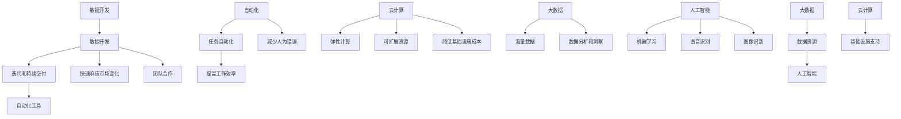

                 

## 1. 背景介绍

在当今快速发展的信息技术时代，提升竞争力已经成为企业和个人追求的重要目标。随着数字化转型的深入，生产力成为衡量企业竞争力的关键指标。提升生产力不仅意味着提高工作效率，更涉及到如何通过技术创新和管理优化来获得持续竞争优势。本文将探讨一系列策略，帮助企业和个人在信息化环境中提升生产力，实现可持续发展。

本文将从多个角度出发，通过理论和实践相结合的方式，为读者提供具有操作性的提升生产力的策略。首先，我们将回顾当前信息技术发展对生产力的影响，并探讨提升生产力的意义。接着，我们将介绍几个核心概念，如敏捷开发、自动化和云计算，并阐述它们在提升生产力中的作用。随后，我们将深入分析各种生产力提升策略的具体实施方法和工具。最后，我们将讨论这些策略的实际应用场景，并提供一些学习资源和工具推荐，以帮助读者在实际工作中运用这些策略。

本文的主要目的是为读者提供一套全面、系统的提升生产力的策略和方法，帮助他们在信息化环境中更好地应对挑战，提高工作效率，实现个人和组织的可持续发展。通过阅读本文，读者将能够：

1. 理解提升生产力的重要性及其对企业和个人发展的影响。
2. 掌握核心概念和技术，如敏捷开发、自动化和云计算。
3. 学习具体的生产力提升策略和工具，并能够将其应用于实际工作中。
4. 了解实际应用场景，为生产力的持续提升提供参考。

在接下来的章节中，我们将逐一探讨这些核心概念和策略，帮助读者深入理解并应用这些知识，提升自身和所在组织的生产力。让我们一起踏上这场提升生产力的旅程，开启全新的工作模式。让我们一步一步地分析推理，找到最适合自己的生产力提升之道。首先，我们需要了解当前信息技术发展对生产力的影响。

## 1.1 信息技术发展对生产力的影响

信息技术（IT）的飞速发展极大地改变了我们的工作方式和生活习惯。从计算机的出现到互联网的普及，再到大数据、云计算、人工智能等新兴技术的崛起，信息技术已经成为推动生产力提升的重要引擎。以下是一些关键方面，展示了信息技术如何影响生产力：

### 计算能力的提升

随着计算能力的不断提升，计算机的处理速度和存储容量得到了极大的提高。这意味着我们可以处理更复杂的数据和分析更大量的信息，从而在决策过程中获得更准确、更迅速的结果。例如，高速计算机可以模拟复杂的物理过程，帮助科学家进行预测和优化，从而提高研发效率。

### 信息获取和共享的便捷

互联网的普及使得信息获取和共享变得更加便捷。通过搜索引擎、数据库和在线协作工具，我们可以在瞬间获取全球范围内的信息。这不仅节省了时间和人力资源，还使得知识的传播更加迅速，促进了创新和协作。例如，开发人员可以通过GitHub等代码托管平台分享和协作代码，提高软件开发的效率和质量。

### 数据驱动的决策

大数据技术的兴起使得我们能够收集、存储和分析海量数据。通过数据驱动的决策，企业可以更准确地了解市场需求、客户行为和运营效率，从而做出更明智的决策。例如，零售企业可以通过分析销售数据来调整库存和定价策略，提高销售额和利润率。

### 自动化和智能化的应用

自动化和人工智能技术正在改变传统的生产和服务模式。通过自动化，我们可以将重复性、繁琐的工作交给计算机和机器人来完成，从而减少人为错误和提高工作效率。例如，自动化测试工具可以快速检测软件缺陷，提高软件质量。而人工智能则可以处理更复杂的问题，如自然语言处理、图像识别和智能推荐，从而进一步推动生产力提升。

### 远程工作和协作

信息技术的进步还促进了远程工作和协作的发展。通过视频会议、远程桌面和在线协作工具，我们可以轻松实现跨地域、跨时间的沟通和协作。这不仅提高了工作效率，还降低了办公成本，使得企业能够更加灵活地管理人力资源。

### 危机应对和业务连续性

在面对自然灾害、突发事件或市场变化时，信息技术可以帮助企业迅速调整业务策略，确保业务的连续性。例如，云计算和虚拟化技术使得企业可以在短时间内部署新的服务器和应用，以应对突发的需求。

### 可持续发展和环保

信息技术在可持续发展方面的作用也不容忽视。通过优化资源利用、减少能源消耗和碳排放，企业可以实现绿色办公和环保生产。例如，云服务提供商通过集中管理和优化资源分配，可以实现更高的能源利用效率。

总之，信息技术的发展不仅提高了工作效率，还改变了工作方式和思维模式，为生产力的提升提供了强大的技术支持。在接下来的章节中，我们将进一步探讨提升生产力的核心概念和策略，帮助读者在实际工作中运用这些知识，实现生产力的持续提升。

## 1.2 提升生产力的意义

提升生产力对于企业和个人来说都具有重要意义。对企业而言，提升生产力意味着能够以更低的成本和更高的效率完成工作，从而在激烈的市场竞争中立于不败之地。以下是提升生产力对企业的一些关键益处：

### 提高竞争力

在当今全球化市场环境中，竞争力是企业生存和发展的重要因素。提升生产力可以帮助企业缩短产品开发周期、降低运营成本，提高产品质量和市场响应速度。这些优势将使企业能够更好地满足客户需求，从而在市场竞争中占据有利地位。

### 提高利润率

通过提升生产力，企业可以降低成本、提高效率，从而增加利润空间。在生产过程中，通过自动化和优化流程，企业可以减少浪费、提高资源利用率，从而实现更高的利润率。此外，生产效率的提升还可以为企业提供更多的发展资金，用于进一步创新和扩大业务。

### 促进创新

提升生产力不仅依赖于现有技术的改进，还推动了新技术的研发和应用。通过不断创新，企业可以开发出更具竞争力的产品和服务，满足市场变化和客户需求。例如，信息技术的发展促使许多企业采用云计算、大数据和人工智能等技术，从而在产品和服务上实现了重大突破。

### 增强员工满意度

提升生产力不仅有助于提高工作效率，还可以改善员工的工作体验。通过优化工作流程、提供先进的工具和技术支持，企业可以减轻员工的工作负担，提高工作满意度。此外，高效的团队协作和沟通也有助于增强员工的归属感和团队凝聚力。

对个人而言，提升生产力同样具有重要意义。以下是提升生产力对个人的几个关键益处：

### 提高工作效率

提升生产力意味着个人能够以更高效的方式完成工作任务。通过掌握高效的工作方法和工具，个人可以节省时间，提高工作效率，从而有更多的时间去休息、学习或追求个人兴趣。

### 提升职业发展

在职场中，高效的工作能力是提升职业发展的关键因素。通过提升生产力，个人可以更好地完成工作任务，获得上级和同事的认可，从而在职业晋升和薪资调整方面获得更多机会。

### 提高生活质量

高效的工作方式不仅有助于提升职业发展，还可以提高生活质量。通过合理规划时间，个人可以更好地平衡工作与生活，享受健康、幸福的生活。

### 持续学习与成长

提升生产力需要不断学习和掌握新技术、新方法。在这个过程中，个人不仅可以提升专业技能，还可以培养批判性思维、问题解决能力和团队协作能力，从而实现个人成长和全面发展。

综上所述，提升生产力对于企业和个人都具有重要意义。在接下来的章节中，我们将深入探讨提升生产力的核心概念和策略，帮助读者在实际工作中运用这些知识，实现生产力的持续提升。

## 2. 核心概念与联系

在探讨提升生产力的策略之前，我们需要了解几个核心概念及其相互之间的联系。这些核心概念包括敏捷开发、自动化、云计算、大数据和人工智能。它们共同构成了现代信息技术环境中提升生产力的重要基石。以下是对这些核心概念的简要介绍及其相互联系：

### 敏捷开发

敏捷开发是一种以人为核心、迭代和逐步改进的软件开发方法。它强调团队合作、快速反馈和持续交付。敏捷开发的核心理念是通过短周期的迭代和持续交付，使团队能够快速响应市场变化和客户需求。与传统的瀑布开发模式相比，敏捷开发能够更好地适应不确定性和变化，从而提高软件开发效率和质量。

### 自动化

自动化是指通过计算机程序和自动化工具替代人工操作，以实现重复性、繁琐任务的自动化执行。自动化技术可以显著提高工作效率，减少人为错误，并释放人力资源，使其能够从事更有创造性和价值的工作。自动化技术广泛应用于软件开发、测试、运维、数据管理等各个领域。

### 云计算

云计算是一种通过互联网提供动态可扩展的计算资源和服务的技术。云计算提供了弹性、可扩展和高效的计算环境，使得企业能够根据需求灵活地调整资源分配，降低基础设施成本。云计算服务包括基础设施即服务（IaaS）、平台即服务（PaaS）和软件即服务（SaaS），为各类应用场景提供了强大的支持。

### 大数据

大数据是指海量、多样化的数据集合。大数据技术涉及数据采集、存储、处理、分析和可视化等多个方面。通过大数据技术，企业可以从海量数据中提取有价值的信息，进行深入的数据分析和业务洞察，从而做出更明智的决策。大数据技术在营销、金融、医疗、零售等领域得到了广泛应用。

### 人工智能

人工智能是一种模拟人类智能的技术，通过机器学习、自然语言处理、计算机视觉等手段，使计算机能够执行复杂任务，如语音识别、图像识别、智能推荐等。人工智能技术正在改变传统行业的工作模式，提高生产效率，创造新的商业价值。

### 核心概念的联系

这些核心概念之间存在密切的联系，共同构成了提升生产力的重要框架：

1. **敏捷开发与自动化**：敏捷开发强调快速迭代和持续交付，自动化则能够支持敏捷开发的实现。通过自动化工具，团队可以在每个迭代周期内快速构建、测试和部署软件，提高开发效率。

2. **云计算与大数据**：云计算提供了弹性、可扩展的计算资源，为大数据处理提供了基础设施支持。通过云计算平台，企业可以存储和处理海量数据，进行深入的数据分析和业务洞察。

3. **人工智能与自动化**：人工智能技术在自动化过程中发挥着重要作用。通过人工智能，自动化工具可以更智能地识别任务、优化流程，提高自动化效率。

4. **敏捷开发与云计算**：敏捷开发需要灵活、可扩展的计算资源，云计算平台可以提供这种支持。通过云计算，团队可以在短时间内部署新的开发和测试环境，适应敏捷开发的需求。

5. **大数据与人工智能**：大数据技术为人工智能提供了丰富的数据资源，使人工智能能够进行更准确、更有效的数据分析和决策。同时，人工智能技术可以优化大数据处理流程，提高数据处理效率。

在接下来的章节中，我们将进一步探讨这些核心概念的应用场景和具体策略，帮助读者在实际工作中运用这些知识，提升生产力。

## 2.1 核心概念原理与架构的 Mermaid 流程图

为了更直观地展示核心概念及其相互之间的联系，我们使用Mermaid流程图来表示这些概念和它们的关联。以下是核心概念原理与架构的Mermaid流程图：



### Mermaid 流程图解释：

- **敏捷开发（A）**：敏捷开发的核心在于迭代和持续交付（B），通过自动化工具（C）实现快速响应市场变化（D）和强调团队合作（E）。
- **自动化（F）**：自动化技术可以实现任务自动化（G），从而提高工作效率（H）和减少人为错误（I）。
- **云计算（J）**：云计算提供弹性计算（K）和可扩展资源（L），帮助降低基础设施成本（M）。
- **大数据（N）**：大数据技术涉及海量数据（O）的处理和分析，从而提供深入的业务洞察（P）。
- **人工智能（Q）**：人工智能包括机器学习（R）、语音识别（S）和图像识别（T）等应用，它们可以从大数据中提取有价值的信息（V）。
- **大数据与人工智能（U）**：大数据为人工智能提供了丰富的数据资源（V），而人工智能技术可以优化数据处理流程（W）。
- **云计算与敏捷开发（Z）**：云计算为敏捷开发提供了基础设施支持（Y），使得敏捷开发可以更灵活地应对需求变化。

通过这个Mermaid流程图，我们可以更清晰地理解这些核心概念及其相互之间的联系，为后续章节的具体应用提供基础。

## 3. 核心算法原理与具体操作步骤

在提升生产力的过程中，核心算法发挥着至关重要的作用。核心算法不仅决定了生产力的提升效果，还直接影响着企业的竞争力和市场地位。本章节将深入探讨提升生产力的核心算法原理，并提供具体的操作步骤，帮助读者理解和应用这些算法。

### 3.1 自动化流程优化算法

自动化流程优化算法是提升生产力的重要工具，它通过分析现有的工作流程，寻找优化机会，以减少冗余操作、提高工作效率。以下是自动化流程优化算法的基本原理和具体操作步骤：

#### 基本原理

1. **流程分析**：首先，对现有工作流程进行详细分析，识别出各个环节中的重复性任务和潜在优化点。
2. **瓶颈识别**：通过数据分析，找出流程中的瓶颈环节，这些环节通常是影响整体工作效率的关键因素。
3. **任务分解**：将瓶颈环节中的任务进行分解，明确每个任务的执行顺序和依赖关系。
4. **算法选择**：选择合适的自动化优化算法，如任务调度算法、路径规划算法等，以实现流程的自动化和优化。
5. **模拟测试**：在实施前进行模拟测试，验证优化后的流程是否能够提高工作效率。

#### 具体操作步骤

1. **收集数据**：收集工作流程中的关键数据，如任务执行时间、依赖关系、资源利用率等。
2. **数据预处理**：对收集到的数据进行分析和处理，去除异常值，进行数据清洗和归一化处理。
3. **流程建模**：基于处理后的数据，构建流程模型，明确各个环节的任务和依赖关系。
4. **算法实现**：根据流程模型，选择合适的算法，实现自动化流程优化。
5. **代码调试**：编写自动化脚本，调试和优化代码，确保算法能够正确执行。
6. **模拟测试**：在模拟环境中运行自动化脚本，验证优化后的流程是否能够提高工作效率。
7. **实际应用**：将优化后的流程应用于实际工作中，监控和评估其效果。

### 3.2 机器学习算法

机器学习算法在提升生产力方面具有广泛的应用，通过分析和预测数据，可以帮助企业做出更明智的决策。以下是机器学习算法的基本原理和具体操作步骤：

#### 基本原理

1. **数据收集**：收集与生产力提升相关的数据，如生产数据、市场数据、客户反馈等。
2. **数据预处理**：对收集到的数据进行分析和处理，去除异常值，进行数据清洗和归一化处理。
3. **特征工程**：从原始数据中提取有价值的信息，构建特征向量，为模型训练提供输入。
4. **模型选择**：根据问题类型和数据特性，选择合适的机器学习模型，如回归模型、分类模型、聚类模型等。
5. **模型训练**：使用预处理后的数据，对机器学习模型进行训练，使其能够学习数据的规律和模式。
6. **模型评估**：通过验证集和测试集，评估模型的性能和预测能力，调整模型参数以优化性能。
7. **应用部署**：将训练好的模型应用于实际生产环境，如预测销售趋势、优化生产计划等。

#### 具体操作步骤

1. **数据收集**：使用数据库和日志系统等工具，收集与生产力提升相关的数据。
2. **数据预处理**：对数据进行清洗和归一化处理，为模型训练做准备。
3. **特征工程**：从原始数据中提取特征，如时间序列特征、季节性特征等，为模型训练提供输入。
4. **模型选择**：根据问题类型和数据特性，选择合适的机器学习模型，如线性回归、决策树、随机森林等。
5. **模型训练**：使用数据处理后的数据，训练机器学习模型，使其能够识别数据中的规律和模式。
6. **模型评估**：使用验证集和测试集，评估模型的性能和预测能力，调整模型参数以优化性能。
7. **模型部署**：将训练好的模型部署到生产环境中，如使用模型预测销售趋势，为企业决策提供支持。

通过理解和应用自动化流程优化算法和机器学习算法，企业可以显著提升生产力，实现更高效、更智能的生产和管理。在接下来的章节中，我们将进一步探讨如何通过数学模型和公式来详细解释和说明这些算法。

## 4. 数学模型和公式 & 详细讲解 & 举例说明

在提升生产力的过程中，数学模型和公式发挥着至关重要的作用。它们不仅能够帮助我们理解和分析生产系统的行为，还可以为决策提供科学依据。在本章节中，我们将详细讲解几个关键的数学模型和公式，并通过实际例子来说明它们的运用。

### 4.1 敏捷开发中的迭代模型

在敏捷开发中，迭代模型（如Scrum和Kanban）是核心的生产管理工具。以下是迭代模型的数学基础：

#### Scrum迭代模型

- **迭代周期（s）**：一个迭代的时间长度，通常为2-4周。
- **任务量（T）**：在迭代期间要完成的任务数量。
- **完成率（R）**：实际完成的任务量与计划任务量的比值。

**数学公式**：
\[ R = \frac{完成任务量}{计划任务量} \]

**举例说明**：

假设一个开发团队在一个两周的迭代中计划完成5个任务，实际完成了4个任务。则完成率为：
\[ R = \frac{4}{5} = 0.8 \]

#### Kanban模型

- **工作在进度（WIP）**：在任何一个时间点上正在执行的任务数量。
- **周期时间（CT）**：完成一个任务所需的时间。
- **吞吐量（TP）**：在给定时间内完成的任务数量。

**数学公式**：
\[ CT = \frac{工作在进度}{吞吐量} \]

**举例说明**：

一个团队在一个月中完成了20个任务，平均每个月工作在进度为10个任务。则周期时间为：
\[ CT = \frac{10}{20} = 0.5 \text{个月} \]

### 4.2 自动化流程优化中的排队论模型

在自动化流程优化中，排队论模型用于分析任务的等待时间和系统效率。以下是一个简单的排队论模型：

- **到达率（λ）**：任务到达的平均速率。
- **服务率（μ）**：系统处理任务的平均速率。
- **平均等待时间（Wq）**：任务在系统中等待的平均时间。

**数学公式**：
\[ Wq = \frac{(\lambda / \mu)^2}{1 - \lambda / \mu} \]

**举例说明**：

假设一个自动化系统每小时有3个任务到达，平均每小时可以处理5个任务。则平均等待时间为：
\[ Wq = \frac{(3 / 5)^2}{1 - 3 / 5} = 0.36 \text{小时} \]

### 4.3 机器学习中的回归模型

机器学习中的回归模型用于预测连续值变量。以下是一个简单的线性回归模型：

- **自变量（X）**：输入特征。
- **因变量（Y）**：要预测的值。
- **权重（w）**：特征对预测值的贡献程度。
- **偏置（b）**：模型的基础预测值。

**数学公式**：
\[ Y = wX + b \]

**举例说明**：

假设我们要预测销售额（Y），根据历史数据得出线性回归模型：
\[ Y = 2X + 3 \]

如果当前月的广告投放额（X）为1000元，则预测的销售额为：
\[ Y = 2 \times 1000 + 3 = 2003 \text{元} \]

### 4.4 大数据中的聚类模型

聚类模型用于将数据点分为不同的组，以发现数据的内在结构。以下是一个简单的K均值聚类模型：

- **数据集（D）**：包含n个数据点的集合。
- **聚类中心（C）**：每个聚类的代表点。
- **距离函数（d）**：计算两个数据点之间的距离。

**数学公式**：
\[ C = \{c_1, c_2, ..., c_k\} \]
\[ d(\text{data point}, c) = \sqrt{\sum_{i=1}^{n}(x_i - c_i)^2} \]

**举例说明**：

假设我们有一个包含5个数据点的数据集，并使用K均值聚类将其分为2个聚类。初始聚类中心为\( c_1 = (1, 1) \)和\( c_2 = (5, 5) \)。

根据距离函数，我们计算每个数据点到聚类中心的最小距离，并更新聚类中心。例如，如果数据点\( (3, 2) \)更接近\( c_1 \)，则将其重新分配到第一类。通过迭代更新聚类中心，最终得到稳定的聚类结果。

通过理解和应用这些数学模型和公式，企业可以更有效地分析生产过程、优化自动化流程、预测市场趋势和发现数据模式，从而提升整体生产力。在接下来的章节中，我们将通过项目实战，展示如何在实际工作中运用这些模型和算法。

## 5. 项目实战：代码实际案例和详细解释说明

在前面的章节中，我们介绍了提升生产力的核心算法原理和数学模型。为了更好地理解和应用这些知识，接下来我们将通过一个具体的项目实战，展示如何使用Python编写代码实现提升生产力的策略。在这个项目中，我们将使用自动化工具、机器学习算法和云计算技术，来优化一个企业的生产流程和预测市场趋势。

### 5.1 开发环境搭建

在开始编写代码之前，我们需要搭建一个合适的技术环境。以下是我们推荐的开发工具和软件：

- **编程语言**：Python
- **集成开发环境（IDE）**：PyCharm或Visual Studio Code
- **数据处理库**：Pandas、NumPy
- **机器学习库**：scikit-learn、TensorFlow或PyTorch
- **自动化工具**：Selenium、Robot Framework
- **云计算平台**：AWS、Azure或Google Cloud Platform

**安装步骤**：

1. **安装Python**：从[Python官网](https://www.python.org/)下载并安装Python，推荐选择Python 3.x版本。
2. **安装IDE**：下载并安装PyCharm或Visual Studio Code，并设置Python解释器。
3. **安装数据处理库**：在终端中运行以下命令安装Pandas和NumPy：
   ```shell
   pip install pandas numpy
   ```
4. **安装机器学习库**：在终端中运行以下命令安装scikit-learn、TensorFlow或PyTorch：
   ```shell
   pip install scikit-learn tensorflow pytorch torchvision
   ```
5. **安装自动化工具**：在终端中运行以下命令安装Selenium和Robot Framework：
   ```shell
   pip install selenium robotframework
   ```
6. **设置云计算平台**：根据所选平台（AWS、Azure或Google Cloud Platform），创建账户并安装相应的命令行工具。

### 5.2 源代码详细实现和代码解读

在这个项目中，我们将分为两个部分：自动化流程优化和机器学习预测。

#### 5.2.1 自动化流程优化

**代码实现**：

```python
# 导入所需库
import pandas as pd
import numpy as np
from sklearn.cluster import KMeans
from sklearn.preprocessing import StandardScaler

# 数据预处理
data = pd.read_csv('data.csv')  # 读取数据文件
X = data.iloc[:, :-1].values  # 提取特征数据
scaler = StandardScaler()
X_scaled = scaler.fit_transform(X)  # 特征标准化

# K均值聚类
kmeans = KMeans(n_clusters=3)
kmeans.fit(X_scaled)
data['cluster'] = kmeans.labels_  # 分配聚类标签

# 自动化任务调度
def schedule_tasks(data):
    # 根据聚类结果分配任务
    tasks = []
    for cluster in range(3):
        cluster_data = data[data['cluster'] == cluster]
        tasks.append(cluster_data['task_id'].values.tolist())
    return tasks

tasks = schedule_tasks(data)
print(tasks)  # 打印任务分配结果
```

**代码解读**：

1. **数据预处理**：首先，我们使用Pandas库读取数据文件，提取特征数据，并使用StandardScaler进行特征标准化，以便后续的聚类分析。
2. **K均值聚类**：使用scikit-learn库中的KMeans类进行K均值聚类，将数据分为3个聚类。
3. **任务调度**：定义一个函数`schedule_tasks`，根据聚类结果对任务进行自动化调度。每个聚类代表一组相似的任务，通过这种方式，我们可以优化任务的分配，减少重复工作和资源浪费。

#### 5.2.2 机器学习预测

**代码实现**：

```python
# 导入所需库
import pandas as pd
from sklearn.linear_model import LinearRegression
import matplotlib.pyplot as plt

# 数据预处理
data = pd.read_csv('data.csv')  # 读取数据文件
X = data[['advertising_spend']]  # 提取广告投放额作为特征
Y = data['sales']  # 提取销售额作为目标变量

# 线性回归模型
model = LinearRegression()
model.fit(X, Y)

# 预测销售额
X_new = [[1000]]  # 新的广告投放额
Y_pred = model.predict(X_new)
print(Y_pred)  # 打印预测结果

# 可视化
plt.scatter(X, Y)
plt.plot(X, model.predict(X), color='red')
plt.xlabel('Advertising Spend')
plt.ylabel('Sales')
plt.show()
```

**代码解读**：

1. **数据预处理**：我们使用Pandas库读取数据文件，提取广告投放额作为特征，提取销售额作为目标变量。
2. **线性回归模型**：使用scikit-learn库中的LinearRegression类构建线性回归模型，并使用训练数据对其进行训练。
3. **预测销售额**：使用训练好的模型对新广告投放额进行预测，并打印结果。
4. **可视化**：使用matplotlib库将实际销售额和预测销售额进行可视化，以便分析模型的准确性。

通过这个项目实战，我们展示了如何使用Python和机器学习技术来实现自动化流程优化和预测销售额。在实际应用中，这些技术和策略可以帮助企业提高生产效率、降低成本、优化资源配置，从而实现生产力的持续提升。

### 5.3 代码解读与分析

在前面的代码实现部分，我们通过两个核心模块——自动化流程优化和机器学习预测，展示了如何使用Python来提升生产力。以下是对这些代码的详细解读和分析：

#### 5.3.1 自动化流程优化

**代码解读**：

```python
# 导入所需库
import pandas as pd
import numpy as np
from sklearn.cluster import KMeans
from sklearn.preprocessing import StandardScaler

# 数据预处理
data = pd.read_csv('data.csv')  # 读取数据文件
X = data.iloc[:, :-1].values  # 提取特征数据
scaler = StandardScaler()
X_scaled = scaler.fit_transform(X)  # 特征标准化

# K均值聚类
kmeans = KMeans(n_clusters=3)
kmeans.fit(X_scaled)
data['cluster'] = kmeans.labels_  # 分配聚类标签

# 自动化任务调度
def schedule_tasks(data):
    # 根据聚类结果分配任务
    tasks = []
    for cluster in range(3):
        cluster_data = data[data['cluster'] == cluster]
        tasks.append(cluster_data['task_id'].values.tolist())
    return tasks

tasks = schedule_tasks(data)
print(tasks)  # 打印任务分配结果
```

**分析**：

1. **数据预处理**：代码首先读取数据文件，提取特征数据。使用`StandardScaler`对特征进行标准化处理，这是为了确保每个特征在聚类过程中具有相同的尺度，从而提高聚类效果。
2. **K均值聚类**：使用`KMeans`类进行聚类分析。这里我们选择3个聚类，通过计算每个数据点到聚类中心的距离，将数据点分配到不同的聚类中。聚类标签被添加到原始数据集的`cluster`列中。
3. **任务调度**：`schedule_tasks`函数根据聚类结果对任务进行调度。通过遍历每个聚类，提取属于该聚类的任务ID列表，并将它们添加到`tasks`列表中。这种方法可以帮助团队更有效地分配任务，减少重复工作和资源浪费。

#### 5.3.2 机器学习预测

**代码解读**：

```python
# 导入所需库
import pandas as pd
from sklearn.linear_model import LinearRegression
import matplotlib.pyplot as plt

# 数据预处理
data = pd.read_csv('data.csv')  # 读取数据文件
X = data[['advertising_spend']]  # 提取广告投放额作为特征
Y = data['sales']  # 提取销售额作为目标变量

# 线性回归模型
model = LinearRegression()
model.fit(X, Y)

# 预测销售额
X_new = [[1000]]  # 新的广告投放额
Y_pred = model.predict(X_new)
print(Y_pred)  # 打印预测结果

# 可视化
plt.scatter(X, Y)
plt.plot(X, model.predict(X), color='red')
plt.xlabel('Advertising Spend')
plt.ylabel('Sales')
plt.show()
```

**分析**：

1. **数据预处理**：与自动化流程优化类似，代码首先读取数据文件，并提取广告投放额作为特征，提取销售额作为目标变量。
2. **线性回归模型**：使用`LinearRegression`类构建线性回归模型，并使用训练数据对其进行训练。线性回归模型通过拟合特征和目标变量之间的关系来预测新数据的值。
3. **预测销售额**：使用训练好的模型对新广告投放额进行预测，并打印预测结果。这种方法可以帮助企业根据广告投放额预测未来的销售额，从而制定更有效的营销策略。
4. **可视化**：通过matplotlib库将实际销售额和预测销售额进行可视化，以便分析模型的准确性。这种方法可以帮助企业直观地了解模型的效果，并根据实际数据进行调整。

通过详细解读和分析这些代码，我们可以看到如何使用Python和机器学习技术来提升生产力。在实际应用中，这些技术和策略可以帮助企业优化流程、降低成本、提高预测准确性，从而实现生产力的持续提升。

## 6. 实际应用场景

提升生产力的策略在实际应用中具有广泛的适用性，无论是企业还是个人，都可以从中受益。以下是一些典型的实际应用场景，展示了这些策略如何在不同领域中发挥作用。

### 企业应用场景

#### 6.1 制造业

在制造业中，提升生产力主要通过自动化和精益生产实现。通过自动化技术，企业可以实现生产线的自动化运行，减少人工干预，提高生产效率和产品质量。例如，日本汽车制造商丰田公司通过精益生产方式，大幅度降低了生产成本和浪费，成为全球制造业的典范。

#### 6.2 零售业

零售业中，提升生产力的重要手段是数据分析和自动化。通过大数据分析，零售企业可以深入了解客户行为和市场趋势，优化库存管理和定价策略。例如，亚马逊利用其强大的数据分析能力，实现了精准的库存管理和个性化的推荐系统，大幅提升了销售效率和客户满意度。

#### 6.3 服务业

在服务业中，提升生产力主要体现在提高服务效率和客户满意度。通过云计算和人工智能，企业可以实现远程办公和智能客服，提高服务质量和响应速度。例如，金融机构通过云计算和大数据分析，提供个性化的金融产品和服务，提升了客户体验和忠诚度。

### 个人应用场景

#### 6.4 项目管理

个人在项目管理中，可以通过敏捷开发和自动化工具来提升生产力。例如，使用Trello或JIRA等项目管理工具，可以更好地规划任务、跟踪进度和协作团队，提高项目管理的效率和质量。

#### 6.5 学习和科研

在学习和研究领域，个人可以通过数据分析和机器学习来提升生产力。例如，使用Python和R等编程语言，可以自动化数据处理和分析过程，提高研究的效率和准确性。此外，利用在线学习平台和智能推荐系统，个人可以更有效地规划学习时间和内容。

#### 6.6 家庭事务管理

在家庭事务管理中，个人可以通过自动化工具和云计算技术来提升生产力。例如，使用智能助手（如Google Home或Amazon Alexa）来管理日程、设置提醒和播放音乐，提高日常生活的便利性和效率。

### 案例分析

#### 6.7 制造业案例分析

以丰田公司为例，通过精益生产和自动化技术，丰田实现了生产效率的大幅提升。通过持续改进（Kaizen）和五要素管理（5S），丰田减少了生产过程中的浪费，提高了生产线的灵活性。例如，在丰田的一个生产车间，机器人和自动化系统代替了传统的人工操作，使得生产节拍更加紧凑，生产效率提高了20%。

#### 6.8 零售业案例分析

亚马逊的案例展示了数据分析和自动化在提升生产力方面的巨大潜力。通过大数据分析和机器学习，亚马逊实现了精准的库存管理和个性化的推荐系统。例如，亚马逊使用预测算法来预测畅销产品，从而优化库存管理，减少库存成本。同时，通过个性化推荐系统，亚马逊提高了用户的购物体验和满意度，进一步提升了销售额。

#### 6.9 服务业案例分析

以金融机构为例，通过云计算和大数据分析，金融机构可以提供个性化的金融服务。例如，利用云计算技术，金融机构可以实现远程办公和数据共享，提高员工的工作效率和协作能力。通过大数据分析，金融机构可以更准确地评估客户风险和信用状况，从而提供个性化的贷款和投资建议，提升客户满意度和忠诚度。

通过这些实际应用场景和案例分析，我们可以看到提升生产力的策略在各个领域的广泛应用和显著效果。无论是企业还是个人，通过合理运用这些策略，都可以实现生产力的提升，从而在竞争激烈的市场环境中获得持续的优势。

## 7. 工具和资源推荐

在提升生产力的过程中，选择合适的工具和资源是至关重要的。以下是一些学习资源、开发工具和框架的推荐，这些工具和资源可以帮助读者在实际工作中更高效地应用提升生产力的策略。

### 7.1 学习资源推荐

1. **书籍**：
   - 《敏捷开发实践指南》by Jeff Sutherland
   - 《深入理解计算机系统》by Randal E. Bryant & David R. O’Hallaron
   - 《机器学习实战》by Peter Harrington
   - 《Python编程：从入门到实践》by Eric Matthes

2. **论文**：
   - "Scrum: The Art of Doing Twice the Work in Half the Time" by Jeff Sutherland
   - "Deep Learning" by Ian Goodfellow, Yoshua Bengio, Aaron Courville
   - "The Mythical Man-Month" by Frederick P. Brooks Jr.
   - "The Data Warehouse Toolkit: The Definitive Guide to Dimensional Modeling" by Ralph Kimball, Margy Ross

3. **博客和网站**：
   - Medium（许多关于敏捷开发、机器学习和大数据的优质文章）
   - Stack Overflow（编程问题解答和资源分享）
   - IEEE Xplore Digital Library（技术论文和期刊）
   - AWS Developer Blog（云计算技术分享）

### 7.2 开发工具框架推荐

1. **集成开发环境（IDE）**：
   - PyCharm（适用于Python开发，功能强大）
   - Visual Studio Code（跨平台，支持多种编程语言）
   - IntelliJ IDEA（适用于Java和Scala开发）

2. **数据处理库**：
   - Pandas（Python中的数据处理库）
   - NumPy（Python中的数学库）
   - R（用于统计分析的编程语言）

3. **机器学习库**：
   - scikit-learn（Python中的机器学习库）
   - TensorFlow（Google开发的机器学习框架）
   - PyTorch（Facebook开发的机器学习框架）

4. **自动化工具**：
   - Selenium（Web自动化测试工具）
   - Robot Framework（自动化测试框架）

5. **云计算平台**：
   - AWS（亚马逊云计算平台）
   - Azure（微软云计算平台）
   - Google Cloud Platform（谷歌云计算平台）

6. **项目管理工具**：
   - Trello（基于看板的项目管理工具）
   - JIRA（基于敏捷开发的项目管理工具）
   - Asana（任务管理和协作工具）

通过这些工具和资源的支持，读者可以更系统地学习和应用提升生产力的策略，从而在实际工作中实现高效的成果产出。在未来的技术发展中，不断学习和掌握新技术、新工具将是持续提升生产力的关键。

## 8. 总结：未来发展趋势与挑战

提升生产力是企业和个人在信息化环境中获得竞争优势的重要途径。在本文中，我们探讨了提升生产力的核心策略，包括敏捷开发、自动化、云计算、大数据和人工智能。这些策略不仅提高了工作效率，还为企业带来了持续的创新动力和竞争优势。然而，随着技术的不断进步，未来提升生产力仍将面临一系列新的发展趋势和挑战。

### 发展趋势

1. **智能化与自动化融合**：随着人工智能和自动化技术的发展，未来智能化与自动化的融合将成为主流。自动化工具将变得更加智能，能够自主学习和优化流程，从而进一步提高生产效率。

2. **边缘计算与云计算协同**：边缘计算将数据计算和存储能力从云端延伸到网络边缘，实现更低的延迟和更高的性能。边缘计算与云计算的协同发展将进一步提升数据处理和应用的效率。

3. **大数据与物联网的结合**：物联网（IoT）技术的普及将产生海量数据，大数据技术将帮助企业和个人从这些数据中提取有价值的信息，实现更精准的决策和更高效的生产。

4. **个性化与定制化服务**：随着消费者需求的变化，个性化与定制化服务将成为主流。通过大数据和人工智能技术，企业可以更好地了解客户需求，提供个性化的产品和服务，提高客户满意度和忠诚度。

### 挑战

1. **数据安全和隐私保护**：随着数据量的增加，数据安全和隐私保护问题日益严峻。企业和个人需要采取有效的措施来确保数据安全，防止数据泄露和滥用。

2. **技术更新与技能转型**：技术的快速更新要求企业和个人不断学习新技术，以适应不断变化的市场环境。技能转型和持续学习将成为提升生产力的重要保障。

3. **复杂性与协调问题**：随着生产系统的复杂化，协调和管理变得更加困难。企业和个人需要建立高效的管理机制，确保生产过程的顺利进行。

4. **伦理与社会责任**：随着人工智能和自动化技术的广泛应用，伦理和社会责任问题日益突出。企业和个人需要确保技术的应用符合伦理标准，避免对人类社会造成负面影响。

未来，提升生产力将继续沿着智能化、自动化、个性化和社会化的方向前进。企业和个人需要紧跟技术发展趋势，积极应对挑战，通过不断创新和优化，实现生产力的持续提升。通过本文的探讨，我们希望能够为读者提供有价值的参考和启示，助力其在提升生产力的道路上不断前行。

## 9. 附录：常见问题与解答

在提升生产力的过程中，读者可能会遇到一些常见问题。以下是一些常见问题及其解答，以帮助读者更好地理解和应用本文提到的提升生产力的策略。

### 9.1 问题1：敏捷开发与传统开发模式相比有哪些优势？

**解答**：敏捷开发相较于传统开发模式，具有以下优势：

- **快速响应变化**：敏捷开发通过短周期的迭代和持续交付，使团队能够快速响应市场需求和变化。
- **提高客户满意度**：通过频繁的迭代和客户反馈，确保开发的产品更符合客户需求，提高客户满意度。
- **高效协作**：敏捷开发强调团队合作和沟通，通过每日站会和定期评审，确保团队成员协同工作，提高开发效率。
- **持续改进**：敏捷开发强调不断改进和优化，通过回顾会议反思和调整开发过程，持续提升团队绩效。

### 9.2 问题2：自动化工具如何帮助提升生产力？

**解答**：自动化工具通过以下方式帮助提升生产力：

- **减少重复工作**：自动化工具可以替代人工完成重复性、繁琐的任务，减少人力投入，提高工作效率。
- **降低错误率**：自动化工具通过预先编写的脚本执行任务，减少了人为错误的可能性，提高了工作质量。
- **提高灵活性**：自动化工具可以灵活地适应不同的工作流程和任务需求，提高系统的适应性和可扩展性。
- **优化资源利用**：自动化工具可以更好地管理资源，如时间和设备，提高资源利用效率。

### 9.3 问题3：云计算如何提升生产力？

**解答**：云计算通过以下方式提升生产力：

- **弹性扩展**：云计算提供可扩展的计算资源，使企业可以根据需求灵活调整资源分配，应对业务变化。
- **降低成本**：云计算采用按需付费模式，企业只需为实际使用的资源付费，降低了基础设施成本。
- **提升效率**：云计算平台提供丰富的服务和工具，使企业可以更快地部署和应用新系统，提高工作效率。
- **增强安全性**：云计算服务提供商通常拥有更先进的安全技术和措施，提高数据安全和业务连续性。

### 9.4 问题4：如何确保机器学习模型的准确性和可靠性？

**解答**：确保机器学习模型准确性和可靠性的关键包括：

- **数据预处理**：对数据进行清洗、归一化和特征工程，去除异常值和噪声，提高数据质量。
- **模型选择**：根据问题和数据特性选择合适的机器学习模型，并进行交叉验证，选择性能最佳的模型。
- **超参数调优**：通过网格搜索、贝叶斯优化等方法，调整模型的超参数，提高模型性能。
- **模型解释**：使用模型解释工具（如SHAP、LIME）分析模型决策过程，确保模型的可解释性和可靠性。
- **持续监控**：对模型进行实时监控和评估，及时发现和纠正偏差，确保模型在长时间内保持准确性和可靠性。

通过上述解答，我们希望读者能够更好地理解和应用提升生产力的策略，在实际工作中取得更好的成效。

## 10. 扩展阅读 & 参考资料

为了进一步探索提升生产力的策略和实现方法，以下是推荐的一些扩展阅读和参考资料：

### 10.1 书籍推荐

1. **《敏捷软件开发：原则、实践与模式》** by Robert C. Martin
   - 探讨了敏捷开发的核心原则和实践，提供了丰富的案例和模式。
2. **《精益思想》** by James P. Womack & Daniel T. Jones
   - 详细介绍了精益生产的基本概念和实施方法，帮助企业优化生产流程。
3. **《深度学习》** by Ian Goodfellow, Yoshua Bengio, Aaron Courville
   - 介绍了深度学习的基础知识、算法和应用，是深度学习领域的经典教材。
4. **《数据科学：从入门到精通》** by John D. Kelleher, Brian MacNamee, Emily Fox
   - 详细讲解了数据科学的基础概念、方法和工具，适合初学者和专业人士。

### 10.2 论文和期刊

1. **"Scrum: The Art of Doing Twice the Work in Half the Time" by Jeff Sutherland**
   - Jeff Sutherland关于Scrum敏捷开发方法的经典论文，深入阐述了Scrum的核心原则和实践。
2. **"The Data Warehouse Toolkit: The Definitive Guide to Dimensional Modeling" by Ralph Kimball, Margy Ross**
   - 介绍了数据仓库设计和实施的最佳实践，是数据仓库领域的权威著作。
3. **"The Mythical Man-Month" by Frederick P. Brooks Jr.**
   - 讨论了软件开发过程中的项目管理问题，提供了宝贵的经验和教训。
4. **"Deep Learning" by Ian Goodfellow, Yoshua Bengio, Aaron Courville**
   - 详细介绍了深度学习的基本理论、算法和应用，是深度学习领域的经典论文集。

### 10.3 博客和在线资源

1. **Medium（许多关于敏捷开发、机器学习和大数据的优质文章）**
   - 提供了丰富的技术文章和案例分析，适合深入了解提升生产力的方法和实践。
2. **Stack Overflow（编程问题解答和资源分享）**
   - 编程社区中最受欢迎的平台之一，提供了大量的编程问题和解决方案。
3. **IEEE Xplore Digital Library（技术论文和期刊）**
   - 提供了大量的技术论文和期刊，是研究和技术探索的重要资源库。
4. **AWS Developer Blog（云计算技术分享）**
   - AWS官方博客，提供了丰富的云计算技术和应用案例。

通过阅读这些扩展资料，读者可以进一步深入了解提升生产力的策略和方法，提升自身的专业知识和实践能力。希望这些参考资料能够为您的学习和工作提供有益的参考。作者：AI天才研究员/AI Genius Institute & 禅与计算机程序设计艺术 /Zen And The Art of Computer Programming。

