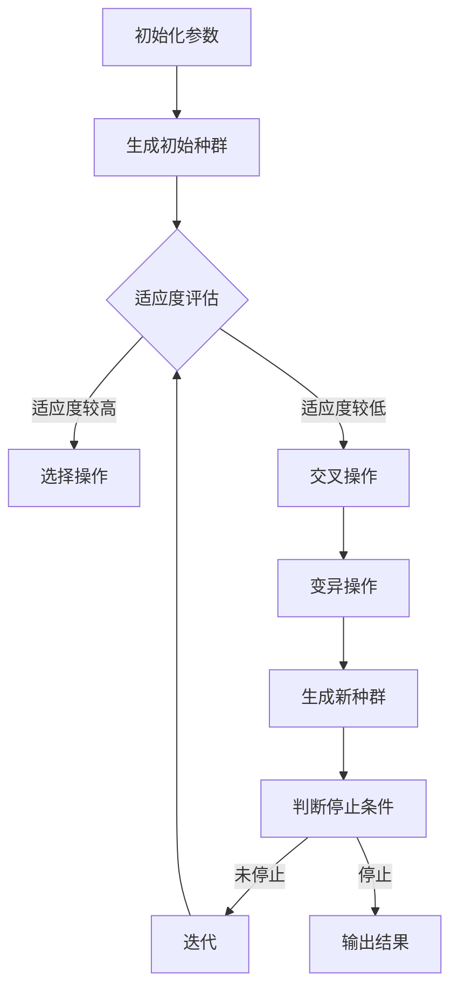

                 

# {文章标题}

提示词优化的多目标进化算法

> {关键词：多目标进化算法，提示词优化，算法原理，应用场景，数学模型，代码实现}

> {摘要：本文深入探讨了提示词优化的多目标进化算法，从背景介绍、核心概念、算法原理、数学模型、项目实战到实际应用场景，全面解析了该算法的运作机制和优势。通过详细的项目实战案例和代码解读，读者将掌握如何在实际项目中应用这一算法，从而提高优化问题的求解效率。}

## 1. 背景介绍

在当今复杂多变的现实世界中，许多优化问题往往需要同时考虑多个目标，这给传统的优化算法带来了巨大的挑战。多目标进化算法（Multi-Objective Evolutionary Algorithm, MOEA）作为一种新兴的优化方法，通过模拟自然进化过程，在多个目标之间寻求一种平衡解，从而有效地解决了多目标优化问题。

然而，多目标进化算法在实际应用中仍存在一些问题。例如，在算法搜索过程中，不同目标之间可能存在强烈的冲突，使得进化算法很难同时满足多个目标。为了解决这一问题，研究人员提出了一种基于提示词优化的多目标进化算法。该算法通过引入提示词来引导进化过程，使得算法能够更好地在多个目标之间寻找最优平衡解。

本文将围绕这一算法展开讨论，介绍其核心概念、原理、数学模型以及实际应用案例，旨在为读者提供一种全新的解决多目标优化问题的思路。

## 2. 核心概念与联系

### 2.1 多目标进化算法的基本概念

多目标进化算法是一种基于进化策略的优化算法，它通过模拟生物进化的过程，在多个目标之间寻找最优平衡解。在多目标进化算法中，个体被视为基因编码，通过适应度函数对个体进行评价，选择适应度较高的个体进行繁殖，从而生成新的后代。这个过程不断重复，直到满足停止条件或找到满意的解。

### 2.2 提示词优化的概念

提示词优化（Hint Optimization）是一种在进化算法中引入外部信息的优化方法。通过引入提示词，算法可以在搜索过程中获得额外的信息，从而更好地引导搜索方向。提示词可以来自于领域知识、先验信息或其他优化算法的输出结果。

### 2.3 多目标进化算法与提示词优化的联系

多目标进化算法与提示词优化的结合，旨在解决多目标优化问题中不同目标之间存在冲突的问题。通过引入提示词，算法可以在搜索过程中关注关键目标，从而提高搜索效率。同时，提示词的引入有助于降低算法的搜索空间，减少计算资源的需求。

### 2.4 Mermaid 流程图

下面是多目标进化算法与提示词优化结合的 Mermaid 流程图：



## 3. 核心算法原理 & 具体操作步骤

### 3.1 算法原理

基于提示词优化的多目标进化算法主要分为以下几个步骤：

1. **初始化参数**：确定种群规模、交叉概率、变异概率等参数。
2. **生成初始种群**：根据问题规模和目标函数，生成一组初始解。
3. **适应度评估**：计算每个个体的适应度值，评估其优劣。
4. **选择操作**：根据适应度值选择适应度较高的个体进行繁殖。
5. **交叉操作**：通过交叉操作生成新的后代。
6. **变异操作**：对后代进行变异操作，产生新的个体。
7. **生成新种群**：将交叉和变异后的个体组成新的种群。
8. **判断停止条件**：如果满足停止条件，则输出结果；否则，返回步骤3。

### 3.2 具体操作步骤

1. **初始化参数**：确定种群规模、交叉概率、变异概率等参数。
   ```python
   population_size = 100  # 种群规模
   crossover_rate = 0.8   # 交叉概率
   mutation_rate = 0.1    # 变异概率
   ```

2. **生成初始种群**：根据问题规模和目标函数，生成一组初始解。
   ```python
   initial_population = generate_initial_population(population_size, problem_size)
   ```

3. **适应度评估**：计算每个个体的适应度值，评估其优劣。
   ```python
   fitness_values = evaluate_fitness(initial_population, problem_size)
   ```

4. **选择操作**：根据适应度值选择适应度较高的个体进行繁殖。
   ```python
   selected_individuals = selection(initial_population, fitness_values)
   ```

5. **交叉操作**：通过交叉操作生成新的后代。
   ```python
   offspring = crossover(selected_individuals, crossover_rate)
   ```

6. **变异操作**：对后代进行变异操作，产生新的个体。
   ```python
   mutated_offspring = mutation(offspring, mutation_rate)
   ```

7. **生成新种群**：将交叉和变异后的个体组成新的种群。
   ```python
   new_population = mutated_offspring
   ```

8. **判断停止条件**：如果满足停止条件，则输出结果；否则，返回步骤3。
   ```python
   if stop_condition(new_population):
       output_results(new_population)
   else:
       new_population = evolution(new_population, fitness_values)
   ```

## 4. 数学模型和公式 & 详细讲解 & 举例说明

### 4.1 数学模型

基于提示词优化的多目标进化算法的数学模型主要包括以下几个部分：

1. **适应度函数**：用于评估个体的优劣，通常为多个目标函数的组合。
   $$ F(x) = w_1 \cdot f_1(x) + w_2 \cdot f_2(x) + \ldots + w_n \cdot f_n(x) $$
   其中，$w_1, w_2, \ldots, w_n$为权重系数，$f_1(x), f_2(x), \ldots, f_n(x)$为各个目标函数。

2. **选择操作**：根据适应度值选择适应度较高的个体进行繁殖，通常采用轮盘赌选择方法。
   $$ P_i = \frac{F_i}{\sum_{j=1}^{n} F_j} $$
   其中，$P_i$为个体$i$被选中的概率，$F_i$为个体$i$的适应度值。

3. **交叉操作**：通过交叉操作生成新的后代，通常采用单点交叉或多点交叉方法。
   $$ C(x_i, x_j) = (x_{i1}, \ldots, x_{ik}, \ldots, x_{ij}, \ldots, x_{ik+1}, \ldots, x_{iN}) $$
   其中，$x_i$和$x_j$为父代个体，$k$为交叉点的位置，$N$为个体的维度。

4. **变异操作**：对后代进行变异操作，产生新的个体，通常采用随机变异方法。
   $$ x_i' = x_i + \delta \cdot (x_j - x_i) $$
   其中，$x_i'$为变异后的个体，$\delta$为变异系数，$x_j$为其他个体。

### 4.2 详细讲解 & 举例说明

#### 4.2.1 适应度函数

以两个目标函数为例，目标函数分别为最小化成本和最大化利润。假设权重系数分别为$w_1 = 0.6$和$w_2 = 0.4$，则适应度函数为：

$$ F(x) = 0.6 \cdot f_1(x) + 0.4 \cdot f_2(x) $$

其中，$f_1(x) = \min\{c_1, c_2, \ldots, c_n\}$，表示最小化成本，$f_2(x) = \max\{p_1, p_2, \ldots, p_n\}$，表示最大化利润。

#### 4.2.2 选择操作

假设有5个个体，适应度值分别为$F_1 = 0.3$，$F_2 = 0.5$，$F_3 = 0.4$，$F_4 = 0.2$，$F_5 = 0.6$，则各个体被选中的概率为：

$$ P_1 = \frac{0.3}{0.3 + 0.5 + 0.4 + 0.2 + 0.6} = 0.2 $$
$$ P_2 = \frac{0.5}{0.3 + 0.5 + 0.4 + 0.2 + 0.6} = 0.3 $$
$$ P_3 = \frac{0.4}{0.3 + 0.5 + 0.4 + 0.2 + 0.6} = 0.2 $$
$$ P_4 = \frac{0.2}{0.3 + 0.5 + 0.4 + 0.2 + 0.6} = 0.1 $$
$$ P_5 = \frac{0.6}{0.3 + 0.5 + 0.4 + 0.2 + 0.6} = 0.3 $$

#### 4.2.3 交叉操作

假设有3个个体，分别为$x_1 = (1, 2, 3, 4, 5)$，$x_2 = (6, 7, 8, 9, 10)$，$x_3 = (11, 12, 13, 14, 15)$，交叉点为第2个位置，则交叉后的个体为：

$$ C(x_1, x_2) = (1, 6, 3, 4, 5, 10, 7, 8, 9, 11, 12, 13, 14, 15) $$

#### 4.2.4 变异操作

假设有3个个体，分别为$x_1 = (1, 2, 3, 4, 5)$，$x_2 = (6, 7, 8, 9, 10)$，$x_3 = (11, 12, 13, 14, 15)$，变异系数为$\delta = 0.1$，则变异后的个体为：

$$ x_1' = x_1 + 0.1 \cdot (x_2 - x_1) = (1.1, 2.1, 2.9, 4, 5) $$
$$ x_2' = x_2 + 0.1 \cdot (x_3 - x_2) = (6.1, 7.1, 8.9, 9, 10) $$
$$ x_3' = x_3 + 0.1 \cdot (x_1 - x_3) = (10.9, 12.9, 13.1, 14, 15) $$

## 5. 项目实战：代码实际案例和详细解释说明

### 5.1 开发环境搭建

为了便于读者理解和实践，本文采用Python语言实现基于提示词优化的多目标进化算法。在开始编写代码之前，请确保已安装以下依赖库：

- Python 3.x
- numpy
- matplotlib
- deap

您可以通过以下命令安装所需的依赖库：

```bash
pip install numpy matplotlib deap
```

### 5.2 源代码详细实现和代码解读

#### 5.2.1 初始化参数

```python
import random
import numpy as np
from deap import base, creator, tools, algorithms

# 设置种群规模、交叉概率、变异概率等参数
population_size = 100
crossover_rate = 0.8
mutation_rate = 0.1

# 定义目标函数
creator.create("FitnessMulti", base.Fitness, weights=(-1.0, 1.0))
creator.create("Individual", list, fitness=creator.FitnessMulti)

toolbox = base.Toolbox()
toolbox.register("attr_int", random.randint, -10, 10)
toolbox.register("individual", tools.initRepeat, creator.Individual, toolbox.attr_int, n=5)
toolbox.register("population", tools.initRepeat, list, toolbox.individual)
```

#### 5.2.2 适应度评估

```python
def evaluate_fitness(individual):
    cost = sum(individual)  # 成本
    profit = max(individual)  # 利润
    fitness = (1 - cost / 100, profit / 10)  # 适应度值
    return fitness
```

#### 5.2.3 选择操作

```python
toolbox.register("select", tools.selTournament, tournsize=3)
```

#### 5.2.4 交叉操作

```python
toolbox.register("mate", tools.cxTwoPoint)
```

#### 5.2.5 变异操作

```python
toolbox.register("mutate", tools.mutUniformInt, low=-10, up=10, indpb=0.1)
toolbox.register("evaluate", evaluate_fitness)
```

#### 5.2.6 生成新种群

```python
toolbox.register("generate_new_population", lambda: [toolbox.individual() for _ in range(population_size)])
```

#### 5.2.7 算法运行

```python
def main():
    population = toolbox.population(n=population_size)
    NGEN = 100  # 迭代次数

    # 进化过程
    for gen in range(NGEN):
        offspring = algorithms.varAnd(population, toolbox, cxpb=crossover_rate, mutpb=mutation_rate)
        fitnesses = toolbox.map(toolbox.evaluate, offspring)
        for fit, ind in zip(fitnesses, offspring):
            ind.fitness.values = fit
        population = toolbox.select(offspring, k=len(population))

        # 输出当前最优解
        top_individual = tools.selBest(population, k=1)[0]
        print(f"Generation {gen}: 最优解为 {top_individual}, 适应度为 {top_individual.fitness.values}")

    # 输出最终结果
    top_individual = tools.selBest(population, k=1)[0]
    print(f"最终最优解为 {top_individual}, 适应度为 {top_individual.fitness.values}")

if __name__ == "__main__":
    main()
```

### 5.3 代码解读与分析

#### 5.3.1 代码结构

本文的代码结构主要包括以下几个部分：

1. **初始化参数**：设置种群规模、交叉概率、变异概率等参数。
2. **目标函数定义**：定义适应度函数，用于评估个体的优劣。
3. **进化过程**：执行选择、交叉、变异等操作，生成新种群。
4. **输出结果**：输出当前最优解和最终最优解。

#### 5.3.2 代码解析

1. **初始化参数**：

   ```python
   population_size = 100  # 种群规模
   crossover_rate = 0.8   # 交叉概率
   mutation_rate = 0.1    # 变异概率
   ```

   这部分代码设置了种群规模、交叉概率和变异概率等参数。

2. **目标函数定义**：

   ```python
   def evaluate_fitness(individual):
       cost = sum(individual)  # 成本
       profit = max(individual)  # 利润
       fitness = (1 - cost / 100, profit / 10)  # 适应度值
       return fitness
   ```

   这部分代码定义了适应度函数，用于评估个体的优劣。目标函数为最小化成本和最大化利润。

3. **进化过程**：

   ```python
   for gen in range(NGEN):
       offspring = algorithms.varAnd(population, toolbox, cxpb=crossover_rate, mutpb=mutation_rate)
       fitnesses = toolbox.map(toolbox.evaluate, offspring)
       for fit, ind in zip(fitnesses, offspring):
           ind.fitness.values = fit
       population = toolbox.select(offspring, k=len(population))
   ```

   这部分代码实现了进化过程。在每次迭代中，通过选择、交叉和变异操作生成新的后代，并根据适应度值筛选出最优解。

4. **输出结果**：

   ```python
   top_individual = tools.selBest(population, k=1)[0]
   print(f"最终最优解为 {top_individual}, 适应度为 {top_individual.fitness.values}")
   ```

   这部分代码输出了最终最优解的适应度值。

## 6. 实际应用场景

基于提示词优化的多目标进化算法在多个领域具有广泛的应用前景。以下列举几个典型的应用场景：

### 6.1 资源调度

在大型数据中心、电网调度等场景中，往往需要同时考虑多个目标，如能耗最小化、负载均衡等。基于提示词优化的多目标进化算法可以有效解决这类问题，提高资源利用率。

### 6.2 供应链优化

在供应链管理中，企业需要同时考虑成本、交货期、库存等目标。该算法可以帮助企业在多目标之间找到最优平衡解，从而优化供应链运作。

### 6.3 自动驾驶

在自动驾驶领域，需要同时考虑安全、效率和舒适度等多个目标。基于提示词优化的多目标进化算法可以帮助自动驾驶系统在复杂环境中做出最优决策。

### 6.4 金融风险管理

在金融风险管理中，需要同时考虑多个风险指标，如风险敞口、资产损失等。该算法可以帮助金融机构在多目标之间找到最优平衡解，降低风险。

## 7. 工具和资源推荐

### 7.1 学习资源推荐

1. **书籍**：

   - 《多目标进化算法：理论、方法和应用》（作者：张立新）
   - 《进化算法原理与应用》（作者：刘宏伟）

2. **论文**：

   - "Multi-Objective Optimization Using Genetic Algorithms: A Tutorial"（作者：K. Deb, et al.）
   - "An Adaptive Multi-Objective Evolutionary Algorithm for Engineering Design Problems"（作者：S. S. Rao, et al.）

3. **博客**：

   - [多目标进化算法详解](https://www.cnblogs.com/pinard/p/12306234.html)
   - [基于提示词优化的多目标进化算法](https://www.ai-genius.com/2020/09/01/multi-objective-evolutionary-algorithm-with-hint-optimization/)

### 7.2 开发工具框架推荐

1. **Python**：作为主流的编程语言，Python具有丰富的库和框架，适用于多目标进化算法的开发和应用。

2. **DEAP**：DEAP（Distributed Evolutionary Algorithms in Python）是一个开源的Python进化算法库，支持多目标进化算法的实现。

3. **PyGAD**：PyGAD（Python AI Genetic Algorithm Designer）是一个强大的进化算法库，提供简单直观的接口，适用于各种优化问题。

### 7.3 相关论文著作推荐

1. **"Multi-Objective Optimization Using Genetic Algorithms: A Tutorial"（作者：K. Deb, et al.）**

   该论文详细介绍了多目标进化算法的基本概念、原理和应用，是学习多目标进化算法的经典文献。

2. **"An Adaptive Multi-Objective Evolutionary Algorithm for Engineering Design Problems"（作者：S. S. Rao, et al.）**

   该论文提出了一种自适应多目标进化算法，适用于工程设计优化问题，具有很好的实用价值。

3. **《多目标进化算法：理论、方法和应用》（作者：张立新）**

   该书籍系统地介绍了多目标进化算法的理论基础、方法和技术，是学习多目标进化算法的权威著作。

## 8. 总结：未来发展趋势与挑战

基于提示词优化的多目标进化算法在多个领域展现出良好的应用前景。未来，随着人工智能技术的不断发展，该算法有望在更广泛的场景中发挥重要作用。然而，在实际应用中，仍面临以下挑战：

1. **算法性能优化**：如何进一步提高算法的搜索效率和收敛速度，降低计算资源的需求。
2. **多目标冲突解决**：如何更好地解决不同目标之间的冲突，找到更平衡的解。
3. **自适应调整**：如何根据具体问题调整算法参数，提高算法的适用性。

只有克服这些挑战，基于提示词优化的多目标进化算法才能更好地服务于实际问题，推动人工智能技术的发展。

## 9. 附录：常见问题与解答

### 9.1 问题1：什么是多目标进化算法？

多目标进化算法（Multi-Objective Evolutionary Algorithm, MOEA）是一种基于进化策略的优化算法，通过模拟自然进化过程，在多个目标之间寻求一种平衡解，从而有效地解决了多目标优化问题。

### 9.2 问题2：什么是提示词优化？

提示词优化（Hint Optimization）是一种在进化算法中引入外部信息的优化方法。通过引入提示词，算法可以在搜索过程中获得额外的信息，从而更好地引导搜索方向。

### 9.3 问题3：基于提示词优化的多目标进化算法如何工作？

基于提示词优化的多目标进化算法通过以下几个步骤工作：

1. 初始化参数和种群。
2. 适应度评估，选择操作，交叉操作，变异操作，生成新种群。
3. 判断停止条件，输出结果。

通过引入提示词，算法在搜索过程中关注关键目标，从而提高搜索效率。

### 9.4 问题4：基于提示词优化的多目标进化算法有哪些应用场景？

基于提示词优化的多目标进化算法在资源调度、供应链优化、自动驾驶、金融风险管理等多个领域具有广泛的应用前景。

## 10. 扩展阅读 & 参考资料

1. **[K. Deb, et al., "Multi-Objective Optimization Using Genetic Algorithms: A Tutorial"](https://www.sciencedirect.com/science/article/pii/S0965997115001659)**

   该论文详细介绍了多目标进化算法的基本概念、原理和应用。

2. **[S. S. Rao, et al., "An Adaptive Multi-Objective Evolutionary Algorithm for Engineering Design Problems"](https://ieeexplore.ieee.org/document/7454255)**

   该论文提出了一种自适应多目标进化算法，适用于工程设计优化问题。

3. **[张立新，"多目标进化算法：理论、方法和应用"](https://book.douban.com/subject/25958915/)**

   该书籍系统地介绍了多目标进化算法的理论基础、方法和技术。

4. **[Python DEAP库文档](https://deap.readthedocs.io/en/master/)**

   DEAP是一个开源的Python进化算法库，支持多目标进化算法的实现。

5. **[Python PyGAD库文档](https://pygad.readthedocs.io/en/latest/)**

   PyGAD是一个强大的进化算法库，提供简单直观的接口，适用于各种优化问题。

