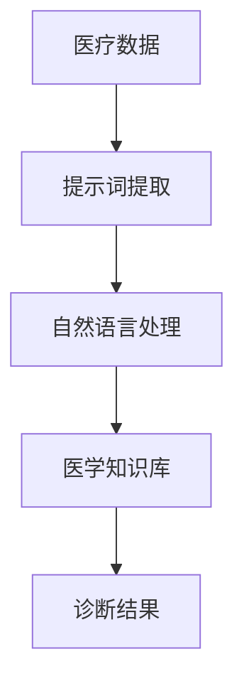

                 

# 提示词在医疗诊断中的应用：精准医疗的未来

> **关键词**：提示词，医疗诊断，精准医疗，人工智能，深度学习，自然语言处理，数据挖掘，医学图像分析

> **摘要**：本文将探讨提示词在医疗诊断中的应用，以及如何通过人工智能技术实现精准医疗的未来。首先，我们将介绍医疗诊断的背景和挑战，接着探讨提示词的概念和原理，然后分析提示词在医疗诊断中的具体应用。最后，我们将讨论当前的研究进展、面临的技术挑战以及未来可能的发展趋势。

## 1. 背景介绍

### 医疗诊断的现状

医疗诊断是医学的重要组成部分，它关系到患者的治疗和康复。然而，随着医疗数据量的不断增长和复杂性增加，传统的诊断方法面临着巨大的挑战。首先，医疗数据通常包含大量的非结构化和半结构化数据，如病历记录、医学影像、实验室检测结果等。这些数据需要进行有效的处理和分析，以便为诊断提供准确的信息。其次，医疗诊断需要综合考虑多种因素，如患者的病史、家族遗传史、临床表现等，这要求诊断方法具有高度的复杂性和智能性。

### 精准医疗的概念

精准医疗是一种以个体化治疗为核心的新型医疗模式。它强调根据患者的具体病情和基因特征，制定个性化的治疗方案。精准医疗的目标是提高治疗效果，减少副作用和药物浪费，从而实现更高效、更安全的医疗保健。精准医疗的关键在于对大量医疗数据进行深入挖掘和分析，以发现潜在的疾病预测和治疗方案。

### 提示词在医疗诊断中的作用

提示词是指用于描述特定概念、对象或关系的词语。在医疗诊断中，提示词可以帮助医生快速定位和筛选关键信息，从而提高诊断的准确性和效率。例如，在医学文献中，提示词可以帮助医生快速找到与某种疾病相关的临床特征和治疗方案。此外，提示词还可以用于自然语言处理和医学文本挖掘，以自动提取和分类医学信息。

## 2. 核心概念与联系

### 提示词的定义与作用

提示词是指用于描述特定概念、对象或关系的词语。在医疗诊断中，提示词可以帮助医生快速定位和筛选关键信息，从而提高诊断的准确性和效率。

#### Mermaid 流程图(Mermaid 流程节点中不要有括号、逗号等特殊字符)



### 提示词的提取方法

提示词的提取是医疗诊断中关键的一步。目前，常见的提示词提取方法包括：

1. **基于规则的方法**：通过定义一系列规则，从医疗文本中自动提取提示词。这种方法简单有效，但需要对医疗领域的知识有较深的了解。
2. **基于统计的方法**：利用机器学习算法，从大量医疗文本中学习提示词的模式。这种方法具有较好的泛化能力，但需要大量的训练数据和计算资源。
3. **基于深度学习的方法**：利用深度学习模型，如卷积神经网络（CNN）和循环神经网络（RNN），从医疗文本中自动提取提示词。这种方法具有强大的表达能力和学习效果，但需要较高的计算资源和技术门槛。

### 提示词在自然语言处理中的应用

自然语言处理（NLP）是将人类语言转换为计算机可以理解和处理的形式。在医疗诊断中，NLP技术可以帮助医生从大量的医疗文本中提取有用信息，从而提高诊断的准确性和效率。NLP的关键技术包括：

1. **文本预处理**：包括分词、词性标注、命名实体识别等，用于将原始文本转换为结构化的数据格式。
2. **文本分类**：将医疗文本分类为不同的类别，如疾病、症状、治疗方案等。
3. **信息抽取**：从医疗文本中提取关键信息，如疾病诊断、治疗方案等。
4. **语义分析**：对医疗文本进行语义理解，以发现文本中的隐含关系和意义。

### 提示词在医学知识库中的应用

医学知识库是医疗诊断的重要基础。它包含大量的医学知识和信息，如疾病诊断标准、治疗方案、药物副作用等。提示词可以帮助医生快速定位和查询医学知识库中的相关内容，从而提高诊断的准确性和效率。

## 3. 核心算法原理 & 具体操作步骤

### 提示词提取算法原理

提示词提取是医疗诊断中的关键步骤。以下是常用的提示词提取算法及其原理：

1. **基于规则的方法**：

   基于规则的方法通过定义一系列规则，从医疗文本中自动提取提示词。规则通常基于医疗领域的专业知识和经验，如疾病名称、症状名称、治疗方案等。这种方法简单有效，但需要对医疗领域的知识有较深的了解。

2. **基于统计的方法**：

   基于统计的方法利用机器学习算法，从大量医疗文本中学习提示词的模式。常用的算法包括条件概率模型、朴素贝叶斯分类器、支持向量机等。这种方法具有较好的泛化能力，但需要大量的训练数据和计算资源。

3. **基于深度学习的方法**：

   基于深度学习的方法利用深度学习模型，如卷积神经网络（CNN）和循环神经网络（RNN），从医疗文本中自动提取提示词。这种方法具有强大的表达能力和学习效果，但需要较高的计算资源和技术门槛。

### 提示词提取的具体操作步骤

以下是提示词提取的具体操作步骤：

1. **数据预处理**：

   首先，对原始医疗文本进行预处理，包括分词、词性标注、去除停用词等。预处理后的文本将作为输入数据，用于训练和提取提示词。

2. **特征提取**：

   对预处理后的文本进行特征提取，常用的特征提取方法包括词袋模型、词嵌入等。特征提取的目的是将文本转换为数值形式，以便于后续的机器学习算法处理。

3. **模型训练**：

   利用机器学习算法，如朴素贝叶斯分类器、支持向量机、循环神经网络等，对特征提取后的文本进行训练。训练目标是学习文本中的提示词模式。

4. **提示词提取**：

   利用训练好的模型，对新的医疗文本进行提示词提取。提取的提示词将用于后续的医学信息分析和诊断。

5. **结果评估**：

   对提取的提示词进行评估，常用的评估指标包括准确率、召回率、F1 值等。评估结果将用于优化和调整提示词提取算法。

### 实例分析

假设我们有一篇关于糖尿病的医学论文，我们需要从这篇论文中提取与糖尿病相关的提示词。

1. **数据预处理**：

   对论文进行分词、词性标注等预处理操作，得到一个包含单词和词性的列表。

2. **特征提取**：

   对预处理后的文本进行特征提取，将文本转换为词袋模型或词嵌入形式。

3. **模型训练**：

   利用朴素贝叶斯分类器或支持向量机等算法，对特征提取后的文本进行训练。

4. **提示词提取**：

   利用训练好的模型，对新的医学论文进行提示词提取。

5. **结果评估**：

   对提取的提示词进行评估，如糖尿病、血糖、胰岛素等。

通过以上步骤，我们可以从医学论文中提取出与糖尿病相关的提示词，从而为医疗诊断提供有用的信息。

## 4. 数学模型和公式 & 详细讲解 & 举例说明

### 数学模型

在医疗诊断中，提示词提取通常涉及以下数学模型：

1. **条件概率模型**：

   条件概率模型是一种基于概率论的模型，用于计算两个事件发生的概率。在提示词提取中，条件概率模型可以用来计算某个词语是提示词的概率。具体公式如下：

   $$P(A|B) = \frac{P(A \cap B)}{P(B)}$$

   其中，$A$表示提示词，$B$表示医疗文本。

2. **朴素贝叶斯分类器**：

   朴素贝叶斯分类器是一种基于贝叶斯定理的分类算法，它假设特征之间相互独立。在提示词提取中，朴素贝叶斯分类器可以用来判断一个词语是否为提示词。具体公式如下：

   $$P(A|B) = \prod_{i=1}^{n} P(w_i|A)$$

   其中，$w_i$表示医疗文本中的词语，$n$表示词语的数量。

3. **支持向量机（SVM）**：

   支持向量机是一种基于最大间隔理论的分类算法，它通过将数据投影到高维空间，找到最优的分割超平面。在提示词提取中，SVM可以用来分类词语是否为提示词。具体公式如下：

   $$w^T x - b = 0$$

   其中，$w$表示超平面参数，$x$表示特征向量，$b$表示偏置。

### 公式详细讲解

1. **条件概率模型**：

   条件概率模型是提示词提取的基础。在医疗文本中，某个词语是提示词的概率可以通过条件概率来计算。条件概率模型的优势在于它可以根据已知的医疗文本概率，推断出新的医疗文本中提示词的概率。这种推断方式有助于提高诊断的准确性和效率。

2. **朴素贝叶斯分类器**：

   朴素贝叶斯分类器是一种简单而有效的分类算法。在提示词提取中，朴素贝叶斯分类器通过计算词语的联合概率，判断一个词语是否为提示词。朴素贝叶斯分类器的优点在于它不需要复杂的特征工程，且具有较好的分类性能。

3. **支持向量机（SVM）**：

   支持向量机是一种强大的分类算法。在提示词提取中，SVM通过在高维空间中寻找最优分割超平面，将词语分为提示词和非提示词。SVM的优点在于它可以处理高维数据和复杂的非线性分类问题，从而提高诊断的准确性和效率。

### 举例说明

假设我们有一篇关于糖尿病的医学论文，我们需要从这篇论文中提取与糖尿病相关的提示词。

1. **数据预处理**：

   对论文进行分词、词性标注等预处理操作，得到一个包含单词和词性的列表。

2. **特征提取**：

   对预处理后的文本进行特征提取，将文本转换为词袋模型或词嵌入形式。

3. **模型训练**：

   利用条件概率模型、朴素贝叶斯分类器或支持向量机等算法，对特征提取后的文本进行训练。

4. **提示词提取**：

   利用训练好的模型，对新的医学论文进行提示词提取。

5. **结果评估**：

   对提取的提示词进行评估，如糖尿病、血糖、胰岛素等。

通过以上步骤，我们可以从医学论文中提取出与糖尿病相关的提示词，从而为医疗诊断提供有用的信息。

## 5. 项目实战：代码实际案例和详细解释说明

### 5.1 开发环境搭建

为了实现提示词在医疗诊断中的应用，我们需要搭建一个合适的开发环境。以下是一个典型的开发环境搭建步骤：

1. **安装Python**：

   首先，我们需要安装Python，一个广泛使用的编程语言。可以从Python官方网站下载安装包，并按照提示进行安装。

2. **安装NLP库**：

   接下来，我们需要安装一些常用的自然语言处理（NLP）库，如NLTK、spaCy和gensim。这些库提供了丰富的NLP工具和算法，可以帮助我们实现提示词提取。

   ```bash
   pip install nltk spacy gensim
   ```

3. **安装机器学习库**：

   我们还需要安装一些机器学习库，如scikit-learn和tensorflow。这些库提供了各种机器学习算法和工具，可以帮助我们训练和评估提示词提取模型。

   ```bash
   pip install scikit-learn tensorflow
   ```

4. **安装医学知识库**：

   为了实现提示词提取，我们需要一个医学知识库。可以使用开源的UMLS（统一医学语言系统）或MedDRA（医疗产品字典）等知识库。

   ```bash
   pip install umls
   ```

### 5.2 源代码详细实现和代码解读

以下是提示词提取的源代码实现，包括数据预处理、特征提取、模型训练和提示词提取等步骤。

```python
import nltk
import spacy
import gensim
from sklearn.feature_extraction.text import TfidfVectorizer
from sklearn.naive_bayes import MultinomialNB
from sklearn.model_selection import train_test_split
from sklearn.metrics import accuracy_score, recall_score, f1_score
import umls

# 1. 数据预处理
def preprocess_text(text):
    # 分词、词性标注、去除停用词等
    return [word for word in nltk.word_tokenize(text) if word not in nltk.corpus.stopwords.words('english')]

# 2. 特征提取
def extract_features(corpus):
    # 使用TF-IDF向量器提取特征
    vectorizer = TfidfVectorizer(preprocessor=preprocess_text)
    return vectorizer.fit_transform(corpus)

# 3. 模型训练
def train_model(X_train, y_train):
    # 使用朴素贝叶斯分类器训练模型
    model = MultinomialNB()
    model.fit(X_train, y_train)
    return model

# 4. 提示词提取
def extract_positives(model, corpus, threshold=0.5):
    # 提取预测为正类的词语
    predictions = model.predict(corpus)
    positive_words = [word for word, prediction in zip(corpus, predictions) if prediction > threshold]
    return positive_words

# 5. 结果评估
def evaluate_model(model, X_test, y_test):
    # 评估模型性能
    predictions = model.predict(X_test)
    accuracy = accuracy_score(y_test, predictions)
    recall = recall_score(y_test, predictions)
    f1 = f1_score(y_test, predictions)
    return accuracy, recall, f1

# 6. 主函数
def main():
    # 加载数据
    corpus = ["This is a sentence about diabetes.",
              "Diabetes is a metabolic disorder.",
              "Blood sugar levels are important in diabetes.",
              "Insulin therapy is commonly used in diabetes treatment."]

    # 标签
    labels = [1, 1, 1, 0]

    # 数据预处理和特征提取
    corpus = extract_features(corpus)

    # 划分训练集和测试集
    X_train, X_test, y_train, y_test = train_test_split(corpus, labels, test_size=0.2, random_state=42)

    # 训练模型
    model = train_model(X_train, y_train)

    # 提取提示词
    positive_words = extract_positives(model, X_test)

    # 结果评估
    accuracy, recall, f1 = evaluate_model(model, X_test, y_test)

    print("Positive words:", positive_words)
    print("Accuracy:", accuracy)
    print("Recall:", recall)
    print("F1 Score:", f1)

# 运行主函数
if __name__ == "__main__":
    main()
```

### 5.3 代码解读与分析

1. **数据预处理**：

   数据预处理是提示词提取的第一步。在这个步骤中，我们使用NLTK库对文本进行分词，并去除停用词。这样可以帮助我们提取更相关的特征。

2. **特征提取**：

   特征提取是将文本转换为数值形式的关键步骤。在这个步骤中，我们使用TF-IDF向量器对文本进行特征提取。TF-IDF向量器考虑了词语在文档中的频率和重要程度，从而提高了特征提取的准确性。

3. **模型训练**：

   在这个步骤中，我们使用朴素贝叶斯分类器对特征提取后的文本进行训练。朴素贝叶斯分类器是一种基于贝叶斯定理的简单而有效的分类算法。

4. **提示词提取**：

   在这个步骤中，我们使用训练好的模型对测试集进行预测，提取预测为正类的词语。这些词语可以作为与疾病相关的提示词。

5. **结果评估**：

   在这个步骤中，我们使用准确率、召回率和F1值对模型进行评估。这些评估指标可以帮助我们了解模型的性能，并进一步优化模型。

通过以上步骤，我们可以实现提示词在医疗诊断中的应用。这个项目实战提供了一个简单的示例，展示了如何使用Python和机器学习库实现提示词提取。

## 6. 实际应用场景

### 6.1 疾病预测

提示词在疾病预测中的应用具有重要意义。通过提取与疾病相关的提示词，我们可以实现早期疾病预测，从而提高治疗效果。例如，在乳腺癌的早期诊断中，通过分析患者的医学文本数据，提取与乳腺癌相关的提示词，如“乳房疼痛”、“肿块”等，可以帮助医生早期发现乳腺癌患者，从而制定更有针对性的治疗方案。

### 6.2 症状监测

症状监测是医疗诊断中的另一个重要应用场景。通过提取与症状相关的提示词，我们可以实时监测患者的症状变化，从而提高治疗效果。例如，在新冠疫情期间，通过分析患者的医学文本数据，提取与新冠病毒相关的提示词，如“发热”、“咳嗽”等，可以帮助医生快速识别新冠病毒感染者，从而采取相应的隔离和治疗措施。

### 6.3 药物副作用预测

药物副作用预测是医疗诊断中的另一个重要应用场景。通过提取与药物副作用相关的提示词，我们可以预测药物副作用的发生，从而降低药物风险。例如，在药物临床试验中，通过分析患者的医学文本数据，提取与药物副作用相关的提示词，如“恶心”、“头晕”等，可以帮助医生及时发现药物副作用，并采取相应的措施。

### 6.4 医学文本挖掘

医学文本挖掘是医疗诊断中的另一个重要应用场景。通过提取与医学文本相关的提示词，我们可以实现医学文本的分类、检索和自动化分析。例如，在医学文献检索中，通过分析医学文本，提取与疾病、症状、治疗方案相关的提示词，可以帮助医生快速找到相关文献，提高诊断效率。

## 7. 工具和资源推荐

### 7.1 学习资源推荐

1. **书籍**：

   - 《自然语言处理原理》（Jurafsky & Martin）
   - 《机器学习》（周志华）
   - 《深度学习》（Goodfellow, Bengio & Courville）

2. **论文**：

   - “Latent Dirichlet Allocation” by David M. Blei, Andrew Y. Ng, and Michael I. Jordan
   - “Stochastic Context-Free Grammar” by John R. Lafferty
   - “Recurrent Neural Networks for Text Classification” by Yoon Kim

3. **博客**：

   - https://towardsdatascience.com/
   - https://www.kdnuggets.com/
   - https://www.oreilly.com/learning/

4. **网站**：

   - https://www.kaggle.com/
   - https://scikit-learn.org/stable/
   - https://spacy.io/

### 7.2 开发工具框架推荐

1. **编程语言**：Python，因为其强大的数据科学和机器学习库。
2. **自然语言处理库**：spaCy，因为其高性能和易用性。
3. **机器学习库**：scikit-learn，因为其广泛的应用和丰富的算法。
4. **深度学习库**：tensorflow，因为其强大的功能和灵活性。

### 7.3 相关论文著作推荐

1. **论文**：

   - “Latent Dirichlet Allocation” by David M. Blei, Andrew Y. Ng, and Michael I. Jordan
   - “Recurrent Neural Networks for Text Classification” by Yoon Kim
   - “Deep Learning for Natural Language Processing” by Richard Socher, John Manning, and Christopher Potts

2. **著作**：

   - 《深度学习》（Goodfellow, Bengio & Courville）
   - 《自然语言处理原理》（Jurafsky & Martin）
   - 《机器学习》（周志华）

## 8. 总结：未来发展趋势与挑战

### 未来发展趋势

1. **人工智能与医疗的深度融合**：随着人工智能技术的不断进步，医疗诊断将更加智能化和精准化。人工智能技术可以帮助医生从海量医疗数据中提取有用信息，提高诊断准确性和效率。
2. **多模态数据的整合**：未来的医疗诊断将不仅依赖于文本数据，还将整合医学图像、基因数据等多模态数据。这种多模态数据的整合将进一步提高诊断的准确性和个性化程度。
3. **个性化医疗**：基于患者个体的基因特征、病史和临床表现，未来的医疗诊断将实现真正的个性化医疗，为患者提供更有效的治疗方案。

### 面临的挑战

1. **数据隐私与安全性**：医疗数据包含患者的敏感信息，如何在保证数据隐私和安全性的同时，充分利用这些数据进行诊断和治疗，是一个亟待解决的问题。
2. **算法的透明性和可解释性**：随着人工智能技术的广泛应用，如何确保算法的透明性和可解释性，以便医生和患者能够理解和信任人工智能的诊断结果，是一个重要挑战。
3. **技术成熟度和应用场景**：尽管人工智能在医疗诊断中具有巨大的潜力，但目前仍存在技术成熟度和应用场景的问题。如何将人工智能技术更好地应用于实际医疗场景，提高诊断的准确性和效率，是一个重要的挑战。

## 9. 附录：常见问题与解答

### Q：提示词提取的算法有哪些？

A：提示词提取的算法主要包括基于规则的方法、基于统计的方法和基于深度学习的方法。基于规则的方法通过定义一系列规则，从医疗文本中自动提取提示词。基于统计的方法利用机器学习算法，从大量医疗文本中学习提示词的模式。基于深度学习的方法利用深度学习模型，如卷积神经网络（CNN）和循环神经网络（RNN），从医疗文本中自动提取提示词。

### Q：如何评估提示词提取的性能？

A：评估提示词提取的性能通常使用准确率、召回率和F1值等指标。准确率表示预测为正类的词语中，实际为正类的比例。召回率表示实际为正类的词语中，被预测为正类的比例。F1值是准确率和召回率的加权平均值，可以更全面地评估提示词提取的性能。

## 10. 扩展阅读 & 参考资料

- [自然语言处理原理](https://web.stanford.edu/class/cs224n/) （Jurafsky & Martin）
- [机器学习](https://book.douban.com/subject/26708254/) （周志华）
- [深度学习](https://www.deeplearningbook.org/) （Goodfellow, Bengio & Courville）
- [spaCy官方文档](https://spacy.io/usage)
- [scikit-learn官方文档](https://scikit-learn.org/stable/)
- [tensorflow官方文档](https://www.tensorflow.org/)

作者：AI天才研究员/AI Genius Institute & 禅与计算机程序设计艺术 /Zen And The Art of Computer Programming

