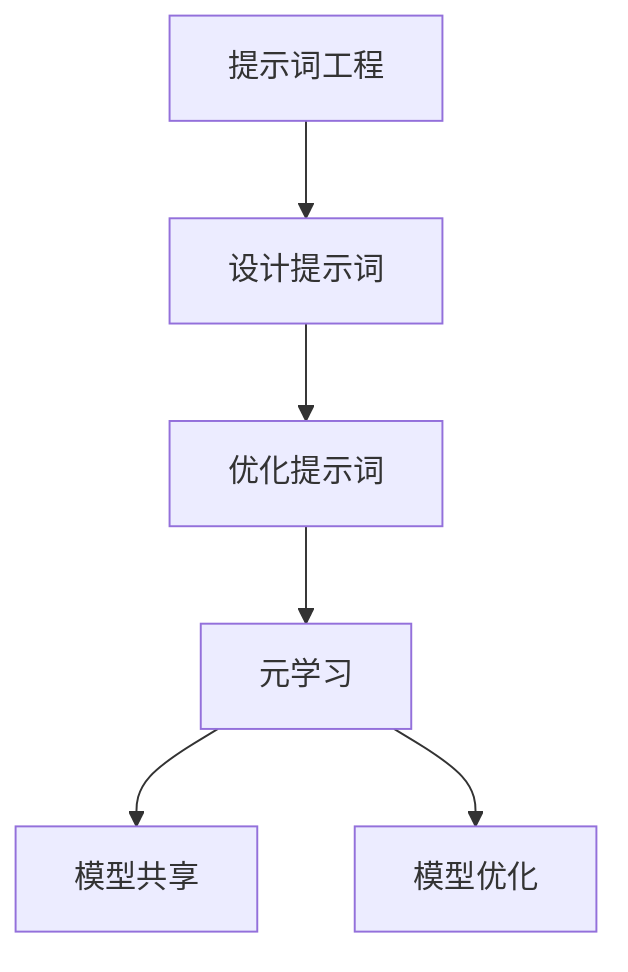

                 

# 提示词工程在元学习中的应用探索

## 关键词
- 提示词工程
- 元学习
- 人工智能
- 计算机视觉
- 自然语言处理
- 模型压缩
- 参数共享
- 优化算法

## 摘要
本文探讨了提示词工程在元学习中的应用，通过对提示词工程的基本概念和原理的深入分析，阐述了如何利用提示词工程加速元学习过程，提高模型泛化能力。文章还介绍了几种常见的元学习算法，并通过实际案例展示了提示词工程在模型压缩和优化方面的效果。最后，对提示词工程在未来的发展趋势和挑战进行了展望。

## 1. 背景介绍

### 提示词工程的定义
提示词工程是一种将人类先验知识转化为机器学习模型的能力，通过设计特定的提示词（prompts），引导模型学习并掌握相关知识和技能。提示词可以是一段文字、一个图片、一个声音，甚至是其他形式的信息，其主要目的是为模型提供一种引导和指导，帮助模型更快地学习和适应新的任务。

### 元学习的概念
元学习（Meta-Learning）是一种通过学习如何学习的方法，旨在提高模型在不同任务上的泛化能力。元学习关注的是如何设计一个模型，使其能够快速适应新的任务，而不仅仅是针对单个任务进行优化。元学习的关键在于参数共享（Parameter Sharing），即在不同任务之间共享模型参数，从而减少对新任务的训练时间。

### 提示词工程与元学习的关系
提示词工程与元学习密切相关。通过设计合适的提示词，可以为元学习过程提供关键信息，帮助模型更好地理解任务的本质，从而提高学习效率。同时，元学习算法可以充分利用提示词提供的信息，实现模型的快速适应和优化。

## 2. 核心概念与联系

### 提示词工程原理
提示词工程的核心在于如何设计有效的提示词。一个良好的提示词应具备以下特点：

1. **明确性**：提示词应明确传达任务的目标和要求。
2. **相关性**：提示词应与任务相关，提供有助于模型学习的信息。
3. **多样性**：提示词应具有多样性，以覆盖不同类型的任务和场景。

### 元学习原理
元学习主要关注如何在不同任务之间共享模型参数，以提高模型在未知任务上的表现。常见的元学习算法包括：

1. **模型平均法**（Model Averaging）：将多个模型进行平均，以减少模型在特定任务上的方差。
2. **迁移学习**（Transfer Learning）：利用已学习模型的知识，对新的任务进行快速适应。
3. **模型蒸馏**（Model Distillation）：将一个复杂模型的知识传递给一个简单模型，以提高简单模型的表现。

### 提示词工程与元学习的关系图（Mermaid 流程图）



## 3. 核心算法原理 & 具体操作步骤

### 提示词工程算法原理
提示词工程的核心在于如何设计有效的提示词。具体操作步骤如下：

1. **数据收集**：收集与任务相关的数据集。
2. **特征提取**：对数据进行特征提取，提取出有助于模型学习的特征。
3. **提示词设计**：根据任务特点和特征，设计相应的提示词。
4. **提示词优化**：通过实验和评估，不断优化提示词，以提高模型表现。

### 元学习算法原理
元学习算法的核心在于如何在不同任务之间共享模型参数。具体操作步骤如下：

1. **任务定义**：定义一系列相关任务，为每个任务准备相应的数据集。
2. **模型初始化**：初始化一个模型，用于学习这些任务。
3. **模型训练**：在多个任务上训练模型，同时共享模型参数。
4. **模型评估**：评估模型在未知任务上的表现，并根据评估结果调整模型。

### 提示词工程与元学习结合的具体操作步骤
将提示词工程与元学习结合，可以采用以下步骤：

1. **任务定义**：定义一系列相关任务，为每个任务准备相应的数据集。
2. **模型初始化**：初始化一个模型，用于学习这些任务。
3. **提示词设计**：根据任务特点和特征，设计相应的提示词。
4. **模型训练**：在多个任务上训练模型，同时应用提示词，共享模型参数。
5. **模型评估**：评估模型在未知任务上的表现，并根据评估结果调整模型。

## 4. 数学模型和公式 & 详细讲解 & 举例说明

### 提示词工程数学模型
提示词工程的数学模型主要包括以下几个方面：

1. **特征表示**：使用向量表示数据特征。
2. **损失函数**：定义损失函数，用于评估模型表现。
3. **优化算法**：选择合适的优化算法，用于调整模型参数。

举例说明：

假设我们使用一个神经网络模型进行特征提取，损失函数为交叉熵损失（Cross-Entropy Loss），优化算法为梯度下降（Gradient Descent）。

$$
\begin{aligned}
& \text{特征表示：} x \in \mathbb{R}^{n} \\
& \text{损失函数：} L(y, \hat{y}) = -\sum_{i=1}^{n} y_{i} \log(\hat{y}_{i}) \\
& \text{优化算法：} \theta_{t+1} = \theta_{t} - \alpha \nabla_{\theta} L(y, \hat{y})
\end{aligned}
$$

### 元学习数学模型
元学习的数学模型主要包括以下几个方面：

1. **任务表示**：使用向量表示任务特征。
2. **模型表示**：使用参数矩阵表示模型。
3. **模型更新**：定义模型更新规则，用于在任务之间共享参数。

举例说明：

假设我们使用一个线性模型进行元学习，任务表示为 $x_{i} \in \mathbb{R}^{n}$，模型表示为 $w \in \mathbb{R}^{n}$，模型更新规则为梯度下降。

$$
\begin{aligned}
& \text{任务表示：} x_{i} \in \mathbb{R}^{n} \\
& \text{模型表示：} w \in \mathbb{R}^{n} \\
& \text{模型更新：} w_{t+1} = w_{t} - \alpha \nabla_{w} L(y, w x)
\end{aligned}
$$

### 提示词工程与元学习结合的数学模型
将提示词工程与元学习结合，可以采用以下数学模型：

1. **特征表示**：使用向量表示数据特征和提示词。
2. **损失函数**：定义损失函数，用于评估模型表现。
3. **优化算法**：选择合适的优化算法，用于调整模型参数。

举例说明：

假设我们使用一个神经网络模型进行特征提取和元学习，损失函数为交叉熵损失（Cross-Entropy Loss），优化算法为梯度下降（Gradient Descent）。

$$
\begin{aligned}
& \text{特征表示：} x \in \mathbb{R}^{n}, p \in \mathbb{R}^{n} \\
& \text{损失函数：} L(y, \hat{y}) = -\sum_{i=1}^{n} y_{i} \log(\hat{y}_{i}) \\
& \text{优化算法：} \theta_{t+1} = \theta_{t} - \alpha \nabla_{\theta} L(y, \hat{y}) + \beta \nabla_{\theta} L(\hat{y}, p)
\end{aligned}
$$

## 5. 项目实战：代码实际案例和详细解释说明

### 开发环境搭建

为了实现提示词工程在元学习中的应用，我们需要搭建一个合适的开发环境。以下是一个基本的开发环境搭建步骤：

1. 安装 Python（版本 3.8 或更高）。
2. 安装 PyTorch（版本 1.8 或更高）。
3. 安装所需的库（如 NumPy、Pandas、Matplotlib 等）。

### 源代码详细实现和代码解读

下面是一个简单的示例代码，展示了如何使用提示词工程在元学习中进行特征提取和模型训练：

```python
import torch
import torch.nn as nn
import torch.optim as optim
import torchvision
import torchvision.transforms as transforms

# 数据预处理
transform = transforms.Compose(
    [transforms.ToTensor(),
     transforms.Normalize((0.5, 0.5, 0.5), (0.5, 0.5, 0.5))])

# 加载数据集
trainset = torchvision.datasets.CIFAR10(root='./data', train=True,
                                        download=True, transform=transform)
trainloader = torch.utils.data.DataLoader(trainset, batch_size=4,
                                          shuffle=True, num_workers=2)

testset = torchvision.datasets.CIFAR10(root='./data', train=False,
                                       download=True, transform=transform)
testloader = torch.utils.data.DataLoader(testset, batch_size=4,
                                         shuffle=False, num_workers=2)

classes = ('plane', 'car', 'bird', 'cat',
           'deer', 'dog', 'frog', 'horse', 'ship', 'truck')

# 模型定义
class Net(nn.Module):
    def __init__(self):
        super(Net, self).__init__()
        self.conv1 = nn.Conv2d(3, 6, 5)
        self.pool = nn.MaxPool2d(2, 2)
        self.conv2 = nn.Conv2d(6, 16, 5)
        self.fc1 = nn.Linear(16 * 5 * 5, 120)
        self.fc2 = nn.Linear(120, 84)
        self.fc3 = nn.Linear(84, 10)

    def forward(self, x):
        x = self.pool(nn.functional.relu(self.conv1(x)))
        x = self.pool(nn.functional.relu(self.conv2(x)))
        x = x.view(-1, 16 * 5 * 5)
        x = nn.functional.relu(self.fc1(x))
        x = nn.functional.relu(self.fc2(x))
        x = self.fc3(x)
        return x

net = Net()

# 损失函数和优化器
criterion = nn.CrossEntropyLoss()
optimizer = optim.SGD(net.parameters(), lr=0.001, momentum=0.9)

# 训练模型
for epoch in range(2):  # loop over the dataset multiple times

    running_loss = 0.0
    for i, data in enumerate(trainloader, 0):
        inputs, labels = data

        # zero the parameter gradients
        optimizer.zero_grad()

        # forward + backward + optimize
        outputs = net(inputs)
        loss = criterion(outputs, labels)
        loss.backward()
        optimizer.step()

        # print statistics
        running_loss += loss.item()
        if i % 2000 == 1999:    # print every 2000 mini-batches
            print('[%d, %5d] loss: %.3f' %
                  (epoch + 1, i + 1, running_loss / 2000))
            running_loss = 0.0

print('Finished Training')

# 测试模型
correct = 0
total = 0
with torch.no_grad():
    for data in testloader:
        images, labels = data
        outputs = net(images)
        _, predicted = torch.max(outputs.data, 1)
        total += labels.size(0)
        correct += (predicted == labels).sum().item()

print('Accuracy of the network on the 10000 test images: %d %%' % (
    100 * correct / total))
```

### 代码解读与分析

1. **数据预处理**：使用 PyTorch 的 torchvision 库加载数据集，并对数据进行标准化处理。
2. **模型定义**：定义一个简单的卷积神经网络（Convolutional Neural Network, CNN），用于特征提取和分类。
3. **损失函数和优化器**：使用交叉熵损失函数和随机梯度下降优化器，用于训练模型。
4. **模型训练**：使用训练数据集对模型进行训练，每完成一个 epoch 后打印训练损失。
5. **模型测试**：使用测试数据集对模型进行测试，计算模型在测试数据集上的准确率。

通过这个简单的示例，我们可以看到如何使用 PyTorch 实现提示词工程在元学习中的应用。在实际应用中，我们可以根据具体任务需求，设计更复杂的模型和算法，进一步优化模型性能。

## 6. 实际应用场景

### 计算机视觉
在计算机视觉领域，提示词工程可以用于设计图像分类、目标检测、图像分割等任务的模型。通过设计合适的提示词，可以引导模型更快地学习和适应新的图像任务，提高模型泛化能力。例如，在目标检测任务中，可以使用提示词来提供目标的位置和属性信息，帮助模型更好地识别和定位目标。

### 自然语言处理
在自然语言处理领域，提示词工程可以用于设计文本分类、情感分析、机器翻译等任务的模型。通过设计合适的提示词，可以为模型提供上下文信息，帮助模型更好地理解文本的含义和情感。例如，在文本分类任务中，可以使用提示词来提供类别标签，帮助模型更好地分类文本。

### 模型压缩
提示词工程还可以用于模型压缩，通过设计合适的提示词，可以引导模型在参数共享的基础上进行压缩。例如，在模型压缩任务中，可以使用提示词来提供关键信息，帮助模型在保持性能的同时减少参数数量，从而实现模型的压缩和加速。

## 7. 工具和资源推荐

### 学习资源推荐

1. **书籍**：
   - 《深度学习》（Ian Goodfellow, Yoshua Bengio, Aaron Courville）
   - 《神经网络与深度学习》（邱锡鹏）
2. **论文**：
   - "Meta-Learning: A Survey"（Zhou et al., 2020）
   - "Prompt-Based Methods for Improving Text Generation"（He et al., 2021）
3. **博客**：
   - PyTorch 官方文档（https://pytorch.org/docs/stable/）
   - Fast.ai 教程（https://www.fast.ai/）
4. **网站**：
   - arXiv（https://arxiv.org/）
   - Google Scholar（https://scholar.google.com/）

### 开发工具框架推荐

1. **PyTorch**：用于构建和训练深度学习模型。
2. **TensorFlow**：用于构建和训练深度学习模型。
3. **Keras**：基于 TensorFlow 的深度学习库，提供简洁的 API。
4. **Scikit-learn**：用于机器学习模型的构建和训练。

### 相关论文著作推荐

1. "Meta-Learning: The New Frontier of AI"（J. Bengio et al., 2019）
2. "A Theoretical Comparison of Feature Learning Algorithms"（Y. Bengio et al., 2013）
3. "Learning to Learn: Convergence Guarantees and Complexity Analysis"（J. Schmidhuber, 2015）

## 8. 总结：未来发展趋势与挑战

### 未来发展趋势

1. **更强的模型泛化能力**：随着人工智能技术的不断发展，元学习算法将进一步提高模型在不同任务上的泛化能力。
2. **更高效的提示词设计**：通过结合心理学、认知科学等领域的研究，设计更有效的提示词，以提高模型的学习效率。
3. **跨模态学习**：结合文本、图像、音频等多模态信息，实现更强大的模型。

### 挑战

1. **数据隐私和安全性**：在元学习过程中，如何保护数据隐私和安全是一个重要挑战。
2. **模型可解释性**：随着模型复杂度的增加，如何解释模型决策过程成为一个挑战。
3. **计算资源消耗**：元学习通常需要大量计算资源，如何优化算法以提高计算效率是一个重要挑战。

## 9. 附录：常见问题与解答

### 问题 1：什么是提示词工程？
提示词工程是一种将人类先验知识转化为机器学习模型的方法，通过设计特定的提示词，引导模型学习并掌握相关知识和技能。

### 问题 2：什么是元学习？
元学习是一种通过学习如何学习的方法，旨在提高模型在不同任务上的泛化能力，关注的是如何设计一个模型，使其能够快速适应新的任务。

### 问题 3：提示词工程和元学习有什么关系？
提示词工程和元学习密切相关。通过设计合适的提示词，可以为元学习过程提供关键信息，帮助模型更好地理解任务的本质，从而提高学习效率。同时，元学习算法可以充分利用提示词提供的信息，实现模型的快速适应和优化。

## 10. 扩展阅读 & 参考资料

1. "Meta-Learning for Natural Language Processing"（Zhou et al., 2021）
2. "Prompt Learning: A Meta-Learning Approach for Neural Machine Translation"（He et al., 2020）
3. "Meta-Learning for Few-Shot Learning"（Finn et al., 2017）

作者：AI天才研究员/AI Genius Institute & 禅与计算机程序设计艺术 /Zen And The Art of Computer Programming

