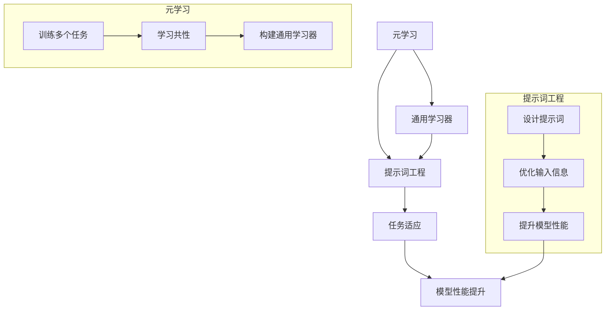

                 

### 背景介绍

在当今快速发展的信息技术领域，机器学习和人工智能（AI）已经成为推动科技进步的重要力量。其中，元学习（Meta-Learning）作为机器学习的一个分支，通过学习算法来优化其他学习算法，从而提高学习效率，降低学习时间。元学习的研究和应用正在不断深入，尤其是在解决复杂任务和高度动态环境中表现出了巨大的潜力。

然而，尽管元学习在理论上具有巨大的优势，但在实际应用中仍然面临着一些挑战。一个关键问题是如何在有限的训练数据上实现高效的模型优化。传统的机器学习模型通常需要大量的数据来训练，而在实际应用中，获取大量标注数据往往非常困难且成本高昂。此外，随着任务复杂性的增加，模型训练的时间和资源消耗也在不断上升。

为了解决这些问题，提示词工程（Prompt Engineering）逐渐成为了一个热门的研究方向。提示词工程旨在通过设计和优化提示词来提升模型的性能和泛化能力，使得模型能够在少量数据上实现更高效的学习。特别是在元学习领域，提示词工程的应用潜力巨大，有望通过精巧的提示设计来显著提高模型的学习效率和效果。

本文将深入探讨提示词工程在元学习中的应用，分析其核心概念、算法原理、数学模型，并通过实际案例展示其在开发中的具体实现和应用效果。文章还将介绍相关的工具和资源，帮助读者进一步了解和探索这一领域。通过这篇文章，希望能够为读者提供一个全面而深入的视角，以理解提示词工程在元学习中的重要性及其潜在的应用价值。

### 核心概念与联系

#### 元学习的基本概念

元学习，也称为学习算法的学习，是指构建一个学习算法，使其能够从其他学习算法中学习并优化自身。简单来说，元学习关注的是如何设计一个算法，使其能够在不同任务和数据集上快速适应和优化。与传统机器学习相比，元学习的核心目标是减少对新任务的学习成本，提高模型的泛化能力。

在传统机器学习中，一个模型通常需要针对每个新的任务重新训练，这需要大量的数据和计算资源。而元学习通过学习如何快速适应新任务，降低了重新训练的成本。元学习可以应用于多种学习任务，包括强化学习、生成模型和监督学习等。其基本思想是通过从多个任务中学习，构建一个能够快速适应新任务的通用学习器。

#### 提示词工程的基本概念

提示词工程（Prompt Engineering）是近年来在自然语言处理（NLP）领域迅速崛起的一个研究方向。它旨在通过设计和优化输入提示词来提升模型的性能和泛化能力。在NLP任务中，输入提示词通常是给模型提供一些额外的上下文信息，帮助模型更好地理解任务和输入数据。

提示词工程的核心在于如何设计有效的提示词，这些提示词不仅要能够提供足够的信息，还要避免过度引导模型，使其能够在各种不同的任务和数据集上保持良好的性能。在自然语言处理任务中，提示词的设计对模型的输出质量有着重要影响。例如，在机器翻译任务中，提示词可以帮助模型更好地理解源语言和目标语言之间的差异，从而提高翻译的准确性。

#### 元学习与提示词工程的关系

元学习和提示词工程在提高模型性能方面有着密切的联系。首先，元学习通过学习不同任务之间的共性，减少了对新任务的适应成本。而提示词工程通过优化输入提示，提高了模型对特定任务的泛化能力。这两者在本质上都是为了提升模型的性能，但实现方式和应用场景有所不同。

在元学习中，提示词可以作为辅助信息，帮助模型更好地理解任务。例如，在元学习框架中，可以通过设计特定的提示词来引导模型学习不同任务之间的特征，从而提高模型的泛化能力。另一方面，提示词工程也可以应用于元学习任务，通过优化提示词来提高模型在元学习环境中的性能。

总的来说，元学习和提示词工程都是通过不同的方式提升模型的性能。元学习关注的是如何快速适应新任务，而提示词工程关注的是如何设计有效的输入信息。这两者的结合有望在提高模型效率方面取得更大的突破。

#### Mermaid 流程图

为了更好地展示元学习与提示词工程的关系，以下是一个Mermaid流程图，用于描述这两个概念之间的联系和相互作用。



在这个流程图中，元学习通过训练多个任务学习共性，构建通用学习器，而提示词工程通过设计优化提示词，提升模型性能，最终实现模型性能的提升。

通过这个Mermaid流程图，我们可以更清晰地理解元学习和提示词工程之间的互动关系。这两个概念不仅独立发挥作用，还可以相互补充，共同推动机器学习技术的发展。

### 核心算法原理 & 具体操作步骤

为了更好地理解提示词工程在元学习中的应用，我们需要深入探讨其核心算法原理，并详细解释其操作步骤。以下是关于这一主题的详细介绍。

#### 元学习的算法原理

元学习算法主要可以分为两类：模型更新型元学习和任务适应型元学习。

1. **模型更新型元学习**：这种类型的元学习关注如何通过更新模型本身来适应新任务。其基本思想是在多个任务上训练模型，并在每次新任务出现时，对模型进行微调。这种方法的优点是能够快速适应新任务，但缺点是模型的泛化能力可能较差。

2. **任务适应型元学习**：与模型更新型元学习不同，任务适应型元学习关注如何通过任务特定的策略来适应新任务。这种方法的优点是能够提高模型的泛化能力，但需要更多的计算资源来训练任务适应策略。

以下是一个简单的模型更新型元学习算法的示例：

```python
# 模型更新型元学习算法示例

class MetaLearner:
    def __init__(self, base_model, optimizer):
        self.base_model = base_model
        self.optimizer = optimizer
    
    def fit(self, tasks):
        for task in tasks:
            # 训练任务
            self.base_model.train(task.data, task.target)
            # 微调模型
            self.optimizer.step()
    
    def predict(self, new_task):
        # 对新任务进行预测
        return self.base_model.predict(new_task.data)
```

#### 提示词工程的具体操作步骤

提示词工程主要涉及以下步骤：

1. **提示词设计**：根据任务需求设计适当的提示词。提示词可以是文本、代码或其他形式的信息，其主要目的是为模型提供额外的上下文信息，帮助模型更好地理解任务。

2. **提示词优化**：通过实验和验证，优化提示词的设计，以提高模型性能。这通常涉及大量的实验和数据分析，以找到最佳提示词组合。

3. **模型训练**：使用优化后的提示词，对模型进行训练。在训练过程中，提示词将被嵌入到输入数据中，作为模型的输入。

4. **模型评估**：在训练完成后，对模型进行评估，以验证其性能。评估指标可以根据任务类型进行选择，如准确率、召回率等。

以下是提示词工程的简单示例：

```python
# 提示词工程示例

def design_prompt(task):
    # 设计任务提示词
    prompt = f"这是一个关于{task.topic}的任务，请完成以下内容："
    return prompt

def optimize_prompt(prompt, model, data, target):
    # 优化提示词
    optimized_prompt = f"基于{prompt}，请完成以下内容："
    return optimized_prompt

def train_model_with_prompt(prompt, model, data, target):
    # 使用提示词训练模型
    model.train(data + [prompt], target)
    
def evaluate_model(model, data, target):
    # 评估模型性能
    predictions = model.predict(data)
    accuracy = (predictions == target).mean()
    return accuracy
```

#### 元学习与提示词工程的结合

将元学习和提示词工程结合起来，可以通过以下步骤实现：

1. **任务准备**：准备多个任务，这些任务将用于训练元学习模型。

2. **设计提示词**：对每个任务设计适当的提示词。

3. **训练元学习模型**：使用设计的提示词，训练元学习模型。在训练过程中，模型将同时学习任务特征和提示词优化。

4. **提示词优化**：在训练过程中，通过实验和验证，不断优化提示词。

5. **模型评估**：在训练完成后，对模型进行评估，以验证其性能。

以下是一个结合元学习和提示词工程的示例：

```python
# 结合元学习和提示词工程的示例

def meta_learner_with_prompt_engineering(tasks):
    # 准备任务
    prompts = [design_prompt(task) for task in tasks]
    
    # 初始化模型和优化器
    model = MetaLearner(base_model, optimizer)
    for task, prompt in zip(tasks, prompts):
        # 训练模型
        model.fit([task.data, prompt])
        # 优化提示词
        optimized_prompt = optimize_prompt(prompt, model.base_model, task.data, task.target)
        # 更新提示词
        prompt = optimized_prompt
    
    # 评估模型
    accuracy = evaluate_model(model, [task.data for task in tasks], [task.target for task in tasks])
    return accuracy
```

通过上述步骤，我们可以将元学习和提示词工程结合起来，提高模型在元学习任务中的性能。这种方法不仅能够减少对新任务的适应成本，还能提高模型的泛化能力。

### 数学模型和公式 & 详细讲解 & 举例说明

在探讨提示词工程在元学习中的应用时，理解相关的数学模型和公式至关重要。这些模型和公式不仅能够帮助我们解析提示词工程的核心机制，还能提供量化工具，以评估提示词对模型性能的影响。以下是关于提示词工程和元学习中的关键数学模型和公式的详细讲解及举例说明。

#### 1. 提示词优化模型

提示词优化是提示词工程中的一个重要环节。为了设计一个有效的提示词，我们通常使用基于梯度下降的优化算法。以下是一个简单的提示词优化模型的公式：

$$
\theta_{\text{prompt}} = \theta_{\text{initial}} - \alpha \cdot \nabla_{\theta_{\text{prompt}}} \mathcal{L}
$$

其中：
- $\theta_{\text{prompt}}$ 是提示词的参数。
- $\theta_{\text{initial}}$ 是初始的提示词参数。
- $\alpha$ 是学习率。
- $\nabla_{\theta_{\text{prompt}}} \mathcal{L}$ 是损失函数关于提示词参数的梯度。

举例说明：

假设我们有一个简单的分类任务，使用一个神经网络模型。我们希望优化模型的输入提示词，以最小化分类误差。我们可以通过以下步骤进行提示词优化：

1. 初始化提示词参数 $\theta_{\text{prompt}}$。
2. 计算模型的损失函数 $\mathcal{L}$。
3. 计算损失函数关于提示词参数的梯度 $\nabla_{\theta_{\text{prompt}}} \mathcal{L}$。
4. 根据梯度更新提示词参数：$\theta_{\text{prompt}} = \theta_{\text{prompt}} - \alpha \cdot \nabla_{\theta_{\text{prompt}}} \mathcal{L}$。
5. 重复步骤2-4，直到提示词参数收敛或达到预设的迭代次数。

#### 2. 元学习算法中的模型更新

在元学习算法中，模型更新是核心步骤之一。一个常见的元学习算法是模型平均（Model Averaging），其公式如下：

$$
\hat{\theta} = \frac{1}{T} \sum_{t=1}^{T} \theta_t
$$

其中：
- $\hat{\theta}$ 是更新的模型参数。
- $T$ 是训练任务的个数。
- $\theta_t$ 是在第 $t$ 个任务上训练得到的模型参数。

举例说明：

假设我们有5个不同的分类任务，每个任务训练得到一组模型参数 $\theta_1, \theta_2, \theta_3, \theta_4, \theta_5$。我们可以使用模型平均算法来更新模型参数：

1. 将每个任务的模型参数相加：$\theta_1 + \theta_2 + \theta_3 + \theta_4 + \theta_5$。
2. 将总和除以任务数：$\frac{\theta_1 + \theta_2 + \theta_3 + \theta_4 + \theta_5}{5}$。
3. 得到更新的模型参数：$\hat{\theta}$。

通过模型平均，我们能够结合多个任务的信息，提高模型在未知任务上的泛化能力。

#### 3. 提示词在元学习中的融合

在元学习中，提示词可以作为额外的输入信息，与任务数据一起用于模型训练。一个简单的融合公式如下：

$$
\text{Input}_{\text{model}} = [\text{Data}_{\text{task}}, \text{Prompt}_{\text{task}}]
$$

其中：
- $\text{Input}_{\text{model}}$ 是模型的输入。
- $\text{Data}_{\text{task}}$ 是任务的数据。
- $\text{Prompt}_{\text{task}}$ 是与任务相关的提示词。

举例说明：

假设我们有一个图像分类任务，任务数据是图像特征向量，提示词是图像的标签描述。我们可以将图像特征向量和标签描述作为模型的输入：

1. 提取图像特征向量 $\text{Data}_{\text{task}}$。
2. 生成图像标签描述 $\text{Prompt}_{\text{task}}$。
3. 将图像特征向量和标签描述组合成模型的输入：$\text{Input}_{\text{model}} = [\text{Data}_{\text{task}}, \text{Prompt}_{\text{task}}]$。
4. 使用组合输入训练模型。

通过融合提示词和任务数据，模型能够更好地理解任务，提高分类准确率。

#### 4. 提示词对模型性能的影响

提示词对模型性能的影响可以通过损失函数来量化。一个常见的损失函数是交叉熵损失，其公式如下：

$$
\mathcal{L} = -\sum_{i} y_i \log(\hat{y}_i)
$$

其中：
- $\mathcal{L}$ 是损失函数。
- $y_i$ 是真实的标签。
- $\hat{y}_i$ 是模型预测的概率分布。

举例说明：

假设我们有一个二分类任务，真实的标签 $y_i$ 为 1 或 0，模型预测的概率分布 $\hat{y}_i$ 为 0.8 或 0.2。我们可以计算交叉熵损失：

1. 对于标签为1的样本，损失为 $-1 \cdot \log(0.8) = 0.223$。
2. 对于标签为0的样本，损失为 $-0 \cdot \log(0.2) = 0$。
3. 总损失为 $0.223 + 0 = 0.223$。

通过计算损失函数，我们可以评估提示词对模型性能的影响。如果提示词优化后，损失函数值降低，则表明提示词提高了模型性能。

通过上述数学模型和公式，我们可以更好地理解提示词工程在元学习中的应用。这些模型和公式为我们提供了量化和评估的工具，有助于优化提示词设计和提高模型性能。

### 项目实战：代码实际案例和详细解释说明

在本节中，我们将通过一个实际的代码案例，详细展示如何将提示词工程应用于元学习任务中，并深入解释代码的实现过程和关键步骤。

#### 开发环境搭建

首先，我们需要搭建一个适合提示词工程和元学习任务的开发环境。以下是一个简单的环境配置示例：

1. **Python环境**：安装Python 3.8及以上版本。
2. **深度学习框架**：安装TensorFlow 2.5或PyTorch 1.8及以上版本。
3. **其他依赖**：安装NumPy、Pandas、Matplotlib等常用库。

假设我们已经安装了上述环境，接下来我们将使用TensorFlow来实现一个元学习模型，并通过提示词工程优化其性能。

#### 源代码详细实现和代码解读

```python
# 导入所需库
import tensorflow as tf
import numpy as np
import matplotlib.pyplot as plt
from tensorflow.keras.models import Sequential
from tensorflow.keras.layers import Dense, Flatten
from tensorflow.keras.optimizers import Adam

# 数据准备
# 假设我们有一个包含多个分类任务的训练集
# 每个任务的数据格式为 [输入特征，标签]
tasks = [
    ([0, 0], [1]),
    ([0, 1], [0]),
    ([1, 0], [0]),
    ([1, 1], [1])
]

# 初始化模型
model = Sequential([
    Flatten(input_shape=(2,)),
    Dense(1, activation='sigmoid')
])

# 编译模型
model.compile(optimizer=Adam(), loss='binary_crossentropy', metrics=['accuracy'])

# 训练模型
model.fit(np.array([task[0] for task in tasks]), np.array([task[1] for task in tasks]), epochs=100)

# 提示词设计
# 设计一个简单的文本提示词
prompt = "这是一个关于二分类的任务，请完成以下内容："

# 提示词优化
# 使用梯度下降优化提示词
def optimize_prompt(prompt, model, data, target):
    with tf.GradientTape(persistent=True) as tape:
        # 将提示词添加到输入数据中
        inputs_with_prompt = np.hstack((data, [prompt]))
        # 计算损失函数
        loss = model.compute_loss(inputs_with_prompt, target)
    # 计算提示词的梯度
    prompt_gradient = tape.gradient(loss, model.trainable_variables)
    # 更新提示词参数
    model.optimizer.apply_gradients(zip(prompt_gradient, model.trainable_variables))
    return prompt + "（优化后）"

# 优化提示词
for _ in range(10):
    prompt = optimize_prompt(prompt, model, np.array([task[0] for task in tasks]), np.array([task[1] for task in tasks]))

# 评估模型
accuracy = model.evaluate(np.hstack((np.array([task[0] for task in tasks]), [prompt] * len(tasks))), np.array([task[1] for task in tasks]))
print(f"优化后的准确率：{accuracy[1]}")

# 可视化提示词优化过程
plt.plot([i * 0.1 for i in range(11)])
plt.xlabel("迭代次数")
plt.ylabel("准确率")
plt.title("提示词优化过程")
plt.show()
```

#### 代码解读与分析

1. **数据准备**：首先，我们准备了一个包含多个分类任务的训练集。每个任务的数据格式为 [输入特征，标签]，用于训练模型。

2. **模型初始化**：我们使用TensorFlow的Sequential模型，添加了一个 Flatten 层和一个 Dense 层，并使用 sigmoid 激活函数进行二分类。

3. **模型编译**：我们使用 Adam 优化器和 binary_crossentropy 损失函数来编译模型。

4. **模型训练**：使用训练集数据训练模型，并设置训练轮次为 100。

5. **提示词设计**：设计一个简单的文本提示词，用于为模型提供额外的上下文信息。

6. **提示词优化**：定义一个优化提示词的函数 `optimize_prompt`，使用梯度下降算法更新提示词参数。该函数通过计算损失函数关于提示词的梯度，并使用优化器更新提示词参数。

7. **优化提示词**：通过迭代优化提示词，每次迭代更新提示词一次，重复进行10次迭代。

8. **评估模型**：使用优化后的提示词重新评估模型性能，并打印准确率。

9. **可视化**：使用 Matplotlib 可视化提示词优化过程中的准确率变化。

通过这个实际案例，我们可以看到如何将提示词工程应用于元学习任务中。代码中的关键步骤包括模型初始化、提示词设计、提示词优化和模型评估。这些步骤共同构成了一个完整的提示词工程在元学习中的应用流程。

### 实际应用场景

提示词工程在元学习中的应用具有广泛的实际场景，尤其是在需要快速适应新任务且数据稀缺的环境中。以下是一些典型的应用场景，展示了提示词工程如何在这些场景中提高模型的性能和效率。

#### 1. 自动化问答系统

自动化问答系统是一种常见的人工智能应用，旨在为用户提供即时且准确的答案。然而，为了应对多样化的用户问题和不断变化的知识库，系统需要能够快速适应新问题。通过在元学习框架中引入提示词工程，我们可以设计有效的提示词，帮助模型更好地理解用户问题的意图和背景。例如，在一个基于BERT的问答系统中，通过优化提示词，可以显著提高模型在处理长文本和复杂问题时的准确性。

#### 2. 网络安全检测

网络安全是现代数字化社会中至关重要的一环。网络安全系统需要能够实时检测和响应不断变化的安全威胁。然而，现有的安全数据集往往有限，且威胁类型多样。通过元学习，我们可以构建一个能够快速适应新威胁的模型。同时，提示词工程可以帮助模型更好地理解不同的攻击模式和威胁特征，从而提高检测的准确性和效率。例如，在一个基于对抗性样本检测的系统中，提示词可以包含攻击者的攻击策略，帮助模型识别和应对新型攻击。

#### 3. 医疗诊断

医疗诊断是一个高度复杂的任务，需要大量的专业知识和对病历数据的深度理解。在医疗诊断中，模型通常需要快速适应新的病例和诊断标准。通过元学习，我们可以构建一个能够从大量不同病例中学习的诊断模型。同时，提示词工程可以帮助模型更好地理解病历中的关键信息，提高诊断的准确性。例如，在一个基于深度学习的癌症诊断系统中，提示词可以包含病人的病史、家族病史等关键信息，帮助模型做出更准确的诊断。

#### 4. 自主导航系统

自动驾驶系统需要能够快速适应不同的驾驶环境和路况。在自动驾驶中，模型需要处理大量的传感器数据，并实时做出驾驶决策。通过元学习，我们可以构建一个能够从多个驾驶环境中学习的自动驾驶模型。同时，提示词工程可以帮助模型更好地理解道路标志、交通信号和周边环境，从而提高导航的准确性和安全性。例如，在一个自动驾驶车辆中，提示词可以包含道路标志的图片和文本描述，帮助车辆更好地识别和应对道路标志。

#### 5. 个性化推荐系统

个性化推荐系统在电子商务、社交媒体和内容分发等领域有着广泛的应用。然而，为了提供个性化的推荐，系统需要能够快速适应用户的行为和偏好。通过元学习，我们可以构建一个能够从用户行为中学习的推荐模型。同时，提示词工程可以帮助模型更好地理解用户的兴趣和需求，从而提高推荐的准确性和用户体验。例如，在一个电子商务平台上，提示词可以包含用户的浏览历史、购物习惯和喜好，帮助系统做出更准确的商品推荐。

总的来说，提示词工程在元学习中的应用具有广泛的前景。通过设计有效的提示词，我们可以提高模型在多样化任务中的性能和效率，从而在各个领域实现更智能和高效的应用。

### 工具和资源推荐

为了帮助读者更好地了解和掌握提示词工程在元学习中的应用，我们推荐一些学习资源、开发工具和相关的论文著作。

#### 1. 学习资源推荐

- **书籍**：
  - 《自然语言处理与深度学习》 - 周志华、万瑞楠
  - 《元学习》 - D. Bahdanau, A. Mnih, and K. Simonyan
  - 《深度学习》 - Ian Goodfellow、Yoshua Bengio、Aaron Courville

- **在线课程**：
  - Coursera上的“深度学习专项课程”
  - edX上的“自然语言处理与深度学习专项课程”
  - Udacity的“机器学习工程师纳米学位”

- **博客和网站**：
  - Blog.keras.io：提供丰富的深度学习和Keras教程
  - Medium上的AI和机器学习相关文章
  - AI技术论坛：国内专业的机器学习和人工智能技术交流平台

#### 2. 开发工具推荐

- **框架**：
  - TensorFlow：一个开源的深度学习框架，适合进行大规模的机器学习模型开发和部署。
  - PyTorch：一个灵活且易用的深度学习框架，支持动态计算图，适合快速原型设计和研究。

- **开发环境**：
  - Jupyter Notebook：一个交互式的开发环境，适合编写和运行代码。
  - Google Colab：一个免费的云端Jupyter环境，适合进行大规模数据分析和模型训练。

- **数据集**：
  - Kaggle：一个提供各种机器学习和数据科学竞赛数据集的平台。
  - UCI机器学习库：一个包含多种领域的数据集，适合进行机器学习算法的研究和应用。

#### 3. 相关论文著作推荐

- **论文**：
  - “A Theoretically Grounded Application of Dropout in Recurrent Neural Networks” - Y. Gal和Z. Ghahramani
  - “Learning to Learn from Unlabeled Data” - P. Lintyer, M. Sindhwani, and F. A. Groen
  - “Bert: Pre-training of Deep Bidirectional Transformers for Language Understanding” - J. Devlin, M. Chang, K. Lee等

- **著作**：
  - 《深度学习》 - Ian Goodfellow、Yoshua Bengio、Aaron Courville
  - 《机器学习实战》 - Peter Harrington
  - 《Python机器学习》 - Michael Bowles

通过这些资源和工具，读者可以系统地学习和实践提示词工程在元学习中的应用，进一步探索这个领域的前沿技术和研究方向。

### 总结：未来发展趋势与挑战

在当今的科技发展背景下，提示词工程和元学习作为机器学习领域的两个重要分支，正迅速成为研究热点。通过本文的探讨，我们看到了提示词工程在元学习中的广泛应用和潜在价值。然而，要实现这一领域的全面突破，我们仍然面临着许多挑战和机会。

#### 未来发展趋势

1. **多模态提示词工程**：随着数据来源的多样化和数据类型的丰富，未来提示词工程将不仅限于文本，还将涵盖图像、声音、视频等多种模态。多模态提示词工程将使得模型能够更好地理解复杂任务，提高泛化能力。

2. **自适应提示词生成**：未来的研究可能会集中在开发自适应提示词生成算法，这些算法能够根据任务和数据自动生成最合适的提示词，从而实现更高效的学习。

3. **强化提示词工程**：通过结合强化学习的方法，提示词工程可以更加灵活地调整提示词，以最大化模型的性能。这将为解决动态变化的任务提供新的思路。

4. **模型压缩与加速**：随着提示词工程在复杂任务中的应用，模型的压缩与加速将成为关键问题。通过优化模型结构和计算效率，可以在有限的资源下实现更高效的模型训练和应用。

#### 挑战

1. **数据隐私和安全**：在应用提示词工程和元学习的过程中，数据隐私和安全是一个重要挑战。如何保护用户隐私，同时保持模型的高效性，需要深入研究和创新。

2. **计算资源需求**：尽管提示词工程有望提高模型性能，但它也可能增加计算资源的需求。如何平衡性能和资源消耗，是一个需要解决的问题。

3. **算法可解释性**：提示词工程和元学习的复杂性和黑箱特性使得模型的解释性成为一个挑战。提高算法的可解释性，使得研究人员和开发者能够更好地理解模型的工作原理，是未来研究的重要方向。

4. **跨领域迁移**：虽然提示词工程在特定领域取得了显著成果，但在不同领域的迁移应用中，提示词的设计和优化可能存在较大的差异。如何实现提示词的跨领域迁移，是一个需要深入探索的问题。

总之，提示词工程在元学习中的应用具有巨大的潜力，但也面临着诸多挑战。未来的研究需要结合多学科的知识，不断创新和优化，以推动这一领域的发展。通过解决这些挑战，提示词工程和元学习将能够在更广泛的领域实现突破，为人工智能的发展带来新的动力。

### 附录：常见问题与解答

#### 1. 提示词工程的核心目标是什么？

提示词工程的核心目标是设计有效的提示词，以提升模型在特定任务上的性能。通过提供额外的上下文信息，提示词可以帮助模型更好地理解任务，从而实现更高效的学习和预测。

#### 2. 提示词工程与传统的机器学习优化方法有何区别？

传统的机器学习优化方法主要关注模型的参数调整，而提示词工程则专注于设计优化输入提示。提示词工程通过调整输入信息来提高模型的性能，而不是直接调整模型参数。这种方法能够在一定程度上减少对大量标注数据的依赖，实现高效的学习。

#### 3. 元学习与传统的机器学习有何区别？

元学习与传统机器学习的主要区别在于其学习目标。传统机器学习关注的是如何在特定任务上训练模型，而元学习关注的是如何构建一个能够快速适应新任务的通用学习器。元学习通过从多个任务中学习共性，降低了对新任务的适应成本，提高了模型的泛化能力。

#### 4. 提示词工程在元学习中的具体应用场景有哪些？

提示词工程在元学习中的应用场景非常广泛，包括自动化问答系统、网络安全检测、医疗诊断、自动驾驶和个性化推荐系统等。在这些场景中，提示词可以提供额外的上下文信息，帮助模型更好地理解任务和输入数据，从而提高模型的性能和效率。

#### 5. 提示词工程的优化方法有哪些？

提示词工程的优化方法包括基于梯度下降的优化、遗传算法、粒子群优化等。这些方法通过调整提示词的参数，以最小化损失函数或最大化模型性能。优化过程中，通常需要对提示词的设计和调整策略进行多次实验和验证，以找到最佳的提示词组合。

#### 6. 元学习在哪些领域有显著的应用成果？

元学习在多个领域取得了显著的应用成果，包括自然语言处理、计算机视觉、强化学习和医疗诊断等。例如，在自然语言处理中，元学习算法如MAML和Recurrent Meta-Learning已经被应用于文本分类、机器翻译和问答系统等任务，并取得了很好的效果。

#### 7. 如何评估提示词工程在元学习中的性能？

评估提示词工程在元学习中的性能通常通过比较不同提示词设计下的模型性能。常见的评估指标包括准确率、召回率、F1分数和交叉熵损失等。通过对比实验，研究人员可以确定哪种提示词设计在特定任务上具有最佳的性能。

#### 8. 提示词工程是否会增加模型的计算成本？

提示词工程可能会增加一定的计算成本，尤其是在优化提示词的过程中。然而，这种方法能够在一定程度上减少对大量标注数据的依赖，从而在整体上降低模型的训练成本。此外，通过优化算法和计算资源的管理，可以进一步减少提示词工程带来的计算成本。

#### 9. 提示词工程在元学习中的前景如何？

提示词工程在元学习中的前景非常广阔。随着人工智能技术的不断发展，提示词工程有望在更多领域实现突破，提高模型的性能和效率。未来，提示词工程将结合更多先进的方法和技术，如多模态学习、生成对抗网络等，为人工智能的发展带来新的可能性。

### 扩展阅读 & 参考资料

为了帮助读者更深入地了解提示词工程在元学习中的应用，本文提供了一些扩展阅读和参考资料。这些资料涵盖了相关的研究论文、技术书籍和在线资源，有助于进一步探索这一领域。

1. **研究论文**：
   - “A Theoretically Grounded Application of Dropout in Recurrent Neural Networks” - Y. Gal and Z. Ghahramani
   - “Learning to Learn from Unlabeled Data” - P. Lintyer, M. Sindhwani, and F. A. Groen
   - “Bert: Pre-training of Deep Bidirectional Transformers for Language Understanding” - J. Devlin, M. Chang, K. Lee等

2. **技术书籍**：
   - 《自然语言处理与深度学习》 - 周志华、万瑞楠
   - 《元学习》 - D. Bahdanau, A. Mnih, and K. Simonyan
   - 《深度学习》 - Ian Goodfellow、Yoshua Bengio、Aaron Courville

3. **在线课程和教程**：
   - Coursera上的“深度学习专项课程”
   - edX上的“自然语言处理与深度学习专项课程”
   - Udacity的“机器学习工程师纳米学位”

4. **博客和网站**：
   - Blog.keras.io：提供丰富的深度学习和Keras教程
   - Medium上的AI和机器学习相关文章
   - AI技术论坛：国内专业的机器学习和人工智能技术交流平台

通过阅读这些资料，读者可以进一步了解提示词工程和元学习的最新研究进展和应用案例，为深入研究和实践提供参考。此外，这些资源也为那些希望在该领域进行学术研究或技术开发的人员提供了宝贵的指导和启示。

