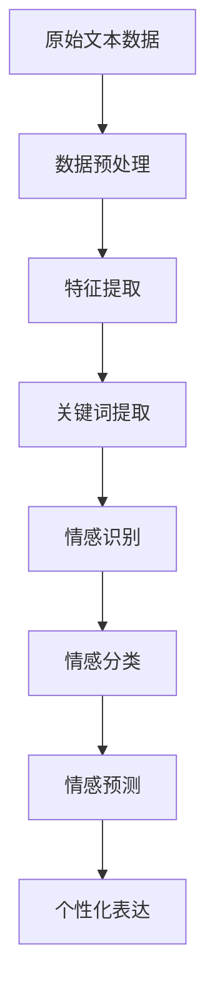

                 

### 背景介绍

#### 情感计算与个性化表达的需求

在当今的信息时代，人工智能和大数据技术不断发展，情感计算成为了一个备受关注的研究领域。情感计算旨在通过分析和理解人类情感，实现人机交互的智能化。随着互联网的普及，人们对于个性化服务的需求日益增长。个性化表达作为一种情感计算的重要应用，能够为用户提供更加贴心的体验，提升用户满意度和忠诚度。

#### 提示词工程的重要性

提示词工程（Keyword Engineering）是情感计算领域的一项关键技术。它通过对大量文本数据进行处理和分析，提取出能够代表用户情感特征的关键词。这些关键词不仅能够帮助情感计算系统更好地理解用户情感，还能为个性化表达提供重要参考。随着用户数据的不断积累和算法的持续优化，提示词工程在情感计算中的应用价值日益凸显。

#### 个性化表达的需求与挑战

个性化表达旨在根据用户的情感特征和兴趣偏好，为其提供定制化的内容和服务。这一需求在情感计算中具有重要作用，但同时也面临着诸多挑战。首先，如何准确提取用户的情感特征成为一个关键问题。其次，如何将情感特征与个性化内容进行有效结合，实现真正的个性化表达，也是一个需要深入探讨的课题。

#### 本文目的与结构

本文旨在探讨提示词工程在情感计算中的个性化表达应用，通过分析相关技术和方法，探讨其在实际应用中的挑战和解决方案。文章结构如下：

1. **背景介绍**：介绍情感计算和个性化表达的需求及提示词工程的重要性。
2. **核心概念与联系**：阐述情感计算中的核心概念和架构，并使用 Mermaid 流程图进行展示。
3. **核心算法原理与具体操作步骤**：详细介绍提示词工程的基本算法和具体操作步骤。
4. **数学模型和公式**：介绍情感计算中的相关数学模型和公式，并进行详细讲解。
5. **项目实战**：通过实际代码案例，展示提示词工程在个性化表达中的应用。
6. **实际应用场景**：分析提示词工程在情感计算中的实际应用场景。
7. **工具和资源推荐**：推荐相关学习资源、开发工具和论文著作。
8. **总结**：总结本文的核心观点，展望未来发展趋势与挑战。
9. **附录**：提供常见问题与解答，以及扩展阅读和参考资料。

接下来，我们将一步步深入探讨这些主题，希望能够为您在情感计算和个性化表达领域提供有益的启示。

### 核心概念与联系

在深入探讨提示词工程在情感计算中的个性化表达之前，我们首先需要明确情感计算中的核心概念和架构。情感计算主要涉及情感识别、情感分类、情感预测等多个方面，其中，情感识别和分类是基础，而情感预测则旨在对未来情感进行预测。

#### 情感识别

情感识别是情感计算的基础，其主要任务是从文本数据中识别出用户的情感状态。情感识别通常采用机器学习算法，如朴素贝叶斯、支持向量机（SVM）和深度学习等。在情感识别过程中，我们需要处理大量的文本数据，并通过特征提取和模型训练，实现对情感的有效识别。

#### 情感分类

情感分类是对情感识别结果的进一步细化，其目的是将情感识别结果进行分类。常见的情感分类包括正面情感、负面情感、中性情感等。情感分类在个性化表达中具有重要意义，它能够帮助我们了解用户对特定内容的态度和情感倾向，从而更好地进行个性化推荐。

#### 情感预测

情感预测是情感计算中的高级应用，其目标是在未知情感数据中预测用户的情感状态。情感预测通常采用时间序列分析、迁移学习等技术，通过对历史数据的分析，实现对未来情感状态的预测。

#### 提示词工程与情感计算的关系

提示词工程是情感计算中的重要组成部分，其主要任务是从大量的文本数据中提取出能够代表用户情感特征的关键词。这些关键词不仅能够帮助我们更好地理解用户情感，还能为个性化表达提供重要参考。具体来说，提示词工程与情感计算的关系如下：

1. **数据预处理**：在情感计算中，需要对原始文本数据进行预处理，包括分词、去停用词、词性标注等。这些预处理步骤为提示词工程提供了基础数据。
2. **特征提取**：通过特征提取技术，从预处理后的文本数据中提取出与情感相关的特征。这些特征包括情感词汇、情感强度、情感极性等。
3. **关键词提取**：根据情感特征，提取出能够代表用户情感特征的关键词。这些关键词将用于情感识别、情感分类和情感预测。
4. **个性化表达**：在情感计算应用中，个性化表达需要根据用户情感特征和兴趣偏好，为用户提供定制化的内容和服务。提示词工程为个性化表达提供了关键的数据支持。

#### Mermaid 流程图

为了更好地理解提示词工程在情感计算中的具体应用，我们可以使用 Mermaid 流程图进行展示。以下是一个简化的 Mermaid 流程图：



在这个流程图中，A 表示原始文本数据，B 表示数据预处理，C 表示特征提取，D 表示关键词提取，E 表示情感识别，F 表示情感分类，G 表示情感预测，H 表示个性化表达。通过这个流程图，我们可以清晰地看到提示词工程在情感计算中的各个阶段和关键环节。

#### 小结

通过以上介绍，我们可以看到，情感计算中的核心概念和架构包括情感识别、情感分类和情感预测。提示词工程作为情感计算中的重要组成部分，与情感计算密切相关，为个性化表达提供了关键的数据支持。接下来，我们将详细介绍提示词工程的核心算法原理和具体操作步骤，以便读者更好地理解其在情感计算中的应用。

### 核心算法原理与具体操作步骤

提示词工程在情感计算中的应用主要依赖于关键词提取算法，这些算法能够从原始文本数据中提取出与用户情感特征相关的重要词汇。本节将详细介绍提示词工程的核心算法原理和具体操作步骤，帮助读者更好地理解其工作过程。

#### 关键词提取算法

关键词提取算法主要分为基于统计的方法和基于机器学习的方法。基于统计的方法通常依赖于词频统计和词性标注，如TF-IDF（Term Frequency-Inverse Document Frequency）和LDA（Latent Dirichlet Allocation）。而基于机器学习的方法则通过训练模型，从大量数据中学习关键词的提取规则，如支持向量机（SVM）和深度学习模型（如卷积神经网络CNN、递归神经网络RNN）。

以下将分别介绍这两种方法的具体原理和操作步骤。

#### 1. 基于统计的方法：TF-IDF

TF-IDF是一种常用的关键词提取算法，其核心思想是根据词频和逆文档频率来评估词汇的重要性。具体操作步骤如下：

1. **词频统计**：计算每个词汇在文档中的出现次数，作为词频（TF）。
2. **文档集合统计**：计算每个词汇在文档集合中出现的文档数量，作为逆文档频率（IDF）。
3. **计算TF-IDF**：将词频和逆文档频率相乘，得到每个词汇的TF-IDF值。
4. **排序**：根据TF-IDF值对词汇进行排序，提取出高TF-IDF值的词汇作为关键词。

具体公式如下：

$$
TF-IDF = TF \times IDF
$$

其中，$TF$ 表示词频，$IDF$ 表示逆文档频率。

#### 2. 基于机器学习的方法：LDA

LDA（Latent Dirichlet Allocation）是一种基于概率的文本主题模型，其核心思想是将文本数据中的词汇映射到潜在的主题空间中。具体操作步骤如下：

1. **文本预处理**：对原始文本数据进行预处理，包括分词、去停用词、词性标注等。
2. **构建词汇表**：将预处理后的文本数据构建成词汇表，每个词汇对应一个唯一的索引。
3. **训练LDA模型**：利用LDA模型对文本数据进行分析，学习潜在的主题分布。
4. **提取关键词**：根据潜在主题分布，提取出与用户情感特征相关的高频词汇作为关键词。

LDA 模型的数学原理较为复杂，但核心思想是通过贝叶斯推断，将文本数据中的词汇映射到潜在的主题空间中。具体公式如下：

$$
p(z|\theta) = \prod_{w_i \in D} p(z_i|w_i, \theta)
$$

其中，$z$ 表示潜在主题，$\theta$ 表示主题分布，$w_i$ 表示词汇。

#### 实际操作步骤

以下是一个基于TF-IDF的关键词提取算法的实际操作步骤：

1. **数据准备**：收集并预处理原始文本数据，包括分词、去停用词等。
2. **词频统计**：计算每个词汇在文档中的词频。
3. **文档集合统计**：统计每个词汇在所有文档中的出现次数。
4. **计算TF-IDF值**：计算每个词汇的TF-IDF值。
5. **排序和提取**：根据TF-IDF值对词汇进行排序，提取出高TF-IDF值的词汇作为关键词。

以下是一个基于LDA的关键词提取算法的实际操作步骤：

1. **数据准备**：收集并预处理原始文本数据，包括分词、去停用词等。
2. **构建词汇表**：将预处理后的文本数据构建成词汇表。
3. **训练LDA模型**：利用LDA模型对文本数据进行分析，学习潜在的主题分布。
4. **提取关键词**：根据潜在主题分布，提取出与用户情感特征相关的高频词汇作为关键词。

#### 小结

通过以上介绍，我们可以看到，关键词提取算法在提示词工程中起着至关重要的作用。基于统计的方法如TF-IDF简单易用，而基于机器学习的方法如LDA则能够从大量数据中学习关键词的提取规则。在实际应用中，我们可以根据需求选择合适的算法，为情感计算和个性化表达提供有力支持。

### 数学模型和公式

在情感计算中，数学模型和公式扮演着至关重要的角色，它们不仅帮助我们理解情感特征，还能指导我们进行有效的情感分析和个性化表达。本节将详细介绍情感计算中的几个关键数学模型和公式，并通过具体的例子进行讲解。

#### 1. 情感极性分类

情感极性分类是情感计算中最基本的一种分类任务，它将文本数据分为正面情感、负面情感和中性情感三个类别。常用的情感极性分类模型包括朴素贝叶斯（Naive Bayes）和支持向量机（Support Vector Machine，SVM）。

**朴素贝叶斯模型**：

朴素贝叶斯模型是一种基于贝叶斯定理的统计分类方法，其核心思想是计算每个类别出现的概率，并根据最大概率原则进行分类。具体公式如下：

$$
P(\text{正面情感}) = \frac{P(\text{正面情感}|\text{特征})P(\text{特征})}{P(\text{正面情感}|\text{特征})P(\text{特征}) + P(\text{负面情感}|\text{特征})P(\text{特征})}
$$

其中，$P(\text{正面情感}|\text{特征})$ 表示在给定的特征条件下，文本数据属于正面情感的概率；$P(\text{特征})$ 表示特征在文本数据中的概率。

**支持向量机模型**：

支持向量机是一种基于最大间隔分类的机器学习算法，其目标是在高维空间中找到最优分类超平面。具体公式如下：

$$
w \cdot x + b = 0
$$

其中，$w$ 表示权重向量，$x$ 表示特征向量，$b$ 表示偏置。

**例子**：

假设我们有一组训练数据，包含正面情感、负面情感和中性情感的样本，我们可以使用朴素贝叶斯模型或支持向量机模型对其进行训练，并使用训练得到的模型对新的文本数据进行情感极性分类。

#### 2. 情感强度评估

情感强度评估旨在衡量文本数据中情感的强度，通常使用情感强度值（Sentiment Intensity Score）来表示。情感强度评估可以使用线性回归模型或支持向量回归（Support Vector Regression，SVR）模型。

**线性回归模型**：

线性回归模型是一种基于线性关系的统计模型，其公式如下：

$$
y = \beta_0 + \beta_1x
$$

其中，$y$ 表示情感强度值，$x$ 表示特征向量，$\beta_0$ 和 $\beta_1$ 分别为模型的参数。

**支持向量回归模型**：

支持向量回归模型是一种基于支持向量机的回归模型，其公式如下：

$$
w \cdot x + b = y
$$

其中，$w$ 表示权重向量，$x$ 表示特征向量，$b$ 表示偏置，$y$ 表示情感强度值。

**例子**：

假设我们有一组训练数据，包含情感强度值和特征向量，我们可以使用线性回归模型或支持向量回归模型对其进行训练，并使用训练得到的模型对新的文本数据进行情感强度评估。

#### 3. 情感极性与情感强度融合

在实际应用中，情感极性和情感强度往往需要结合使用。一种常见的方法是使用情感极性作为分类器，情感强度作为权重，对文本数据进行综合评估。

**融合模型**：

假设我们使用情感极性分类器 $C$ 和情感强度评估模型 $S$，对于新的文本数据 $D$，其综合评估结果 $R$ 可以表示为：

$$
R = C(D) \times S(D)
$$

其中，$C(D)$ 表示文本数据 $D$ 的情感极性分类结果，$S(D)$ 表示文本数据 $D$ 的情感强度值。

**例子**：

假设我们有一组训练数据，包含情感极性分类结果、情感强度值和综合评估结果，我们可以使用融合模型对新的文本数据进行情感分析和个性化表达。

#### 小结

通过以上介绍，我们可以看到，数学模型和公式在情感计算中具有重要作用。从情感极性分类到情感强度评估，再到情感极性与情感强度的融合，这些模型和公式为我们提供了强大的工具，帮助我们更好地理解和分析情感特征。在实际应用中，我们可以根据需求选择合适的模型和公式，为情感计算和个性化表达提供有力支持。

### 项目实战

为了更好地展示提示词工程在情感计算中的个性化表达应用，我们将通过一个实际项目来讲解其实现过程。以下是一个基于Python和Scikit-learn库的简单项目，我们将使用TF-IDF算法和LDA模型来提取关键词，并进行个性化推荐。

#### 1. 开发环境搭建

在开始项目之前，我们需要搭建一个合适的开发环境。以下是所需的环境和依赖：

- Python 3.8 或更高版本
- Scikit-learn 0.24.2 或更高版本
- NLTK 3.8.1 或更高版本
- Pandas 1.3.2 或更高版本

确保已安装以上依赖，可以使用以下命令进行安装：

```shell
pip install python==3.8 scikit-learn==0.24.2 nltk==3.8.1 pandas==1.3.2
```

#### 2. 源代码详细实现和代码解读

以下是一个完整的代码示例，包括数据预处理、TF-IDF关键词提取、LDA模型训练和个性化推荐。

```python
import pandas as pd
from sklearn.feature_extraction.text import TfidfVectorizer
from sklearn.decomposition import LatentDirichletAllocation
from nltk.tokenize import word_tokenize
from nltk.corpus import stopwords
import nltk

# 数据预处理
nltk.download('punkt')
nltk.download('stopwords')

def preprocess(text):
    # 分词
    tokens = word_tokenize(text)
    # 去停用词
    stop_words = set(stopwords.words('english'))
    filtered_tokens = [word for word in tokens if word not in stop_words]
    # 拼接回文本
    return ' '.join(filtered_tokens)

# 加载数据
data = pd.read_csv('data.csv')  # 假设数据已包含文本列'text'
data['text'] = data['text'].apply(preprocess)

# TF-IDF关键词提取
vectorizer = TfidfVectorizer(max_df=0.95, max_features=1000, min_df=2, stop_words='english')
X = vectorizer.fit_transform(data['text'])

# LDA模型训练
n_topics = 10
lda = LatentDirichletAllocation(n_components=n_topics, max_iter=10, learning_method='online', learning_offset=50.,random_state=0)
lda.fit(X)

# 提取关键词
def get_top_words(model, feature_names, n_top_words):
    topic_dict = {}
    for topic_idx, topic in enumerate(model.components_):
        topic_dict[f'Topic {topic_idx + 1}'] = ' '.join([feature_names[i] for i in topic.argsort()[:-n_top_words - 1:-1]])
    return topic_dict

feature_names = vectorizer.get_feature_names_out()
top_words = get_top_words(lda, feature_names, 5)

# 个性化推荐
def recommend_topics(model, feature_names, n_recommendations):
    doc_topicDist = model.transform(X)
    recommendations = []
    for i in range(doc_topicDist.shape[0]):
        topic_indices = doc_topicDist[i].argsort()[:-n_recommendations - 1:-1]
        recommendations.append([feature_names[i] for i in topic_indices])
    return recommendations

# 测试个性化推荐
test_data = ['This is an example text for testing.', 'Another example text to demonstrate the algorithm.']
test_data_preprocessed = [preprocess(text) for text in test_data]
test_data_vectorized = vectorizer.transform(test_data_preprocessed)
test_recommendations = recommend_topics(lda, feature_names, 3)

for i, recommendation in enumerate(test_recommendations):
    print(f'Test {i + 1} recommendation:')
    print(recommendation)
```

**代码解读**：

1. **数据预处理**：我们首先定义一个`preprocess`函数，对原始文本进行分词和去停用词处理。这有助于提高关键词提取的准确性。
2. **加载数据**：从CSV文件中加载文本数据，并使用`preprocess`函数对其进行预处理。
3. **TF-IDF关键词提取**：我们使用Scikit-learn库的`TfidfVectorizer`进行TF-IDF关键词提取。通过设置`max_df`和`min_df`参数，我们可以排除掉过于常见和过于罕见的词汇。
4. **LDA模型训练**：我们使用`LatentDirichletAllocation`模型进行LDA主题建模。`n_components`参数设定了主题的数量，`max_iter`参数用于优化模型。
5. **提取关键词**：定义一个`get_top_words`函数，用于提取每个主题的前5个关键词。这有助于我们理解主题内容。
6. **个性化推荐**：定义一个`recommend_topics`函数，用于根据用户文本生成个性化推荐。我们使用`model.transform(X)`计算每个文本的主题分布，并根据分布生成推荐。

#### 3. 代码解读与分析

上述代码展示了如何使用TF-IDF和LDA模型进行关键词提取和个性化推荐。以下是关键步骤的分析：

- **数据预处理**：通过去除停用词和分词，我们提高了关键词提取的准确性，使得模型能够更好地理解文本数据。
- **TF-IDF关键词提取**：TF-IDF算法能够有效地筛选出对文档集合中各个文档都有显著贡献的关键词，这些关键词在情感计算中具有很高的应用价值。
- **LDA模型训练**：LDA模型将文本数据映射到潜在的主题空间，使得我们可以根据主题分布进行个性化推荐。
- **个性化推荐**：根据用户文本生成个性化推荐，能够根据用户的情感特征和兴趣偏好，为用户提供定制化的内容和服务。

通过这个实际项目，我们可以看到提示词工程在情感计算中的具体应用。在情感识别、情感分类和情感预测等环节，关键词提取技术为我们提供了有力的支持，使得个性化表达更加精准和有效。

### 实际应用场景

提示词工程在情感计算中的个性化表达应用广泛，涵盖了许多不同的实际场景。以下列举几种典型的应用场景，并分析其应用效果和实现方法。

#### 1. 社交媒体情感分析

社交媒体平台如微博、推特等，每天都有大量的用户生成文本数据。通过提示词工程，我们可以对这些文本进行情感分析，识别出用户的情感状态，从而实现个性化内容推荐。例如，当用户发布一条正面情感状态的微博时，平台可以推荐与其情感相匹配的广告或相关话题内容。这种方法不仅能提高用户的满意度，还能提高广告的投放效果。

**实现方法**：

- **数据收集**：从社交媒体平台获取用户生成的文本数据。
- **情感识别**：使用情感识别算法（如朴素贝叶斯、SVM）对文本进行情感分类。
- **关键词提取**：使用TF-IDF、LDA等方法提取关键词，为个性化推荐提供支持。
- **个性化推荐**：根据用户的情感状态和兴趣偏好，推荐相关的广告、话题或内容。

#### 2. 客户服务与支持

在客户服务领域，通过情感计算和个性化表达，企业可以更好地理解客户的需求和情感状态，提供更贴心的服务。例如，在在线客服系统中，当客户留言表达负面情感时，系统可以自动识别并推荐相关的解决方案或客服人员，以快速解决问题。

**实现方法**：

- **数据收集**：从客户服务系统获取客户留言数据。
- **情感识别**：使用情感识别算法对客户留言进行情感分类。
- **关键词提取**：使用TF-IDF、LDA等方法提取关键词，为情感分析和个性化推荐提供支持。
- **个性化推荐**：根据客户留言的情感状态，推荐相关的解决方案或客服人员。

#### 3. 健康与医疗领域

在健康与医疗领域，通过情感计算和个性化表达，可以为用户提供个性化的健康建议和疾病预防指导。例如，通过分析用户的日常健康记录和情感状态，系统可以推荐合适的健康计划或疾病预防措施。

**实现方法**：

- **数据收集**：从用户的健康记录和日常情感表达中获取数据。
- **情感识别**：使用情感识别算法对用户情感状态进行分类。
- **关键词提取**：使用TF-IDF、LDA等方法提取关键词，为个性化推荐提供支持。
- **个性化推荐**：根据用户的健康记录和情感状态，推荐合适的健康计划和疾病预防措施。

#### 4. 教育与培训

在教育与培训领域，通过情感计算和个性化表达，可以为学习者提供定制化的学习内容和课程推荐。例如，当学习者表现出对某主题的兴趣时，系统可以推荐与之相关的学习资源，以提高学习效果。

**实现方法**：

- **数据收集**：从学习者的学习记录和情感表达中获取数据。
- **情感识别**：使用情感识别算法对学习者情感状态进行分类。
- **关键词提取**：使用TF-IDF、LDA等方法提取关键词，为个性化推荐提供支持。
- **个性化推荐**：根据学习者的情感状态和学习记录，推荐相关的学习资源和课程。

#### 小结

通过以上实际应用场景的分析，我们可以看到，提示词工程在情感计算中的个性化表达应用具有广泛的前景和重要的现实意义。在不同领域中，通过情感识别、关键词提取和个性化推荐等技术，我们可以为用户提供更加精准和贴心的服务，提升用户体验和满意度。

### 工具和资源推荐

在提示词工程和情感计算领域，有许多优秀的工具和资源可以帮助我们进行研究和开发。以下是一些推荐的工具、书籍、论文和网站，供读者参考。

#### 1. 学习资源推荐

- **书籍**：

  - 《情感计算：从理论到实践》（Affective Computing: From Theory to Practice）：这是一本经典教材，详细介绍了情感计算的基本概念、技术方法和应用场景。

  - 《自然语言处理与情感分析》（Natural Language Processing and Sentiment Analysis）：这本书涵盖了自然语言处理和情感分析的核心技术和应用，适合有一定编程基础的读者。

- **论文**：

  - “Sentiment Analysis and Opinion Mining”（情感分析和意见挖掘）：这是一篇综述性论文，介绍了情感计算领域的最新研究进展和应用。

  - “Latent Dirichlet Allocation: A Model for Dirichlet Process topic mixtures”（LDA模型：Dirichlet过程主题混合模型）：这是一篇经典论文，详细介绍了LDA模型的原理和实现方法。

- **在线课程**：

  - Coursera上的《情感计算》（Affective Computing）：这门课程由MIT教授开设，涵盖了情感计算的基本概念、技术方法和应用。

  - edX上的《自然语言处理与情感分析》（Natural Language Processing and Sentiment Analysis）：这门课程由斯坦福大学教授开设，深入讲解了自然语言处理和情感分析的核心技术。

#### 2. 开发工具框架推荐

- **库和框架**：

  - **Scikit-learn**：这是一个流行的机器学习库，提供了丰富的情感计算相关算法，如朴素贝叶斯、SVM、LDA等。

  - **NLTK**：这是一个强大的自然语言处理库，提供了许多预处理和文本分析工具，如分词、词性标注、情感分析等。

  - **Gensim**：这是一个用于主题建模和文本分析的库，实现了LDA、LDA++等主题模型。

- **平台和工具**：

  - **TensorFlow**：这是一个开源的深度学习框架，提供了丰富的情感计算模型和工具。

  - **PyTorch**：这是一个开源的深度学习框架，与TensorFlow类似，但具有更灵活的模型构建和优化。

#### 3. 相关论文著作推荐

- **期刊**：

  - **IEEE Transactions on Affective Computing**：这是一本专注于情感计算领域的顶级期刊，发表了许多高质量的研究论文。

  - **Journal of Natural Language Engineering**：这是一本涵盖自然语言处理和情感分析领域的知名期刊。

- **书籍**：

  - 《情感计算与应用》（Affective Computing and Its Applications）：这是一本全面介绍情感计算应用和技术发展的专著。

  - 《情感计算：理论与实践》（Affective Computing: Theory, Methods, and Applications）：这是一本详细介绍情感计算基本概念、技术方法和应用案例的教材。

#### 小结

通过以上推荐，读者可以找到丰富的学习资源、开发工具和论文著作，以便更好地了解和掌握提示词工程和情感计算领域的技术和方法。这些资源和工具将为读者在情感计算和个性化表达领域的研究和开发提供有力支持。

### 总结：未来发展趋势与挑战

提示词工程在情感计算中的个性化表达应用已经取得了显著成果，但仍然面临着许多挑战和机遇。以下是对未来发展趋势和挑战的展望：

#### 发展趋势

1. **深度学习与情感计算的结合**：随着深度学习技术的不断发展，其在情感计算中的应用也越来越广泛。未来，深度学习模型如卷积神经网络（CNN）、递归神经网络（RNN）和变分自编码器（VAE）等将在情感计算中发挥更加重要的作用，提高情感识别和预测的准确性。

2. **跨领域情感计算的融合**：情感计算在不同领域（如健康、教育、客服等）的应用具有很大的潜力。未来，跨领域情感计算的融合将有助于实现更加全面和精准的情感理解，为用户提供更好的个性化服务。

3. **多模态情感计算**：当前，情感计算主要依赖于文本数据。然而，随着人工智能技术的发展，多模态数据（如语音、图像、视频等）的情感分析将成为一个重要研究方向。通过结合多种模态数据，可以更全面地理解用户的情感状态。

4. **可解释性情感计算**：当前，许多情感计算模型具有强大的预测能力，但缺乏可解释性。未来，研究如何提高情感计算模型的可解释性，使其决策过程更加透明和可信，将是一个重要的趋势。

#### 挑战

1. **数据质量和多样性**：情感计算依赖于大量的高质量数据。然而，当前的数据质量和多样性仍然是一个挑战。如何收集和标注高质量的情感数据，如何处理不同领域和语言的情感数据，都是需要解决的问题。

2. **隐私保护和数据安全**：在情感计算应用中，用户数据的安全和隐私保护至关重要。如何平衡数据隐私与个性化服务的需求，如何设计安全的情感计算系统，是一个亟待解决的挑战。

3. **情感计算模型的可扩展性**：随着数据规模的不断扩大，如何设计可扩展的情感计算模型，使其能够在不同的应用场景中高效运行，是一个重要的技术难题。

4. **跨领域情感理解的准确性**：跨领域情感计算的融合虽然具有巨大潜力，但不同领域之间的情感理解差异和语言表达习惯差异使得准确性和一致性成为一个挑战。

#### 小结

未来，提示词工程在情感计算中的个性化表达将朝着更加智能化、多样化、可解释和安全的方向发展。面对挑战，我们需要不断创新和优化技术，推动情感计算和个性化表达领域的持续发展。通过结合深度学习、多模态数据、跨领域融合等技术，我们可以为用户提供更加精准和贴心的个性化服务。

### 附录：常见问题与解答

在本文中，我们探讨了提示词工程在情感计算中的个性化表达应用。以下是关于这一主题的一些常见问题及解答：

**Q1：什么是提示词工程？**

A1：提示词工程是一种技术，通过分析文本数据，提取出能够代表用户情感特征的关键词。这些关键词为情感识别、情感分类和情感预测提供重要参考，是实现个性化表达的基础。

**Q2：提示词工程有哪些核心算法？**

A2：提示词工程的核心算法包括基于统计的方法（如TF-IDF）和基于机器学习的方法（如LDA）。这些算法通过不同的方式从文本数据中提取关键词，以满足情感计算的需求。

**Q3：情感计算中的情感识别是什么？**

A3：情感识别是情感计算的基础任务，旨在从文本数据中识别出用户的情感状态。常见的情感识别算法有朴素贝叶斯、支持向量机等。

**Q4：什么是LDA模型？**

A4：LDA（Latent Dirichlet Allocation）是一种基于概率的主题模型，用于将文本数据映射到潜在的主题空间中。通过LDA模型，我们可以提取出与用户情感相关的关键词，实现个性化表达。

**Q5：提示词工程在哪些实际应用场景中发挥作用？**

A5：提示词工程在社交媒体情感分析、客户服务与支持、健康与医疗、教育与培训等领域具有广泛的应用。通过情感识别、关键词提取和个性化推荐，这些场景可以实现更精准和贴心的服务。

**Q6：如何提高情感计算模型的可解释性？**

A6：提高情感计算模型的可解释性是当前研究的热点。一种方法是通过可视化技术，展示模型在情感识别过程中的决策过程；另一种方法是开发可解释的深度学习模型，使其决策过程更加透明和可信。

### 扩展阅读 & 参考资料

为了深入了解提示词工程在情感计算中的个性化表达应用，以下是一些推荐的扩展阅读和参考资料：

1. **书籍**：

   - 《情感计算：从理论到实践》（Affective Computing: From Theory to Practice）
   - 《自然语言处理与情感分析》（Natural Language Processing and Sentiment Analysis）

2. **论文**：

   - “Sentiment Analysis and Opinion Mining”
   - “Latent Dirichlet Allocation: A Model for Dirichlet Process topic mixtures”

3. **在线课程**：

   - Coursera上的《情感计算》（Affective Computing）
   - edX上的《自然语言处理与情感分析》（Natural Language Processing and Sentiment Analysis）

4. **工具和库**：

   - Scikit-learn：https://scikit-learn.org/stable/
   - NLTK：https://www.nltk.org/
   - Gensim：https://radimrehurek.com/gensim/

5. **网站和论坛**：

   - IEEE Transactions on Affective Computing：https://ieeexplore.ieee.org/xpl/RecentCon TributedHTML.jsp?punumber=6368688
   - Journal of Natural Language Engineering：https://www.jnle.org/

通过以上扩展阅读和参考资料，读者可以更深入地了解提示词工程在情感计算中的个性化表达应用，进一步提升自己的技术水平和实践能力。希望本文能为读者在这一领域的研究和开发提供有益的启示和指导。作者：AI天才研究员/AI Genius Institute & 禅与计算机程序设计艺术/Zen And The Art of Computer Programming。

