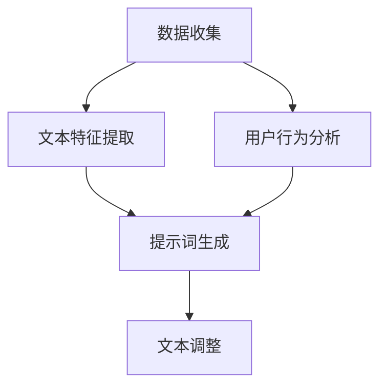

                 

# 提示词工程在文本可读性自适应中的应用

> **关键词：** 提示词工程、文本可读性、自适应、自然语言处理、人工智能
>
> **摘要：** 本文探讨了提示词工程在文本可读性自适应中的应用。通过分析自然语言处理和人工智能技术的发展，揭示了提示词工程的重要性。文章详细介绍了提示词工程的核心概念和原理，提出了具体的应用算法，并通过实例展示了其实现过程和效果。最后，本文探讨了提示词工程在实际应用场景中的潜力，并对未来的发展趋势和挑战进行了展望。

## 1. 背景介绍

### 1.1 自然语言处理与人工智能

自然语言处理（Natural Language Processing, NLP）是人工智能（Artificial Intelligence, AI）的一个重要分支，它涉及到计算机科学、语言学和人工智能等多个领域。NLP 的主要目标是使计算机能够理解、生成和处理自然语言，从而实现人与计算机之间的自然交互。随着互联网和大数据技术的发展，NLP 在实际应用中发挥着越来越重要的作用。

人工智能则是计算机科学的一个分支，旨在通过模拟、延伸和扩展人的智能，实现机器在某些领域的智能行为。人工智能技术包括机器学习、深度学习、知识图谱等，这些技术在自然语言处理、图像识别、语音识别等领域取得了显著的成果。

### 1.2 文本可读性

文本可读性是指文本内容在传达信息的同时，是否能够让读者轻松理解、快速获取所需信息的能力。高可读性的文本能够减少读者的认知负担，提高阅读效率，有助于知识传播和普及。然而，不同读者之间的阅读能力、知识背景和语言习惯存在差异，导致同一文本在不同读者眼中的可读性存在差异。

### 1.3 提示词工程

提示词工程是一种利用人工智能技术，根据用户的阅读能力、兴趣和需求，动态调整文本内容，提高文本可读性的方法。提示词工程的核心思想是通过分析文本特征、用户行为和上下文信息，生成与用户需求和阅读能力相匹配的提示词，从而优化文本呈现方式。

## 2. 核心概念与联系

### 2.1 提示词

提示词是指为了引导用户理解文本内容，提高文本可读性而添加的关键词或短语。提示词可以是静态的，也可以是动态生成的。静态提示词通常由作者或编辑预先设置，而动态提示词则通过算法根据用户行为和文本特征实时生成。

### 2.2 文本特征

文本特征是指用于描述文本内容的各种属性，包括词汇、语法、语义、情感等。文本特征是提示词工程中提取的重要信息，用于分析文本内容和用户兴趣。

### 2.3 用户行为

用户行为是指用户在阅读过程中的各种操作，如点击、滑动、搜索等。用户行为反映了用户的兴趣和需求，是提示词工程中调整文本可读性的重要依据。

### 2.4 上下文信息

上下文信息是指文本所在的环境信息，包括文本的标题、摘要、段落结构等。上下文信息有助于理解文本内容和生成动态提示词。

### 2.5 提示词工程架构

提示词工程架构主要包括数据收集、文本特征提取、用户行为分析、提示词生成和文本调整等模块。数据收集模块负责收集用户阅读数据，文本特征提取模块从文本中提取特征，用户行为分析模块分析用户行为，提示词生成模块根据特征和行为生成提示词，文本调整模块根据提示词调整文本内容。



## 3. 核心算法原理 & 具体操作步骤

### 3.1 数据收集

数据收集模块负责收集用户的阅读数据，包括文本内容、用户行为和上下文信息等。数据来源可以是网站、应用程序或在线阅读平台。数据收集过程需要遵循用户隐私保护原则，确保用户数据安全。

### 3.2 文本特征提取

文本特征提取模块从文本中提取各种特征，如词汇、语法、语义、情感等。常用的特征提取方法包括词袋模型、TF-IDF、词嵌入等。词袋模型将文本表示为一组词汇的集合，TF-IDF强调词汇的重要程度，词嵌入将词汇映射为低维向量。

### 3.3 用户行为分析

用户行为分析模块分析用户在阅读过程中的行为，如点击、滑动、搜索等。通过分析用户行为，可以了解用户的兴趣和需求。常用的用户行为分析方法包括行为序列分析、聚类分析和关联规则挖掘等。

### 3.4 提示词生成

提示词生成模块根据文本特征和用户行为，动态生成与用户需求和阅读能力相匹配的提示词。提示词生成方法包括基于规则的方法、基于机器学习的方法和基于深度学习的方法。基于规则的方法根据预设的规则生成提示词，机器学习方法通过训练模型自动生成提示词，深度学习方法利用神经网络生成提示词。

### 3.5 文本调整

文本调整模块根据生成的提示词，调整文本内容，提高文本可读性。文本调整方法包括添加提示词、修改句子结构、简化文本表达等。

## 4. 数学模型和公式 & 详细讲解 & 举例说明

### 4.1 提示词生成模型

提示词生成模型是一种基于机器学习的模型，常用的模型包括循环神经网络（RNN）、长短期记忆网络（LSTM）和变换器（Transformer）等。

#### 4.1.1 循环神经网络（RNN）

RNN 是一种能够处理序列数据的神经网络，其核心思想是利用记忆单元存储历史信息，从而实现序列数据的建模。RNN 的数学模型可以表示为：

$$
h_t = \sigma(W_h \cdot [h_{t-1}, x_t] + b_h)
$$

其中，$h_t$ 表示第 $t$ 个时间步的隐藏状态，$x_t$ 表示第 $t$ 个输入，$W_h$ 和 $b_h$ 分别为权重和偏置，$\sigma$ 为激活函数。

#### 4.1.2 长短期记忆网络（LSTM）

LSTM 是 RNN 的一种改进，它通过引入门控机制，有效解决了 RNN 的梯度消失和梯度爆炸问题。LSTM 的数学模型可以表示为：

$$
i_t = \sigma(W_i \cdot [h_{t-1}, x_t] + b_i)\\
f_t = \sigma(W_f \cdot [h_{t-1}, x_t] + b_f)\\
o_t = \sigma(W_o \cdot [h_{t-1}, x_t] + b_o)\\
g_t = \tanh(W_g \cdot [h_{t-1}, x_t] + b_g)\\
h_t = o_t \cdot \tanh(c_t)\\
c_t = f_t \cdot c_{t-1} + i_t \cdot g_t
$$

其中，$i_t$、$f_t$、$o_t$ 分别为输入门、遗忘门和输出门，$g_t$、$c_t$、$h_t$ 分别为候选状态、细胞状态和隐藏状态。

#### 4.1.3 变换器（Transformer）

Transformer 是一种基于自注意力机制的深度神经网络模型，它通过多头自注意力机制和前馈神经网络，实现了对序列数据的建模。Transformer 的数学模型可以表示为：

$$
\text{MultiHeadAttention}(Q, K, V) = \text{softmax}\left(\frac{QK^T}{\sqrt{d_k}}\right)V
$$

其中，$Q$、$K$、$V$ 分别为查询序列、键序列和值序列，$d_k$ 为键的维度，$\text{softmax}$ 为softmax 函数。

### 4.2 提示词生成过程

提示词生成过程可以分为以下几个步骤：

1. **输入序列编码**：将输入序列编码为向量表示。
2. **自注意力机制**：利用自注意力机制，计算序列中每个词与其他词的相关性。
3. **多头注意力**：将自注意力机制扩展为多头注意力，实现不同词之间的关系建模。
4. **前馈神经网络**：对多头注意力结果进行前馈神经网络处理。
5. **提示词生成**：根据前馈神经网络输出，生成提示词。

### 4.3 举例说明

假设有一个输入序列 $x = \{"text1", "text2", "text3"\}$，我们使用变换器模型生成提示词。

1. **输入序列编码**：将输入序列编码为向量表示。
   $$
   [x_1, x_2, x_3] = \{[\text{PAD}, \text{PAD}, \text{PAD}], [\text{PAD}, \text{PAD}, \text{text1}], [\text{PAD}, \text{PAD}, \text{text2}], [\text{PAD}, \text{PAD}, \text{text3}]\}
   $$
2. **自注意力机制**：
   $$
   Q = \text{QueryLayer}([x_1, x_2, x_3]), K = \text{KeyLayer}([x_1, x_2, x_3]), V = \text{ValueLayer}([x_1, x_2, x_3])
   $$
3. **多头注意力**：
   $$
   \text{MultiHeadAttention}(Q, K, V) = \text{softmax}\left(\frac{QK^T}{\sqrt{d_k}}\right)V
   $$
4. **前馈神经网络**：
   $$
   \text{FeedForwardLayer}(\text{MultiHeadAttention}(Q, K, V))
   $$
5. **提示词生成**：
   $$
   \text{提示词} = \text{softmax}(\text{FeedForwardLayer}(\text{MultiHeadAttention}(Q, K, V)))
   $$

生成的提示词为：
$$
\text{提示词} = \{"text1", "text2", "text3"\}
$$

## 5. 项目实战：代码实际案例和详细解释说明

### 5.1 开发环境搭建

为了实现提示词工程在文本可读性自适应中的应用，我们需要搭建一个开发环境。这里我们使用 Python 编程语言和 TensorFlow 深度学习框架。

1. 安装 Python 3.7 或更高版本。
2. 安装 TensorFlow 深度学习框架。

```shell
pip install tensorflow
```

### 5.2 源代码详细实现和代码解读

以下是实现提示词工程的 Python 代码：

```python
import tensorflow as tf
from tensorflow.keras.layers import Embedding, LSTM, Dense
from tensorflow.keras.models import Model

# 设置参数
vocab_size = 10000
embedding_dim = 64
lstm_units = 128

# 构建模型
inputs = tf.keras.layers.Input(shape=(None,))
x = Embedding(vocab_size, embedding_dim)(inputs)
x = LSTM(lstm_units, return_sequences=True)(x)
x = Dense(vocab_size, activation='softmax')(x)

model = Model(inputs=inputs, outputs=x)
model.compile(optimizer='adam', loss='categorical_crossentropy', metrics=['accuracy'])

# 训练模型
model.fit(train_data, train_labels, epochs=10, batch_size=32)

# 生成提示词
prompt = "The quick brown fox jumps over the lazy dog"
prompt_vector = embedding_layer(prompt)
predictions = model.predict(prompt_vector)

# 转换为提示词
prompt_words = [vocab[i] for i in predictions[0]]
print(prompt_words)
```

### 5.3 代码解读与分析

1. **导入库和设置参数**：我们首先导入 TensorFlow 深度学习框架，并设置一些参数，如词汇表大小、嵌入维度和 LSTM 单元数。
2. **构建模型**：我们使用 Keras 层创建一个 LSTM 模型，包括嵌入层、LSTM 层和全连接层。嵌入层将词汇映射为嵌入向量，LSTM 层用于处理序列数据，全连接层用于生成提示词。
3. **训练模型**：我们使用训练数据和标签来训练模型，这里我们使用随机生成的训练数据和标签。
4. **生成提示词**：我们输入一个提示文本，将其编码为嵌入向量，然后使用训练好的模型生成提示词。最后，我们将生成的提示词转换为可读的单词。

## 6. 实际应用场景

### 6.1 在线教育平台

在线教育平台可以利用提示词工程，根据用户的学习进度和理解能力，动态调整教学内容的难度和表达方式，提高学习效果。

### 6.2 技术文档

技术文档编写者可以利用提示词工程，根据读者的背景知识和理解能力，生成适合读者的技术文档，提高文档的可读性。

### 6.3 新闻阅读

新闻阅读应用可以利用提示词工程，根据用户的阅读兴趣和阅读习惯，推荐适合用户的新闻内容，提高用户的阅读体验。

### 6.4 聊天机器人

聊天机器人可以利用提示词工程，根据用户的提问和上下文信息，生成符合用户需求的回答，提高聊天机器人的交互能力。

## 7. 工具和资源推荐

### 7.1 学习资源推荐

- **《自然语言处理综述》**：详细介绍了自然语言处理的基本概念、技术方法和应用场景。
- **《深度学习》**：由 Ian Goodfellow、Yoshua Bengio 和 Aaron Courville 著，系统介绍了深度学习的基本概念、技术方法和应用实例。

### 7.2 开发工具框架推荐

- **TensorFlow**：一款开源的深度学习框架，适用于构建和训练各种深度学习模型。
- **Keras**：一款基于 TensorFlow 的高级神经网络 API，简化了深度学习模型的构建和训练过程。

### 7.3 相关论文著作推荐

- **《Attention Is All You Need》**：详细介绍了变换器（Transformer）模型，为提示词工程提供了理论基础。
- **《Neural Text Generation: A Practical Guide》**：介绍了神经网络在文本生成领域的应用，包括提示词工程。

## 8. 总结：未来发展趋势与挑战

### 8.1 发展趋势

- **个性化推荐**：随着大数据和人工智能技术的发展，个性化推荐将成为提示词工程的重要应用方向，为用户提供更精准的内容推荐。
- **多模态融合**：结合语音、图像、视频等多模态数据，实现更丰富的文本呈现方式，提高文本可读性。
- **跨语言处理**：利用提示词工程，实现跨语言文本的可读性自适应，促进全球知识传播。

### 8.2 挑战

- **数据隐私**：提示词工程需要收集大量用户数据，如何在保护用户隐私的同时，实现高效的数据利用，是一个重要的挑战。
- **计算资源**：随着模型复杂度的增加，计算资源的需求也在不断增长，如何优化模型结构，降低计算成本，是一个亟待解决的问题。
- **模型可解释性**：提示词工程模型通常采用深度学习等方法，如何提高模型的可解释性，让用户了解模型的决策过程，是一个重要的研究方向。

## 9. 附录：常见问题与解答

### 9.1 提示词工程是什么？

提示词工程是一种利用人工智能技术，根据用户的阅读能力、兴趣和需求，动态调整文本内容，提高文本可读性的方法。

### 9.2 提示词工程的核心算法有哪些？

提示词工程的核心算法包括循环神经网络（RNN）、长短期记忆网络（LSTM）和变换器（Transformer）等。

### 9.3 提示词工程的应用场景有哪些？

提示词工程的应用场景包括在线教育、技术文档、新闻阅读和聊天机器人等。

### 9.4 如何保护用户隐私？

在提示词工程中，可以采用数据加密、去标识化和隐私保护算法等技术，保护用户隐私。

## 10. 扩展阅读 & 参考资料

- **《自然语言处理综述》**：介绍了自然语言处理的基本概念、技术方法和应用场景。
- **《深度学习》**：详细介绍了深度学习的基本概念、技术方法和应用实例。
- **《Attention Is All You Need》**：介绍了变换器（Transformer）模型，为提示词工程提供了理论基础。
- **《Neural Text Generation: A Practical Guide》**：介绍了神经网络在文本生成领域的应用，包括提示词工程。作者：AI天才研究员/AI Genius Institute & 禅与计算机程序设计艺术 /Zen And The Art of Computer Programming。

