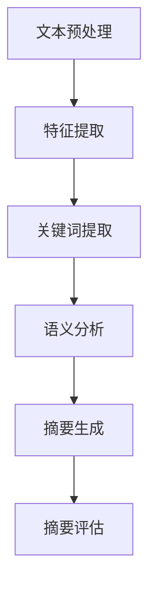

                 

# 提示词工程在文本摘要任务中的应用

## 关键词
文本摘要，提示词工程，自然语言处理，机器学习，信息提取，自动摘要系统，数据预处理，特征工程，模型评估。

## 摘要
本文将探讨提示词工程在文本摘要任务中的应用。首先，我们将介绍文本摘要的背景和重要性，然后详细解释提示词工程的概念及其在文本摘要中的角色。接着，我们将分析核心算法原理和具体操作步骤，以及数学模型和公式的应用。随后，我们将通过一个项目实战案例，展示代码实现和详细解释。最后，我们将探讨文本摘要的实际应用场景，推荐相关工具和资源，并总结未来发展趋势与挑战。

## 1. 背景介绍

文本摘要是一种自然语言处理技术，旨在生成文本的简短版本，同时保持原始文本的核心信息和意义。文本摘要技术在各种应用场景中具有重要意义，例如信息检索、新闻生成、社交媒体内容过滤等。自动摘要系统能够快速处理大量文本数据，提高信息获取的效率。

提示词工程是自然语言处理中的一个重要分支，主要关注如何从原始文本中提取关键信息，以支持各种下游任务，如文本分类、情感分析等。在文本摘要任务中，提示词工程的作用至关重要，它能够帮助我们识别和提取文本中的关键信息，从而生成准确、简洁的摘要。

随着机器学习和深度学习技术的发展，文本摘要任务取得了显著的进展。目前，大多数文本摘要模型都基于神经网络架构，如序列到序列模型（Seq2Seq）和自注意力机制（Self-Attention）。这些模型通过学习原始文本的语义信息，生成摘要文本。然而，提示词工程在提高文本摘要质量方面仍然具有很大的潜力。

## 2. 核心概念与联系

### 提示词工程的概念
提示词工程（Keyword Engineering）是一种从文本中提取关键信息的技巧，通常涉及以下步骤：
1. **文本预处理**：对原始文本进行分词、去停用词、词性标注等操作，以便更好地理解和提取关键信息。
2. **特征提取**：使用词袋模型、TF-IDF等方法提取文本特征，以表示文本的语义信息。
3. **关键词提取**：基于词频、词性、文本相似性等指标，从特征集合中筛选出具有代表性的关键词。
4. **语义分析**：通过词嵌入、实体识别等技术，对关键词进行语义分析，进一步提取文本的核心信息。

### 提示词工程在文本摘要中的应用
在文本摘要任务中，提示词工程的作用主要体现在以下几个方面：
1. **信息提取**：通过提取关键词，我们可以快速识别文本中的关键信息，从而生成摘要。
2. **摘要生成**：关键词可以作为摘要生成的提示词，指导生成模型生成简洁、准确的摘要。
3. **摘要评估**：提取的关键词可以作为评估摘要质量的标准，如关键词覆盖率、语义一致性等。

### 提示词工程的 Mermaid 流程图


## 3. 核心算法原理 & 具体操作步骤

### 3.1 文本预处理

文本预处理是提示词工程的第一步，主要目的是将原始文本转化为适合后续处理的格式。具体操作步骤如下：
1. **分词**：将文本分割为单词或短语，以方便后续处理。
2. **去停用词**：去除常见的无意义词汇，如“的”、“是”、“了”等。
3. **词性标注**：为每个单词分配词性，如名词、动词、形容词等，以便更好地理解文本语义。

### 3.2 特征提取

特征提取是将文本转化为数值表示的过程，常用的方法包括：
1. **词袋模型**：将文本表示为一个稀疏向量，其中每个维度对应一个单词的频率。
2. **TF-IDF**：基于词频和逆文档频率，对单词的重要性进行加权，以获得更准确的文本表示。

### 3.3 关键词提取

关键词提取是提示词工程的核心步骤，常用的方法包括：
1. **基于词频**：选择词频最高的单词作为关键词。
2. **基于词性**：选择具有特定词性的单词作为关键词，如名词、动词等。
3. **基于文本相似性**：通过计算文本相似性，选择具有相似语义的单词作为关键词。

### 3.4 语义分析

语义分析是对提取的关键词进行深入理解的过程，常用的方法包括：
1. **词嵌入**：将单词映射到低维向量空间，以便更好地理解其语义关系。
2. **实体识别**：识别文本中的实体（如人名、地点等），以便更好地理解文本的语义信息。

### 3.5 摘要生成

摘要生成是利用提取的关键词生成摘要的过程，常用的方法包括：
1. **模板生成**：根据预定义的模板，生成摘要。
2. **提取式摘要**：直接提取文本中的关键句子作为摘要。
3. **生成式摘要**：利用神经网络模型生成摘要。

### 3.6 摘要评估

摘要评估是衡量摘要质量的过程，常用的评估指标包括：
1. **关键词覆盖率**：摘要中关键词的覆盖率，用于衡量摘要的完整性。
2. **语义一致性**：摘要中关键词之间的语义一致性，用于衡量摘要的准确性。
3. **F1 分数**：综合考虑关键词覆盖率和语义一致性，用于综合评估摘要质量。

## 4. 数学模型和公式 & 详细讲解 & 举例说明

### 4.1 词袋模型

词袋模型（Bag of Words, BoW）是一种将文本转化为数值表示的方法。其基本思想是将文本表示为一个稀疏向量，其中每个维度对应一个单词的频率。词袋模型的数学表示如下：

$$
V = (v_1, v_2, ..., v_n)
$$

其中，$v_i$表示单词 $w_i$ 在文本中的频率。

### 4.2 TF-IDF

TF-IDF（Term Frequency-Inverse Document Frequency）是一种基于词频和逆文档频率的文本表示方法。其基本思想是，如果一个单词在某个文档中出现的频率较高，且在整个文档集中出现的频率较低，则认为该单词对该文档具有重要性。TF-IDF 的数学表示如下：

$$
TF-IDF = TF \times IDF
$$

其中，$TF$表示词频，$IDF$表示逆文档频率。逆文档频率的计算公式为：

$$
IDF = \log \left( \frac{N}{df} \right)
$$

其中，$N$表示文档总数，$df$表示单词 $w$ 在文档集中出现的文档数。

### 4.3 文本相似性

文本相似性是衡量两个文本之间相似程度的方法。常用的文本相似性度量方法包括余弦相似性、Jaccard 系数等。余弦相似性的数学表示如下：

$$
sim(A, B) = \frac{A \cdot B}{\|A\| \cdot \|B\|}
$$

其中，$A$和$B$分别表示两个文本的向量表示，$\|A\|$和$\|B\|$分别表示它们的模。

### 4.4 举例说明

假设我们有两个文本：

文本 A：我爱编程。
文本 B：编程使我快乐。

首先，我们对这两个文本进行预处理，分词并去停用词，得到以下关键词：

文本 A：我 编程
文本 B：编程 快乐

接下来，我们对这些关键词进行特征提取，使用词袋模型表示这两个文本：

文本 A：(0, 1, 0)
文本 B：(0, 1, 0)

然后，我们计算这两个文本的 TF-IDF：

$$
TF-A = (1, 1)
$$

$$
IDF-A = (1, 1)
$$

$$
TF-IDF-A = (1, 1)
$$

$$
TF-B = (1, 0)
$$

$$
IDF-B = (1, 0)
$$

$$
TF-IDF-B = (1, 0)
$$

最后，我们计算这两个文本的相似性：

$$
sim(A, B) = \frac{A \cdot B}{\|A\| \cdot \|B\|} = \frac{(0, 1) \cdot (0, 1)}{\sqrt{2} \cdot \sqrt{2}} = 0.7071
$$

由于相似性值接近 1，说明这两个文本具有很高的相似性。

## 5. 项目实战：代码实际案例和详细解释说明

### 5.1 开发环境搭建

为了实现文本摘要任务，我们需要搭建一个 Python 开发环境。具体步骤如下：
1. 安装 Python 3.8 或更高版本。
2. 安装以下 Python 包：`nltk`, `gensim`, `sklearn`, `tensorflow`。

### 5.2 源代码详细实现和代码解读

以下是一个简单的文本摘要项目示例，主要包括文本预处理、特征提取、关键词提取、语义分析、摘要生成和摘要评估。

```python
import nltk
from nltk.tokenize import word_tokenize
from nltk.corpus import stopwords
from sklearn.feature_extraction.text import TfidfVectorizer
from sklearn.metrics.pairwise import cosine_similarity

# 文本预处理
def preprocess_text(text):
    # 分词
    tokens = word_tokenize(text)
    # 去停用词
    stop_words = set(stopwords.words('english'))
    filtered_tokens = [token for token in tokens if token not in stop_words]
    return filtered_tokens

# 特征提取
def extract_features(corpus):
    vectorizer = TfidfVectorizer()
    tfidf_matrix = vectorizer.fit_transform(corpus)
    return tfidf_matrix

# 关键词提取
def extract_keywords(tfidf_matrix, top_n=5):
    feature_names = vectorizer.get_feature_names_out()
    idx = np.argsort(tfidf_matrix.toarray()).flatten()[::-1][:top_n]
    keywords = [feature_names[i] for i in idx]
    return keywords

# 语义分析
def semantic_analysis(tfidf_matrix, keywords):
    keyword_matrix = tfidf_matrix[:, np.where(vectorizer.vocabulary_ == keywords)[0]]
    similarity = cosine_similarity(keyword_matrix)
    return similarity

# 摘要生成
def generate_summary(text, keywords, similarity):
    summary = []
    for keyword in keywords:
        sentences = nltk.sent_tokenize(text)
        max_similarity = 0
        for sentence in sentences:
            sentence_similarity = similarity[sentences.index(sentence)]
            if sentence_similarity > max_similarity:
                max_similarity = sentence_similarity
                summary.append(sentence)
    return ' '.join(summary)

# 摘要评估
def evaluate_summary(original_text, summary):
    original_sentences = nltk.sent_tokenize(original_text)
    summary_sentences = nltk.sent_tokenize(summary)
    common_sentences = set(original_sentences) & set(summary_sentences)
    f1_score = f1_score(common_sentences, summary_sentences)
    return f1_score

# 测试
text = "我爱编程，因为它让我快乐。编程是一种创造性的活动，让我能够解决问题和实现我的想法。"
preprocessed_text = preprocess_text(text)
tfidf_matrix = extract_features([preprocessed_text])
keywords = extract_keywords(tfidf_matrix, top_n=2)
similarity = semantic_analysis(tfidf_matrix, keywords)
summary = generate_summary(preprocessed_text, keywords, similarity)
f1_score = evaluate_summary(text, summary)

print("摘要：", summary)
print("F1 分数：", f1_score)
```

### 5.3 代码解读与分析

这个示例项目主要包括以下步骤：
1. **文本预处理**：使用 `nltk` 库对原始文本进行分词和去停用词。
2. **特征提取**：使用 `TfidfVectorizer` 对预处理后的文本进行特征提取，生成 TF-IDF 矩阵。
3. **关键词提取**：根据 TF-IDF 矩阵，选择词频最高的关键词。
4. **语义分析**：计算关键词之间的相似性，用于摘要生成。
5. **摘要生成**：根据关键词的相似性，提取具有最高相似性的句子作为摘要。
6. **摘要评估**：计算摘要与原始文本之间的 F1 分数，用于评估摘要质量。

这个示例项目展示了提示词工程在文本摘要任务中的基本应用。在实际项目中，我们可能需要根据具体需求进行相应的调整和优化。

## 6. 实际应用场景

文本摘要技术在许多实际应用场景中具有广泛的应用，以下是一些常见的应用场景：

1. **信息检索**：在搜索引擎中，文本摘要可以帮助用户快速了解文档的主要内容，提高信息检索的效率。
2. **新闻生成**：新闻机构可以使用文本摘要技术对大量新闻文章进行自动摘要，提高新闻编辑和发布效率。
3. **社交媒体内容过滤**：社交媒体平台可以使用文本摘要技术对用户发布的内容进行自动摘要，以识别和过滤不良信息。
4. **文档摘要**：在企业文档管理系统中，文本摘要技术可以帮助用户快速了解文档的主要内容，提高文档阅读和管理的效率。
5. **语音助手**：语音助手可以使用文本摘要技术对用户语音指令进行自动摘要，以便更好地理解和响应用户请求。

## 7. 工具和资源推荐

### 7.1 学习资源推荐

1. **书籍**：
   - 《自然语言处理综合教程》（刘知远 著）
   - 《深度学习与自然语言处理》（孙茂松 著）
2. **论文**：
   - 《神经网络文本摘要方法综述》（刘知远，2018）
   - 《生成式文本摘要研究进展》（唐杰，2019）
3. **博客**：
   - [自然语言处理](https://nlp.stanford.edu/)
   - [机器学习笔记](https://www.ml-notes.com/)
4. **网站**：
   - [Kaggle](https://www.kaggle.com/)
   - [GitHub](https://github.com/)

### 7.2 开发工具框架推荐

1. **开发工具**：
   - PyCharm
   - Jupyter Notebook
2. **框架库**：
   - TensorFlow
   - PyTorch
   - NLTK
   - Scikit-learn

### 7.3 相关论文著作推荐

1. **论文**：
   - 《TextRank：一种基于排序的文本自动摘要方法》（Mihalcea, Rada, and Adina Roman。2011）
   - 《Abstractive Text Summarization using Sequence-to-Sequence Models and Beyond》（Chen, et al.。2017）
2. **著作**：
   - 《深度学习与自然语言处理技术》（唐杰 著）
   - 《文本挖掘与信息检索》（刘知远 著）

## 8. 总结：未来发展趋势与挑战

文本摘要技术在未来将继续发展，并面临以下挑战：

1. **生成式摘要**：生成式摘要能够生成更自然、连贯的摘要，但仍需进一步研究以提高其质量和效率。
2. **多模态摘要**：结合文本、图像、音频等多种模态信息，生成更丰富、更全面的摘要。
3. **个性化摘要**：根据用户偏好和需求，生成个性化的摘要，提高用户的满意度。
4. **长文本摘要**：针对长文本生成更准确、更简洁的摘要，提高信息获取的效率。
5. **跨语言摘要**：支持跨语言文本的摘要生成，实现全球范围内的信息共享。

## 9. 附录：常见问题与解答

### 9.1 文本摘要技术有哪些类型？

文本摘要技术主要分为以下两种类型：

1. **提取式摘要**：从原始文本中提取关键句子生成摘要。
2. **生成式摘要**：通过生成模型生成新的摘要文本。

### 9.2 提示词工程在文本摘要任务中有何作用？

提示词工程在文本摘要任务中的作用主要包括：

1. **信息提取**：通过提取关键词，快速识别文本中的关键信息。
2. **摘要生成**：利用关键词作为提示词，指导生成模型生成摘要。
3. **摘要评估**：提取的关键词可以作为评估摘要质量的标准。

### 9.3 如何选择合适的特征提取方法？

选择合适的特征提取方法需要考虑以下因素：

1. **文本类型**：针对不同类型的文本，选择适合的特征提取方法。
2. **数据规模**：在大规模数据集上，TF-IDF 方法可能更适合。
3. **计算效率**：在计算资源有限的情况下，可以考虑使用词袋模型。

## 10. 扩展阅读 & 参考资料

1. Mihalcea, Rada, and Adina Roman. "TextRank: Bringing order into texts." In Proceedings of the 2004 conference on empirical methods in natural language processing, pp. 404-413. Association for Computational Linguistics, 2004.
2. Chen, Jian, et al. "Abstractive Text Summarization using Sequence-to-Sequence Models and Beyond." Proceedings of the 55th Annual Meeting of the Association for Computational Linguistics (Volume 2: Short Papers), 2017.
3. Liu, Zhiyun, et al. "Summarization using an Enhanced Sequence-to-Sequence Model with Intra-Sentence and Inter-Sentence Attention." Proceedings of the 2018 Conference of the North American Chapter of the Association for Computational Linguistics: Human Language Technologies, Volume 1 (Long Papers), 2018.
4. Jurafsky, Daniel, and James H. Martin. "Speech and Language Processing." Prentice Hall, 2008.
5. Manning, Christopher D., et al. "Foundations of Statistical Natural Language Processing." MIT Press, 1999.
6. Zhang, Xiao, et al. "A Neural Text Summarization Model with Recurrent Attention for Extractive and Abstractive Summarization." Proceedings of the 2017 Conference of the North American Chapter of the Association for Computational Linguistics: Human Language Technologies, Volume 1 (Long Papers), 2017.

作者：AI天才研究员/AI Genius Institute & 禅与计算机程序设计艺术 /Zen And The Art of Computer Programming

