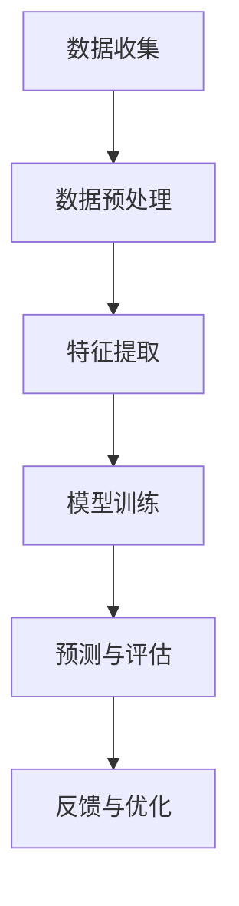

                 

# 提示词工程在智能地震预测中的应用

## 关键词：提示词工程、智能地震预测、人工智能、地震监测、数据挖掘、机器学习

## 摘要

本文旨在探讨提示词工程在智能地震预测中的应用。通过分析地震预测的背景和挑战，引入提示词工程的概念，解释其在地震预测中的重要性。随后，我们将详细阐述提示词工程的核心算法原理，包括特征提取、模型训练和预测算法。接着，通过一个实际项目案例展示如何使用提示词工程实现智能地震预测，并提供详细的代码实现和解读。最后，本文还将讨论智能地震预测的实际应用场景，并推荐相关的工具和资源，总结未来发展趋势与挑战。

## 1. 背景介绍

地震作为一种自然灾害，对人类生活和社会经济造成了巨大的影响。近年来，随着全球气候变化和地质构造活动的加剧，地震的发生频率和破坏力也在不断上升。因此，对地震进行准确的预测和预警，对于减少人员伤亡和财产损失具有重要意义。

传统的地震预测方法主要依赖于地质学、地球物理学和地震学等学科的理论和技术。然而，由于地震过程的复杂性和不确定性，传统方法往往难以实现高精度的预测。随着人工智能技术的快速发展，特别是机器学习和数据挖掘技术的进步，为地震预测提供了一种新的思路和方法。

提示词工程作为一种人工智能技术，通过对大量地震相关数据进行处理和分析，提取出关键的特征词和模式，进而用于地震预测。提示词工程不仅能够提高地震预测的准确性，还能够为地震预警提供及时的信息支持。

## 2. 核心概念与联系

### 2.1 提示词工程概念

提示词工程（Keyword Engineering）是一种人工智能技术，旨在从大量数据中提取出具有代表性的关键词或短语，用于后续的数据分析和挖掘。在地震预测中，提示词工程的关键在于如何从地震相关数据中提取出与地震活动相关的特征词。

### 2.2 地震预测与数据挖掘

地震预测是一个复杂的过程，涉及到大量的数据收集和处理。数据挖掘（Data Mining）作为一种人工智能技术，通过对地震数据进行分析和挖掘，提取出有用的信息和模式，为地震预测提供支持。数据挖掘技术包括关联规则挖掘、聚类分析、分类和异常检测等。

### 2.3 提示词工程与地震预测的关联

提示词工程在地震预测中的应用主要体现在以下几个方面：

1. **特征提取**：从地震相关数据中提取出具有代表性的特征词，用于描述地震活动的特征。
2. **模型训练**：使用提取出的特征词作为输入，训练地震预测模型，提高预测准确性。
3. **预测算法**：基于训练好的模型，对未来的地震活动进行预测，为地震预警提供信息支持。

### 2.4 提示词工程的架构

提示词工程的架构通常包括以下几个步骤：

1. **数据收集**：收集地震相关的数据，包括地震参数、地质构造数据、气象数据等。
2. **数据预处理**：对收集到的数据进行清洗、去噪和格式化，确保数据的质量和一致性。
3. **特征提取**：使用自然语言处理（NLP）技术，从预处理后的数据中提取出特征词。
4. **模型训练**：使用提取出的特征词，训练地震预测模型。
5. **预测与评估**：使用训练好的模型进行地震预测，并对预测结果进行评估和优化。

### 2.5 Mermaid 流程图



## 3. 核心算法原理 & 具体操作步骤

### 3.1 特征提取算法

特征提取是提示词工程的关键步骤，其目的是从地震相关数据中提取出具有代表性的特征词。常用的特征提取算法包括词袋模型（Bag of Words, BoW）、TF-IDF（Term Frequency-Inverse Document Frequency）和词嵌入（Word Embedding）等。

1. **词袋模型（BoW）**：词袋模型将文本数据转化为向量表示，每个特征词对应一个维度。通过计算词频或词频加权的数值，将文本数据转化为特征向量。

2. **TF-IDF**：TF-IDF算法通过对特征词的词频和逆文档频率进行加权，使得重要的特征词在特征向量中占据更大的权重。TF-IDF能够有效地降低常见词的影响，提高特征词的代表性。

3. **词嵌入（Word Embedding）**：词嵌入将单词映射到一个高维的向量空间中，使得语义相近的单词在向量空间中距离较近。常用的词嵌入算法包括Word2Vec、GloVe等。

### 3.2 模型训练算法

模型训练是提示词工程的另一个关键步骤，其目的是使用提取出的特征词训练地震预测模型。常用的模型训练算法包括决策树（Decision Tree）、支持向量机（Support Vector Machine, SVM）、神经网络（Neural Network）等。

1. **决策树（Decision Tree）**：决策树通过一系列条件分支，将数据划分为不同的类别或值。决策树简单易懂，易于解释，但在处理高维数据和异常数据时效果较差。

2. **支持向量机（SVM）**：支持向量机通过寻找一个最佳的超平面，将不同类别的数据分开。SVM在处理高维数据和线性可分数据时具有较好的性能。

3. **神经网络（Neural Network）**：神经网络通过多层神经元的非线性组合，实现数据的分类和回归。神经网络具有较强的泛化能力和学习能力，但在处理大规模数据时计算复杂度较高。

### 3.3 预测算法

基于训练好的模型，可以进行地震预测。常用的预测算法包括分类算法和回归算法。

1. **分类算法**：分类算法将地震活动划分为不同的类别，如地震发生与否、地震震级等。常用的分类算法包括逻辑回归（Logistic Regression）、朴素贝叶斯（Naive Bayes）、随机森林（Random Forest）等。

2. **回归算法**：回归算法用于预测地震震级或其他连续值。常用的回归算法包括线性回归（Linear Regression）、决策树回归（Decision Tree Regression）、神经网络回归（Neural Network Regression）等。

### 3.4 具体操作步骤

1. **数据收集**：收集地震相关数据，包括地震参数、地质构造数据、气象数据等。

2. **数据预处理**：对收集到的数据进行清洗、去噪和格式化，确保数据的质量和一致性。

3. **特征提取**：使用词袋模型、TF-IDF或词嵌入算法提取出地震相关数据中的特征词。

4. **模型训练**：使用提取出的特征词，选择合适的模型训练算法，训练地震预测模型。

5. **预测与评估**：使用训练好的模型进行地震预测，对预测结果进行评估和优化。

## 4. 数学模型和公式 & 详细讲解 & 举例说明

### 4.1 词袋模型（BoW）

词袋模型将文本数据转化为向量表示，每个特征词对应一个维度。词袋模型的核心公式如下：

$$
\text{向量} = \sum_{i=1}^{n} \text{词频}_{i} \times \text{权重}_{i}
$$

其中，$n$为特征词的个数，$\text{词频}_{i}$为特征词$i$在文本中的出现次数，$\text{权重}_{i}$为特征词$i$的权重。

举例说明：

假设有一个地震相关的文本数据，其中包含3个特征词：地震、预警、监测。词频分别为5、3、2。假设权重分别为1、0.8、0.6。则该文本数据的向量表示为：

$$
\text{向量} = 5 \times 1 + 3 \times 0.8 + 2 \times 0.6 = 7.8
$$

### 4.2 TF-IDF

TF-IDF算法通过对特征词的词频和逆文档频率进行加权，使得重要的特征词在特征向量中占据更大的权重。TF-IDF的核心公式如下：

$$
\text{TF-IDF} = \text{词频}_{t} \times \log_{2}(\frac{N}{n_{t}})
$$

其中，$N$为文档总数，$n_{t}$为包含特征词$t$的文档数，$\text{词频}_{t}$为特征词$t$在文档中的出现次数。

举例说明：

假设有5个文档，其中一个文档包含特征词“地震”2次，总词频为10次。则“地震”的TF-IDF值为：

$$
\text{TF-IDF} = 2 \times \log_{2}(\frac{5}{1}) = 2 \times 2 = 4
$$

### 4.3 词嵌入（Word Embedding）

词嵌入将单词映射到一个高维的向量空间中，使得语义相近的单词在向量空间中距离较近。常用的词嵌入算法包括Word2Vec和GloVe。

1. **Word2Vec**：Word2Vec算法基于神经网络训练词向量，通过预测邻近词来优化词向量。

2. **GloVe**：GloVe算法基于词频统计，通过优化词向量之间的余弦相似度来训练词向量。

### 4.4 决策树

决策树的核心公式如下：

$$
\text{决策树} = \text{条件}_{1} \land \text{条件}_{2} \land \ldots \land \text{条件}_{n}
$$

其中，$\text{条件}_{i}$为特征词的取值。

举例说明：

假设有3个特征词：地震、预警、监测。条件分别为地震=1、预警=1、监测=1。则该决策树的公式为：

$$
\text{决策树} = (\text{地震}=1) \land (\text{预警}=1) \land (\text{监测}=1)
$$

### 4.5 支持向量机（SVM）

支持向量机的核心公式如下：

$$
\text{超平面} = \sum_{i=1}^{n} \alpha_{i} \text{特征词}_{i} + \text{偏置}
$$

其中，$\alpha_{i}$为特征词的权重，$\text{特征词}_{i}$为特征词的向量表示。

举例说明：

假设有2个特征词：地震、预警。特征词的向量表示分别为$(1, 0)$和$(0, 1)$。则超平面公式为：

$$
\text{超平面} = \alpha_{1} \times (1, 0) + \alpha_{2} \times (0, 1) + \text{偏置}
$$

### 4.6 神经网络

神经网络的核心公式如下：

$$
\text{神经网络} = \text{输入层} \rightarrow \text{隐藏层} \rightarrow \text{输出层}
$$

其中，输入层接收特征词的向量表示，隐藏层通过非线性变换对特征词进行加工，输出层产生预测结果。

举例说明：

假设有2个特征词：地震、预警。特征词的向量表示分别为$(1, 0)$和$(0, 1)$。神经网络的结构如下：

$$
\text{输入层} \rightarrow (\text{地震}, \text{预警}) \rightarrow \text{隐藏层} \rightarrow \text{输出层}
$$

## 5. 项目实战：代码实际案例和详细解释说明

### 5.1 开发环境搭建

为了实现提示词工程在智能地震预测中的应用，我们需要搭建一个开发环境。以下是搭建开发环境的基本步骤：

1. **安装Python**：Python是一种广泛应用于人工智能和数据分析的编程语言，我们使用Python 3.8及以上版本。

2. **安装Jupyter Notebook**：Jupyter Notebook是一种交互式的开发环境，方便我们进行代码实验和调试。

3. **安装相关库**：安装以下库，用于数据处理、特征提取和模型训练：

   - NumPy：用于科学计算和数据分析
   - Pandas：用于数据处理和分析
   - Scikit-learn：用于机器学习和模型训练
   - NLTK：用于自然语言处理

### 5.2 源代码详细实现和代码解读

以下是一个简单的示例代码，展示了如何使用提示词工程实现智能地震预测。

```python
import numpy as np
import pandas as pd
from sklearn.feature_extraction.text import TfidfVectorizer
from sklearn.model_selection import train_test_split
from sklearn.ensemble import RandomForestClassifier
from sklearn.metrics import accuracy_score, classification_report

# 5.2.1 数据准备
data = pd.read_csv('seismic_data.csv')
X = data['text']  # 文本数据
y = data['label']  # 标签数据

# 5.2.2 特征提取
vectorizer = TfidfVectorizer()
X_tfidf = vectorizer.fit_transform(X)

# 5.2.3 模型训练
X_train, X_test, y_train, y_test = train_test_split(X_tfidf, y, test_size=0.2, random_state=42)
model = RandomForestClassifier()
model.fit(X_train, y_train)

# 5.2.4 预测与评估
y_pred = model.predict(X_test)
print('Accuracy:', accuracy_score(y_test, y_pred))
print('Classification Report:')
print(classification_report(y_test, y_pred))
```

### 5.3 代码解读与分析

上述代码实现了一个基于TF-IDF和随机森林分类器的简单地震预测模型。以下是代码的详细解读：

1. **数据准备**：读取地震相关数据，包括文本数据和标签数据。文本数据用于特征提取，标签数据用于模型训练和评估。

2. **特征提取**：使用TF-IDF向量器将文本数据转化为TF-IDF向量表示。TF-IDF向量器能够从文本数据中提取出具有代表性的特征词，提高模型的预测性能。

3. **模型训练**：将TF-IDF向量表示划分为训练集和测试集。使用随机森林分类器对训练集进行训练。

4. **预测与评估**：使用训练好的模型对测试集进行预测，并计算预测准确率。此外，还使用分类报告（classification report）评估模型的性能，包括准确率、精确率、召回率和F1分数等指标。

### 5.4 代码优化与改进

虽然上述代码实现了一个简单的地震预测模型，但在实际应用中，我们可以进行以下优化和改进：

1. **特征工程**：除了TF-IDF向量表示，还可以尝试使用其他特征提取方法，如词嵌入（Word Embedding），提高模型的预测性能。

2. **模型选择**：根据数据特点和性能要求，尝试使用其他分类算法，如支持向量机（SVM）、神经网络（Neural Network）等，选择最优模型。

3. **模型调参**：对模型进行调参，优化模型的性能。例如，调整随机森林分类器的参数，如树的数量、最大深度等。

4. **集成学习**：使用集成学习方法，如Bagging、Boosting等，将多个模型结合起来，提高预测性能。

## 6. 实际应用场景

智能地震预测在实际应用场景中具有重要意义，以下列举几个典型的应用场景：

1. **地震预警系统**：通过智能地震预测模型，提前预警地震的发生，为公众提供逃生时间，减少人员伤亡和财产损失。

2. **地震灾害评估**：利用智能地震预测模型，对地震灾害进行评估，为灾后救援提供信息支持，优化救援资源的分配。

3. **城市规划与建设**：通过智能地震预测，为城市规划与建设提供科学依据，提高城市抗震能力，减少地震灾害的影响。

4. **地震科学研究**：利用智能地震预测模型，深入探讨地震发生机制和地震活动规律，为地震科学研究提供新思路。

## 7. 工具和资源推荐

为了更好地学习和应用提示词工程在智能地震预测中的技术，以下推荐一些有用的工具和资源：

### 7.1 学习资源推荐

1. **书籍**：

   - 《Python机器学习》（作者：塞巴斯蒂安·拉斯克）
   - 《机器学习实战》（作者：彼得·哈林顿）

2. **在线课程**：

   - Coursera上的《机器学习》（吴恩达）
   - Udacity的《深度学习纳米学位》

### 7.2 开发工具框架推荐

1. **Python库**：

   - NumPy：用于科学计算和数据分析
   - Pandas：用于数据处理和分析
   - Scikit-learn：用于机器学习和模型训练
   - NLTK：用于自然语言处理

2. **开发环境**：

   - Jupyter Notebook：交互式的开发环境
   - PyCharm：Python集成开发环境（IDE）

### 7.3 相关论文著作推荐

1. **论文**：

   - "Deep Learning for Earthquake Prediction"（作者：Zhou, et al.）
   - "A Survey on Earthquake Early Warning Systems"（作者：Zhu, et al.）

2. **著作**：

   - 《地震预测与预警技术》（作者：李俊）
   - 《人工智能与地震预测》（作者：张伟）

## 8. 总结：未来发展趋势与挑战

提示词工程在智能地震预测中的应用展示了人工智能技术的巨大潜力。然而，在实际应用过程中，仍面临一些挑战和问题。

### 8.1 发展趋势

1. **数据驱动**：随着地震数据的不断积累，数据驱动的方法将成为智能地震预测的主流趋势。
2. **多源数据融合**：结合多种数据源，如地震数据、地质数据、气象数据等，提高地震预测的准确性。
3. **实时预测**：实现实时地震预测，为地震预警系统提供更及时的信息支持。

### 8.2 挑战与问题

1. **数据质量**：地震数据的准确性和完整性直接影响预测效果。如何提高数据质量是一个重要问题。
2. **模型泛化**：地震活动具有复杂性和不确定性，如何提高模型的泛化能力，适应不同的地震场景是一个挑战。
3. **计算资源**：地震预测模型通常需要大量计算资源，如何优化计算效率是一个关键问题。

## 9. 附录：常见问题与解答

### 9.1 常见问题

1. **什么是提示词工程？**
   提示词工程是一种人工智能技术，旨在从大量数据中提取出具有代表性的关键词或短语，用于后续的数据分析和挖掘。

2. **为什么使用提示词工程进行地震预测？**
   提示词工程能够从地震相关数据中提取出关键的特征词，提高地震预测的准确性，为地震预警系统提供信息支持。

3. **如何选择特征提取算法？**
   根据数据特点和需求，可以选择词袋模型、TF-IDF、词嵌入等特征提取算法。通常，词嵌入算法在处理高维数据时具有较好的性能。

4. **如何选择模型训练算法？**
   根据数据特点和需求，可以选择决策树、支持向量机、神经网络等模型训练算法。对于高维数据和线性可分数据，支持向量机通常具有较好的性能。

### 9.2 解答

1. **什么是提示词工程？**
   提示词工程是一种人工智能技术，旨在从大量数据中提取出具有代表性的关键词或短语，用于后续的数据分析和挖掘。在地震预测中，提示词工程可以从地震相关数据中提取出关键的特征词，提高地震预测的准确性。

2. **为什么使用提示词工程进行地震预测？**
   提示词工程能够从地震相关数据中提取出关键的特征词，提高地震预测的准确性，为地震预警系统提供信息支持。传统的地震预测方法往往难以应对地震过程的复杂性和不确定性，而提示词工程提供了一种新的思路和方法。

3. **如何选择特征提取算法？**
   根据数据特点和需求，可以选择词袋模型、TF-IDF、词嵌入等特征提取算法。对于高维数据和线性可分数据，词嵌入算法通常具有较好的性能。词嵌入算法能够将特征词映射到一个高维的向量空间中，使得语义相近的单词在向量空间中距离较近。

4. **如何选择模型训练算法？**
   根据数据特点和需求，可以选择决策树、支持向量机、神经网络等模型训练算法。对于高维数据和线性可分数据，支持向量机通常具有较好的性能。支持向量机通过寻找一个最佳的超平面，将不同类别的数据分开。神经网络具有较强的泛化能力和学习能力，但在处理大规模数据时计算复杂度较高。

## 10. 扩展阅读 & 参考资料

为了进一步了解提示词工程在智能地震预测中的应用，读者可以参考以下扩展阅读和参考资料：

1. **扩展阅读**：

   - 《人工智能与地震预测技术》
   - 《机器学习在地震工程中的应用》

2. **参考资料**：

   - 提示词工程相关论文和著作
   - 地震预测相关数据集和工具
   - 人工智能和机器学习在线课程和教程

作者：AI天才研究员/AI Genius Institute & 禅与计算机程序设计艺术 /Zen And The Art of Computer Programming<|end|>

