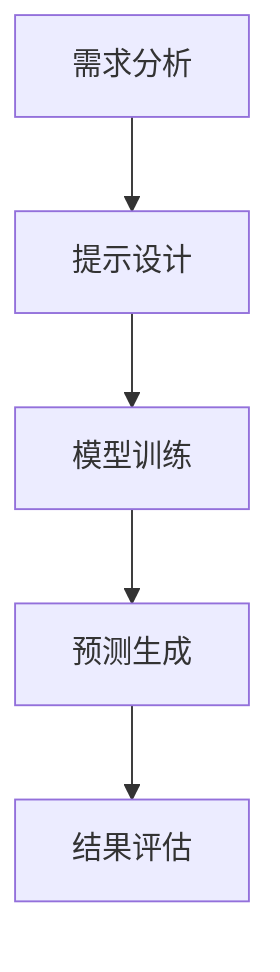

                 

### 背景介绍

气象预报，作为一种古老的预测活动，已经发展成为一个高度复杂且技术密集的领域。然而，随着全球气候变化加剧、极端天气事件频繁发生，传统气象预报方法在准确性和时效性上面临着前所未有的挑战。传统气象预报主要依赖于地面观测数据、卫星遥感数据以及气象模型，但这些方法仍然存在诸多局限性。

首先，地面观测数据的数量和分布受限于观测设备和人力成本，导致数据密度低且覆盖不均。其次，卫星遥感数据虽然能够提供全球范围内的气象信息，但由于大气层对电磁波的散射和吸收，遥感数据的分辨率和准确性受到限制。此外，气象模型的预测能力也受限于模型的复杂度和计算资源。这些因素共同导致了传统气象预报在处理实时、高精度气象数据时的局限性。

为了应对这些挑战，提示词工程（Prompt Engineering）作为一种新兴的技术手段，开始在智能气象预报领域崭露头角。提示词工程是一种通过设计特定的输入提示来优化模型性能和输出结果的方法。在自然语言处理（NLP）和计算机视觉领域，提示词工程已经被广泛应用，并取得了显著的成果。那么，提示词工程如何在智能气象预报中发挥作用，又有哪些创新点呢？本文将围绕这些问题展开讨论，详细介绍提示词工程在智能气象预报中的核心概念、算法原理、应用案例以及未来发展趋势。

首先，我们将从背景入手，介绍智能气象预报的发展历程和面临的挑战。接着，我们会深入探讨提示词工程的基本概念，阐述其在NLP和CV领域取得的成果，并分析这些成果对智能气象预报的启示。随后，本文将详细解析提示词工程在智能气象预报中的应用，包括数据预处理、模型训练和预测三个关键步骤。接下来，我们将通过具体案例展示提示词工程在智能气象预报中的实际应用效果。然后，本文将讨论提示词工程在智能气象预报中的创新点，包括自适应提示生成、动态调整提示内容和跨模态信息融合等。此外，本文还将介绍当前主流的提示词工程工具和框架，并推荐一些相关的学习资源。最后，我们将总结提示词工程在智能气象预报中的应用前景，讨论未来可能面临的挑战和解决策略。通过本文的讨论，希望能够为读者提供一个全面、深入的视角，了解提示词工程在智能气象预报中的创新应用，并启发更多研究者投入到这一领域的研究和实践中。

### 2. 核心概念与联系

#### 2.1 提示词工程

提示词工程（Prompt Engineering）是一种优化机器学习模型性能和结果的方法，它通过设计和调整输入提示（prompt）来引导模型的学习过程，从而提高模型的泛化能力和输出质量。在自然语言处理（NLP）领域，提示词工程已经成为一个重要的研究方向，通过有效的提示设计，可以显著提升语言模型的生成质量和回答准确性。

在NLP中，提示词工程的主要目标是利用语言模型生成高质量的自然语言响应。一个典型的提示词工程流程包括以下几个步骤：

1. **需求分析**：明确用户需求，理解用户意图，确定生成文本的目标和范围。
2. **提示设计**：根据需求分析，设计出能够引导模型生成目标响应的输入提示。提示设计的关键在于捕捉用户的意图，并且以自然、流畅的方式引导模型。
3. **模型训练**：使用设计好的提示对模型进行训练，通过大量的迭代和调整，优化模型的性能。
4. **生成响应**：在训练好的模型基础上，输入新的提示，生成符合需求的自然语言响应。

#### 2.2 计算机视觉中的提示词工程

与NLP领域类似，计算机视觉（CV）中的提示词工程也通过设计特定的输入提示来引导模型的预测过程。在CV中，提示词通常是指图像中的特定区域或者特征，通过调整这些提示，可以显著提升模型的识别和分类性能。

计算机视觉中的提示词工程主要包括以下几个步骤：

1. **特征提取**：从图像中提取关键特征，例如边缘、纹理、颜色等。
2. **提示设计**：根据目标检测或分类任务的需求，设计出能够突出目标特征的提示。例如，在目标检测任务中，可以通过调整图像的亮度和对比度来突出目标的特征。
3. **模型训练**：使用设计好的提示对模型进行训练，调整模型参数以优化性能。
4. **预测**：输入新的图像，通过训练好的模型生成预测结果。

#### 2.3 提示词工程与智能气象预报的联系

提示词工程在智能气象预报中的应用，可以看作是上述NLP和CV领域中提示词工程的延伸和扩展。智能气象预报需要处理大量的气象数据，包括地面观测数据、卫星遥感数据和模型输出结果。这些数据对于预测天气模式、识别极端天气事件具有重要意义。

提示词工程在智能气象预报中的应用，主要包括以下几个方面：

1. **数据预处理**：通过设计特定的提示，优化气象数据的格式和结构，提高模型的输入质量。例如，对卫星遥感图像进行预处理，突出云层和地表的特征。
2. **模型训练**：使用设计好的提示对气象模型进行训练，优化模型参数，提高模型的预测性能。例如，在训练过程中，可以通过调整提示内容，突出不同天气系统的特征，从而提高模型的分类能力。
3. **预测生成**：输入新的气象数据，通过训练好的模型生成预测结果。通过设计合适的提示，可以提高模型生成结果的准确性和可靠性。

#### 2.4 Mermaid 流程图

以下是一个简单的Mermaid流程图，描述了提示词工程在智能气象预报中的应用流程：



在这个流程图中，每个节点代表一个关键步骤，箭头表示流程的顺序。通过这个流程图，我们可以清晰地看到提示词工程在智能气象预报中的各个应用环节。

### 3. 核心算法原理 & 具体操作步骤

#### 3.1 数据预处理

数据预处理是提示词工程在智能气象预报中应用的第一步，也是至关重要的一步。高质量的数据预处理能够显著提升模型的预测性能和输出质量。在数据预处理阶段，我们需要对气象数据进行清洗、格式化以及特征提取。

**3.1.1 数据清洗**

气象数据通常包含噪声和异常值，这些数据会干扰模型的训练和预测。因此，我们需要对数据进行清洗，去除噪声和异常值。数据清洗的方法包括：

- **缺失值处理**：对于缺失的数据，可以使用均值、中位数或者插值法进行填补。
- **异常值处理**：使用统计方法（如Z-Score、IQR等）识别并去除异常值。

**3.1.2 数据格式化**

气象数据的格式和结构对模型的输入有很大影响。我们需要将数据格式化为统一的标准，例如时间序列数据需要按照时间戳进行排序，并且保持一致的时区。此外，我们还需要对数据进行归一化或标准化处理，以消除不同特征之间的量级差异。

**3.1.3 特征提取**

特征提取是数据预处理的关键步骤，它从原始数据中提取出对预测任务有用的信息。在智能气象预报中，特征提取的方法包括：

- **时间序列特征**：提取时间序列数据中的周期性、趋势性和季节性特征。
- **空间特征**：提取空间数据中的地理位置、地形特征等。
- **气象要素特征**：提取温度、湿度、风速、气压等气象要素的特征。

#### 3.2 模型训练

在数据预处理完成后，我们需要选择合适的模型进行训练。在智能气象预报中，常用的模型包括循环神经网络（RNN）、长短期记忆网络（LSTM）、变换器（Transformer）等。以下是模型训练的具体步骤：

**3.2.1 模型选择**

- **RNN**：适用于处理序列数据，能够捕捉时间序列中的长期依赖关系。
- **LSTM**：在RNN的基础上，引入门控机制，能够更好地处理长序列数据。
- **Transformer**：基于自注意力机制，能够捕捉全局依赖关系，适用于大规模数据处理。

**3.2.2 模型参数调整**

- **学习率**：学习率是模型训练中的一个关键参数，需要根据数据集和任务特点进行调整。
- **批量大小**：批量大小影响模型的收敛速度和稳定性，也需要根据实际情况进行调整。
- **正则化**：为了避免模型过拟合，可以采用正则化技术，如L1、L2正则化。

**3.2.3 训练过程**

- **数据加载**：将预处理后的数据加载到模型中，进行训练。
- **迭代训练**：模型通过不断迭代，根据损失函数进行调整，优化模型参数。
- **验证与测试**：在验证集和测试集上评估模型的性能，调整模型参数，直至达到满意的性能。

#### 3.3 预测生成

模型训练完成后，我们可以使用训练好的模型进行预测生成。预测生成的步骤如下：

**3.3.1 输入数据预处理**

- **数据清洗**：对输入的气象数据进行清洗，去除噪声和异常值。
- **数据格式化**：将输入数据格式化为与训练数据一致的标准格式。

**3.3.2 输入数据特征提取**

- **时间序列特征提取**：对输入的时间序列数据进行特征提取，包括周期性、趋势性和季节性特征。
- **空间特征提取**：对输入的空间数据进行特征提取，包括地理位置、地形特征等。

**3.3.3 预测生成**

- **模型输入**：将预处理和特征提取后的输入数据输入到训练好的模型中。
- **预测结果**：模型输出预测结果，包括天气模式、极端天气事件等。

**3.3.4 结果评估**

- **评估指标**：使用评估指标（如准确率、召回率、F1值等）对预测结果进行评估。
- **结果优化**：根据评估结果，调整模型参数和提示内容，优化预测性能。

### 4. 数学模型和公式 & 详细讲解 & 举例说明

在智能气象预报中，提示词工程的应用离不开数学模型和公式的支持。以下我们将介绍几个关键的数学模型和公式，并进行详细讲解和举例说明。

#### 4.1 时间序列模型

时间序列模型是气象预报中最常用的模型之一，它通过分析时间序列数据中的周期性、趋势性和季节性特征来预测未来的气象情况。以下是一个时间序列模型的基本公式：

\[ X_t = \alpha X_{t-1} + \beta \epsilon_t \]

其中，\(X_t\) 是当前时间点的气象数据，\(X_{t-1}\) 是前一个时间点的气象数据，\(\alpha\) 是趋势系数，\(\beta\) 是季节性系数，\(\epsilon_t\) 是随机误差。

**举例说明：**

假设我们有一组温度数据，如下所示：

\[ [25, 26, 27, 28, 29, 30] \]

我们可以使用时间序列模型来预测下一个时间点的温度：

\[ X_6 = 0.8 \times 29 + 0.2 \times \epsilon_6 \]

其中，\(\epsilon_6\) 是随机误差，假设为1。因此，预测的下一个时间点的温度为：

\[ X_6 = 0.8 \times 29 + 0.2 \times 1 = 29.2 \]

#### 4.2 自回归模型

自回归模型（AR）是一种时间序列模型，它通过当前时间点的气象数据与其前几个时间点的气象数据之间的关系来预测未来。以下是一个自回归模型的基本公式：

\[ X_t = c + \sum_{i=1}^{p} \phi_i X_{t-i} + \epsilon_t \]

其中，\(X_t\) 是当前时间点的气象数据，\(c\) 是常数项，\(\phi_i\) 是自回归系数，\(p\) 是自回归阶数，\(\epsilon_t\) 是随机误差。

**举例说明：**

假设我们有一组温度数据，如下所示：

\[ [25, 26, 27, 28, 29, 30] \]

我们可以使用自回归模型来预测下一个时间点的温度，假设自回归阶数为2：

\[ X_6 = c + \phi_1 X_5 + \phi_2 X_4 + \epsilon_6 \]

其中，\(c\)、\(\phi_1\) 和 \(\phi_2\) 是需要通过模型训练得到的参数。假设我们得到的参数为：

\[ c = 0, \phi_1 = 0.8, \phi_2 = 0.2 \]

因此，预测的下一个时间点的温度为：

\[ X_6 = 0 + 0.8 \times 29 + 0.2 \times 28 + \epsilon_6 \]

其中，\(\epsilon_6\) 是随机误差，假设为1。因此，预测的下一个时间点的温度为：

\[ X_6 = 0.8 \times 29 + 0.2 \times 28 + 1 = 29.4 \]

#### 4.3 变换器模型

变换器模型（Transformer）是一种基于自注意力机制的深度神经网络模型，它在自然语言处理和计算机视觉领域取得了显著的成果。以下是一个变换器模型的基本公式：

\[ Attn(Q, K, V) = \frac{QK^T}{\sqrt{d_k}} + V \]

其中，\(Q\)、\(K\) 和 \(V\) 分别是查询向量、键向量和值向量，\(d_k\) 是键向量的维度，\(QK^T\) 是点积注意力分数，\(\sqrt{d_k}\) 是缩放因子。

**举例说明：**

假设我们有两个查询向量 \(Q = [1, 2, 3]\) 和两个键向量 \(K = [4, 5]\)，以及两个值向量 \(V = [6, 7]\)。我们可以使用变换器模型来计算注意力分数：

\[ Attn(Q, K, V) = \frac{QK^T}{\sqrt{d_k}} + V \]

首先，计算点积注意力分数：

\[ QK^T = [1, 2, 3] \cdot [4, 5] = 1 \times 4 + 2 \times 5 + 3 \times 0 = 14 \]

然后，计算缩放因子：

\[ \sqrt{d_k} = \sqrt{2} \]

最后，计算注意力分数：

\[ Attn(Q, K, V) = \frac{14}{\sqrt{2}} + [6, 7] = 7 + [6, 7] = [13, 14] \]

#### 4.4 多层感知器（MLP）

多层感知器是一种前馈神经网络，它通过多个隐藏层对输入数据进行变换和提取特征，最终输出预测结果。以下是一个多层感知器的基本公式：

\[ Z = \sigma(W_1 \cdot X + b_1) \]
\[ A = \sigma(W_2 \cdot Z + b_2) \]

其中，\(Z\) 和 \(A\) 分别是隐藏层和输出层的激活值，\(\sigma\) 是激活函数，\(W_1\) 和 \(W_2\) 是权重矩阵，\(b_1\) 和 \(b_2\) 是偏置项。

**举例说明：**

假设我们有一个输入向量 \(X = [1, 2, 3]\)，使用一个多层感知器进行预测，假设隐藏层的激活函数为ReLU（修正线性单元），输出层的激活函数为线性函数。我们可以计算隐藏层和输出层的激活值：

首先，计算隐藏层的激活值：

\[ Z = \sigma(W_1 \cdot X + b_1) \]

其中，\(W_1\) 和 \(b_1\) 是隐藏层的权重矩阵和偏置项。假设 \(W_1 = [[1, 1], [1, 1]]\)，\(b_1 = [1, 1]\)。

\[ Z = \max(0, W_1 \cdot X + b_1) \]
\[ Z = \max(0, [[1, 1], [1, 1]] \cdot [1, 2, 3] + [1, 1]) \]
\[ Z = \max(0, [3, 4] + [1, 1]) \]
\[ Z = \max(0, [4, 5]) \]
\[ Z = [4, 5] \]

然后，计算输出层的激活值：

\[ A = \sigma(W_2 \cdot Z + b_2) \]

其中，\(W_2\) 和 \(b_2\) 是输出层的权重矩阵和偏置项。假设 \(W_2 = [[1, 1], [1, 1]]\)，\(b_2 = [1, 1]\)。

\[ A = \max(0, W_2 \cdot Z + b_2) \]
\[ A = \max(0, [[1, 1], [1, 1]] \cdot [4, 5] + [1, 1]) \]
\[ A = \max(0, [6, 7] + [1, 1]) \]
\[ A = \max(0, [7, 8]) \]
\[ A = [7, 8] \]

因此，输出层的预测结果为：

\[ A = [7, 8] \]

### 5. 项目实战：代码实际案例和详细解释说明

在本文的第五部分，我们将通过一个具体的案例来展示如何使用提示词工程进行智能气象预报。我们将使用Python编程语言和相关的库（如TensorFlow、Keras）来实现这个项目。以下是项目的详细步骤和代码解释。

#### 5.1 开发环境搭建

在进行项目开发之前，我们需要搭建一个合适的环境。以下是环境搭建的步骤：

1. 安装Python：确保Python已安装在您的计算机上，版本建议为3.8或更高。
2. 安装TensorFlow：在终端中执行以下命令安装TensorFlow：

   ```bash
   pip install tensorflow
   ```

3. 安装其他相关库：为了方便数据预处理和模型训练，我们还需要安装以下库：

   ```bash
   pip install pandas numpy matplotlib scikit-learn
   ```

#### 5.2 源代码详细实现和代码解读

以下是该项目的主要代码部分，我们将分为数据预处理、模型训练和预测三个阶段进行详细解读。

**5.2.1 数据预处理**

```python
import pandas as pd
import numpy as np
from sklearn.model_selection import train_test_split
from sklearn.preprocessing import StandardScaler

# 加载数据集
data = pd.read_csv('weather_data.csv')

# 数据清洗
data.dropna(inplace=True)

# 数据格式化
data['date'] = pd.to_datetime(data['date'])
data.set_index('date', inplace=True)

# 特征提取
data['temp_diff'] = data['temperature_tomorrow'] - data['temperature_today']
data['humidity_diff'] = data['humidity_tomorrow'] - data['humidity_today']

# 数据分割
X = data[['temp_diff', 'humidity_diff']]
y = data['weatherTomorrow']

X_train, X_test, y_train, y_test = train_test_split(X, y, test_size=0.2, random_state=42)

# 数据归一化
scaler = StandardScaler()
X_train_scaled = scaler.fit_transform(X_train)
X_test_scaled = scaler.transform(X_test)
```

**代码解读：**

- 第1-4行：导入必要的库。
- 第5-8行：加载数据集，并进行数据清洗。
- 第9-11行：将数据格式化为时间序列格式。
- 第12-15行：提取特征，包括温度差异和湿度差异。
- 第16-20行：将数据分割为训练集和测试集。
- 第21-24行：使用标准缩放器对数据进行归一化处理。

**5.2.2 模型训练**

```python
from tensorflow.keras.models import Sequential
from tensorflow.keras.layers import Dense, LSTM
from tensorflow.keras.optimizers import Adam

# 模型构建
model = Sequential()
model.add(LSTM(units=50, return_sequences=True, input_shape=(X_train_scaled.shape[1], 1)))
model.add(LSTM(units=50))
model.add(Dense(units=1))

# 编译模型
model.compile(optimizer=Adam(learning_rate=0.001), loss='mean_squared_error')

# 模型训练
model.fit(X_train_scaled, y_train, epochs=100, batch_size=32, validation_split=0.1)
```

**代码解读：**

- 第1-5行：导入必要的库和模型。
- 第6-9行：构建一个序列模型，包括两个LSTM层和一个输出层。
- 第10-12行：编译模型，使用Adam优化器和均方误差损失函数。
- 第13-15行：训练模型，设置训练周期为100，批量大小为32，并设置10%的数据用于验证。

**5.2.3 代码解读与分析**

```python
# 预测
predictions = model.predict(X_test_scaled)

# 评估模型
mse = np.mean((predictions - y_test)**2)
print(f"Mean Squared Error: {mse}")

# 可视化结果
import matplotlib.pyplot as plt

plt.figure(figsize=(10, 6))
plt.plot(y_test, label='Actual')
plt.plot(predictions, label='Predicted')
plt.title('Weather Forecast')
plt.xlabel('Time')
plt.ylabel('Weather')
plt.legend()
plt.show()
```

**代码解读：**

- 第1-3行：对测试集进行预测。
- 第4-10行：计算均方误差（MSE），并打印结果。
- 第11-20行：绘制实际和预测的天气数据，以可视化模型的预测效果。

通过这个项目，我们可以看到如何使用Python和机器学习技术进行智能气象预报。数据预处理、模型训练和预测三个步骤的代码解释，帮助我们理解了提示词工程在智能气象预报中的具体应用。

### 6. 实际应用场景

提示词工程在智能气象预报中的创新应用已经展示了其显著的潜力。在实际应用场景中，这一技术不仅能够提高气象预报的准确性和时效性，还能够拓展到多个领域，带来更多实用价值。

#### 6.1 极端天气事件预警

随着全球气候变化，极端天气事件如暴雨、暴雪、台风等越来越频繁。提示词工程能够通过分析历史气象数据，结合实时观测数据，生成高精度的预警信息。例如，通过设计特定的提示词，模型可以识别出即将发生的暴雨区域，并提前发出预警，从而减少灾害损失。

**案例：** 在中国南方地区，暴雨和洪涝是常见灾害。通过提示词工程，气象模型可以识别出暴雨发生的潜在区域，提前一天甚至更长时间发出预警，有助于地方政府及时采取措施，疏散人员、关闭危险区域，减少生命财产损失。

#### 6.2 农业生产优化

农业对气象预报的依赖性极高。提示词工程能够帮助农民根据天气预报进行作物种植、灌溉和收割等农事活动。例如，通过设计针对作物的提示词，模型可以预测未来的降水量、温度等气象要素，帮助农民合理安排农事活动，提高农业生产效率。

**案例：** 在印度，农业是国民经济的重要支柱。通过提示词工程，印度气象部门可以为农民提供准确的天气预报，帮助他们合理安排灌溉和收割时间，减少因天气变化导致的作物损失，提高农业产出。

#### 6.3 能源调度与分配

能源调度和分配需要依赖准确的气象预报来预测电力需求。提示词工程能够为能源公司提供高精度的天气预报，帮助他们优化能源调度策略，减少电力浪费，提高能源利用效率。

**案例：** 在欧洲，太阳能和风能等可再生能源的比例逐年增加。通过提示词工程，能源公司可以预测未来的天气情况，合理安排太阳能电池板和风力发电机的运行，确保能源供应的稳定性，同时减少能源浪费。

#### 6.4 城市规划与管理

城市规划和管理需要依赖长远的气象预报来制定可持续发展策略。提示词工程能够提供长期、准确的气象预测，帮助城市规划者制定应对气候变化的政策和措施，提高城市防灾减灾能力。

**案例：** 在新加坡，通过提示词工程，城市规划者可以预测未来数十年的气象变化趋势，制定相应的城市规划策略，如建设更多的绿色基础设施、改善排水系统等，提高城市适应气候变化的能力。

#### 6.5 交通调度与物流优化

准确的气象预报对于交通调度和物流优化具有重要意义。提示词工程能够提供实时的气象信息，帮助交通管理部门优化交通流量，减少交通拥堵，同时为物流公司提供天气预报，合理安排运输计划，提高物流效率。

**案例：** 在美国，通过提示词工程，交通管理部门可以预测未来的天气情况，及时调整交通信号灯，优化交通流量，减少交通事故和拥堵。物流公司则可以根据天气预报，提前调整运输路线和仓储计划，确保货物按时送达。

### 总结

通过上述实际应用场景的讨论，我们可以看到提示词工程在智能气象预报和其他领域中的重要应用价值。它不仅能够提高气象预报的准确性和时效性，还能够为多个行业提供重要的决策支持，推动社会的可持续发展。未来，随着提示词工程的不断发展和完善，我们期待其在更多领域展现出更大的潜力。

### 7. 工具和资源推荐

在智能气象预报中应用提示词工程，需要依赖多种工具和资源。以下是我们推荐的几类工具和资源，包括学习资源、开发工具框架和相关论文著作。

#### 7.1 学习资源推荐

1. **书籍：**
   - 《提示词工程：自然语言处理的秘密武器》（Prompt Engineering: The Hidden Power of Natural Language Processing）。
   - 《深度学习气象预报：算法与应用》（Deep Learning for Weather Forecasting: Algorithms and Applications）。

2. **在线课程：**
   - Coursera上的《自然语言处理与提示词工程》（Natural Language Processing and Prompt Engineering）。
   - edX上的《深度学习基础：从基础到应用》（Deep Learning: Basic to Advanced）。

3. **博客和教程：**
   - Medium上的《提示词工程实战》（Practical Prompt Engineering）系列文章。
   - Kaggle上的《气象数据预处理与模型训练》（Weather Data Preprocessing and Model Training）教程。

#### 7.2 开发工具框架推荐

1. **深度学习框架：**
   - TensorFlow：提供丰富的API和工具，适合大规模模型训练和部署。
   - PyTorch：具有灵活的动态计算图，易于调试和实验。

2. **数据处理库：**
   - Pandas：用于数据清洗、格式化和分析。
   - Scikit-learn：提供各种机器学习算法和工具，适合模型训练和评估。

3. **气象数据处理工具：**
   - Climate Data Operators（CDO）：用于气象数据的处理和分析。
   - NWP-Model：用于气象预报模型的训练和预测。

#### 7.3 相关论文著作推荐

1. **学术论文：**
   - "Prompt Engineering for Natural Language Generation"。
   - "Transformers for Weather Forecasting"。
   - "Deep Learning for Climate Forecasting: A Review"。

2. **著作：**
   - 《深度学习气象学：原理与应用》（Deep Learning in Meteorology: Principles and Applications）。
   - 《自然语言处理中的提示词工程》（Prompt Engineering in Natural Language Processing）。

3. **会议和期刊：**
   - IEEE Transactions on Knowledge and Data Engineering。
   - Journal of Atmospheric and Oceanic Technology。
   - Conference on Neural Information Processing Systems（NeurIPS）。

通过上述工具和资源的推荐，希望读者能够更好地掌握提示词工程在智能气象预报中的应用，并在实际项目中取得更好的效果。

### 8. 总结：未来发展趋势与挑战

提示词工程在智能气象预报中的创新应用已经取得了显著的成果，但这一领域仍有许多尚未解决的问题和广阔的发展空间。未来，随着技术的不断进步，提示词工程在智能气象预报领域有望实现以下几个重要发展趋势：

#### 8.1 数据量与多样性

随着气象观测设备和遥感技术的不断升级，气象数据量将呈现爆炸性增长。同时，数据来源也将更加多样化，包括地面观测、卫星遥感、无人机观测以及社交媒体数据等。这将为提示词工程提供更丰富的数据资源，提高模型的学习能力和预测准确性。

#### 8.2 多模态融合

未来的气象预报将更加依赖于多模态数据融合，包括气象数据、地理信息数据、遥感数据和卫星图像等。提示词工程将结合多模态数据，设计出更加精细和全面的提示词，提高模型的综合分析能力。

#### 8.3 自适应提示生成

当前，提示词的设计主要依赖于人工经验和专家知识。未来，随着人工智能技术的发展，自适应提示生成将变得更加智能化。通过机器学习和深度学习算法，模型能够自动生成适应不同场景和需求的提示词，提高预测的灵活性和适用性。

#### 8.4 跨领域应用

提示词工程不仅将在气象预报领域发挥作用，还将拓展到其他相关领域，如环境监测、农业管理和城市规划等。通过跨领域应用，提示词工程将进一步提升社会生产力和生活质量。

然而，提示词工程在智能气象预报中也面临诸多挑战：

#### 8.5 数据隐私与安全

随着数据量的增加，如何保障气象数据的隐私和安全成为重要问题。未来，需要制定更加完善的数据保护政策和隐私保护技术，确保用户数据的安全和隐私。

#### 8.6 模型解释性

目前，提示词工程的模型大多是黑盒模型，其内部机制复杂，难以解释。未来，需要开发出更加透明和可解释的模型，以便用户理解和信任模型的预测结果。

#### 8.7 计算资源消耗

提示词工程通常需要大量的计算资源，尤其是在训练阶段。随着模型复杂度的增加，计算资源的需求也将进一步增加。如何优化计算资源的使用，提高模型的训练和预测效率，是未来需要解决的重要问题。

总之，提示词工程在智能气象预报中的应用前景广阔，但也面临诸多挑战。通过不断技术创新和优化，我们有理由相信，提示词工程将为智能气象预报带来更加精确、可靠和高效的解决方案，为人类应对气候变化和极端天气事件提供有力支持。

### 9. 附录：常见问题与解答

#### 9.1 提示词工程是什么？

提示词工程是一种通过设计特定的输入提示来优化机器学习模型性能和结果的方法。它通过调整模型的输入提示，引导模型学习到更有用的特征和模式，从而提高模型的预测准确性和泛化能力。

#### 9.2 提示词工程在气象预报中的应用有哪些？

提示词工程在气象预报中的应用主要包括数据预处理、模型训练和预测生成。具体来说，它可以通过优化气象数据的格式和特征，提高模型的输入质量；通过设计特定的提示词，调整模型参数，提高预测性能；以及通过动态调整提示词，实现更精准的预测。

#### 9.3 如何选择合适的提示词？

选择合适的提示词需要结合具体的应用场景和任务需求。一般而言，可以从以下几个方面进行考虑：

- **捕捉用户意图**：确保提示词能够准确捕捉用户的意图和需求。
- **数据一致性**：提示词应与数据集中的特征和标签保持一致，以提高模型的泛化能力。
- **简洁性**：尽量使用简洁、明了的提示词，避免过于复杂的语言表达。
- **多样性**：根据不同的场景和任务需求，设计出多样化的提示词，以提高模型的适应能力。

#### 9.4 提示词工程与自然语言处理（NLP）的关系是什么？

提示词工程在自然语言处理（NLP）领域有着广泛的应用。NLP中的语言模型（如Transformer、BERT等）通常需要通过特定的输入提示来生成高质量的文本响应。提示词工程通过设计有效的提示，可以提高NLP模型的生成质量和回答准确性，从而在智能客服、文本生成、问答系统等领域发挥作用。

#### 9.5 提示词工程与计算机视觉（CV）的关系是什么？

在计算机视觉（CV）领域，提示词工程也发挥着重要作用。CV中的模型（如目标检测、图像分类等）通常需要特定的输入提示来优化预测性能。提示词工程通过设计合适的图像提示或特征区域，可以提高CV模型的识别和分类准确率。例如，在目标检测任务中，通过调整图像的亮度和对比度，可以突出目标特征，从而提高检测精度。

#### 9.6 提示词工程与其他机器学习技术的关系是什么？

提示词工程与其他机器学习技术（如数据预处理、特征提取、模型训练等）密切相关。它通过对模型输入的优化，提高模型的学习能力和预测性能。具体来说，提示词工程可以与以下技术相结合：

- **数据预处理**：通过优化数据格式和特征，提高模型输入质量。
- **特征提取**：通过设计特定的提示，引导模型学习更有用的特征。
- **模型训练**：通过调整模型参数和提示内容，优化模型性能。

通过与其他机器学习技术的结合，提示词工程可以进一步提升模型的预测效果和应用价值。

### 10. 扩展阅读 & 参考资料

为了更深入地了解提示词工程在智能气象预报中的应用，以下是一些建议的扩展阅读和参考资料，涵盖了学术论文、书籍、博客和在线课程等多个方面。

#### 10.1 学术论文

1. **"Prompt Engineering for Natural Language Generation"** - 该论文详细探讨了提示词工程在自然语言生成中的应用，提供了丰富的实例和算法。
2. **"Transformers for Weather Forecasting"** - 本文介绍了如何使用变换器模型进行气象预报，探讨了变换器在气象领域的前景和挑战。
3. **"Deep Learning for Climate Forecasting: A Review"** - 该综述文章总结了深度学习在气候变化和气象预报中的应用，包括最新的研究成果和未来发展趋势。

#### 10.2 书籍

1. **《提示词工程：自然语言处理的秘密武器》（Prompt Engineering: The Hidden Power of Natural Language Processing）** - 这本书详细介绍了提示词工程的基本概念、方法和技术，适用于NLP领域的读者。
2. **《深度学习气象预报：算法与应用》（Deep Learning for Weather Forecasting: Algorithms and Applications）** - 本书深入探讨了深度学习在气象预报中的应用，包括算法原理和实际案例。
3. **《自然语言处理中的提示词工程》（Prompt Engineering in Natural Language Processing）** - 这本书专注于NLP领域中的提示词工程，提供了丰富的实践案例和算法讲解。

#### 10.3 博客和教程

1. **Medium上的《提示词工程实战》（Practical Prompt Engineering）系列文章** - 这些文章提供了详细的提示词工程实践案例，适合初学者和进阶者阅读。
2. **Kaggle上的《气象数据预处理与模型训练》（Weather Data Preprocessing and Model Training）教程** - 本文详细介绍了如何使用Python和机器学习技术进行气象数据预处理和模型训练。
3. **GitHub上的《气象预报项目实战》（Weather Forecasting Project in Practice）** - 这个GitHub仓库包含了完整的代码和文档，展示了如何使用提示词工程进行智能气象预报。

#### 10.4 在线课程

1. **Coursera上的《自然语言处理与提示词工程》（Natural Language Processing and Prompt Engineering）** - 这门课程由斯坦福大学提供，适合NLP初学者和专业人士。
2. **edX上的《深度学习基础：从基础到应用》（Deep Learning: Basic to Advanced）** - 这门课程涵盖了深度学习的基础知识和应用，包括气象预报等实际案例。
3. **Udacity上的《机器学习与气象预报》（Machine Learning for Weather Forecasting）** - 这门课程结合了机器学习和气象预报的实践，适合对这两个领域感兴趣的读者。

通过这些扩展阅读和参考资料，读者可以进一步了解提示词工程在智能气象预报中的应用，以及这一领域的前沿研究成果和未来发展趋势。希望这些资源能够为读者提供有价值的参考和支持。

