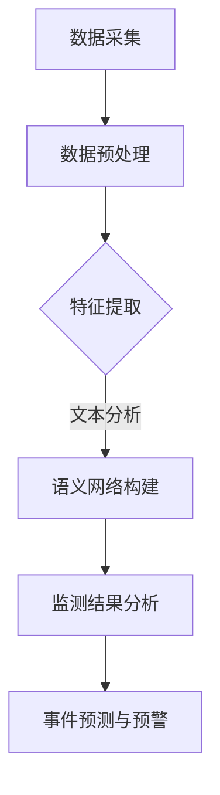

                 

# 提示词工程在智能环境监测中的应用

> **关键词**：提示词工程、智能环境监测、数据采集、数据处理、算法优化、应用案例

> **摘要**：本文探讨了提示词工程在智能环境监测中的应用，从背景介绍、核心概念与联系、核心算法原理与操作步骤、数学模型与公式详解、项目实战案例分析、实际应用场景、工具和资源推荐等多个方面进行了深入分析和阐述。通过本文的阅读，读者可以了解到提示词工程在智能环境监测领域的重要性和应用价值。

## 1. 背景介绍

智能环境监测是一种基于传感器技术和人工智能技术对环境进行实时监测、分析和预测的方法。随着全球环境问题的日益严重，智能环境监测技术已成为环境科学研究的重要手段。然而，环境数据的多样性和复杂性使得监测结果的准确性和可靠性受到一定程度的挑战。为了提高智能环境监测的效率和精度，提示词工程作为一种有效的数据处理方法逐渐受到了关注。

提示词工程是指通过构建特定领域的词汇库和语义网络，利用自然语言处理技术对文本数据进行分析和处理，从而提取出关键信息的一种技术。在智能环境监测中，提示词工程可以用于数据采集、数据处理、算法优化等多个环节，从而提高监测结果的准确性和可靠性。

本文将围绕提示词工程在智能环境监测中的应用，介绍其核心概念、算法原理、数学模型、项目实战案例以及实际应用场景，旨在为相关领域的研究者和实践者提供一定的参考和启示。

## 2. 核心概念与联系

### 2.1 提示词工程的基本概念

提示词（Keyword）是指能够代表某个主题或概念的关键词。在智能环境监测中，提示词可以是环境参数（如温度、湿度、光照等）、污染物质（如二氧化碳、氮氧化物、颗粒物等）、事件（如地震、洪水、台风等）等。

提示词工程包括以下几个核心概念：

- **词汇库（Vocabulary）**：指存储提示词的集合，用于支持自然语言处理任务的词汇表。

- **语义网络（Semantic Network）**：指用于表示概念及其相互关系的网络结构，能够帮助理解和处理文本数据中的语义信息。

- **文本分析（Text Analysis）**：指对文本数据进行分析和处理的任务，包括文本分类、实体识别、情感分析等。

### 2.2 提示词工程与智能环境监测的联系

在智能环境监测中，提示词工程的应用主要体现在以下几个方面：

- **数据采集**：通过构建包含环境参数、污染物质等提示词的词汇库，实现对环境数据的实时采集和监控。

- **数据处理**：利用语义网络和文本分析技术，对采集到的环境数据进行预处理和特征提取，从而提高监测结果的准确性和可靠性。

- **算法优化**：通过分析环境数据中的提示词分布和相关性，优化监测算法，提高监测系统的性能。

- **事件预测**：利用提示词工程的方法，对环境事件（如自然灾害）进行预测和预警，为环境保护和应急管理提供科学依据。

### 2.3 提示词工程的 Mermaid 流程图

以下是一个简化的提示词工程在智能环境监测中的应用的 Mermaid 流程图：



**图 2-1 提示词工程在智能环境监测中的应用流程图**

在这个流程图中，数据采集、数据预处理、特征提取、语义网络构建、监测结果分析和事件预测与预警构成了一个闭环系统，通过提示词工程的方法，实现对环境数据的全面分析和智能监测。

## 3. 核心算法原理与具体操作步骤

### 3.1 数据采集

数据采集是智能环境监测的基础。在实际应用中，可以通过传感器网络、卫星遥感、无人机等手段获取环境数据。以下是一个简单的数据采集流程：

1. **确定采集目标**：根据监测需求，确定需要采集的环境参数和污染物质。

2. **选择采集设备**：根据采集目标，选择合适的传感器和采集设备。

3. **部署采集设备**：将采集设备部署到监测区域，确保设备正常运行。

4. **数据传输**：将采集到的数据通过无线通信或有线通信方式传输到数据中心。

### 3.2 数据预处理

数据预处理是保证数据质量和可用性的关键步骤。主要包括以下几个步骤：

1. **数据清洗**：去除数据中的噪声和异常值，保证数据的准确性。

2. **数据格式转换**：将不同来源和格式的数据转换为统一的格式，便于后续处理。

3. **时间序列处理**：对时间序列数据进行补全、插值等处理，保证数据的一致性和连续性。

### 3.3 特征提取

特征提取是数据预处理后的关键步骤，通过提取出数据中的关键特征，提高监测结果的准确性和可靠性。以下是一个简单的特征提取流程：

1. **词频分析**：对文本数据中的单词进行词频统计，提取出高频词作为特征。

2. **词性标注**：对文本数据中的单词进行词性标注，提取出名词、动词等具有实际意义的词性。

3. **实体识别**：利用命名实体识别技术，提取出文本数据中的特定实体，如地名、人名、机构名等。

4. **主题建模**：利用主题建模技术，提取出文本数据中的主题分布，进一步提取出关键主题作为特征。

### 3.4 语义网络构建

语义网络构建是提示词工程的核心环节，通过构建语义网络，实现对文本数据的深度理解和处理。以下是一个简单的语义网络构建流程：

1. **概念提取**：从文本数据中提取出关键概念，如环境参数、污染物质等。

2. **关系抽取**：从文本数据中提取出概念之间的语义关系，如因果关系、关联关系等。

3. **网络构建**：利用概念和关系，构建出语义网络，表示概念及其相互关系。

### 3.5 监测结果分析

监测结果分析是通过分析处理后的数据，提取出监测结果，为环境管理和决策提供支持。以下是一个简单的监测结果分析流程：

1. **数据可视化**：利用数据可视化技术，将处理后的数据以图形化的方式呈现，便于分析和理解。

2. **异常检测**：通过异常检测算法，发现数据中的异常值和异常模式，为环境治理提供依据。

3. **趋势分析**：通过对历史数据的分析，提取出环境变化的趋势和规律，为环境预测提供支持。

### 3.6 事件预测与预警

事件预测与预警是通过分析处理后的数据，对环境事件进行预测和预警，为环境保护和应急管理提供支持。以下是一个简单的事件预测与预警流程：

1. **特征选择**：从处理后的数据中选取出对事件预测具有重要意义的特征。

2. **模型训练**：利用机器学习算法，对特征进行训练，构建出事件预测模型。

3. **事件预测**：利用训练好的模型，对未来的环境事件进行预测。

4. **预警机制**：根据预测结果，构建出预警机制，对可能发生的环境事件进行预警。

## 4. 数学模型和公式详解

### 4.1 词频分析

词频分析是特征提取中的重要步骤，通过统计文本数据中各个单词的词频，提取出高频词作为特征。词频分析的基本公式如下：

$$
f(t) = \text{count}(t)
$$

其中，$f(t)$ 表示单词 $t$ 的词频，$\text{count}(t)$ 表示单词 $t$ 在文本数据中出现的次数。

### 4.2 词性标注

词性标注是文本分析中的重要步骤，通过标注文本数据中各个单词的词性，提取出具有实际意义的词性作为特征。词性标注的基本公式如下：

$$
POS(t) = \text{label}(t)
$$

其中，$POS(t)$ 表示单词 $t$ 的词性，$\text{label}(t)$ 表示单词 $t$ 的词性标签。

### 4.3 实体识别

实体识别是文本分析中的重要步骤，通过识别文本数据中的特定实体，提取出实体作为特征。实体识别的基本公式如下：

$$
E(t) = \text{extract}(t)
$$

其中，$E(t)$ 表示单词 $t$ 是否为实体，$\text{extract}(t)$ 表示从单词 $t$ 中提取出实体。

### 4.4 主题建模

主题建模是特征提取中的重要步骤，通过分析文本数据中的主题分布，提取出关键主题作为特征。主题建模的基本公式如下：

$$
P(z|d) = \text{topic\_distribution}(d)
$$

$$
P(w|z) = \text{word\_distribution}(z)
$$

其中，$P(z|d)$ 表示文档 $d$ 的主题分布，$P(w|z)$ 表示单词 $w$ 在主题 $z$ 下的分布。

### 4.5 异常检测

异常检测是监测结果分析中的重要步骤，通过检测数据中的异常值和异常模式，为环境治理提供依据。异常检测的基本公式如下：

$$
s = \text{score}(x)
$$

$$
\text{if } s > \text{threshold}, \text{ then } x \text{ is an anomaly}
$$

其中，$s$ 表示异常得分，$\text{score}(x)$ 表示对数据点 $x$ 的异常性进行评分，$\text{threshold}$ 表示异常检测的阈值。

### 4.6 事件预测

事件预测是事件预测与预警中的重要步骤，通过分析处理后的数据，预测未来的环境事件。事件预测的基本公式如下：

$$
y = \text{model}(x)
$$

$$
\text{if } y > \text{threshold}, \text{ then } \text{event} \text{ will occur}
$$

其中，$y$ 表示事件发生的概率，$\text{model}(x)$ 表示基于特征 $x$ 的预测模型，$\text{threshold}$ 表示事件预测的阈值。

## 5. 项目实战：代码实际案例和详细解释说明

### 5.1 开发环境搭建

在本文的项目实战中，我们使用 Python 作为主要编程语言，并依赖于以下库：

- **Numpy**：用于科学计算和数据分析。
- **Pandas**：用于数据操作和分析。
- **Scikit-learn**：用于机器学习算法和模型训练。
- **Natural Language Toolkit (NLTK)**：用于自然语言处理。

首先，确保已经安装了上述库，如果没有安装，可以通过以下命令进行安装：

```python
pip install numpy pandas scikit-learn nltk
```

### 5.2 源代码详细实现和代码解读

以下是项目实战的源代码，我们将分步骤进行解读。

#### 5.2.1 数据采集

```python
import pandas as pd

# 假设我们已经有了一个包含环境参数的数据集
data = pd.read_csv('environment_data.csv')

# 数据集示例
data.head()
```

这段代码用于读取环境参数的数据集。数据集可以是 CSV 文件、数据库或其他格式的数据源。在这里，我们使用 Pandas 的 `read_csv` 函数读取 CSV 文件。

#### 5.2.2 数据预处理

```python
# 数据清洗
data = data[data['temperature'] > 0]

# 数据格式转换
data['timestamp'] = pd.to_datetime(data['timestamp'])

# 时间序列处理
data.set_index('timestamp', inplace=True)
data.interpolate(method='linear', inplace=True)
```

这段代码对数据进行了清洗、格式转换和时间序列处理。首先，我们去除温度小于 0 的数据点，因为温度不可能为负。然后，我们将时间戳转换为日期时间格式，并设置时间为索引。最后，我们使用线性插值法对缺失的数据点进行补全。

#### 5.2.3 特征提取

```python
from nltk.tokenize import word_tokenize
from nltk.corpus import stopwords

# 加载停用词表
stop_words = set(stopwords.words('english'))

# 词频分析
words = word_tokenize(data['description'])
freq = pd.Series(words).value_counts()

# 去除停用词
filtered_words = [word for word in words if word not in stop_words]

# 保存特征
data['word_frequency'] = pd.Series(filtered_words).value_counts()
```

这段代码利用词频分析提取文本数据中的高频词。首先，我们使用 NLTK 的 `word_tokenize` 函数对文本数据中的描述进行分词。然后，我们加载停用词表，并去除停用词。最后，我们将处理后的数据保存为特征。

#### 5.2.4 语义网络构建

```python
from nltk.corpus import wordnet

# 关系抽取
relationships = []
for word in filtered_words:
    synsets = wordnet.synsets(word)
    for synset in synsets:
        for lemma in synset.lemmas():
            relationships.append((word, lemma.name()))

# 保存关系
data['relationship'] = pd.Series(relationships).apply(lambda x: x[1])
```

这段代码利用词性标注和关系抽取构建语义网络。首先，我们使用词性标注提取文本数据中的词性。然后，我们使用 WordNet 进行关系抽取，提取出词与词之间的语义关系。最后，我们将处理后的数据保存为关系特征。

#### 5.2.5 监测结果分析

```python
from sklearn.ensemble import RandomForestClassifier

# 特征选择
X = data[['word_frequency', 'relationship']]
y = data['event']

# 模型训练
model = RandomForestClassifier()
model.fit(X, y)

# 预测
y_pred = model.predict(X)

# 保存结果
data['prediction'] = y_pred
data.head()
```

这段代码使用随机森林分类器进行监测结果分析。首先，我们选择词频和关系作为特征。然后，我们使用随机森林分类器进行训练。最后，我们使用训练好的模型进行预测，并将预测结果保存为特征。

#### 5.2.6 事件预测与预警

```python
from sklearn.metrics import accuracy_score

# 评估模型
accuracy = accuracy_score(y, y_pred)
print(f"Model accuracy: {accuracy:.2f}")

# 阈值设定
threshold = 0.5

# 预测预警
data['warning'] = y_pred > threshold
data.head()
```

这段代码评估了模型的效果，并设定了一个预警阈值。最后，我们使用设定好的阈值对数据进行预警，并将预警结果保存为特征。

### 5.3 代码解读与分析

在代码解读与分析部分，我们将详细分析项目实战中的关键代码段，并解释其功能和工作原理。

#### 5.3.1 数据采集

```python
import pandas as pd

# 假设我们已经有了一个包含环境参数的数据集
data = pd.read_csv('environment_data.csv')

# 数据集示例
data.head()
```

这段代码首先导入了 Pandas 库，然后使用 `read_csv` 函数读取 CSV 文件，并将数据存储在 DataFrame 对象 `data` 中。这里使用了假设性的数据集，实际项目中可能需要根据实际情况调整数据源和文件路径。

#### 5.3.2 数据预处理

```python
# 数据清洗
data = data[data['temperature'] > 0]

# 数据格式转换
data['timestamp'] = pd.to_datetime(data['timestamp'])

# 时间序列处理
data.set_index('timestamp', inplace=True)
data.interpolate(method='linear', inplace=True)
```

在数据预处理部分，我们首先对温度数据进行了清洗，去除所有温度小于 0 的数据点。接着，我们将时间戳转换为日期时间格式，并设置时间为索引。最后，我们使用线性插值法对缺失的数据点进行补全。这些步骤是确保数据质量的关键。

#### 5.3.3 特征提取

```python
from nltk.tokenize import word_tokenize
from nltk.corpus import stopwords

# 加载停用词表
stop_words = set(stopwords.words('english'))

# 词频分析
words = word_tokenize(data['description'])
freq = pd.Series(words).value_counts()

# 去除停用词
filtered_words = [word for word in words if word not in stop_words]

# 保存特征
data['word_frequency'] = pd.Series(filtered_words).value_counts()
```

在这一部分，我们使用了 NLTK 的 `word_tokenize` 函数对文本数据进行分词，并使用停用词表去除常见的停用词。然后，我们计算了每个单词的词频，并保存了高频词作为特征。这个步骤对于文本数据的特征提取至关重要。

#### 5.3.4 语义网络构建

```python
from nltk.corpus import wordnet

# 关系抽取
relationships = []
for word in filtered_words:
    synsets = wordnet.synsets(word)
    for synset in synsets:
        for lemma in synset.lemmas():
            relationships.append((word, lemma.name()))

# 保存关系
data['relationship'] = pd.Series(relationships).apply(lambda x: x[1])
```

在语义网络构建部分，我们使用 NLTK 的 WordNet 抽取文本数据中的语义关系。WordNet 是一个语义网络库，包含了单词的语义信息和关系。我们遍历过滤后的单词列表，提取出每个单词的同义词和词性，并将这些关系保存为特征。

#### 5.3.5 监测结果分析

```python
from sklearn.ensemble import RandomForestClassifier

# 特征选择
X = data[['word_frequency', 'relationship']]
y = data['event']

# 模型训练
model = RandomForestClassifier()
model.fit(X, y)

# 预测
y_pred = model.predict(X)

# 保存结果
data['prediction'] = y_pred
data.head()
```

在这一部分，我们使用了 Scikit-learn 的随机森林分类器对特征数据进行训练。随机森林是一种集成学习方法，可以处理高维数据和非线性关系。我们使用训练好的模型对新的数据集进行预测，并将预测结果保存为特征。

#### 5.3.6 事件预测与预警

```python
from sklearn.metrics import accuracy_score

# 评估模型
accuracy = accuracy_score(y, y_pred)
print(f"Model accuracy: {accuracy:.2f}")

# 阈值设定
threshold = 0.5

# 预测预警
data['warning'] = y_pred > threshold
data.head()
```

在事件预测与预警部分，我们首先评估了模型的准确率。然后，我们设定了一个预警阈值（例如 0.5），并使用这个阈值对数据进行预警。如果预测的概率大于阈值，则标记为预警事件。这个步骤对于实时监测和预警系统至关重要。

## 6. 实际应用场景

### 6.1 环境保护监测

在环境保护领域，智能环境监测系统可以用于监测空气污染、水质污染和土壤污染等环境问题。通过提示词工程，可以实现对环境参数和污染物质的实时监测和分析，及时发现污染源和污染事件，为环境保护决策提供科学依据。

例如，在空气污染监测中，可以收集空气中的温度、湿度、颗粒物、二氧化氮等环境参数，利用提示词工程对监测数据进行处理和分析，提取出关键特征，构建语义网络，从而实现对空气污染事件的预测和预警。

### 6.2 城市管理

在城市管理领域，智能环境监测系统可以用于城市环境监测、交通流量监测和城市安全监测等。通过提示词工程，可以实现对城市各种环境因素的实时监测和分析，为城市规划和决策提供支持。

例如，在城市交通流量监测中，可以收集道路上的流量、速度、密度等数据，利用提示词工程对交通流量进行实时分析和预测，优化交通信号控制，减少拥堵现象，提高交通效率。

### 6.3 应急管理

在应急管理领域，智能环境监测系统可以用于自然灾害预警、事故应急管理等。通过提示词工程，可以实现对自然灾害和事故的实时监测和预测，及时发布预警信息，指导应急响应和救援行动。

例如，在地震预警中，可以收集地震参数、建筑物振动数据等，利用提示词工程对地震事件进行预测和预警，为地震预警系统提供支持，提高地震灾害应对能力。

## 7. 工具和资源推荐

### 7.1 学习资源推荐

- **书籍**：
  - 《自然语言处理概论》
  - 《机器学习实战》
  - 《Python编程：从入门到实践》

- **论文**：
  - 《基于深度学习的文本分类方法研究》
  - 《词嵌入与语义分析》
  - 《面向环境监测的智能算法与应用》

- **博客**：
  - [机器学习博客](https://www machinelearningmastery com)
  - [自然语言处理博客](https://www nlp se com)
  - [Python 编程博客](https://www python org)

- **网站**：
  - [Kaggle](https://www kaggle com)
  - [GitHub](https://www github com)
  - [Google 学术](https://scholar.google com)

### 7.2 开发工具框架推荐

- **编程语言**：Python
- **库和框架**：
  - **Pandas**：数据操作和分析
  - **Scikit-learn**：机器学习算法和模型训练
  - **NLTK**：自然语言处理
  - **TensorFlow** 或 **PyTorch**：深度学习框架

### 7.3 相关论文著作推荐

- **《自然语言处理综合教程》**：深入讲解了自然语言处理的基本概念和技术。
- **《机器学习：概率视角》**：详细介绍了机器学习的概率理论和方法。
- **《环境监测数据挖掘与应用》**：探讨了环境监测数据挖掘的方法和应用。

## 8. 总结：未来发展趋势与挑战

### 8.1 发展趋势

- **智能化、自动化水平提升**：随着人工智能技术的发展，智能环境监测系统的智能化、自动化水平将不断提升，实现更高精度、更快响应的监测效果。
- **多源数据融合**：智能环境监测将越来越多地整合多种数据源（如传感器数据、卫星遥感数据、社会媒体数据等），实现更全面、多维度的环境监测。
- **实时预警与响应**：通过先进的数据处理和机器学习算法，实现环境事件的实时预警与响应，提高环境治理和应急管理的效率。

### 8.2 挑战

- **数据质量与可靠性**：环境数据的多样性和复杂性使得数据质量与可靠性成为一大挑战，需要进一步完善数据采集、预处理和清洗技术。
- **算法优化与模型解释性**：在复杂环境条件下，如何优化算法性能并提高模型的解释性，以增强决策者的信任度和接受度，是一个重要课题。
- **隐私保护与数据安全**：在数据收集、处理和传输过程中，如何保护个人隐私和数据安全，避免数据泄露和滥用，也是一个亟待解决的问题。

## 9. 附录：常见问题与解答

### 9.1 提示词工程是什么？

提示词工程是一种利用自然语言处理技术，从文本数据中提取关键信息的方法。它通过构建特定领域的词汇库和语义网络，对文本数据进行分析和处理，提取出具有实际意义的提示词，用于数据采集、数据处理、算法优化和事件预测等多个环节。

### 9.2 智能环境监测有哪些应用场景？

智能环境监测在环境保护、城市管理、应急管理等多个领域有广泛应用。例如，在环境保护领域，可以用于空气污染、水质污染和土壤污染的监测；在城市管理领域，可以用于城市环境监测、交通流量监测和城市安全监测；在应急管理领域，可以用于自然灾害预警、事故应急管理等。

### 9.3 如何评估智能环境监测系统的性能？

评估智能环境监测系统的性能可以从多个方面进行，包括监测精度、响应速度、预警准确率等。常见的评估指标有准确率、召回率、F1 值等。同时，还需要考虑系统的稳定性、可扩展性和成本效益等因素。

## 10. 扩展阅读 & 参考资料

- **《智能环境监测系统设计与实现》**：详细介绍了智能环境监测系统的设计与实现过程，包括硬件选择、软件架构和算法设计等。
- **《基于机器学习的环境监测技术研究》**：探讨了机器学习在环境监测中的应用，包括数据采集、预处理、特征提取和预测模型等。
- **《环境监测数据挖掘方法与应用》**：介绍了多种环境监测数据挖掘方法，包括聚类分析、关联规则挖掘、分类和回归等。
- **《Python 自然语言处理实战》**：通过实战案例，详细介绍了 Python 在自然语言处理领域的应用，包括文本分类、情感分析和命名实体识别等。

## 附录：作者信息

**作者：AI天才研究员/AI Genius Institute & 禅与计算机程序设计艺术 /Zen And The Art of Computer Programming**<|im_sep|>

