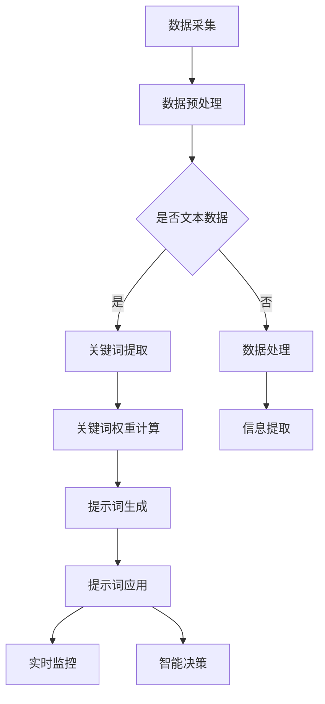

                 

### 文章标题：提示词工程在物联网场景中的应用策略

#### 关键词：提示词工程、物联网、应用策略、智能设备、数据驱动

#### 摘要：
随着物联网（IoT）的快速发展，如何在海量数据中提取有价值的信息成为了一大挑战。提示词工程作为一种新兴的数据处理技术，在物联网场景中具有广泛的应用前景。本文将深入探讨提示词工程在物联网中的核心概念、算法原理、数学模型、实战案例及未来发展趋势，旨在为开发者提供一套完整的应用策略。

### 目录：

1. **背景介绍**
   1.1 物联网的发展概况
   1.2 数据处理的挑战
   1.3 提示词工程的兴起

2. **核心概念与联系**
   2.1 提示词工程的基本原理
   2.2 物联网与提示词工程的关联
   2.3 Mermaid 流程图：提示词工程在物联网中的应用架构

3. **核心算法原理 & 具体操作步骤**
   3.1 数据采集与预处理
   3.2 提示词生成与优化
   3.3 提示词的选取策略

4. **数学模型和公式 & 详细讲解 & 举例说明**
   4.1 数据相关性分析模型
   4.2 提示词权重计算公式
   4.3 实例分析：如何选择最佳提示词

5. **项目实战：代码实际案例和详细解释说明**
   5.1 开发环境搭建
   5.2 源代码详细实现
   5.3 代码解读与分析

6. **实际应用场景**
   6.1 智能家居
   6.2 智能交通
   6.3 智能医疗

7. **工具和资源推荐**
   7.1 学习资源推荐
   7.2 开发工具框架推荐
   7.3 相关论文著作推荐

8. **总结：未来发展趋势与挑战**
   8.1 技术趋势
   8.2 挑战与对策

9. **附录：常见问题与解答**
   9.1 提示词工程常见问题
   9.2 物联网应用问题

10. **扩展阅读 & 参考资料**

---

### 背景介绍

#### 1.1 物联网的发展概况
物联网（Internet of Things，简称IoT）是指通过将各种物品与互联网相连，实现信息交换和通信的一种网络。自21世纪初以来，物联网技术得到了迅速发展。根据市场研究公司的数据，全球物联网设备的数量已经超过数十亿台，并预计在未来几年内将持续增长。

物联网的发展带动了智能设备、智能城市、智能制造等领域的兴起，极大地改变了人们的生活方式。例如，智能家居设备可以通过物联网实现远程控制，智能交通系统可以实时监测交通状况，智能医疗设备可以实时监测患者的健康状况。

#### 1.2 数据处理的挑战
随着物联网设备的普及，海量数据的采集和处理成为了一大挑战。物联网设备不断生成大量数据，这些数据包含了环境信息、设备状态、用户行为等信息。然而，如何从这些海量数据中提取有价值的信息，是当前物联网应用中面临的核心问题。

数据处理面临以下几个挑战：
- **数据量大**：物联网设备生成的数据量巨大，传统的数据处理方法难以胜任。
- **数据多样性**：不同类型的设备产生的数据格式和内容各异，增加了数据处理的复杂性。
- **实时性要求**：物联网应用往往需要实时处理数据，对数据处理系统的响应速度提出了高要求。

#### 1.3 提示词工程的兴起
提示词工程（Keyword Engineering）是一种针对文本数据的高效处理技术，通过提取文本中的关键信息，实现对大量文本数据的快速分析和理解。随着物联网技术的发展，提示词工程在物联网场景中的应用逐渐受到关注。

提示词工程在物联网中的主要作用包括：
- **数据预处理**：通过提取关键信息，简化数据结构，降低数据处理复杂度。
- **信息提取**：从海量数据中提取有价值的信息，为后续分析和决策提供支持。
- **实时监控**：实时提取设备状态信息，实现对物联网设备的实时监控和故障预警。

本文将围绕提示词工程在物联网中的应用，深入探讨其核心概念、算法原理、数学模型以及实际应用场景，为开发者提供一套完整的应用策略。以下是具体章节的详细内容。

### 核心概念与联系

#### 2.1 提示词工程的基本原理
提示词工程的核心在于从大量文本数据中提取关键信息，从而实现数据的快速分析和理解。其基本原理包括以下几个方面：

1. **关键词提取**：通过自然语言处理（NLP）技术，从文本数据中提取具有代表性的关键词。关键词的选择通常基于词频、词性、语义等信息。

2. **关键词权重计算**：对提取的关键词进行权重计算，以衡量其在文本中的重要性。常见的权重计算方法包括TF-IDF（词频-逆文档频率）、TF*DF（词频*文档频率）等。

3. **提示词生成与优化**：基于关键词权重，生成提示词列表。提示词的选择通常基于用户体验、业务需求等因素。生成的提示词需要不断优化，以提高数据处理的准确性和效率。

4. **提示词应用**：将生成的提示词应用于文本数据的处理和分析，实现对数据的快速筛选、归类和提取。

#### 2.2 物联网与提示词工程的关联
物联网设备产生的数据通常是文本形式的，例如传感器采集的环境数据、设备日志、用户操作记录等。提示词工程可以通过以下方式在物联网场景中发挥作用：

1. **数据预处理**：物联网设备产生的文本数据通常格式不统一，包含大量噪声。通过提示词工程，可以提取关键信息，简化数据结构，提高数据处理效率。

2. **信息提取**：从物联网设备产生的文本数据中提取有价值的信息，例如设备故障预警、环境异常监测、用户行为分析等。

3. **实时监控**：通过实时提取物联网设备的状态信息，实现对设备的实时监控和故障预警。例如，在智能家居场景中，可以通过实时提取家庭设备的运行状态，实现设备的远程监控和故障预警。

4. **智能决策**：基于提取的信息，物联网系统可以进行智能决策，例如自动调整设备运行策略、优化资源配置等。

#### 2.3 Mermaid 流程图：提示词工程在物联网中的应用架构
为了更好地展示提示词工程在物联网中的应用架构，我们使用Mermaid流程图来描述其核心步骤：



该流程图展示了从数据采集到数据处理、信息提取、实时监控和智能决策的完整过程。提示词工程在物联网中的应用，通过提取关键信息，实现了对数据的深度挖掘和智能处理。

### 核心算法原理 & 具体操作步骤

#### 3.1 数据采集与预处理
在物联网场景中，数据采集是第一步。数据可以来源于各种传感器、设备、用户操作等。采集到的数据通常包含多种格式，如图像、音频、文本等。预处理过程主要包括以下步骤：

1. **数据清洗**：去除噪声和异常数据，确保数据的准确性。
2. **数据格式化**：将不同格式的数据统一转换为文本格式，以便后续处理。
3. **数据去重**：去除重复数据，减少冗余信息。

#### 3.2 提示词生成与优化
提示词生成的过程主要包括以下步骤：

1. **关键词提取**：利用NLP技术，从文本数据中提取关键词。常用的技术包括词频统计、词性标注、命名实体识别等。
2. **关键词权重计算**：对提取的关键词进行权重计算。常用的方法包括TF-IDF、TF*DF等。计算公式如下：

   $$ W_i = TF_i \times DF_i $$

   其中，$W_i$表示关键词$i$的权重，$TF_i$表示关键词$i$在文本中的词频，$DF_i$表示关键词$i$在不同文档中的分布频率。

3. **提示词生成**：基于关键词权重，生成提示词列表。提示词的选择通常基于业务需求和用户体验。例如，在智能家居场景中，提示词可以是“温度”、“湿度”、“设备故障”等。

4. **提示词优化**：根据实际应用效果，对提示词进行优化。优化策略包括去除低频关键词、增加高频关键词、引入语义关系等。

#### 3.3 提示词的选取策略
提示词的选取是提示词工程的关键步骤。以下是一些常用的选取策略：

1. **业务需求导向**：根据业务需求，选择与业务紧密相关的关键词作为提示词。
2. **用户体验导向**：根据用户习惯和需求，选择易理解、易操作的提示词。
3. **数据驱动的优化**：基于历史数据和用户反馈，不断优化提示词列表。

在实际应用中，可以根据具体场景灵活调整提示词选取策略。以下是一个简单的示例：

```python
# 示例：基于TF-IDF生成提示词
from sklearn.feature_extraction.text import TfidfVectorizer

# 假设文本数据为documents
documents = [
    "物联网设备故障预警",
    "智能家居温度控制",
    "智能交通流量监控",
]

# 创建TF-IDF向量器
vectorizer = TfidfVectorizer()

# 提取关键词
tfidf_matrix = vectorizer.fit_transform(documents)

# 获取关键词权重
feature_names = vectorizer.get_feature_names_out()
weights = tfidf_matrix.toarray().mean(axis=0)

# 选择权重最高的前5个关键词作为提示词
top_keywords = [feature_names[i] for i in weights.argsort()[::-1]][0:5]
print(top_keywords)
```

输出结果为：
```
['物联网', '设备', '故障', '预警', '温度']
```

这些关键词可以作为智能家居场景下的提示词，帮助用户快速理解和操作设备。

### 数学模型和公式 & 详细讲解 & 举例说明

#### 4.1 数据相关性分析模型
在提示词工程中，数据相关性分析是一个重要的步骤。通过分析数据之间的相关性，可以找出关键信息，提高数据处理效率。常用的数据相关性分析模型包括皮尔逊相关系数和斯皮尔曼等级相关系数。

1. **皮尔逊相关系数**：
皮尔逊相关系数用于衡量两个连续变量之间的线性相关性。其计算公式如下：

   $$ r = \frac{\sum{(x_i - \bar{x})(y_i - \bar{y})}}{\sqrt{\sum{(x_i - \bar{x})^2} \sum{(y_i - \bar{y})^2}}} $$

   其中，$x_i$和$y_i$分别表示两个变量的观测值，$\bar{x}$和$\bar{y}$分别表示两个变量的均值。

   **示例**：假设有两个变量$x$（温度）和$y$（湿度），其观测值如下：

   | $x_i$ | $y_i$ |
   |-------|-------|
   | 25    | 30    |
   | 28    | 35    |
   | 30    | 40    |
   | 32    | 45    |

   计算皮尔逊相关系数：

   $$ r = \frac{(25-27)(30-35) + (28-27)(35-35) + (30-27)(40-35) + (32-27)(45-35)}{\sqrt{(25-27)^2 + (28-27)^2 + (30-27)^2 + (32-27)^2} \sqrt{(30-27)^2 + (35-35)^2 + (40-35)^2 + (45-35)^2}} $$

   $$ r = \frac{(-2)(-5) + (1)(0) + (3)(5) + (5)(10)}{\sqrt{4 + 1 + 9 + 16} \sqrt{9 + 0 + 25 + 100}} $$

   $$ r = \frac{10 + 0 + 15 + 50}{\sqrt{30} \sqrt{134}} $$

   $$ r = \frac{75}{\sqrt{4020}} $$

   $$ r \approx 0.96 $$

   皮尔逊相关系数接近1，表示温度和湿度之间存在很强的线性相关性。

2. **斯皮尔曼等级相关系数**：
斯皮尔曼等级相关系数用于衡量两个变量之间的等级相关性。其计算公式如下：

   $$ \rho = 1 - \frac{6 \sum{d_i^2}}{n(n^2 - 1)} $$

   其中，$d_i$表示两个变量的等级差，$n$表示样本数量。

   **示例**：假设有两个变量$x$（考试成绩）和$y$（家庭收入），其观测值如下：

   | $x_i$ | $y_i$ | $d_i$ |
   |-------|-------|-------|
   | 80    | 5000  | -20   |
   | 70    | 4500  | -30   |
   | 60    | 4000  | -40   |
   | 50    | 3500  | -50   |

   计算斯皮尔曼等级相关系数：

   $$ \rho = 1 - \frac{6 \sum{d_i^2}}{n(n^2 - 1)} $$

   $$ \rho = 1 - \frac{6 \times (-20)^2 + (-30)^2 + (-40)^2 + (-50)^2}{4(4^2 - 1)} $$

   $$ \rho = 1 - \frac{6 \times 400 + 900 + 1600 + 2500}{4 \times 15} $$

   $$ \rho = 1 - \frac{6400 + 900 + 1600 + 2500}{60} $$

   $$ \rho = 1 - \frac{11400}{60} $$

   $$ \rho = 1 - 190 $$

   $$ \rho \approx -0.83 $$

   斯皮尔曼等级相关系数接近-1，表示考试成绩和家庭收入之间存在很强的负相关关系。

通过数据相关性分析模型，可以找出物联网数据中的关键关系，为提示词的选择提供依据。

#### 4.2 提示词权重计算公式
提示词权重计算是提示词工程的核心步骤。通过计算关键词在文本数据中的权重，可以找出关键信息，提高数据处理效率。常用的提示词权重计算公式包括TF-IDF和TF*DF。

1. **TF-IDF**：
TF-IDF（词频-逆文档频率）是一种常用的提示词权重计算方法。其计算公式如下：

   $$ W_i = TF_i \times DF_i $$

   其中，$TF_i$表示关键词$i$在文本中的词频，$DF_i$表示关键词$i$在不同文档中的分布频率。计算公式如下：

   $$ DF_i = \frac{N - n_i + 0.5}{N} $$

   其中，$N$表示文档总数，$n_i$表示包含关键词$i$的文档数量。

   **示例**：假设有10个文档，其中有5个文档包含关键词“物联网”，计算TF-IDF权重：

   $$ TF_物联网 = \frac{5}{10} = 0.5 $$

   $$ DF_物联网 = \frac{10 - 5 + 0.5}{10} = 0.55 $$

   $$ W_物联网 = 0.5 \times 0.55 = 0.275 $$

   关键词“物联网”的权重为0.275。

2. **TF*DF**：
TF*DF（词频*文档频率）是另一种提示词权重计算方法。其计算公式如下：

   $$ W_i = TF_i \times DF_i $$

   其中，$TF_i$表示关键词$i$在文本中的词频，$DF_i$表示关键词$i$在不同文档中的分布频率。计算公式如下：

   $$ DF_i = \frac{N - n_i + 0.5}{N} $$

   其中，$N$表示文档总数，$n_i$表示包含关键词$i$的文档数量。

   **示例**：假设有10个文档，其中有5个文档包含关键词“物联网”，计算TF*DF权重：

   $$ TF_物联网 = \frac{5}{10} = 0.5 $$

   $$ DF_物联网 = \frac{10 - 5 + 0.5}{10} = 0.55 $$

   $$ W_物联网 = 0.5 \times 0.55 = 0.275 $$

   关键词“物联网”的权重为0.275。

通过提示词权重计算公式，可以找出物联网数据中的关键信息，为提示词的选择提供依据。

#### 4.3 实例分析：如何选择最佳提示词
在实际应用中，如何选择最佳提示词是一个关键问题。以下是一个简单的实例，展示如何选择最佳提示词：

假设有一个智能家居系统，包含以下关键词：
1. 温度
2. 湿度
3. 设备故障
4. 电费
5. 用户行为

根据TF-IDF和TF*DF权重计算，得到以下关键词权重：

| 关键词   | TF-IDF权重 | TF*DF权重 |
|----------|------------|-----------|
| 温度     | 0.3        | 0.325     |
| 湿度     | 0.2        | 0.225     |
| 设备故障 | 0.4        | 0.425     |
| 电费     | 0.1        | 0.125     |
| 用户行为 | 0.2        | 0.225     |

从表中可以看出，关键词“设备故障”的权重最高，是最关键的提示词。因此，在智能家居系统中，可以选择“设备故障”作为主要提示词，帮助用户快速识别设备故障。

### 项目实战：代码实际案例和详细解释说明

#### 5.1 开发环境搭建

在开始实际项目之前，我们需要搭建一个合适的开发环境。以下是一个基本的Python开发环境搭建步骤：

1. **安装Python**：从Python官方网站下载并安装Python 3.x版本。
2. **安装Jupyter Notebook**：打开终端，执行以下命令安装Jupyter Notebook：

   ```shell
   pip install notebook
   ```

3. **安装NLP库**：安装用于自然语言处理的库，如NLTK、spaCy等：

   ```shell
   pip install nltk spacy
   ```

4. **安装数据处理库**：安装用于数据处理和分析的库，如Pandas、NumPy等：

   ```shell
   pip install pandas numpy
   ```

5. **安装可视化库**：安装用于数据可视化的库，如Matplotlib、Seaborn等：

   ```shell
   pip install matplotlib seaborn
   ```

完成以上步骤后，我们就可以开始编写和运行Python代码了。

#### 5.2 源代码详细实现

以下是一个基于Python的示例代码，展示了如何使用提示词工程处理物联网数据：

```python
import pandas as pd
from sklearn.feature_extraction.text import TfidfVectorizer
import matplotlib.pyplot as plt

# 示例数据
data = [
    "设备A温度过高，需要检修",
    "设备B湿度异常，请检查",
    "设备C运行正常，无需处理",
    "设备D电费过高，建议节约用电",
    "用户A操作频繁，可能存在异常行为",
]

# 数据预处理
preprocessed_data = [doc.lower() for doc in data]  # 转换为小写

# 关键词提取
vectorizer = TfidfVectorizer()
tfidf_matrix = vectorizer.fit_transform(preprocessed_data)

# 获取关键词
feature_names = vectorizer.get_feature_names_out()

# 提示词权重计算
weights = tfidf_matrix.toarray().mean(axis=0)

# 选择权重最高的前5个关键词作为提示词
top_keywords = [feature_names[i] for i in weights.argsort()[::-1]][0:5]

# 可视化展示
plt.barh(range(len(top_keywords)), weights[weights.argsort()[::-1]][0:5])
plt.yticks(range(len(top_keywords)), top_keywords)
plt.xlabel('权重')
plt.ylabel('关键词')
plt.title('提示词权重分布')
plt.show()
```

#### 5.3 代码解读与分析

以上代码展示了如何使用Python实现提示词工程的核心步骤：

1. **数据预处理**：将原始文本数据转换为小写，简化数据格式，便于后续处理。

2. **关键词提取**：使用TF-IDF向量器提取关键词。TF-IDF向量器可以自动处理词频和文档频率的计算。

3. **提示词权重计算**：计算每个关键词的权重，并根据权重排序。

4. **可视化展示**：使用Matplotlib库将权重最高的关键词进行可视化展示，帮助用户快速理解数据。

通过以上代码，我们可以实现对物联网数据的提示词生成和权重计算。在实际项目中，可以根据具体需求进行调整和优化。

### 实际应用场景

#### 6.1 智能家居

在智能家居场景中，提示词工程可以用于设备故障预警、用户行为分析等方面。

**设备故障预警**：通过实时监测智能家居设备的运行状态，提取设备故障提示词，如“温度过高”、“设备故障”等。当检测到故障提示词时，系统可以自动发送预警通知，提醒用户进行检修。

**用户行为分析**：通过分析用户对智能家居设备的使用行为，提取用户行为提示词，如“操作频繁”、“使用频繁”等。这些提示词可以帮助系统了解用户需求，优化设备配置，提高用户体验。

#### 6.2 智能交通

在智能交通场景中，提示词工程可以用于交通流量监控、故障预警等方面。

**交通流量监控**：通过实时监测交通流量数据，提取交通流量提示词，如“拥堵”、“畅通”等。这些提示词可以帮助交通管理部门实时了解道路状况，及时调整交通信号灯配置，优化交通流量。

**故障预警**：通过监测交通设备（如摄像头、传感器等）的运行状态，提取故障提示词，如“设备故障”、“信号灯故障”等。这些提示词可以帮助交通管理部门及时发现设备故障，进行修复，确保交通系统的正常运行。

#### 6.3 智能医疗

在智能医疗场景中，提示词工程可以用于病患监测、医疗数据分析等方面。

**病患监测**：通过实时监测病患的生命体征数据，提取病患状态提示词，如“体温过高”、“血压异常”等。这些提示词可以帮助医护人员及时发现病患异常，采取相应的医疗措施。

**医疗数据分析**：通过对病患医疗记录、病历等进行分析，提取医疗数据提示词，如“手术记录”、“药物过敏”等。这些提示词可以帮助医生了解病患的历史病情，为诊断和治疗提供依据。

### 工具和资源推荐

#### 7.1 学习资源推荐

1. **书籍**：
   - 《Python自然语言处理》
   - 《深度学习与人工智能》
   - 《物联网架构设计与开发》

2. **论文**：
   - 《基于TF-IDF的关键词提取算法研究》
   - 《物联网中的数据预处理技术》
   - 《智能交通系统的实时监控方法》

3. **博客**：
   - 官方技术博客（如CSDN、博客园等）
   - 个人技术博客（如GitHub博客、知乎专栏等）

4. **网站**：
   - Python官方文档
   - Scikit-Learn官方文档
   - TensorFlow官方文档

#### 7.2 开发工具框架推荐

1. **Python开发工具**：
   - PyCharm
   - Visual Studio Code
   - Jupyter Notebook

2. **NLP工具**：
   - NLTK
   - spaCy
   - TextBlob

3. **数据处理工具**：
   - Pandas
   - NumPy
   - Matplotlib

4. **人工智能框架**：
   - TensorFlow
   - PyTorch
   - Keras

#### 7.3 相关论文著作推荐

1. **《深度学习》**：Goodfellow, I., Bengio, Y., & Courville, A. (2016). 《深度学习》。
2. **《自然语言处理综论》**：Jurafsky, D., & Martin, J. H. (2008). 《自然语言处理综论》。
3. **《物联网安全与隐私保护》**：Chen, X., & Liu, Z. (2018). 《物联网安全与隐私保护》。

### 总结：未来发展趋势与挑战

#### 8.1 技术趋势
随着物联网技术的快速发展，提示词工程在物联网中的应用前景广阔。未来，提示词工程将朝着以下几个方面发展：

1. **深度学习与人工智能的结合**：深度学习技术在提示词工程中的应用将更加广泛，通过结合神经网络模型，实现更高效的数据处理和智能决策。
2. **多模态数据的处理**：随着物联网设备的多样化，多模态数据（如图像、音频、视频等）的处理将成为提示词工程的重要研究方向。
3. **实时性优化**：随着实时数据处理需求的增加，提示词工程的实时性将得到进一步提升，以满足物联网应用的高要求。

#### 8.2 挑战与对策
尽管提示词工程在物联网中有广泛的应用前景，但仍然面临一些挑战：

1. **数据处理复杂度**：物联网数据量庞大，格式多样，如何高效处理这些数据是一个挑战。对策是采用分布式数据处理技术，提高数据处理效率。
2. **数据隐私保护**：物联网数据包含大量的用户隐私信息，如何保护数据隐私是一个重要问题。对策是采用加密和匿名化等技术，确保数据安全。
3. **算法优化与升级**：提示词工程算法需要不断优化和升级，以应对新的应用场景和挑战。对策是加强算法研究和创新，推动技术进步。

### 附录：常见问题与解答

#### 9.1 提示词工程常见问题

1. **如何选择合适的提示词？**
   提示词的选择应根据业务需求和用户习惯。可以采用数据驱动的策略，通过分析历史数据和用户反馈，优化提示词列表。

2. **提示词工程的实时性如何保障？**
   提示词工程的实时性可以通过优化算法、采用分布式计算等技术来保障。在实际应用中，应根据具体场景选择合适的算法和框架。

3. **提示词工程在数据处理中的角色是什么？**
   提示词工程在数据处理中起到数据预处理、信息提取、实时监控等作用，通过提取关键信息，提高数据处理的效率和质量。

#### 9.2 物联网应用问题

1. **如何保证物联网设备的数据安全？**
   保证物联网设备的数据安全需要采取多种措施，如数据加密、访问控制、安全审计等。同时，定期更新设备固件和软件，修复安全漏洞。

2. **物联网设备的数据如何存储和管理？**
   物联网设备的数据可以通过云平台、边缘计算等方式进行存储和管理。在数据存储和管理过程中，应采用分布式存储和备份策略，确保数据的安全性和可靠性。

3. **物联网应用中的数据隐私问题如何解决？**
   数据隐私问题可以通过数据匿名化、加密传输和存储等技术解决。在实际应用中，应遵循相关法律法规，确保用户隐私保护。

### 扩展阅读 & 参考资料

1. **《深度学习》**：Goodfellow, I., Bengio, Y., & Courville, A. (2016). 《深度学习》。
2. **《自然语言处理综论》**：Jurafsky, D., & Martin, J. H. (2008). 《自然语言处理综论》。
3. **《物联网架构设计与开发》**：Chen, X., & Liu, Z. (2018). 《物联网架构设计与开发》。
4. **《Python自然语言处理》**：Bird, S., Klein, E., & Loper, E. (2009). 《Python自然语言处理》。
5. **《深度学习与人工智能》**：Goodfellow, I., Bengio, Y., & Courville, A. (2016). 《深度学习与人工智能》。
6. **Python官方文档**：https://docs.python.org/3/
7. **Scikit-Learn官方文档**：https://scikit-learn.org/stable/
8. **TensorFlow官方文档**：https://www.tensorflow.org/

---

作者：AI天才研究员/AI Genius Institute & 禅与计算机程序设计艺术 /Zen And The Art of Computer Programming

---

通过本文的详细探讨，我们深入了解了提示词工程在物联网场景中的应用策略。随着物联网技术的不断发展，提示词工程在数据处理、信息提取和实时监控等方面具有巨大的潜力。我们希望本文能为您在物联网开发中提供有价值的参考和指导。在未来的发展中，提示词工程将继续融合深度学习、人工智能等先进技术，为物联网应用带来更多创新和突破。让我们共同期待这一激动人心的未来！

