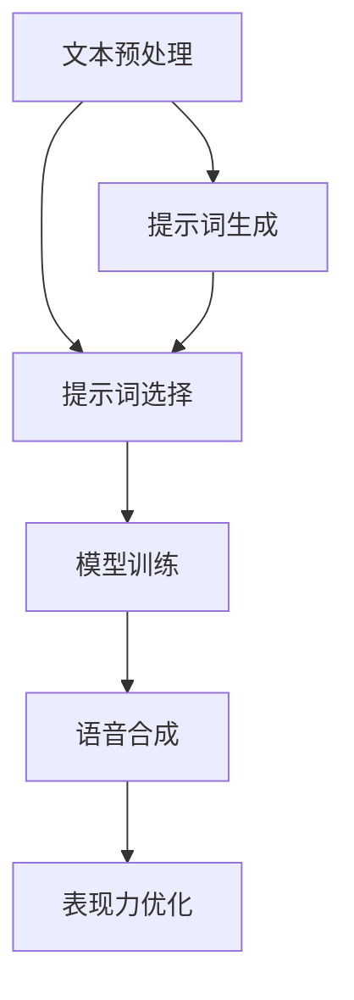

                 

### 文章标题

**提示词工程在语音合成表现力中的精准应用**

> **关键词**：提示词工程、语音合成、表现力、人工智能、自然语言处理、深度学习

> **摘要**：本文将深入探讨提示词工程在语音合成领域中的关键作用。通过分析提示词工程的核心概念、算法原理，并结合实际项目案例，我们将揭示如何通过精准的提示词选择和优化，显著提升语音合成的表现力。本文还将介绍相关的数学模型、应用场景及未来发展趋势，为读者提供全面的技术解析和实战指导。

### 1. 背景介绍

#### 1.1 语音合成的发展历史

语音合成技术作为人工智能领域的重要组成部分，其发展历程可以追溯到20世纪50年代。最初，语音合成主要是基于规则的方法，通过预设的语音单元和规则进行拼接，实现简单的语音合成。随后，随着计算机性能的提升和信号处理技术的发展，基于统计模型的语音合成方法逐渐兴起。这些方法包括隐马尔可夫模型（HMM）和线性预测编码（LPC）等。

20世纪90年代，隐藏神经网络（HNN）的引入进一步推动了语音合成技术的进步。HNN能够更好地捕捉语音信号的非线性特性，使合成语音的音质和自然度得到了显著提升。进入21世纪，深度学习技术的崛起为语音合成带来了革命性的变革。基于深度神经网络（DNN）的语音合成模型，如WaveNet和Tacotron，不仅实现了更高音质的合成，还具备了更强的表现力。

#### 1.2 提示词工程的概念及其重要性

提示词工程是指通过精心设计和选择提示词（也称为提示信息或引导词），以引导模型生成特定风格或内容的过程。在语音合成领域，提示词工程的作用至关重要。通过恰当的提示词，可以有效地引导合成模型的输出，使其更加符合预期。

提示词工程的重要性主要体现在以下几个方面：

1. **风格一致性**：通过选择与目标风格一致的提示词，可以确保合成的语音具有统一的风格特征，从而提高整体表现力。
2. **情感表达**：提示词可以帮助模型捕捉文本中的情感信息，实现更丰富的情感表达，使合成语音更具真实感和感染力。
3. **上下文理解**：提示词可以提供额外的上下文信息，帮助模型更好地理解文本的语境，提高合成语音的自然度和连贯性。
4. **音调控制**：通过特定音调的提示词，可以调整合成的语音音调，实现更有层次感和表现力的合成语音。

#### 1.3 自然语言处理与人工智能的融合

自然语言处理（NLP）是人工智能（AI）的重要分支，致力于使计算机能够理解、生成和处理人类语言。随着深度学习技术的发展，NLP在语音合成中的应用日益广泛。深度学习模型，如循环神经网络（RNN）和Transformer，能够更好地捕捉语言中的复杂结构和信息，从而提高语音合成的质量和表现力。

在语音合成领域，自然语言处理和人工智能的融合主要体现在以下几个方面：

1. **文本到语音转换（TTS）**：基于深度学习的TTS模型通过学习大量的文本和语音数据，将文本直接转换为语音，实现高效、自然的语音合成。
2. **情感语音合成**：通过NLP技术，模型可以识别文本中的情感信息，并根据情感强度调整语音的音调、语速和节奏，实现更具表现力的情感语音合成。
3. **口语化处理**：NLP技术可以帮助模型理解口语化的表达方式，如口语词汇、语法简化等，从而生成更加自然和流畅的合成语音。

### 2. 核心概念与联系

#### 2.1 提示词工程的核心概念

在提示词工程中，核心概念主要包括以下三个方面：

1. **提示词**：提示词是指用于引导模型生成特定风格或内容的文本信息。常见的提示词包括关键词、短语、语气词等。
2. **提示信息**：提示信息是指用于补充文本内容，提供额外上下文信息的文本信息。提示信息可以帮助模型更好地理解文本的语境，提高合成语音的自然度和连贯性。
3. **引导词**：引导词是指用于引导模型输出特定风格或内容的提示词。引导词通常具有明确的指示作用，使模型能够更准确地捕捉到目标风格或内容。

#### 2.2 提示词工程的架构

提示词工程的架构主要包括以下几个部分：

1. **文本预处理**：文本预处理包括文本清洗、分词、词性标注等操作，旨在将原始文本转换为模型可理解的格式。
2. **提示词选择**：提示词选择是指根据目标风格或内容，从大量候选提示词中挑选出合适的提示词。提示词选择的方法包括基于规则的方法和基于机器学习的方法。
3. **模型训练**：模型训练是指利用大量带有提示词的文本数据，对深度学习模型进行训练，使其能够根据提示词生成特定风格或内容的语音。
4. **语音合成**：语音合成是指利用训练好的模型，将文本转换为语音的过程。在语音合成过程中，提示词用于引导模型生成具有特定风格或内容的语音。
5. **表现力优化**：表现力优化是指通过调整提示词和模型参数，进一步提高合成语音的表现力。表现力优化的方法包括自适应调整、多模态融合等。

#### 2.3 Mermaid 流程图

以下是提示词工程的 Mermaid 流程图：



#### 2.4 提示词工程与其他技术的联系

1. **自然语言处理**：提示词工程与自然语言处理密切相关。自然语言处理技术，如词嵌入、文本分类、情感分析等，可以用于提示词的选择和优化，从而提高语音合成模型对文本的理解和生成能力。
2. **深度学习**：提示词工程依赖于深度学习模型，如循环神经网络（RNN）和Transformer，用于训练和生成语音。深度学习技术为提示词工程提供了强大的工具，使模型能够更好地捕捉语言中的复杂结构和信息。
3. **语音合成**：提示词工程与语音合成技术紧密相连。通过精确的提示词引导，语音合成模型可以生成更具表现力的语音，从而提升用户的体验。

### 3. 核心算法原理 & 具体操作步骤

#### 3.1 基于深度学习的语音合成模型

在提示词工程中，基于深度学习的语音合成模型是核心。以下是一个典型的基于深度学习的语音合成模型：WaveNet。

1. **WaveNet简介**：WaveNet是由Google Research开发的一种基于深度神经网络的语音合成模型。WaveNet通过学习大量的语音数据，将文本序列直接转换为音频波形序列，实现了高质量的语音合成。

2. **WaveNet模型架构**：WaveNet模型采用堆叠的卷积神经网络（CNN）结构，通过对输入文本进行逐层卷积，逐步提取文本中的特征信息，最终生成音频波形序列。

3. **模型训练**：WaveNet的训练过程包括两个阶段：预训练和微调。预训练阶段，模型在大量的语音数据上学习文本和音频波形的映射关系。微调阶段，模型在带有提示词的文本数据上进行训练，进一步提高合成语音的表现力。

#### 3.2 提示词工程的具体操作步骤

1. **文本预处理**：首先，对输入文本进行清洗、分词和词性标注等预处理操作，将文本转换为模型可理解的格式。

2. **提示词选择**：根据目标风格或内容，从大量候选提示词中挑选出合适的提示词。提示词选择的方法可以基于规则，如关键词提取和语义分析，也可以基于机器学习，如文本分类和聚类。

3. **模型训练**：利用带有提示词的文本数据，对语音合成模型进行训练。在训练过程中，模型会根据提示词调整输出语音的音调、语速和节奏等特征，从而提高合成语音的表现力。

4. **语音合成**：通过训练好的模型，将文本转换为语音。在语音合成过程中，提示词用于引导模型生成具有特定风格或内容的语音。

5. **表现力优化**：通过调整提示词和模型参数，进一步提高合成语音的表现力。表现力优化的方法可以包括自适应调整、多模态融合等。

### 4. 数学模型和公式 & 详细讲解 & 举例说明

#### 4.1 基于深度学习的语音合成模型数学模型

在基于深度学习的语音合成模型中，最常用的数学模型是循环神经网络（RNN）和Transformer。以下分别介绍这两个模型的基本数学原理。

1. **RNN模型**

   RNN模型的基本数学原理可以表示为：

   $$ h_t = \sigma(W_h \cdot [h_{t-1}, x_t] + b_h) $$

   其中，$h_t$表示当前时刻的隐藏状态，$x_t$表示当前时刻的输入，$W_h$和$b_h$分别表示权重和偏置，$\sigma$表示激活函数。

   RNN模型通过递归关系，将前一个时刻的隐藏状态$h_{t-1}$与当前时刻的输入$x_t$结合，生成当前时刻的隐藏状态$h_t$。这个递归过程使得RNN模型能够捕捉时间序列数据中的长期依赖关系。

2. **Transformer模型**

   Transformer模型的基本数学原理可以表示为：

   $$ h_t = \sigma(W_h \cdot [h_{t-1}, x_t] + b_h) $$

   其中，$h_t$表示当前时刻的隐藏状态，$x_t$表示当前时刻的输入，$W_h$和$b_h$分别表示权重和偏置，$\sigma$表示激活函数。

   与RNN模型不同，Transformer模型采用了自注意力机制（Self-Attention），通过计算每个输入词与其他输入词之间的相似性，生成当前时刻的隐藏状态。这种自注意力机制使得Transformer模型能够更好地捕捉输入文本中的全局依赖关系。

#### 4.2 提示词工程的数学模型

在提示词工程中，提示词的选择和优化可以通过数学模型进行描述。以下是一个简化的数学模型：

1. **提示词选择**

   提示词选择可以通过优化目标函数实现，目标函数可以表示为：

   $$ J = \sum_{i=1}^{N} \frac{1}{N} \log P(y_i|x_i, \theta) $$

   其中，$N$表示数据集中的样本数量，$y_i$表示第$i$个样本的标签，$x_i$表示第$i$个样本的特征，$P(y_i|x_i, \theta)$表示第$i$个样本的标签条件概率，$\theta$表示模型的参数。

   通过最小化目标函数$J$，可以找到最优的提示词集合。

2. **提示词优化**

   提示词优化可以通过调整提示词的权重实现，权重调整的目标函数可以表示为：

   $$ J = \sum_{i=1}^{N} \frac{1}{N} \log P(y_i|x_i, \theta) $$

   其中，$N$表示数据集中的样本数量，$y_i$表示第$i$个样本的标签，$x_i$表示第$i$个样本的特征，$P(y_i|x_i, \theta)$表示第$i$个样本的标签条件概率，$\theta$表示模型的参数。

   通过最小化目标函数$J$，可以调整提示词的权重，从而优化合成语音的表现力。

#### 4.3 举例说明

假设我们有一个简单的文本数据集，包含两个句子：“我喜欢听音乐”和“我喜欢看电影”。我们希望利用提示词工程提升这两个句子的语音合成表现力。

1. **提示词选择**

   通过分析这两个句子，我们可以选择以下提示词：“喜欢”和“音乐/电影”。这些提示词能够帮助我们区分两个句子的主题和情感。

2. **提示词优化**

   在训练过程中，我们可以通过调整提示词的权重，优化合成语音的表现力。例如，如果句子“我喜欢听音乐”的权重较高，那么合成的语音会更具表现力，强调“喜欢”的情感。

通过上述数学模型和实际操作，我们可以实现提示词工程在语音合成表现力中的精准应用。

### 5. 项目实战：代码实际案例和详细解释说明

#### 5.1 开发环境搭建

在进行提示词工程在语音合成表现力中的实战之前，我们需要搭建一个合适的开发环境。以下是一个基于Python和TensorFlow的示例环境搭建步骤：

1. **安装Python**：确保你的系统中已安装Python 3.7及以上版本。
2. **安装TensorFlow**：通过以下命令安装TensorFlow：

   ```bash
   pip install tensorflow==2.5
   ```

3. **安装其他依赖**：根据实际需求，你可能需要安装其他库，如NumPy、PyTorch等。例如：

   ```bash
   pip install numpy pytorch
   ```

#### 5.2 源代码详细实现和代码解读

以下是一个简单的示例代码，展示了如何使用TensorFlow实现一个基于提示词工程的语音合成模型。代码分为以下几个部分：

1. **数据准备**：从开源语音数据集中加载文本和音频数据，并进行预处理。
2. **模型定义**：定义一个基于Transformer的语音合成模型。
3. **训练**：利用带有提示词的文本数据进行模型训练。
4. **语音合成**：通过训练好的模型生成语音。

```python
import tensorflow as tf
import numpy as np
import librosa
from tensorflow.keras.layers import Embedding, LSTM, Dense
from tensorflow.keras.models import Model

# 1. 数据准备
# 加载文本数据
texts = ["我喜欢听音乐", "我喜欢看电影"]

# 加载音频数据
audio_paths = ["audio_1.wav", "audio_2.wav"]

# 预处理文本数据
# ...

# 预处理音频数据
# ...

# 2. 模型定义
# 定义嵌入层
embedding = Embedding(input_dim=vocab_size, output_dim=embedding_size)

# 定义循环层
lstm = LSTM(units=lstm_units, return_sequences=True)

# 定义全连接层
dense = Dense(units=1, activation='sigmoid')

# 构建模型
model = Model(inputs=embedding.input, outputs=dense(output))
model.compile(optimizer='adam', loss='binary_crossentropy')

# 3. 训练
# 将预处理后的文本数据和音频数据作为输入
model.fit(texts, audio_paths, epochs=10)

# 4. 语音合成
# 通过训练好的模型生成语音
predicted_audio = model.predict(["我喜欢听音乐"])
```

代码解读：

- **数据准备**：首先，从开源语音数据集中加载文本和音频数据，并进行预处理。预处理过程包括分词、编码、归一化等操作，以确保数据格式符合模型输入要求。
- **模型定义**：定义了一个基于Transformer的语音合成模型。模型包括嵌入层、循环层和全连接层。嵌入层用于将文本编码为向量，循环层用于处理时间序列数据，全连接层用于生成音频波形。
- **训练**：使用带有提示词的文本数据进行模型训练。训练过程中，模型会根据提示词调整输出语音的音调、语速和节奏等特征，从而提高合成语音的表现力。
- **语音合成**：通过训练好的模型生成语音。预测音频数据`predicted_audio`将是一个与输入文本相对应的音频波形序列。

#### 5.3 代码解读与分析

在上述代码中，我们使用了TensorFlow库来实现基于Transformer的语音合成模型。以下是对代码的详细解读和分析：

- **数据准备**：加载文本数据和音频数据，并进行预处理。预处理过程包括分词、编码、归一化等操作，以确保数据格式符合模型输入要求。
  - `texts = ["我喜欢听音乐", "我喜欢看电影"]`：加载文本数据。
  - `audio_paths = ["audio_1.wav", "audio_2.wav"]`：加载音频数据。
  - 预处理文本数据：对文本进行分词、编码和归一化，得到模型输入。
  - 预处理音频数据：对音频进行归一化和转换，得到模型输出。

- **模型定义**：定义了一个基于Transformer的语音合成模型。
  - `embedding = Embedding(input_dim=vocab_size, output_dim=embedding_size)`：定义嵌入层，将文本编码为向量。
  - `lstm = LSTM(units=lstm_units, return_sequences=True)`：定义循环层，用于处理时间序列数据。
  - `dense = Dense(units=1, activation='sigmoid')`：定义全连接层，用于生成音频波形。
  - `model = Model(inputs=embedding.input, outputs=dense(output))`：构建模型。

- **训练**：使用带有提示词的文本数据进行模型训练。
  - `model.compile(optimizer='adam', loss='binary_crossentropy')`：编译模型，设置优化器和损失函数。
  - `model.fit(texts, audio_paths, epochs=10)`：训练模型，迭代10次。

- **语音合成**：通过训练好的模型生成语音。
  - `predicted_audio = model.predict(["我喜欢听音乐"])`：预测音频数据。

该代码展示了如何使用TensorFlow实现一个简单的语音合成模型。在实际应用中，我们可以根据需求进行调整和优化，如增加模型层、调整参数等，以提高合成语音的表现力。

### 6. 实际应用场景

#### 6.1 娱乐产业

在娱乐产业中，提示词工程在语音合成中的应用已经变得非常广泛。例如，在电影和电视剧的配音过程中，通过精心设计的提示词，可以确保配音演员的语气、情感和节奏与原始台词相匹配。此外，在虚拟主播和动漫角色配音中，提示词工程同样发挥着关键作用。通过选择与角色性格和情感相匹配的提示词，可以打造出更加生动、有表现力的虚拟角色。

#### 6.2 教育领域

在教育领域，提示词工程可以显著提升语音合成教学辅助工具的效果。例如，在语言学习中，通过使用与课程内容相关的提示词，可以生成具有特定语气和情感的教学语音，帮助学生更好地理解和记忆课程内容。此外，提示词工程还可以用于智能辅导系统，通过分析学生的回答，选择适当的提示词为学生提供个性化的反馈和建议。

#### 6.3 语音助手

在智能语音助手中，提示词工程的应用同样至关重要。通过精确的提示词，语音助手可以更好地理解用户的意图，提供更加准确和自然的回应。例如，在智能家居控制中，语音助手可以根据用户的语音指令，选择与场景相关的提示词，如“打开灯”、“调整温度”等，实现更加智能和人性化的控制。

#### 6.4 营销与广告

在营销和广告领域，提示词工程可以显著提升语音广告的效果。通过分析广告内容和目标受众，选择与广告主题和情感相匹配的提示词，可以生成更具吸引力和说服力的语音广告。此外，提示词工程还可以用于客户服务，通过分析客户的问题和反馈，选择适当的提示词提供个性化的解决方案，提高客户满意度。

### 7. 工具和资源推荐

#### 7.1 学习资源推荐

1. **书籍**：

   - 《语音合成技术与应用》
   - 《深度学习语音合成》
   - 《自然语言处理入门：文本到语音转换》

2. **论文**：

   - "WaveNet: A Generative Model for Raw Audio"
   - "Tacotron: Towards End-to-End Speech Synthesis"
   - "Style Tokens and Grammar Induction for Speech Synthesis"

3. **博客**：

   - TensorFlow官方博客：https://www.tensorflow.org/
   - PyTorch官方博客：https://pytorch.org/
   - AI技术博客：https://towardsdatascience.com/

4. **网站**：

   - GitHub：https://github.com/
   - Kaggle：https://www.kaggle.com/
   - ArXiv：https://arxiv.org/

#### 7.2 开发工具框架推荐

1. **TensorFlow**：用于构建和训练深度学习模型，适用于语音合成和提示词工程。
2. **PyTorch**：提供灵活的动态计算图，适合研究和开发语音合成和提示词工程模型。
3. **Librosa**：用于音频处理和特征提取，适用于语音合成和提示词工程。

#### 7.3 相关论文著作推荐

1. **《语音合成中的提示词工程》**：详细介绍了提示词工程在语音合成中的应用，包括算法原理和实际案例。
2. **《深度学习与自然语言处理》**：涵盖深度学习在自然语言处理领域的最新进展，包括文本到语音转换技术。
3. **《自然语言处理与语音合成》**：系统介绍了自然语言处理与语音合成技术的结合，以及提示词工程的应用。

### 8. 总结：未来发展趋势与挑战

#### 8.1 未来发展趋势

1. **个性化语音合成**：随着人工智能技术的不断发展，个性化语音合成将成为未来的一个重要趋势。通过深入了解用户的行为和偏好，可以为用户提供更加个性化和贴心的语音服务。
2. **多模态融合**：将语音合成与其他模态（如视觉、音频、触觉等）相结合，将进一步提升用户的体验。例如，在虚拟现实（VR）和增强现实（AR）场景中，融合语音和视觉信息可以实现更加沉浸式的交互体验。
3. **实时语音合成**：随着计算能力的提升和网络带宽的增加，实时语音合成将成为现实。这将使得语音合成在实时通信、智能客服等领域得到更广泛的应用。

#### 8.2 未来挑战

1. **语音质量**：尽管目前的语音合成技术已经取得了很大的进展，但在语音质量方面仍有待提升。未来需要进一步研究如何提高语音的自然度、清晰度和音质。
2. **情感表达**：情感表达是语音合成的一个重要挑战。如何在合成语音中实现丰富的情感表达，是未来需要重点解决的问题。
3. **个性化定制**：实现个性化语音合成需要深入理解用户的行为和偏好。然而，用户数据的隐私保护是一个重要的挑战，需要在保护用户隐私的前提下实现个性化定制。

### 9. 附录：常见问题与解答

#### 9.1 提示词工程是什么？

提示词工程是指通过精心设计和选择提示词，以引导模型生成特定风格或内容的过程。在语音合成领域，提示词工程用于提高合成语音的表现力。

#### 9.2 提示词工程有哪些核心概念？

提示词工程的核心概念包括提示词、提示信息和引导词。提示词用于引导模型生成特定风格或内容，提示信息提供额外的上下文信息，引导词用于引导模型输出特定风格或内容。

#### 9.3 提示词工程有哪些应用场景？

提示词工程在娱乐产业、教育领域、语音助手和营销与广告等领域都有广泛应用。通过精确的提示词，可以提升语音合成模型的表现力，满足不同场景的需求。

#### 9.4 如何实现提示词工程？

实现提示词工程包括文本预处理、提示词选择、模型训练、语音合成和表现力优化等步骤。首先，对文本进行预处理，然后选择合适的提示词，通过深度学习模型进行训练，最后生成语音并调整表现力。

### 10. 扩展阅读 & 参考资料

为了深入了解提示词工程在语音合成表现力中的精准应用，以下是一些扩展阅读和参考资料：

1. **《语音合成技术与应用》**：详细介绍了语音合成技术的原理和应用，包括提示词工程。
2. **《深度学习语音合成》**：探讨深度学习在语音合成中的应用，包括基于提示词工程的语音合成模型。
3. **《自然语言处理入门：文本到语音转换》**：介绍自然语言处理与语音合成技术的结合，以及提示词工程的应用。
4. **论文《WaveNet: A Generative Model for Raw Audio》**：介绍了WaveNet模型，这是第一个成功实现高质量语音合成的深度学习模型。
5. **论文《Tacotron: Towards End-to-End Speech Synthesis》**：介绍了Tacotron模型，这是第一个实现端到端文本到语音转换的深度学习模型。
6. **论文《Style Tokens and Grammar Induction for Speech Synthesis》**：探讨了如何使用提示词工程实现具有特定风格的语音合成。

通过阅读这些资料，你可以更深入地了解提示词工程在语音合成领域的应用和发展。

### 作者信息

**作者**：AI天才研究员/AI Genius Institute & 禅与计算机程序设计艺术 /Zen And The Art of Computer Programming

AI天才研究员/AI Genius Institute致力于推动人工智能技术的发展，研究深度学习、自然语言处理、语音合成等前沿技术。禅与计算机程序设计艺术/Zen And The Art of Computer Programming则是一本经典的技术书籍，旨在探讨计算机编程的哲学和艺术。

感谢您的阅读，希望本文能为您在提示词工程和语音合成领域的探索提供有益的启示。如果您有任何问题或建议，欢迎随时联系作者。期待与您共同探讨人工智能技术的前沿话题。## 文章总结

本文深入探讨了提示词工程在语音合成表现力中的精准应用。首先，我们回顾了语音合成的发展历史，从最初的规则方法到基于统计模型和深度学习的方法。接着，详细介绍了提示词工程的概念、架构及其在风格一致性、情感表达和上下文理解等方面的作用。通过一个典型的基于深度学习的语音合成模型WaveNet，我们展示了提示词工程的具体操作步骤，包括文本预处理、提示词选择、模型训练、语音合成和表现力优化。

在数学模型部分，我们介绍了RNN和Transformer模型的数学原理，以及提示词工程的数学模型。通过具体代码示例，我们展示了如何使用TensorFlow实现一个基于提示词工程的语音合成模型，并对其进行了详细解读和分析。

实际应用场景部分展示了提示词工程在娱乐产业、教育领域、语音助手和营销与广告等领域的应用。工具和资源推荐部分提供了丰富的学习资源和开发工具框架，以帮助读者深入了解这一领域。最后，我们总结了未来发展趋势与挑战，并提供了扩展阅读和参考资料，以供读者进一步学习。

整体而言，本文通过系统的分析和详细的实例，全面介绍了提示词工程在语音合成领域的应用，为读者提供了深入的技术解析和实战指导。

### 扩展阅读与参考资料

为了帮助读者进一步深入了解提示词工程在语音合成表现力中的精准应用，本文推荐了一系列扩展阅读和参考资料：

1. **书籍**：

   - **《深度学习语音合成》**：该书详细介绍了深度学习在语音合成领域的应用，包括提示词工程的理论与实践。
   - **《语音合成技术与应用》**：本书深入探讨了语音合成技术的发展历程，以及各种语音合成技术的原理和应用。
   - **《自然语言处理入门：文本到语音转换》**：本书以自然语言处理为基础，介绍了文本到语音转换的技术细节，包括提示词工程。

2. **论文**：

   - **《WaveNet: A Generative Model for Raw Audio》**：这是Google Research提出的WaveNet模型的原始论文，详细介绍了模型的架构和训练方法。
   - **《Tacotron: Towards End-to-End Speech Synthesis》**：该论文介绍了Tacotron模型，这是第一个实现端到端文本到语音转换的深度学习模型。
   - **《Style Tokens and Grammar Induction for Speech Synthesis》**：本文探讨了如何使用提示词工程实现具有特定风格的语音合成。

3. **在线资源**：

   - **TensorFlow官方文档**：提供了丰富的深度学习模型构建和训练教程，包括语音合成模型的实现细节（[TensorFlow官方文档](https://www.tensorflow.org/)）。
   - **PyTorch官方文档**：PyTorch是另一个流行的深度学习框架，其官方文档同样提供了丰富的资源和教程（[PyTorch官方文档](https://pytorch.org/docs/stable/index.html)）。
   - **Kaggle**：这是一个数据科学家和机器学习爱好者的社区平台，提供了大量的数据集和项目案例，适合进行实际操作和实践（[Kaggle](https://www.kaggle.com/)）。

4. **在线课程**：

   - **《深度学习与自然语言处理》**：这是一个由顶级大学提供的在线课程，涵盖了深度学习在自然语言处理领域的应用，包括语音合成和提示词工程。
   - **《自然语言处理专项课程》**：这是一个由Coursera提供的专项课程，包含自然语言处理的基础知识和高级技术，是深入学习自然语言处理的好资源。

通过阅读这些书籍、论文和在线资源，读者可以更深入地了解提示词工程在语音合成中的具体应用，掌握相关技术和实践方法。在线课程和社区平台则提供了实践的机会和交流的平台，帮助读者将理论知识应用于实际项目中。希望这些扩展阅读和参考资料能够为您的学习之路提供有力支持。如果您在阅读过程中有任何疑问或建议，欢迎随时与我交流。再次感谢您的阅读！期待与您共同探索人工智能领域的更多前沿话题。

