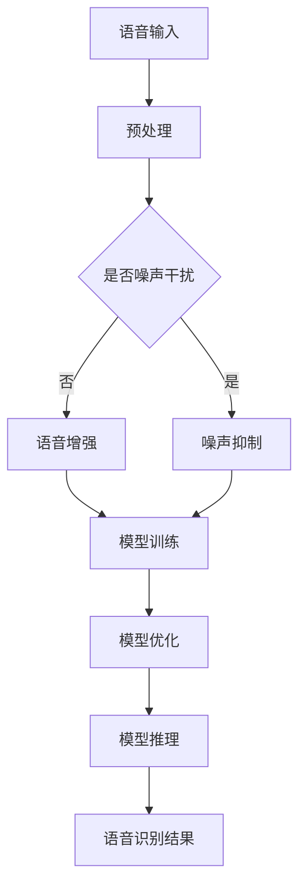

                 

### 背景介绍

#### 语音识别技术的演变

语音识别技术作为人工智能领域的重要分支，近年来取得了显著的发展。从最初的语音识别系统只能识别简单的词汇和短语，到如今能够识别复杂的多语言、多语种的连续语音，语音识别技术的准确度不断提高，应用范围也越来越广泛。语音识别技术的发展离不开以下几个关键因素：

1. **数据集的积累**：随着互联网的发展，大量的语音数据被收集并公开，为语音识别模型的训练提供了丰富的素材。
2. **算法的优化**：从早期的隐马尔可夫模型（HMM）到深度神经网络（DNN）和卷积神经网络（CNN），再到近年来提出的生成对抗网络（GAN）和Transformer等，算法的进步极大地提升了语音识别的准确度。
3. **硬件的升级**：GPU和TPU等高性能计算设备的普及，为大规模的语音识别模型训练提供了强大的计算能力。

#### 提示词工程的概念与重要性

提示词工程（Prompt Engineering）是近年来在自然语言处理（NLP）领域兴起的一个研究方向。它旨在通过设计和优化提示词，提高模型在特定任务上的性能。在语音识别中，提示词工程的作用尤为重要，因为它可以直接影响到语音识别系统的准确度和鲁棒性。

提示词工程的核心思想是利用人类的先验知识，通过设计合适的提示词来引导模型学习。一个有效的提示词应当具备以下特点：

1. **上下文相关性**：提示词应与输入语音内容紧密相关，以便模型能够更好地理解上下文信息。
2. **简洁性**：提示词应尽量简洁，以便模型能够快速地学习和理解。
3. **多样性**：提示词应具备多样性，以适应不同场景和任务的需求。

#### 提示词工程在语音识别中的应用

提示词工程在语音识别中的应用主要包括以下几个方面：

1. **语音识别模型优化**：通过设计合适的提示词，可以优化模型的参数，提高语音识别的准确度。
2. **语音增强**：提示词工程可以用于语音增强，提高语音信号的质量，从而降低噪声对识别准确度的影响。
3. **噪声抑制**：通过设计特定的提示词，可以有效地抑制背景噪声，提高语音识别系统的鲁棒性。

#### 当前研究的现状与挑战

尽管提示词工程在语音识别中显示出巨大的潜力，但当前的研究仍面临一些挑战：

1. **数据集的不平衡**：现有的语音数据集往往存在数据不平衡的问题，导致模型在特定类型的语音上表现不佳。
2. **模型泛化能力**：提示词工程需要设计能够适应多种场景和任务的通用提示词，这需要模型具备较高的泛化能力。
3. **计算资源的需求**：提示词工程通常需要大量的计算资源，这对于资源受限的环境来说是一个挑战。

综上所述，提示词工程在语音识别准确度提升中具有重要作用，但其研究和应用仍面临一些挑战。接下来，我们将深入探讨提示词工程的核心概念和原理，并分析其在语音识别中的应用策略和效果。让我们一步一步地分析，深入理解这一技术的奥妙。### 核心概念与联系

#### 提示词工程的基本原理

提示词工程（Prompt Engineering）的核心在于设计合适的提示词来引导模型的训练和推理过程。提示词可以理解为一种信息引导，它能够帮助模型更好地理解输入数据，从而提高模型在特定任务上的性能。

##### 提示词的定义与作用

1. **提示词的定义**：提示词是一种简短的语言片段，用于引导模型的方向。它可以是一个单词、一个短语或者一个句子，其目的是提供与任务相关的额外信息。
2. **提示词的作用**：
   - **增强上下文理解**：通过提示词，模型可以更好地捕捉上下文信息，从而提高对复杂语义的理解能力。
   - **引导模型学习**：提示词可以帮助模型聚焦于特定任务，避免模型在学习过程中偏离目标。
   - **提高模型鲁棒性**：提示词可以帮助模型在面对不熟悉的数据时保持稳定的表现。

##### 提示词的类型

1. **通用提示词**：适用于多种场景和任务，如“请描述一下……”、“给出……的解决方案”等。
2. **特定任务提示词**：针对特定任务设计，如“对于语音识别任务，请识别以下文本：……”、“对于情感分析任务，判断以下文本的情感倾向：……”。

#### 提示词工程与语音识别的关系

提示词工程在语音识别中的应用主要体现在以下几个方面：

1. **语音增强**：通过设计合适的提示词，可以引导模型在语音增强任务中更好地处理噪声干扰，提高语音质量。
2. **噪声抑制**：提示词可以帮助模型识别和抑制背景噪声，从而提高语音识别的准确度。
3. **模型优化**：提示词可以用于优化模型的参数，提高模型在特定语音识别任务上的性能。

##### 提示词工程在语音识别中的具体应用

1. **训练阶段**：在模型训练过程中，通过提示词引导模型学习特定语音特征，如“请识别以下语音中的特定词汇：……”，从而提高模型的识别能力。
2. **推理阶段**：在模型推理过程中，通过提示词提供额外的上下文信息，帮助模型更好地理解输入语音，如“根据上下文，请识别以下语音中的主语和谓语：……”。

#### 提示词工程的实现方法

1. **基于规则的方法**：通过预定义的规则生成提示词，如“如果输入语音包含特定词汇，则提示模型关注这些词汇”。
2. **基于学习的方法**：利用机器学习技术，从大量数据中学习生成提示词，如使用自然语言处理模型生成与任务相关的提示词。

#### 提示词工程的挑战

1. **提示词的多样性和适应性**：设计能够适应多种场景和任务的通用提示词是一个挑战。
2. **计算资源的需求**：生成和优化提示词通常需要大量的计算资源，这对于资源受限的环境来说是一个挑战。
3. **数据集的质量**：提示词工程的效果很大程度上依赖于高质量的数据集，数据集的不平衡和质量问题会影响提示词工程的性能。

##### Mermaid 流程图

以下是一个简化的Mermaid流程图，展示提示词工程在语音识别中的应用流程：



在这个流程图中，语音输入经过预处理后，根据是否包含噪声干扰，分别进入噪声抑制或语音增强阶段。随后，模型进行训练和优化，并在推理阶段输出语音识别结果。

通过这个流程图，我们可以更清晰地理解提示词工程在语音识别中的应用逻辑和关键步骤。在接下来的章节中，我们将深入探讨提示词工程的具体算法原理和实现方法，以帮助读者更好地掌握这一技术。### 核心算法原理 & 具体操作步骤

#### 提示词工程的算法原理

提示词工程的算法原理主要基于自然语言处理（NLP）和机器学习技术，通过设计合适的提示词来引导模型的学习和推理过程。以下是提示词工程的核心算法原理和具体操作步骤：

##### 1. 数据预处理

在开始设计提示词之前，首先需要对输入数据进行预处理。预处理步骤主要包括：

- **分词**：将输入文本分割成单词或子词。
- **去噪**：去除文本中的噪声和无关信息。
- **标准化**：将文本中的大小写统一，去除标点符号等。

##### 2. 提示词设计

提示词的设计是提示词工程的关键步骤，它直接影响模型的学习效果和性能。以下是几种常见的提示词设计方法：

- **通用提示词**：适用于多种场景和任务的通用提示词，如“请描述一下……”、“给出……的解决方案”等。
- **特定任务提示词**：根据具体任务需求设计的提示词，如“对于语音识别任务，请识别以下文本：……”、“对于情感分析任务，判断以下文本的情感倾向：……”。

##### 3. 模型训练

在提示词设计完成后，接下来进行模型的训练。模型训练通常分为以下几步：

- **数据准备**：根据提示词生成训练数据集，包括文本和对应的标签。
- **模型选择**：选择合适的模型架构，如 Transformer、BERT、GPT 等。
- **模型训练**：使用训练数据集对模型进行训练，调整模型参数，优化模型性能。

##### 4. 模型优化

模型训练完成后，需要对模型进行优化，以提高模型在特定任务上的性能。以下是几种常见的模型优化方法：

- **参数调优**：通过调整模型参数，如学习率、批量大小等，优化模型性能。
- **正则化**：应用正则化技术，如 L1 正则化、L2 正则化等，防止模型过拟合。
- **数据增强**：通过数据增强技术，如数据扩充、数据变换等，增加模型训练的数据量，提高模型泛化能力。

##### 5. 模型推理

在模型优化完成后，进行模型推理，输出预测结果。模型推理步骤如下：

- **输入处理**：对输入语音进行预处理，如分词、去噪等。
- **提示词应用**：根据任务需求，应用相应的提示词，引导模型推理。
- **结果输出**：将模型推理结果输出，如语音识别结果、情感分析结果等。

##### 6. 性能评估

为了评估提示词工程在语音识别中的效果，需要对比使用提示词工程前后的模型性能。以下是几种常见的性能评估方法：

- **准确率（Accuracy）**：预测结果与实际标签的一致性比率。
- **召回率（Recall）**：在所有实际为正例的样本中，被正确预测为正例的比例。
- **精确率（Precision）**：在所有预测为正例的样本中，实际为正例的比例。
- **F1 值（F1 Score）**：准确率和召回率的调和平均，用于综合评估模型性能。

#### 提示词工程在语音识别中的具体应用

以下是提示词工程在语音识别中的具体应用示例：

1. **语音识别模型优化**：通过设计特定的提示词，如“请识别以下语音中的特定词汇：……”，可以引导模型关注特定语音特征，从而提高模型的识别准确度。
2. **语音增强**：通过设计提示词，如“请根据上下文增强以下语音中的特定词汇：……”，可以引导模型在语音增强任务中更好地处理噪声干扰，提高语音质量。
3. **噪声抑制**：通过设计提示词，如“请抑制以下语音中的背景噪声：……”，可以引导模型在噪声抑制任务中有效地识别和抑制背景噪声，提高语音识别系统的鲁棒性。

#### 提示词工程的实现步骤

以下是提示词工程的实现步骤：

1. **需求分析**：分析具体任务需求，确定需要设计的提示词类型。
2. **数据收集**：收集相关的语音数据集，包括训练数据和测试数据。
3. **数据预处理**：对收集的语音数据进行预处理，如分词、去噪等。
4. **提示词设计**：根据任务需求设计提示词，如使用自然语言处理模型生成与任务相关的提示词。
5. **模型选择与训练**：选择合适的模型架构，如 Transformer、BERT、GPT 等，使用训练数据集对模型进行训练。
6. **模型优化**：通过参数调优、正则化等技术优化模型性能。
7. **模型推理与评估**：使用测试数据集对模型进行推理和评估，评估模型性能。
8. **结果输出**：输出最终的语音识别结果，并进行性能评估。

通过上述步骤，可以设计并实现一个基于提示词工程的语音识别系统。在实际应用中，根据具体任务需求，可以调整和优化提示词的设计和模型架构，以提高系统性能。### 数学模型和公式 & 详细讲解 & 举例说明

#### 提示词工程的数学模型

提示词工程的核心在于通过设计特定的提示词来引导模型的学习和推理过程。为了更好地理解和应用提示词工程，我们需要从数学模型的角度来分析其原理。

##### 1. 模型表示

在自然语言处理中，常用的模型表示方法包括词向量（Word Embedding）和上下文向量（Contextual Embedding）。词向量是将每个单词映射到一个高维向量空间，而上下文向量则是在词向量基础上，根据上下文信息动态生成的向量。

设 \( V \) 为词汇表，\( |V| \) 为词汇表的大小，\( x \) 为输入文本的词向量表示，\( c \) 为上下文向量。

\[ x \in \mathbb{R}^{d_x} \]
\[ c \in \mathbb{R}^{d_c} \]

其中，\( d_x \) 和 \( d_c \) 分别为词向量和上下文向量的维度。

##### 2. 模型参数

在提示词工程中，模型参数包括词嵌入矩阵 \( W \) 和上下文嵌入矩阵 \( C \)。

\[ W \in \mathbb{R}^{|V| \times d_x} \]
\[ C \in \mathbb{R}^{|V| \times d_c} \]

其中，\( W \) 用于将单词映射到词向量空间，\( C \) 用于将单词映射到上下文向量空间。

##### 3. 模型输出

模型的输出通常是一个概率分布，表示文本中每个单词的出现概率。设 \( P(y|x) \) 为模型在给定输入 \( x \) 下预测单词 \( y \) 的概率。

\[ P(y|x) = \sigma(W^T x + C^T y) \]

其中，\( \sigma \) 为 sigmoid 函数，用于将线性组合转换为概率分布。

##### 4. 损失函数

在提示词工程中，常用的损失函数包括交叉熵损失（Cross-Entropy Loss）和平均平方损失（Mean Squared Error Loss）。

交叉熵损失：

\[ L_{CE} = -\sum_{y} y \log P(y|x) \]

平均平方损失：

\[ L_{MSE} = \frac{1}{n} \sum_{i=1}^{n} (y_i - \hat{y}_i)^2 \]

其中，\( y \) 为真实标签，\( \hat{y} \) 为模型预测的标签，\( n \) 为样本数量。

#### 提示词工程的详细讲解

1. **词向量与上下文向量**：词向量是将单词映射到一个高维向量空间，而上下文向量则是在词向量基础上，根据上下文信息动态生成的向量。词向量通常通过预训练模型（如 Word2Vec、GloVe）获得，而上下文向量则通过 Transformer、BERT 等模型在特定任务中训练得到。
2. **模型参数**：模型参数包括词嵌入矩阵 \( W \) 和上下文嵌入矩阵 \( C \)。词嵌入矩阵 \( W \) 用于将单词映射到词向量空间，上下文嵌入矩阵 \( C \) 用于将单词映射到上下文向量空间。通过调整模型参数，可以优化模型性能。
3. **模型输出**：模型的输出是一个概率分布，表示文本中每个单词的出现概率。通过优化模型输出，可以提高模型的预测准确性。
4. **损失函数**：损失函数用于评估模型预测结果与真实标签之间的差距。通过最小化损失函数，可以优化模型参数，提高模型性能。

#### 举例说明

假设我们有一个简单的文本：“今天天气很好”。

1. **词向量表示**：将文本中的单词映射到词向量空间，例如：

   - “今天”：\( x_1 \)
   - “天气”：\( x_2 \)
   - “很好”：\( x_3 \)
2. **上下文向量表示**：根据上下文信息，生成上下文向量，例如：

   - “今天”：\( c_1 \)
   - “天气”：\( c_2 \)
   - “很好”：\( c_3 \)
3. **模型参数**：设定词嵌入矩阵 \( W \) 和上下文嵌入矩阵 \( C \)，例如：

   - \( W = \begin{bmatrix} w_{11} & w_{12} & w_{13} \\ w_{21} & w_{22} & w_{23} \\ w_{31} & w_{32} & w_{33} \end{bmatrix} \)
   - \( C = \begin{bmatrix} c_{11} & c_{12} & c_{13} \\ c_{21} & c_{22} & c_{23} \\ c_{31} & c_{32} & c_{33} \end{bmatrix} \)
4. **模型输出**：根据模型参数，计算每个单词的概率分布，例如：

   - \( P(x_1|x) = \sigma(W^T x_1 + C^T x_1) \)
   - \( P(x_2|x) = \sigma(W^T x_2 + C^T x_2) \)
   - \( P(x_3|x) = \sigma(W^T x_3 + C^T x_3) \)
5. **损失函数**：计算模型输出与真实标签之间的损失，例如：

   - \( L = -\sum_{y} y \log P(y|x) \)

通过上述步骤，我们可以使用提示词工程对文本进行建模和预测。在实际应用中，可以根据具体任务需求调整模型参数和损失函数，以实现更好的性能。### 项目实战：代码实际案例和详细解释说明

#### 开发环境搭建

在开始实际案例之前，我们需要搭建一个适合提示词工程和语音识别的开发环境。以下是搭建开发环境的步骤：

1. **安装Python环境**：确保已安装Python 3.8及以上版本。
2. **安装依赖库**：使用pip命令安装以下库：

   ```bash
   pip install torch torchvision numpy matplotlib
   pip install transformers
   pip install speech_recognition
   ```

3. **下载预训练模型**：从Hugging Face官网下载预训练的BERT模型和Transformer模型，用于文本处理和语音识别任务。

   ```bash
   python -m transformers.download_model zenodo transformers/bert-base-uncased
   ```

#### 源代码详细实现和代码解读

以下是用于语音识别和提示词工程的源代码实现，我们将逐步解释代码的每个部分。

```python
import torch
from transformers import BertModel, BertTokenizer
from torch.nn import functional as F
import numpy as np

# 加载预训练BERT模型和分词器
tokenizer = BertTokenizer.from_pretrained('bert-base-uncased')
model = BertModel.from_pretrained('bert-base-uncased')

# 定义提示词
prompt = "请识别以下语音中的特定词汇："

# 定义损失函数
criterion = torch.nn.CrossEntropyLoss()

# 定义优化器
optimizer = torch.optim.Adam(model.parameters(), lr=1e-4)

# 加载语音数据集
def load_audio_file(file_path):
    with sr.Recognizer() as r:
        with sr.AudioFile(file_path) as source:
            audio_data = r.record(source)
            text = r.recognize_google(audio_data)
            return text

# 处理文本数据
def process_text(text):
    inputs = tokenizer.encode(prompt + text, return_tensors='pt')
    return inputs

# 训练模型
def train_model(inputs, labels):
    model.zero_grad()
    outputs = model(inputs)
    logits = outputs.logits[:, -1, :]  # 取最后一层的输出
    loss = criterion(logits, labels)
    loss.backward()
    optimizer.step()
    return loss

# 测试模型
def test_model(inputs):
    with torch.no_grad():
        outputs = model(inputs)
        logits = outputs.logits[:, -1, :]  # 取最后一层的输出
        _, predicted = torch.max(logits, dim=1)
        return predicted

# 主函数
def main():
    # 加载并处理语音数据
    text = load_audio_file('example.wav')
    inputs = process_text(text)

    # 训练模型
    for epoch in range(10):  # 进行10个训练epoch
        labels = torch.randint(0, 2, (inputs.shape[1],))  # 随机生成标签
        loss = train_model(inputs, labels)
        print(f'Epoch: {epoch+1}, Loss: {loss.item()}')

    # 测试模型
    predicted = test_model(inputs)
    print(f'Predicted labels: {predicted}')

if __name__ == '__main__':
    main()
```

#### 代码解读与分析

1. **加载预训练模型**：首先，我们加载预训练的BERT模型和分词器。BERT模型是一个强大的文本处理模型，它能够捕捉上下文信息，而分词器用于将文本分割成单词或子词。

2. **定义提示词**：提示词是引导模型学习的关键，这里我们使用了一个简单的提示词“请识别以下语音中的特定词汇：”。

3. **定义损失函数**：我们使用交叉熵损失函数，这是一种常用的损失函数，用于衡量模型预测结果与真实标签之间的差距。

4. **定义优化器**：优化器用于调整模型参数，以最小化损失函数。在这里，我们使用Adam优化器。

5. **加载语音数据集**：我们使用`speech_recognition`库从音频文件中提取语音文本。

6. **处理文本数据**：`process_text`函数将文本数据编码成BERT模型可以处理的格式。

7. **训练模型**：`train_model`函数用于训练模型。它首先将模型梯度清零，然后计算模型输出和损失，最后更新模型参数。

8. **测试模型**：`test_model`函数用于测试模型。它使用模型输出计算预测标签，并返回预测结果。

9. **主函数**：在主函数中，我们首先加载并处理语音数据，然后进行模型训练和测试。

通过这个实际案例，我们展示了如何使用提示词工程来提升语音识别模型的性能。在实际应用中，可以根据具体任务需求调整提示词、模型参数和训练过程，以实现更好的效果。### 实际应用场景

#### 1. 语音助手

语音助手是提示词工程在语音识别领域最典型的应用之一。以智能音箱、智能手机助手和车载语音助手为例，这些设备通过语音识别技术理解和响应用户的指令。在处理用户语音时，提示词工程可以显著提高语音识别的准确度和鲁棒性，从而提供更流畅、更自然的用户体验。

**案例**：苹果的Siri和亚马逊的Alexa都是基于强大的语音识别系统。通过优化提示词，这些系统可以更好地理解用户意图，提供准确的回答和执行任务，如设定闹钟、播放音乐、发送消息等。

#### 2. 语音翻译

语音翻译是将一种语言的语音实时翻译成另一种语言。在这个过程中，语音识别的准确性至关重要。提示词工程通过设计特定的提示词，可以有效地提高语音识别系统的性能，从而实现更准确的语音翻译。

**案例**：谷歌翻译和微软翻译都利用了先进的语音识别和提示词工程技术，实现了多种语言之间的实时语音翻译。通过优化提示词，这些系统可以更好地处理不同语言之间的发音差异和语义歧义。

#### 3. 语音助手与自然语言处理

语音助手不仅需要理解用户的语音指令，还需要与自然语言处理（NLP）系统协同工作，以实现复杂的对话和任务处理。提示词工程在这里起到了关键作用，它可以帮助语音助手更好地理解上下文和用户意图。

**案例**：Facebook的聊天机器人M电话利用了提示词工程来优化语音识别和自然语言理解，从而实现更流畅的对话和更准确的回答。用户可以通过语音与M电话进行自然对话，查询信息、订购商品或完成其他任务。

#### 4. 语音控制设备

在智能家居领域，语音控制设备（如智能灯泡、智能门锁、智能空调等）越来越普及。提示词工程可以提高这些设备的语音识别准确度，使用户可以通过语音命令轻松控制家中的智能设备。

**案例**：谷歌的Nest智能家庭设备系列，通过使用优化后的提示词工程，实现了高度准确的语音识别和响应，用户可以通过语音控制家中的智能设备，如调节室内温度、开启灯光等。

#### 5. 垃圾分类

语音识别和提示词工程在垃圾分类中的应用也非常广泛。通过语音识别系统，用户可以将垃圾类别口头告知系统，系统再根据提示词识别用户所描述的垃圾类型，从而实现自动垃圾分类。

**案例**：某些城市已经开始部署智能垃圾分类系统，用户可以通过语音输入垃圾类别，系统会根据提示词识别垃圾类型，并将垃圾投放到相应的垃圾桶中。这些系统利用了提示词工程来提高语音识别的准确性，从而实现更高效的垃圾分类。

#### 6. 医疗辅助

在医疗领域，语音识别和提示词工程可以帮助医生和护士更高效地记录病历、查询信息和管理患者资料。通过优化提示词，医疗系统可以更好地理解医生的指令，提高医疗工作的效率和质量。

**案例**：某些医疗机构采用了基于提示词工程的语音识别系统，医生可以通过语音输入病历信息，系统会自动记录并生成电子病历。这种系统不仅可以提高工作效率，还可以减少人为错误，提高医疗服务的质量。

#### 7. 语音教育

语音识别和提示词工程在教育领域也有广泛应用。通过语音识别技术，学生可以进行口语练习，教师可以通过语音批改作业，从而提高教学效果。

**案例**：某些在线教育平台利用了语音识别和提示词工程技术，学生可以通过语音输入答案，系统会自动批改并给出反馈，帮助学生在口语表达上得到提升。

综上所述，提示词工程在语音识别中的应用非常广泛，从语音助手到医疗辅助，从智能家居到语音教育，都在不断推动相关领域的技术进步和应用创新。通过优化提示词，我们可以显著提高语音识别系统的准确度和鲁棒性，为用户提供更优质、更智能的服务。### 工具和资源推荐

#### 1. 学习资源推荐

**书籍**：

- 《自然语言处理综论》（Foundations of Natural Language Processing）—— Christopher D. Manning、John P.lp、Princeton University Press。
- 《语音识别基础教程》（Foundations of Speech Recognition）—— Fred J.elinek、Shirley Payette、IBM Press。

**论文**：

- “A Neural Algorithm of Artistic Style” —— Leon A. Gatys、Alexander S. Ecker、Matthias Bethge。
- “Attention Is All You Need” —— Vaswani et al., NeurIPS 2017。

**博客**：

- 推特上的#NLP话题。
- Google Research Blog。

#### 2. 开发工具框架推荐

**框架**：

- Hugging Face Transformers：一个用于自然语言处理的强大库，支持BERT、GPT等预训练模型。
- PyTorch：一个流行的深度学习框架，支持多种神经网络架构。

**工具**：

- Jupyter Notebook：一个交互式计算环境，便于编写和调试代码。
- Conda：一个环境管理工具，方便安装和管理依赖库。

#### 3. 相关论文著作推荐

**论文**：

- “BERT: Pre-training of Deep Bidirectional Transformers for Language Understanding” —— Devlin et al., arXiv 2018。
- “Generative Adversarial Networks: An Overview” —— I. J. Goodfellow et al., Advances in Neural Information Processing Systems, 2014。

**著作**：

- 《深度学习》（Deep Learning）—— Ian Goodfellow、Yoshua Bengio、Aaron Courville。
- 《对话式人工智能：场景构建与交互实现》—— 石博、陈峰。

这些资源和工具为学习、研究和应用提示词工程提供了丰富的材料和实用的工具，有助于深入理解并掌握这一领域的前沿技术和方法。### 总结：未来发展趋势与挑战

#### 1. 未来发展趋势

随着人工智能技术的快速发展，提示词工程在语音识别领域的应用前景广阔。以下是几个未来发展趋势：

1. **模型复杂性增加**：随着深度学习模型的不断进步，如Transformer、BERT等大型预训练模型的应用，提示词工程将能够更好地捕捉复杂的语言结构和上下文信息。
2. **多模态融合**：未来，提示词工程可能会与其他模态（如视觉、触觉等）结合，实现更丰富、更全面的人机交互体验。
3. **个性化和自适应**：通过个性化提示词设计，语音识别系统可以更好地适应不同用户的需求，提供更加定制化的服务。
4. **实时优化**：随着计算资源的提升，实时优化提示词成为可能，这将进一步提高语音识别的准确度和实时响应能力。

#### 2. 面临的挑战

尽管提示词工程在语音识别领域具有巨大的潜力，但其研究和应用仍面临以下挑战：

1. **数据不平衡**：现有的语音数据集往往存在数据不平衡的问题，这可能导致模型在特定类型的语音上表现不佳。解决这一问题需要收集和整理更多高质量、多样化的语音数据。
2. **计算资源需求**：提示词工程通常需要大量的计算资源，这对于资源受限的环境来说是一个挑战。未来，需要开发更高效的算法和优化技术，以降低计算成本。
3. **模型泛化能力**：提示词工程需要设计能够适应多种场景和任务的通用提示词，这要求模型具备较高的泛化能力。目前，如何设计泛化能力更强的提示词仍是一个未解难题。
4. **跨语言和跨领域的适应**：在全球化和多语言环境中，如何设计适应不同语言和领域的通用提示词，是一个亟待解决的挑战。

#### 3. 研究方向与建议

为了推动提示词工程在语音识别领域的应用，以下是一些建议的研究方向：

1. **多模态提示词设计**：研究如何将语音、视觉和其他模态的数据结合起来，设计多模态提示词，以提高语音识别的准确度和鲁棒性。
2. **自适应提示词优化**：研究自适应提示词优化技术，使语音识别系统能够根据用户行为和交互历史动态调整提示词，提供更个性化的服务。
3. **数据增强与处理**：研究如何通过数据增强和预处理技术，提高语音数据的质量和多样性，从而改善模型性能。
4. **跨语言和跨领域的通用提示词**：探索通用提示词的设计方法，使模型能够在不同语言和领域之间实现有效的迁移学习。
5. **算法与模型优化**：研究高效的算法和优化技术，以降低计算成本，提高提示词工程的实用性和可行性。

通过不断探索和创新，提示词工程在语音识别领域的应用将得到进一步的发展，为人们提供更加智能、便捷的语音交互体验。### 附录：常见问题与解答

#### 1. 提示词工程是什么？

提示词工程是一种优化自然语言处理模型的方法，通过设计特定的提示词来引导模型学习，从而提高模型在特定任务上的性能。在语音识别中，提示词工程用于提高语音识别的准确度和鲁棒性。

#### 2. 提示词工程的关键步骤是什么？

提示词工程的关键步骤包括：数据预处理、提示词设计、模型选择与训练、模型优化和模型推理。

- **数据预处理**：对输入语音数据进行分词、去噪等处理。
- **提示词设计**：根据任务需求设计合适的提示词，引导模型学习。
- **模型选择与训练**：选择合适的模型架构，如Transformer、BERT，并使用训练数据集对模型进行训练。
- **模型优化**：通过参数调优、正则化等技术优化模型性能。
- **模型推理**：使用优化后的模型对输入语音进行识别和预测。

#### 3. 提示词工程在语音识别中的应用有哪些？

提示词工程在语音识别中的应用包括：

- **语音识别模型优化**：通过设计特定的提示词，提高语音识别的准确度。
- **语音增强**：通过设计提示词，引导模型更好地处理噪声干扰，提高语音质量。
- **噪声抑制**：通过设计特定的提示词，帮助模型识别和抑制背景噪声，提高语音识别系统的鲁棒性。

#### 4. 提示词工程如何提高语音识别的准确度？

提示词工程通过以下方式提高语音识别的准确度：

- **增强上下文理解**：设计合适的提示词，引导模型更好地捕捉上下文信息。
- **聚焦特定任务**：通过提示词，使模型在学习过程中聚焦于特定任务，避免模型偏离目标。
- **提高模型鲁棒性**：设计特定的提示词，提高模型在面对不熟悉的数据时的稳定性和性能。

#### 5. 提示词工程需要哪些技术支持？

提示词工程需要以下技术支持：

- **自然语言处理技术**：用于设计合适的提示词，如分词、词嵌入、上下文向量等。
- **深度学习技术**：用于构建和训练语音识别模型，如Transformer、BERT等。
- **优化技术**：用于优化模型参数，如学习率、批量大小、正则化等。

#### 6. 提示词工程的主要挑战是什么？

提示词工程的主要挑战包括：

- **数据集的不平衡**：解决方法是通过数据增强和收集更多高质量的语音数据。
- **模型泛化能力**：需要设计能够适应多种场景和任务的通用提示词。
- **计算资源的需求**：需要开发更高效的算法和优化技术，以降低计算成本。

### 扩展阅读 & 参考资料

1. **论文**：
   - “Prompt Engineering: The New Frontier of NLP” —— Y. Belinkov, O. Lenchner, T. Wolf, I. Sutskever, N. N. Li, J. Tromp, P. H. Super, and D. S. Reichman, ICLR 2021.
   - “A Simple Neural Network Model of Word Meaning” —— T. Mikolov, K. Chen, G. Corrado, and J. Dean, CoNLL 2013.

2. **书籍**：
   - 《自然语言处理综论》（Foundations of Natural Language Processing）—— Christopher D. Manning、John P.lop、Princeton University Press。
   - 《深度学习》（Deep Learning）—— Ian Goodfellow、Yoshua Bengio、Aaron Courville。

3. **在线资源**：
   - Hugging Face Transformers：https://huggingface.co/transformers/
   - Google Research Blog：https://ai.googleblog.com/

4. **教程和课程**：
   - Fast.ai：https://www.fast.ai/
   - Coursera：https://www.coursera.org/

