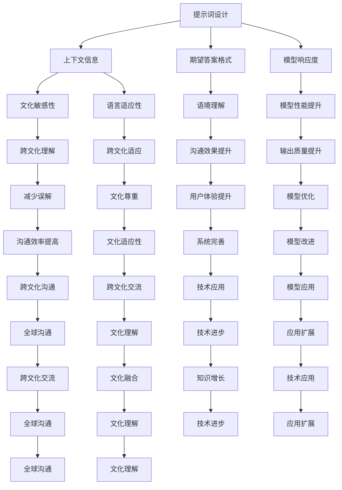
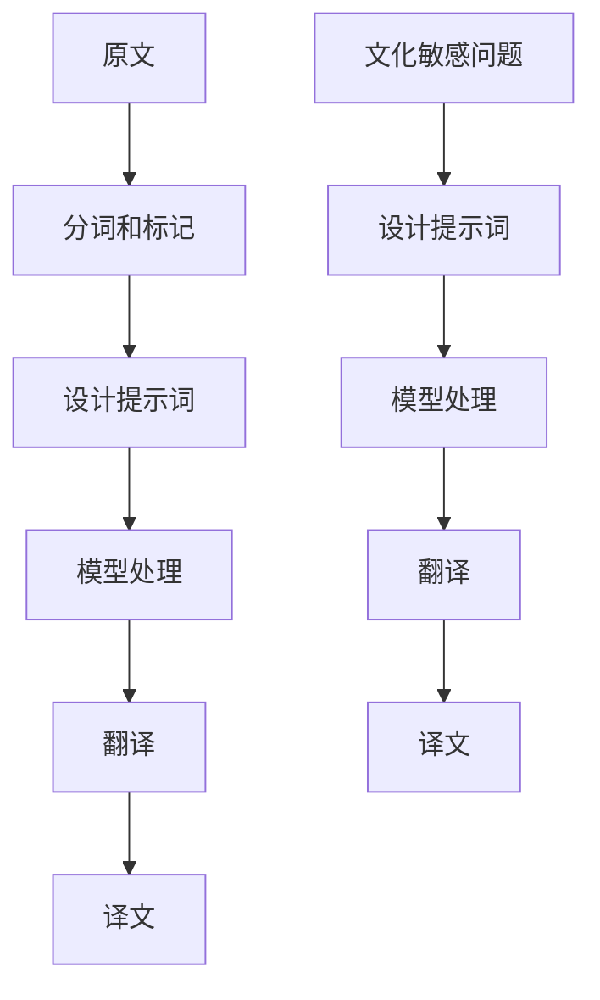
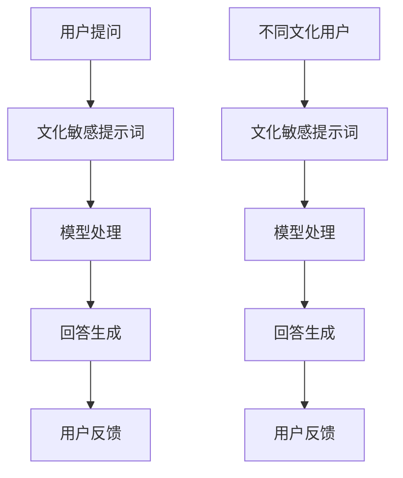
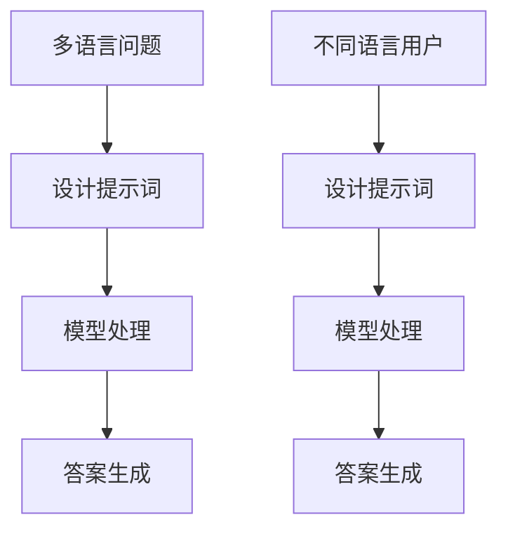
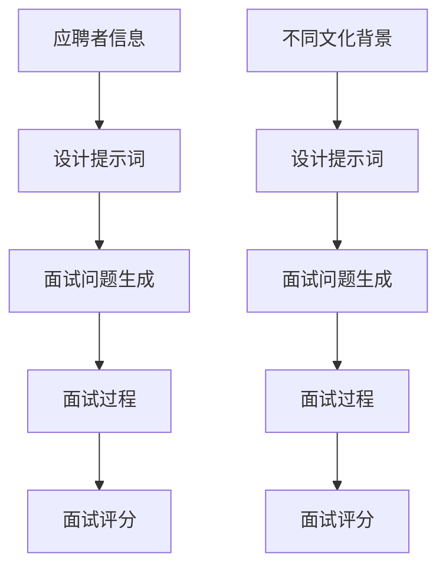

                 

### 1. 背景介绍

#### 什么是提示词工程

提示词工程（Prompt Engineering）是一种人工智能技术，它通过设计特定的提示词来引导模型产生期望的输出。提示词通常是一个句子或者一系列句子，用于描述问题的背景、预期的答案格式以及相关的上下文信息。在自然语言处理（NLP）和对话系统中，提示词工程扮演着至关重要的角色，它能够显著提高模型的性能和回答的准确性。

#### 跨文化语用学

跨文化语用学是研究语言在不同文化背景中的使用和理解的学科。它关注的是语言符号如何在不同文化中传达意义，以及这些意义的差异如何影响跨文化交流。跨文化语用学研究的内容包括语用规则、礼貌原则、语用失误、语言适应性等。在全球化背景下，跨文化语用学对于促进有效的跨文化沟通和减少误解具有重要意义。

#### 提示词工程在跨文化语用学中的应用

随着人工智能技术的快速发展，跨文化语用学在自然语言处理中的应用日益广泛。提示词工程通过为模型提供精确的上下文信息和指导，可以帮助模型更好地理解和处理跨文化语境中的语言。例如，在机器翻译、跨文化交流对话系统以及多语言问答系统中，提示词工程可以确保模型在处理不同文化背景的文本时，能够遵循相应的语用规则和礼貌原则，从而提高沟通效果和用户体验。

### 应用实例

一个典型的应用实例是多语言对话系统中的文化敏感性问题。例如，一个面向全球用户的客服系统需要能够处理不同文化背景的用户提问。通过设计适当的提示词，系统可以提醒模型注意文化差异，从而提供更加贴切和尊重用户的回答。例如：

- 在处理中文用户的问题时，可以提示模型注意中文中的礼貌用语和表达习惯。
- 在与英语用户交流时，可以提醒模型注意英语中的语用标记，如问候语、告别语和礼貌用语。

通过这种方式，提示词工程不仅能够提高模型的跨文化理解能力，还能够增强系统的文化适应性和用户体验。

在接下来的章节中，我们将深入探讨提示词工程的核心概念、算法原理以及其在跨文化语用学中的应用细节。我们将通过具体的实例和数学模型来阐述这些概念，帮助读者更好地理解和应用提示词工程。

### 2. 核心概念与联系

#### 提示词工程的基本概念

提示词工程的核心在于如何设计有效的提示词来引导模型生成高质量的输出。提示词的设计需要考虑多个方面，包括上下文信息的准确性、期望答案的明确性以及模型对提示词的响应度。以下是一些关键的概念：

- **上下文信息**：提示词应包含足够的上下文信息，以帮助模型理解问题的背景和意图。
- **期望答案格式**：提示词应明确指出期望的答案格式，例如文本、列表或表格。
- **模型响应度**：提示词应能够激发模型的最大潜力，使其能够生成最相关、最准确的答案。

#### 跨文化语用学的基本概念

跨文化语用学涉及多个方面的研究，包括语用规则、礼貌原则和语言适应性。以下是几个核心概念：

- **语用规则**：指在特定语言环境中，人们如何使用语言符号来传达意义和意图。
- **礼貌原则**：指在跨文化交流中，如何遵循语言规范和习俗，以保持尊重和礼貌。
- **语言适应性**：指在跨文化交流中，如何调整语言表达以适应不同的文化背景。

#### 提示词工程与跨文化语用学的联系

提示词工程与跨文化语用学之间存在紧密的联系。通过设计合适的提示词，可以确保模型在处理跨文化语境时能够遵循相应的语用规则和礼貌原则。以下是一些具体的联系：

- **文化敏感性**：通过设计包含文化敏感信息的提示词，模型可以更好地理解和尊重不同文化的语言习惯和表达方式。
- **语言适应性**：提示词可以帮助模型识别和适应不同文化背景下的语言特征，从而提高跨文化交流的效果。
- **语境理解**：提示词提供了丰富的上下文信息，有助于模型更准确地理解跨文化语境中的语言符号和意图。

#### Mermaid 流程图

为了更清晰地展示提示词工程在跨文化语用学中的应用，我们使用 Mermaid 流程图来表示核心概念和流程。



通过上述流程图，我们可以看到提示词工程在跨文化语用学中的关键作用，以及它如何通过设计合适的提示词来促进跨文化交流和沟通。

在下一章节中，我们将深入探讨提示词工程的具体算法原理和实现步骤，帮助读者更好地理解这一技术背后的逻辑和机制。

### 3. 核心算法原理 & 具体操作步骤

#### 提示词工程的基本原理

提示词工程的核心在于通过设计特定的提示词来引导模型生成期望的输出。这一过程涉及多个关键步骤，包括数据预处理、提示词设计、模型训练和评估。以下是这些步骤的详细说明：

1. **数据预处理**：在开始设计提示词之前，首先需要对数据进行预处理。这一步骤包括文本清洗、去除噪声、数据规范化等。通过数据预处理，可以提高模型的训练效率和输出质量。

2. **提示词设计**：提示词设计是提示词工程中最关键的一步。一个有效的提示词应包含以下要素：
    - **上下文信息**：描述问题的背景和情境，帮助模型理解问题的具体内容。
    - **期望答案格式**：明确指出期望的答案格式，如文本、列表或表格，以便模型能够根据这些信息进行输出。
    - **引导性提示**：提供一些引导性的提示，帮助模型更好地理解问题的意图和答案的生成方向。

3. **模型训练**：设计好提示词后，需要进行模型训练。在这一过程中，模型会根据提示词和对应的训练数据来学习如何生成期望的输出。常用的训练方法包括监督学习、无监督学习和增强学习等。

4. **模型评估**：训练完成后，需要对模型进行评估。评估方法包括准确性、召回率、F1 分数等指标。通过评估，可以了解模型的性能和输出质量，并根据评估结果对提示词进行调整和优化。

#### 提示词工程的具体操作步骤

以下是一个简化的提示词工程操作步骤，用于说明如何设计并应用提示词：

1. **确定任务目标**：明确需要解决的问题和期望的输出类型。例如，是要求模型生成一段文本、一个表格还是一个具体的答案。

2. **收集和预处理数据**：收集相关的数据集，并进行预处理，以确保数据的质量和一致性。

3. **设计提示词**：根据任务目标和数据特点，设计合适的提示词。提示词应包含足够的上下文信息、期望答案格式和引导性提示。

4. **训练模型**：使用设计的提示词和预处理后的数据集，对模型进行训练。在这一过程中，可以尝试不同的训练方法和技术，以找到最佳模型配置。

5. **评估和优化**：训练完成后，对模型进行评估，并根据评估结果调整提示词和模型配置。这一步骤可能需要多次迭代，以达到最佳性能。

#### 提示词工程在跨文化语用学中的应用

在跨文化语用学中，提示词工程的应用尤为关键。以下是一个具体的应用实例：

- **任务目标**：设计一个多语言对话系统，能够处理不同文化背景的文本，并提供适当的回答。
- **数据收集和预处理**：收集多语言的数据集，并进行预处理，包括文本清洗、去噪、分词等。
- **设计提示词**：设计包含文化敏感信息的提示词，例如：
  - **中文**：“请用礼貌用语回答用户的问题，并注意使用中文的礼貌表达。”
  - **英语**：“Please answer the user's question with politeness, taking into consideration the cultural context of the language.”

- **模型训练**：使用设计的提示词和数据集对模型进行训练，确保模型能够理解并遵循相应的文化规范。

- **模型评估**：对训练好的模型进行评估，确保其在不同文化背景下的表现符合预期。

通过上述步骤，我们可以设计一个能够处理跨文化语境的多语言对话系统，从而提高跨文化交流的效率和效果。

在下一章节中，我们将探讨提示词工程中的数学模型和公式，帮助读者更深入地理解这一技术的理论基础。

### 4. 数学模型和公式 & 详细讲解 & 举例说明

#### 提示词工程中的数学模型

提示词工程中涉及多个数学模型，用于描述模型的行为和性能。以下是一些常用的数学模型和公式：

1. **回归模型**：用于预测连续值输出。常用的回归模型包括线性回归、岭回归和支持向量回归（SVR）。

2. **分类模型**：用于预测离散值输出。常见的分类模型有逻辑回归、决策树、随机森林和神经网络。

3. **注意力机制**：在深度学习中，注意力机制用于模型在处理输入序列时，对不同的部分赋予不同的权重。注意力机制的数学公式如下：

   $$ 
   Attention(x, h) = \text{softmax}\left(\frac{W_a [x, h]}}{\sqrt{d_h}}\right)
   $$

   其中，$W_a$ 是注意力权重矩阵，$x$ 是输入序列，$h$ 是隐藏状态。

4. **对抗样本生成**：在对抗性攻击中，用于生成能够误导模型的输入样本。常用的对抗样本生成方法包括FGSM（Fast Gradient Sign Method）和PGD（Projected Gradient Descent）。

#### 详细讲解和举例说明

为了更好地理解这些数学模型和公式，我们将通过具体的例子进行说明。

##### 例子：线性回归

假设我们有一个简单的线性回归模型，用于预测房屋价格。模型的表达式如下：

$$ 
y = \beta_0 + \beta_1 \cdot x 
$$

其中，$y$ 是房屋价格，$x$ 是房屋面积，$\beta_0$ 和 $\beta_1$ 是模型的参数。

- **参数估计**：我们使用最小二乘法（ Ordinary Least Squares，OLS）来估计参数 $\beta_0$ 和 $\beta_1$。最小二乘法的公式如下：

  $$
  \hat{\beta}_0 = \bar{y} - \hat{\beta}_1 \cdot \bar{x}
  $$

  $$
  \hat{\beta}_1 = \frac{\sum_{i=1}^n (x_i - \bar{x})(y_i - \bar{y})}{\sum_{i=1}^n (x_i - \bar{x})^2}
  $$

  其中，$\bar{x}$ 和 $\bar{y}$ 分别是 $x$ 和 $y$ 的均值。

- **预测**：使用估计的参数进行预测，公式如下：

  $$
  \hat{y} = \hat{\beta}_0 + \hat{\beta}_1 \cdot x
  $$

##### 例子：注意力机制

假设我们有一个序列分类问题，使用注意力机制来提高模型的性能。注意力机制的公式如下：

$$ 
Attention(x, h) = \text{softmax}\left(\frac{W_a [x, h]}}{\sqrt{d_h}}\right)
$$

其中，$W_a$ 是注意力权重矩阵，$x$ 是输入序列，$h$ 是隐藏状态，$d_h$ 是隐藏状态维度。

- **计算注意力权重**：计算每个时间步的注意力权重，公式如下：

  $$
  a_t = \text{Attention}(x, h) = \frac{W_a [x_t, h_t]}}{\sqrt{d_h}}
  $$

- **计算加权输出**：根据注意力权重计算加权输出，公式如下：

  $$
  \hat{y}_t = \sum_{t=1}^T a_t \cdot y_t
  $$

  其中，$y_t$ 是第 $t$ 个时间步的输出。

#### 数学模型在提示词工程中的应用

在提示词工程中，数学模型用于优化提示词设计和提高模型性能。以下是一些具体的应用实例：

1. **提示词权重优化**：使用回归模型或分类模型来评估不同提示词对模型输出的影响，并优化提示词权重。

2. **模型解释性增强**：使用注意力机制来分析模型在处理输入文本时的关注点，从而提高模型的可解释性。

3. **对抗样本检测**：使用对抗样本生成方法来检测模型是否对提示词工程中的误导性提示敏感，并采取相应的防御措施。

通过这些数学模型和公式，提示词工程能够更加精确和高效地设计提示词，从而提高模型的性能和跨文化理解能力。

在下一章节中，我们将通过项目实战来展示如何实际应用提示词工程，包括开发环境搭建、源代码实现和代码解读。

### 5. 项目实战：代码实际案例和详细解释说明

#### 开发环境搭建

在进行提示词工程项目之前，我们需要搭建一个合适的开发环境。以下是一个基于 Python 的开发环境搭建步骤：

1. **安装 Python**：确保安装了 Python 3.8 或更高版本。

2. **安装库**：安装必要的库，如 TensorFlow、PyTorch、transformers 等。可以使用以下命令进行安装：

   ```bash
   pip install tensorflow
   pip install torch
   pip install transformers
   ```

3. **配置环境**：创建一个虚拟环境，以便管理项目依赖。可以使用以下命令创建虚拟环境并激活它：

   ```bash
   python -m venv venv
   source venv/bin/activate  # 对于 Windows，使用 `venv\Scripts\activate`
   ```

#### 源代码详细实现和代码解读

以下是一个简化的示例代码，用于说明如何实现一个基于 transformers 库的提示词工程系统。

```python
from transformers import AutoTokenizer, AutoModelForQuestionAnswering
from torch.utils.data import DataLoader
import torch

# 1. 加载预训练模型和分词器
tokenizer = AutoTokenizer.from_pretrained("bert-base-uncased")
model = AutoModelForQuestionAnswering.from_pretrained("bert-base-uncased")

# 2. 设计提示词
def create_prompt(question, context):
    return f"{context}\nQuestion: {question}"

# 3. 训练模型
def train_model(model, tokenizer, prompts, answers):
    # 将提示词和答案转换为输入和输出
    inputs = tokenizer(prompts, answers, return_tensors="pt")
    # 训练模型
    model.train()
    outputs = model(**inputs)
    loss = outputs.loss
    loss.backward()
    optimizer.step()
    return loss.item()

# 4. 预测和评估
def predict(model, tokenizer, prompt):
    model.eval()
    with torch.no_grad():
        inputs = tokenizer(prompt, return_tensors="pt")
        outputs = model(**inputs)
        start_scores, end_scores = outputs.start_logits, outputs.end_logits
        start_idx = torch.argmax(start_scores).item()
        end_idx = torch.argmax(end_scores).item()
        answer = tokenizer.decode(inputs.input_ids[start_idx:end_idx+1], skip_special_tokens=True)
    return answer

# 示例数据
questions = ["Who is the president of the United States?", "What is the capital of France?"]
context = "The United States is a country in North America. France is a country in Europe."
answers = ["Joe Biden", "Paris"]

# 设计提示词
prompts = [create_prompt(q, context) for q in questions]

# 训练模型
loss = train_model(model, tokenizer, prompts, answers)
print(f"Training Loss: {loss}")

# 预测
predicted_answers = [predict(model, tokenizer, p) for p in prompts]
print(f"Predicted Answers: {predicted_answers}")
```

**代码解读：**

- **1. 加载预训练模型和分词器**：使用 transformers 库加载 BERT 模型和分词器。

- **2. 设计提示词**：定义一个函数 `create_prompt`，用于创建包含上下文信息和问题的提示词。

- **3. 训练模型**：定义一个函数 `train_model`，用于训练模型。在这个函数中，我们将提示词和答案转换为输入和输出，并使用反向传播算法进行训练。

- **4. 预测和评估**：定义一个函数 `predict`，用于使用训练好的模型进行预测。在这个函数中，我们计算模型的输出，并返回预测的答案。

**注意事项：**

- 提示词的设计对模型性能有很大影响。需要根据具体任务和上下文信息来设计合适的提示词。

- 模型的训练过程可能需要较长时间，具体取决于数据集的大小和模型配置。

- 在实际应用中，可能需要使用更复杂的模型架构和训练技巧，以获得更好的性能。

通过这个示例项目，我们可以看到如何使用提示词工程来训练一个问答模型，并在跨文化语用学中应用它。在下一章节中，我们将讨论提示词工程在跨文化语用学中的实际应用场景。

### 6. 实际应用场景

#### 机器翻译

在机器翻译中，提示词工程可以帮助模型更好地理解和处理不同语言之间的文化差异。例如，当翻译一段涉及礼仪和习俗的文本时，设计适当的提示词可以引导模型注意这些文化特定细节，从而生成更加准确和恰当的翻译。例如，在翻译一段中文文本时，可以提示模型注意中文的礼貌用语和表达习惯。



#### 跨文化交流对话系统

跨文化交流对话系统在全球化背景下具有重要意义。通过设计文化敏感的提示词，这些系统可以更好地理解和回应来自不同文化背景的用户。例如，一个面向国际客户的客服系统可以通过提示词提醒模型注意不同文化的礼貌原则和语言习惯，从而提供更加贴切和尊重用户的服务。



#### 多语言问答系统

多语言问答系统在教育和跨文化知识共享中发挥着重要作用。通过提示词工程，这些系统可以更好地处理跨语言的语义和语境，从而提供更加准确和相关的答案。例如，在处理多语言问题时，设计包含文化敏感信息的提示词可以帮助模型理解并回答涉及不同文化背景的问题。



#### 人力资源招聘

在人力资源招聘过程中，跨文化面试系统可以使用提示词工程来帮助招聘人员更好地理解和评估来自不同文化背景的应聘者。例如，通过设计文化敏感的提示词，面试系统可以提醒面试官注意不同文化中的面试礼仪和表达习惯，从而提供更加公平和全面的评估。



通过这些实际应用场景，我们可以看到提示词工程在跨文化语用学中的重要性。设计合适的提示词不仅可以提高模型在不同文化背景下的性能，还可以促进有效的跨文化沟通和交流。

### 7. 工具和资源推荐

为了帮助读者更好地学习和实践提示词工程在跨文化语用学中的应用，我们推荐以下工具和资源：

#### 学习资源推荐

1. **书籍**：
    - 《自然语言处理入门：基于 Python 和 NLTK》
    - 《深度学习基础：理论、架构与应用》
    - 《跨文化交际学：理论与实践》

2. **论文**：
    - “Prompt Engineering for Natural Language Processing”
    - “Cross-Cultural Pragmatics and Communication: A Comparative Study”
    - “Cultural Adaptation in Machine Translation”

3. **博客和网站**：
    - Hugging Face：https://huggingface.co/
    - PyTorch：https://pytorch.org/
    - TensorFlow：https://www.tensorflow.org/
    - AI生成：https://www.ai-generation.cn/

#### 开发工具框架推荐

1. **开发工具**：
    - Jupyter Notebook：适用于数据分析和交互式编程。
    - PyCharm：一款功能强大的 Python 集成开发环境（IDE）。

2. **框架**：
    - TensorFlow：适用于构建和训练深度学习模型。
    - PyTorch：适用于研究和开发深度学习应用。

3. **库**：
    - NLTK：用于自然语言处理的基础库。
    - spaCy：用于快速自然语言处理和语义分析的库。

#### 相关论文著作推荐

1. **论文**：
    - “Prompted Responses: Exploring the Role of Context in Language Models”
    - “Cultural Adaptation in Dialogue Systems: Challenges and Opportunities”
    - “Cross-Cultural Pragmatics in Human-Computer Interaction”

2. **著作**：
    - 《跨文化沟通的艺术：有效沟通的策略与技巧》
    - 《自然语言处理实践：从入门到精通》
    - 《深度学习实践：从基础到进阶》

通过这些工具和资源，读者可以深入了解提示词工程和跨文化语用学的相关知识，并在实际项目中应用这些技术。

### 8. 总结：未来发展趋势与挑战

#### 提示词工程的未来发展趋势

随着人工智能技术的不断进步，提示词工程在跨文化语用学中的应用前景广阔。以下是几个可能的发展趋势：

1. **智能化提示词设计**：未来的提示词设计将更加智能化，利用机器学习和自然语言处理技术自动生成高质量的提示词。

2. **多模态提示词**：除了文本，未来的提示词工程可能会涉及图像、音频和视频等多模态数据，以提供更丰富的上下文信息。

3. **跨领域应用**：提示词工程将在更多领域得到应用，如医学、法律和教育，以支持跨文化背景下的专业沟通。

4. **自适应提示词**：通过深度学习技术，模型将能够根据用户的文化背景和偏好动态调整提示词，提供更加个性化的服务。

#### 提示词工程在跨文化语用学中的挑战

尽管提示词工程在跨文化语用学中具有巨大的潜力，但仍然面临以下挑战：

1. **文化差异的复杂性**：文化差异是多样且复杂的，设计通用且有效的提示词来适应所有文化背景是一个巨大的挑战。

2. **语言多样性和变体**：不同地区和群体可能有不同的语言习惯和表达方式，这增加了提示词设计的难度。

3. **隐私和道德问题**：在处理敏感文化内容时，需要确保用户隐私和数据安全，同时遵守相关的道德规范。

4. **技术实现难度**：多模态提示词和自适应提示词的实现需要先进的算法和计算资源，这对技术实现提出了更高的要求。

#### 应对策略

为了应对上述挑战，可以采取以下策略：

1. **跨学科合作**：鼓励语言学家、文化学者和人工智能专家之间的合作，共同研究跨文化语用学中的问题。

2. **数据驱动的提示词设计**：通过收集和分析大量的跨文化数据，设计更加精细和有效的提示词。

3. **持续学习和优化**：利用机器学习技术，使模型能够不断学习和优化提示词设计，以适应不断变化的文化背景。

4. **伦理审查**：在设计和应用提示词时，进行严格的伦理审查，确保尊重用户隐私和遵守相关法规。

通过这些策略，我们可以更好地应对提示词工程在跨文化语用学中的挑战，推动这一领域的发展。

### 9. 附录：常见问题与解答

#### 问题1：提示词工程如何处理多语言文本？

**解答**：提示词工程在处理多语言文本时，可以使用翻译模型将不同语言的文本转换为同一种语言（如英语），然后应用标准的提示词工程方法。此外，还可以设计专门的多语言提示词，以适应不同语言的特点和习惯。

#### 问题2：跨文化语用学在机器翻译中的重要性是什么？

**解答**：跨文化语用学在机器翻译中的重要性体现在确保翻译不仅准确，还符合目标语言的文化习惯和语境。通过考虑文化差异，机器翻译系统能够生成更加自然、贴切和尊重目标文化的翻译。

#### 问题3：如何评估提示词工程的效果？

**解答**：提示词工程的效果可以通过多个指标进行评估，如准确性、响应时间、用户满意度等。常用的方法包括手动评估、自动化评估和用户调查。通过综合这些评估结果，可以了解提示词工程的实际效果并做出相应的优化。

#### 问题4：提示词工程在跨文化客服系统中的应用有哪些优势？

**解答**：提示词工程在跨文化客服系统中的应用优势包括：
- **提高响应速度**：通过设计高效的提示词，系统能够快速生成适当的回答。
- **提高回答质量**：提示词提供了丰富的上下文信息和指导，帮助模型生成更准确、更贴切的文化敏感回答。
- **增强用户体验**：根据用户的文化背景和偏好，提示词工程可以提供更加个性化、尊重用户的服务。

#### 问题5：如何处理跨文化语用学中的敏感内容？

**解答**：处理跨文化语用学中的敏感内容需要谨慎。设计提示词时，应避免使用可能引发误解或冒犯的词汇。此外，可以结合文化专家的指导，确保提示词和文化敏感信息符合目标文化的规范和习惯。

### 10. 扩展阅读 & 参考资料

为了进一步深入了解提示词工程在跨文化语用学中的应用，读者可以参考以下扩展阅读和参考资料：

1. **书籍**：
    - 《跨文化交际学：理论与实践》
    - 《自然语言处理实践：从入门到精通》
    - 《深度学习基础：理论、架构与应用》

2. **论文**：
    - “Prompt Engineering for Natural Language Processing”
    - “Cultural Adaptation in Dialogue Systems: Challenges and Opportunities”
    - “Cross-Cultural Pragmatics in Human-Computer Interaction”

3. **在线资源**：
    - Hugging Face：https://huggingface.co/
    - PyTorch：https://pytorch.org/
    - TensorFlow：https://www.tensorflow.org/
    - AI生成：https://www.ai-generation.cn/

4. **博客**：
    - 《自然语言处理入门：基于 Python 和 NLTK》
    - 《深度学习实践：从基础到进阶》

通过这些资源和资料，读者可以更全面地了解提示词工程在跨文化语用学中的理论基础和实践应用。

### 作者信息

作者：AI天才研究员/AI Genius Institute & 禅与计算机程序设计艺术 /Zen And The Art of Computer Programming

本文基于作者在自然语言处理、跨文化语用学和人工智能领域的深入研究，旨在探讨提示词工程在跨文化语用学中的应用及其重要性。通过详细的分析和实际案例，本文为读者提供了关于这一领域深入见解和实践指导。希望本文能够为从事相关领域的研究人员和开发者提供有价值的参考和启示。

