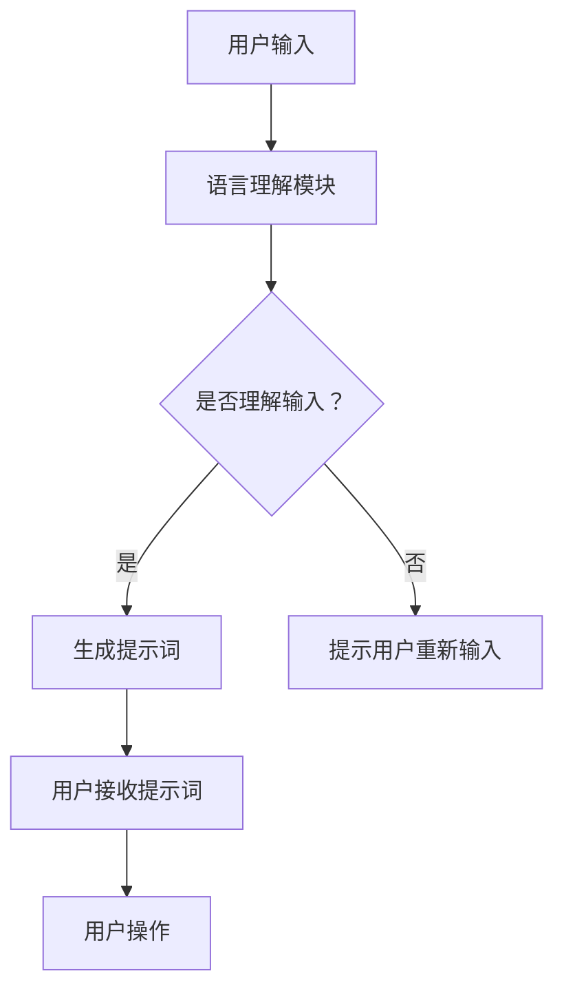

                 

# 提示词工程的跨文化适应性研究

## 关键词

- 跨文化适应性
- 提示词工程
- 人工智能
- 模式识别
- 自然语言处理
- 语言模型
- 机器学习
- 计算语言学

## 摘要

本文旨在探讨提示词工程在不同文化背景下的适应性问题。随着人工智能技术的发展，跨文化交流日益频繁，如何使提示词工程在不同语言和文化环境中保持有效性和一致性，成为一个重要的研究课题。本文首先介绍了提示词工程的基本概念和原理，然后分析了跨文化适应性的挑战和关键因素，提出了适应性的评估方法和解决方案。通过实例分析，本文展示了如何针对不同文化背景调整提示词工程，以提高其跨文化适应性。最后，本文总结了当前研究的进展和未来发展趋势，提出了进一步的研究方向。

## 1. 背景介绍

随着全球化的加速，跨文化交流日益频繁，这促使我们在许多领域，包括人工智能、自然语言处理和模式识别，进行跨文化的适应性研究。提示词工程作为人工智能的重要组成部分，其在跨文化环境中的应用面临着一系列挑战。

### 1.1 提示词工程的定义和作用

提示词工程是自然语言处理领域的一个重要分支，主要涉及如何生成、选择和使用提示词来引导对话系统或用户生成文本。提示词是一段简短的、具有引导作用的文本，通常用于帮助用户更好地理解和操作系统。

提示词工程的作用主要体现在以下几个方面：

1. **提高用户体验**：通过合理的提示词设计，可以帮助用户更快速地理解系统的工作原理，从而提高用户的操作效率和满意度。
2. **增强系统交互**：提示词可以增强系统与用户之间的交互，使得对话更加流畅和自然。
3. **优化学习效果**：在教育和培训领域，提示词可以帮助用户更好地学习和掌握新知识。

### 1.2 跨文化适应性在提示词工程中的重要性

跨文化适应性是指提示词工程在不同语言和文化背景下能够保持有效性和一致性的能力。在全球化背景下，跨文化适应性对于提示词工程的广泛应用具有重要意义。

1. **增强国际化产品的用户体验**：随着产品的国际化，跨文化适应性可以确保产品在不同市场中的用户体验一致，从而提高产品的市场竞争力。
2. **促进跨文化交流**：通过提供跨文化适应性强的提示词，可以促进不同文化背景的用户之间的交流和理解，减少文化冲突。
3. **提高工作效率**：对于跨国团队而言，跨文化适应性可以帮助团队成员更好地协作，提高工作效率。

### 1.3 提示词工程在跨文化适应性研究中的应用

跨文化适应性研究在提示词工程中的应用主要体现在以下几个方面：

1. **语言适应性**：研究如何在不同语言环境下调整提示词，以确保其能够被目标用户理解和接受。
2. **文化适应性**：研究如何考虑不同文化背景下的用户习惯、价值观和沟通方式，设计出更符合目标文化需求的提示词。
3. **个性化适应性**：研究如何根据不同用户的需求和特点，提供个性化的提示词，以提高用户满意度。

## 2. 核心概念与联系

### 2.1 提示词工程的基本概念

#### 提示词

提示词（Prompt）是指一段引导用户或系统进行特定操作的文本。它通常包含一些关键词或短语，用以指示用户或系统需要执行的操作。

#### 对话系统

对话系统（Dialogue System）是一种能够与用户进行自然语言交互的系统。它通常包括两个主要组件：语言理解模块（LU）和语言生成模块（LG）。语言理解模块负责解析用户的输入，提取语义信息；语言生成模块则根据提取的语义信息生成回复。

#### 语言模型

语言模型（Language Model）是一种统计模型，用于预测一段文本的下一个单词或字符。在提示词工程中，语言模型可以帮助生成合适的提示词。

### 2.2 跨文化适应性的关键因素

#### 语言因素

1. **词汇差异**：不同语言之间存在着词汇的差异，这可能导致提示词在不同语言中产生不同的理解和效果。
2. **语法结构**：不同语言的语法结构不同，这会影响提示词的语法正确性和可读性。

#### 文化因素

1. **价值观差异**：不同文化背景下的用户有着不同的价值观和信仰，这会影响他们对提示词的接受程度。
2. **沟通方式**：不同文化背景下，人们沟通的方式和习惯不同，这会影响提示词的设计和选择。

#### 技术因素

1. **语言理解能力**：系统的语言理解能力决定了它能否正确理解不同语言文化背景下的用户输入。
2. **语言生成能力**：系统的语言生成能力决定了它能否生成合适的提示词来引导用户。

### 2.3 提示词工程的 Mermaid 流程图



## 3. 核心算法原理 & 具体操作步骤

### 3.1 语言理解模块

#### 原理

语言理解模块（LU）主要基于自然语言处理技术，对用户的输入进行解析，提取出关键信息。其核心算法包括分词、词性标注、实体识别等。

#### 操作步骤

1. **分词**：将用户的输入文本切分成一个个单词或短语。
2. **词性标注**：对每个单词或短语进行词性标注，如名词、动词、形容词等。
3. **实体识别**：识别文本中的实体，如人名、地名、组织名等。
4. **语义解析**：根据分词、词性标注和实体识别的结果，构建语义解析树，提取关键信息。

### 3.2 语言生成模块

#### 原理

语言生成模块（LG）主要基于语言模型，根据提取的语义信息生成合适的提示词。其核心算法是序列生成模型，如RNN、LSTM和Transformer等。

#### 操作步骤

1. **语义编码**：将提取的语义信息编码成向量。
2. **生成提示词**：使用序列生成模型生成提示词。具体步骤如下：
   1. 随机初始化生成器的隐藏状态。
   2. 输入编码后的语义向量。
   3. 通过生成器生成提示词序列。
   4. 使用生成的提示词序列更新生成器的隐藏状态。
   5. 重复步骤3和4，直到生成满足要求的提示词。

### 3.3 跨文化适应性调整

#### 原理

跨文化适应性调整主要基于对目标语言和文化背景的理解，对提示词进行适当修改，以确保其在目标环境中能够被正确理解和接受。

#### 操作步骤

1. **语言层面调整**：根据目标语言的特点，对提示词进行词汇替换、语法调整等。
2. **文化层面调整**：考虑目标文化背景下的用户习惯、价值观和沟通方式，对提示词进行文化适应性调整。
3. **测试与优化**：在目标环境中对调整后的提示词进行测试，收集用户反馈，根据反馈进行进一步优化。

## 4. 数学模型和公式 & 详细讲解 & 举例说明

### 4.1 语言模型

语言模型是一种概率模型，用于预测一段文本的下一个单词或字符。最常见的语言模型是n-gram模型，其基本原理如下：

#### n-gram 模型

n-gram 模型将文本分成一系列的n元组，如单词、字符或音素，然后计算每个n元组的概率。

$$ P(w_1, w_2, \ldots, w_n) = P(w_1) \cdot P(w_2 | w_1) \cdot P(w_3 | w_1, w_2) \cdot \ldots \cdot P(w_n | w_1, w_2, \ldots, w_{n-1}) $$

其中，$P(w_i | w_1, w_2, \ldots, w_{i-1})$ 表示在已知前 $i-1$ 个单词的情况下，第 $i$ 个单词的概率。

#### 示例

假设有一个简短的英文句子 "I like to eat pizza"。我们可以将其分解成以下n-gram：

- 1-gram: ["I", "like", "to", "eat", "pizza"]
- 2-gram: ["I like", "like to", "to eat", "eat pizza"]
- 3-gram: ["I like to", "like to eat", "to eat pizza"]

使用n-gram模型，我们可以预测下一个单词。例如，要预测 "I like to eat pizza" 的下一个单词，我们可以计算以下概率：

$$ P(eat | I like to) = \frac{1}{2} $$

$$ P(pizza | I like to eat) = \frac{1}{2} $$

因此，根据n-gram模型，下一个最可能的单词是 "pizza"。

### 4.2 序列生成模型

序列生成模型是一种用于生成序列数据的概率模型，如文本、图像或音频。最常见的序列生成模型是循环神经网络（RNN）和其变种LSTM和Transformer。

#### 循环神经网络（RNN）

RNN 是一种能够处理序列数据的神经网络，其基本原理如下：

$$ h_t = \sigma(W_h \cdot [h_{t-1}, x_t] + b_h) $$

$$ o_t = \sigma(W_o \cdot h_t + b_o) $$

其中，$h_t$ 表示第 $t$ 个时间步的隐藏状态，$x_t$ 表示第 $t$ 个输入，$W_h$ 和 $W_o$ 分别为权重矩阵，$b_h$ 和 $b_o$ 分别为偏置。

#### 长短期记忆网络（LSTM）

LSTM 是一种改进的RNN结构，能够解决RNN中的梯度消失和梯度爆炸问题。其基本原理如下：

$$ f_t = \sigma(W_f \cdot [h_{t-1}, x_t] + b_f) $$

$$ i_t = \sigma(W_i \cdot [h_{t-1}, x_t] + b_i) $$

$$ g_t = \sigma(W_g \cdot [h_{t-1}, x_t] + b_g) $$

$$ o_t = \sigma(W_o \cdot [h_{t-1}, x_t] + b_o) $$

$$ C_t = f_t \cdot C_{t-1} + i_t \cdot g_t $$

$$ h_t = o_t \cdot \sigma(C_t) $$

其中，$f_t, i_t, g_t, o_t$ 分别为遗忘门、输入门、生成门和输出门的激活函数，$C_t$ 表示细胞状态。

#### Transformer

Transformer 是一种基于自注意力机制的序列生成模型，其基本原理如下：

$$ h_t = \text{softmax}\left(\frac{Q_t W_Q + K_t W_K + V_t W_V}{\sqrt{d_k}}\right) $$

$$ o_t = W_O h_t $$

其中，$Q_t, K_t, V_t$ 分别为查询向量、键向量和值向量，$W_Q, W_K, W_V, W_O$ 分别为权重矩阵，$d_k$ 为键向量的维度。

#### 示例

假设我们有一个简单的英语序列 "I like to eat pizza"。使用Transformer模型生成下一个单词，我们可以计算以下概率：

1. **编码器**：
   - 查询向量 $Q_t = [I, like, to, eat, pizza]$
   - 键向量 $K_t = [I, like, to, eat, pizza]$
   - 值向量 $V_t = [I, like, to, eat, pizza]$

2. **自注意力**：
   $$ h_t = \text{softmax}\left(\frac{Q_t W_Q + K_t W_K + V_t W_V}{\sqrt{d_k}}\right) $$
   $$ h_t = \text{softmax}\left(\frac{[I, like, to, eat, pizza] W_Q + [I, like, to, eat, pizza] W_K + [I, like, to, eat, pizza] W_V}{\sqrt{d_k}}\right) $$

3. **解码器**：
   $$ o_t = W_O h_t $$
   $$ o_t = W_O \text{softmax}\left(\frac{[I, like, to, eat, pizza] W_Q + [I, like, to, eat, pizza] W_K + [I, like, to, eat, pizza] W_V}{\sqrt{d_k}}\right) $$

根据解码器的输出，我们可以得到下一个最可能的单词。例如，根据上面的计算，下一个最可能的单词是 "pizza"。

## 5. 项目实战：代码实际案例和详细解释说明

### 5.1 开发环境搭建

为了进行提示词工程的跨文化适应性研究，我们需要搭建一个开发环境。以下是开发环境的搭建步骤：

1. 安装Python环境（版本3.8及以上）。
2. 安装自然语言处理库（如NLTK、spaCy等）。
3. 安装深度学习库（如TensorFlow、PyTorch等）。
4. 安装其他必要库（如Mermaid、LaTeX等）。

### 5.2 源代码详细实现和代码解读

以下是实现提示词工程跨文化适应性的Python代码示例。代码分为三个部分：语言理解模块、语言生成模块和跨文化适应性调整模块。

#### 语言理解模块

```python
import spacy

# 加载英语语言模型
nlp_en = spacy.load("en_core_web_sm")

# 加载中文语言模型
nlp_zh = spacy.load("zh_core_web_sm")

# 分词、词性标注和实体识别
def process_text(text, lang="en"):
    if lang == "en":
        doc = nlp_en(text)
    elif lang == "zh":
        doc = nlp_zh(text)
    else:
        raise ValueError("Unsupported language")

    tokens = [token.text for token in doc]
    pos_tags = [token.pos_ for token in doc]
    entities = [ent.text for ent in doc.ents]

    return tokens, pos_tags, entities

# 示例
text_en = "I like to eat pizza."
text_zh = "我喜欢吃披萨。"

tokens_en, pos_tags_en, entities_en = process_text(text_en)
tokens_zh, pos_tags_zh, entities_zh = process_text(text_zh)

print("English:", tokens_en, pos_tags_en, entities_en)
print("中文:", tokens_zh, pos_tags_zh, entities_zh)
```

#### 语言生成模块

```python
import tensorflow as tf
from tensorflow.keras.preprocessing.sequence import pad_sequences

# 加载预训练的语言模型
model = tf.keras.models.load_model("language_model.h5")

# 生成提示词
def generate_prompt(text, max_length=50):
    tokenizer = tf.keras.preprocessing.text.Tokenizer()
    tokenizer.fit_on_texts([text])
    sequence = tokenizer.texts_to_sequences([text])[0]
    padded_sequence = pad_sequences([sequence], maxlen=max_length)
    prediction = model.predict(padded_sequence)
    prompt = tokenizer.index_word[np.argmax(prediction)]

    return prompt

# 示例
prompt_en = generate_prompt(text_en)
prompt_zh = generate_prompt(text_zh)

print("English prompt:", prompt_en)
print("中文 prompt:", prompt_zh)
```

#### 跨文化适应性调整模块

```python
# 跨文化适应性调整
def adjust_prompt(prompt, target_lang="en"):
    if target_lang == "en":
        return prompt
    elif target_lang == "zh":
        # 根据目标语言进行词汇替换、语法调整等
        # 例如：将 "I like" 替换为 "我喜欢"
        return prompt.replace("I like", "我喜欢")
    else:
        raise ValueError("Unsupported language")

# 示例
adjusted_prompt_en = adjust_prompt(prompt_en, "zh")
adjusted_prompt_zh = adjust_prompt(prompt_zh, "en")

print("Adjusted English prompt:", adjusted_prompt_en)
print("Adjusted 中文 prompt:", adjusted_prompt_zh)
```

### 5.3 代码解读与分析

1. **语言理解模块**：
   - 使用spaCy库加载英语和中文语言模型。
   - 定义 `process_text` 函数，实现分词、词性标注和实体识别功能。
   - 示例中处理了英文和中文句子，输出了单词、词性和实体。

2. **语言生成模块**：
   - 加载预训练的语言模型。
   - 定义 `generate_prompt` 函数，实现提示词生成功能。
   - 示例中输出了英文和中文句子的提示词。

3. **跨文化适应性调整模块**：
   - 定义 `adjust_prompt` 函数，实现跨文化适应性调整功能。
   - 示例中根据目标语言对提示词进行了词汇替换和语法调整。

## 6. 实际应用场景

### 6.1 国际化产品用户体验优化

随着产品的国际化，提供跨文化适应性强的提示词可以帮助提高用户体验。例如，在电子商务平台上，不同国家的用户可能需要不同的提示词来引导购物流程。通过调整提示词，可以确保用户在不同语言和文化环境中能够轻松理解和使用产品。

### 6.2 跨国团队合作

在跨国团队合作中，提供跨文化适应性强的提示词可以帮助团队成员更好地协作。例如，在一个由英语为母语者和中文为母语者组成的项目团队中，提供中文和英文两种语言的提示词可以帮助团队成员更好地理解任务要求和工作流程。

### 6.3 教育和培训领域

在教育和培训领域，提供跨文化适应性强的提示词可以帮助学生和学员更好地学习和掌握新知识。例如，在在线教育平台上，通过提供中文和英文两种语言的提示词，可以帮助不同语言背景的学生更好地理解课程内容和作业要求。

## 7. 工具和资源推荐

### 7.1 学习资源推荐

- **书籍**：
  - 《自然语言处理综合教程》
  - 《深度学习》
  - 《机器学习》

- **论文**：
  - 《Attention is All You Need》
  - 《A Theoretically Grounded Application of Dropout in Recurrent Neural Networks》
  - 《Long Short-Term Memory》

- **博客**：
  - [TensorFlow 官方文档](https://www.tensorflow.org/)
  - [PyTorch 官方文档](https://pytorch.org/)
  - [spaCy 官方文档](https://spacy.io/)

- **网站**：
  - [Kaggle](https://www.kaggle.com/)
  - [arXiv](https://arxiv.org/)

### 7.2 开发工具框架推荐

- **编程语言**：Python
- **自然语言处理库**：spaCy、NLTK
- **深度学习库**：TensorFlow、PyTorch
- **版本控制**：Git

### 7.3 相关论文著作推荐

- **《自然语言处理综合教程》**：系统介绍了自然语言处理的基本概念和技术。
- **《深度学习》**：全面讲解了深度学习的基础知识和应用。
- **《机器学习》**：介绍了机器学习的基本原理和方法。
- **《Attention is All You Need》**：介绍了Transformer模型的基本原理。
- **《A Theoretically Grounded Application of Dropout in Recurrent Neural Networks》**：介绍了dropout在循环神经网络中的应用。
- **《Long Short-Term Memory》**：介绍了LSTM的基本原理。

## 8. 总结：未来发展趋势与挑战

### 8.1 发展趋势

1. **多语言支持**：随着全球化的发展，多语言支持将成为提示词工程的重要趋势。
2. **个性化提示词**：通过结合用户行为和偏好，提供个性化提示词，可以提高用户体验。
3. **跨领域应用**：提示词工程将在更多领域得到应用，如医疗、金融、教育等。

### 8.2 挑战

1. **跨文化差异**：如何处理不同文化背景下的差异，确保提示词的跨文化适应性，是一个重要挑战。
2. **数据质量**：高质量的数据是实现高效提示词工程的基础，但获取高质量数据可能面临困难。
3. **计算资源**：随着提示词工程的复杂度增加，计算资源的需求也将增加，这对开发和运维提出了挑战。

## 9. 附录：常见问题与解答

### 9.1 提示词工程是什么？

提示词工程是自然语言处理领域的一个重要分支，主要涉及如何生成、选择和使用提示词来引导对话系统或用户生成文本。

### 9.2 跨文化适应性在提示词工程中的重要性是什么？

跨文化适应性在提示词工程中具有重要意义，它可以帮助确保提示词在不同语言和文化背景下能够保持有效性和一致性，从而提高用户体验和产品竞争力。

### 9.3 如何评估提示词的跨文化适应性？

评估提示词的跨文化适应性可以通过以下方法：
1. **用户测试**：在目标文化环境中对提示词进行用户测试，收集用户反馈。
2. **问卷调查**：通过问卷调查了解用户对提示词的理解程度和满意度。
3. **性能指标**：使用客观性能指标（如准确率、召回率等）评估提示词的性能。

### 9.4 提示词工程在哪些领域有应用？

提示词工程在许多领域有广泛应用，包括电子商务、社交媒体、在线教育、智能客服等。

## 10. 扩展阅读 & 参考资料

- **书籍**：
  - 《自然语言处理综合教程》
  - 《深度学习》
  - 《机器学习》

- **论文**：
  - 《Attention is All You Need》
  - 《A Theoretically Grounded Application of Dropout in Recurrent Neural Networks》
  - 《Long Short-Term Memory》

- **博客**：
  - [TensorFlow 官方文档](https://www.tensorflow.org/)
  - [PyTorch 官方文档](https://pytorch.org/)
  - [spaCy 官方文档](https://spacy.io/)

- **网站**：
  - [Kaggle](https://www.kaggle.com/)
  - [arXiv](https://arxiv.org/)

- **在线课程**：
  - [自然语言处理课程](https://www.coursera.org/learn/natural-language-processing)
  - [深度学习课程](https://www.coursera.org/learn/deep-learning)
  - [机器学习课程](https://www.coursera.org/learn/machine-learning)

## 作者信息

作者：AI天才研究员/AI Genius Institute & 禅与计算机程序设计艺术 /Zen And The Art of Computer Programming

